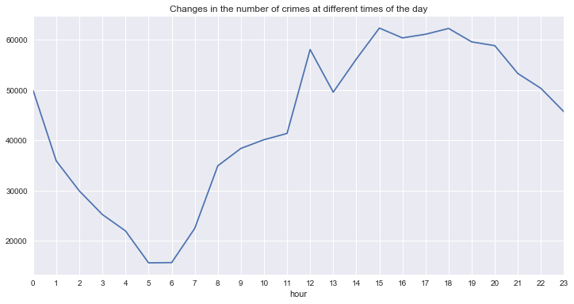
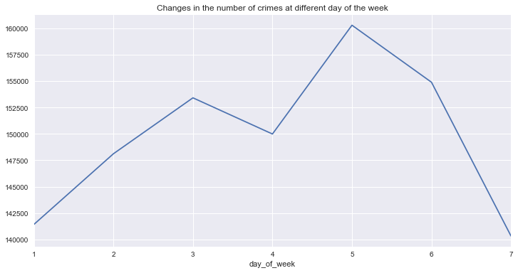
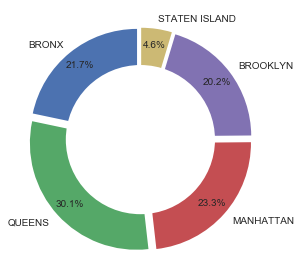
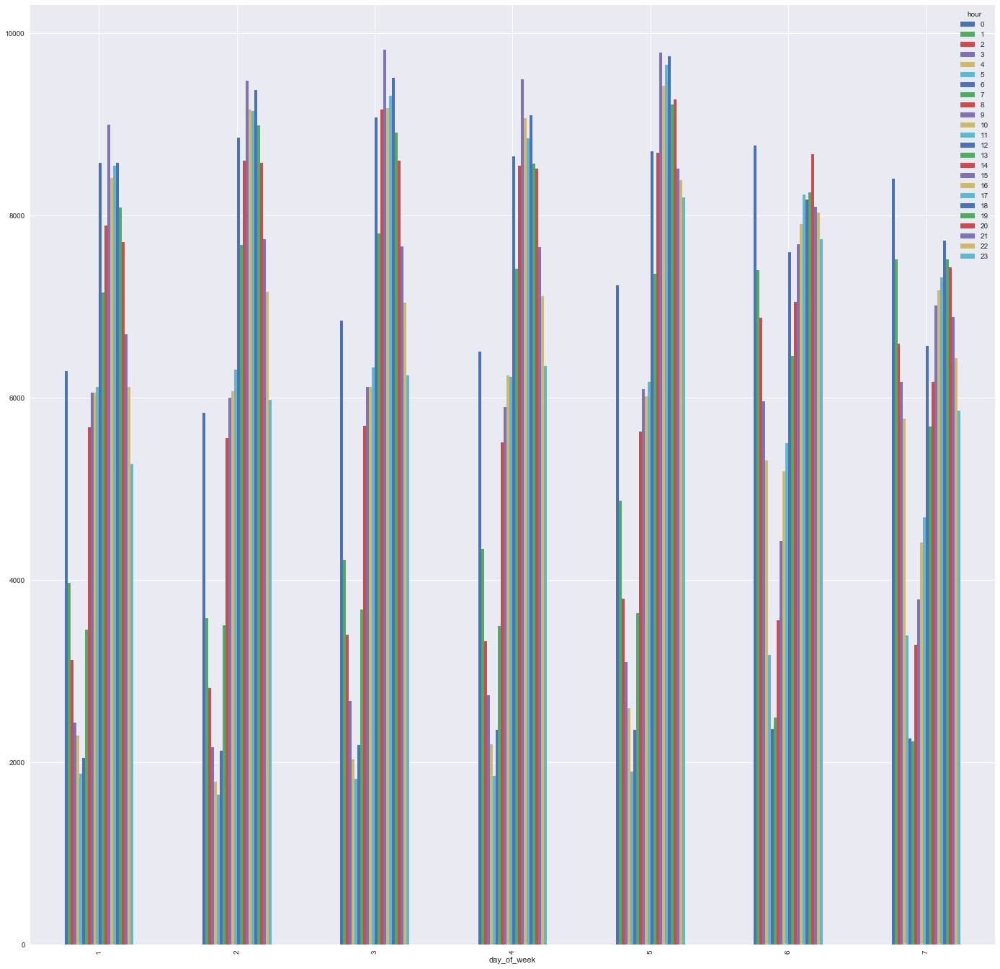

```python
import numpy as np
import pandas as pd
df = pd.read_csv("NYPD_Complaint_Data_Historic.csv", low_memory=False)

```


```python
df.head()
```


<div>
<style scoped>
    .dataframe tbody tr th:only-of-type {
        vertical-align: middle;
    }

    .dataframe tbody tr th {
        vertical-align: top;
    }

    .dataframe thead th {
        text-align: right;
    }
</style>
<table border="1" class="dataframe">
  <thead>
    <tr style="text-align: right;">
      <th></th>
      <th>CMPLNT_NUM</th>
      <th>CMPLNT_FR_DT</th>
      <th>CMPLNT_FR_TM</th>
      <th>CMPLNT_TO_DT</th>
      <th>CMPLNT_TO_TM</th>
      <th>RPT_DT</th>
      <th>KY_CD</th>
      <th>OFNS_DESC</th>
      <th>PD_CD</th>
      <th>PD_DESC</th>
      <th>...</th>
      <th>ADDR_PCT_CD</th>
      <th>LOC_OF_OCCUR_DESC</th>
      <th>PREM_TYP_DESC</th>
      <th>PARKS_NM</th>
      <th>HADEVELOPT</th>
      <th>X_COORD_CD</th>
      <th>Y_COORD_CD</th>
      <th>Latitude</th>
      <th>Longitude</th>
      <th>Lat_Lon</th>
    </tr>
  </thead>
  <tbody>
    <tr>
      <th>0</th>
      <td>101109527</td>
      <td>12/31/2015</td>
      <td>23:45:00</td>
      <td>NaN</td>
      <td>NaN</td>
      <td>12/31/2015</td>
      <td>113</td>
      <td>FORGERY</td>
      <td>729.0</td>
      <td>FORGERY,ETC.,UNCLASSIFIED-FELO</td>
      <td>...</td>
      <td>44.0</td>
      <td>INSIDE</td>
      <td>BAR/NIGHT CLUB</td>
      <td>NaN</td>
      <td>NaN</td>
      <td>1007314.0</td>
      <td>241257.0</td>
      <td>40.828848</td>
      <td>-73.916661</td>
      <td>(40.828848333, -73.916661142)</td>
    </tr>
    <tr>
      <th>1</th>
      <td>153401121</td>
      <td>12/31/2015</td>
      <td>23:36:00</td>
      <td>NaN</td>
      <td>NaN</td>
      <td>12/31/2015</td>
      <td>101</td>
      <td>MURDER &amp; NON-NEGL. MANSLAUGHTER</td>
      <td>NaN</td>
      <td>NaN</td>
      <td>...</td>
      <td>103.0</td>
      <td>OUTSIDE</td>
      <td>NaN</td>
      <td>NaN</td>
      <td>NaN</td>
      <td>1043991.0</td>
      <td>193406.0</td>
      <td>40.697338</td>
      <td>-73.784557</td>
      <td>(40.697338138, -73.784556739)</td>
    </tr>
    <tr>
      <th>2</th>
      <td>569369778</td>
      <td>12/31/2015</td>
      <td>23:30:00</td>
      <td>NaN</td>
      <td>NaN</td>
      <td>12/31/2015</td>
      <td>117</td>
      <td>DANGEROUS DRUGS</td>
      <td>503.0</td>
      <td>CONTROLLED SUBSTANCE,INTENT TO</td>
      <td>...</td>
      <td>28.0</td>
      <td>NaN</td>
      <td>OTHER</td>
      <td>NaN</td>
      <td>NaN</td>
      <td>999463.0</td>
      <td>231690.0</td>
      <td>40.802607</td>
      <td>-73.945052</td>
      <td>(40.802606608, -73.945051911)</td>
    </tr>
    <tr>
      <th>3</th>
      <td>968417082</td>
      <td>12/31/2015</td>
      <td>23:30:00</td>
      <td>NaN</td>
      <td>NaN</td>
      <td>12/31/2015</td>
      <td>344</td>
      <td>ASSAULT 3 &amp; RELATED OFFENSES</td>
      <td>101.0</td>
      <td>ASSAULT 3</td>
      <td>...</td>
      <td>105.0</td>
      <td>INSIDE</td>
      <td>RESIDENCE-HOUSE</td>
      <td>NaN</td>
      <td>NaN</td>
      <td>1060183.0</td>
      <td>177862.0</td>
      <td>40.654549</td>
      <td>-73.726339</td>
      <td>(40.654549444, -73.726338791)</td>
    </tr>
    <tr>
      <th>4</th>
      <td>641637920</td>
      <td>12/31/2015</td>
      <td>23:25:00</td>
      <td>12/31/2015</td>
      <td>23:30:00</td>
      <td>12/31/2015</td>
      <td>344</td>
      <td>ASSAULT 3 &amp; RELATED OFFENSES</td>
      <td>101.0</td>
      <td>ASSAULT 3</td>
      <td>...</td>
      <td>13.0</td>
      <td>FRONT OF</td>
      <td>OTHER</td>
      <td>NaN</td>
      <td>NaN</td>
      <td>987606.0</td>
      <td>208148.0</td>
      <td>40.738002</td>
      <td>-73.987891</td>
      <td>(40.7380024, -73.98789129)</td>
    </tr>
  </tbody>
</table>
<p>5 rows × 24 columns</p>
</div>


```python
df = df[~((df['CMPLNT_FR_DT'].isnull()) |(df['CMPLNT_FR_TM'].isnull()))]
```


```python
df.info()
```

    <class 'pandas.core.frame.DataFrame'>
    Int64Index: 1048510 entries, 0 to 1048574
    Data columns (total 24 columns):
    CMPLNT_NUM           1048510 non-null int64
    CMPLNT_FR_DT         1048510 non-null object
    CMPLNT_FR_TM         1048510 non-null object
    CMPLNT_TO_DT         842565 non-null object
    CMPLNT_TO_TM         842951 non-null object
    RPT_DT               1048510 non-null object
    KY_CD                1048510 non-null int64
    OFNS_DESC            1045630 non-null object
    PD_CD                1047777 non-null float64
    PD_DESC              1047777 non-null object
    CRM_ATPT_CPTD_CD     1048509 non-null object
    LAW_CAT_CD           1048510 non-null object
    JURIS_DESC           1048510 non-null object
    BORO_NM              1048510 non-null object
    ADDR_PCT_CD          1048509 non-null float64
    LOC_OF_OCCUR_DESC    830766 non-null object
    PREM_TYP_DESC        1043821 non-null object
    PARKS_NM             7599 non-null object
    HADEVELOPT           51772 non-null object
    X_COORD_CD           1016095 non-null float64
    Y_COORD_CD           1016095 non-null float64
    Latitude             1016095 non-null float64
    Longitude            1016095 non-null float64
    Lat_Lon              1016095 non-null object
    dtypes: float64(6), int64(2), object(16)
    memory usage: 200.0+ MB


```python
def DTTM(dt,tm):
    return dt + ' ' + tm
```


```python
result = []
for dt, tm in zip(df['CMPLNT_FR_DT'], df['CMPLNT_FR_TM']):
    result.append(DTTM(dt,tm))
```


```python
df['CMPLNT_FR'] = result
```


```python
#Convert string data to datetime object
import datetime
df['CMPLNT_FR'] = df['CMPLNT_FR'].apply(lambda x:datetime.datetime.strptime(x,'%m/%d/%Y %H:%M:%S'))
```


```python
#Get weekday and hour from date
df['day_of_week'] = df['CMPLNT_FR'].apply(lambda x: x.isoweekday())
df['hour'] = df['CMPLNT_FR'].apply(lambda x: x.hour)
```


```python
%matplotlib inline
import matplotlib.pyplot as plt
import seaborn as sns
plt.style.use('seaborn')
```


```python
#Changes in the number of crimes at different times of the day
plt.xticks(range(0,24))
df.groupby(['hour']).size().plot(kind="line",figsize=(12,6))
```


    <matplotlib.axes._subplots.AxesSubplot at 0x1a86f41898>





```python
#Changes in the number of crimes at different day of the week
df.groupby(['day_of_week']).size().plot(kind="line",figsize=(12,6))
```


    <matplotlib.axes._subplots.AxesSubplot at 0x121526eb8>





```python
labels = list(df['BORO_NM'].unique())
sizes = df[~df['BORO_NM'].isnull()].groupby(['BORO_NM']).size()
explode = (0.05,0.05,0.05,0.05,0.05)
 
plt.pie(sizes, labels=labels, autopct='%1.1f%%', startangle=90, pctdistance=0.85, explode = explode)

centre_circle = plt.Circle((0,0),0.70,fc='white')
fig = plt.gcf()
fig.gca().add_artist(centre_circle)
plt.tight_layout()
plt.show()
```





```python
df.groupby(['day_of_week', 'hour']).size().unstack().plot(kind="bar",figsize=(24,24))

```


    <matplotlib.axes._subplots.AxesSubplot at 0x1307db278>





```python
df.info()
```

    <class 'pandas.core.frame.DataFrame'>
    Int64Index: 1048510 entries, 0 to 1048574
    Data columns (total 27 columns):
    CMPLNT_NUM           1048510 non-null int64
    CMPLNT_FR_DT         1048510 non-null object
    CMPLNT_FR_TM         1048510 non-null object
    CMPLNT_TO_DT         842565 non-null object
    CMPLNT_TO_TM         842951 non-null object
    RPT_DT               1048510 non-null object
    KY_CD                1048510 non-null int64
    OFNS_DESC            1045630 non-null object
    PD_CD                1047777 non-null float64
    PD_DESC              1047777 non-null object
    CRM_ATPT_CPTD_CD     1048509 non-null object
    LAW_CAT_CD           1048510 non-null object
    JURIS_DESC           1048510 non-null object
    BORO_NM              1048510 non-null object
    ADDR_PCT_CD          1048509 non-null float64
    LOC_OF_OCCUR_DESC    830766 non-null object
    PREM_TYP_DESC        1043821 non-null object
    PARKS_NM             7599 non-null object
    HADEVELOPT           51772 non-null object
    X_COORD_CD           1016095 non-null float64
    Y_COORD_CD           1016095 non-null float64
    Latitude             1016095 non-null float64
    Longitude            1016095 non-null float64
    Lat_Lon              1016095 non-null object
    CMPLNT_FR            1048510 non-null object
    day_of_week          1048510 non-null int64
    hour                 1048510 non-null int64
    dtypes: float64(6), int64(4), object(17)
    memory usage: 224.0+ MB


```python
def createZoneTable(zone_factor,westlimit=-74.2635, southlimit=40.4856, eastlimit=-73.7526, northlimit=40.9596):
    zone_table = list()
    #Your code goes here
    logi = (eastlimit - westlimit) / zone_factor
    lati = (northlimit - southlimit) / zone_factor
    i = 0
    j = 0
    for lat in range(zone_factor):
        westlimit = -74.2635
        j = 0
        for log in range(zone_factor):
            lola = [[westlimit,southlimit],[westlimit+logi,southlimit],[westlimit+logi,southlimit+lati],[westlimit,southlimit+lati],[westlimit,southlimit]]
            zone = ((str(i)+"_"+str(j)),lola)
            zone_table.append(zone)
            j += 1
            westlimit += logi
        southlimit+= lati
        i += 1
    return zone_table
```


```python
def createGeoJsonObject(zone_table):
    zone_data_dict = dict()
    zone_data_dict['type'] = 'FeatureCollection'
    zone_data_dict_features = list()
    zone_data_dict['features'] = zone_data_dict_features
    
    #Your code goes here
    for i in range(len(zone_table)):
        subzone = dict()
        subzone["geometry"] = {'coordinates': [zone_table[i][1]], 'type': 'Polygon'}
        subzone["properties"] = {'zone_id': zone_table[i][0]}
        subzone["type"] = 'Feature'
        zone_data_dict_features.append(subzone)   
    
    return zone_data_dict
```


```python
#Sat Zone factor to 30
zone_table = createZoneTable(30)
```


```python
def get_zone(lat,lon,zone_table):
    
    #Your code goes here
    for i in range(len(zone_table)):
        while (lon > zone_table[i][1][0][0]) & (lon < zone_table[i][1][1][0]) & (lat > zone_table[i][1][1][1]) & (lat < zone_table[i][1][2][1]):
            return zone_table[i][0]
            break
```


```python
df['zone'] = df.apply(lambda x:get_zone(x["Latitude"],x["Longitude"],zone_table),axis=1)


```


```python
zones = df[~df['zone'].isnull()].groupby('zone')
counts = pd.DataFrame(zones.size())
counts.rename(columns={0:"counts"},inplace=True)
counts.reset_index(level=0,inplace=True)
```


```python
counts.head()
```


<div>
<style scoped>
    .dataframe tbody tr th:only-of-type {
        vertical-align: middle;
    }

    .dataframe tbody tr th {
        vertical-align: top;
    }

    .dataframe thead th {
        text-align: right;
    }
</style>
<table border="1" class="dataframe">
  <thead>
    <tr style="text-align: right;">
      <th></th>
      <th>zone</th>
      <th>counts</th>
    </tr>
  </thead>
  <tbody>
    <tr>
      <th>0</th>
      <td>0_1</td>
      <td>52</td>
    </tr>
    <tr>
      <th>1</th>
      <td>10_10</td>
      <td>1361</td>
    </tr>
    <tr>
      <th>2</th>
      <td>10_14</td>
      <td>2749</td>
    </tr>
    <tr>
      <th>3</th>
      <td>10_15</td>
      <td>3196</td>
    </tr>
    <tr>
      <th>4</th>
      <td>10_16</td>
      <td>1270</td>
    </tr>
  </tbody>
</table>
</div>


```python
import folium
new_map = folium.Map(location = [40.4856, -74.2635],zoom_start=10)
new_map.choropleth(geo_data=createGeoJsonObject(zone_table), data=counts,
             columns=['zone','counts'],
             key_on='feature.properties.zone_id',
             fill_color='RdYlGn', fill_opacity=0.7, line_opacity=0.8,
             legend_name='Distribution of Client')
```


```python
new_map.save('new_map.html')
```


```python
new_map
```


<div style="width:100%;"><div style="position:relative;width:100%;height:0;padding-bottom:60%;"><iframe src="data:text/html;charset=utf-8;base64,PCFET0NUWVBFIGh0bWw+CjxoZWFkPiAgICAKICAgIDxtZXRhIGh0dHAtZXF1aXY9ImNvbnRlbnQtdHlwZSIgY29udGVudD0idGV4dC9odG1sOyBjaGFyc2V0PVVURi04IiAvPgogICAgCiAgICAgICAgPHNjcmlwdD4KICAgICAgICAgICAgTF9OT19UT1VDSCA9IGZhbHNlOwogICAgICAgICAgICBMX0RJU0FCTEVfM0QgPSBmYWxzZTsKICAgICAgICA8L3NjcmlwdD4KICAgIAogICAgPHNjcmlwdCBzcmM9Imh0dHBzOi8vY2RuLmpzZGVsaXZyLm5ldC9ucG0vbGVhZmxldEAxLjUuMS9kaXN0L2xlYWZsZXQuanMiPjwvc2NyaXB0PgogICAgPHNjcmlwdCBzcmM9Imh0dHBzOi8vY29kZS5qcXVlcnkuY29tL2pxdWVyeS0xLjEyLjQubWluLmpzIj48L3NjcmlwdD4KICAgIDxzY3JpcHQgc3JjPSJodHRwczovL21heGNkbi5ib290c3RyYXBjZG4uY29tL2Jvb3RzdHJhcC8zLjIuMC9qcy9ib290c3RyYXAubWluLmpzIj48L3NjcmlwdD4KICAgIDxzY3JpcHQgc3JjPSJodHRwczovL2NkbmpzLmNsb3VkZmxhcmUuY29tL2FqYXgvbGlicy9MZWFmbGV0LmF3ZXNvbWUtbWFya2Vycy8yLjAuMi9sZWFmbGV0LmF3ZXNvbWUtbWFya2Vycy5qcyI+PC9zY3JpcHQ+CiAgICA8bGluayByZWw9InN0eWxlc2hlZXQiIGhyZWY9Imh0dHBzOi8vY2RuLmpzZGVsaXZyLm5ldC9ucG0vbGVhZmxldEAxLjUuMS9kaXN0L2xlYWZsZXQuY3NzIi8+CiAgICA8bGluayByZWw9InN0eWxlc2hlZXQiIGhyZWY9Imh0dHBzOi8vbWF4Y2RuLmJvb3RzdHJhcGNkbi5jb20vYm9vdHN0cmFwLzMuMi4wL2Nzcy9ib290c3RyYXAubWluLmNzcyIvPgogICAgPGxpbmsgcmVsPSJzdHlsZXNoZWV0IiBocmVmPSJodHRwczovL21heGNkbi5ib290c3RyYXBjZG4uY29tL2Jvb3RzdHJhcC8zLjIuMC9jc3MvYm9vdHN0cmFwLXRoZW1lLm1pbi5jc3MiLz4KICAgIDxsaW5rIHJlbD0ic3R5bGVzaGVldCIgaHJlZj0iaHR0cHM6Ly9tYXhjZG4uYm9vdHN0cmFwY2RuLmNvbS9mb250LWF3ZXNvbWUvNC42LjMvY3NzL2ZvbnQtYXdlc29tZS5taW4uY3NzIi8+CiAgICA8bGluayByZWw9InN0eWxlc2hlZXQiIGhyZWY9Imh0dHBzOi8vY2RuanMuY2xvdWRmbGFyZS5jb20vYWpheC9saWJzL0xlYWZsZXQuYXdlc29tZS1tYXJrZXJzLzIuMC4yL2xlYWZsZXQuYXdlc29tZS1tYXJrZXJzLmNzcyIvPgogICAgPGxpbmsgcmVsPSJzdHlsZXNoZWV0IiBocmVmPSJodHRwczovL3Jhd2Nkbi5naXRoYWNrLmNvbS9weXRob24tdmlzdWFsaXphdGlvbi9mb2xpdW0vbWFzdGVyL2ZvbGl1bS90ZW1wbGF0ZXMvbGVhZmxldC5hd2Vzb21lLnJvdGF0ZS5jc3MiLz4KICAgIDxzdHlsZT5odG1sLCBib2R5IHt3aWR0aDogMTAwJTtoZWlnaHQ6IDEwMCU7bWFyZ2luOiAwO3BhZGRpbmc6IDA7fTwvc3R5bGU+CiAgICA8c3R5bGU+I21hcCB7cG9zaXRpb246YWJzb2x1dGU7dG9wOjA7Ym90dG9tOjA7cmlnaHQ6MDtsZWZ0OjA7fTwvc3R5bGU+CiAgICAKICAgICAgICAgICAgPG1ldGEgbmFtZT0idmlld3BvcnQiIGNvbnRlbnQ9IndpZHRoPWRldmljZS13aWR0aCwKICAgICAgICAgICAgICAgIGluaXRpYWwtc2NhbGU9MS4wLCBtYXhpbXVtLXNjYWxlPTEuMCwgdXNlci1zY2FsYWJsZT1ubyIgLz4KICAgICAgICAgICAgPHN0eWxlPgogICAgICAgICAgICAgICAgI21hcF8yMzM2Zjg5ZTdkNGE0MmU5ODY3MTQ1YzJlZjg1MDU0OCB7CiAgICAgICAgICAgICAgICAgICAgcG9zaXRpb246IHJlbGF0aXZlOwogICAgICAgICAgICAgICAgICAgIHdpZHRoOiAxMDAuMCU7CiAgICAgICAgICAgICAgICAgICAgaGVpZ2h0OiAxMDAuMCU7CiAgICAgICAgICAgICAgICAgICAgbGVmdDogMC4wJTsKICAgICAgICAgICAgICAgICAgICB0b3A6IDAuMCU7CiAgICAgICAgICAgICAgICB9CiAgICAgICAgICAgIDwvc3R5bGU+CiAgICAgICAgCiAgICA8c2NyaXB0IHNyYz0iaHR0cHM6Ly9jZG5qcy5jbG91ZGZsYXJlLmNvbS9hamF4L2xpYnMvZDMvMy41LjUvZDMubWluLmpzIj48L3NjcmlwdD4KPC9oZWFkPgo8Ym9keT4gICAgCiAgICAKICAgICAgICAgICAgPGRpdiBjbGFzcz0iZm9saXVtLW1hcCIgaWQ9Im1hcF8yMzM2Zjg5ZTdkNGE0MmU5ODY3MTQ1YzJlZjg1MDU0OCIgPjwvZGl2PgogICAgICAgIAo8L2JvZHk+CjxzY3JpcHQ+ICAgIAogICAgCiAgICAgICAgICAgIHZhciBtYXBfMjMzNmY4OWU3ZDRhNDJlOTg2NzE0NWMyZWY4NTA1NDggPSBMLm1hcCgKICAgICAgICAgICAgICAgICJtYXBfMjMzNmY4OWU3ZDRhNDJlOTg2NzE0NWMyZWY4NTA1NDgiLAogICAgICAgICAgICAgICAgewogICAgICAgICAgICAgICAgICAgIGNlbnRlcjogWzQwLjQ4NTYsIC03NC4yNjM1XSwKICAgICAgICAgICAgICAgICAgICBjcnM6IEwuQ1JTLkVQU0czODU3LAogICAgICAgICAgICAgICAgICAgIHpvb206IDEwLAogICAgICAgICAgICAgICAgICAgIHpvb21Db250cm9sOiB0cnVlLAogICAgICAgICAgICAgICAgICAgIHByZWZlckNhbnZhczogZmFsc2UsCiAgICAgICAgICAgICAgICB9CiAgICAgICAgICAgICk7CgogICAgICAgICAgICAKCiAgICAgICAgCiAgICAKICAgICAgICAgICAgdmFyIHRpbGVfbGF5ZXJfODllMmJhZTliNjg2NDQ1NWIwMzZiN2ZlNmZlYTc3MDQgPSBMLnRpbGVMYXllcigKICAgICAgICAgICAgICAgICJodHRwczovL3tzfS50aWxlLm9wZW5zdHJlZXRtYXAub3JnL3t6fS97eH0ve3l9LnBuZyIsCiAgICAgICAgICAgICAgICB7ImF0dHJpYnV0aW9uIjogIkRhdGEgYnkgXHUwMDI2Y29weTsgXHUwMDNjYSBocmVmPVwiaHR0cDovL29wZW5zdHJlZXRtYXAub3JnXCJcdTAwM2VPcGVuU3RyZWV0TWFwXHUwMDNjL2FcdTAwM2UsIHVuZGVyIFx1MDAzY2EgaHJlZj1cImh0dHA6Ly93d3cub3BlbnN0cmVldG1hcC5vcmcvY29weXJpZ2h0XCJcdTAwM2VPRGJMXHUwMDNjL2FcdTAwM2UuIiwgImRldGVjdFJldGluYSI6IGZhbHNlLCAibWF4TmF0aXZlWm9vbSI6IDE4LCAibWF4Wm9vbSI6IDE4LCAibWluWm9vbSI6IDAsICJub1dyYXAiOiBmYWxzZSwgIm9wYWNpdHkiOiAxLCAic3ViZG9tYWlucyI6ICJhYmMiLCAidG1zIjogZmFsc2V9CiAgICAgICAgICAgICkuYWRkVG8obWFwXzIzMzZmODllN2Q0YTQyZTk4NjcxNDVjMmVmODUwNTQ4KTsKICAgICAgICAKICAgIAogICAgICAgICAgICB2YXIgY2hvcm9wbGV0aF85MjM1ZmE0YzBmZDg0MzE5YmRjYjUwZTAwNTYzYTBmNSA9IEwuZmVhdHVyZUdyb3VwKAogICAgICAgICAgICAgICAge30KICAgICAgICAgICAgKS5hZGRUbyhtYXBfMjMzNmY4OWU3ZDRhNDJlOTg2NzE0NWMyZWY4NTA1NDgpOwogICAgICAgIAogICAgCiAgICAgICAgZnVuY3Rpb24gZ2VvX2pzb25fMDM2YWQ3MGQ2ZmEyNDMwZWJmNTI4YzliZTcxMjM3MTVfc3R5bGVyKGZlYXR1cmUpIHsKICAgICAgICAgICAgc3dpdGNoKGZlYXR1cmUucHJvcGVydGllcy56b25lX2lkKSB7CiAgICAgICAgICAgICAgICBjYXNlICIwXzEiOiBjYXNlICIxXzAiOiBjYXNlICIxXzEiOiBjYXNlICIxXzIiOiBjYXNlICIxXzMiOiBjYXNlICIxXzQiOiBjYXNlICIyXzEiOiBjYXNlICIyXzIiOiBjYXNlICIyXzMiOiBjYXNlICIyXzQiOiBjYXNlICIyXzUiOiBjYXNlICIyXzYiOiBjYXNlICIzXzEiOiBjYXNlICIzXzIiOiBjYXNlICIzXzMiOiBjYXNlICIzXzQiOiBjYXNlICIzXzUiOiBjYXNlICIzXzYiOiBjYXNlICIzXzciOiBjYXNlICI0XzIiOiBjYXNlICI0XzMiOiBjYXNlICI0XzQiOiBjYXNlICI0XzUiOiBjYXNlICI0XzYiOiBjYXNlICI0XzciOiBjYXNlICI0XzgiOiBjYXNlICI0XzkiOiBjYXNlICI0XzE5IjogY2FzZSAiNF8yMCI6IGNhc2UgIjRfMjEiOiBjYXNlICI1XzQiOiBjYXNlICI1XzUiOiBjYXNlICI1XzYiOiBjYXNlICI1XzciOiBjYXNlICI1XzgiOiBjYXNlICI1XzkiOiBjYXNlICI1XzEwIjogY2FzZSAiNV8xNCI6IGNhc2UgIjVfMTUiOiBjYXNlICI1XzE3IjogY2FzZSAiNV8xOCI6IGNhc2UgIjVfMTkiOiBjYXNlICI1XzIxIjogY2FzZSAiNV8yMiI6IGNhc2UgIjVfMjMiOiBjYXNlICI1XzI0IjogY2FzZSAiNV8yNSI6IGNhc2UgIjZfMyI6IGNhc2UgIjZfNCI6IGNhc2UgIjZfNSI6IGNhc2UgIjZfNiI6IGNhc2UgIjZfNyI6IGNhc2UgIjZfOCI6IGNhc2UgIjZfOSI6IGNhc2UgIjZfMTAiOiBjYXNlICI2XzExIjogY2FzZSAiNl8xNSI6IGNhc2UgIjZfMTYiOiBjYXNlICI2XzE3IjogY2FzZSAiNl8xOCI6IGNhc2UgIjZfMTkiOiBjYXNlICI2XzIwIjogY2FzZSAiNl8yMSI6IGNhc2UgIjZfMjQiOiBjYXNlICI2XzI1IjogY2FzZSAiNl8yNiI6IGNhc2UgIjZfMjciOiBjYXNlICI2XzI4IjogY2FzZSAiNl8yOSI6IGNhc2UgIjdfMyI6IGNhc2UgIjdfNCI6IGNhc2UgIjdfNSI6IGNhc2UgIjdfNiI6IGNhc2UgIjdfNyI6IGNhc2UgIjdfOCI6IGNhc2UgIjdfOSI6IGNhc2UgIjdfMTAiOiBjYXNlICI3XzExIjogY2FzZSAiN18xMiI6IGNhc2UgIjdfMTMiOiBjYXNlICI3XzE0IjogY2FzZSAiN18xNyI6IGNhc2UgIjdfMTgiOiBjYXNlICI3XzE5IjogY2FzZSAiN18yMCI6IGNhc2UgIjdfMjEiOiBjYXNlICI3XzI1IjogY2FzZSAiN18yNiI6IGNhc2UgIjdfMjciOiBjYXNlICI3XzI4IjogY2FzZSAiOF80IjogY2FzZSAiOF81IjogY2FzZSAiOF82IjogY2FzZSAiOF83IjogY2FzZSAiOF84IjogY2FzZSAiOF85IjogY2FzZSAiOF8xMSI6IGNhc2UgIjhfMTQiOiBjYXNlICI4XzE1IjogY2FzZSAiOF8xNiI6IGNhc2UgIjhfMTciOiBjYXNlICI4XzE4IjogY2FzZSAiOF8xOSI6IGNhc2UgIjhfMjAiOiBjYXNlICI4XzIxIjogY2FzZSAiOF8yNSI6IGNhc2UgIjhfMjYiOiBjYXNlICI4XzI4IjogY2FzZSAiOF8yOSI6IGNhc2UgIjlfNCI6IGNhc2UgIjlfNSI6IGNhc2UgIjlfNiI6IGNhc2UgIjlfNyI6IGNhc2UgIjlfOCI6IGNhc2UgIjlfOSI6IGNhc2UgIjlfMTEiOiBjYXNlICI5XzEzIjogY2FzZSAiOV8xNiI6IGNhc2UgIjlfMTkiOiBjYXNlICI5XzIxIjogY2FzZSAiOV8yMiI6IGNhc2UgIjEwXzgiOiBjYXNlICIxMF85IjogY2FzZSAiMTBfMTAiOiBjYXNlICIxMF8xNCI6IGNhc2UgIjEwXzE1IjogY2FzZSAiMTBfMTYiOiBjYXNlICIxMF8yMiI6IGNhc2UgIjEwXzIzIjogY2FzZSAiMTBfMjQiOiBjYXNlICIxMF8yNSI6IGNhc2UgIjEwXzI4IjogY2FzZSAiMTBfMjkiOiBjYXNlICIxMV8xNCI6IGNhc2UgIjExXzE1IjogY2FzZSAiMTFfMjQiOiBjYXNlICIxMV8yNSI6IGNhc2UgIjExXzI2IjogY2FzZSAiMTFfMjciOiBjYXNlICIxMV8yOCI6IGNhc2UgIjExXzI5IjogY2FzZSAiMTJfMTQiOiBjYXNlICIxMl8yMSI6IGNhc2UgIjEyXzI2IjogY2FzZSAiMTJfMjciOiBjYXNlICIxMl8yOSI6IGNhc2UgIjEzXzE0IjogY2FzZSAiMTNfMTUiOiBjYXNlICIxM18yMiI6IGNhc2UgIjEzXzIzIjogY2FzZSAiMTNfMjQiOiBjYXNlICIxM18yOCI6IGNhc2UgIjEzXzI5IjogY2FzZSAiMTRfMTkiOiBjYXNlICIxNF8yMCI6IGNhc2UgIjE0XzIxIjogY2FzZSAiMTRfMjIiOiBjYXNlICIxNF8yMyI6IGNhc2UgIjE0XzI0IjogY2FzZSAiMTRfMjUiOiBjYXNlICIxNF8yNiI6IGNhc2UgIjE0XzI4IjogY2FzZSAiMTRfMjkiOiBjYXNlICIxNV8xNCI6IGNhc2UgIjE1XzE3IjogY2FzZSAiMTVfMTgiOiBjYXNlICIxNV8xOSI6IGNhc2UgIjE1XzIwIjogY2FzZSAiMTVfMjEiOiBjYXNlICIxNV8yMiI6IGNhc2UgIjE1XzI0IjogY2FzZSAiMTVfMjUiOiBjYXNlICIxNV8yNiI6IGNhc2UgIjE1XzI3IjogY2FzZSAiMTVfMjgiOiBjYXNlICIxNV8yOSI6IGNhc2UgIjE2XzE0IjogY2FzZSAiMTZfMTciOiBjYXNlICIxNl8xOCI6IGNhc2UgIjE2XzE5IjogY2FzZSAiMTZfMjQiOiBjYXNlICIxNl8yNSI6IGNhc2UgIjE2XzI2IjogY2FzZSAiMTZfMjciOiBjYXNlICIxNl8yOCI6IGNhc2UgIjE2XzI5IjogY2FzZSAiMTdfMTgiOiBjYXNlICIxN18yMSI6IGNhc2UgIjE3XzIzIjogY2FzZSAiMTdfMjQiOiBjYXNlICIxN18yNiI6IGNhc2UgIjE3XzI3IjogY2FzZSAiMTdfMjgiOiBjYXNlICIxN18yOSI6IGNhc2UgIjE4XzE1IjogY2FzZSAiMThfMTciOiBjYXNlICIxOF8xOSI6IGNhc2UgIjE4XzIwIjogY2FzZSAiMThfMjEiOiBjYXNlICIxOF8yMiI6IGNhc2UgIjE4XzIzIjogY2FzZSAiMThfMjQiOiBjYXNlICIxOF8yNSI6IGNhc2UgIjE4XzI2IjogY2FzZSAiMThfMjciOiBjYXNlICIxOF8yOCI6IGNhc2UgIjE4XzI5IjogY2FzZSAiMTlfMTYiOiBjYXNlICIxOV8yMCI6IGNhc2UgIjE5XzIyIjogY2FzZSAiMTlfMjQiOiBjYXNlICIxOV8yNSI6IGNhc2UgIjE5XzI2IjogY2FzZSAiMTlfMjciOiBjYXNlICIxOV8yOCI6IGNhc2UgIjIwXzIyIjogY2FzZSAiMjBfMjMiOiBjYXNlICIyMF8yNCI6IGNhc2UgIjIwXzI1IjogY2FzZSAiMjBfMjYiOiBjYXNlICIyMF8yNyI6IGNhc2UgIjIxXzE3IjogY2FzZSAiMjFfMjUiOiBjYXNlICIyMV8yNiI6IGNhc2UgIjIyXzI1IjogY2FzZSAiMjJfMjYiOiBjYXNlICIyMl8yNyI6IGNhc2UgIjIyXzI4IjogY2FzZSAiMjNfMTgiOiBjYXNlICIyM18yNCI6IGNhc2UgIjIzXzI1IjogY2FzZSAiMjNfMjYiOiBjYXNlICIyM18yNyI6IGNhc2UgIjIzXzI4IjogY2FzZSAiMjRfMTkiOiBjYXNlICIyNF8yNiI6IGNhc2UgIjI0XzI3IjogY2FzZSAiMjVfMjAiOiBjYXNlICIyNV8yMSI6IGNhc2UgIjI1XzIyIjogY2FzZSAiMjVfMjUiOiBjYXNlICIyNV8yNiI6IGNhc2UgIjI1XzI3IjogY2FzZSAiMjZfMjAiOiBjYXNlICIyNl8yMSI6IGNhc2UgIjI2XzIyIjogY2FzZSAiMjZfMjMiOiBjYXNlICIyNl8yNCI6IGNhc2UgIjI3XzIxIjogCiAgICAgICAgICAgICAgICAgICAgcmV0dXJuIHsiY29sb3IiOiAiYmxhY2siLCAiZmlsbENvbG9yIjogIiNkNzMwMjciLCAiZmlsbE9wYWNpdHkiOiAwLjcsICJvcGFjaXR5IjogMC44LCAid2VpZ2h0IjogMX07CiAgICAgICAgICAgICAgICBjYXNlICI1XzE2IjogY2FzZSAiN18xNSI6IGNhc2UgIjdfMTYiOiBjYXNlICI3XzI5IjogY2FzZSAiOF8xMCI6IGNhc2UgIjhfMTMiOiBjYXNlICI5XzEwIjogY2FzZSAiOV8xNCI6IGNhc2UgIjlfMTUiOiBjYXNlICI5XzE3IjogY2FzZSAiOV8yMCI6IGNhc2UgIjEwXzE5IjogY2FzZSAiMTBfMjAiOiBjYXNlICIxMF8yMSI6IGNhc2UgIjExXzE2IjogY2FzZSAiMTFfMTciOiBjYXNlICIxMV8yMyI6IGNhc2UgIjEyXzE1IjogY2FzZSAiMTJfMTciOiBjYXNlICIxMl8yMiI6IGNhc2UgIjEyXzIzIjogY2FzZSAiMTJfMjQiOiBjYXNlICIxMl8yNSI6IGNhc2UgIjEyXzI4IjogY2FzZSAiMTNfMTciOiBjYXNlICIxM18yMSI6IGNhc2UgIjEzXzI1IjogY2FzZSAiMTNfMjYiOiBjYXNlICIxNF8xNCI6IGNhc2UgIjE0XzE3IjogY2FzZSAiMTRfMjciOiBjYXNlICIxNV8yMyI6IGNhc2UgIjE2XzIwIjogY2FzZSAiMTZfMjEiOiBjYXNlICIxNl8yMyI6IGNhc2UgIjE3XzE1IjogY2FzZSAiMTdfMTkiOiBjYXNlICIxN18yMCI6IGNhc2UgIjE3XzIyIjogY2FzZSAiMTdfMjUiOiBjYXNlICIxOF8xOCI6IGNhc2UgIjIwXzE3IjogY2FzZSAiMjBfMjEiOiBjYXNlICIyMV8yNCI6IGNhc2UgIjIyXzE4IjogY2FzZSAiMjJfMjMiOiBjYXNlICIyMl8yNCI6IGNhc2UgIjIzXzIyIjogY2FzZSAiMjNfMjMiOiBjYXNlICIyNF8yMCI6IGNhc2UgIjI0XzIzIjogY2FzZSAiMjRfMjQiOiBjYXNlICIyNF8yNSI6IGNhc2UgIjI1XzIzIjogY2FzZSAiMjVfMjQiOiAKICAgICAgICAgICAgICAgICAgICByZXR1cm4geyJjb2xvciI6ICJibGFjayIsICJmaWxsQ29sb3IiOiAiI2ZjOGQ1OSIsICJmaWxsT3BhY2l0eSI6IDAuNywgIm9wYWNpdHkiOiAwLjgsICJ3ZWlnaHQiOiAxfTsKICAgICAgICAgICAgICAgIGNhc2UgIjlfMTgiOiBjYXNlICIxMF8xNyI6IGNhc2UgIjEwXzE4IjogY2FzZSAiMTFfMTgiOiBjYXNlICIxMV8yMiI6IGNhc2UgIjEzXzE2IjogY2FzZSAiMTNfMTgiOiBjYXNlICIxM18xOSI6IGNhc2UgIjEzXzIwIjogY2FzZSAiMTNfMjciOiBjYXNlICIxNF8xOCI6IGNhc2UgIjE2XzIyIjogY2FzZSAiMTdfMTciOiBjYXNlICIxOF8xNiI6IGNhc2UgIjE5XzE3IjogY2FzZSAiMTlfMTkiOiBjYXNlICIyMV8xOSI6IGNhc2UgIjIxXzIyIjogY2FzZSAiMjFfMjMiOiBjYXNlICIyMl8xOSI6IGNhc2UgIjIyXzIxIjogY2FzZSAiMjJfMjIiOiBjYXNlICIyM18xOSI6IGNhc2UgIjIzXzIwIjogY2FzZSAiMjRfMjEiOiBjYXNlICIyNF8yMiI6IAogICAgICAgICAgICAgICAgICAgIHJldHVybiB7ImNvbG9yIjogImJsYWNrIiwgImZpbGxDb2xvciI6ICIjZmVlMDhiIiwgImZpbGxPcGFjaXR5IjogMC43LCAib3BhY2l0eSI6IDAuOCwgIndlaWdodCI6IDF9OwogICAgICAgICAgICAgICAgY2FzZSAiMTFfMTkiOiBjYXNlICIxMV8yMCI6IGNhc2UgIjExXzIxIjogY2FzZSAiMTJfMTYiOiBjYXNlICIxMl8xOCI6IGNhc2UgIjEyXzE5IjogY2FzZSAiMTJfMjAiOiBjYXNlICIxNF8xNSI6IGNhc2UgIjE0XzE2IjogY2FzZSAiMjBfMTkiOiBjYXNlICIyMV8xOCI6IAogICAgICAgICAgICAgICAgICAgIHJldHVybiB7ImNvbG9yIjogImJsYWNrIiwgImZpbGxDb2xvciI6ICIjZDllZjhiIiwgImZpbGxPcGFjaXR5IjogMC43LCAib3BhY2l0eSI6IDAuOCwgIndlaWdodCI6IDF9OwogICAgICAgICAgICAgICAgY2FzZSAiMTVfMTUiOiBjYXNlICIxNV8xNiI6IGNhc2UgIjE2XzE1IjogY2FzZSAiMTlfMTgiOiBjYXNlICIyMF8yMCI6IGNhc2UgIjIxXzIwIjogY2FzZSAiMjFfMjEiOiBjYXNlICIyMl8yMCI6IAogICAgICAgICAgICAgICAgICAgIHJldHVybiB7ImNvbG9yIjogImJsYWNrIiwgImZpbGxDb2xvciI6ICIjOTFjZjYwIiwgImZpbGxPcGFjaXR5IjogMC43LCAib3BhY2l0eSI6IDAuOCwgIndlaWdodCI6IDF9OwogICAgICAgICAgICAgICAgY2FzZSAiMTZfMTYiOiBjYXNlICIxN18xNiI6IGNhc2UgIjIwXzE4IjogY2FzZSAiMjNfMjEiOiAKICAgICAgICAgICAgICAgICAgICByZXR1cm4geyJjb2xvciI6ICJibGFjayIsICJmaWxsQ29sb3IiOiAiIzFhOTg1MCIsICJmaWxsT3BhY2l0eSI6IDAuNywgIm9wYWNpdHkiOiAwLjgsICJ3ZWlnaHQiOiAxfTsKICAgICAgICAgICAgICAgIGRlZmF1bHQ6CiAgICAgICAgICAgICAgICAgICAgcmV0dXJuIHsiY29sb3IiOiAiYmxhY2siLCAiZmlsbENvbG9yIjogImJsYWNrIiwgImZpbGxPcGFjaXR5IjogMC43LCAib3BhY2l0eSI6IDAuOCwgIndlaWdodCI6IDF9OwogICAgICAgICAgICB9CiAgICAgICAgfQogICAgICAgIGZ1bmN0aW9uIGdlb19qc29uXzAzNmFkNzBkNmZhMjQzMGViZjUyOGM5YmU3MTIzNzE1X29uRWFjaEZlYXR1cmUoZmVhdHVyZSwgbGF5ZXIpIHsKICAgICAgICAgICAgbGF5ZXIub24oewogICAgICAgICAgICAgICAgY2xpY2s6IGZ1bmN0aW9uKGUpIHsKICAgICAgICAgICAgICAgICAgICBtYXBfMjMzNmY4OWU3ZDRhNDJlOTg2NzE0NWMyZWY4NTA1NDguZml0Qm91bmRzKGUudGFyZ2V0LmdldEJvdW5kcygpKTsKICAgICAgICAgICAgICAgIH0KICAgICAgICAgICAgfSk7CiAgICAgICAgfTsKICAgICAgICB2YXIgZ2VvX2pzb25fMDM2YWQ3MGQ2ZmEyNDMwZWJmNTI4YzliZTcxMjM3MTUgPSBMLmdlb0pzb24obnVsbCwgewogICAgICAgICAgICAgICAgb25FYWNoRmVhdHVyZTogZ2VvX2pzb25fMDM2YWQ3MGQ2ZmEyNDMwZWJmNTI4YzliZTcxMjM3MTVfb25FYWNoRmVhdHVyZSwKICAgICAgICAgICAgCiAgICAgICAgICAgICAgICBzdHlsZTogZ2VvX2pzb25fMDM2YWQ3MGQ2ZmEyNDMwZWJmNTI4YzliZTcxMjM3MTVfc3R5bGVyLAogICAgICAgIH0pLmFkZFRvKGNob3JvcGxldGhfOTIzNWZhNGMwZmQ4NDMxOWJkY2I1MGUwMDU2M2EwZjUpOwogICAgICAgICAgICBnZW9fanNvbl8wMzZhZDcwZDZmYTI0MzBlYmY1MjhjOWJlNzEyMzcxNS5hZGREYXRhKHsiZmVhdHVyZXMiOiBbeyJnZW9tZXRyeSI6IHsiY29vcmRpbmF0ZXMiOiBbW1stNzQuMjYzNSwgNDAuNDg1Nl0sIFstNzQuMjQ2NDY5OTk5OTk5OTksIDQwLjQ4NTZdLCBbLTc0LjI0NjQ2OTk5OTk5OTk5LCA0MC41MDE0XSwgWy03NC4yNjM1LCA0MC41MDE0XSwgWy03NC4yNjM1LCA0MC40ODU2XV1dLCAidHlwZSI6ICJQb2x5Z29uIn0sICJwcm9wZXJ0aWVzIjogeyJ6b25lX2lkIjogIjBfMCJ9LCAidHlwZSI6ICJGZWF0dXJlIn0sIHsiZ2VvbWV0cnkiOiB7ImNvb3JkaW5hdGVzIjogW1tbLTc0LjI0NjQ2OTk5OTk5OTk5LCA0MC40ODU2XSwgWy03NC4yMjk0Mzk5OTk5OTk5OCwgNDAuNDg1Nl0sIFstNzQuMjI5NDM5OTk5OTk5OTgsIDQwLjUwMTRdLCBbLTc0LjI0NjQ2OTk5OTk5OTk5LCA0MC41MDE0XSwgWy03NC4yNDY0Njk5OTk5OTk5OSwgNDAuNDg1Nl1dXSwgInR5cGUiOiAiUG9seWdvbiJ9LCAicHJvcGVydGllcyI6IHsiem9uZV9pZCI6ICIwXzEifSwgInR5cGUiOiAiRmVhdHVyZSJ9LCB7Imdlb21ldHJ5IjogeyJjb29yZGluYXRlcyI6IFtbWy03NC4yMjk0Mzk5OTk5OTk5OCwgNDAuNDg1Nl0sIFstNzQuMjEyNDA5OTk5OTk5OTgsIDQwLjQ4NTZdLCBbLTc0LjIxMjQwOTk5OTk5OTk4LCA0MC41MDE0XSwgWy03NC4yMjk0Mzk5OTk5OTk5OCwgNDAuNTAxNF0sIFstNzQuMjI5NDM5OTk5OTk5OTgsIDQwLjQ4NTZdXV0sICJ0eXBlIjogIlBvbHlnb24ifSwgInByb3BlcnRpZXMiOiB7InpvbmVfaWQiOiAiMF8yIn0sICJ0eXBlIjogIkZlYXR1cmUifSwgeyJnZW9tZXRyeSI6IHsiY29vcmRpbmF0ZXMiOiBbW1stNzQuMjEyNDA5OTk5OTk5OTgsIDQwLjQ4NTZdLCBbLTc0LjE5NTM3OTk5OTk5OTk3LCA0MC40ODU2XSwgWy03NC4xOTUzNzk5OTk5OTk5NywgNDAuNTAxNF0sIFstNzQuMjEyNDA5OTk5OTk5OTgsIDQwLjUwMTRdLCBbLTc0LjIxMjQwOTk5OTk5OTk4LCA0MC40ODU2XV1dLCAidHlwZSI6ICJQb2x5Z29uIn0sICJwcm9wZXJ0aWVzIjogeyJ6b25lX2lkIjogIjBfMyJ9LCAidHlwZSI6ICJGZWF0dXJlIn0sIHsiZ2VvbWV0cnkiOiB7ImNvb3JkaW5hdGVzIjogW1tbLTc0LjE5NTM3OTk5OTk5OTk3LCA0MC40ODU2XSwgWy03NC4xNzgzNDk5OTk5OTk5NywgNDAuNDg1Nl0sIFstNzQuMTc4MzQ5OTk5OTk5OTcsIDQwLjUwMTRdLCBbLTc0LjE5NTM3OTk5OTk5OTk3LCA0MC41MDE0XSwgWy03NC4xOTUzNzk5OTk5OTk5NywgNDAuNDg1Nl1dXSwgInR5cGUiOiAiUG9seWdvbiJ9LCAicHJvcGVydGllcyI6IHsiem9uZV9pZCI6ICIwXzQifSwgInR5cGUiOiAiRmVhdHVyZSJ9LCB7Imdlb21ldHJ5IjogeyJjb29yZGluYXRlcyI6IFtbWy03NC4xNzgzNDk5OTk5OTk5NywgNDAuNDg1Nl0sIFstNzQuMTYxMzE5OTk5OTk5OTYsIDQwLjQ4NTZdLCBbLTc0LjE2MTMxOTk5OTk5OTk2LCA0MC41MDE0XSwgWy03NC4xNzgzNDk5OTk5OTk5NywgNDAuNTAxNF0sIFstNzQuMTc4MzQ5OTk5OTk5OTcsIDQwLjQ4NTZdXV0sICJ0eXBlIjogIlBvbHlnb24ifSwgInByb3BlcnRpZXMiOiB7InpvbmVfaWQiOiAiMF81In0sICJ0eXBlIjogIkZlYXR1cmUifSwgeyJnZW9tZXRyeSI6IHsiY29vcmRpbmF0ZXMiOiBbW1stNzQuMTYxMzE5OTk5OTk5OTYsIDQwLjQ4NTZdLCBbLTc0LjE0NDI4OTk5OTk5OTk2LCA0MC40ODU2XSwgWy03NC4xNDQyODk5OTk5OTk5NiwgNDAuNTAxNF0sIFstNzQuMTYxMzE5OTk5OTk5OTYsIDQwLjUwMTRdLCBbLTc0LjE2MTMxOTk5OTk5OTk2LCA0MC40ODU2XV1dLCAidHlwZSI6ICJQb2x5Z29uIn0sICJwcm9wZXJ0aWVzIjogeyJ6b25lX2lkIjogIjBfNiJ9LCAidHlwZSI6ICJGZWF0dXJlIn0sIHsiZ2VvbWV0cnkiOiB7ImNvb3JkaW5hdGVzIjogW1tbLTc0LjE0NDI4OTk5OTk5OTk2LCA0MC40ODU2XSwgWy03NC4xMjcyNTk5OTk5OTk5NSwgNDAuNDg1Nl0sIFstNzQuMTI3MjU5OTk5OTk5OTUsIDQwLjUwMTRdLCBbLTc0LjE0NDI4OTk5OTk5OTk2LCA0MC41MDE0XSwgWy03NC4xNDQyODk5OTk5OTk5NiwgNDAuNDg1Nl1dXSwgInR5cGUiOiAiUG9seWdvbiJ9LCAicHJvcGVydGllcyI6IHsiem9uZV9pZCI6ICIwXzcifSwgInR5cGUiOiAiRmVhdHVyZSJ9LCB7Imdlb21ldHJ5IjogeyJjb29yZGluYXRlcyI6IFtbWy03NC4xMjcyNTk5OTk5OTk5NSwgNDAuNDg1Nl0sIFstNzQuMTEwMjI5OTk5OTk5OTQsIDQwLjQ4NTZdLCBbLTc0LjExMDIyOTk5OTk5OTk0LCA0MC41MDE0XSwgWy03NC4xMjcyNTk5OTk5OTk5NSwgNDAuNTAxNF0sIFstNzQuMTI3MjU5OTk5OTk5OTUsIDQwLjQ4NTZdXV0sICJ0eXBlIjogIlBvbHlnb24ifSwgInByb3BlcnRpZXMiOiB7InpvbmVfaWQiOiAiMF84In0sICJ0eXBlIjogIkZlYXR1cmUifSwgeyJnZW9tZXRyeSI6IHsiY29vcmRpbmF0ZXMiOiBbW1stNzQuMTEwMjI5OTk5OTk5OTQsIDQwLjQ4NTZdLCBbLTc0LjA5MzE5OTk5OTk5OTk0LCA0MC40ODU2XSwgWy03NC4wOTMxOTk5OTk5OTk5NCwgNDAuNTAxNF0sIFstNzQuMTEwMjI5OTk5OTk5OTQsIDQwLjUwMTRdLCBbLTc0LjExMDIyOTk5OTk5OTk0LCA0MC40ODU2XV1dLCAidHlwZSI6ICJQb2x5Z29uIn0sICJwcm9wZXJ0aWVzIjogeyJ6b25lX2lkIjogIjBfOSJ9LCAidHlwZSI6ICJGZWF0dXJlIn0sIHsiZ2VvbWV0cnkiOiB7ImNvb3JkaW5hdGVzIjogW1tbLTc0LjA5MzE5OTk5OTk5OTk0LCA0MC40ODU2XSwgWy03NC4wNzYxNjk5OTk5OTk5MywgNDAuNDg1Nl0sIFstNzQuMDc2MTY5OTk5OTk5OTMsIDQwLjUwMTRdLCBbLTc0LjA5MzE5OTk5OTk5OTk0LCA0MC41MDE0XSwgWy03NC4wOTMxOTk5OTk5OTk5NCwgNDAuNDg1Nl1dXSwgInR5cGUiOiAiUG9seWdvbiJ9LCAicHJvcGVydGllcyI6IHsiem9uZV9pZCI6ICIwXzEwIn0sICJ0eXBlIjogIkZlYXR1cmUifSwgeyJnZW9tZXRyeSI6IHsiY29vcmRpbmF0ZXMiOiBbW1stNzQuMDc2MTY5OTk5OTk5OTMsIDQwLjQ4NTZdLCBbLTc0LjA1OTEzOTk5OTk5OTkzLCA0MC40ODU2XSwgWy03NC4wNTkxMzk5OTk5OTk5MywgNDAuNTAxNF0sIFstNzQuMDc2MTY5OTk5OTk5OTMsIDQwLjUwMTRdLCBbLTc0LjA3NjE2OTk5OTk5OTkzLCA0MC40ODU2XV1dLCAidHlwZSI6ICJQb2x5Z29uIn0sICJwcm9wZXJ0aWVzIjogeyJ6b25lX2lkIjogIjBfMTEifSwgInR5cGUiOiAiRmVhdHVyZSJ9LCB7Imdlb21ldHJ5IjogeyJjb29yZGluYXRlcyI6IFtbWy03NC4wNTkxMzk5OTk5OTk5MywgNDAuNDg1Nl0sIFstNzQuMDQyMTA5OTk5OTk5OTIsIDQwLjQ4NTZdLCBbLTc0LjA0MjEwOTk5OTk5OTkyLCA0MC41MDE0XSwgWy03NC4wNTkxMzk5OTk5OTk5MywgNDAuNTAxNF0sIFstNzQuMDU5MTM5OTk5OTk5OTMsIDQwLjQ4NTZdXV0sICJ0eXBlIjogIlBvbHlnb24ifSwgInByb3BlcnRpZXMiOiB7InpvbmVfaWQiOiAiMF8xMiJ9LCAidHlwZSI6ICJGZWF0dXJlIn0sIHsiZ2VvbWV0cnkiOiB7ImNvb3JkaW5hdGVzIjogW1tbLTc0LjA0MjEwOTk5OTk5OTkyLCA0MC40ODU2XSwgWy03NC4wMjUwNzk5OTk5OTk5MiwgNDAuNDg1Nl0sIFstNzQuMDI1MDc5OTk5OTk5OTIsIDQwLjUwMTRdLCBbLTc0LjA0MjEwOTk5OTk5OTkyLCA0MC41MDE0XSwgWy03NC4wNDIxMDk5OTk5OTk5MiwgNDAuNDg1Nl1dXSwgInR5cGUiOiAiUG9seWdvbiJ9LCAicHJvcGVydGllcyI6IHsiem9uZV9pZCI6ICIwXzEzIn0sICJ0eXBlIjogIkZlYXR1cmUifSwgeyJnZW9tZXRyeSI6IHsiY29vcmRpbmF0ZXMiOiBbW1stNzQuMDI1MDc5OTk5OTk5OTIsIDQwLjQ4NTZdLCBbLTc0LjAwODA0OTk5OTk5OTkxLCA0MC40ODU2XSwgWy03NC4wMDgwNDk5OTk5OTk5MSwgNDAuNTAxNF0sIFstNzQuMDI1MDc5OTk5OTk5OTIsIDQwLjUwMTRdLCBbLTc0LjAyNTA3OTk5OTk5OTkyLCA0MC40ODU2XV1dLCAidHlwZSI6ICJQb2x5Z29uIn0sICJwcm9wZXJ0aWVzIjogeyJ6b25lX2lkIjogIjBfMTQifSwgInR5cGUiOiAiRmVhdHVyZSJ9LCB7Imdlb21ldHJ5IjogeyJjb29yZGluYXRlcyI6IFtbWy03NC4wMDgwNDk5OTk5OTk5MSwgNDAuNDg1Nl0sIFstNzMuOTkxMDE5OTk5OTk5OSwgNDAuNDg1Nl0sIFstNzMuOTkxMDE5OTk5OTk5OSwgNDAuNTAxNF0sIFstNzQuMDA4MDQ5OTk5OTk5OTEsIDQwLjUwMTRdLCBbLTc0LjAwODA0OTk5OTk5OTkxLCA0MC40ODU2XV1dLCAidHlwZSI6ICJQb2x5Z29uIn0sICJwcm9wZXJ0aWVzIjogeyJ6b25lX2lkIjogIjBfMTUifSwgInR5cGUiOiAiRmVhdHVyZSJ9LCB7Imdlb21ldHJ5IjogeyJjb29yZGluYXRlcyI6IFtbWy03My45OTEwMTk5OTk5OTk5LCA0MC40ODU2XSwgWy03My45NzM5ODk5OTk5OTk5LCA0MC40ODU2XSwgWy03My45NzM5ODk5OTk5OTk5LCA0MC41MDE0XSwgWy03My45OTEwMTk5OTk5OTk5LCA0MC41MDE0XSwgWy03My45OTEwMTk5OTk5OTk5LCA0MC40ODU2XV1dLCAidHlwZSI6ICJQb2x5Z29uIn0sICJwcm9wZXJ0aWVzIjogeyJ6b25lX2lkIjogIjBfMTYifSwgInR5cGUiOiAiRmVhdHVyZSJ9LCB7Imdlb21ldHJ5IjogeyJjb29yZGluYXRlcyI6IFtbWy03My45NzM5ODk5OTk5OTk5LCA0MC40ODU2XSwgWy03My45NTY5NTk5OTk5OTk5LCA0MC40ODU2XSwgWy03My45NTY5NTk5OTk5OTk5LCA0MC41MDE0XSwgWy03My45NzM5ODk5OTk5OTk5LCA0MC41MDE0XSwgWy03My45NzM5ODk5OTk5OTk5LCA0MC40ODU2XV1dLCAidHlwZSI6ICJQb2x5Z29uIn0sICJwcm9wZXJ0aWVzIjogeyJ6b25lX2lkIjogIjBfMTcifSwgInR5cGUiOiAiRmVhdHVyZSJ9LCB7Imdlb21ldHJ5IjogeyJjb29yZGluYXRlcyI6IFtbWy03My45NTY5NTk5OTk5OTk5LCA0MC40ODU2XSwgWy03My45Mzk5Mjk5OTk5OTk4OSwgNDAuNDg1Nl0sIFstNzMuOTM5OTI5OTk5OTk5ODksIDQwLjUwMTRdLCBbLTczLjk1Njk1OTk5OTk5OTksIDQwLjUwMTRdLCBbLTczLjk1Njk1OTk5OTk5OTksIDQwLjQ4NTZdXV0sICJ0eXBlIjogIlBvbHlnb24ifSwgInByb3BlcnRpZXMiOiB7InpvbmVfaWQiOiAiMF8xOCJ9LCAidHlwZSI6ICJGZWF0dXJlIn0sIHsiZ2VvbWV0cnkiOiB7ImNvb3JkaW5hdGVzIjogW1tbLTczLjkzOTkyOTk5OTk5OTg5LCA0MC40ODU2XSwgWy03My45MjI4OTk5OTk5OTk4OCwgNDAuNDg1Nl0sIFstNzMuOTIyODk5OTk5OTk5ODgsIDQwLjUwMTRdLCBbLTczLjkzOTkyOTk5OTk5OTg5LCA0MC41MDE0XSwgWy03My45Mzk5Mjk5OTk5OTk4OSwgNDAuNDg1Nl1dXSwgInR5cGUiOiAiUG9seWdvbiJ9LCAicHJvcGVydGllcyI6IHsiem9uZV9pZCI6ICIwXzE5In0sICJ0eXBlIjogIkZlYXR1cmUifSwgeyJnZW9tZXRyeSI6IHsiY29vcmRpbmF0ZXMiOiBbW1stNzMuOTIyODk5OTk5OTk5ODgsIDQwLjQ4NTZdLCBbLTczLjkwNTg2OTk5OTk5OTg4LCA0MC40ODU2XSwgWy03My45MDU4Njk5OTk5OTk4OCwgNDAuNTAxNF0sIFstNzMuOTIyODk5OTk5OTk5ODgsIDQwLjUwMTRdLCBbLTczLjkyMjg5OTk5OTk5OTg4LCA0MC40ODU2XV1dLCAidHlwZSI6ICJQb2x5Z29uIn0sICJwcm9wZXJ0aWVzIjogeyJ6b25lX2lkIjogIjBfMjAifSwgInR5cGUiOiAiRmVhdHVyZSJ9LCB7Imdlb21ldHJ5IjogeyJjb29yZGluYXRlcyI6IFtbWy03My45MDU4Njk5OTk5OTk4OCwgNDAuNDg1Nl0sIFstNzMuODg4ODM5OTk5OTk5ODcsIDQwLjQ4NTZdLCBbLTczLjg4ODgzOTk5OTk5OTg3LCA0MC41MDE0XSwgWy03My45MDU4Njk5OTk5OTk4OCwgNDAuNTAxNF0sIFstNzMuOTA1ODY5OTk5OTk5ODgsIDQwLjQ4NTZdXV0sICJ0eXBlIjogIlBvbHlnb24ifSwgInByb3BlcnRpZXMiOiB7InpvbmVfaWQiOiAiMF8yMSJ9LCAidHlwZSI6ICJGZWF0dXJlIn0sIHsiZ2VvbWV0cnkiOiB7ImNvb3JkaW5hdGVzIjogW1tbLTczLjg4ODgzOTk5OTk5OTg3LCA0MC40ODU2XSwgWy03My44NzE4MDk5OTk5OTk4NywgNDAuNDg1Nl0sIFstNzMuODcxODA5OTk5OTk5ODcsIDQwLjUwMTRdLCBbLTczLjg4ODgzOTk5OTk5OTg3LCA0MC41MDE0XSwgWy03My44ODg4Mzk5OTk5OTk4NywgNDAuNDg1Nl1dXSwgInR5cGUiOiAiUG9seWdvbiJ9LCAicHJvcGVydGllcyI6IHsiem9uZV9pZCI6ICIwXzIyIn0sICJ0eXBlIjogIkZlYXR1cmUifSwgeyJnZW9tZXRyeSI6IHsiY29vcmRpbmF0ZXMiOiBbW1stNzMuODcxODA5OTk5OTk5ODcsIDQwLjQ4NTZdLCBbLTczLjg1NDc3OTk5OTk5OTg2LCA0MC40ODU2XSwgWy03My44NTQ3Nzk5OTk5OTk4NiwgNDAuNTAxNF0sIFstNzMuODcxODA5OTk5OTk5ODcsIDQwLjUwMTRdLCBbLTczLjg3MTgwOTk5OTk5OTg3LCA0MC40ODU2XV1dLCAidHlwZSI6ICJQb2x5Z29uIn0sICJwcm9wZXJ0aWVzIjogeyJ6b25lX2lkIjogIjBfMjMifSwgInR5cGUiOiAiRmVhdHVyZSJ9LCB7Imdlb21ldHJ5IjogeyJjb29yZGluYXRlcyI6IFtbWy03My44NTQ3Nzk5OTk5OTk4NiwgNDAuNDg1Nl0sIFstNzMuODM3NzQ5OTk5OTk5ODYsIDQwLjQ4NTZdLCBbLTczLjgzNzc0OTk5OTk5OTg2LCA0MC41MDE0XSwgWy03My44NTQ3Nzk5OTk5OTk4NiwgNDAuNTAxNF0sIFstNzMuODU0Nzc5OTk5OTk5ODYsIDQwLjQ4NTZdXV0sICJ0eXBlIjogIlBvbHlnb24ifSwgInByb3BlcnRpZXMiOiB7InpvbmVfaWQiOiAiMF8yNCJ9LCAidHlwZSI6ICJGZWF0dXJlIn0sIHsiZ2VvbWV0cnkiOiB7ImNvb3JkaW5hdGVzIjogW1tbLTczLjgzNzc0OTk5OTk5OTg2LCA0MC40ODU2XSwgWy03My44MjA3MTk5OTk5OTk4NSwgNDAuNDg1Nl0sIFstNzMuODIwNzE5OTk5OTk5ODUsIDQwLjUwMTRdLCBbLTczLjgzNzc0OTk5OTk5OTg2LCA0MC41MDE0XSwgWy03My44Mzc3NDk5OTk5OTk4NiwgNDAuNDg1Nl1dXSwgInR5cGUiOiAiUG9seWdvbiJ9LCAicHJvcGVydGllcyI6IHsiem9uZV9pZCI6ICIwXzI1In0sICJ0eXBlIjogIkZlYXR1cmUifSwgeyJnZW9tZXRyeSI6IHsiY29vcmRpbmF0ZXMiOiBbW1stNzMuODIwNzE5OTk5OTk5ODUsIDQwLjQ4NTZdLCBbLTczLjgwMzY4OTk5OTk5OTg1LCA0MC40ODU2XSwgWy03My44MDM2ODk5OTk5OTk4NSwgNDAuNTAxNF0sIFstNzMuODIwNzE5OTk5OTk5ODUsIDQwLjUwMTRdLCBbLTczLjgyMDcxOTk5OTk5OTg1LCA0MC40ODU2XV1dLCAidHlwZSI6ICJQb2x5Z29uIn0sICJwcm9wZXJ0aWVzIjogeyJ6b25lX2lkIjogIjBfMjYifSwgInR5cGUiOiAiRmVhdHVyZSJ9LCB7Imdlb21ldHJ5IjogeyJjb29yZGluYXRlcyI6IFtbWy03My44MDM2ODk5OTk5OTk4NSwgNDAuNDg1Nl0sIFstNzMuNzg2NjU5OTk5OTk5ODQsIDQwLjQ4NTZdLCBbLTczLjc4NjY1OTk5OTk5OTg0LCA0MC41MDE0XSwgWy03My44MDM2ODk5OTk5OTk4NSwgNDAuNTAxNF0sIFstNzMuODAzNjg5OTk5OTk5ODUsIDQwLjQ4NTZdXV0sICJ0eXBlIjogIlBvbHlnb24ifSwgInByb3BlcnRpZXMiOiB7InpvbmVfaWQiOiAiMF8yNyJ9LCAidHlwZSI6ICJGZWF0dXJlIn0sIHsiZ2VvbWV0cnkiOiB7ImNvb3JkaW5hdGVzIjogW1tbLTczLjc4NjY1OTk5OTk5OTg0LCA0MC40ODU2XSwgWy03My43Njk2Mjk5OTk5OTk4NCwgNDAuNDg1Nl0sIFstNzMuNzY5NjI5OTk5OTk5ODQsIDQwLjUwMTRdLCBbLTczLjc4NjY1OTk5OTk5OTg0LCA0MC41MDE0XSwgWy03My43ODY2NTk5OTk5OTk4NCwgNDAuNDg1Nl1dXSwgInR5cGUiOiAiUG9seWdvbiJ9LCAicHJvcGVydGllcyI6IHsiem9uZV9pZCI6ICIwXzI4In0sICJ0eXBlIjogIkZlYXR1cmUifSwgeyJnZW9tZXRyeSI6IHsiY29vcmRpbmF0ZXMiOiBbW1stNzMuNzY5NjI5OTk5OTk5ODQsIDQwLjQ4NTZdLCBbLTczLjc1MjU5OTk5OTk5OTgzLCA0MC40ODU2XSwgWy03My43NTI1OTk5OTk5OTk4MywgNDAuNTAxNF0sIFstNzMuNzY5NjI5OTk5OTk5ODQsIDQwLjUwMTRdLCBbLTczLjc2OTYyOTk5OTk5OTg0LCA0MC40ODU2XV1dLCAidHlwZSI6ICJQb2x5Z29uIn0sICJwcm9wZXJ0aWVzIjogeyJ6b25lX2lkIjogIjBfMjkifSwgInR5cGUiOiAiRmVhdHVyZSJ9LCB7Imdlb21ldHJ5IjogeyJjb29yZGluYXRlcyI6IFtbWy03NC4yNjM1LCA0MC41MDE0XSwgWy03NC4yNDY0Njk5OTk5OTk5OSwgNDAuNTAxNF0sIFstNzQuMjQ2NDY5OTk5OTk5OTksIDQwLjUxNzE5OTk5OTk5OTk5NV0sIFstNzQuMjYzNSwgNDAuNTE3MTk5OTk5OTk5OTk1XSwgWy03NC4yNjM1LCA0MC41MDE0XV1dLCAidHlwZSI6ICJQb2x5Z29uIn0sICJwcm9wZXJ0aWVzIjogeyJ6b25lX2lkIjogIjFfMCJ9LCAidHlwZSI6ICJGZWF0dXJlIn0sIHsiZ2VvbWV0cnkiOiB7ImNvb3JkaW5hdGVzIjogW1tbLTc0LjI0NjQ2OTk5OTk5OTk5LCA0MC41MDE0XSwgWy03NC4yMjk0Mzk5OTk5OTk5OCwgNDAuNTAxNF0sIFstNzQuMjI5NDM5OTk5OTk5OTgsIDQwLjUxNzE5OTk5OTk5OTk5NV0sIFstNzQuMjQ2NDY5OTk5OTk5OTksIDQwLjUxNzE5OTk5OTk5OTk5NV0sIFstNzQuMjQ2NDY5OTk5OTk5OTksIDQwLjUwMTRdXV0sICJ0eXBlIjogIlBvbHlnb24ifSwgInByb3BlcnRpZXMiOiB7InpvbmVfaWQiOiAiMV8xIn0sICJ0eXBlIjogIkZlYXR1cmUifSwgeyJnZW9tZXRyeSI6IHsiY29vcmRpbmF0ZXMiOiBbW1stNzQuMjI5NDM5OTk5OTk5OTgsIDQwLjUwMTRdLCBbLTc0LjIxMjQwOTk5OTk5OTk4LCA0MC41MDE0XSwgWy03NC4yMTI0MDk5OTk5OTk5OCwgNDAuNTE3MTk5OTk5OTk5OTk1XSwgWy03NC4yMjk0Mzk5OTk5OTk5OCwgNDAuNTE3MTk5OTk5OTk5OTk1XSwgWy03NC4yMjk0Mzk5OTk5OTk5OCwgNDAuNTAxNF1dXSwgInR5cGUiOiAiUG9seWdvbiJ9LCAicHJvcGVydGllcyI6IHsiem9uZV9pZCI6ICIxXzIifSwgInR5cGUiOiAiRmVhdHVyZSJ9LCB7Imdlb21ldHJ5IjogeyJjb29yZGluYXRlcyI6IFtbWy03NC4yMTI0MDk5OTk5OTk5OCwgNDAuNTAxNF0sIFstNzQuMTk1Mzc5OTk5OTk5OTcsIDQwLjUwMTRdLCBbLTc0LjE5NTM3OTk5OTk5OTk3LCA0MC41MTcxOTk5OTk5OTk5OTVdLCBbLTc0LjIxMjQwOTk5OTk5OTk4LCA0MC41MTcxOTk5OTk5OTk5OTVdLCBbLTc0LjIxMjQwOTk5OTk5OTk4LCA0MC41MDE0XV1dLCAidHlwZSI6ICJQb2x5Z29uIn0sICJwcm9wZXJ0aWVzIjogeyJ6b25lX2lkIjogIjFfMyJ9LCAidHlwZSI6ICJGZWF0dXJlIn0sIHsiZ2VvbWV0cnkiOiB7ImNvb3JkaW5hdGVzIjogW1tbLTc0LjE5NTM3OTk5OTk5OTk3LCA0MC41MDE0XSwgWy03NC4xNzgzNDk5OTk5OTk5NywgNDAuNTAxNF0sIFstNzQuMTc4MzQ5OTk5OTk5OTcsIDQwLjUxNzE5OTk5OTk5OTk5NV0sIFstNzQuMTk1Mzc5OTk5OTk5OTcsIDQwLjUxNzE5OTk5OTk5OTk5NV0sIFstNzQuMTk1Mzc5OTk5OTk5OTcsIDQwLjUwMTRdXV0sICJ0eXBlIjogIlBvbHlnb24ifSwgInByb3BlcnRpZXMiOiB7InpvbmVfaWQiOiAiMV80In0sICJ0eXBlIjogIkZlYXR1cmUifSwgeyJnZW9tZXRyeSI6IHsiY29vcmRpbmF0ZXMiOiBbW1stNzQuMTc4MzQ5OTk5OTk5OTcsIDQwLjUwMTRdLCBbLTc0LjE2MTMxOTk5OTk5OTk2LCA0MC41MDE0XSwgWy03NC4xNjEzMTk5OTk5OTk5NiwgNDAuNTE3MTk5OTk5OTk5OTk1XSwgWy03NC4xNzgzNDk5OTk5OTk5NywgNDAuNTE3MTk5OTk5OTk5OTk1XSwgWy03NC4xNzgzNDk5OTk5OTk5NywgNDAuNTAxNF1dXSwgInR5cGUiOiAiUG9seWdvbiJ9LCAicHJvcGVydGllcyI6IHsiem9uZV9pZCI6ICIxXzUifSwgInR5cGUiOiAiRmVhdHVyZSJ9LCB7Imdlb21ldHJ5IjogeyJjb29yZGluYXRlcyI6IFtbWy03NC4xNjEzMTk5OTk5OTk5NiwgNDAuNTAxNF0sIFstNzQuMTQ0Mjg5OTk5OTk5OTYsIDQwLjUwMTRdLCBbLTc0LjE0NDI4OTk5OTk5OTk2LCA0MC41MTcxOTk5OTk5OTk5OTVdLCBbLTc0LjE2MTMxOTk5OTk5OTk2LCA0MC41MTcxOTk5OTk5OTk5OTVdLCBbLTc0LjE2MTMxOTk5OTk5OTk2LCA0MC41MDE0XV1dLCAidHlwZSI6ICJQb2x5Z29uIn0sICJwcm9wZXJ0aWVzIjogeyJ6b25lX2lkIjogIjFfNiJ9LCAidHlwZSI6ICJGZWF0dXJlIn0sIHsiZ2VvbWV0cnkiOiB7ImNvb3JkaW5hdGVzIjogW1tbLTc0LjE0NDI4OTk5OTk5OTk2LCA0MC41MDE0XSwgWy03NC4xMjcyNTk5OTk5OTk5NSwgNDAuNTAxNF0sIFstNzQuMTI3MjU5OTk5OTk5OTUsIDQwLjUxNzE5OTk5OTk5OTk5NV0sIFstNzQuMTQ0Mjg5OTk5OTk5OTYsIDQwLjUxNzE5OTk5OTk5OTk5NV0sIFstNzQuMTQ0Mjg5OTk5OTk5OTYsIDQwLjUwMTRdXV0sICJ0eXBlIjogIlBvbHlnb24ifSwgInByb3BlcnRpZXMiOiB7InpvbmVfaWQiOiAiMV83In0sICJ0eXBlIjogIkZlYXR1cmUifSwgeyJnZW9tZXRyeSI6IHsiY29vcmRpbmF0ZXMiOiBbW1stNzQuMTI3MjU5OTk5OTk5OTUsIDQwLjUwMTRdLCBbLTc0LjExMDIyOTk5OTk5OTk0LCA0MC41MDE0XSwgWy03NC4xMTAyMjk5OTk5OTk5NCwgNDAuNTE3MTk5OTk5OTk5OTk1XSwgWy03NC4xMjcyNTk5OTk5OTk5NSwgNDAuNTE3MTk5OTk5OTk5OTk1XSwgWy03NC4xMjcyNTk5OTk5OTk5NSwgNDAuNTAxNF1dXSwgInR5cGUiOiAiUG9seWdvbiJ9LCAicHJvcGVydGllcyI6IHsiem9uZV9pZCI6ICIxXzgifSwgInR5cGUiOiAiRmVhdHVyZSJ9LCB7Imdlb21ldHJ5IjogeyJjb29yZGluYXRlcyI6IFtbWy03NC4xMTAyMjk5OTk5OTk5NCwgNDAuNTAxNF0sIFstNzQuMDkzMTk5OTk5OTk5OTQsIDQwLjUwMTRdLCBbLTc0LjA5MzE5OTk5OTk5OTk0LCA0MC41MTcxOTk5OTk5OTk5OTVdLCBbLTc0LjExMDIyOTk5OTk5OTk0LCA0MC41MTcxOTk5OTk5OTk5OTVdLCBbLTc0LjExMDIyOTk5OTk5OTk0LCA0MC41MDE0XV1dLCAidHlwZSI6ICJQb2x5Z29uIn0sICJwcm9wZXJ0aWVzIjogeyJ6b25lX2lkIjogIjFfOSJ9LCAidHlwZSI6ICJGZWF0dXJlIn0sIHsiZ2VvbWV0cnkiOiB7ImNvb3JkaW5hdGVzIjogW1tbLTc0LjA5MzE5OTk5OTk5OTk0LCA0MC41MDE0XSwgWy03NC4wNzYxNjk5OTk5OTk5MywgNDAuNTAxNF0sIFstNzQuMDc2MTY5OTk5OTk5OTMsIDQwLjUxNzE5OTk5OTk5OTk5NV0sIFstNzQuMDkzMTk5OTk5OTk5OTQsIDQwLjUxNzE5OTk5OTk5OTk5NV0sIFstNzQuMDkzMTk5OTk5OTk5OTQsIDQwLjUwMTRdXV0sICJ0eXBlIjogIlBvbHlnb24ifSwgInByb3BlcnRpZXMiOiB7InpvbmVfaWQiOiAiMV8xMCJ9LCAidHlwZSI6ICJGZWF0dXJlIn0sIHsiZ2VvbWV0cnkiOiB7ImNvb3JkaW5hdGVzIjogW1tbLTc0LjA3NjE2OTk5OTk5OTkzLCA0MC41MDE0XSwgWy03NC4wNTkxMzk5OTk5OTk5MywgNDAuNTAxNF0sIFstNzQuMDU5MTM5OTk5OTk5OTMsIDQwLjUxNzE5OTk5OTk5OTk5NV0sIFstNzQuMDc2MTY5OTk5OTk5OTMsIDQwLjUxNzE5OTk5OTk5OTk5NV0sIFstNzQuMDc2MTY5OTk5OTk5OTMsIDQwLjUwMTRdXV0sICJ0eXBlIjogIlBvbHlnb24ifSwgInByb3BlcnRpZXMiOiB7InpvbmVfaWQiOiAiMV8xMSJ9LCAidHlwZSI6ICJGZWF0dXJlIn0sIHsiZ2VvbWV0cnkiOiB7ImNvb3JkaW5hdGVzIjogW1tbLTc0LjA1OTEzOTk5OTk5OTkzLCA0MC41MDE0XSwgWy03NC4wNDIxMDk5OTk5OTk5MiwgNDAuNTAxNF0sIFstNzQuMDQyMTA5OTk5OTk5OTIsIDQwLjUxNzE5OTk5OTk5OTk5NV0sIFstNzQuMDU5MTM5OTk5OTk5OTMsIDQwLjUxNzE5OTk5OTk5OTk5NV0sIFstNzQuMDU5MTM5OTk5OTk5OTMsIDQwLjUwMTRdXV0sICJ0eXBlIjogIlBvbHlnb24ifSwgInByb3BlcnRpZXMiOiB7InpvbmVfaWQiOiAiMV8xMiJ9LCAidHlwZSI6ICJGZWF0dXJlIn0sIHsiZ2VvbWV0cnkiOiB7ImNvb3JkaW5hdGVzIjogW1tbLTc0LjA0MjEwOTk5OTk5OTkyLCA0MC41MDE0XSwgWy03NC4wMjUwNzk5OTk5OTk5MiwgNDAuNTAxNF0sIFstNzQuMDI1MDc5OTk5OTk5OTIsIDQwLjUxNzE5OTk5OTk5OTk5NV0sIFstNzQuMDQyMTA5OTk5OTk5OTIsIDQwLjUxNzE5OTk5OTk5OTk5NV0sIFstNzQuMDQyMTA5OTk5OTk5OTIsIDQwLjUwMTRdXV0sICJ0eXBlIjogIlBvbHlnb24ifSwgInByb3BlcnRpZXMiOiB7InpvbmVfaWQiOiAiMV8xMyJ9LCAidHlwZSI6ICJGZWF0dXJlIn0sIHsiZ2VvbWV0cnkiOiB7ImNvb3JkaW5hdGVzIjogW1tbLTc0LjAyNTA3OTk5OTk5OTkyLCA0MC41MDE0XSwgWy03NC4wMDgwNDk5OTk5OTk5MSwgNDAuNTAxNF0sIFstNzQuMDA4MDQ5OTk5OTk5OTEsIDQwLjUxNzE5OTk5OTk5OTk5NV0sIFstNzQuMDI1MDc5OTk5OTk5OTIsIDQwLjUxNzE5OTk5OTk5OTk5NV0sIFstNzQuMDI1MDc5OTk5OTk5OTIsIDQwLjUwMTRdXV0sICJ0eXBlIjogIlBvbHlnb24ifSwgInByb3BlcnRpZXMiOiB7InpvbmVfaWQiOiAiMV8xNCJ9LCAidHlwZSI6ICJGZWF0dXJlIn0sIHsiZ2VvbWV0cnkiOiB7ImNvb3JkaW5hdGVzIjogW1tbLTc0LjAwODA0OTk5OTk5OTkxLCA0MC41MDE0XSwgWy03My45OTEwMTk5OTk5OTk5LCA0MC41MDE0XSwgWy03My45OTEwMTk5OTk5OTk5LCA0MC41MTcxOTk5OTk5OTk5OTVdLCBbLTc0LjAwODA0OTk5OTk5OTkxLCA0MC41MTcxOTk5OTk5OTk5OTVdLCBbLTc0LjAwODA0OTk5OTk5OTkxLCA0MC41MDE0XV1dLCAidHlwZSI6ICJQb2x5Z29uIn0sICJwcm9wZXJ0aWVzIjogeyJ6b25lX2lkIjogIjFfMTUifSwgInR5cGUiOiAiRmVhdHVyZSJ9LCB7Imdlb21ldHJ5IjogeyJjb29yZGluYXRlcyI6IFtbWy03My45OTEwMTk5OTk5OTk5LCA0MC41MDE0XSwgWy03My45NzM5ODk5OTk5OTk5LCA0MC41MDE0XSwgWy03My45NzM5ODk5OTk5OTk5LCA0MC41MTcxOTk5OTk5OTk5OTVdLCBbLTczLjk5MTAxOTk5OTk5OTksIDQwLjUxNzE5OTk5OTk5OTk5NV0sIFstNzMuOTkxMDE5OTk5OTk5OSwgNDAuNTAxNF1dXSwgInR5cGUiOiAiUG9seWdvbiJ9LCAicHJvcGVydGllcyI6IHsiem9uZV9pZCI6ICIxXzE2In0sICJ0eXBlIjogIkZlYXR1cmUifSwgeyJnZW9tZXRyeSI6IHsiY29vcmRpbmF0ZXMiOiBbW1stNzMuOTczOTg5OTk5OTk5OSwgNDAuNTAxNF0sIFstNzMuOTU2OTU5OTk5OTk5OSwgNDAuNTAxNF0sIFstNzMuOTU2OTU5OTk5OTk5OSwgNDAuNTE3MTk5OTk5OTk5OTk1XSwgWy03My45NzM5ODk5OTk5OTk5LCA0MC41MTcxOTk5OTk5OTk5OTVdLCBbLTczLjk3Mzk4OTk5OTk5OTksIDQwLjUwMTRdXV0sICJ0eXBlIjogIlBvbHlnb24ifSwgInByb3BlcnRpZXMiOiB7InpvbmVfaWQiOiAiMV8xNyJ9LCAidHlwZSI6ICJGZWF0dXJlIn0sIHsiZ2VvbWV0cnkiOiB7ImNvb3JkaW5hdGVzIjogW1tbLTczLjk1Njk1OTk5OTk5OTksIDQwLjUwMTRdLCBbLTczLjkzOTkyOTk5OTk5OTg5LCA0MC41MDE0XSwgWy03My45Mzk5Mjk5OTk5OTk4OSwgNDAuNTE3MTk5OTk5OTk5OTk1XSwgWy03My45NTY5NTk5OTk5OTk5LCA0MC41MTcxOTk5OTk5OTk5OTVdLCBbLTczLjk1Njk1OTk5OTk5OTksIDQwLjUwMTRdXV0sICJ0eXBlIjogIlBvbHlnb24ifSwgInByb3BlcnRpZXMiOiB7InpvbmVfaWQiOiAiMV8xOCJ9LCAidHlwZSI6ICJGZWF0dXJlIn0sIHsiZ2VvbWV0cnkiOiB7ImNvb3JkaW5hdGVzIjogW1tbLTczLjkzOTkyOTk5OTk5OTg5LCA0MC41MDE0XSwgWy03My45MjI4OTk5OTk5OTk4OCwgNDAuNTAxNF0sIFstNzMuOTIyODk5OTk5OTk5ODgsIDQwLjUxNzE5OTk5OTk5OTk5NV0sIFstNzMuOTM5OTI5OTk5OTk5ODksIDQwLjUxNzE5OTk5OTk5OTk5NV0sIFstNzMuOTM5OTI5OTk5OTk5ODksIDQwLjUwMTRdXV0sICJ0eXBlIjogIlBvbHlnb24ifSwgInByb3BlcnRpZXMiOiB7InpvbmVfaWQiOiAiMV8xOSJ9LCAidHlwZSI6ICJGZWF0dXJlIn0sIHsiZ2VvbWV0cnkiOiB7ImNvb3JkaW5hdGVzIjogW1tbLTczLjkyMjg5OTk5OTk5OTg4LCA0MC41MDE0XSwgWy03My45MDU4Njk5OTk5OTk4OCwgNDAuNTAxNF0sIFstNzMuOTA1ODY5OTk5OTk5ODgsIDQwLjUxNzE5OTk5OTk5OTk5NV0sIFstNzMuOTIyODk5OTk5OTk5ODgsIDQwLjUxNzE5OTk5OTk5OTk5NV0sIFstNzMuOTIyODk5OTk5OTk5ODgsIDQwLjUwMTRdXV0sICJ0eXBlIjogIlBvbHlnb24ifSwgInByb3BlcnRpZXMiOiB7InpvbmVfaWQiOiAiMV8yMCJ9LCAidHlwZSI6ICJGZWF0dXJlIn0sIHsiZ2VvbWV0cnkiOiB7ImNvb3JkaW5hdGVzIjogW1tbLTczLjkwNTg2OTk5OTk5OTg4LCA0MC41MDE0XSwgWy03My44ODg4Mzk5OTk5OTk4NywgNDAuNTAxNF0sIFstNzMuODg4ODM5OTk5OTk5ODcsIDQwLjUxNzE5OTk5OTk5OTk5NV0sIFstNzMuOTA1ODY5OTk5OTk5ODgsIDQwLjUxNzE5OTk5OTk5OTk5NV0sIFstNzMuOTA1ODY5OTk5OTk5ODgsIDQwLjUwMTRdXV0sICJ0eXBlIjogIlBvbHlnb24ifSwgInByb3BlcnRpZXMiOiB7InpvbmVfaWQiOiAiMV8yMSJ9LCAidHlwZSI6ICJGZWF0dXJlIn0sIHsiZ2VvbWV0cnkiOiB7ImNvb3JkaW5hdGVzIjogW1tbLTczLjg4ODgzOTk5OTk5OTg3LCA0MC41MDE0XSwgWy03My44NzE4MDk5OTk5OTk4NywgNDAuNTAxNF0sIFstNzMuODcxODA5OTk5OTk5ODcsIDQwLjUxNzE5OTk5OTk5OTk5NV0sIFstNzMuODg4ODM5OTk5OTk5ODcsIDQwLjUxNzE5OTk5OTk5OTk5NV0sIFstNzMuODg4ODM5OTk5OTk5ODcsIDQwLjUwMTRdXV0sICJ0eXBlIjogIlBvbHlnb24ifSwgInByb3BlcnRpZXMiOiB7InpvbmVfaWQiOiAiMV8yMiJ9LCAidHlwZSI6ICJGZWF0dXJlIn0sIHsiZ2VvbWV0cnkiOiB7ImNvb3JkaW5hdGVzIjogW1tbLTczLjg3MTgwOTk5OTk5OTg3LCA0MC41MDE0XSwgWy03My44NTQ3Nzk5OTk5OTk4NiwgNDAuNTAxNF0sIFstNzMuODU0Nzc5OTk5OTk5ODYsIDQwLjUxNzE5OTk5OTk5OTk5NV0sIFstNzMuODcxODA5OTk5OTk5ODcsIDQwLjUxNzE5OTk5OTk5OTk5NV0sIFstNzMuODcxODA5OTk5OTk5ODcsIDQwLjUwMTRdXV0sICJ0eXBlIjogIlBvbHlnb24ifSwgInByb3BlcnRpZXMiOiB7InpvbmVfaWQiOiAiMV8yMyJ9LCAidHlwZSI6ICJGZWF0dXJlIn0sIHsiZ2VvbWV0cnkiOiB7ImNvb3JkaW5hdGVzIjogW1tbLTczLjg1NDc3OTk5OTk5OTg2LCA0MC41MDE0XSwgWy03My44Mzc3NDk5OTk5OTk4NiwgNDAuNTAxNF0sIFstNzMuODM3NzQ5OTk5OTk5ODYsIDQwLjUxNzE5OTk5OTk5OTk5NV0sIFstNzMuODU0Nzc5OTk5OTk5ODYsIDQwLjUxNzE5OTk5OTk5OTk5NV0sIFstNzMuODU0Nzc5OTk5OTk5ODYsIDQwLjUwMTRdXV0sICJ0eXBlIjogIlBvbHlnb24ifSwgInByb3BlcnRpZXMiOiB7InpvbmVfaWQiOiAiMV8yNCJ9LCAidHlwZSI6ICJGZWF0dXJlIn0sIHsiZ2VvbWV0cnkiOiB7ImNvb3JkaW5hdGVzIjogW1tbLTczLjgzNzc0OTk5OTk5OTg2LCA0MC41MDE0XSwgWy03My44MjA3MTk5OTk5OTk4NSwgNDAuNTAxNF0sIFstNzMuODIwNzE5OTk5OTk5ODUsIDQwLjUxNzE5OTk5OTk5OTk5NV0sIFstNzMuODM3NzQ5OTk5OTk5ODYsIDQwLjUxNzE5OTk5OTk5OTk5NV0sIFstNzMuODM3NzQ5OTk5OTk5ODYsIDQwLjUwMTRdXV0sICJ0eXBlIjogIlBvbHlnb24ifSwgInByb3BlcnRpZXMiOiB7InpvbmVfaWQiOiAiMV8yNSJ9LCAidHlwZSI6ICJGZWF0dXJlIn0sIHsiZ2VvbWV0cnkiOiB7ImNvb3JkaW5hdGVzIjogW1tbLTczLjgyMDcxOTk5OTk5OTg1LCA0MC41MDE0XSwgWy03My44MDM2ODk5OTk5OTk4NSwgNDAuNTAxNF0sIFstNzMuODAzNjg5OTk5OTk5ODUsIDQwLjUxNzE5OTk5OTk5OTk5NV0sIFstNzMuODIwNzE5OTk5OTk5ODUsIDQwLjUxNzE5OTk5OTk5OTk5NV0sIFstNzMuODIwNzE5OTk5OTk5ODUsIDQwLjUwMTRdXV0sICJ0eXBlIjogIlBvbHlnb24ifSwgInByb3BlcnRpZXMiOiB7InpvbmVfaWQiOiAiMV8yNiJ9LCAidHlwZSI6ICJGZWF0dXJlIn0sIHsiZ2VvbWV0cnkiOiB7ImNvb3JkaW5hdGVzIjogW1tbLTczLjgwMzY4OTk5OTk5OTg1LCA0MC41MDE0XSwgWy03My43ODY2NTk5OTk5OTk4NCwgNDAuNTAxNF0sIFstNzMuNzg2NjU5OTk5OTk5ODQsIDQwLjUxNzE5OTk5OTk5OTk5NV0sIFstNzMuODAzNjg5OTk5OTk5ODUsIDQwLjUxNzE5OTk5OTk5OTk5NV0sIFstNzMuODAzNjg5OTk5OTk5ODUsIDQwLjUwMTRdXV0sICJ0eXBlIjogIlBvbHlnb24ifSwgInByb3BlcnRpZXMiOiB7InpvbmVfaWQiOiAiMV8yNyJ9LCAidHlwZSI6ICJGZWF0dXJlIn0sIHsiZ2VvbWV0cnkiOiB7ImNvb3JkaW5hdGVzIjogW1tbLTczLjc4NjY1OTk5OTk5OTg0LCA0MC41MDE0XSwgWy03My43Njk2Mjk5OTk5OTk4NCwgNDAuNTAxNF0sIFstNzMuNzY5NjI5OTk5OTk5ODQsIDQwLjUxNzE5OTk5OTk5OTk5NV0sIFstNzMuNzg2NjU5OTk5OTk5ODQsIDQwLjUxNzE5OTk5OTk5OTk5NV0sIFstNzMuNzg2NjU5OTk5OTk5ODQsIDQwLjUwMTRdXV0sICJ0eXBlIjogIlBvbHlnb24ifSwgInByb3BlcnRpZXMiOiB7InpvbmVfaWQiOiAiMV8yOCJ9LCAidHlwZSI6ICJGZWF0dXJlIn0sIHsiZ2VvbWV0cnkiOiB7ImNvb3JkaW5hdGVzIjogW1tbLTczLjc2OTYyOTk5OTk5OTg0LCA0MC41MDE0XSwgWy03My43NTI1OTk5OTk5OTk4MywgNDAuNTAxNF0sIFstNzMuNzUyNTk5OTk5OTk5ODMsIDQwLjUxNzE5OTk5OTk5OTk5NV0sIFstNzMuNzY5NjI5OTk5OTk5ODQsIDQwLjUxNzE5OTk5OTk5OTk5NV0sIFstNzMuNzY5NjI5OTk5OTk5ODQsIDQwLjUwMTRdXV0sICJ0eXBlIjogIlBvbHlnb24ifSwgInByb3BlcnRpZXMiOiB7InpvbmVfaWQiOiAiMV8yOSJ9LCAidHlwZSI6ICJGZWF0dXJlIn0sIHsiZ2VvbWV0cnkiOiB7ImNvb3JkaW5hdGVzIjogW1tbLTc0LjI2MzUsIDQwLjUxNzE5OTk5OTk5OTk5NV0sIFstNzQuMjQ2NDY5OTk5OTk5OTksIDQwLjUxNzE5OTk5OTk5OTk5NV0sIFstNzQuMjQ2NDY5OTk5OTk5OTksIDQwLjUzMjk5OTk5OTk5OTk5NF0sIFstNzQuMjYzNSwgNDAuNTMyOTk5OTk5OTk5OTk0XSwgWy03NC4yNjM1LCA0MC41MTcxOTk5OTk5OTk5OTVdXV0sICJ0eXBlIjogIlBvbHlnb24ifSwgInByb3BlcnRpZXMiOiB7InpvbmVfaWQiOiAiMl8wIn0sICJ0eXBlIjogIkZlYXR1cmUifSwgeyJnZW9tZXRyeSI6IHsiY29vcmRpbmF0ZXMiOiBbW1stNzQuMjQ2NDY5OTk5OTk5OTksIDQwLjUxNzE5OTk5OTk5OTk5NV0sIFstNzQuMjI5NDM5OTk5OTk5OTgsIDQwLjUxNzE5OTk5OTk5OTk5NV0sIFstNzQuMjI5NDM5OTk5OTk5OTgsIDQwLjUzMjk5OTk5OTk5OTk5NF0sIFstNzQuMjQ2NDY5OTk5OTk5OTksIDQwLjUzMjk5OTk5OTk5OTk5NF0sIFstNzQuMjQ2NDY5OTk5OTk5OTksIDQwLjUxNzE5OTk5OTk5OTk5NV1dXSwgInR5cGUiOiAiUG9seWdvbiJ9LCAicHJvcGVydGllcyI6IHsiem9uZV9pZCI6ICIyXzEifSwgInR5cGUiOiAiRmVhdHVyZSJ9LCB7Imdlb21ldHJ5IjogeyJjb29yZGluYXRlcyI6IFtbWy03NC4yMjk0Mzk5OTk5OTk5OCwgNDAuNTE3MTk5OTk5OTk5OTk1XSwgWy03NC4yMTI0MDk5OTk5OTk5OCwgNDAuNTE3MTk5OTk5OTk5OTk1XSwgWy03NC4yMTI0MDk5OTk5OTk5OCwgNDAuNTMyOTk5OTk5OTk5OTk0XSwgWy03NC4yMjk0Mzk5OTk5OTk5OCwgNDAuNTMyOTk5OTk5OTk5OTk0XSwgWy03NC4yMjk0Mzk5OTk5OTk5OCwgNDAuNTE3MTk5OTk5OTk5OTk1XV1dLCAidHlwZSI6ICJQb2x5Z29uIn0sICJwcm9wZXJ0aWVzIjogeyJ6b25lX2lkIjogIjJfMiJ9LCAidHlwZSI6ICJGZWF0dXJlIn0sIHsiZ2VvbWV0cnkiOiB7ImNvb3JkaW5hdGVzIjogW1tbLTc0LjIxMjQwOTk5OTk5OTk4LCA0MC41MTcxOTk5OTk5OTk5OTVdLCBbLTc0LjE5NTM3OTk5OTk5OTk3LCA0MC41MTcxOTk5OTk5OTk5OTVdLCBbLTc0LjE5NTM3OTk5OTk5OTk3LCA0MC41MzI5OTk5OTk5OTk5OTRdLCBbLTc0LjIxMjQwOTk5OTk5OTk4LCA0MC41MzI5OTk5OTk5OTk5OTRdLCBbLTc0LjIxMjQwOTk5OTk5OTk4LCA0MC41MTcxOTk5OTk5OTk5OTVdXV0sICJ0eXBlIjogIlBvbHlnb24ifSwgInByb3BlcnRpZXMiOiB7InpvbmVfaWQiOiAiMl8zIn0sICJ0eXBlIjogIkZlYXR1cmUifSwgeyJnZW9tZXRyeSI6IHsiY29vcmRpbmF0ZXMiOiBbW1stNzQuMTk1Mzc5OTk5OTk5OTcsIDQwLjUxNzE5OTk5OTk5OTk5NV0sIFstNzQuMTc4MzQ5OTk5OTk5OTcsIDQwLjUxNzE5OTk5OTk5OTk5NV0sIFstNzQuMTc4MzQ5OTk5OTk5OTcsIDQwLjUzMjk5OTk5OTk5OTk5NF0sIFstNzQuMTk1Mzc5OTk5OTk5OTcsIDQwLjUzMjk5OTk5OTk5OTk5NF0sIFstNzQuMTk1Mzc5OTk5OTk5OTcsIDQwLjUxNzE5OTk5OTk5OTk5NV1dXSwgInR5cGUiOiAiUG9seWdvbiJ9LCAicHJvcGVydGllcyI6IHsiem9uZV9pZCI6ICIyXzQifSwgInR5cGUiOiAiRmVhdHVyZSJ9LCB7Imdlb21ldHJ5IjogeyJjb29yZGluYXRlcyI6IFtbWy03NC4xNzgzNDk5OTk5OTk5NywgNDAuNTE3MTk5OTk5OTk5OTk1XSwgWy03NC4xNjEzMTk5OTk5OTk5NiwgNDAuNTE3MTk5OTk5OTk5OTk1XSwgWy03NC4xNjEzMTk5OTk5OTk5NiwgNDAuNTMyOTk5OTk5OTk5OTk0XSwgWy03NC4xNzgzNDk5OTk5OTk5NywgNDAuNTMyOTk5OTk5OTk5OTk0XSwgWy03NC4xNzgzNDk5OTk5OTk5NywgNDAuNTE3MTk5OTk5OTk5OTk1XV1dLCAidHlwZSI6ICJQb2x5Z29uIn0sICJwcm9wZXJ0aWVzIjogeyJ6b25lX2lkIjogIjJfNSJ9LCAidHlwZSI6ICJGZWF0dXJlIn0sIHsiZ2VvbWV0cnkiOiB7ImNvb3JkaW5hdGVzIjogW1tbLTc0LjE2MTMxOTk5OTk5OTk2LCA0MC41MTcxOTk5OTk5OTk5OTVdLCBbLTc0LjE0NDI4OTk5OTk5OTk2LCA0MC41MTcxOTk5OTk5OTk5OTVdLCBbLTc0LjE0NDI4OTk5OTk5OTk2LCA0MC41MzI5OTk5OTk5OTk5OTRdLCBbLTc0LjE2MTMxOTk5OTk5OTk2LCA0MC41MzI5OTk5OTk5OTk5OTRdLCBbLTc0LjE2MTMxOTk5OTk5OTk2LCA0MC41MTcxOTk5OTk5OTk5OTVdXV0sICJ0eXBlIjogIlBvbHlnb24ifSwgInByb3BlcnRpZXMiOiB7InpvbmVfaWQiOiAiMl82In0sICJ0eXBlIjogIkZlYXR1cmUifSwgeyJnZW9tZXRyeSI6IHsiY29vcmRpbmF0ZXMiOiBbW1stNzQuMTQ0Mjg5OTk5OTk5OTYsIDQwLjUxNzE5OTk5OTk5OTk5NV0sIFstNzQuMTI3MjU5OTk5OTk5OTUsIDQwLjUxNzE5OTk5OTk5OTk5NV0sIFstNzQuMTI3MjU5OTk5OTk5OTUsIDQwLjUzMjk5OTk5OTk5OTk5NF0sIFstNzQuMTQ0Mjg5OTk5OTk5OTYsIDQwLjUzMjk5OTk5OTk5OTk5NF0sIFstNzQuMTQ0Mjg5OTk5OTk5OTYsIDQwLjUxNzE5OTk5OTk5OTk5NV1dXSwgInR5cGUiOiAiUG9seWdvbiJ9LCAicHJvcGVydGllcyI6IHsiem9uZV9pZCI6ICIyXzcifSwgInR5cGUiOiAiRmVhdHVyZSJ9LCB7Imdlb21ldHJ5IjogeyJjb29yZGluYXRlcyI6IFtbWy03NC4xMjcyNTk5OTk5OTk5NSwgNDAuNTE3MTk5OTk5OTk5OTk1XSwgWy03NC4xMTAyMjk5OTk5OTk5NCwgNDAuNTE3MTk5OTk5OTk5OTk1XSwgWy03NC4xMTAyMjk5OTk5OTk5NCwgNDAuNTMyOTk5OTk5OTk5OTk0XSwgWy03NC4xMjcyNTk5OTk5OTk5NSwgNDAuNTMyOTk5OTk5OTk5OTk0XSwgWy03NC4xMjcyNTk5OTk5OTk5NSwgNDAuNTE3MTk5OTk5OTk5OTk1XV1dLCAidHlwZSI6ICJQb2x5Z29uIn0sICJwcm9wZXJ0aWVzIjogeyJ6b25lX2lkIjogIjJfOCJ9LCAidHlwZSI6ICJGZWF0dXJlIn0sIHsiZ2VvbWV0cnkiOiB7ImNvb3JkaW5hdGVzIjogW1tbLTc0LjExMDIyOTk5OTk5OTk0LCA0MC41MTcxOTk5OTk5OTk5OTVdLCBbLTc0LjA5MzE5OTk5OTk5OTk0LCA0MC41MTcxOTk5OTk5OTk5OTVdLCBbLTc0LjA5MzE5OTk5OTk5OTk0LCA0MC41MzI5OTk5OTk5OTk5OTRdLCBbLTc0LjExMDIyOTk5OTk5OTk0LCA0MC41MzI5OTk5OTk5OTk5OTRdLCBbLTc0LjExMDIyOTk5OTk5OTk0LCA0MC41MTcxOTk5OTk5OTk5OTVdXV0sICJ0eXBlIjogIlBvbHlnb24ifSwgInByb3BlcnRpZXMiOiB7InpvbmVfaWQiOiAiMl85In0sICJ0eXBlIjogIkZlYXR1cmUifSwgeyJnZW9tZXRyeSI6IHsiY29vcmRpbmF0ZXMiOiBbW1stNzQuMDkzMTk5OTk5OTk5OTQsIDQwLjUxNzE5OTk5OTk5OTk5NV0sIFstNzQuMDc2MTY5OTk5OTk5OTMsIDQwLjUxNzE5OTk5OTk5OTk5NV0sIFstNzQuMDc2MTY5OTk5OTk5OTMsIDQwLjUzMjk5OTk5OTk5OTk5NF0sIFstNzQuMDkzMTk5OTk5OTk5OTQsIDQwLjUzMjk5OTk5OTk5OTk5NF0sIFstNzQuMDkzMTk5OTk5OTk5OTQsIDQwLjUxNzE5OTk5OTk5OTk5NV1dXSwgInR5cGUiOiAiUG9seWdvbiJ9LCAicHJvcGVydGllcyI6IHsiem9uZV9pZCI6ICIyXzEwIn0sICJ0eXBlIjogIkZlYXR1cmUifSwgeyJnZW9tZXRyeSI6IHsiY29vcmRpbmF0ZXMiOiBbW1stNzQuMDc2MTY5OTk5OTk5OTMsIDQwLjUxNzE5OTk5OTk5OTk5NV0sIFstNzQuMDU5MTM5OTk5OTk5OTMsIDQwLjUxNzE5OTk5OTk5OTk5NV0sIFstNzQuMDU5MTM5OTk5OTk5OTMsIDQwLjUzMjk5OTk5OTk5OTk5NF0sIFstNzQuMDc2MTY5OTk5OTk5OTMsIDQwLjUzMjk5OTk5OTk5OTk5NF0sIFstNzQuMDc2MTY5OTk5OTk5OTMsIDQwLjUxNzE5OTk5OTk5OTk5NV1dXSwgInR5cGUiOiAiUG9seWdvbiJ9LCAicHJvcGVydGllcyI6IHsiem9uZV9pZCI6ICIyXzExIn0sICJ0eXBlIjogIkZlYXR1cmUifSwgeyJnZW9tZXRyeSI6IHsiY29vcmRpbmF0ZXMiOiBbW1stNzQuMDU5MTM5OTk5OTk5OTMsIDQwLjUxNzE5OTk5OTk5OTk5NV0sIFstNzQuMDQyMTA5OTk5OTk5OTIsIDQwLjUxNzE5OTk5OTk5OTk5NV0sIFstNzQuMDQyMTA5OTk5OTk5OTIsIDQwLjUzMjk5OTk5OTk5OTk5NF0sIFstNzQuMDU5MTM5OTk5OTk5OTMsIDQwLjUzMjk5OTk5OTk5OTk5NF0sIFstNzQuMDU5MTM5OTk5OTk5OTMsIDQwLjUxNzE5OTk5OTk5OTk5NV1dXSwgInR5cGUiOiAiUG9seWdvbiJ9LCAicHJvcGVydGllcyI6IHsiem9uZV9pZCI6ICIyXzEyIn0sICJ0eXBlIjogIkZlYXR1cmUifSwgeyJnZW9tZXRyeSI6IHsiY29vcmRpbmF0ZXMiOiBbW1stNzQuMDQyMTA5OTk5OTk5OTIsIDQwLjUxNzE5OTk5OTk5OTk5NV0sIFstNzQuMDI1MDc5OTk5OTk5OTIsIDQwLjUxNzE5OTk5OTk5OTk5NV0sIFstNzQuMDI1MDc5OTk5OTk5OTIsIDQwLjUzMjk5OTk5OTk5OTk5NF0sIFstNzQuMDQyMTA5OTk5OTk5OTIsIDQwLjUzMjk5OTk5OTk5OTk5NF0sIFstNzQuMDQyMTA5OTk5OTk5OTIsIDQwLjUxNzE5OTk5OTk5OTk5NV1dXSwgInR5cGUiOiAiUG9seWdvbiJ9LCAicHJvcGVydGllcyI6IHsiem9uZV9pZCI6ICIyXzEzIn0sICJ0eXBlIjogIkZlYXR1cmUifSwgeyJnZW9tZXRyeSI6IHsiY29vcmRpbmF0ZXMiOiBbW1stNzQuMDI1MDc5OTk5OTk5OTIsIDQwLjUxNzE5OTk5OTk5OTk5NV0sIFstNzQuMDA4MDQ5OTk5OTk5OTEsIDQwLjUxNzE5OTk5OTk5OTk5NV0sIFstNzQuMDA4MDQ5OTk5OTk5OTEsIDQwLjUzMjk5OTk5OTk5OTk5NF0sIFstNzQuMDI1MDc5OTk5OTk5OTIsIDQwLjUzMjk5OTk5OTk5OTk5NF0sIFstNzQuMDI1MDc5OTk5OTk5OTIsIDQwLjUxNzE5OTk5OTk5OTk5NV1dXSwgInR5cGUiOiAiUG9seWdvbiJ9LCAicHJvcGVydGllcyI6IHsiem9uZV9pZCI6ICIyXzE0In0sICJ0eXBlIjogIkZlYXR1cmUifSwgeyJnZW9tZXRyeSI6IHsiY29vcmRpbmF0ZXMiOiBbW1stNzQuMDA4MDQ5OTk5OTk5OTEsIDQwLjUxNzE5OTk5OTk5OTk5NV0sIFstNzMuOTkxMDE5OTk5OTk5OSwgNDAuNTE3MTk5OTk5OTk5OTk1XSwgWy03My45OTEwMTk5OTk5OTk5LCA0MC41MzI5OTk5OTk5OTk5OTRdLCBbLTc0LjAwODA0OTk5OTk5OTkxLCA0MC41MzI5OTk5OTk5OTk5OTRdLCBbLTc0LjAwODA0OTk5OTk5OTkxLCA0MC41MTcxOTk5OTk5OTk5OTVdXV0sICJ0eXBlIjogIlBvbHlnb24ifSwgInByb3BlcnRpZXMiOiB7InpvbmVfaWQiOiAiMl8xNSJ9LCAidHlwZSI6ICJGZWF0dXJlIn0sIHsiZ2VvbWV0cnkiOiB7ImNvb3JkaW5hdGVzIjogW1tbLTczLjk5MTAxOTk5OTk5OTksIDQwLjUxNzE5OTk5OTk5OTk5NV0sIFstNzMuOTczOTg5OTk5OTk5OSwgNDAuNTE3MTk5OTk5OTk5OTk1XSwgWy03My45NzM5ODk5OTk5OTk5LCA0MC41MzI5OTk5OTk5OTk5OTRdLCBbLTczLjk5MTAxOTk5OTk5OTksIDQwLjUzMjk5OTk5OTk5OTk5NF0sIFstNzMuOTkxMDE5OTk5OTk5OSwgNDAuNTE3MTk5OTk5OTk5OTk1XV1dLCAidHlwZSI6ICJQb2x5Z29uIn0sICJwcm9wZXJ0aWVzIjogeyJ6b25lX2lkIjogIjJfMTYifSwgInR5cGUiOiAiRmVhdHVyZSJ9LCB7Imdlb21ldHJ5IjogeyJjb29yZGluYXRlcyI6IFtbWy03My45NzM5ODk5OTk5OTk5LCA0MC41MTcxOTk5OTk5OTk5OTVdLCBbLTczLjk1Njk1OTk5OTk5OTksIDQwLjUxNzE5OTk5OTk5OTk5NV0sIFstNzMuOTU2OTU5OTk5OTk5OSwgNDAuNTMyOTk5OTk5OTk5OTk0XSwgWy03My45NzM5ODk5OTk5OTk5LCA0MC41MzI5OTk5OTk5OTk5OTRdLCBbLTczLjk3Mzk4OTk5OTk5OTksIDQwLjUxNzE5OTk5OTk5OTk5NV1dXSwgInR5cGUiOiAiUG9seWdvbiJ9LCAicHJvcGVydGllcyI6IHsiem9uZV9pZCI6ICIyXzE3In0sICJ0eXBlIjogIkZlYXR1cmUifSwgeyJnZW9tZXRyeSI6IHsiY29vcmRpbmF0ZXMiOiBbW1stNzMuOTU2OTU5OTk5OTk5OSwgNDAuNTE3MTk5OTk5OTk5OTk1XSwgWy03My45Mzk5Mjk5OTk5OTk4OSwgNDAuNTE3MTk5OTk5OTk5OTk1XSwgWy03My45Mzk5Mjk5OTk5OTk4OSwgNDAuNTMyOTk5OTk5OTk5OTk0XSwgWy03My45NTY5NTk5OTk5OTk5LCA0MC41MzI5OTk5OTk5OTk5OTRdLCBbLTczLjk1Njk1OTk5OTk5OTksIDQwLjUxNzE5OTk5OTk5OTk5NV1dXSwgInR5cGUiOiAiUG9seWdvbiJ9LCAicHJvcGVydGllcyI6IHsiem9uZV9pZCI6ICIyXzE4In0sICJ0eXBlIjogIkZlYXR1cmUifSwgeyJnZW9tZXRyeSI6IHsiY29vcmRpbmF0ZXMiOiBbW1stNzMuOTM5OTI5OTk5OTk5ODksIDQwLjUxNzE5OTk5OTk5OTk5NV0sIFstNzMuOTIyODk5OTk5OTk5ODgsIDQwLjUxNzE5OTk5OTk5OTk5NV0sIFstNzMuOTIyODk5OTk5OTk5ODgsIDQwLjUzMjk5OTk5OTk5OTk5NF0sIFstNzMuOTM5OTI5OTk5OTk5ODksIDQwLjUzMjk5OTk5OTk5OTk5NF0sIFstNzMuOTM5OTI5OTk5OTk5ODksIDQwLjUxNzE5OTk5OTk5OTk5NV1dXSwgInR5cGUiOiAiUG9seWdvbiJ9LCAicHJvcGVydGllcyI6IHsiem9uZV9pZCI6ICIyXzE5In0sICJ0eXBlIjogIkZlYXR1cmUifSwgeyJnZW9tZXRyeSI6IHsiY29vcmRpbmF0ZXMiOiBbW1stNzMuOTIyODk5OTk5OTk5ODgsIDQwLjUxNzE5OTk5OTk5OTk5NV0sIFstNzMuOTA1ODY5OTk5OTk5ODgsIDQwLjUxNzE5OTk5OTk5OTk5NV0sIFstNzMuOTA1ODY5OTk5OTk5ODgsIDQwLjUzMjk5OTk5OTk5OTk5NF0sIFstNzMuOTIyODk5OTk5OTk5ODgsIDQwLjUzMjk5OTk5OTk5OTk5NF0sIFstNzMuOTIyODk5OTk5OTk5ODgsIDQwLjUxNzE5OTk5OTk5OTk5NV1dXSwgInR5cGUiOiAiUG9seWdvbiJ9LCAicHJvcGVydGllcyI6IHsiem9uZV9pZCI6ICIyXzIwIn0sICJ0eXBlIjogIkZlYXR1cmUifSwgeyJnZW9tZXRyeSI6IHsiY29vcmRpbmF0ZXMiOiBbW1stNzMuOTA1ODY5OTk5OTk5ODgsIDQwLjUxNzE5OTk5OTk5OTk5NV0sIFstNzMuODg4ODM5OTk5OTk5ODcsIDQwLjUxNzE5OTk5OTk5OTk5NV0sIFstNzMuODg4ODM5OTk5OTk5ODcsIDQwLjUzMjk5OTk5OTk5OTk5NF0sIFstNzMuOTA1ODY5OTk5OTk5ODgsIDQwLjUzMjk5OTk5OTk5OTk5NF0sIFstNzMuOTA1ODY5OTk5OTk5ODgsIDQwLjUxNzE5OTk5OTk5OTk5NV1dXSwgInR5cGUiOiAiUG9seWdvbiJ9LCAicHJvcGVydGllcyI6IHsiem9uZV9pZCI6ICIyXzIxIn0sICJ0eXBlIjogIkZlYXR1cmUifSwgeyJnZW9tZXRyeSI6IHsiY29vcmRpbmF0ZXMiOiBbW1stNzMuODg4ODM5OTk5OTk5ODcsIDQwLjUxNzE5OTk5OTk5OTk5NV0sIFstNzMuODcxODA5OTk5OTk5ODcsIDQwLjUxNzE5OTk5OTk5OTk5NV0sIFstNzMuODcxODA5OTk5OTk5ODcsIDQwLjUzMjk5OTk5OTk5OTk5NF0sIFstNzMuODg4ODM5OTk5OTk5ODcsIDQwLjUzMjk5OTk5OTk5OTk5NF0sIFstNzMuODg4ODM5OTk5OTk5ODcsIDQwLjUxNzE5OTk5OTk5OTk5NV1dXSwgInR5cGUiOiAiUG9seWdvbiJ9LCAicHJvcGVydGllcyI6IHsiem9uZV9pZCI6ICIyXzIyIn0sICJ0eXBlIjogIkZlYXR1cmUifSwgeyJnZW9tZXRyeSI6IHsiY29vcmRpbmF0ZXMiOiBbW1stNzMuODcxODA5OTk5OTk5ODcsIDQwLjUxNzE5OTk5OTk5OTk5NV0sIFstNzMuODU0Nzc5OTk5OTk5ODYsIDQwLjUxNzE5OTk5OTk5OTk5NV0sIFstNzMuODU0Nzc5OTk5OTk5ODYsIDQwLjUzMjk5OTk5OTk5OTk5NF0sIFstNzMuODcxODA5OTk5OTk5ODcsIDQwLjUzMjk5OTk5OTk5OTk5NF0sIFstNzMuODcxODA5OTk5OTk5ODcsIDQwLjUxNzE5OTk5OTk5OTk5NV1dXSwgInR5cGUiOiAiUG9seWdvbiJ9LCAicHJvcGVydGllcyI6IHsiem9uZV9pZCI6ICIyXzIzIn0sICJ0eXBlIjogIkZlYXR1cmUifSwgeyJnZW9tZXRyeSI6IHsiY29vcmRpbmF0ZXMiOiBbW1stNzMuODU0Nzc5OTk5OTk5ODYsIDQwLjUxNzE5OTk5OTk5OTk5NV0sIFstNzMuODM3NzQ5OTk5OTk5ODYsIDQwLjUxNzE5OTk5OTk5OTk5NV0sIFstNzMuODM3NzQ5OTk5OTk5ODYsIDQwLjUzMjk5OTk5OTk5OTk5NF0sIFstNzMuODU0Nzc5OTk5OTk5ODYsIDQwLjUzMjk5OTk5OTk5OTk5NF0sIFstNzMuODU0Nzc5OTk5OTk5ODYsIDQwLjUxNzE5OTk5OTk5OTk5NV1dXSwgInR5cGUiOiAiUG9seWdvbiJ9LCAicHJvcGVydGllcyI6IHsiem9uZV9pZCI6ICIyXzI0In0sICJ0eXBlIjogIkZlYXR1cmUifSwgeyJnZW9tZXRyeSI6IHsiY29vcmRpbmF0ZXMiOiBbW1stNzMuODM3NzQ5OTk5OTk5ODYsIDQwLjUxNzE5OTk5OTk5OTk5NV0sIFstNzMuODIwNzE5OTk5OTk5ODUsIDQwLjUxNzE5OTk5OTk5OTk5NV0sIFstNzMuODIwNzE5OTk5OTk5ODUsIDQwLjUzMjk5OTk5OTk5OTk5NF0sIFstNzMuODM3NzQ5OTk5OTk5ODYsIDQwLjUzMjk5OTk5OTk5OTk5NF0sIFstNzMuODM3NzQ5OTk5OTk5ODYsIDQwLjUxNzE5OTk5OTk5OTk5NV1dXSwgInR5cGUiOiAiUG9seWdvbiJ9LCAicHJvcGVydGllcyI6IHsiem9uZV9pZCI6ICIyXzI1In0sICJ0eXBlIjogIkZlYXR1cmUifSwgeyJnZW9tZXRyeSI6IHsiY29vcmRpbmF0ZXMiOiBbW1stNzMuODIwNzE5OTk5OTk5ODUsIDQwLjUxNzE5OTk5OTk5OTk5NV0sIFstNzMuODAzNjg5OTk5OTk5ODUsIDQwLjUxNzE5OTk5OTk5OTk5NV0sIFstNzMuODAzNjg5OTk5OTk5ODUsIDQwLjUzMjk5OTk5OTk5OTk5NF0sIFstNzMuODIwNzE5OTk5OTk5ODUsIDQwLjUzMjk5OTk5OTk5OTk5NF0sIFstNzMuODIwNzE5OTk5OTk5ODUsIDQwLjUxNzE5OTk5OTk5OTk5NV1dXSwgInR5cGUiOiAiUG9seWdvbiJ9LCAicHJvcGVydGllcyI6IHsiem9uZV9pZCI6ICIyXzI2In0sICJ0eXBlIjogIkZlYXR1cmUifSwgeyJnZW9tZXRyeSI6IHsiY29vcmRpbmF0ZXMiOiBbW1stNzMuODAzNjg5OTk5OTk5ODUsIDQwLjUxNzE5OTk5OTk5OTk5NV0sIFstNzMuNzg2NjU5OTk5OTk5ODQsIDQwLjUxNzE5OTk5OTk5OTk5NV0sIFstNzMuNzg2NjU5OTk5OTk5ODQsIDQwLjUzMjk5OTk5OTk5OTk5NF0sIFstNzMuODAzNjg5OTk5OTk5ODUsIDQwLjUzMjk5OTk5OTk5OTk5NF0sIFstNzMuODAzNjg5OTk5OTk5ODUsIDQwLjUxNzE5OTk5OTk5OTk5NV1dXSwgInR5cGUiOiAiUG9seWdvbiJ9LCAicHJvcGVydGllcyI6IHsiem9uZV9pZCI6ICIyXzI3In0sICJ0eXBlIjogIkZlYXR1cmUifSwgeyJnZW9tZXRyeSI6IHsiY29vcmRpbmF0ZXMiOiBbW1stNzMuNzg2NjU5OTk5OTk5ODQsIDQwLjUxNzE5OTk5OTk5OTk5NV0sIFstNzMuNzY5NjI5OTk5OTk5ODQsIDQwLjUxNzE5OTk5OTk5OTk5NV0sIFstNzMuNzY5NjI5OTk5OTk5ODQsIDQwLjUzMjk5OTk5OTk5OTk5NF0sIFstNzMuNzg2NjU5OTk5OTk5ODQsIDQwLjUzMjk5OTk5OTk5OTk5NF0sIFstNzMuNzg2NjU5OTk5OTk5ODQsIDQwLjUxNzE5OTk5OTk5OTk5NV1dXSwgInR5cGUiOiAiUG9seWdvbiJ9LCAicHJvcGVydGllcyI6IHsiem9uZV9pZCI6ICIyXzI4In0sICJ0eXBlIjogIkZlYXR1cmUifSwgeyJnZW9tZXRyeSI6IHsiY29vcmRpbmF0ZXMiOiBbW1stNzMuNzY5NjI5OTk5OTk5ODQsIDQwLjUxNzE5OTk5OTk5OTk5NV0sIFstNzMuNzUyNTk5OTk5OTk5ODMsIDQwLjUxNzE5OTk5OTk5OTk5NV0sIFstNzMuNzUyNTk5OTk5OTk5ODMsIDQwLjUzMjk5OTk5OTk5OTk5NF0sIFstNzMuNzY5NjI5OTk5OTk5ODQsIDQwLjUzMjk5OTk5OTk5OTk5NF0sIFstNzMuNzY5NjI5OTk5OTk5ODQsIDQwLjUxNzE5OTk5OTk5OTk5NV1dXSwgInR5cGUiOiAiUG9seWdvbiJ9LCAicHJvcGVydGllcyI6IHsiem9uZV9pZCI6ICIyXzI5In0sICJ0eXBlIjogIkZlYXR1cmUifSwgeyJnZW9tZXRyeSI6IHsiY29vcmRpbmF0ZXMiOiBbW1stNzQuMjYzNSwgNDAuNTMyOTk5OTk5OTk5OTk0XSwgWy03NC4yNDY0Njk5OTk5OTk5OSwgNDAuNTMyOTk5OTk5OTk5OTk0XSwgWy03NC4yNDY0Njk5OTk5OTk5OSwgNDAuNTQ4Nzk5OTk5OTk5OTldLCBbLTc0LjI2MzUsIDQwLjU0ODc5OTk5OTk5OTk5XSwgWy03NC4yNjM1LCA0MC41MzI5OTk5OTk5OTk5OTRdXV0sICJ0eXBlIjogIlBvbHlnb24ifSwgInByb3BlcnRpZXMiOiB7InpvbmVfaWQiOiAiM18wIn0sICJ0eXBlIjogIkZlYXR1cmUifSwgeyJnZW9tZXRyeSI6IHsiY29vcmRpbmF0ZXMiOiBbW1stNzQuMjQ2NDY5OTk5OTk5OTksIDQwLjUzMjk5OTk5OTk5OTk5NF0sIFstNzQuMjI5NDM5OTk5OTk5OTgsIDQwLjUzMjk5OTk5OTk5OTk5NF0sIFstNzQuMjI5NDM5OTk5OTk5OTgsIDQwLjU0ODc5OTk5OTk5OTk5XSwgWy03NC4yNDY0Njk5OTk5OTk5OSwgNDAuNTQ4Nzk5OTk5OTk5OTldLCBbLTc0LjI0NjQ2OTk5OTk5OTk5LCA0MC41MzI5OTk5OTk5OTk5OTRdXV0sICJ0eXBlIjogIlBvbHlnb24ifSwgInByb3BlcnRpZXMiOiB7InpvbmVfaWQiOiAiM18xIn0sICJ0eXBlIjogIkZlYXR1cmUifSwgeyJnZW9tZXRyeSI6IHsiY29vcmRpbmF0ZXMiOiBbW1stNzQuMjI5NDM5OTk5OTk5OTgsIDQwLjUzMjk5OTk5OTk5OTk5NF0sIFstNzQuMjEyNDA5OTk5OTk5OTgsIDQwLjUzMjk5OTk5OTk5OTk5NF0sIFstNzQuMjEyNDA5OTk5OTk5OTgsIDQwLjU0ODc5OTk5OTk5OTk5XSwgWy03NC4yMjk0Mzk5OTk5OTk5OCwgNDAuNTQ4Nzk5OTk5OTk5OTldLCBbLTc0LjIyOTQzOTk5OTk5OTk4LCA0MC41MzI5OTk5OTk5OTk5OTRdXV0sICJ0eXBlIjogIlBvbHlnb24ifSwgInByb3BlcnRpZXMiOiB7InpvbmVfaWQiOiAiM18yIn0sICJ0eXBlIjogIkZlYXR1cmUifSwgeyJnZW9tZXRyeSI6IHsiY29vcmRpbmF0ZXMiOiBbW1stNzQuMjEyNDA5OTk5OTk5OTgsIDQwLjUzMjk5OTk5OTk5OTk5NF0sIFstNzQuMTk1Mzc5OTk5OTk5OTcsIDQwLjUzMjk5OTk5OTk5OTk5NF0sIFstNzQuMTk1Mzc5OTk5OTk5OTcsIDQwLjU0ODc5OTk5OTk5OTk5XSwgWy03NC4yMTI0MDk5OTk5OTk5OCwgNDAuNTQ4Nzk5OTk5OTk5OTldLCBbLTc0LjIxMjQwOTk5OTk5OTk4LCA0MC41MzI5OTk5OTk5OTk5OTRdXV0sICJ0eXBlIjogIlBvbHlnb24ifSwgInByb3BlcnRpZXMiOiB7InpvbmVfaWQiOiAiM18zIn0sICJ0eXBlIjogIkZlYXR1cmUifSwgeyJnZW9tZXRyeSI6IHsiY29vcmRpbmF0ZXMiOiBbW1stNzQuMTk1Mzc5OTk5OTk5OTcsIDQwLjUzMjk5OTk5OTk5OTk5NF0sIFstNzQuMTc4MzQ5OTk5OTk5OTcsIDQwLjUzMjk5OTk5OTk5OTk5NF0sIFstNzQuMTc4MzQ5OTk5OTk5OTcsIDQwLjU0ODc5OTk5OTk5OTk5XSwgWy03NC4xOTUzNzk5OTk5OTk5NywgNDAuNTQ4Nzk5OTk5OTk5OTldLCBbLTc0LjE5NTM3OTk5OTk5OTk3LCA0MC41MzI5OTk5OTk5OTk5OTRdXV0sICJ0eXBlIjogIlBvbHlnb24ifSwgInByb3BlcnRpZXMiOiB7InpvbmVfaWQiOiAiM180In0sICJ0eXBlIjogIkZlYXR1cmUifSwgeyJnZW9tZXRyeSI6IHsiY29vcmRpbmF0ZXMiOiBbW1stNzQuMTc4MzQ5OTk5OTk5OTcsIDQwLjUzMjk5OTk5OTk5OTk5NF0sIFstNzQuMTYxMzE5OTk5OTk5OTYsIDQwLjUzMjk5OTk5OTk5OTk5NF0sIFstNzQuMTYxMzE5OTk5OTk5OTYsIDQwLjU0ODc5OTk5OTk5OTk5XSwgWy03NC4xNzgzNDk5OTk5OTk5NywgNDAuNTQ4Nzk5OTk5OTk5OTldLCBbLTc0LjE3ODM0OTk5OTk5OTk3LCA0MC41MzI5OTk5OTk5OTk5OTRdXV0sICJ0eXBlIjogIlBvbHlnb24ifSwgInByb3BlcnRpZXMiOiB7InpvbmVfaWQiOiAiM181In0sICJ0eXBlIjogIkZlYXR1cmUifSwgeyJnZW9tZXRyeSI6IHsiY29vcmRpbmF0ZXMiOiBbW1stNzQuMTYxMzE5OTk5OTk5OTYsIDQwLjUzMjk5OTk5OTk5OTk5NF0sIFstNzQuMTQ0Mjg5OTk5OTk5OTYsIDQwLjUzMjk5OTk5OTk5OTk5NF0sIFstNzQuMTQ0Mjg5OTk5OTk5OTYsIDQwLjU0ODc5OTk5OTk5OTk5XSwgWy03NC4xNjEzMTk5OTk5OTk5NiwgNDAuNTQ4Nzk5OTk5OTk5OTldLCBbLTc0LjE2MTMxOTk5OTk5OTk2LCA0MC41MzI5OTk5OTk5OTk5OTRdXV0sICJ0eXBlIjogIlBvbHlnb24ifSwgInByb3BlcnRpZXMiOiB7InpvbmVfaWQiOiAiM182In0sICJ0eXBlIjogIkZlYXR1cmUifSwgeyJnZW9tZXRyeSI6IHsiY29vcmRpbmF0ZXMiOiBbW1stNzQuMTQ0Mjg5OTk5OTk5OTYsIDQwLjUzMjk5OTk5OTk5OTk5NF0sIFstNzQuMTI3MjU5OTk5OTk5OTUsIDQwLjUzMjk5OTk5OTk5OTk5NF0sIFstNzQuMTI3MjU5OTk5OTk5OTUsIDQwLjU0ODc5OTk5OTk5OTk5XSwgWy03NC4xNDQyODk5OTk5OTk5NiwgNDAuNTQ4Nzk5OTk5OTk5OTldLCBbLTc0LjE0NDI4OTk5OTk5OTk2LCA0MC41MzI5OTk5OTk5OTk5OTRdXV0sICJ0eXBlIjogIlBvbHlnb24ifSwgInByb3BlcnRpZXMiOiB7InpvbmVfaWQiOiAiM183In0sICJ0eXBlIjogIkZlYXR1cmUifSwgeyJnZW9tZXRyeSI6IHsiY29vcmRpbmF0ZXMiOiBbW1stNzQuMTI3MjU5OTk5OTk5OTUsIDQwLjUzMjk5OTk5OTk5OTk5NF0sIFstNzQuMTEwMjI5OTk5OTk5OTQsIDQwLjUzMjk5OTk5OTk5OTk5NF0sIFstNzQuMTEwMjI5OTk5OTk5OTQsIDQwLjU0ODc5OTk5OTk5OTk5XSwgWy03NC4xMjcyNTk5OTk5OTk5NSwgNDAuNTQ4Nzk5OTk5OTk5OTldLCBbLTc0LjEyNzI1OTk5OTk5OTk1LCA0MC41MzI5OTk5OTk5OTk5OTRdXV0sICJ0eXBlIjogIlBvbHlnb24ifSwgInByb3BlcnRpZXMiOiB7InpvbmVfaWQiOiAiM184In0sICJ0eXBlIjogIkZlYXR1cmUifSwgeyJnZW9tZXRyeSI6IHsiY29vcmRpbmF0ZXMiOiBbW1stNzQuMTEwMjI5OTk5OTk5OTQsIDQwLjUzMjk5OTk5OTk5OTk5NF0sIFstNzQuMDkzMTk5OTk5OTk5OTQsIDQwLjUzMjk5OTk5OTk5OTk5NF0sIFstNzQuMDkzMTk5OTk5OTk5OTQsIDQwLjU0ODc5OTk5OTk5OTk5XSwgWy03NC4xMTAyMjk5OTk5OTk5NCwgNDAuNTQ4Nzk5OTk5OTk5OTldLCBbLTc0LjExMDIyOTk5OTk5OTk0LCA0MC41MzI5OTk5OTk5OTk5OTRdXV0sICJ0eXBlIjogIlBvbHlnb24ifSwgInByb3BlcnRpZXMiOiB7InpvbmVfaWQiOiAiM185In0sICJ0eXBlIjogIkZlYXR1cmUifSwgeyJnZW9tZXRyeSI6IHsiY29vcmRpbmF0ZXMiOiBbW1stNzQuMDkzMTk5OTk5OTk5OTQsIDQwLjUzMjk5OTk5OTk5OTk5NF0sIFstNzQuMDc2MTY5OTk5OTk5OTMsIDQwLjUzMjk5OTk5OTk5OTk5NF0sIFstNzQuMDc2MTY5OTk5OTk5OTMsIDQwLjU0ODc5OTk5OTk5OTk5XSwgWy03NC4wOTMxOTk5OTk5OTk5NCwgNDAuNTQ4Nzk5OTk5OTk5OTldLCBbLTc0LjA5MzE5OTk5OTk5OTk0LCA0MC41MzI5OTk5OTk5OTk5OTRdXV0sICJ0eXBlIjogIlBvbHlnb24ifSwgInByb3BlcnRpZXMiOiB7InpvbmVfaWQiOiAiM18xMCJ9LCAidHlwZSI6ICJGZWF0dXJlIn0sIHsiZ2VvbWV0cnkiOiB7ImNvb3JkaW5hdGVzIjogW1tbLTc0LjA3NjE2OTk5OTk5OTkzLCA0MC41MzI5OTk5OTk5OTk5OTRdLCBbLTc0LjA1OTEzOTk5OTk5OTkzLCA0MC41MzI5OTk5OTk5OTk5OTRdLCBbLTc0LjA1OTEzOTk5OTk5OTkzLCA0MC41NDg3OTk5OTk5OTk5OV0sIFstNzQuMDc2MTY5OTk5OTk5OTMsIDQwLjU0ODc5OTk5OTk5OTk5XSwgWy03NC4wNzYxNjk5OTk5OTk5MywgNDAuNTMyOTk5OTk5OTk5OTk0XV1dLCAidHlwZSI6ICJQb2x5Z29uIn0sICJwcm9wZXJ0aWVzIjogeyJ6b25lX2lkIjogIjNfMTEifSwgInR5cGUiOiAiRmVhdHVyZSJ9LCB7Imdlb21ldHJ5IjogeyJjb29yZGluYXRlcyI6IFtbWy03NC4wNTkxMzk5OTk5OTk5MywgNDAuNTMyOTk5OTk5OTk5OTk0XSwgWy03NC4wNDIxMDk5OTk5OTk5MiwgNDAuNTMyOTk5OTk5OTk5OTk0XSwgWy03NC4wNDIxMDk5OTk5OTk5MiwgNDAuNTQ4Nzk5OTk5OTk5OTldLCBbLTc0LjA1OTEzOTk5OTk5OTkzLCA0MC41NDg3OTk5OTk5OTk5OV0sIFstNzQuMDU5MTM5OTk5OTk5OTMsIDQwLjUzMjk5OTk5OTk5OTk5NF1dXSwgInR5cGUiOiAiUG9seWdvbiJ9LCAicHJvcGVydGllcyI6IHsiem9uZV9pZCI6ICIzXzEyIn0sICJ0eXBlIjogIkZlYXR1cmUifSwgeyJnZW9tZXRyeSI6IHsiY29vcmRpbmF0ZXMiOiBbW1stNzQuMDQyMTA5OTk5OTk5OTIsIDQwLjUzMjk5OTk5OTk5OTk5NF0sIFstNzQuMDI1MDc5OTk5OTk5OTIsIDQwLjUzMjk5OTk5OTk5OTk5NF0sIFstNzQuMDI1MDc5OTk5OTk5OTIsIDQwLjU0ODc5OTk5OTk5OTk5XSwgWy03NC4wNDIxMDk5OTk5OTk5MiwgNDAuNTQ4Nzk5OTk5OTk5OTldLCBbLTc0LjA0MjEwOTk5OTk5OTkyLCA0MC41MzI5OTk5OTk5OTk5OTRdXV0sICJ0eXBlIjogIlBvbHlnb24ifSwgInByb3BlcnRpZXMiOiB7InpvbmVfaWQiOiAiM18xMyJ9LCAidHlwZSI6ICJGZWF0dXJlIn0sIHsiZ2VvbWV0cnkiOiB7ImNvb3JkaW5hdGVzIjogW1tbLTc0LjAyNTA3OTk5OTk5OTkyLCA0MC41MzI5OTk5OTk5OTk5OTRdLCBbLTc0LjAwODA0OTk5OTk5OTkxLCA0MC41MzI5OTk5OTk5OTk5OTRdLCBbLTc0LjAwODA0OTk5OTk5OTkxLCA0MC41NDg3OTk5OTk5OTk5OV0sIFstNzQuMDI1MDc5OTk5OTk5OTIsIDQwLjU0ODc5OTk5OTk5OTk5XSwgWy03NC4wMjUwNzk5OTk5OTk5MiwgNDAuNTMyOTk5OTk5OTk5OTk0XV1dLCAidHlwZSI6ICJQb2x5Z29uIn0sICJwcm9wZXJ0aWVzIjogeyJ6b25lX2lkIjogIjNfMTQifSwgInR5cGUiOiAiRmVhdHVyZSJ9LCB7Imdlb21ldHJ5IjogeyJjb29yZGluYXRlcyI6IFtbWy03NC4wMDgwNDk5OTk5OTk5MSwgNDAuNTMyOTk5OTk5OTk5OTk0XSwgWy03My45OTEwMTk5OTk5OTk5LCA0MC41MzI5OTk5OTk5OTk5OTRdLCBbLTczLjk5MTAxOTk5OTk5OTksIDQwLjU0ODc5OTk5OTk5OTk5XSwgWy03NC4wMDgwNDk5OTk5OTk5MSwgNDAuNTQ4Nzk5OTk5OTk5OTldLCBbLTc0LjAwODA0OTk5OTk5OTkxLCA0MC41MzI5OTk5OTk5OTk5OTRdXV0sICJ0eXBlIjogIlBvbHlnb24ifSwgInByb3BlcnRpZXMiOiB7InpvbmVfaWQiOiAiM18xNSJ9LCAidHlwZSI6ICJGZWF0dXJlIn0sIHsiZ2VvbWV0cnkiOiB7ImNvb3JkaW5hdGVzIjogW1tbLTczLjk5MTAxOTk5OTk5OTksIDQwLjUzMjk5OTk5OTk5OTk5NF0sIFstNzMuOTczOTg5OTk5OTk5OSwgNDAuNTMyOTk5OTk5OTk5OTk0XSwgWy03My45NzM5ODk5OTk5OTk5LCA0MC41NDg3OTk5OTk5OTk5OV0sIFstNzMuOTkxMDE5OTk5OTk5OSwgNDAuNTQ4Nzk5OTk5OTk5OTldLCBbLTczLjk5MTAxOTk5OTk5OTksIDQwLjUzMjk5OTk5OTk5OTk5NF1dXSwgInR5cGUiOiAiUG9seWdvbiJ9LCAicHJvcGVydGllcyI6IHsiem9uZV9pZCI6ICIzXzE2In0sICJ0eXBlIjogIkZlYXR1cmUifSwgeyJnZW9tZXRyeSI6IHsiY29vcmRpbmF0ZXMiOiBbW1stNzMuOTczOTg5OTk5OTk5OSwgNDAuNTMyOTk5OTk5OTk5OTk0XSwgWy03My45NTY5NTk5OTk5OTk5LCA0MC41MzI5OTk5OTk5OTk5OTRdLCBbLTczLjk1Njk1OTk5OTk5OTksIDQwLjU0ODc5OTk5OTk5OTk5XSwgWy03My45NzM5ODk5OTk5OTk5LCA0MC41NDg3OTk5OTk5OTk5OV0sIFstNzMuOTczOTg5OTk5OTk5OSwgNDAuNTMyOTk5OTk5OTk5OTk0XV1dLCAidHlwZSI6ICJQb2x5Z29uIn0sICJwcm9wZXJ0aWVzIjogeyJ6b25lX2lkIjogIjNfMTcifSwgInR5cGUiOiAiRmVhdHVyZSJ9LCB7Imdlb21ldHJ5IjogeyJjb29yZGluYXRlcyI6IFtbWy03My45NTY5NTk5OTk5OTk5LCA0MC41MzI5OTk5OTk5OTk5OTRdLCBbLTczLjkzOTkyOTk5OTk5OTg5LCA0MC41MzI5OTk5OTk5OTk5OTRdLCBbLTczLjkzOTkyOTk5OTk5OTg5LCA0MC41NDg3OTk5OTk5OTk5OV0sIFstNzMuOTU2OTU5OTk5OTk5OSwgNDAuNTQ4Nzk5OTk5OTk5OTldLCBbLTczLjk1Njk1OTk5OTk5OTksIDQwLjUzMjk5OTk5OTk5OTk5NF1dXSwgInR5cGUiOiAiUG9seWdvbiJ9LCAicHJvcGVydGllcyI6IHsiem9uZV9pZCI6ICIzXzE4In0sICJ0eXBlIjogIkZlYXR1cmUifSwgeyJnZW9tZXRyeSI6IHsiY29vcmRpbmF0ZXMiOiBbW1stNzMuOTM5OTI5OTk5OTk5ODksIDQwLjUzMjk5OTk5OTk5OTk5NF0sIFstNzMuOTIyODk5OTk5OTk5ODgsIDQwLjUzMjk5OTk5OTk5OTk5NF0sIFstNzMuOTIyODk5OTk5OTk5ODgsIDQwLjU0ODc5OTk5OTk5OTk5XSwgWy03My45Mzk5Mjk5OTk5OTk4OSwgNDAuNTQ4Nzk5OTk5OTk5OTldLCBbLTczLjkzOTkyOTk5OTk5OTg5LCA0MC41MzI5OTk5OTk5OTk5OTRdXV0sICJ0eXBlIjogIlBvbHlnb24ifSwgInByb3BlcnRpZXMiOiB7InpvbmVfaWQiOiAiM18xOSJ9LCAidHlwZSI6ICJGZWF0dXJlIn0sIHsiZ2VvbWV0cnkiOiB7ImNvb3JkaW5hdGVzIjogW1tbLTczLjkyMjg5OTk5OTk5OTg4LCA0MC41MzI5OTk5OTk5OTk5OTRdLCBbLTczLjkwNTg2OTk5OTk5OTg4LCA0MC41MzI5OTk5OTk5OTk5OTRdLCBbLTczLjkwNTg2OTk5OTk5OTg4LCA0MC41NDg3OTk5OTk5OTk5OV0sIFstNzMuOTIyODk5OTk5OTk5ODgsIDQwLjU0ODc5OTk5OTk5OTk5XSwgWy03My45MjI4OTk5OTk5OTk4OCwgNDAuNTMyOTk5OTk5OTk5OTk0XV1dLCAidHlwZSI6ICJQb2x5Z29uIn0sICJwcm9wZXJ0aWVzIjogeyJ6b25lX2lkIjogIjNfMjAifSwgInR5cGUiOiAiRmVhdHVyZSJ9LCB7Imdlb21ldHJ5IjogeyJjb29yZGluYXRlcyI6IFtbWy03My45MDU4Njk5OTk5OTk4OCwgNDAuNTMyOTk5OTk5OTk5OTk0XSwgWy03My44ODg4Mzk5OTk5OTk4NywgNDAuNTMyOTk5OTk5OTk5OTk0XSwgWy03My44ODg4Mzk5OTk5OTk4NywgNDAuNTQ4Nzk5OTk5OTk5OTldLCBbLTczLjkwNTg2OTk5OTk5OTg4LCA0MC41NDg3OTk5OTk5OTk5OV0sIFstNzMuOTA1ODY5OTk5OTk5ODgsIDQwLjUzMjk5OTk5OTk5OTk5NF1dXSwgInR5cGUiOiAiUG9seWdvbiJ9LCAicHJvcGVydGllcyI6IHsiem9uZV9pZCI6ICIzXzIxIn0sICJ0eXBlIjogIkZlYXR1cmUifSwgeyJnZW9tZXRyeSI6IHsiY29vcmRpbmF0ZXMiOiBbW1stNzMuODg4ODM5OTk5OTk5ODcsIDQwLjUzMjk5OTk5OTk5OTk5NF0sIFstNzMuODcxODA5OTk5OTk5ODcsIDQwLjUzMjk5OTk5OTk5OTk5NF0sIFstNzMuODcxODA5OTk5OTk5ODcsIDQwLjU0ODc5OTk5OTk5OTk5XSwgWy03My44ODg4Mzk5OTk5OTk4NywgNDAuNTQ4Nzk5OTk5OTk5OTldLCBbLTczLjg4ODgzOTk5OTk5OTg3LCA0MC41MzI5OTk5OTk5OTk5OTRdXV0sICJ0eXBlIjogIlBvbHlnb24ifSwgInByb3BlcnRpZXMiOiB7InpvbmVfaWQiOiAiM18yMiJ9LCAidHlwZSI6ICJGZWF0dXJlIn0sIHsiZ2VvbWV0cnkiOiB7ImNvb3JkaW5hdGVzIjogW1tbLTczLjg3MTgwOTk5OTk5OTg3LCA0MC41MzI5OTk5OTk5OTk5OTRdLCBbLTczLjg1NDc3OTk5OTk5OTg2LCA0MC41MzI5OTk5OTk5OTk5OTRdLCBbLTczLjg1NDc3OTk5OTk5OTg2LCA0MC41NDg3OTk5OTk5OTk5OV0sIFstNzMuODcxODA5OTk5OTk5ODcsIDQwLjU0ODc5OTk5OTk5OTk5XSwgWy03My44NzE4MDk5OTk5OTk4NywgNDAuNTMyOTk5OTk5OTk5OTk0XV1dLCAidHlwZSI6ICJQb2x5Z29uIn0sICJwcm9wZXJ0aWVzIjogeyJ6b25lX2lkIjogIjNfMjMifSwgInR5cGUiOiAiRmVhdHVyZSJ9LCB7Imdlb21ldHJ5IjogeyJjb29yZGluYXRlcyI6IFtbWy03My44NTQ3Nzk5OTk5OTk4NiwgNDAuNTMyOTk5OTk5OTk5OTk0XSwgWy03My44Mzc3NDk5OTk5OTk4NiwgNDAuNTMyOTk5OTk5OTk5OTk0XSwgWy03My44Mzc3NDk5OTk5OTk4NiwgNDAuNTQ4Nzk5OTk5OTk5OTldLCBbLTczLjg1NDc3OTk5OTk5OTg2LCA0MC41NDg3OTk5OTk5OTk5OV0sIFstNzMuODU0Nzc5OTk5OTk5ODYsIDQwLjUzMjk5OTk5OTk5OTk5NF1dXSwgInR5cGUiOiAiUG9seWdvbiJ9LCAicHJvcGVydGllcyI6IHsiem9uZV9pZCI6ICIzXzI0In0sICJ0eXBlIjogIkZlYXR1cmUifSwgeyJnZW9tZXRyeSI6IHsiY29vcmRpbmF0ZXMiOiBbW1stNzMuODM3NzQ5OTk5OTk5ODYsIDQwLjUzMjk5OTk5OTk5OTk5NF0sIFstNzMuODIwNzE5OTk5OTk5ODUsIDQwLjUzMjk5OTk5OTk5OTk5NF0sIFstNzMuODIwNzE5OTk5OTk5ODUsIDQwLjU0ODc5OTk5OTk5OTk5XSwgWy03My44Mzc3NDk5OTk5OTk4NiwgNDAuNTQ4Nzk5OTk5OTk5OTldLCBbLTczLjgzNzc0OTk5OTk5OTg2LCA0MC41MzI5OTk5OTk5OTk5OTRdXV0sICJ0eXBlIjogIlBvbHlnb24ifSwgInByb3BlcnRpZXMiOiB7InpvbmVfaWQiOiAiM18yNSJ9LCAidHlwZSI6ICJGZWF0dXJlIn0sIHsiZ2VvbWV0cnkiOiB7ImNvb3JkaW5hdGVzIjogW1tbLTczLjgyMDcxOTk5OTk5OTg1LCA0MC41MzI5OTk5OTk5OTk5OTRdLCBbLTczLjgwMzY4OTk5OTk5OTg1LCA0MC41MzI5OTk5OTk5OTk5OTRdLCBbLTczLjgwMzY4OTk5OTk5OTg1LCA0MC41NDg3OTk5OTk5OTk5OV0sIFstNzMuODIwNzE5OTk5OTk5ODUsIDQwLjU0ODc5OTk5OTk5OTk5XSwgWy03My44MjA3MTk5OTk5OTk4NSwgNDAuNTMyOTk5OTk5OTk5OTk0XV1dLCAidHlwZSI6ICJQb2x5Z29uIn0sICJwcm9wZXJ0aWVzIjogeyJ6b25lX2lkIjogIjNfMjYifSwgInR5cGUiOiAiRmVhdHVyZSJ9LCB7Imdlb21ldHJ5IjogeyJjb29yZGluYXRlcyI6IFtbWy03My44MDM2ODk5OTk5OTk4NSwgNDAuNTMyOTk5OTk5OTk5OTk0XSwgWy03My43ODY2NTk5OTk5OTk4NCwgNDAuNTMyOTk5OTk5OTk5OTk0XSwgWy03My43ODY2NTk5OTk5OTk4NCwgNDAuNTQ4Nzk5OTk5OTk5OTldLCBbLTczLjgwMzY4OTk5OTk5OTg1LCA0MC41NDg3OTk5OTk5OTk5OV0sIFstNzMuODAzNjg5OTk5OTk5ODUsIDQwLjUzMjk5OTk5OTk5OTk5NF1dXSwgInR5cGUiOiAiUG9seWdvbiJ9LCAicHJvcGVydGllcyI6IHsiem9uZV9pZCI6ICIzXzI3In0sICJ0eXBlIjogIkZlYXR1cmUifSwgeyJnZW9tZXRyeSI6IHsiY29vcmRpbmF0ZXMiOiBbW1stNzMuNzg2NjU5OTk5OTk5ODQsIDQwLjUzMjk5OTk5OTk5OTk5NF0sIFstNzMuNzY5NjI5OTk5OTk5ODQsIDQwLjUzMjk5OTk5OTk5OTk5NF0sIFstNzMuNzY5NjI5OTk5OTk5ODQsIDQwLjU0ODc5OTk5OTk5OTk5XSwgWy03My43ODY2NTk5OTk5OTk4NCwgNDAuNTQ4Nzk5OTk5OTk5OTldLCBbLTczLjc4NjY1OTk5OTk5OTg0LCA0MC41MzI5OTk5OTk5OTk5OTRdXV0sICJ0eXBlIjogIlBvbHlnb24ifSwgInByb3BlcnRpZXMiOiB7InpvbmVfaWQiOiAiM18yOCJ9LCAidHlwZSI6ICJGZWF0dXJlIn0sIHsiZ2VvbWV0cnkiOiB7ImNvb3JkaW5hdGVzIjogW1tbLTczLjc2OTYyOTk5OTk5OTg0LCA0MC41MzI5OTk5OTk5OTk5OTRdLCBbLTczLjc1MjU5OTk5OTk5OTgzLCA0MC41MzI5OTk5OTk5OTk5OTRdLCBbLTczLjc1MjU5OTk5OTk5OTgzLCA0MC41NDg3OTk5OTk5OTk5OV0sIFstNzMuNzY5NjI5OTk5OTk5ODQsIDQwLjU0ODc5OTk5OTk5OTk5XSwgWy03My43Njk2Mjk5OTk5OTk4NCwgNDAuNTMyOTk5OTk5OTk5OTk0XV1dLCAidHlwZSI6ICJQb2x5Z29uIn0sICJwcm9wZXJ0aWVzIjogeyJ6b25lX2lkIjogIjNfMjkifSwgInR5cGUiOiAiRmVhdHVyZSJ9LCB7Imdlb21ldHJ5IjogeyJjb29yZGluYXRlcyI6IFtbWy03NC4yNjM1LCA0MC41NDg3OTk5OTk5OTk5OV0sIFstNzQuMjQ2NDY5OTk5OTk5OTksIDQwLjU0ODc5OTk5OTk5OTk5XSwgWy03NC4yNDY0Njk5OTk5OTk5OSwgNDAuNTY0NTk5OTk5OTk5OTldLCBbLTc0LjI2MzUsIDQwLjU2NDU5OTk5OTk5OTk5XSwgWy03NC4yNjM1LCA0MC41NDg3OTk5OTk5OTk5OV1dXSwgInR5cGUiOiAiUG9seWdvbiJ9LCAicHJvcGVydGllcyI6IHsiem9uZV9pZCI6ICI0XzAifSwgInR5cGUiOiAiRmVhdHVyZSJ9LCB7Imdlb21ldHJ5IjogeyJjb29yZGluYXRlcyI6IFtbWy03NC4yNDY0Njk5OTk5OTk5OSwgNDAuNTQ4Nzk5OTk5OTk5OTldLCBbLTc0LjIyOTQzOTk5OTk5OTk4LCA0MC41NDg3OTk5OTk5OTk5OV0sIFstNzQuMjI5NDM5OTk5OTk5OTgsIDQwLjU2NDU5OTk5OTk5OTk5XSwgWy03NC4yNDY0Njk5OTk5OTk5OSwgNDAuNTY0NTk5OTk5OTk5OTldLCBbLTc0LjI0NjQ2OTk5OTk5OTk5LCA0MC41NDg3OTk5OTk5OTk5OV1dXSwgInR5cGUiOiAiUG9seWdvbiJ9LCAicHJvcGVydGllcyI6IHsiem9uZV9pZCI6ICI0XzEifSwgInR5cGUiOiAiRmVhdHVyZSJ9LCB7Imdlb21ldHJ5IjogeyJjb29yZGluYXRlcyI6IFtbWy03NC4yMjk0Mzk5OTk5OTk5OCwgNDAuNTQ4Nzk5OTk5OTk5OTldLCBbLTc0LjIxMjQwOTk5OTk5OTk4LCA0MC41NDg3OTk5OTk5OTk5OV0sIFstNzQuMjEyNDA5OTk5OTk5OTgsIDQwLjU2NDU5OTk5OTk5OTk5XSwgWy03NC4yMjk0Mzk5OTk5OTk5OCwgNDAuNTY0NTk5OTk5OTk5OTldLCBbLTc0LjIyOTQzOTk5OTk5OTk4LCA0MC41NDg3OTk5OTk5OTk5OV1dXSwgInR5cGUiOiAiUG9seWdvbiJ9LCAicHJvcGVydGllcyI6IHsiem9uZV9pZCI6ICI0XzIifSwgInR5cGUiOiAiRmVhdHVyZSJ9LCB7Imdlb21ldHJ5IjogeyJjb29yZGluYXRlcyI6IFtbWy03NC4yMTI0MDk5OTk5OTk5OCwgNDAuNTQ4Nzk5OTk5OTk5OTldLCBbLTc0LjE5NTM3OTk5OTk5OTk3LCA0MC41NDg3OTk5OTk5OTk5OV0sIFstNzQuMTk1Mzc5OTk5OTk5OTcsIDQwLjU2NDU5OTk5OTk5OTk5XSwgWy03NC4yMTI0MDk5OTk5OTk5OCwgNDAuNTY0NTk5OTk5OTk5OTldLCBbLTc0LjIxMjQwOTk5OTk5OTk4LCA0MC41NDg3OTk5OTk5OTk5OV1dXSwgInR5cGUiOiAiUG9seWdvbiJ9LCAicHJvcGVydGllcyI6IHsiem9uZV9pZCI6ICI0XzMifSwgInR5cGUiOiAiRmVhdHVyZSJ9LCB7Imdlb21ldHJ5IjogeyJjb29yZGluYXRlcyI6IFtbWy03NC4xOTUzNzk5OTk5OTk5NywgNDAuNTQ4Nzk5OTk5OTk5OTldLCBbLTc0LjE3ODM0OTk5OTk5OTk3LCA0MC41NDg3OTk5OTk5OTk5OV0sIFstNzQuMTc4MzQ5OTk5OTk5OTcsIDQwLjU2NDU5OTk5OTk5OTk5XSwgWy03NC4xOTUzNzk5OTk5OTk5NywgNDAuNTY0NTk5OTk5OTk5OTldLCBbLTc0LjE5NTM3OTk5OTk5OTk3LCA0MC41NDg3OTk5OTk5OTk5OV1dXSwgInR5cGUiOiAiUG9seWdvbiJ9LCAicHJvcGVydGllcyI6IHsiem9uZV9pZCI6ICI0XzQifSwgInR5cGUiOiAiRmVhdHVyZSJ9LCB7Imdlb21ldHJ5IjogeyJjb29yZGluYXRlcyI6IFtbWy03NC4xNzgzNDk5OTk5OTk5NywgNDAuNTQ4Nzk5OTk5OTk5OTldLCBbLTc0LjE2MTMxOTk5OTk5OTk2LCA0MC41NDg3OTk5OTk5OTk5OV0sIFstNzQuMTYxMzE5OTk5OTk5OTYsIDQwLjU2NDU5OTk5OTk5OTk5XSwgWy03NC4xNzgzNDk5OTk5OTk5NywgNDAuNTY0NTk5OTk5OTk5OTldLCBbLTc0LjE3ODM0OTk5OTk5OTk3LCA0MC41NDg3OTk5OTk5OTk5OV1dXSwgInR5cGUiOiAiUG9seWdvbiJ9LCAicHJvcGVydGllcyI6IHsiem9uZV9pZCI6ICI0XzUifSwgInR5cGUiOiAiRmVhdHVyZSJ9LCB7Imdlb21ldHJ5IjogeyJjb29yZGluYXRlcyI6IFtbWy03NC4xNjEzMTk5OTk5OTk5NiwgNDAuNTQ4Nzk5OTk5OTk5OTldLCBbLTc0LjE0NDI4OTk5OTk5OTk2LCA0MC41NDg3OTk5OTk5OTk5OV0sIFstNzQuMTQ0Mjg5OTk5OTk5OTYsIDQwLjU2NDU5OTk5OTk5OTk5XSwgWy03NC4xNjEzMTk5OTk5OTk5NiwgNDAuNTY0NTk5OTk5OTk5OTldLCBbLTc0LjE2MTMxOTk5OTk5OTk2LCA0MC41NDg3OTk5OTk5OTk5OV1dXSwgInR5cGUiOiAiUG9seWdvbiJ9LCAicHJvcGVydGllcyI6IHsiem9uZV9pZCI6ICI0XzYifSwgInR5cGUiOiAiRmVhdHVyZSJ9LCB7Imdlb21ldHJ5IjogeyJjb29yZGluYXRlcyI6IFtbWy03NC4xNDQyODk5OTk5OTk5NiwgNDAuNTQ4Nzk5OTk5OTk5OTldLCBbLTc0LjEyNzI1OTk5OTk5OTk1LCA0MC41NDg3OTk5OTk5OTk5OV0sIFstNzQuMTI3MjU5OTk5OTk5OTUsIDQwLjU2NDU5OTk5OTk5OTk5XSwgWy03NC4xNDQyODk5OTk5OTk5NiwgNDAuNTY0NTk5OTk5OTk5OTldLCBbLTc0LjE0NDI4OTk5OTk5OTk2LCA0MC41NDg3OTk5OTk5OTk5OV1dXSwgInR5cGUiOiAiUG9seWdvbiJ9LCAicHJvcGVydGllcyI6IHsiem9uZV9pZCI6ICI0XzcifSwgInR5cGUiOiAiRmVhdHVyZSJ9LCB7Imdlb21ldHJ5IjogeyJjb29yZGluYXRlcyI6IFtbWy03NC4xMjcyNTk5OTk5OTk5NSwgNDAuNTQ4Nzk5OTk5OTk5OTldLCBbLTc0LjExMDIyOTk5OTk5OTk0LCA0MC41NDg3OTk5OTk5OTk5OV0sIFstNzQuMTEwMjI5OTk5OTk5OTQsIDQwLjU2NDU5OTk5OTk5OTk5XSwgWy03NC4xMjcyNTk5OTk5OTk5NSwgNDAuNTY0NTk5OTk5OTk5OTldLCBbLTc0LjEyNzI1OTk5OTk5OTk1LCA0MC41NDg3OTk5OTk5OTk5OV1dXSwgInR5cGUiOiAiUG9seWdvbiJ9LCAicHJvcGVydGllcyI6IHsiem9uZV9pZCI6ICI0XzgifSwgInR5cGUiOiAiRmVhdHVyZSJ9LCB7Imdlb21ldHJ5IjogeyJjb29yZGluYXRlcyI6IFtbWy03NC4xMTAyMjk5OTk5OTk5NCwgNDAuNTQ4Nzk5OTk5OTk5OTldLCBbLTc0LjA5MzE5OTk5OTk5OTk0LCA0MC41NDg3OTk5OTk5OTk5OV0sIFstNzQuMDkzMTk5OTk5OTk5OTQsIDQwLjU2NDU5OTk5OTk5OTk5XSwgWy03NC4xMTAyMjk5OTk5OTk5NCwgNDAuNTY0NTk5OTk5OTk5OTldLCBbLTc0LjExMDIyOTk5OTk5OTk0LCA0MC41NDg3OTk5OTk5OTk5OV1dXSwgInR5cGUiOiAiUG9seWdvbiJ9LCAicHJvcGVydGllcyI6IHsiem9uZV9pZCI6ICI0XzkifSwgInR5cGUiOiAiRmVhdHVyZSJ9LCB7Imdlb21ldHJ5IjogeyJjb29yZGluYXRlcyI6IFtbWy03NC4wOTMxOTk5OTk5OTk5NCwgNDAuNTQ4Nzk5OTk5OTk5OTldLCBbLTc0LjA3NjE2OTk5OTk5OTkzLCA0MC41NDg3OTk5OTk5OTk5OV0sIFstNzQuMDc2MTY5OTk5OTk5OTMsIDQwLjU2NDU5OTk5OTk5OTk5XSwgWy03NC4wOTMxOTk5OTk5OTk5NCwgNDAuNTY0NTk5OTk5OTk5OTldLCBbLTc0LjA5MzE5OTk5OTk5OTk0LCA0MC41NDg3OTk5OTk5OTk5OV1dXSwgInR5cGUiOiAiUG9seWdvbiJ9LCAicHJvcGVydGllcyI6IHsiem9uZV9pZCI6ICI0XzEwIn0sICJ0eXBlIjogIkZlYXR1cmUifSwgeyJnZW9tZXRyeSI6IHsiY29vcmRpbmF0ZXMiOiBbW1stNzQuMDc2MTY5OTk5OTk5OTMsIDQwLjU0ODc5OTk5OTk5OTk5XSwgWy03NC4wNTkxMzk5OTk5OTk5MywgNDAuNTQ4Nzk5OTk5OTk5OTldLCBbLTc0LjA1OTEzOTk5OTk5OTkzLCA0MC41NjQ1OTk5OTk5OTk5OV0sIFstNzQuMDc2MTY5OTk5OTk5OTMsIDQwLjU2NDU5OTk5OTk5OTk5XSwgWy03NC4wNzYxNjk5OTk5OTk5MywgNDAuNTQ4Nzk5OTk5OTk5OTldXV0sICJ0eXBlIjogIlBvbHlnb24ifSwgInByb3BlcnRpZXMiOiB7InpvbmVfaWQiOiAiNF8xMSJ9LCAidHlwZSI6ICJGZWF0dXJlIn0sIHsiZ2VvbWV0cnkiOiB7ImNvb3JkaW5hdGVzIjogW1tbLTc0LjA1OTEzOTk5OTk5OTkzLCA0MC41NDg3OTk5OTk5OTk5OV0sIFstNzQuMDQyMTA5OTk5OTk5OTIsIDQwLjU0ODc5OTk5OTk5OTk5XSwgWy03NC4wNDIxMDk5OTk5OTk5MiwgNDAuNTY0NTk5OTk5OTk5OTldLCBbLTc0LjA1OTEzOTk5OTk5OTkzLCA0MC41NjQ1OTk5OTk5OTk5OV0sIFstNzQuMDU5MTM5OTk5OTk5OTMsIDQwLjU0ODc5OTk5OTk5OTk5XV1dLCAidHlwZSI6ICJQb2x5Z29uIn0sICJwcm9wZXJ0aWVzIjogeyJ6b25lX2lkIjogIjRfMTIifSwgInR5cGUiOiAiRmVhdHVyZSJ9LCB7Imdlb21ldHJ5IjogeyJjb29yZGluYXRlcyI6IFtbWy03NC4wNDIxMDk5OTk5OTk5MiwgNDAuNTQ4Nzk5OTk5OTk5OTldLCBbLTc0LjAyNTA3OTk5OTk5OTkyLCA0MC41NDg3OTk5OTk5OTk5OV0sIFstNzQuMDI1MDc5OTk5OTk5OTIsIDQwLjU2NDU5OTk5OTk5OTk5XSwgWy03NC4wNDIxMDk5OTk5OTk5MiwgNDAuNTY0NTk5OTk5OTk5OTldLCBbLTc0LjA0MjEwOTk5OTk5OTkyLCA0MC41NDg3OTk5OTk5OTk5OV1dXSwgInR5cGUiOiAiUG9seWdvbiJ9LCAicHJvcGVydGllcyI6IHsiem9uZV9pZCI6ICI0XzEzIn0sICJ0eXBlIjogIkZlYXR1cmUifSwgeyJnZW9tZXRyeSI6IHsiY29vcmRpbmF0ZXMiOiBbW1stNzQuMDI1MDc5OTk5OTk5OTIsIDQwLjU0ODc5OTk5OTk5OTk5XSwgWy03NC4wMDgwNDk5OTk5OTk5MSwgNDAuNTQ4Nzk5OTk5OTk5OTldLCBbLTc0LjAwODA0OTk5OTk5OTkxLCA0MC41NjQ1OTk5OTk5OTk5OV0sIFstNzQuMDI1MDc5OTk5OTk5OTIsIDQwLjU2NDU5OTk5OTk5OTk5XSwgWy03NC4wMjUwNzk5OTk5OTk5MiwgNDAuNTQ4Nzk5OTk5OTk5OTldXV0sICJ0eXBlIjogIlBvbHlnb24ifSwgInByb3BlcnRpZXMiOiB7InpvbmVfaWQiOiAiNF8xNCJ9LCAidHlwZSI6ICJGZWF0dXJlIn0sIHsiZ2VvbWV0cnkiOiB7ImNvb3JkaW5hdGVzIjogW1tbLTc0LjAwODA0OTk5OTk5OTkxLCA0MC41NDg3OTk5OTk5OTk5OV0sIFstNzMuOTkxMDE5OTk5OTk5OSwgNDAuNTQ4Nzk5OTk5OTk5OTldLCBbLTczLjk5MTAxOTk5OTk5OTksIDQwLjU2NDU5OTk5OTk5OTk5XSwgWy03NC4wMDgwNDk5OTk5OTk5MSwgNDAuNTY0NTk5OTk5OTk5OTldLCBbLTc0LjAwODA0OTk5OTk5OTkxLCA0MC41NDg3OTk5OTk5OTk5OV1dXSwgInR5cGUiOiAiUG9seWdvbiJ9LCAicHJvcGVydGllcyI6IHsiem9uZV9pZCI6ICI0XzE1In0sICJ0eXBlIjogIkZlYXR1cmUifSwgeyJnZW9tZXRyeSI6IHsiY29vcmRpbmF0ZXMiOiBbW1stNzMuOTkxMDE5OTk5OTk5OSwgNDAuNTQ4Nzk5OTk5OTk5OTldLCBbLTczLjk3Mzk4OTk5OTk5OTksIDQwLjU0ODc5OTk5OTk5OTk5XSwgWy03My45NzM5ODk5OTk5OTk5LCA0MC41NjQ1OTk5OTk5OTk5OV0sIFstNzMuOTkxMDE5OTk5OTk5OSwgNDAuNTY0NTk5OTk5OTk5OTldLCBbLTczLjk5MTAxOTk5OTk5OTksIDQwLjU0ODc5OTk5OTk5OTk5XV1dLCAidHlwZSI6ICJQb2x5Z29uIn0sICJwcm9wZXJ0aWVzIjogeyJ6b25lX2lkIjogIjRfMTYifSwgInR5cGUiOiAiRmVhdHVyZSJ9LCB7Imdlb21ldHJ5IjogeyJjb29yZGluYXRlcyI6IFtbWy03My45NzM5ODk5OTk5OTk5LCA0MC41NDg3OTk5OTk5OTk5OV0sIFstNzMuOTU2OTU5OTk5OTk5OSwgNDAuNTQ4Nzk5OTk5OTk5OTldLCBbLTczLjk1Njk1OTk5OTk5OTksIDQwLjU2NDU5OTk5OTk5OTk5XSwgWy03My45NzM5ODk5OTk5OTk5LCA0MC41NjQ1OTk5OTk5OTk5OV0sIFstNzMuOTczOTg5OTk5OTk5OSwgNDAuNTQ4Nzk5OTk5OTk5OTldXV0sICJ0eXBlIjogIlBvbHlnb24ifSwgInByb3BlcnRpZXMiOiB7InpvbmVfaWQiOiAiNF8xNyJ9LCAidHlwZSI6ICJGZWF0dXJlIn0sIHsiZ2VvbWV0cnkiOiB7ImNvb3JkaW5hdGVzIjogW1tbLTczLjk1Njk1OTk5OTk5OTksIDQwLjU0ODc5OTk5OTk5OTk5XSwgWy03My45Mzk5Mjk5OTk5OTk4OSwgNDAuNTQ4Nzk5OTk5OTk5OTldLCBbLTczLjkzOTkyOTk5OTk5OTg5LCA0MC41NjQ1OTk5OTk5OTk5OV0sIFstNzMuOTU2OTU5OTk5OTk5OSwgNDAuNTY0NTk5OTk5OTk5OTldLCBbLTczLjk1Njk1OTk5OTk5OTksIDQwLjU0ODc5OTk5OTk5OTk5XV1dLCAidHlwZSI6ICJQb2x5Z29uIn0sICJwcm9wZXJ0aWVzIjogeyJ6b25lX2lkIjogIjRfMTgifSwgInR5cGUiOiAiRmVhdHVyZSJ9LCB7Imdlb21ldHJ5IjogeyJjb29yZGluYXRlcyI6IFtbWy03My45Mzk5Mjk5OTk5OTk4OSwgNDAuNTQ4Nzk5OTk5OTk5OTldLCBbLTczLjkyMjg5OTk5OTk5OTg4LCA0MC41NDg3OTk5OTk5OTk5OV0sIFstNzMuOTIyODk5OTk5OTk5ODgsIDQwLjU2NDU5OTk5OTk5OTk5XSwgWy03My45Mzk5Mjk5OTk5OTk4OSwgNDAuNTY0NTk5OTk5OTk5OTldLCBbLTczLjkzOTkyOTk5OTk5OTg5LCA0MC41NDg3OTk5OTk5OTk5OV1dXSwgInR5cGUiOiAiUG9seWdvbiJ9LCAicHJvcGVydGllcyI6IHsiem9uZV9pZCI6ICI0XzE5In0sICJ0eXBlIjogIkZlYXR1cmUifSwgeyJnZW9tZXRyeSI6IHsiY29vcmRpbmF0ZXMiOiBbW1stNzMuOTIyODk5OTk5OTk5ODgsIDQwLjU0ODc5OTk5OTk5OTk5XSwgWy03My45MDU4Njk5OTk5OTk4OCwgNDAuNTQ4Nzk5OTk5OTk5OTldLCBbLTczLjkwNTg2OTk5OTk5OTg4LCA0MC41NjQ1OTk5OTk5OTk5OV0sIFstNzMuOTIyODk5OTk5OTk5ODgsIDQwLjU2NDU5OTk5OTk5OTk5XSwgWy03My45MjI4OTk5OTk5OTk4OCwgNDAuNTQ4Nzk5OTk5OTk5OTldXV0sICJ0eXBlIjogIlBvbHlnb24ifSwgInByb3BlcnRpZXMiOiB7InpvbmVfaWQiOiAiNF8yMCJ9LCAidHlwZSI6ICJGZWF0dXJlIn0sIHsiZ2VvbWV0cnkiOiB7ImNvb3JkaW5hdGVzIjogW1tbLTczLjkwNTg2OTk5OTk5OTg4LCA0MC41NDg3OTk5OTk5OTk5OV0sIFstNzMuODg4ODM5OTk5OTk5ODcsIDQwLjU0ODc5OTk5OTk5OTk5XSwgWy03My44ODg4Mzk5OTk5OTk4NywgNDAuNTY0NTk5OTk5OTk5OTldLCBbLTczLjkwNTg2OTk5OTk5OTg4LCA0MC41NjQ1OTk5OTk5OTk5OV0sIFstNzMuOTA1ODY5OTk5OTk5ODgsIDQwLjU0ODc5OTk5OTk5OTk5XV1dLCAidHlwZSI6ICJQb2x5Z29uIn0sICJwcm9wZXJ0aWVzIjogeyJ6b25lX2lkIjogIjRfMjEifSwgInR5cGUiOiAiRmVhdHVyZSJ9LCB7Imdlb21ldHJ5IjogeyJjb29yZGluYXRlcyI6IFtbWy03My44ODg4Mzk5OTk5OTk4NywgNDAuNTQ4Nzk5OTk5OTk5OTldLCBbLTczLjg3MTgwOTk5OTk5OTg3LCA0MC41NDg3OTk5OTk5OTk5OV0sIFstNzMuODcxODA5OTk5OTk5ODcsIDQwLjU2NDU5OTk5OTk5OTk5XSwgWy03My44ODg4Mzk5OTk5OTk4NywgNDAuNTY0NTk5OTk5OTk5OTldLCBbLTczLjg4ODgzOTk5OTk5OTg3LCA0MC41NDg3OTk5OTk5OTk5OV1dXSwgInR5cGUiOiAiUG9seWdvbiJ9LCAicHJvcGVydGllcyI6IHsiem9uZV9pZCI6ICI0XzIyIn0sICJ0eXBlIjogIkZlYXR1cmUifSwgeyJnZW9tZXRyeSI6IHsiY29vcmRpbmF0ZXMiOiBbW1stNzMuODcxODA5OTk5OTk5ODcsIDQwLjU0ODc5OTk5OTk5OTk5XSwgWy03My44NTQ3Nzk5OTk5OTk4NiwgNDAuNTQ4Nzk5OTk5OTk5OTldLCBbLTczLjg1NDc3OTk5OTk5OTg2LCA0MC41NjQ1OTk5OTk5OTk5OV0sIFstNzMuODcxODA5OTk5OTk5ODcsIDQwLjU2NDU5OTk5OTk5OTk5XSwgWy03My44NzE4MDk5OTk5OTk4NywgNDAuNTQ4Nzk5OTk5OTk5OTldXV0sICJ0eXBlIjogIlBvbHlnb24ifSwgInByb3BlcnRpZXMiOiB7InpvbmVfaWQiOiAiNF8yMyJ9LCAidHlwZSI6ICJGZWF0dXJlIn0sIHsiZ2VvbWV0cnkiOiB7ImNvb3JkaW5hdGVzIjogW1tbLTczLjg1NDc3OTk5OTk5OTg2LCA0MC41NDg3OTk5OTk5OTk5OV0sIFstNzMuODM3NzQ5OTk5OTk5ODYsIDQwLjU0ODc5OTk5OTk5OTk5XSwgWy03My44Mzc3NDk5OTk5OTk4NiwgNDAuNTY0NTk5OTk5OTk5OTldLCBbLTczLjg1NDc3OTk5OTk5OTg2LCA0MC41NjQ1OTk5OTk5OTk5OV0sIFstNzMuODU0Nzc5OTk5OTk5ODYsIDQwLjU0ODc5OTk5OTk5OTk5XV1dLCAidHlwZSI6ICJQb2x5Z29uIn0sICJwcm9wZXJ0aWVzIjogeyJ6b25lX2lkIjogIjRfMjQifSwgInR5cGUiOiAiRmVhdHVyZSJ9LCB7Imdlb21ldHJ5IjogeyJjb29yZGluYXRlcyI6IFtbWy03My44Mzc3NDk5OTk5OTk4NiwgNDAuNTQ4Nzk5OTk5OTk5OTldLCBbLTczLjgyMDcxOTk5OTk5OTg1LCA0MC41NDg3OTk5OTk5OTk5OV0sIFstNzMuODIwNzE5OTk5OTk5ODUsIDQwLjU2NDU5OTk5OTk5OTk5XSwgWy03My44Mzc3NDk5OTk5OTk4NiwgNDAuNTY0NTk5OTk5OTk5OTldLCBbLTczLjgzNzc0OTk5OTk5OTg2LCA0MC41NDg3OTk5OTk5OTk5OV1dXSwgInR5cGUiOiAiUG9seWdvbiJ9LCAicHJvcGVydGllcyI6IHsiem9uZV9pZCI6ICI0XzI1In0sICJ0eXBlIjogIkZlYXR1cmUifSwgeyJnZW9tZXRyeSI6IHsiY29vcmRpbmF0ZXMiOiBbW1stNzMuODIwNzE5OTk5OTk5ODUsIDQwLjU0ODc5OTk5OTk5OTk5XSwgWy03My44MDM2ODk5OTk5OTk4NSwgNDAuNTQ4Nzk5OTk5OTk5OTldLCBbLTczLjgwMzY4OTk5OTk5OTg1LCA0MC41NjQ1OTk5OTk5OTk5OV0sIFstNzMuODIwNzE5OTk5OTk5ODUsIDQwLjU2NDU5OTk5OTk5OTk5XSwgWy03My44MjA3MTk5OTk5OTk4NSwgNDAuNTQ4Nzk5OTk5OTk5OTldXV0sICJ0eXBlIjogIlBvbHlnb24ifSwgInByb3BlcnRpZXMiOiB7InpvbmVfaWQiOiAiNF8yNiJ9LCAidHlwZSI6ICJGZWF0dXJlIn0sIHsiZ2VvbWV0cnkiOiB7ImNvb3JkaW5hdGVzIjogW1tbLTczLjgwMzY4OTk5OTk5OTg1LCA0MC41NDg3OTk5OTk5OTk5OV0sIFstNzMuNzg2NjU5OTk5OTk5ODQsIDQwLjU0ODc5OTk5OTk5OTk5XSwgWy03My43ODY2NTk5OTk5OTk4NCwgNDAuNTY0NTk5OTk5OTk5OTldLCBbLTczLjgwMzY4OTk5OTk5OTg1LCA0MC41NjQ1OTk5OTk5OTk5OV0sIFstNzMuODAzNjg5OTk5OTk5ODUsIDQwLjU0ODc5OTk5OTk5OTk5XV1dLCAidHlwZSI6ICJQb2x5Z29uIn0sICJwcm9wZXJ0aWVzIjogeyJ6b25lX2lkIjogIjRfMjcifSwgInR5cGUiOiAiRmVhdHVyZSJ9LCB7Imdlb21ldHJ5IjogeyJjb29yZGluYXRlcyI6IFtbWy03My43ODY2NTk5OTk5OTk4NCwgNDAuNTQ4Nzk5OTk5OTk5OTldLCBbLTczLjc2OTYyOTk5OTk5OTg0LCA0MC41NDg3OTk5OTk5OTk5OV0sIFstNzMuNzY5NjI5OTk5OTk5ODQsIDQwLjU2NDU5OTk5OTk5OTk5XSwgWy03My43ODY2NTk5OTk5OTk4NCwgNDAuNTY0NTk5OTk5OTk5OTldLCBbLTczLjc4NjY1OTk5OTk5OTg0LCA0MC41NDg3OTk5OTk5OTk5OV1dXSwgInR5cGUiOiAiUG9seWdvbiJ9LCAicHJvcGVydGllcyI6IHsiem9uZV9pZCI6ICI0XzI4In0sICJ0eXBlIjogIkZlYXR1cmUifSwgeyJnZW9tZXRyeSI6IHsiY29vcmRpbmF0ZXMiOiBbW1stNzMuNzY5NjI5OTk5OTk5ODQsIDQwLjU0ODc5OTk5OTk5OTk5XSwgWy03My43NTI1OTk5OTk5OTk4MywgNDAuNTQ4Nzk5OTk5OTk5OTldLCBbLTczLjc1MjU5OTk5OTk5OTgzLCA0MC41NjQ1OTk5OTk5OTk5OV0sIFstNzMuNzY5NjI5OTk5OTk5ODQsIDQwLjU2NDU5OTk5OTk5OTk5XSwgWy03My43Njk2Mjk5OTk5OTk4NCwgNDAuNTQ4Nzk5OTk5OTk5OTldXV0sICJ0eXBlIjogIlBvbHlnb24ifSwgInByb3BlcnRpZXMiOiB7InpvbmVfaWQiOiAiNF8yOSJ9LCAidHlwZSI6ICJGZWF0dXJlIn0sIHsiZ2VvbWV0cnkiOiB7ImNvb3JkaW5hdGVzIjogW1tbLTc0LjI2MzUsIDQwLjU2NDU5OTk5OTk5OTk5XSwgWy03NC4yNDY0Njk5OTk5OTk5OSwgNDAuNTY0NTk5OTk5OTk5OTldLCBbLTc0LjI0NjQ2OTk5OTk5OTk5LCA0MC41ODAzOTk5OTk5OTk5OV0sIFstNzQuMjYzNSwgNDAuNTgwMzk5OTk5OTk5OTldLCBbLTc0LjI2MzUsIDQwLjU2NDU5OTk5OTk5OTk5XV1dLCAidHlwZSI6ICJQb2x5Z29uIn0sICJwcm9wZXJ0aWVzIjogeyJ6b25lX2lkIjogIjVfMCJ9LCAidHlwZSI6ICJGZWF0dXJlIn0sIHsiZ2VvbWV0cnkiOiB7ImNvb3JkaW5hdGVzIjogW1tbLTc0LjI0NjQ2OTk5OTk5OTk5LCA0MC41NjQ1OTk5OTk5OTk5OV0sIFstNzQuMjI5NDM5OTk5OTk5OTgsIDQwLjU2NDU5OTk5OTk5OTk5XSwgWy03NC4yMjk0Mzk5OTk5OTk5OCwgNDAuNTgwMzk5OTk5OTk5OTldLCBbLTc0LjI0NjQ2OTk5OTk5OTk5LCA0MC41ODAzOTk5OTk5OTk5OV0sIFstNzQuMjQ2NDY5OTk5OTk5OTksIDQwLjU2NDU5OTk5OTk5OTk5XV1dLCAidHlwZSI6ICJQb2x5Z29uIn0sICJwcm9wZXJ0aWVzIjogeyJ6b25lX2lkIjogIjVfMSJ9LCAidHlwZSI6ICJGZWF0dXJlIn0sIHsiZ2VvbWV0cnkiOiB7ImNvb3JkaW5hdGVzIjogW1tbLTc0LjIyOTQzOTk5OTk5OTk4LCA0MC41NjQ1OTk5OTk5OTk5OV0sIFstNzQuMjEyNDA5OTk5OTk5OTgsIDQwLjU2NDU5OTk5OTk5OTk5XSwgWy03NC4yMTI0MDk5OTk5OTk5OCwgNDAuNTgwMzk5OTk5OTk5OTldLCBbLTc0LjIyOTQzOTk5OTk5OTk4LCA0MC41ODAzOTk5OTk5OTk5OV0sIFstNzQuMjI5NDM5OTk5OTk5OTgsIDQwLjU2NDU5OTk5OTk5OTk5XV1dLCAidHlwZSI6ICJQb2x5Z29uIn0sICJwcm9wZXJ0aWVzIjogeyJ6b25lX2lkIjogIjVfMiJ9LCAidHlwZSI6ICJGZWF0dXJlIn0sIHsiZ2VvbWV0cnkiOiB7ImNvb3JkaW5hdGVzIjogW1tbLTc0LjIxMjQwOTk5OTk5OTk4LCA0MC41NjQ1OTk5OTk5OTk5OV0sIFstNzQuMTk1Mzc5OTk5OTk5OTcsIDQwLjU2NDU5OTk5OTk5OTk5XSwgWy03NC4xOTUzNzk5OTk5OTk5NywgNDAuNTgwMzk5OTk5OTk5OTldLCBbLTc0LjIxMjQwOTk5OTk5OTk4LCA0MC41ODAzOTk5OTk5OTk5OV0sIFstNzQuMjEyNDA5OTk5OTk5OTgsIDQwLjU2NDU5OTk5OTk5OTk5XV1dLCAidHlwZSI6ICJQb2x5Z29uIn0sICJwcm9wZXJ0aWVzIjogeyJ6b25lX2lkIjogIjVfMyJ9LCAidHlwZSI6ICJGZWF0dXJlIn0sIHsiZ2VvbWV0cnkiOiB7ImNvb3JkaW5hdGVzIjogW1tbLTc0LjE5NTM3OTk5OTk5OTk3LCA0MC41NjQ1OTk5OTk5OTk5OV0sIFstNzQuMTc4MzQ5OTk5OTk5OTcsIDQwLjU2NDU5OTk5OTk5OTk5XSwgWy03NC4xNzgzNDk5OTk5OTk5NywgNDAuNTgwMzk5OTk5OTk5OTldLCBbLTc0LjE5NTM3OTk5OTk5OTk3LCA0MC41ODAzOTk5OTk5OTk5OV0sIFstNzQuMTk1Mzc5OTk5OTk5OTcsIDQwLjU2NDU5OTk5OTk5OTk5XV1dLCAidHlwZSI6ICJQb2x5Z29uIn0sICJwcm9wZXJ0aWVzIjogeyJ6b25lX2lkIjogIjVfNCJ9LCAidHlwZSI6ICJGZWF0dXJlIn0sIHsiZ2VvbWV0cnkiOiB7ImNvb3JkaW5hdGVzIjogW1tbLTc0LjE3ODM0OTk5OTk5OTk3LCA0MC41NjQ1OTk5OTk5OTk5OV0sIFstNzQuMTYxMzE5OTk5OTk5OTYsIDQwLjU2NDU5OTk5OTk5OTk5XSwgWy03NC4xNjEzMTk5OTk5OTk5NiwgNDAuNTgwMzk5OTk5OTk5OTldLCBbLTc0LjE3ODM0OTk5OTk5OTk3LCA0MC41ODAzOTk5OTk5OTk5OV0sIFstNzQuMTc4MzQ5OTk5OTk5OTcsIDQwLjU2NDU5OTk5OTk5OTk5XV1dLCAidHlwZSI6ICJQb2x5Z29uIn0sICJwcm9wZXJ0aWVzIjogeyJ6b25lX2lkIjogIjVfNSJ9LCAidHlwZSI6ICJGZWF0dXJlIn0sIHsiZ2VvbWV0cnkiOiB7ImNvb3JkaW5hdGVzIjogW1tbLTc0LjE2MTMxOTk5OTk5OTk2LCA0MC41NjQ1OTk5OTk5OTk5OV0sIFstNzQuMTQ0Mjg5OTk5OTk5OTYsIDQwLjU2NDU5OTk5OTk5OTk5XSwgWy03NC4xNDQyODk5OTk5OTk5NiwgNDAuNTgwMzk5OTk5OTk5OTldLCBbLTc0LjE2MTMxOTk5OTk5OTk2LCA0MC41ODAzOTk5OTk5OTk5OV0sIFstNzQuMTYxMzE5OTk5OTk5OTYsIDQwLjU2NDU5OTk5OTk5OTk5XV1dLCAidHlwZSI6ICJQb2x5Z29uIn0sICJwcm9wZXJ0aWVzIjogeyJ6b25lX2lkIjogIjVfNiJ9LCAidHlwZSI6ICJGZWF0dXJlIn0sIHsiZ2VvbWV0cnkiOiB7ImNvb3JkaW5hdGVzIjogW1tbLTc0LjE0NDI4OTk5OTk5OTk2LCA0MC41NjQ1OTk5OTk5OTk5OV0sIFstNzQuMTI3MjU5OTk5OTk5OTUsIDQwLjU2NDU5OTk5OTk5OTk5XSwgWy03NC4xMjcyNTk5OTk5OTk5NSwgNDAuNTgwMzk5OTk5OTk5OTldLCBbLTc0LjE0NDI4OTk5OTk5OTk2LCA0MC41ODAzOTk5OTk5OTk5OV0sIFstNzQuMTQ0Mjg5OTk5OTk5OTYsIDQwLjU2NDU5OTk5OTk5OTk5XV1dLCAidHlwZSI6ICJQb2x5Z29uIn0sICJwcm9wZXJ0aWVzIjogeyJ6b25lX2lkIjogIjVfNyJ9LCAidHlwZSI6ICJGZWF0dXJlIn0sIHsiZ2VvbWV0cnkiOiB7ImNvb3JkaW5hdGVzIjogW1tbLTc0LjEyNzI1OTk5OTk5OTk1LCA0MC41NjQ1OTk5OTk5OTk5OV0sIFstNzQuMTEwMjI5OTk5OTk5OTQsIDQwLjU2NDU5OTk5OTk5OTk5XSwgWy03NC4xMTAyMjk5OTk5OTk5NCwgNDAuNTgwMzk5OTk5OTk5OTldLCBbLTc0LjEyNzI1OTk5OTk5OTk1LCA0MC41ODAzOTk5OTk5OTk5OV0sIFstNzQuMTI3MjU5OTk5OTk5OTUsIDQwLjU2NDU5OTk5OTk5OTk5XV1dLCAidHlwZSI6ICJQb2x5Z29uIn0sICJwcm9wZXJ0aWVzIjogeyJ6b25lX2lkIjogIjVfOCJ9LCAidHlwZSI6ICJGZWF0dXJlIn0sIHsiZ2VvbWV0cnkiOiB7ImNvb3JkaW5hdGVzIjogW1tbLTc0LjExMDIyOTk5OTk5OTk0LCA0MC41NjQ1OTk5OTk5OTk5OV0sIFstNzQuMDkzMTk5OTk5OTk5OTQsIDQwLjU2NDU5OTk5OTk5OTk5XSwgWy03NC4wOTMxOTk5OTk5OTk5NCwgNDAuNTgwMzk5OTk5OTk5OTldLCBbLTc0LjExMDIyOTk5OTk5OTk0LCA0MC41ODAzOTk5OTk5OTk5OV0sIFstNzQuMTEwMjI5OTk5OTk5OTQsIDQwLjU2NDU5OTk5OTk5OTk5XV1dLCAidHlwZSI6ICJQb2x5Z29uIn0sICJwcm9wZXJ0aWVzIjogeyJ6b25lX2lkIjogIjVfOSJ9LCAidHlwZSI6ICJGZWF0dXJlIn0sIHsiZ2VvbWV0cnkiOiB7ImNvb3JkaW5hdGVzIjogW1tbLTc0LjA5MzE5OTk5OTk5OTk0LCA0MC41NjQ1OTk5OTk5OTk5OV0sIFstNzQuMDc2MTY5OTk5OTk5OTMsIDQwLjU2NDU5OTk5OTk5OTk5XSwgWy03NC4wNzYxNjk5OTk5OTk5MywgNDAuNTgwMzk5OTk5OTk5OTldLCBbLTc0LjA5MzE5OTk5OTk5OTk0LCA0MC41ODAzOTk5OTk5OTk5OV0sIFstNzQuMDkzMTk5OTk5OTk5OTQsIDQwLjU2NDU5OTk5OTk5OTk5XV1dLCAidHlwZSI6ICJQb2x5Z29uIn0sICJwcm9wZXJ0aWVzIjogeyJ6b25lX2lkIjogIjVfMTAifSwgInR5cGUiOiAiRmVhdHVyZSJ9LCB7Imdlb21ldHJ5IjogeyJjb29yZGluYXRlcyI6IFtbWy03NC4wNzYxNjk5OTk5OTk5MywgNDAuNTY0NTk5OTk5OTk5OTldLCBbLTc0LjA1OTEzOTk5OTk5OTkzLCA0MC41NjQ1OTk5OTk5OTk5OV0sIFstNzQuMDU5MTM5OTk5OTk5OTMsIDQwLjU4MDM5OTk5OTk5OTk5XSwgWy03NC4wNzYxNjk5OTk5OTk5MywgNDAuNTgwMzk5OTk5OTk5OTldLCBbLTc0LjA3NjE2OTk5OTk5OTkzLCA0MC41NjQ1OTk5OTk5OTk5OV1dXSwgInR5cGUiOiAiUG9seWdvbiJ9LCAicHJvcGVydGllcyI6IHsiem9uZV9pZCI6ICI1XzExIn0sICJ0eXBlIjogIkZlYXR1cmUifSwgeyJnZW9tZXRyeSI6IHsiY29vcmRpbmF0ZXMiOiBbW1stNzQuMDU5MTM5OTk5OTk5OTMsIDQwLjU2NDU5OTk5OTk5OTk5XSwgWy03NC4wNDIxMDk5OTk5OTk5MiwgNDAuNTY0NTk5OTk5OTk5OTldLCBbLTc0LjA0MjEwOTk5OTk5OTkyLCA0MC41ODAzOTk5OTk5OTk5OV0sIFstNzQuMDU5MTM5OTk5OTk5OTMsIDQwLjU4MDM5OTk5OTk5OTk5XSwgWy03NC4wNTkxMzk5OTk5OTk5MywgNDAuNTY0NTk5OTk5OTk5OTldXV0sICJ0eXBlIjogIlBvbHlnb24ifSwgInByb3BlcnRpZXMiOiB7InpvbmVfaWQiOiAiNV8xMiJ9LCAidHlwZSI6ICJGZWF0dXJlIn0sIHsiZ2VvbWV0cnkiOiB7ImNvb3JkaW5hdGVzIjogW1tbLTc0LjA0MjEwOTk5OTk5OTkyLCA0MC41NjQ1OTk5OTk5OTk5OV0sIFstNzQuMDI1MDc5OTk5OTk5OTIsIDQwLjU2NDU5OTk5OTk5OTk5XSwgWy03NC4wMjUwNzk5OTk5OTk5MiwgNDAuNTgwMzk5OTk5OTk5OTldLCBbLTc0LjA0MjEwOTk5OTk5OTkyLCA0MC41ODAzOTk5OTk5OTk5OV0sIFstNzQuMDQyMTA5OTk5OTk5OTIsIDQwLjU2NDU5OTk5OTk5OTk5XV1dLCAidHlwZSI6ICJQb2x5Z29uIn0sICJwcm9wZXJ0aWVzIjogeyJ6b25lX2lkIjogIjVfMTMifSwgInR5cGUiOiAiRmVhdHVyZSJ9LCB7Imdlb21ldHJ5IjogeyJjb29yZGluYXRlcyI6IFtbWy03NC4wMjUwNzk5OTk5OTk5MiwgNDAuNTY0NTk5OTk5OTk5OTldLCBbLTc0LjAwODA0OTk5OTk5OTkxLCA0MC41NjQ1OTk5OTk5OTk5OV0sIFstNzQuMDA4MDQ5OTk5OTk5OTEsIDQwLjU4MDM5OTk5OTk5OTk5XSwgWy03NC4wMjUwNzk5OTk5OTk5MiwgNDAuNTgwMzk5OTk5OTk5OTldLCBbLTc0LjAyNTA3OTk5OTk5OTkyLCA0MC41NjQ1OTk5OTk5OTk5OV1dXSwgInR5cGUiOiAiUG9seWdvbiJ9LCAicHJvcGVydGllcyI6IHsiem9uZV9pZCI6ICI1XzE0In0sICJ0eXBlIjogIkZlYXR1cmUifSwgeyJnZW9tZXRyeSI6IHsiY29vcmRpbmF0ZXMiOiBbW1stNzQuMDA4MDQ5OTk5OTk5OTEsIDQwLjU2NDU5OTk5OTk5OTk5XSwgWy03My45OTEwMTk5OTk5OTk5LCA0MC41NjQ1OTk5OTk5OTk5OV0sIFstNzMuOTkxMDE5OTk5OTk5OSwgNDAuNTgwMzk5OTk5OTk5OTldLCBbLTc0LjAwODA0OTk5OTk5OTkxLCA0MC41ODAzOTk5OTk5OTk5OV0sIFstNzQuMDA4MDQ5OTk5OTk5OTEsIDQwLjU2NDU5OTk5OTk5OTk5XV1dLCAidHlwZSI6ICJQb2x5Z29uIn0sICJwcm9wZXJ0aWVzIjogeyJ6b25lX2lkIjogIjVfMTUifSwgInR5cGUiOiAiRmVhdHVyZSJ9LCB7Imdlb21ldHJ5IjogeyJjb29yZGluYXRlcyI6IFtbWy03My45OTEwMTk5OTk5OTk5LCA0MC41NjQ1OTk5OTk5OTk5OV0sIFstNzMuOTczOTg5OTk5OTk5OSwgNDAuNTY0NTk5OTk5OTk5OTldLCBbLTczLjk3Mzk4OTk5OTk5OTksIDQwLjU4MDM5OTk5OTk5OTk5XSwgWy03My45OTEwMTk5OTk5OTk5LCA0MC41ODAzOTk5OTk5OTk5OV0sIFstNzMuOTkxMDE5OTk5OTk5OSwgNDAuNTY0NTk5OTk5OTk5OTldXV0sICJ0eXBlIjogIlBvbHlnb24ifSwgInByb3BlcnRpZXMiOiB7InpvbmVfaWQiOiAiNV8xNiJ9LCAidHlwZSI6ICJGZWF0dXJlIn0sIHsiZ2VvbWV0cnkiOiB7ImNvb3JkaW5hdGVzIjogW1tbLTczLjk3Mzk4OTk5OTk5OTksIDQwLjU2NDU5OTk5OTk5OTk5XSwgWy03My45NTY5NTk5OTk5OTk5LCA0MC41NjQ1OTk5OTk5OTk5OV0sIFstNzMuOTU2OTU5OTk5OTk5OSwgNDAuNTgwMzk5OTk5OTk5OTldLCBbLTczLjk3Mzk4OTk5OTk5OTksIDQwLjU4MDM5OTk5OTk5OTk5XSwgWy03My45NzM5ODk5OTk5OTk5LCA0MC41NjQ1OTk5OTk5OTk5OV1dXSwgInR5cGUiOiAiUG9seWdvbiJ9LCAicHJvcGVydGllcyI6IHsiem9uZV9pZCI6ICI1XzE3In0sICJ0eXBlIjogIkZlYXR1cmUifSwgeyJnZW9tZXRyeSI6IHsiY29vcmRpbmF0ZXMiOiBbW1stNzMuOTU2OTU5OTk5OTk5OSwgNDAuNTY0NTk5OTk5OTk5OTldLCBbLTczLjkzOTkyOTk5OTk5OTg5LCA0MC41NjQ1OTk5OTk5OTk5OV0sIFstNzMuOTM5OTI5OTk5OTk5ODksIDQwLjU4MDM5OTk5OTk5OTk5XSwgWy03My45NTY5NTk5OTk5OTk5LCA0MC41ODAzOTk5OTk5OTk5OV0sIFstNzMuOTU2OTU5OTk5OTk5OSwgNDAuNTY0NTk5OTk5OTk5OTldXV0sICJ0eXBlIjogIlBvbHlnb24ifSwgInByb3BlcnRpZXMiOiB7InpvbmVfaWQiOiAiNV8xOCJ9LCAidHlwZSI6ICJGZWF0dXJlIn0sIHsiZ2VvbWV0cnkiOiB7ImNvb3JkaW5hdGVzIjogW1tbLTczLjkzOTkyOTk5OTk5OTg5LCA0MC41NjQ1OTk5OTk5OTk5OV0sIFstNzMuOTIyODk5OTk5OTk5ODgsIDQwLjU2NDU5OTk5OTk5OTk5XSwgWy03My45MjI4OTk5OTk5OTk4OCwgNDAuNTgwMzk5OTk5OTk5OTldLCBbLTczLjkzOTkyOTk5OTk5OTg5LCA0MC41ODAzOTk5OTk5OTk5OV0sIFstNzMuOTM5OTI5OTk5OTk5ODksIDQwLjU2NDU5OTk5OTk5OTk5XV1dLCAidHlwZSI6ICJQb2x5Z29uIn0sICJwcm9wZXJ0aWVzIjogeyJ6b25lX2lkIjogIjVfMTkifSwgInR5cGUiOiAiRmVhdHVyZSJ9LCB7Imdlb21ldHJ5IjogeyJjb29yZGluYXRlcyI6IFtbWy03My45MjI4OTk5OTk5OTk4OCwgNDAuNTY0NTk5OTk5OTk5OTldLCBbLTczLjkwNTg2OTk5OTk5OTg4LCA0MC41NjQ1OTk5OTk5OTk5OV0sIFstNzMuOTA1ODY5OTk5OTk5ODgsIDQwLjU4MDM5OTk5OTk5OTk5XSwgWy03My45MjI4OTk5OTk5OTk4OCwgNDAuNTgwMzk5OTk5OTk5OTldLCBbLTczLjkyMjg5OTk5OTk5OTg4LCA0MC41NjQ1OTk5OTk5OTk5OV1dXSwgInR5cGUiOiAiUG9seWdvbiJ9LCAicHJvcGVydGllcyI6IHsiem9uZV9pZCI6ICI1XzIwIn0sICJ0eXBlIjogIkZlYXR1cmUifSwgeyJnZW9tZXRyeSI6IHsiY29vcmRpbmF0ZXMiOiBbW1stNzMuOTA1ODY5OTk5OTk5ODgsIDQwLjU2NDU5OTk5OTk5OTk5XSwgWy03My44ODg4Mzk5OTk5OTk4NywgNDAuNTY0NTk5OTk5OTk5OTldLCBbLTczLjg4ODgzOTk5OTk5OTg3LCA0MC41ODAzOTk5OTk5OTk5OV0sIFstNzMuOTA1ODY5OTk5OTk5ODgsIDQwLjU4MDM5OTk5OTk5OTk5XSwgWy03My45MDU4Njk5OTk5OTk4OCwgNDAuNTY0NTk5OTk5OTk5OTldXV0sICJ0eXBlIjogIlBvbHlnb24ifSwgInByb3BlcnRpZXMiOiB7InpvbmVfaWQiOiAiNV8yMSJ9LCAidHlwZSI6ICJGZWF0dXJlIn0sIHsiZ2VvbWV0cnkiOiB7ImNvb3JkaW5hdGVzIjogW1tbLTczLjg4ODgzOTk5OTk5OTg3LCA0MC41NjQ1OTk5OTk5OTk5OV0sIFstNzMuODcxODA5OTk5OTk5ODcsIDQwLjU2NDU5OTk5OTk5OTk5XSwgWy03My44NzE4MDk5OTk5OTk4NywgNDAuNTgwMzk5OTk5OTk5OTldLCBbLTczLjg4ODgzOTk5OTk5OTg3LCA0MC41ODAzOTk5OTk5OTk5OV0sIFstNzMuODg4ODM5OTk5OTk5ODcsIDQwLjU2NDU5OTk5OTk5OTk5XV1dLCAidHlwZSI6ICJQb2x5Z29uIn0sICJwcm9wZXJ0aWVzIjogeyJ6b25lX2lkIjogIjVfMjIifSwgInR5cGUiOiAiRmVhdHVyZSJ9LCB7Imdlb21ldHJ5IjogeyJjb29yZGluYXRlcyI6IFtbWy03My44NzE4MDk5OTk5OTk4NywgNDAuNTY0NTk5OTk5OTk5OTldLCBbLTczLjg1NDc3OTk5OTk5OTg2LCA0MC41NjQ1OTk5OTk5OTk5OV0sIFstNzMuODU0Nzc5OTk5OTk5ODYsIDQwLjU4MDM5OTk5OTk5OTk5XSwgWy03My44NzE4MDk5OTk5OTk4NywgNDAuNTgwMzk5OTk5OTk5OTldLCBbLTczLjg3MTgwOTk5OTk5OTg3LCA0MC41NjQ1OTk5OTk5OTk5OV1dXSwgInR5cGUiOiAiUG9seWdvbiJ9LCAicHJvcGVydGllcyI6IHsiem9uZV9pZCI6ICI1XzIzIn0sICJ0eXBlIjogIkZlYXR1cmUifSwgeyJnZW9tZXRyeSI6IHsiY29vcmRpbmF0ZXMiOiBbW1stNzMuODU0Nzc5OTk5OTk5ODYsIDQwLjU2NDU5OTk5OTk5OTk5XSwgWy03My44Mzc3NDk5OTk5OTk4NiwgNDAuNTY0NTk5OTk5OTk5OTldLCBbLTczLjgzNzc0OTk5OTk5OTg2LCA0MC41ODAzOTk5OTk5OTk5OV0sIFstNzMuODU0Nzc5OTk5OTk5ODYsIDQwLjU4MDM5OTk5OTk5OTk5XSwgWy03My44NTQ3Nzk5OTk5OTk4NiwgNDAuNTY0NTk5OTk5OTk5OTldXV0sICJ0eXBlIjogIlBvbHlnb24ifSwgInByb3BlcnRpZXMiOiB7InpvbmVfaWQiOiAiNV8yNCJ9LCAidHlwZSI6ICJGZWF0dXJlIn0sIHsiZ2VvbWV0cnkiOiB7ImNvb3JkaW5hdGVzIjogW1tbLTczLjgzNzc0OTk5OTk5OTg2LCA0MC41NjQ1OTk5OTk5OTk5OV0sIFstNzMuODIwNzE5OTk5OTk5ODUsIDQwLjU2NDU5OTk5OTk5OTk5XSwgWy03My44MjA3MTk5OTk5OTk4NSwgNDAuNTgwMzk5OTk5OTk5OTldLCBbLTczLjgzNzc0OTk5OTk5OTg2LCA0MC41ODAzOTk5OTk5OTk5OV0sIFstNzMuODM3NzQ5OTk5OTk5ODYsIDQwLjU2NDU5OTk5OTk5OTk5XV1dLCAidHlwZSI6ICJQb2x5Z29uIn0sICJwcm9wZXJ0aWVzIjogeyJ6b25lX2lkIjogIjVfMjUifSwgInR5cGUiOiAiRmVhdHVyZSJ9LCB7Imdlb21ldHJ5IjogeyJjb29yZGluYXRlcyI6IFtbWy03My44MjA3MTk5OTk5OTk4NSwgNDAuNTY0NTk5OTk5OTk5OTldLCBbLTczLjgwMzY4OTk5OTk5OTg1LCA0MC41NjQ1OTk5OTk5OTk5OV0sIFstNzMuODAzNjg5OTk5OTk5ODUsIDQwLjU4MDM5OTk5OTk5OTk5XSwgWy03My44MjA3MTk5OTk5OTk4NSwgNDAuNTgwMzk5OTk5OTk5OTldLCBbLTczLjgyMDcxOTk5OTk5OTg1LCA0MC41NjQ1OTk5OTk5OTk5OV1dXSwgInR5cGUiOiAiUG9seWdvbiJ9LCAicHJvcGVydGllcyI6IHsiem9uZV9pZCI6ICI1XzI2In0sICJ0eXBlIjogIkZlYXR1cmUifSwgeyJnZW9tZXRyeSI6IHsiY29vcmRpbmF0ZXMiOiBbW1stNzMuODAzNjg5OTk5OTk5ODUsIDQwLjU2NDU5OTk5OTk5OTk5XSwgWy03My43ODY2NTk5OTk5OTk4NCwgNDAuNTY0NTk5OTk5OTk5OTldLCBbLTczLjc4NjY1OTk5OTk5OTg0LCA0MC41ODAzOTk5OTk5OTk5OV0sIFstNzMuODAzNjg5OTk5OTk5ODUsIDQwLjU4MDM5OTk5OTk5OTk5XSwgWy03My44MDM2ODk5OTk5OTk4NSwgNDAuNTY0NTk5OTk5OTk5OTldXV0sICJ0eXBlIjogIlBvbHlnb24ifSwgInByb3BlcnRpZXMiOiB7InpvbmVfaWQiOiAiNV8yNyJ9LCAidHlwZSI6ICJGZWF0dXJlIn0sIHsiZ2VvbWV0cnkiOiB7ImNvb3JkaW5hdGVzIjogW1tbLTczLjc4NjY1OTk5OTk5OTg0LCA0MC41NjQ1OTk5OTk5OTk5OV0sIFstNzMuNzY5NjI5OTk5OTk5ODQsIDQwLjU2NDU5OTk5OTk5OTk5XSwgWy03My43Njk2Mjk5OTk5OTk4NCwgNDAuNTgwMzk5OTk5OTk5OTldLCBbLTczLjc4NjY1OTk5OTk5OTg0LCA0MC41ODAzOTk5OTk5OTk5OV0sIFstNzMuNzg2NjU5OTk5OTk5ODQsIDQwLjU2NDU5OTk5OTk5OTk5XV1dLCAidHlwZSI6ICJQb2x5Z29uIn0sICJwcm9wZXJ0aWVzIjogeyJ6b25lX2lkIjogIjVfMjgifSwgInR5cGUiOiAiRmVhdHVyZSJ9LCB7Imdlb21ldHJ5IjogeyJjb29yZGluYXRlcyI6IFtbWy03My43Njk2Mjk5OTk5OTk4NCwgNDAuNTY0NTk5OTk5OTk5OTldLCBbLTczLjc1MjU5OTk5OTk5OTgzLCA0MC41NjQ1OTk5OTk5OTk5OV0sIFstNzMuNzUyNTk5OTk5OTk5ODMsIDQwLjU4MDM5OTk5OTk5OTk5XSwgWy03My43Njk2Mjk5OTk5OTk4NCwgNDAuNTgwMzk5OTk5OTk5OTldLCBbLTczLjc2OTYyOTk5OTk5OTg0LCA0MC41NjQ1OTk5OTk5OTk5OV1dXSwgInR5cGUiOiAiUG9seWdvbiJ9LCAicHJvcGVydGllcyI6IHsiem9uZV9pZCI6ICI1XzI5In0sICJ0eXBlIjogIkZlYXR1cmUifSwgeyJnZW9tZXRyeSI6IHsiY29vcmRpbmF0ZXMiOiBbW1stNzQuMjYzNSwgNDAuNTgwMzk5OTk5OTk5OTldLCBbLTc0LjI0NjQ2OTk5OTk5OTk5LCA0MC41ODAzOTk5OTk5OTk5OV0sIFstNzQuMjQ2NDY5OTk5OTk5OTksIDQwLjU5NjE5OTk5OTk5OTk5XSwgWy03NC4yNjM1LCA0MC41OTYxOTk5OTk5OTk5OV0sIFstNzQuMjYzNSwgNDAuNTgwMzk5OTk5OTk5OTldXV0sICJ0eXBlIjogIlBvbHlnb24ifSwgInByb3BlcnRpZXMiOiB7InpvbmVfaWQiOiAiNl8wIn0sICJ0eXBlIjogIkZlYXR1cmUifSwgeyJnZW9tZXRyeSI6IHsiY29vcmRpbmF0ZXMiOiBbW1stNzQuMjQ2NDY5OTk5OTk5OTksIDQwLjU4MDM5OTk5OTk5OTk5XSwgWy03NC4yMjk0Mzk5OTk5OTk5OCwgNDAuNTgwMzk5OTk5OTk5OTldLCBbLTc0LjIyOTQzOTk5OTk5OTk4LCA0MC41OTYxOTk5OTk5OTk5OV0sIFstNzQuMjQ2NDY5OTk5OTk5OTksIDQwLjU5NjE5OTk5OTk5OTk5XSwgWy03NC4yNDY0Njk5OTk5OTk5OSwgNDAuNTgwMzk5OTk5OTk5OTldXV0sICJ0eXBlIjogIlBvbHlnb24ifSwgInByb3BlcnRpZXMiOiB7InpvbmVfaWQiOiAiNl8xIn0sICJ0eXBlIjogIkZlYXR1cmUifSwgeyJnZW9tZXRyeSI6IHsiY29vcmRpbmF0ZXMiOiBbW1stNzQuMjI5NDM5OTk5OTk5OTgsIDQwLjU4MDM5OTk5OTk5OTk5XSwgWy03NC4yMTI0MDk5OTk5OTk5OCwgNDAuNTgwMzk5OTk5OTk5OTldLCBbLTc0LjIxMjQwOTk5OTk5OTk4LCA0MC41OTYxOTk5OTk5OTk5OV0sIFstNzQuMjI5NDM5OTk5OTk5OTgsIDQwLjU5NjE5OTk5OTk5OTk5XSwgWy03NC4yMjk0Mzk5OTk5OTk5OCwgNDAuNTgwMzk5OTk5OTk5OTldXV0sICJ0eXBlIjogIlBvbHlnb24ifSwgInByb3BlcnRpZXMiOiB7InpvbmVfaWQiOiAiNl8yIn0sICJ0eXBlIjogIkZlYXR1cmUifSwgeyJnZW9tZXRyeSI6IHsiY29vcmRpbmF0ZXMiOiBbW1stNzQuMjEyNDA5OTk5OTk5OTgsIDQwLjU4MDM5OTk5OTk5OTk5XSwgWy03NC4xOTUzNzk5OTk5OTk5NywgNDAuNTgwMzk5OTk5OTk5OTldLCBbLTc0LjE5NTM3OTk5OTk5OTk3LCA0MC41OTYxOTk5OTk5OTk5OV0sIFstNzQuMjEyNDA5OTk5OTk5OTgsIDQwLjU5NjE5OTk5OTk5OTk5XSwgWy03NC4yMTI0MDk5OTk5OTk5OCwgNDAuNTgwMzk5OTk5OTk5OTldXV0sICJ0eXBlIjogIlBvbHlnb24ifSwgInByb3BlcnRpZXMiOiB7InpvbmVfaWQiOiAiNl8zIn0sICJ0eXBlIjogIkZlYXR1cmUifSwgeyJnZW9tZXRyeSI6IHsiY29vcmRpbmF0ZXMiOiBbW1stNzQuMTk1Mzc5OTk5OTk5OTcsIDQwLjU4MDM5OTk5OTk5OTk5XSwgWy03NC4xNzgzNDk5OTk5OTk5NywgNDAuNTgwMzk5OTk5OTk5OTldLCBbLTc0LjE3ODM0OTk5OTk5OTk3LCA0MC41OTYxOTk5OTk5OTk5OV0sIFstNzQuMTk1Mzc5OTk5OTk5OTcsIDQwLjU5NjE5OTk5OTk5OTk5XSwgWy03NC4xOTUzNzk5OTk5OTk5NywgNDAuNTgwMzk5OTk5OTk5OTldXV0sICJ0eXBlIjogIlBvbHlnb24ifSwgInByb3BlcnRpZXMiOiB7InpvbmVfaWQiOiAiNl80In0sICJ0eXBlIjogIkZlYXR1cmUifSwgeyJnZW9tZXRyeSI6IHsiY29vcmRpbmF0ZXMiOiBbW1stNzQuMTc4MzQ5OTk5OTk5OTcsIDQwLjU4MDM5OTk5OTk5OTk5XSwgWy03NC4xNjEzMTk5OTk5OTk5NiwgNDAuNTgwMzk5OTk5OTk5OTldLCBbLTc0LjE2MTMxOTk5OTk5OTk2LCA0MC41OTYxOTk5OTk5OTk5OV0sIFstNzQuMTc4MzQ5OTk5OTk5OTcsIDQwLjU5NjE5OTk5OTk5OTk5XSwgWy03NC4xNzgzNDk5OTk5OTk5NywgNDAuNTgwMzk5OTk5OTk5OTldXV0sICJ0eXBlIjogIlBvbHlnb24ifSwgInByb3BlcnRpZXMiOiB7InpvbmVfaWQiOiAiNl81In0sICJ0eXBlIjogIkZlYXR1cmUifSwgeyJnZW9tZXRyeSI6IHsiY29vcmRpbmF0ZXMiOiBbW1stNzQuMTYxMzE5OTk5OTk5OTYsIDQwLjU4MDM5OTk5OTk5OTk5XSwgWy03NC4xNDQyODk5OTk5OTk5NiwgNDAuNTgwMzk5OTk5OTk5OTldLCBbLTc0LjE0NDI4OTk5OTk5OTk2LCA0MC41OTYxOTk5OTk5OTk5OV0sIFstNzQuMTYxMzE5OTk5OTk5OTYsIDQwLjU5NjE5OTk5OTk5OTk5XSwgWy03NC4xNjEzMTk5OTk5OTk5NiwgNDAuNTgwMzk5OTk5OTk5OTldXV0sICJ0eXBlIjogIlBvbHlnb24ifSwgInByb3BlcnRpZXMiOiB7InpvbmVfaWQiOiAiNl82In0sICJ0eXBlIjogIkZlYXR1cmUifSwgeyJnZW9tZXRyeSI6IHsiY29vcmRpbmF0ZXMiOiBbW1stNzQuMTQ0Mjg5OTk5OTk5OTYsIDQwLjU4MDM5OTk5OTk5OTk5XSwgWy03NC4xMjcyNTk5OTk5OTk5NSwgNDAuNTgwMzk5OTk5OTk5OTldLCBbLTc0LjEyNzI1OTk5OTk5OTk1LCA0MC41OTYxOTk5OTk5OTk5OV0sIFstNzQuMTQ0Mjg5OTk5OTk5OTYsIDQwLjU5NjE5OTk5OTk5OTk5XSwgWy03NC4xNDQyODk5OTk5OTk5NiwgNDAuNTgwMzk5OTk5OTk5OTldXV0sICJ0eXBlIjogIlBvbHlnb24ifSwgInByb3BlcnRpZXMiOiB7InpvbmVfaWQiOiAiNl83In0sICJ0eXBlIjogIkZlYXR1cmUifSwgeyJnZW9tZXRyeSI6IHsiY29vcmRpbmF0ZXMiOiBbW1stNzQuMTI3MjU5OTk5OTk5OTUsIDQwLjU4MDM5OTk5OTk5OTk5XSwgWy03NC4xMTAyMjk5OTk5OTk5NCwgNDAuNTgwMzk5OTk5OTk5OTldLCBbLTc0LjExMDIyOTk5OTk5OTk0LCA0MC41OTYxOTk5OTk5OTk5OV0sIFstNzQuMTI3MjU5OTk5OTk5OTUsIDQwLjU5NjE5OTk5OTk5OTk5XSwgWy03NC4xMjcyNTk5OTk5OTk5NSwgNDAuNTgwMzk5OTk5OTk5OTldXV0sICJ0eXBlIjogIlBvbHlnb24ifSwgInByb3BlcnRpZXMiOiB7InpvbmVfaWQiOiAiNl84In0sICJ0eXBlIjogIkZlYXR1cmUifSwgeyJnZW9tZXRyeSI6IHsiY29vcmRpbmF0ZXMiOiBbW1stNzQuMTEwMjI5OTk5OTk5OTQsIDQwLjU4MDM5OTk5OTk5OTk5XSwgWy03NC4wOTMxOTk5OTk5OTk5NCwgNDAuNTgwMzk5OTk5OTk5OTldLCBbLTc0LjA5MzE5OTk5OTk5OTk0LCA0MC41OTYxOTk5OTk5OTk5OV0sIFstNzQuMTEwMjI5OTk5OTk5OTQsIDQwLjU5NjE5OTk5OTk5OTk5XSwgWy03NC4xMTAyMjk5OTk5OTk5NCwgNDAuNTgwMzk5OTk5OTk5OTldXV0sICJ0eXBlIjogIlBvbHlnb24ifSwgInByb3BlcnRpZXMiOiB7InpvbmVfaWQiOiAiNl85In0sICJ0eXBlIjogIkZlYXR1cmUifSwgeyJnZW9tZXRyeSI6IHsiY29vcmRpbmF0ZXMiOiBbW1stNzQuMDkzMTk5OTk5OTk5OTQsIDQwLjU4MDM5OTk5OTk5OTk5XSwgWy03NC4wNzYxNjk5OTk5OTk5MywgNDAuNTgwMzk5OTk5OTk5OTldLCBbLTc0LjA3NjE2OTk5OTk5OTkzLCA0MC41OTYxOTk5OTk5OTk5OV0sIFstNzQuMDkzMTk5OTk5OTk5OTQsIDQwLjU5NjE5OTk5OTk5OTk5XSwgWy03NC4wOTMxOTk5OTk5OTk5NCwgNDAuNTgwMzk5OTk5OTk5OTldXV0sICJ0eXBlIjogIlBvbHlnb24ifSwgInByb3BlcnRpZXMiOiB7InpvbmVfaWQiOiAiNl8xMCJ9LCAidHlwZSI6ICJGZWF0dXJlIn0sIHsiZ2VvbWV0cnkiOiB7ImNvb3JkaW5hdGVzIjogW1tbLTc0LjA3NjE2OTk5OTk5OTkzLCA0MC41ODAzOTk5OTk5OTk5OV0sIFstNzQuMDU5MTM5OTk5OTk5OTMsIDQwLjU4MDM5OTk5OTk5OTk5XSwgWy03NC4wNTkxMzk5OTk5OTk5MywgNDAuNTk2MTk5OTk5OTk5OTldLCBbLTc0LjA3NjE2OTk5OTk5OTkzLCA0MC41OTYxOTk5OTk5OTk5OV0sIFstNzQuMDc2MTY5OTk5OTk5OTMsIDQwLjU4MDM5OTk5OTk5OTk5XV1dLCAidHlwZSI6ICJQb2x5Z29uIn0sICJwcm9wZXJ0aWVzIjogeyJ6b25lX2lkIjogIjZfMTEifSwgInR5cGUiOiAiRmVhdHVyZSJ9LCB7Imdlb21ldHJ5IjogeyJjb29yZGluYXRlcyI6IFtbWy03NC4wNTkxMzk5OTk5OTk5MywgNDAuNTgwMzk5OTk5OTk5OTldLCBbLTc0LjA0MjEwOTk5OTk5OTkyLCA0MC41ODAzOTk5OTk5OTk5OV0sIFstNzQuMDQyMTA5OTk5OTk5OTIsIDQwLjU5NjE5OTk5OTk5OTk5XSwgWy03NC4wNTkxMzk5OTk5OTk5MywgNDAuNTk2MTk5OTk5OTk5OTldLCBbLTc0LjA1OTEzOTk5OTk5OTkzLCA0MC41ODAzOTk5OTk5OTk5OV1dXSwgInR5cGUiOiAiUG9seWdvbiJ9LCAicHJvcGVydGllcyI6IHsiem9uZV9pZCI6ICI2XzEyIn0sICJ0eXBlIjogIkZlYXR1cmUifSwgeyJnZW9tZXRyeSI6IHsiY29vcmRpbmF0ZXMiOiBbW1stNzQuMDQyMTA5OTk5OTk5OTIsIDQwLjU4MDM5OTk5OTk5OTk5XSwgWy03NC4wMjUwNzk5OTk5OTk5MiwgNDAuNTgwMzk5OTk5OTk5OTldLCBbLTc0LjAyNTA3OTk5OTk5OTkyLCA0MC41OTYxOTk5OTk5OTk5OV0sIFstNzQuMDQyMTA5OTk5OTk5OTIsIDQwLjU5NjE5OTk5OTk5OTk5XSwgWy03NC4wNDIxMDk5OTk5OTk5MiwgNDAuNTgwMzk5OTk5OTk5OTldXV0sICJ0eXBlIjogIlBvbHlnb24ifSwgInByb3BlcnRpZXMiOiB7InpvbmVfaWQiOiAiNl8xMyJ9LCAidHlwZSI6ICJGZWF0dXJlIn0sIHsiZ2VvbWV0cnkiOiB7ImNvb3JkaW5hdGVzIjogW1tbLTc0LjAyNTA3OTk5OTk5OTkyLCA0MC41ODAzOTk5OTk5OTk5OV0sIFstNzQuMDA4MDQ5OTk5OTk5OTEsIDQwLjU4MDM5OTk5OTk5OTk5XSwgWy03NC4wMDgwNDk5OTk5OTk5MSwgNDAuNTk2MTk5OTk5OTk5OTldLCBbLTc0LjAyNTA3OTk5OTk5OTkyLCA0MC41OTYxOTk5OTk5OTk5OV0sIFstNzQuMDI1MDc5OTk5OTk5OTIsIDQwLjU4MDM5OTk5OTk5OTk5XV1dLCAidHlwZSI6ICJQb2x5Z29uIn0sICJwcm9wZXJ0aWVzIjogeyJ6b25lX2lkIjogIjZfMTQifSwgInR5cGUiOiAiRmVhdHVyZSJ9LCB7Imdlb21ldHJ5IjogeyJjb29yZGluYXRlcyI6IFtbWy03NC4wMDgwNDk5OTk5OTk5MSwgNDAuNTgwMzk5OTk5OTk5OTldLCBbLTczLjk5MTAxOTk5OTk5OTksIDQwLjU4MDM5OTk5OTk5OTk5XSwgWy03My45OTEwMTk5OTk5OTk5LCA0MC41OTYxOTk5OTk5OTk5OV0sIFstNzQuMDA4MDQ5OTk5OTk5OTEsIDQwLjU5NjE5OTk5OTk5OTk5XSwgWy03NC4wMDgwNDk5OTk5OTk5MSwgNDAuNTgwMzk5OTk5OTk5OTldXV0sICJ0eXBlIjogIlBvbHlnb24ifSwgInByb3BlcnRpZXMiOiB7InpvbmVfaWQiOiAiNl8xNSJ9LCAidHlwZSI6ICJGZWF0dXJlIn0sIHsiZ2VvbWV0cnkiOiB7ImNvb3JkaW5hdGVzIjogW1tbLTczLjk5MTAxOTk5OTk5OTksIDQwLjU4MDM5OTk5OTk5OTk5XSwgWy03My45NzM5ODk5OTk5OTk5LCA0MC41ODAzOTk5OTk5OTk5OV0sIFstNzMuOTczOTg5OTk5OTk5OSwgNDAuNTk2MTk5OTk5OTk5OTldLCBbLTczLjk5MTAxOTk5OTk5OTksIDQwLjU5NjE5OTk5OTk5OTk5XSwgWy03My45OTEwMTk5OTk5OTk5LCA0MC41ODAzOTk5OTk5OTk5OV1dXSwgInR5cGUiOiAiUG9seWdvbiJ9LCAicHJvcGVydGllcyI6IHsiem9uZV9pZCI6ICI2XzE2In0sICJ0eXBlIjogIkZlYXR1cmUifSwgeyJnZW9tZXRyeSI6IHsiY29vcmRpbmF0ZXMiOiBbW1stNzMuOTczOTg5OTk5OTk5OSwgNDAuNTgwMzk5OTk5OTk5OTldLCBbLTczLjk1Njk1OTk5OTk5OTksIDQwLjU4MDM5OTk5OTk5OTk5XSwgWy03My45NTY5NTk5OTk5OTk5LCA0MC41OTYxOTk5OTk5OTk5OV0sIFstNzMuOTczOTg5OTk5OTk5OSwgNDAuNTk2MTk5OTk5OTk5OTldLCBbLTczLjk3Mzk4OTk5OTk5OTksIDQwLjU4MDM5OTk5OTk5OTk5XV1dLCAidHlwZSI6ICJQb2x5Z29uIn0sICJwcm9wZXJ0aWVzIjogeyJ6b25lX2lkIjogIjZfMTcifSwgInR5cGUiOiAiRmVhdHVyZSJ9LCB7Imdlb21ldHJ5IjogeyJjb29yZGluYXRlcyI6IFtbWy03My45NTY5NTk5OTk5OTk5LCA0MC41ODAzOTk5OTk5OTk5OV0sIFstNzMuOTM5OTI5OTk5OTk5ODksIDQwLjU4MDM5OTk5OTk5OTk5XSwgWy03My45Mzk5Mjk5OTk5OTk4OSwgNDAuNTk2MTk5OTk5OTk5OTldLCBbLTczLjk1Njk1OTk5OTk5OTksIDQwLjU5NjE5OTk5OTk5OTk5XSwgWy03My45NTY5NTk5OTk5OTk5LCA0MC41ODAzOTk5OTk5OTk5OV1dXSwgInR5cGUiOiAiUG9seWdvbiJ9LCAicHJvcGVydGllcyI6IHsiem9uZV9pZCI6ICI2XzE4In0sICJ0eXBlIjogIkZlYXR1cmUifSwgeyJnZW9tZXRyeSI6IHsiY29vcmRpbmF0ZXMiOiBbW1stNzMuOTM5OTI5OTk5OTk5ODksIDQwLjU4MDM5OTk5OTk5OTk5XSwgWy03My45MjI4OTk5OTk5OTk4OCwgNDAuNTgwMzk5OTk5OTk5OTldLCBbLTczLjkyMjg5OTk5OTk5OTg4LCA0MC41OTYxOTk5OTk5OTk5OV0sIFstNzMuOTM5OTI5OTk5OTk5ODksIDQwLjU5NjE5OTk5OTk5OTk5XSwgWy03My45Mzk5Mjk5OTk5OTk4OSwgNDAuNTgwMzk5OTk5OTk5OTldXV0sICJ0eXBlIjogIlBvbHlnb24ifSwgInByb3BlcnRpZXMiOiB7InpvbmVfaWQiOiAiNl8xOSJ9LCAidHlwZSI6ICJGZWF0dXJlIn0sIHsiZ2VvbWV0cnkiOiB7ImNvb3JkaW5hdGVzIjogW1tbLTczLjkyMjg5OTk5OTk5OTg4LCA0MC41ODAzOTk5OTk5OTk5OV0sIFstNzMuOTA1ODY5OTk5OTk5ODgsIDQwLjU4MDM5OTk5OTk5OTk5XSwgWy03My45MDU4Njk5OTk5OTk4OCwgNDAuNTk2MTk5OTk5OTk5OTldLCBbLTczLjkyMjg5OTk5OTk5OTg4LCA0MC41OTYxOTk5OTk5OTk5OV0sIFstNzMuOTIyODk5OTk5OTk5ODgsIDQwLjU4MDM5OTk5OTk5OTk5XV1dLCAidHlwZSI6ICJQb2x5Z29uIn0sICJwcm9wZXJ0aWVzIjogeyJ6b25lX2lkIjogIjZfMjAifSwgInR5cGUiOiAiRmVhdHVyZSJ9LCB7Imdlb21ldHJ5IjogeyJjb29yZGluYXRlcyI6IFtbWy03My45MDU4Njk5OTk5OTk4OCwgNDAuNTgwMzk5OTk5OTk5OTldLCBbLTczLjg4ODgzOTk5OTk5OTg3LCA0MC41ODAzOTk5OTk5OTk5OV0sIFstNzMuODg4ODM5OTk5OTk5ODcsIDQwLjU5NjE5OTk5OTk5OTk5XSwgWy03My45MDU4Njk5OTk5OTk4OCwgNDAuNTk2MTk5OTk5OTk5OTldLCBbLTczLjkwNTg2OTk5OTk5OTg4LCA0MC41ODAzOTk5OTk5OTk5OV1dXSwgInR5cGUiOiAiUG9seWdvbiJ9LCAicHJvcGVydGllcyI6IHsiem9uZV9pZCI6ICI2XzIxIn0sICJ0eXBlIjogIkZlYXR1cmUifSwgeyJnZW9tZXRyeSI6IHsiY29vcmRpbmF0ZXMiOiBbW1stNzMuODg4ODM5OTk5OTk5ODcsIDQwLjU4MDM5OTk5OTk5OTk5XSwgWy03My44NzE4MDk5OTk5OTk4NywgNDAuNTgwMzk5OTk5OTk5OTldLCBbLTczLjg3MTgwOTk5OTk5OTg3LCA0MC41OTYxOTk5OTk5OTk5OV0sIFstNzMuODg4ODM5OTk5OTk5ODcsIDQwLjU5NjE5OTk5OTk5OTk5XSwgWy03My44ODg4Mzk5OTk5OTk4NywgNDAuNTgwMzk5OTk5OTk5OTldXV0sICJ0eXBlIjogIlBvbHlnb24ifSwgInByb3BlcnRpZXMiOiB7InpvbmVfaWQiOiAiNl8yMiJ9LCAidHlwZSI6ICJGZWF0dXJlIn0sIHsiZ2VvbWV0cnkiOiB7ImNvb3JkaW5hdGVzIjogW1tbLTczLjg3MTgwOTk5OTk5OTg3LCA0MC41ODAzOTk5OTk5OTk5OV0sIFstNzMuODU0Nzc5OTk5OTk5ODYsIDQwLjU4MDM5OTk5OTk5OTk5XSwgWy03My44NTQ3Nzk5OTk5OTk4NiwgNDAuNTk2MTk5OTk5OTk5OTldLCBbLTczLjg3MTgwOTk5OTk5OTg3LCA0MC41OTYxOTk5OTk5OTk5OV0sIFstNzMuODcxODA5OTk5OTk5ODcsIDQwLjU4MDM5OTk5OTk5OTk5XV1dLCAidHlwZSI6ICJQb2x5Z29uIn0sICJwcm9wZXJ0aWVzIjogeyJ6b25lX2lkIjogIjZfMjMifSwgInR5cGUiOiAiRmVhdHVyZSJ9LCB7Imdlb21ldHJ5IjogeyJjb29yZGluYXRlcyI6IFtbWy03My44NTQ3Nzk5OTk5OTk4NiwgNDAuNTgwMzk5OTk5OTk5OTldLCBbLTczLjgzNzc0OTk5OTk5OTg2LCA0MC41ODAzOTk5OTk5OTk5OV0sIFstNzMuODM3NzQ5OTk5OTk5ODYsIDQwLjU5NjE5OTk5OTk5OTk5XSwgWy03My44NTQ3Nzk5OTk5OTk4NiwgNDAuNTk2MTk5OTk5OTk5OTldLCBbLTczLjg1NDc3OTk5OTk5OTg2LCA0MC41ODAzOTk5OTk5OTk5OV1dXSwgInR5cGUiOiAiUG9seWdvbiJ9LCAicHJvcGVydGllcyI6IHsiem9uZV9pZCI6ICI2XzI0In0sICJ0eXBlIjogIkZlYXR1cmUifSwgeyJnZW9tZXRyeSI6IHsiY29vcmRpbmF0ZXMiOiBbW1stNzMuODM3NzQ5OTk5OTk5ODYsIDQwLjU4MDM5OTk5OTk5OTk5XSwgWy03My44MjA3MTk5OTk5OTk4NSwgNDAuNTgwMzk5OTk5OTk5OTldLCBbLTczLjgyMDcxOTk5OTk5OTg1LCA0MC41OTYxOTk5OTk5OTk5OV0sIFstNzMuODM3NzQ5OTk5OTk5ODYsIDQwLjU5NjE5OTk5OTk5OTk5XSwgWy03My44Mzc3NDk5OTk5OTk4NiwgNDAuNTgwMzk5OTk5OTk5OTldXV0sICJ0eXBlIjogIlBvbHlnb24ifSwgInByb3BlcnRpZXMiOiB7InpvbmVfaWQiOiAiNl8yNSJ9LCAidHlwZSI6ICJGZWF0dXJlIn0sIHsiZ2VvbWV0cnkiOiB7ImNvb3JkaW5hdGVzIjogW1tbLTczLjgyMDcxOTk5OTk5OTg1LCA0MC41ODAzOTk5OTk5OTk5OV0sIFstNzMuODAzNjg5OTk5OTk5ODUsIDQwLjU4MDM5OTk5OTk5OTk5XSwgWy03My44MDM2ODk5OTk5OTk4NSwgNDAuNTk2MTk5OTk5OTk5OTldLCBbLTczLjgyMDcxOTk5OTk5OTg1LCA0MC41OTYxOTk5OTk5OTk5OV0sIFstNzMuODIwNzE5OTk5OTk5ODUsIDQwLjU4MDM5OTk5OTk5OTk5XV1dLCAidHlwZSI6ICJQb2x5Z29uIn0sICJwcm9wZXJ0aWVzIjogeyJ6b25lX2lkIjogIjZfMjYifSwgInR5cGUiOiAiRmVhdHVyZSJ9LCB7Imdlb21ldHJ5IjogeyJjb29yZGluYXRlcyI6IFtbWy03My44MDM2ODk5OTk5OTk4NSwgNDAuNTgwMzk5OTk5OTk5OTldLCBbLTczLjc4NjY1OTk5OTk5OTg0LCA0MC41ODAzOTk5OTk5OTk5OV0sIFstNzMuNzg2NjU5OTk5OTk5ODQsIDQwLjU5NjE5OTk5OTk5OTk5XSwgWy03My44MDM2ODk5OTk5OTk4NSwgNDAuNTk2MTk5OTk5OTk5OTldLCBbLTczLjgwMzY4OTk5OTk5OTg1LCA0MC41ODAzOTk5OTk5OTk5OV1dXSwgInR5cGUiOiAiUG9seWdvbiJ9LCAicHJvcGVydGllcyI6IHsiem9uZV9pZCI6ICI2XzI3In0sICJ0eXBlIjogIkZlYXR1cmUifSwgeyJnZW9tZXRyeSI6IHsiY29vcmRpbmF0ZXMiOiBbW1stNzMuNzg2NjU5OTk5OTk5ODQsIDQwLjU4MDM5OTk5OTk5OTk5XSwgWy03My43Njk2Mjk5OTk5OTk4NCwgNDAuNTgwMzk5OTk5OTk5OTldLCBbLTczLjc2OTYyOTk5OTk5OTg0LCA0MC41OTYxOTk5OTk5OTk5OV0sIFstNzMuNzg2NjU5OTk5OTk5ODQsIDQwLjU5NjE5OTk5OTk5OTk5XSwgWy03My43ODY2NTk5OTk5OTk4NCwgNDAuNTgwMzk5OTk5OTk5OTldXV0sICJ0eXBlIjogIlBvbHlnb24ifSwgInByb3BlcnRpZXMiOiB7InpvbmVfaWQiOiAiNl8yOCJ9LCAidHlwZSI6ICJGZWF0dXJlIn0sIHsiZ2VvbWV0cnkiOiB7ImNvb3JkaW5hdGVzIjogW1tbLTczLjc2OTYyOTk5OTk5OTg0LCA0MC41ODAzOTk5OTk5OTk5OV0sIFstNzMuNzUyNTk5OTk5OTk5ODMsIDQwLjU4MDM5OTk5OTk5OTk5XSwgWy03My43NTI1OTk5OTk5OTk4MywgNDAuNTk2MTk5OTk5OTk5OTldLCBbLTczLjc2OTYyOTk5OTk5OTg0LCA0MC41OTYxOTk5OTk5OTk5OV0sIFstNzMuNzY5NjI5OTk5OTk5ODQsIDQwLjU4MDM5OTk5OTk5OTk5XV1dLCAidHlwZSI6ICJQb2x5Z29uIn0sICJwcm9wZXJ0aWVzIjogeyJ6b25lX2lkIjogIjZfMjkifSwgInR5cGUiOiAiRmVhdHVyZSJ9LCB7Imdlb21ldHJ5IjogeyJjb29yZGluYXRlcyI6IFtbWy03NC4yNjM1LCA0MC41OTYxOTk5OTk5OTk5OV0sIFstNzQuMjQ2NDY5OTk5OTk5OTksIDQwLjU5NjE5OTk5OTk5OTk5XSwgWy03NC4yNDY0Njk5OTk5OTk5OSwgNDAuNjExOTk5OTk5OTk5OTldLCBbLTc0LjI2MzUsIDQwLjYxMTk5OTk5OTk5OTk5XSwgWy03NC4yNjM1LCA0MC41OTYxOTk5OTk5OTk5OV1dXSwgInR5cGUiOiAiUG9seWdvbiJ9LCAicHJvcGVydGllcyI6IHsiem9uZV9pZCI6ICI3XzAifSwgInR5cGUiOiAiRmVhdHVyZSJ9LCB7Imdlb21ldHJ5IjogeyJjb29yZGluYXRlcyI6IFtbWy03NC4yNDY0Njk5OTk5OTk5OSwgNDAuNTk2MTk5OTk5OTk5OTldLCBbLTc0LjIyOTQzOTk5OTk5OTk4LCA0MC41OTYxOTk5OTk5OTk5OV0sIFstNzQuMjI5NDM5OTk5OTk5OTgsIDQwLjYxMTk5OTk5OTk5OTk5XSwgWy03NC4yNDY0Njk5OTk5OTk5OSwgNDAuNjExOTk5OTk5OTk5OTldLCBbLTc0LjI0NjQ2OTk5OTk5OTk5LCA0MC41OTYxOTk5OTk5OTk5OV1dXSwgInR5cGUiOiAiUG9seWdvbiJ9LCAicHJvcGVydGllcyI6IHsiem9uZV9pZCI6ICI3XzEifSwgInR5cGUiOiAiRmVhdHVyZSJ9LCB7Imdlb21ldHJ5IjogeyJjb29yZGluYXRlcyI6IFtbWy03NC4yMjk0Mzk5OTk5OTk5OCwgNDAuNTk2MTk5OTk5OTk5OTldLCBbLTc0LjIxMjQwOTk5OTk5OTk4LCA0MC41OTYxOTk5OTk5OTk5OV0sIFstNzQuMjEyNDA5OTk5OTk5OTgsIDQwLjYxMTk5OTk5OTk5OTk5XSwgWy03NC4yMjk0Mzk5OTk5OTk5OCwgNDAuNjExOTk5OTk5OTk5OTldLCBbLTc0LjIyOTQzOTk5OTk5OTk4LCA0MC41OTYxOTk5OTk5OTk5OV1dXSwgInR5cGUiOiAiUG9seWdvbiJ9LCAicHJvcGVydGllcyI6IHsiem9uZV9pZCI6ICI3XzIifSwgInR5cGUiOiAiRmVhdHVyZSJ9LCB7Imdlb21ldHJ5IjogeyJjb29yZGluYXRlcyI6IFtbWy03NC4yMTI0MDk5OTk5OTk5OCwgNDAuNTk2MTk5OTk5OTk5OTldLCBbLTc0LjE5NTM3OTk5OTk5OTk3LCA0MC41OTYxOTk5OTk5OTk5OV0sIFstNzQuMTk1Mzc5OTk5OTk5OTcsIDQwLjYxMTk5OTk5OTk5OTk5XSwgWy03NC4yMTI0MDk5OTk5OTk5OCwgNDAuNjExOTk5OTk5OTk5OTldLCBbLTc0LjIxMjQwOTk5OTk5OTk4LCA0MC41OTYxOTk5OTk5OTk5OV1dXSwgInR5cGUiOiAiUG9seWdvbiJ9LCAicHJvcGVydGllcyI6IHsiem9uZV9pZCI6ICI3XzMifSwgInR5cGUiOiAiRmVhdHVyZSJ9LCB7Imdlb21ldHJ5IjogeyJjb29yZGluYXRlcyI6IFtbWy03NC4xOTUzNzk5OTk5OTk5NywgNDAuNTk2MTk5OTk5OTk5OTldLCBbLTc0LjE3ODM0OTk5OTk5OTk3LCA0MC41OTYxOTk5OTk5OTk5OV0sIFstNzQuMTc4MzQ5OTk5OTk5OTcsIDQwLjYxMTk5OTk5OTk5OTk5XSwgWy03NC4xOTUzNzk5OTk5OTk5NywgNDAuNjExOTk5OTk5OTk5OTldLCBbLTc0LjE5NTM3OTk5OTk5OTk3LCA0MC41OTYxOTk5OTk5OTk5OV1dXSwgInR5cGUiOiAiUG9seWdvbiJ9LCAicHJvcGVydGllcyI6IHsiem9uZV9pZCI6ICI3XzQifSwgInR5cGUiOiAiRmVhdHVyZSJ9LCB7Imdlb21ldHJ5IjogeyJjb29yZGluYXRlcyI6IFtbWy03NC4xNzgzNDk5OTk5OTk5NywgNDAuNTk2MTk5OTk5OTk5OTldLCBbLTc0LjE2MTMxOTk5OTk5OTk2LCA0MC41OTYxOTk5OTk5OTk5OV0sIFstNzQuMTYxMzE5OTk5OTk5OTYsIDQwLjYxMTk5OTk5OTk5OTk5XSwgWy03NC4xNzgzNDk5OTk5OTk5NywgNDAuNjExOTk5OTk5OTk5OTldLCBbLTc0LjE3ODM0OTk5OTk5OTk3LCA0MC41OTYxOTk5OTk5OTk5OV1dXSwgInR5cGUiOiAiUG9seWdvbiJ9LCAicHJvcGVydGllcyI6IHsiem9uZV9pZCI6ICI3XzUifSwgInR5cGUiOiAiRmVhdHVyZSJ9LCB7Imdlb21ldHJ5IjogeyJjb29yZGluYXRlcyI6IFtbWy03NC4xNjEzMTk5OTk5OTk5NiwgNDAuNTk2MTk5OTk5OTk5OTldLCBbLTc0LjE0NDI4OTk5OTk5OTk2LCA0MC41OTYxOTk5OTk5OTk5OV0sIFstNzQuMTQ0Mjg5OTk5OTk5OTYsIDQwLjYxMTk5OTk5OTk5OTk5XSwgWy03NC4xNjEzMTk5OTk5OTk5NiwgNDAuNjExOTk5OTk5OTk5OTldLCBbLTc0LjE2MTMxOTk5OTk5OTk2LCA0MC41OTYxOTk5OTk5OTk5OV1dXSwgInR5cGUiOiAiUG9seWdvbiJ9LCAicHJvcGVydGllcyI6IHsiem9uZV9pZCI6ICI3XzYifSwgInR5cGUiOiAiRmVhdHVyZSJ9LCB7Imdlb21ldHJ5IjogeyJjb29yZGluYXRlcyI6IFtbWy03NC4xNDQyODk5OTk5OTk5NiwgNDAuNTk2MTk5OTk5OTk5OTldLCBbLTc0LjEyNzI1OTk5OTk5OTk1LCA0MC41OTYxOTk5OTk5OTk5OV0sIFstNzQuMTI3MjU5OTk5OTk5OTUsIDQwLjYxMTk5OTk5OTk5OTk5XSwgWy03NC4xNDQyODk5OTk5OTk5NiwgNDAuNjExOTk5OTk5OTk5OTldLCBbLTc0LjE0NDI4OTk5OTk5OTk2LCA0MC41OTYxOTk5OTk5OTk5OV1dXSwgInR5cGUiOiAiUG9seWdvbiJ9LCAicHJvcGVydGllcyI6IHsiem9uZV9pZCI6ICI3XzcifSwgInR5cGUiOiAiRmVhdHVyZSJ9LCB7Imdlb21ldHJ5IjogeyJjb29yZGluYXRlcyI6IFtbWy03NC4xMjcyNTk5OTk5OTk5NSwgNDAuNTk2MTk5OTk5OTk5OTldLCBbLTc0LjExMDIyOTk5OTk5OTk0LCA0MC41OTYxOTk5OTk5OTk5OV0sIFstNzQuMTEwMjI5OTk5OTk5OTQsIDQwLjYxMTk5OTk5OTk5OTk5XSwgWy03NC4xMjcyNTk5OTk5OTk5NSwgNDAuNjExOTk5OTk5OTk5OTldLCBbLTc0LjEyNzI1OTk5OTk5OTk1LCA0MC41OTYxOTk5OTk5OTk5OV1dXSwgInR5cGUiOiAiUG9seWdvbiJ9LCAicHJvcGVydGllcyI6IHsiem9uZV9pZCI6ICI3XzgifSwgInR5cGUiOiAiRmVhdHVyZSJ9LCB7Imdlb21ldHJ5IjogeyJjb29yZGluYXRlcyI6IFtbWy03NC4xMTAyMjk5OTk5OTk5NCwgNDAuNTk2MTk5OTk5OTk5OTldLCBbLTc0LjA5MzE5OTk5OTk5OTk0LCA0MC41OTYxOTk5OTk5OTk5OV0sIFstNzQuMDkzMTk5OTk5OTk5OTQsIDQwLjYxMTk5OTk5OTk5OTk5XSwgWy03NC4xMTAyMjk5OTk5OTk5NCwgNDAuNjExOTk5OTk5OTk5OTldLCBbLTc0LjExMDIyOTk5OTk5OTk0LCA0MC41OTYxOTk5OTk5OTk5OV1dXSwgInR5cGUiOiAiUG9seWdvbiJ9LCAicHJvcGVydGllcyI6IHsiem9uZV9pZCI6ICI3XzkifSwgInR5cGUiOiAiRmVhdHVyZSJ9LCB7Imdlb21ldHJ5IjogeyJjb29yZGluYXRlcyI6IFtbWy03NC4wOTMxOTk5OTk5OTk5NCwgNDAuNTk2MTk5OTk5OTk5OTldLCBbLTc0LjA3NjE2OTk5OTk5OTkzLCA0MC41OTYxOTk5OTk5OTk5OV0sIFstNzQuMDc2MTY5OTk5OTk5OTMsIDQwLjYxMTk5OTk5OTk5OTk5XSwgWy03NC4wOTMxOTk5OTk5OTk5NCwgNDAuNjExOTk5OTk5OTk5OTldLCBbLTc0LjA5MzE5OTk5OTk5OTk0LCA0MC41OTYxOTk5OTk5OTk5OV1dXSwgInR5cGUiOiAiUG9seWdvbiJ9LCAicHJvcGVydGllcyI6IHsiem9uZV9pZCI6ICI3XzEwIn0sICJ0eXBlIjogIkZlYXR1cmUifSwgeyJnZW9tZXRyeSI6IHsiY29vcmRpbmF0ZXMiOiBbW1stNzQuMDc2MTY5OTk5OTk5OTMsIDQwLjU5NjE5OTk5OTk5OTk5XSwgWy03NC4wNTkxMzk5OTk5OTk5MywgNDAuNTk2MTk5OTk5OTk5OTldLCBbLTc0LjA1OTEzOTk5OTk5OTkzLCA0MC42MTE5OTk5OTk5OTk5OV0sIFstNzQuMDc2MTY5OTk5OTk5OTMsIDQwLjYxMTk5OTk5OTk5OTk5XSwgWy03NC4wNzYxNjk5OTk5OTk5MywgNDAuNTk2MTk5OTk5OTk5OTldXV0sICJ0eXBlIjogIlBvbHlnb24ifSwgInByb3BlcnRpZXMiOiB7InpvbmVfaWQiOiAiN18xMSJ9LCAidHlwZSI6ICJGZWF0dXJlIn0sIHsiZ2VvbWV0cnkiOiB7ImNvb3JkaW5hdGVzIjogW1tbLTc0LjA1OTEzOTk5OTk5OTkzLCA0MC41OTYxOTk5OTk5OTk5OV0sIFstNzQuMDQyMTA5OTk5OTk5OTIsIDQwLjU5NjE5OTk5OTk5OTk5XSwgWy03NC4wNDIxMDk5OTk5OTk5MiwgNDAuNjExOTk5OTk5OTk5OTldLCBbLTc0LjA1OTEzOTk5OTk5OTkzLCA0MC42MTE5OTk5OTk5OTk5OV0sIFstNzQuMDU5MTM5OTk5OTk5OTMsIDQwLjU5NjE5OTk5OTk5OTk5XV1dLCAidHlwZSI6ICJQb2x5Z29uIn0sICJwcm9wZXJ0aWVzIjogeyJ6b25lX2lkIjogIjdfMTIifSwgInR5cGUiOiAiRmVhdHVyZSJ9LCB7Imdlb21ldHJ5IjogeyJjb29yZGluYXRlcyI6IFtbWy03NC4wNDIxMDk5OTk5OTk5MiwgNDAuNTk2MTk5OTk5OTk5OTldLCBbLTc0LjAyNTA3OTk5OTk5OTkyLCA0MC41OTYxOTk5OTk5OTk5OV0sIFstNzQuMDI1MDc5OTk5OTk5OTIsIDQwLjYxMTk5OTk5OTk5OTk5XSwgWy03NC4wNDIxMDk5OTk5OTk5MiwgNDAuNjExOTk5OTk5OTk5OTldLCBbLTc0LjA0MjEwOTk5OTk5OTkyLCA0MC41OTYxOTk5OTk5OTk5OV1dXSwgInR5cGUiOiAiUG9seWdvbiJ9LCAicHJvcGVydGllcyI6IHsiem9uZV9pZCI6ICI3XzEzIn0sICJ0eXBlIjogIkZlYXR1cmUifSwgeyJnZW9tZXRyeSI6IHsiY29vcmRpbmF0ZXMiOiBbW1stNzQuMDI1MDc5OTk5OTk5OTIsIDQwLjU5NjE5OTk5OTk5OTk5XSwgWy03NC4wMDgwNDk5OTk5OTk5MSwgNDAuNTk2MTk5OTk5OTk5OTldLCBbLTc0LjAwODA0OTk5OTk5OTkxLCA0MC42MTE5OTk5OTk5OTk5OV0sIFstNzQuMDI1MDc5OTk5OTk5OTIsIDQwLjYxMTk5OTk5OTk5OTk5XSwgWy03NC4wMjUwNzk5OTk5OTk5MiwgNDAuNTk2MTk5OTk5OTk5OTldXV0sICJ0eXBlIjogIlBvbHlnb24ifSwgInByb3BlcnRpZXMiOiB7InpvbmVfaWQiOiAiN18xNCJ9LCAidHlwZSI6ICJGZWF0dXJlIn0sIHsiZ2VvbWV0cnkiOiB7ImNvb3JkaW5hdGVzIjogW1tbLTc0LjAwODA0OTk5OTk5OTkxLCA0MC41OTYxOTk5OTk5OTk5OV0sIFstNzMuOTkxMDE5OTk5OTk5OSwgNDAuNTk2MTk5OTk5OTk5OTldLCBbLTczLjk5MTAxOTk5OTk5OTksIDQwLjYxMTk5OTk5OTk5OTk5XSwgWy03NC4wMDgwNDk5OTk5OTk5MSwgNDAuNjExOTk5OTk5OTk5OTldLCBbLTc0LjAwODA0OTk5OTk5OTkxLCA0MC41OTYxOTk5OTk5OTk5OV1dXSwgInR5cGUiOiAiUG9seWdvbiJ9LCAicHJvcGVydGllcyI6IHsiem9uZV9pZCI6ICI3XzE1In0sICJ0eXBlIjogIkZlYXR1cmUifSwgeyJnZW9tZXRyeSI6IHsiY29vcmRpbmF0ZXMiOiBbW1stNzMuOTkxMDE5OTk5OTk5OSwgNDAuNTk2MTk5OTk5OTk5OTldLCBbLTczLjk3Mzk4OTk5OTk5OTksIDQwLjU5NjE5OTk5OTk5OTk5XSwgWy03My45NzM5ODk5OTk5OTk5LCA0MC42MTE5OTk5OTk5OTk5OV0sIFstNzMuOTkxMDE5OTk5OTk5OSwgNDAuNjExOTk5OTk5OTk5OTldLCBbLTczLjk5MTAxOTk5OTk5OTksIDQwLjU5NjE5OTk5OTk5OTk5XV1dLCAidHlwZSI6ICJQb2x5Z29uIn0sICJwcm9wZXJ0aWVzIjogeyJ6b25lX2lkIjogIjdfMTYifSwgInR5cGUiOiAiRmVhdHVyZSJ9LCB7Imdlb21ldHJ5IjogeyJjb29yZGluYXRlcyI6IFtbWy03My45NzM5ODk5OTk5OTk5LCA0MC41OTYxOTk5OTk5OTk5OV0sIFstNzMuOTU2OTU5OTk5OTk5OSwgNDAuNTk2MTk5OTk5OTk5OTldLCBbLTczLjk1Njk1OTk5OTk5OTksIDQwLjYxMTk5OTk5OTk5OTk5XSwgWy03My45NzM5ODk5OTk5OTk5LCA0MC42MTE5OTk5OTk5OTk5OV0sIFstNzMuOTczOTg5OTk5OTk5OSwgNDAuNTk2MTk5OTk5OTk5OTldXV0sICJ0eXBlIjogIlBvbHlnb24ifSwgInByb3BlcnRpZXMiOiB7InpvbmVfaWQiOiAiN18xNyJ9LCAidHlwZSI6ICJGZWF0dXJlIn0sIHsiZ2VvbWV0cnkiOiB7ImNvb3JkaW5hdGVzIjogW1tbLTczLjk1Njk1OTk5OTk5OTksIDQwLjU5NjE5OTk5OTk5OTk5XSwgWy03My45Mzk5Mjk5OTk5OTk4OSwgNDAuNTk2MTk5OTk5OTk5OTldLCBbLTczLjkzOTkyOTk5OTk5OTg5LCA0MC42MTE5OTk5OTk5OTk5OV0sIFstNzMuOTU2OTU5OTk5OTk5OSwgNDAuNjExOTk5OTk5OTk5OTldLCBbLTczLjk1Njk1OTk5OTk5OTksIDQwLjU5NjE5OTk5OTk5OTk5XV1dLCAidHlwZSI6ICJQb2x5Z29uIn0sICJwcm9wZXJ0aWVzIjogeyJ6b25lX2lkIjogIjdfMTgifSwgInR5cGUiOiAiRmVhdHVyZSJ9LCB7Imdlb21ldHJ5IjogeyJjb29yZGluYXRlcyI6IFtbWy03My45Mzk5Mjk5OTk5OTk4OSwgNDAuNTk2MTk5OTk5OTk5OTldLCBbLTczLjkyMjg5OTk5OTk5OTg4LCA0MC41OTYxOTk5OTk5OTk5OV0sIFstNzMuOTIyODk5OTk5OTk5ODgsIDQwLjYxMTk5OTk5OTk5OTk5XSwgWy03My45Mzk5Mjk5OTk5OTk4OSwgNDAuNjExOTk5OTk5OTk5OTldLCBbLTczLjkzOTkyOTk5OTk5OTg5LCA0MC41OTYxOTk5OTk5OTk5OV1dXSwgInR5cGUiOiAiUG9seWdvbiJ9LCAicHJvcGVydGllcyI6IHsiem9uZV9pZCI6ICI3XzE5In0sICJ0eXBlIjogIkZlYXR1cmUifSwgeyJnZW9tZXRyeSI6IHsiY29vcmRpbmF0ZXMiOiBbW1stNzMuOTIyODk5OTk5OTk5ODgsIDQwLjU5NjE5OTk5OTk5OTk5XSwgWy03My45MDU4Njk5OTk5OTk4OCwgNDAuNTk2MTk5OTk5OTk5OTldLCBbLTczLjkwNTg2OTk5OTk5OTg4LCA0MC42MTE5OTk5OTk5OTk5OV0sIFstNzMuOTIyODk5OTk5OTk5ODgsIDQwLjYxMTk5OTk5OTk5OTk5XSwgWy03My45MjI4OTk5OTk5OTk4OCwgNDAuNTk2MTk5OTk5OTk5OTldXV0sICJ0eXBlIjogIlBvbHlnb24ifSwgInByb3BlcnRpZXMiOiB7InpvbmVfaWQiOiAiN18yMCJ9LCAidHlwZSI6ICJGZWF0dXJlIn0sIHsiZ2VvbWV0cnkiOiB7ImNvb3JkaW5hdGVzIjogW1tbLTczLjkwNTg2OTk5OTk5OTg4LCA0MC41OTYxOTk5OTk5OTk5OV0sIFstNzMuODg4ODM5OTk5OTk5ODcsIDQwLjU5NjE5OTk5OTk5OTk5XSwgWy03My44ODg4Mzk5OTk5OTk4NywgNDAuNjExOTk5OTk5OTk5OTldLCBbLTczLjkwNTg2OTk5OTk5OTg4LCA0MC42MTE5OTk5OTk5OTk5OV0sIFstNzMuOTA1ODY5OTk5OTk5ODgsIDQwLjU5NjE5OTk5OTk5OTk5XV1dLCAidHlwZSI6ICJQb2x5Z29uIn0sICJwcm9wZXJ0aWVzIjogeyJ6b25lX2lkIjogIjdfMjEifSwgInR5cGUiOiAiRmVhdHVyZSJ9LCB7Imdlb21ldHJ5IjogeyJjb29yZGluYXRlcyI6IFtbWy03My44ODg4Mzk5OTk5OTk4NywgNDAuNTk2MTk5OTk5OTk5OTldLCBbLTczLjg3MTgwOTk5OTk5OTg3LCA0MC41OTYxOTk5OTk5OTk5OV0sIFstNzMuODcxODA5OTk5OTk5ODcsIDQwLjYxMTk5OTk5OTk5OTk5XSwgWy03My44ODg4Mzk5OTk5OTk4NywgNDAuNjExOTk5OTk5OTk5OTldLCBbLTczLjg4ODgzOTk5OTk5OTg3LCA0MC41OTYxOTk5OTk5OTk5OV1dXSwgInR5cGUiOiAiUG9seWdvbiJ9LCAicHJvcGVydGllcyI6IHsiem9uZV9pZCI6ICI3XzIyIn0sICJ0eXBlIjogIkZlYXR1cmUifSwgeyJnZW9tZXRyeSI6IHsiY29vcmRpbmF0ZXMiOiBbW1stNzMuODcxODA5OTk5OTk5ODcsIDQwLjU5NjE5OTk5OTk5OTk5XSwgWy03My44NTQ3Nzk5OTk5OTk4NiwgNDAuNTk2MTk5OTk5OTk5OTldLCBbLTczLjg1NDc3OTk5OTk5OTg2LCA0MC42MTE5OTk5OTk5OTk5OV0sIFstNzMuODcxODA5OTk5OTk5ODcsIDQwLjYxMTk5OTk5OTk5OTk5XSwgWy03My44NzE4MDk5OTk5OTk4NywgNDAuNTk2MTk5OTk5OTk5OTldXV0sICJ0eXBlIjogIlBvbHlnb24ifSwgInByb3BlcnRpZXMiOiB7InpvbmVfaWQiOiAiN18yMyJ9LCAidHlwZSI6ICJGZWF0dXJlIn0sIHsiZ2VvbWV0cnkiOiB7ImNvb3JkaW5hdGVzIjogW1tbLTczLjg1NDc3OTk5OTk5OTg2LCA0MC41OTYxOTk5OTk5OTk5OV0sIFstNzMuODM3NzQ5OTk5OTk5ODYsIDQwLjU5NjE5OTk5OTk5OTk5XSwgWy03My44Mzc3NDk5OTk5OTk4NiwgNDAuNjExOTk5OTk5OTk5OTldLCBbLTczLjg1NDc3OTk5OTk5OTg2LCA0MC42MTE5OTk5OTk5OTk5OV0sIFstNzMuODU0Nzc5OTk5OTk5ODYsIDQwLjU5NjE5OTk5OTk5OTk5XV1dLCAidHlwZSI6ICJQb2x5Z29uIn0sICJwcm9wZXJ0aWVzIjogeyJ6b25lX2lkIjogIjdfMjQifSwgInR5cGUiOiAiRmVhdHVyZSJ9LCB7Imdlb21ldHJ5IjogeyJjb29yZGluYXRlcyI6IFtbWy03My44Mzc3NDk5OTk5OTk4NiwgNDAuNTk2MTk5OTk5OTk5OTldLCBbLTczLjgyMDcxOTk5OTk5OTg1LCA0MC41OTYxOTk5OTk5OTk5OV0sIFstNzMuODIwNzE5OTk5OTk5ODUsIDQwLjYxMTk5OTk5OTk5OTk5XSwgWy03My44Mzc3NDk5OTk5OTk4NiwgNDAuNjExOTk5OTk5OTk5OTldLCBbLTczLjgzNzc0OTk5OTk5OTg2LCA0MC41OTYxOTk5OTk5OTk5OV1dXSwgInR5cGUiOiAiUG9seWdvbiJ9LCAicHJvcGVydGllcyI6IHsiem9uZV9pZCI6ICI3XzI1In0sICJ0eXBlIjogIkZlYXR1cmUifSwgeyJnZW9tZXRyeSI6IHsiY29vcmRpbmF0ZXMiOiBbW1stNzMuODIwNzE5OTk5OTk5ODUsIDQwLjU5NjE5OTk5OTk5OTk5XSwgWy03My44MDM2ODk5OTk5OTk4NSwgNDAuNTk2MTk5OTk5OTk5OTldLCBbLTczLjgwMzY4OTk5OTk5OTg1LCA0MC42MTE5OTk5OTk5OTk5OV0sIFstNzMuODIwNzE5OTk5OTk5ODUsIDQwLjYxMTk5OTk5OTk5OTk5XSwgWy03My44MjA3MTk5OTk5OTk4NSwgNDAuNTk2MTk5OTk5OTk5OTldXV0sICJ0eXBlIjogIlBvbHlnb24ifSwgInByb3BlcnRpZXMiOiB7InpvbmVfaWQiOiAiN18yNiJ9LCAidHlwZSI6ICJGZWF0dXJlIn0sIHsiZ2VvbWV0cnkiOiB7ImNvb3JkaW5hdGVzIjogW1tbLTczLjgwMzY4OTk5OTk5OTg1LCA0MC41OTYxOTk5OTk5OTk5OV0sIFstNzMuNzg2NjU5OTk5OTk5ODQsIDQwLjU5NjE5OTk5OTk5OTk5XSwgWy03My43ODY2NTk5OTk5OTk4NCwgNDAuNjExOTk5OTk5OTk5OTldLCBbLTczLjgwMzY4OTk5OTk5OTg1LCA0MC42MTE5OTk5OTk5OTk5OV0sIFstNzMuODAzNjg5OTk5OTk5ODUsIDQwLjU5NjE5OTk5OTk5OTk5XV1dLCAidHlwZSI6ICJQb2x5Z29uIn0sICJwcm9wZXJ0aWVzIjogeyJ6b25lX2lkIjogIjdfMjcifSwgInR5cGUiOiAiRmVhdHVyZSJ9LCB7Imdlb21ldHJ5IjogeyJjb29yZGluYXRlcyI6IFtbWy03My43ODY2NTk5OTk5OTk4NCwgNDAuNTk2MTk5OTk5OTk5OTldLCBbLTczLjc2OTYyOTk5OTk5OTg0LCA0MC41OTYxOTk5OTk5OTk5OV0sIFstNzMuNzY5NjI5OTk5OTk5ODQsIDQwLjYxMTk5OTk5OTk5OTk5XSwgWy03My43ODY2NTk5OTk5OTk4NCwgNDAuNjExOTk5OTk5OTk5OTldLCBbLTczLjc4NjY1OTk5OTk5OTg0LCA0MC41OTYxOTk5OTk5OTk5OV1dXSwgInR5cGUiOiAiUG9seWdvbiJ9LCAicHJvcGVydGllcyI6IHsiem9uZV9pZCI6ICI3XzI4In0sICJ0eXBlIjogIkZlYXR1cmUifSwgeyJnZW9tZXRyeSI6IHsiY29vcmRpbmF0ZXMiOiBbW1stNzMuNzY5NjI5OTk5OTk5ODQsIDQwLjU5NjE5OTk5OTk5OTk5XSwgWy03My43NTI1OTk5OTk5OTk4MywgNDAuNTk2MTk5OTk5OTk5OTldLCBbLTczLjc1MjU5OTk5OTk5OTgzLCA0MC42MTE5OTk5OTk5OTk5OV0sIFstNzMuNzY5NjI5OTk5OTk5ODQsIDQwLjYxMTk5OTk5OTk5OTk5XSwgWy03My43Njk2Mjk5OTk5OTk4NCwgNDAuNTk2MTk5OTk5OTk5OTldXV0sICJ0eXBlIjogIlBvbHlnb24ifSwgInByb3BlcnRpZXMiOiB7InpvbmVfaWQiOiAiN18yOSJ9LCAidHlwZSI6ICJGZWF0dXJlIn0sIHsiZ2VvbWV0cnkiOiB7ImNvb3JkaW5hdGVzIjogW1tbLTc0LjI2MzUsIDQwLjYxMTk5OTk5OTk5OTk5XSwgWy03NC4yNDY0Njk5OTk5OTk5OSwgNDAuNjExOTk5OTk5OTk5OTldLCBbLTc0LjI0NjQ2OTk5OTk5OTk5LCA0MC42Mjc3OTk5OTk5OTk5ODZdLCBbLTc0LjI2MzUsIDQwLjYyNzc5OTk5OTk5OTk4Nl0sIFstNzQuMjYzNSwgNDAuNjExOTk5OTk5OTk5OTldXV0sICJ0eXBlIjogIlBvbHlnb24ifSwgInByb3BlcnRpZXMiOiB7InpvbmVfaWQiOiAiOF8wIn0sICJ0eXBlIjogIkZlYXR1cmUifSwgeyJnZW9tZXRyeSI6IHsiY29vcmRpbmF0ZXMiOiBbW1stNzQuMjQ2NDY5OTk5OTk5OTksIDQwLjYxMTk5OTk5OTk5OTk5XSwgWy03NC4yMjk0Mzk5OTk5OTk5OCwgNDAuNjExOTk5OTk5OTk5OTldLCBbLTc0LjIyOTQzOTk5OTk5OTk4LCA0MC42Mjc3OTk5OTk5OTk5ODZdLCBbLTc0LjI0NjQ2OTk5OTk5OTk5LCA0MC42Mjc3OTk5OTk5OTk5ODZdLCBbLTc0LjI0NjQ2OTk5OTk5OTk5LCA0MC42MTE5OTk5OTk5OTk5OV1dXSwgInR5cGUiOiAiUG9seWdvbiJ9LCAicHJvcGVydGllcyI6IHsiem9uZV9pZCI6ICI4XzEifSwgInR5cGUiOiAiRmVhdHVyZSJ9LCB7Imdlb21ldHJ5IjogeyJjb29yZGluYXRlcyI6IFtbWy03NC4yMjk0Mzk5OTk5OTk5OCwgNDAuNjExOTk5OTk5OTk5OTldLCBbLTc0LjIxMjQwOTk5OTk5OTk4LCA0MC42MTE5OTk5OTk5OTk5OV0sIFstNzQuMjEyNDA5OTk5OTk5OTgsIDQwLjYyNzc5OTk5OTk5OTk4Nl0sIFstNzQuMjI5NDM5OTk5OTk5OTgsIDQwLjYyNzc5OTk5OTk5OTk4Nl0sIFstNzQuMjI5NDM5OTk5OTk5OTgsIDQwLjYxMTk5OTk5OTk5OTk5XV1dLCAidHlwZSI6ICJQb2x5Z29uIn0sICJwcm9wZXJ0aWVzIjogeyJ6b25lX2lkIjogIjhfMiJ9LCAidHlwZSI6ICJGZWF0dXJlIn0sIHsiZ2VvbWV0cnkiOiB7ImNvb3JkaW5hdGVzIjogW1tbLTc0LjIxMjQwOTk5OTk5OTk4LCA0MC42MTE5OTk5OTk5OTk5OV0sIFstNzQuMTk1Mzc5OTk5OTk5OTcsIDQwLjYxMTk5OTk5OTk5OTk5XSwgWy03NC4xOTUzNzk5OTk5OTk5NywgNDAuNjI3Nzk5OTk5OTk5OTg2XSwgWy03NC4yMTI0MDk5OTk5OTk5OCwgNDAuNjI3Nzk5OTk5OTk5OTg2XSwgWy03NC4yMTI0MDk5OTk5OTk5OCwgNDAuNjExOTk5OTk5OTk5OTldXV0sICJ0eXBlIjogIlBvbHlnb24ifSwgInByb3BlcnRpZXMiOiB7InpvbmVfaWQiOiAiOF8zIn0sICJ0eXBlIjogIkZlYXR1cmUifSwgeyJnZW9tZXRyeSI6IHsiY29vcmRpbmF0ZXMiOiBbW1stNzQuMTk1Mzc5OTk5OTk5OTcsIDQwLjYxMTk5OTk5OTk5OTk5XSwgWy03NC4xNzgzNDk5OTk5OTk5NywgNDAuNjExOTk5OTk5OTk5OTldLCBbLTc0LjE3ODM0OTk5OTk5OTk3LCA0MC42Mjc3OTk5OTk5OTk5ODZdLCBbLTc0LjE5NTM3OTk5OTk5OTk3LCA0MC42Mjc3OTk5OTk5OTk5ODZdLCBbLTc0LjE5NTM3OTk5OTk5OTk3LCA0MC42MTE5OTk5OTk5OTk5OV1dXSwgInR5cGUiOiAiUG9seWdvbiJ9LCAicHJvcGVydGllcyI6IHsiem9uZV9pZCI6ICI4XzQifSwgInR5cGUiOiAiRmVhdHVyZSJ9LCB7Imdlb21ldHJ5IjogeyJjb29yZGluYXRlcyI6IFtbWy03NC4xNzgzNDk5OTk5OTk5NywgNDAuNjExOTk5OTk5OTk5OTldLCBbLTc0LjE2MTMxOTk5OTk5OTk2LCA0MC42MTE5OTk5OTk5OTk5OV0sIFstNzQuMTYxMzE5OTk5OTk5OTYsIDQwLjYyNzc5OTk5OTk5OTk4Nl0sIFstNzQuMTc4MzQ5OTk5OTk5OTcsIDQwLjYyNzc5OTk5OTk5OTk4Nl0sIFstNzQuMTc4MzQ5OTk5OTk5OTcsIDQwLjYxMTk5OTk5OTk5OTk5XV1dLCAidHlwZSI6ICJQb2x5Z29uIn0sICJwcm9wZXJ0aWVzIjogeyJ6b25lX2lkIjogIjhfNSJ9LCAidHlwZSI6ICJGZWF0dXJlIn0sIHsiZ2VvbWV0cnkiOiB7ImNvb3JkaW5hdGVzIjogW1tbLTc0LjE2MTMxOTk5OTk5OTk2LCA0MC42MTE5OTk5OTk5OTk5OV0sIFstNzQuMTQ0Mjg5OTk5OTk5OTYsIDQwLjYxMTk5OTk5OTk5OTk5XSwgWy03NC4xNDQyODk5OTk5OTk5NiwgNDAuNjI3Nzk5OTk5OTk5OTg2XSwgWy03NC4xNjEzMTk5OTk5OTk5NiwgNDAuNjI3Nzk5OTk5OTk5OTg2XSwgWy03NC4xNjEzMTk5OTk5OTk5NiwgNDAuNjExOTk5OTk5OTk5OTldXV0sICJ0eXBlIjogIlBvbHlnb24ifSwgInByb3BlcnRpZXMiOiB7InpvbmVfaWQiOiAiOF82In0sICJ0eXBlIjogIkZlYXR1cmUifSwgeyJnZW9tZXRyeSI6IHsiY29vcmRpbmF0ZXMiOiBbW1stNzQuMTQ0Mjg5OTk5OTk5OTYsIDQwLjYxMTk5OTk5OTk5OTk5XSwgWy03NC4xMjcyNTk5OTk5OTk5NSwgNDAuNjExOTk5OTk5OTk5OTldLCBbLTc0LjEyNzI1OTk5OTk5OTk1LCA0MC42Mjc3OTk5OTk5OTk5ODZdLCBbLTc0LjE0NDI4OTk5OTk5OTk2LCA0MC42Mjc3OTk5OTk5OTk5ODZdLCBbLTc0LjE0NDI4OTk5OTk5OTk2LCA0MC42MTE5OTk5OTk5OTk5OV1dXSwgInR5cGUiOiAiUG9seWdvbiJ9LCAicHJvcGVydGllcyI6IHsiem9uZV9pZCI6ICI4XzcifSwgInR5cGUiOiAiRmVhdHVyZSJ9LCB7Imdlb21ldHJ5IjogeyJjb29yZGluYXRlcyI6IFtbWy03NC4xMjcyNTk5OTk5OTk5NSwgNDAuNjExOTk5OTk5OTk5OTldLCBbLTc0LjExMDIyOTk5OTk5OTk0LCA0MC42MTE5OTk5OTk5OTk5OV0sIFstNzQuMTEwMjI5OTk5OTk5OTQsIDQwLjYyNzc5OTk5OTk5OTk4Nl0sIFstNzQuMTI3MjU5OTk5OTk5OTUsIDQwLjYyNzc5OTk5OTk5OTk4Nl0sIFstNzQuMTI3MjU5OTk5OTk5OTUsIDQwLjYxMTk5OTk5OTk5OTk5XV1dLCAidHlwZSI6ICJQb2x5Z29uIn0sICJwcm9wZXJ0aWVzIjogeyJ6b25lX2lkIjogIjhfOCJ9LCAidHlwZSI6ICJGZWF0dXJlIn0sIHsiZ2VvbWV0cnkiOiB7ImNvb3JkaW5hdGVzIjogW1tbLTc0LjExMDIyOTk5OTk5OTk0LCA0MC42MTE5OTk5OTk5OTk5OV0sIFstNzQuMDkzMTk5OTk5OTk5OTQsIDQwLjYxMTk5OTk5OTk5OTk5XSwgWy03NC4wOTMxOTk5OTk5OTk5NCwgNDAuNjI3Nzk5OTk5OTk5OTg2XSwgWy03NC4xMTAyMjk5OTk5OTk5NCwgNDAuNjI3Nzk5OTk5OTk5OTg2XSwgWy03NC4xMTAyMjk5OTk5OTk5NCwgNDAuNjExOTk5OTk5OTk5OTldXV0sICJ0eXBlIjogIlBvbHlnb24ifSwgInByb3BlcnRpZXMiOiB7InpvbmVfaWQiOiAiOF85In0sICJ0eXBlIjogIkZlYXR1cmUifSwgeyJnZW9tZXRyeSI6IHsiY29vcmRpbmF0ZXMiOiBbW1stNzQuMDkzMTk5OTk5OTk5OTQsIDQwLjYxMTk5OTk5OTk5OTk5XSwgWy03NC4wNzYxNjk5OTk5OTk5MywgNDAuNjExOTk5OTk5OTk5OTldLCBbLTc0LjA3NjE2OTk5OTk5OTkzLCA0MC42Mjc3OTk5OTk5OTk5ODZdLCBbLTc0LjA5MzE5OTk5OTk5OTk0LCA0MC42Mjc3OTk5OTk5OTk5ODZdLCBbLTc0LjA5MzE5OTk5OTk5OTk0LCA0MC42MTE5OTk5OTk5OTk5OV1dXSwgInR5cGUiOiAiUG9seWdvbiJ9LCAicHJvcGVydGllcyI6IHsiem9uZV9pZCI6ICI4XzEwIn0sICJ0eXBlIjogIkZlYXR1cmUifSwgeyJnZW9tZXRyeSI6IHsiY29vcmRpbmF0ZXMiOiBbW1stNzQuMDc2MTY5OTk5OTk5OTMsIDQwLjYxMTk5OTk5OTk5OTk5XSwgWy03NC4wNTkxMzk5OTk5OTk5MywgNDAuNjExOTk5OTk5OTk5OTldLCBbLTc0LjA1OTEzOTk5OTk5OTkzLCA0MC42Mjc3OTk5OTk5OTk5ODZdLCBbLTc0LjA3NjE2OTk5OTk5OTkzLCA0MC42Mjc3OTk5OTk5OTk5ODZdLCBbLTc0LjA3NjE2OTk5OTk5OTkzLCA0MC42MTE5OTk5OTk5OTk5OV1dXSwgInR5cGUiOiAiUG9seWdvbiJ9LCAicHJvcGVydGllcyI6IHsiem9uZV9pZCI6ICI4XzExIn0sICJ0eXBlIjogIkZlYXR1cmUifSwgeyJnZW9tZXRyeSI6IHsiY29vcmRpbmF0ZXMiOiBbW1stNzQuMDU5MTM5OTk5OTk5OTMsIDQwLjYxMTk5OTk5OTk5OTk5XSwgWy03NC4wNDIxMDk5OTk5OTk5MiwgNDAuNjExOTk5OTk5OTk5OTldLCBbLTc0LjA0MjEwOTk5OTk5OTkyLCA0MC42Mjc3OTk5OTk5OTk5ODZdLCBbLTc0LjA1OTEzOTk5OTk5OTkzLCA0MC42Mjc3OTk5OTk5OTk5ODZdLCBbLTc0LjA1OTEzOTk5OTk5OTkzLCA0MC42MTE5OTk5OTk5OTk5OV1dXSwgInR5cGUiOiAiUG9seWdvbiJ9LCAicHJvcGVydGllcyI6IHsiem9uZV9pZCI6ICI4XzEyIn0sICJ0eXBlIjogIkZlYXR1cmUifSwgeyJnZW9tZXRyeSI6IHsiY29vcmRpbmF0ZXMiOiBbW1stNzQuMDQyMTA5OTk5OTk5OTIsIDQwLjYxMTk5OTk5OTk5OTk5XSwgWy03NC4wMjUwNzk5OTk5OTk5MiwgNDAuNjExOTk5OTk5OTk5OTldLCBbLTc0LjAyNTA3OTk5OTk5OTkyLCA0MC42Mjc3OTk5OTk5OTk5ODZdLCBbLTc0LjA0MjEwOTk5OTk5OTkyLCA0MC42Mjc3OTk5OTk5OTk5ODZdLCBbLTc0LjA0MjEwOTk5OTk5OTkyLCA0MC42MTE5OTk5OTk5OTk5OV1dXSwgInR5cGUiOiAiUG9seWdvbiJ9LCAicHJvcGVydGllcyI6IHsiem9uZV9pZCI6ICI4XzEzIn0sICJ0eXBlIjogIkZlYXR1cmUifSwgeyJnZW9tZXRyeSI6IHsiY29vcmRpbmF0ZXMiOiBbW1stNzQuMDI1MDc5OTk5OTk5OTIsIDQwLjYxMTk5OTk5OTk5OTk5XSwgWy03NC4wMDgwNDk5OTk5OTk5MSwgNDAuNjExOTk5OTk5OTk5OTldLCBbLTc0LjAwODA0OTk5OTk5OTkxLCA0MC42Mjc3OTk5OTk5OTk5ODZdLCBbLTc0LjAyNTA3OTk5OTk5OTkyLCA0MC42Mjc3OTk5OTk5OTk5ODZdLCBbLTc0LjAyNTA3OTk5OTk5OTkyLCA0MC42MTE5OTk5OTk5OTk5OV1dXSwgInR5cGUiOiAiUG9seWdvbiJ9LCAicHJvcGVydGllcyI6IHsiem9uZV9pZCI6ICI4XzE0In0sICJ0eXBlIjogIkZlYXR1cmUifSwgeyJnZW9tZXRyeSI6IHsiY29vcmRpbmF0ZXMiOiBbW1stNzQuMDA4MDQ5OTk5OTk5OTEsIDQwLjYxMTk5OTk5OTk5OTk5XSwgWy03My45OTEwMTk5OTk5OTk5LCA0MC42MTE5OTk5OTk5OTk5OV0sIFstNzMuOTkxMDE5OTk5OTk5OSwgNDAuNjI3Nzk5OTk5OTk5OTg2XSwgWy03NC4wMDgwNDk5OTk5OTk5MSwgNDAuNjI3Nzk5OTk5OTk5OTg2XSwgWy03NC4wMDgwNDk5OTk5OTk5MSwgNDAuNjExOTk5OTk5OTk5OTldXV0sICJ0eXBlIjogIlBvbHlnb24ifSwgInByb3BlcnRpZXMiOiB7InpvbmVfaWQiOiAiOF8xNSJ9LCAidHlwZSI6ICJGZWF0dXJlIn0sIHsiZ2VvbWV0cnkiOiB7ImNvb3JkaW5hdGVzIjogW1tbLTczLjk5MTAxOTk5OTk5OTksIDQwLjYxMTk5OTk5OTk5OTk5XSwgWy03My45NzM5ODk5OTk5OTk5LCA0MC42MTE5OTk5OTk5OTk5OV0sIFstNzMuOTczOTg5OTk5OTk5OSwgNDAuNjI3Nzk5OTk5OTk5OTg2XSwgWy03My45OTEwMTk5OTk5OTk5LCA0MC42Mjc3OTk5OTk5OTk5ODZdLCBbLTczLjk5MTAxOTk5OTk5OTksIDQwLjYxMTk5OTk5OTk5OTk5XV1dLCAidHlwZSI6ICJQb2x5Z29uIn0sICJwcm9wZXJ0aWVzIjogeyJ6b25lX2lkIjogIjhfMTYifSwgInR5cGUiOiAiRmVhdHVyZSJ9LCB7Imdlb21ldHJ5IjogeyJjb29yZGluYXRlcyI6IFtbWy03My45NzM5ODk5OTk5OTk5LCA0MC42MTE5OTk5OTk5OTk5OV0sIFstNzMuOTU2OTU5OTk5OTk5OSwgNDAuNjExOTk5OTk5OTk5OTldLCBbLTczLjk1Njk1OTk5OTk5OTksIDQwLjYyNzc5OTk5OTk5OTk4Nl0sIFstNzMuOTczOTg5OTk5OTk5OSwgNDAuNjI3Nzk5OTk5OTk5OTg2XSwgWy03My45NzM5ODk5OTk5OTk5LCA0MC42MTE5OTk5OTk5OTk5OV1dXSwgInR5cGUiOiAiUG9seWdvbiJ9LCAicHJvcGVydGllcyI6IHsiem9uZV9pZCI6ICI4XzE3In0sICJ0eXBlIjogIkZlYXR1cmUifSwgeyJnZW9tZXRyeSI6IHsiY29vcmRpbmF0ZXMiOiBbW1stNzMuOTU2OTU5OTk5OTk5OSwgNDAuNjExOTk5OTk5OTk5OTldLCBbLTczLjkzOTkyOTk5OTk5OTg5LCA0MC42MTE5OTk5OTk5OTk5OV0sIFstNzMuOTM5OTI5OTk5OTk5ODksIDQwLjYyNzc5OTk5OTk5OTk4Nl0sIFstNzMuOTU2OTU5OTk5OTk5OSwgNDAuNjI3Nzk5OTk5OTk5OTg2XSwgWy03My45NTY5NTk5OTk5OTk5LCA0MC42MTE5OTk5OTk5OTk5OV1dXSwgInR5cGUiOiAiUG9seWdvbiJ9LCAicHJvcGVydGllcyI6IHsiem9uZV9pZCI6ICI4XzE4In0sICJ0eXBlIjogIkZlYXR1cmUifSwgeyJnZW9tZXRyeSI6IHsiY29vcmRpbmF0ZXMiOiBbW1stNzMuOTM5OTI5OTk5OTk5ODksIDQwLjYxMTk5OTk5OTk5OTk5XSwgWy03My45MjI4OTk5OTk5OTk4OCwgNDAuNjExOTk5OTk5OTk5OTldLCBbLTczLjkyMjg5OTk5OTk5OTg4LCA0MC42Mjc3OTk5OTk5OTk5ODZdLCBbLTczLjkzOTkyOTk5OTk5OTg5LCA0MC42Mjc3OTk5OTk5OTk5ODZdLCBbLTczLjkzOTkyOTk5OTk5OTg5LCA0MC42MTE5OTk5OTk5OTk5OV1dXSwgInR5cGUiOiAiUG9seWdvbiJ9LCAicHJvcGVydGllcyI6IHsiem9uZV9pZCI6ICI4XzE5In0sICJ0eXBlIjogIkZlYXR1cmUifSwgeyJnZW9tZXRyeSI6IHsiY29vcmRpbmF0ZXMiOiBbW1stNzMuOTIyODk5OTk5OTk5ODgsIDQwLjYxMTk5OTk5OTk5OTk5XSwgWy03My45MDU4Njk5OTk5OTk4OCwgNDAuNjExOTk5OTk5OTk5OTldLCBbLTczLjkwNTg2OTk5OTk5OTg4LCA0MC42Mjc3OTk5OTk5OTk5ODZdLCBbLTczLjkyMjg5OTk5OTk5OTg4LCA0MC42Mjc3OTk5OTk5OTk5ODZdLCBbLTczLjkyMjg5OTk5OTk5OTg4LCA0MC42MTE5OTk5OTk5OTk5OV1dXSwgInR5cGUiOiAiUG9seWdvbiJ9LCAicHJvcGVydGllcyI6IHsiem9uZV9pZCI6ICI4XzIwIn0sICJ0eXBlIjogIkZlYXR1cmUifSwgeyJnZW9tZXRyeSI6IHsiY29vcmRpbmF0ZXMiOiBbW1stNzMuOTA1ODY5OTk5OTk5ODgsIDQwLjYxMTk5OTk5OTk5OTk5XSwgWy03My44ODg4Mzk5OTk5OTk4NywgNDAuNjExOTk5OTk5OTk5OTldLCBbLTczLjg4ODgzOTk5OTk5OTg3LCA0MC42Mjc3OTk5OTk5OTk5ODZdLCBbLTczLjkwNTg2OTk5OTk5OTg4LCA0MC42Mjc3OTk5OTk5OTk5ODZdLCBbLTczLjkwNTg2OTk5OTk5OTg4LCA0MC42MTE5OTk5OTk5OTk5OV1dXSwgInR5cGUiOiAiUG9seWdvbiJ9LCAicHJvcGVydGllcyI6IHsiem9uZV9pZCI6ICI4XzIxIn0sICJ0eXBlIjogIkZlYXR1cmUifSwgeyJnZW9tZXRyeSI6IHsiY29vcmRpbmF0ZXMiOiBbW1stNzMuODg4ODM5OTk5OTk5ODcsIDQwLjYxMTk5OTk5OTk5OTk5XSwgWy03My44NzE4MDk5OTk5OTk4NywgNDAuNjExOTk5OTk5OTk5OTldLCBbLTczLjg3MTgwOTk5OTk5OTg3LCA0MC42Mjc3OTk5OTk5OTk5ODZdLCBbLTczLjg4ODgzOTk5OTk5OTg3LCA0MC42Mjc3OTk5OTk5OTk5ODZdLCBbLTczLjg4ODgzOTk5OTk5OTg3LCA0MC42MTE5OTk5OTk5OTk5OV1dXSwgInR5cGUiOiAiUG9seWdvbiJ9LCAicHJvcGVydGllcyI6IHsiem9uZV9pZCI6ICI4XzIyIn0sICJ0eXBlIjogIkZlYXR1cmUifSwgeyJnZW9tZXRyeSI6IHsiY29vcmRpbmF0ZXMiOiBbW1stNzMuODcxODA5OTk5OTk5ODcsIDQwLjYxMTk5OTk5OTk5OTk5XSwgWy03My44NTQ3Nzk5OTk5OTk4NiwgNDAuNjExOTk5OTk5OTk5OTldLCBbLTczLjg1NDc3OTk5OTk5OTg2LCA0MC42Mjc3OTk5OTk5OTk5ODZdLCBbLTczLjg3MTgwOTk5OTk5OTg3LCA0MC42Mjc3OTk5OTk5OTk5ODZdLCBbLTczLjg3MTgwOTk5OTk5OTg3LCA0MC42MTE5OTk5OTk5OTk5OV1dXSwgInR5cGUiOiAiUG9seWdvbiJ9LCAicHJvcGVydGllcyI6IHsiem9uZV9pZCI6ICI4XzIzIn0sICJ0eXBlIjogIkZlYXR1cmUifSwgeyJnZW9tZXRyeSI6IHsiY29vcmRpbmF0ZXMiOiBbW1stNzMuODU0Nzc5OTk5OTk5ODYsIDQwLjYxMTk5OTk5OTk5OTk5XSwgWy03My44Mzc3NDk5OTk5OTk4NiwgNDAuNjExOTk5OTk5OTk5OTldLCBbLTczLjgzNzc0OTk5OTk5OTg2LCA0MC42Mjc3OTk5OTk5OTk5ODZdLCBbLTczLjg1NDc3OTk5OTk5OTg2LCA0MC42Mjc3OTk5OTk5OTk5ODZdLCBbLTczLjg1NDc3OTk5OTk5OTg2LCA0MC42MTE5OTk5OTk5OTk5OV1dXSwgInR5cGUiOiAiUG9seWdvbiJ9LCAicHJvcGVydGllcyI6IHsiem9uZV9pZCI6ICI4XzI0In0sICJ0eXBlIjogIkZlYXR1cmUifSwgeyJnZW9tZXRyeSI6IHsiY29vcmRpbmF0ZXMiOiBbW1stNzMuODM3NzQ5OTk5OTk5ODYsIDQwLjYxMTk5OTk5OTk5OTk5XSwgWy03My44MjA3MTk5OTk5OTk4NSwgNDAuNjExOTk5OTk5OTk5OTldLCBbLTczLjgyMDcxOTk5OTk5OTg1LCA0MC42Mjc3OTk5OTk5OTk5ODZdLCBbLTczLjgzNzc0OTk5OTk5OTg2LCA0MC42Mjc3OTk5OTk5OTk5ODZdLCBbLTczLjgzNzc0OTk5OTk5OTg2LCA0MC42MTE5OTk5OTk5OTk5OV1dXSwgInR5cGUiOiAiUG9seWdvbiJ9LCAicHJvcGVydGllcyI6IHsiem9uZV9pZCI6ICI4XzI1In0sICJ0eXBlIjogIkZlYXR1cmUifSwgeyJnZW9tZXRyeSI6IHsiY29vcmRpbmF0ZXMiOiBbW1stNzMuODIwNzE5OTk5OTk5ODUsIDQwLjYxMTk5OTk5OTk5OTk5XSwgWy03My44MDM2ODk5OTk5OTk4NSwgNDAuNjExOTk5OTk5OTk5OTldLCBbLTczLjgwMzY4OTk5OTk5OTg1LCA0MC42Mjc3OTk5OTk5OTk5ODZdLCBbLTczLjgyMDcxOTk5OTk5OTg1LCA0MC42Mjc3OTk5OTk5OTk5ODZdLCBbLTczLjgyMDcxOTk5OTk5OTg1LCA0MC42MTE5OTk5OTk5OTk5OV1dXSwgInR5cGUiOiAiUG9seWdvbiJ9LCAicHJvcGVydGllcyI6IHsiem9uZV9pZCI6ICI4XzI2In0sICJ0eXBlIjogIkZlYXR1cmUifSwgeyJnZW9tZXRyeSI6IHsiY29vcmRpbmF0ZXMiOiBbW1stNzMuODAzNjg5OTk5OTk5ODUsIDQwLjYxMTk5OTk5OTk5OTk5XSwgWy03My43ODY2NTk5OTk5OTk4NCwgNDAuNjExOTk5OTk5OTk5OTldLCBbLTczLjc4NjY1OTk5OTk5OTg0LCA0MC42Mjc3OTk5OTk5OTk5ODZdLCBbLTczLjgwMzY4OTk5OTk5OTg1LCA0MC42Mjc3OTk5OTk5OTk5ODZdLCBbLTczLjgwMzY4OTk5OTk5OTg1LCA0MC42MTE5OTk5OTk5OTk5OV1dXSwgInR5cGUiOiAiUG9seWdvbiJ9LCAicHJvcGVydGllcyI6IHsiem9uZV9pZCI6ICI4XzI3In0sICJ0eXBlIjogIkZlYXR1cmUifSwgeyJnZW9tZXRyeSI6IHsiY29vcmRpbmF0ZXMiOiBbW1stNzMuNzg2NjU5OTk5OTk5ODQsIDQwLjYxMTk5OTk5OTk5OTk5XSwgWy03My43Njk2Mjk5OTk5OTk4NCwgNDAuNjExOTk5OTk5OTk5OTldLCBbLTczLjc2OTYyOTk5OTk5OTg0LCA0MC42Mjc3OTk5OTk5OTk5ODZdLCBbLTczLjc4NjY1OTk5OTk5OTg0LCA0MC42Mjc3OTk5OTk5OTk5ODZdLCBbLTczLjc4NjY1OTk5OTk5OTg0LCA0MC42MTE5OTk5OTk5OTk5OV1dXSwgInR5cGUiOiAiUG9seWdvbiJ9LCAicHJvcGVydGllcyI6IHsiem9uZV9pZCI6ICI4XzI4In0sICJ0eXBlIjogIkZlYXR1cmUifSwgeyJnZW9tZXRyeSI6IHsiY29vcmRpbmF0ZXMiOiBbW1stNzMuNzY5NjI5OTk5OTk5ODQsIDQwLjYxMTk5OTk5OTk5OTk5XSwgWy03My43NTI1OTk5OTk5OTk4MywgNDAuNjExOTk5OTk5OTk5OTldLCBbLTczLjc1MjU5OTk5OTk5OTgzLCA0MC42Mjc3OTk5OTk5OTk5ODZdLCBbLTczLjc2OTYyOTk5OTk5OTg0LCA0MC42Mjc3OTk5OTk5OTk5ODZdLCBbLTczLjc2OTYyOTk5OTk5OTg0LCA0MC42MTE5OTk5OTk5OTk5OV1dXSwgInR5cGUiOiAiUG9seWdvbiJ9LCAicHJvcGVydGllcyI6IHsiem9uZV9pZCI6ICI4XzI5In0sICJ0eXBlIjogIkZlYXR1cmUifSwgeyJnZW9tZXRyeSI6IHsiY29vcmRpbmF0ZXMiOiBbW1stNzQuMjYzNSwgNDAuNjI3Nzk5OTk5OTk5OTg2XSwgWy03NC4yNDY0Njk5OTk5OTk5OSwgNDAuNjI3Nzk5OTk5OTk5OTg2XSwgWy03NC4yNDY0Njk5OTk5OTk5OSwgNDAuNjQzNTk5OTk5OTk5OTg1XSwgWy03NC4yNjM1LCA0MC42NDM1OTk5OTk5OTk5ODVdLCBbLTc0LjI2MzUsIDQwLjYyNzc5OTk5OTk5OTk4Nl1dXSwgInR5cGUiOiAiUG9seWdvbiJ9LCAicHJvcGVydGllcyI6IHsiem9uZV9pZCI6ICI5XzAifSwgInR5cGUiOiAiRmVhdHVyZSJ9LCB7Imdlb21ldHJ5IjogeyJjb29yZGluYXRlcyI6IFtbWy03NC4yNDY0Njk5OTk5OTk5OSwgNDAuNjI3Nzk5OTk5OTk5OTg2XSwgWy03NC4yMjk0Mzk5OTk5OTk5OCwgNDAuNjI3Nzk5OTk5OTk5OTg2XSwgWy03NC4yMjk0Mzk5OTk5OTk5OCwgNDAuNjQzNTk5OTk5OTk5OTg1XSwgWy03NC4yNDY0Njk5OTk5OTk5OSwgNDAuNjQzNTk5OTk5OTk5OTg1XSwgWy03NC4yNDY0Njk5OTk5OTk5OSwgNDAuNjI3Nzk5OTk5OTk5OTg2XV1dLCAidHlwZSI6ICJQb2x5Z29uIn0sICJwcm9wZXJ0aWVzIjogeyJ6b25lX2lkIjogIjlfMSJ9LCAidHlwZSI6ICJGZWF0dXJlIn0sIHsiZ2VvbWV0cnkiOiB7ImNvb3JkaW5hdGVzIjogW1tbLTc0LjIyOTQzOTk5OTk5OTk4LCA0MC42Mjc3OTk5OTk5OTk5ODZdLCBbLTc0LjIxMjQwOTk5OTk5OTk4LCA0MC42Mjc3OTk5OTk5OTk5ODZdLCBbLTc0LjIxMjQwOTk5OTk5OTk4LCA0MC42NDM1OTk5OTk5OTk5ODVdLCBbLTc0LjIyOTQzOTk5OTk5OTk4LCA0MC42NDM1OTk5OTk5OTk5ODVdLCBbLTc0LjIyOTQzOTk5OTk5OTk4LCA0MC42Mjc3OTk5OTk5OTk5ODZdXV0sICJ0eXBlIjogIlBvbHlnb24ifSwgInByb3BlcnRpZXMiOiB7InpvbmVfaWQiOiAiOV8yIn0sICJ0eXBlIjogIkZlYXR1cmUifSwgeyJnZW9tZXRyeSI6IHsiY29vcmRpbmF0ZXMiOiBbW1stNzQuMjEyNDA5OTk5OTk5OTgsIDQwLjYyNzc5OTk5OTk5OTk4Nl0sIFstNzQuMTk1Mzc5OTk5OTk5OTcsIDQwLjYyNzc5OTk5OTk5OTk4Nl0sIFstNzQuMTk1Mzc5OTk5OTk5OTcsIDQwLjY0MzU5OTk5OTk5OTk4NV0sIFstNzQuMjEyNDA5OTk5OTk5OTgsIDQwLjY0MzU5OTk5OTk5OTk4NV0sIFstNzQuMjEyNDA5OTk5OTk5OTgsIDQwLjYyNzc5OTk5OTk5OTk4Nl1dXSwgInR5cGUiOiAiUG9seWdvbiJ9LCAicHJvcGVydGllcyI6IHsiem9uZV9pZCI6ICI5XzMifSwgInR5cGUiOiAiRmVhdHVyZSJ9LCB7Imdlb21ldHJ5IjogeyJjb29yZGluYXRlcyI6IFtbWy03NC4xOTUzNzk5OTk5OTk5NywgNDAuNjI3Nzk5OTk5OTk5OTg2XSwgWy03NC4xNzgzNDk5OTk5OTk5NywgNDAuNjI3Nzk5OTk5OTk5OTg2XSwgWy03NC4xNzgzNDk5OTk5OTk5NywgNDAuNjQzNTk5OTk5OTk5OTg1XSwgWy03NC4xOTUzNzk5OTk5OTk5NywgNDAuNjQzNTk5OTk5OTk5OTg1XSwgWy03NC4xOTUzNzk5OTk5OTk5NywgNDAuNjI3Nzk5OTk5OTk5OTg2XV1dLCAidHlwZSI6ICJQb2x5Z29uIn0sICJwcm9wZXJ0aWVzIjogeyJ6b25lX2lkIjogIjlfNCJ9LCAidHlwZSI6ICJGZWF0dXJlIn0sIHsiZ2VvbWV0cnkiOiB7ImNvb3JkaW5hdGVzIjogW1tbLTc0LjE3ODM0OTk5OTk5OTk3LCA0MC42Mjc3OTk5OTk5OTk5ODZdLCBbLTc0LjE2MTMxOTk5OTk5OTk2LCA0MC42Mjc3OTk5OTk5OTk5ODZdLCBbLTc0LjE2MTMxOTk5OTk5OTk2LCA0MC42NDM1OTk5OTk5OTk5ODVdLCBbLTc0LjE3ODM0OTk5OTk5OTk3LCA0MC42NDM1OTk5OTk5OTk5ODVdLCBbLTc0LjE3ODM0OTk5OTk5OTk3LCA0MC42Mjc3OTk5OTk5OTk5ODZdXV0sICJ0eXBlIjogIlBvbHlnb24ifSwgInByb3BlcnRpZXMiOiB7InpvbmVfaWQiOiAiOV81In0sICJ0eXBlIjogIkZlYXR1cmUifSwgeyJnZW9tZXRyeSI6IHsiY29vcmRpbmF0ZXMiOiBbW1stNzQuMTYxMzE5OTk5OTk5OTYsIDQwLjYyNzc5OTk5OTk5OTk4Nl0sIFstNzQuMTQ0Mjg5OTk5OTk5OTYsIDQwLjYyNzc5OTk5OTk5OTk4Nl0sIFstNzQuMTQ0Mjg5OTk5OTk5OTYsIDQwLjY0MzU5OTk5OTk5OTk4NV0sIFstNzQuMTYxMzE5OTk5OTk5OTYsIDQwLjY0MzU5OTk5OTk5OTk4NV0sIFstNzQuMTYxMzE5OTk5OTk5OTYsIDQwLjYyNzc5OTk5OTk5OTk4Nl1dXSwgInR5cGUiOiAiUG9seWdvbiJ9LCAicHJvcGVydGllcyI6IHsiem9uZV9pZCI6ICI5XzYifSwgInR5cGUiOiAiRmVhdHVyZSJ9LCB7Imdlb21ldHJ5IjogeyJjb29yZGluYXRlcyI6IFtbWy03NC4xNDQyODk5OTk5OTk5NiwgNDAuNjI3Nzk5OTk5OTk5OTg2XSwgWy03NC4xMjcyNTk5OTk5OTk5NSwgNDAuNjI3Nzk5OTk5OTk5OTg2XSwgWy03NC4xMjcyNTk5OTk5OTk5NSwgNDAuNjQzNTk5OTk5OTk5OTg1XSwgWy03NC4xNDQyODk5OTk5OTk5NiwgNDAuNjQzNTk5OTk5OTk5OTg1XSwgWy03NC4xNDQyODk5OTk5OTk5NiwgNDAuNjI3Nzk5OTk5OTk5OTg2XV1dLCAidHlwZSI6ICJQb2x5Z29uIn0sICJwcm9wZXJ0aWVzIjogeyJ6b25lX2lkIjogIjlfNyJ9LCAidHlwZSI6ICJGZWF0dXJlIn0sIHsiZ2VvbWV0cnkiOiB7ImNvb3JkaW5hdGVzIjogW1tbLTc0LjEyNzI1OTk5OTk5OTk1LCA0MC42Mjc3OTk5OTk5OTk5ODZdLCBbLTc0LjExMDIyOTk5OTk5OTk0LCA0MC42Mjc3OTk5OTk5OTk5ODZdLCBbLTc0LjExMDIyOTk5OTk5OTk0LCA0MC42NDM1OTk5OTk5OTk5ODVdLCBbLTc0LjEyNzI1OTk5OTk5OTk1LCA0MC42NDM1OTk5OTk5OTk5ODVdLCBbLTc0LjEyNzI1OTk5OTk5OTk1LCA0MC42Mjc3OTk5OTk5OTk5ODZdXV0sICJ0eXBlIjogIlBvbHlnb24ifSwgInByb3BlcnRpZXMiOiB7InpvbmVfaWQiOiAiOV84In0sICJ0eXBlIjogIkZlYXR1cmUifSwgeyJnZW9tZXRyeSI6IHsiY29vcmRpbmF0ZXMiOiBbW1stNzQuMTEwMjI5OTk5OTk5OTQsIDQwLjYyNzc5OTk5OTk5OTk4Nl0sIFstNzQuMDkzMTk5OTk5OTk5OTQsIDQwLjYyNzc5OTk5OTk5OTk4Nl0sIFstNzQuMDkzMTk5OTk5OTk5OTQsIDQwLjY0MzU5OTk5OTk5OTk4NV0sIFstNzQuMTEwMjI5OTk5OTk5OTQsIDQwLjY0MzU5OTk5OTk5OTk4NV0sIFstNzQuMTEwMjI5OTk5OTk5OTQsIDQwLjYyNzc5OTk5OTk5OTk4Nl1dXSwgInR5cGUiOiAiUG9seWdvbiJ9LCAicHJvcGVydGllcyI6IHsiem9uZV9pZCI6ICI5XzkifSwgInR5cGUiOiAiRmVhdHVyZSJ9LCB7Imdlb21ldHJ5IjogeyJjb29yZGluYXRlcyI6IFtbWy03NC4wOTMxOTk5OTk5OTk5NCwgNDAuNjI3Nzk5OTk5OTk5OTg2XSwgWy03NC4wNzYxNjk5OTk5OTk5MywgNDAuNjI3Nzk5OTk5OTk5OTg2XSwgWy03NC4wNzYxNjk5OTk5OTk5MywgNDAuNjQzNTk5OTk5OTk5OTg1XSwgWy03NC4wOTMxOTk5OTk5OTk5NCwgNDAuNjQzNTk5OTk5OTk5OTg1XSwgWy03NC4wOTMxOTk5OTk5OTk5NCwgNDAuNjI3Nzk5OTk5OTk5OTg2XV1dLCAidHlwZSI6ICJQb2x5Z29uIn0sICJwcm9wZXJ0aWVzIjogeyJ6b25lX2lkIjogIjlfMTAifSwgInR5cGUiOiAiRmVhdHVyZSJ9LCB7Imdlb21ldHJ5IjogeyJjb29yZGluYXRlcyI6IFtbWy03NC4wNzYxNjk5OTk5OTk5MywgNDAuNjI3Nzk5OTk5OTk5OTg2XSwgWy03NC4wNTkxMzk5OTk5OTk5MywgNDAuNjI3Nzk5OTk5OTk5OTg2XSwgWy03NC4wNTkxMzk5OTk5OTk5MywgNDAuNjQzNTk5OTk5OTk5OTg1XSwgWy03NC4wNzYxNjk5OTk5OTk5MywgNDAuNjQzNTk5OTk5OTk5OTg1XSwgWy03NC4wNzYxNjk5OTk5OTk5MywgNDAuNjI3Nzk5OTk5OTk5OTg2XV1dLCAidHlwZSI6ICJQb2x5Z29uIn0sICJwcm9wZXJ0aWVzIjogeyJ6b25lX2lkIjogIjlfMTEifSwgInR5cGUiOiAiRmVhdHVyZSJ9LCB7Imdlb21ldHJ5IjogeyJjb29yZGluYXRlcyI6IFtbWy03NC4wNTkxMzk5OTk5OTk5MywgNDAuNjI3Nzk5OTk5OTk5OTg2XSwgWy03NC4wNDIxMDk5OTk5OTk5MiwgNDAuNjI3Nzk5OTk5OTk5OTg2XSwgWy03NC4wNDIxMDk5OTk5OTk5MiwgNDAuNjQzNTk5OTk5OTk5OTg1XSwgWy03NC4wNTkxMzk5OTk5OTk5MywgNDAuNjQzNTk5OTk5OTk5OTg1XSwgWy03NC4wNTkxMzk5OTk5OTk5MywgNDAuNjI3Nzk5OTk5OTk5OTg2XV1dLCAidHlwZSI6ICJQb2x5Z29uIn0sICJwcm9wZXJ0aWVzIjogeyJ6b25lX2lkIjogIjlfMTIifSwgInR5cGUiOiAiRmVhdHVyZSJ9LCB7Imdlb21ldHJ5IjogeyJjb29yZGluYXRlcyI6IFtbWy03NC4wNDIxMDk5OTk5OTk5MiwgNDAuNjI3Nzk5OTk5OTk5OTg2XSwgWy03NC4wMjUwNzk5OTk5OTk5MiwgNDAuNjI3Nzk5OTk5OTk5OTg2XSwgWy03NC4wMjUwNzk5OTk5OTk5MiwgNDAuNjQzNTk5OTk5OTk5OTg1XSwgWy03NC4wNDIxMDk5OTk5OTk5MiwgNDAuNjQzNTk5OTk5OTk5OTg1XSwgWy03NC4wNDIxMDk5OTk5OTk5MiwgNDAuNjI3Nzk5OTk5OTk5OTg2XV1dLCAidHlwZSI6ICJQb2x5Z29uIn0sICJwcm9wZXJ0aWVzIjogeyJ6b25lX2lkIjogIjlfMTMifSwgInR5cGUiOiAiRmVhdHVyZSJ9LCB7Imdlb21ldHJ5IjogeyJjb29yZGluYXRlcyI6IFtbWy03NC4wMjUwNzk5OTk5OTk5MiwgNDAuNjI3Nzk5OTk5OTk5OTg2XSwgWy03NC4wMDgwNDk5OTk5OTk5MSwgNDAuNjI3Nzk5OTk5OTk5OTg2XSwgWy03NC4wMDgwNDk5OTk5OTk5MSwgNDAuNjQzNTk5OTk5OTk5OTg1XSwgWy03NC4wMjUwNzk5OTk5OTk5MiwgNDAuNjQzNTk5OTk5OTk5OTg1XSwgWy03NC4wMjUwNzk5OTk5OTk5MiwgNDAuNjI3Nzk5OTk5OTk5OTg2XV1dLCAidHlwZSI6ICJQb2x5Z29uIn0sICJwcm9wZXJ0aWVzIjogeyJ6b25lX2lkIjogIjlfMTQifSwgInR5cGUiOiAiRmVhdHVyZSJ9LCB7Imdlb21ldHJ5IjogeyJjb29yZGluYXRlcyI6IFtbWy03NC4wMDgwNDk5OTk5OTk5MSwgNDAuNjI3Nzk5OTk5OTk5OTg2XSwgWy03My45OTEwMTk5OTk5OTk5LCA0MC42Mjc3OTk5OTk5OTk5ODZdLCBbLTczLjk5MTAxOTk5OTk5OTksIDQwLjY0MzU5OTk5OTk5OTk4NV0sIFstNzQuMDA4MDQ5OTk5OTk5OTEsIDQwLjY0MzU5OTk5OTk5OTk4NV0sIFstNzQuMDA4MDQ5OTk5OTk5OTEsIDQwLjYyNzc5OTk5OTk5OTk4Nl1dXSwgInR5cGUiOiAiUG9seWdvbiJ9LCAicHJvcGVydGllcyI6IHsiem9uZV9pZCI6ICI5XzE1In0sICJ0eXBlIjogIkZlYXR1cmUifSwgeyJnZW9tZXRyeSI6IHsiY29vcmRpbmF0ZXMiOiBbW1stNzMuOTkxMDE5OTk5OTk5OSwgNDAuNjI3Nzk5OTk5OTk5OTg2XSwgWy03My45NzM5ODk5OTk5OTk5LCA0MC42Mjc3OTk5OTk5OTk5ODZdLCBbLTczLjk3Mzk4OTk5OTk5OTksIDQwLjY0MzU5OTk5OTk5OTk4NV0sIFstNzMuOTkxMDE5OTk5OTk5OSwgNDAuNjQzNTk5OTk5OTk5OTg1XSwgWy03My45OTEwMTk5OTk5OTk5LCA0MC42Mjc3OTk5OTk5OTk5ODZdXV0sICJ0eXBlIjogIlBvbHlnb24ifSwgInByb3BlcnRpZXMiOiB7InpvbmVfaWQiOiAiOV8xNiJ9LCAidHlwZSI6ICJGZWF0dXJlIn0sIHsiZ2VvbWV0cnkiOiB7ImNvb3JkaW5hdGVzIjogW1tbLTczLjk3Mzk4OTk5OTk5OTksIDQwLjYyNzc5OTk5OTk5OTk4Nl0sIFstNzMuOTU2OTU5OTk5OTk5OSwgNDAuNjI3Nzk5OTk5OTk5OTg2XSwgWy03My45NTY5NTk5OTk5OTk5LCA0MC42NDM1OTk5OTk5OTk5ODVdLCBbLTczLjk3Mzk4OTk5OTk5OTksIDQwLjY0MzU5OTk5OTk5OTk4NV0sIFstNzMuOTczOTg5OTk5OTk5OSwgNDAuNjI3Nzk5OTk5OTk5OTg2XV1dLCAidHlwZSI6ICJQb2x5Z29uIn0sICJwcm9wZXJ0aWVzIjogeyJ6b25lX2lkIjogIjlfMTcifSwgInR5cGUiOiAiRmVhdHVyZSJ9LCB7Imdlb21ldHJ5IjogeyJjb29yZGluYXRlcyI6IFtbWy03My45NTY5NTk5OTk5OTk5LCA0MC42Mjc3OTk5OTk5OTk5ODZdLCBbLTczLjkzOTkyOTk5OTk5OTg5LCA0MC42Mjc3OTk5OTk5OTk5ODZdLCBbLTczLjkzOTkyOTk5OTk5OTg5LCA0MC42NDM1OTk5OTk5OTk5ODVdLCBbLTczLjk1Njk1OTk5OTk5OTksIDQwLjY0MzU5OTk5OTk5OTk4NV0sIFstNzMuOTU2OTU5OTk5OTk5OSwgNDAuNjI3Nzk5OTk5OTk5OTg2XV1dLCAidHlwZSI6ICJQb2x5Z29uIn0sICJwcm9wZXJ0aWVzIjogeyJ6b25lX2lkIjogIjlfMTgifSwgInR5cGUiOiAiRmVhdHVyZSJ9LCB7Imdlb21ldHJ5IjogeyJjb29yZGluYXRlcyI6IFtbWy03My45Mzk5Mjk5OTk5OTk4OSwgNDAuNjI3Nzk5OTk5OTk5OTg2XSwgWy03My45MjI4OTk5OTk5OTk4OCwgNDAuNjI3Nzk5OTk5OTk5OTg2XSwgWy03My45MjI4OTk5OTk5OTk4OCwgNDAuNjQzNTk5OTk5OTk5OTg1XSwgWy03My45Mzk5Mjk5OTk5OTk4OSwgNDAuNjQzNTk5OTk5OTk5OTg1XSwgWy03My45Mzk5Mjk5OTk5OTk4OSwgNDAuNjI3Nzk5OTk5OTk5OTg2XV1dLCAidHlwZSI6ICJQb2x5Z29uIn0sICJwcm9wZXJ0aWVzIjogeyJ6b25lX2lkIjogIjlfMTkifSwgInR5cGUiOiAiRmVhdHVyZSJ9LCB7Imdlb21ldHJ5IjogeyJjb29yZGluYXRlcyI6IFtbWy03My45MjI4OTk5OTk5OTk4OCwgNDAuNjI3Nzk5OTk5OTk5OTg2XSwgWy03My45MDU4Njk5OTk5OTk4OCwgNDAuNjI3Nzk5OTk5OTk5OTg2XSwgWy03My45MDU4Njk5OTk5OTk4OCwgNDAuNjQzNTk5OTk5OTk5OTg1XSwgWy03My45MjI4OTk5OTk5OTk4OCwgNDAuNjQzNTk5OTk5OTk5OTg1XSwgWy03My45MjI4OTk5OTk5OTk4OCwgNDAuNjI3Nzk5OTk5OTk5OTg2XV1dLCAidHlwZSI6ICJQb2x5Z29uIn0sICJwcm9wZXJ0aWVzIjogeyJ6b25lX2lkIjogIjlfMjAifSwgInR5cGUiOiAiRmVhdHVyZSJ9LCB7Imdlb21ldHJ5IjogeyJjb29yZGluYXRlcyI6IFtbWy03My45MDU4Njk5OTk5OTk4OCwgNDAuNjI3Nzk5OTk5OTk5OTg2XSwgWy03My44ODg4Mzk5OTk5OTk4NywgNDAuNjI3Nzk5OTk5OTk5OTg2XSwgWy03My44ODg4Mzk5OTk5OTk4NywgNDAuNjQzNTk5OTk5OTk5OTg1XSwgWy03My45MDU4Njk5OTk5OTk4OCwgNDAuNjQzNTk5OTk5OTk5OTg1XSwgWy03My45MDU4Njk5OTk5OTk4OCwgNDAuNjI3Nzk5OTk5OTk5OTg2XV1dLCAidHlwZSI6ICJQb2x5Z29uIn0sICJwcm9wZXJ0aWVzIjogeyJ6b25lX2lkIjogIjlfMjEifSwgInR5cGUiOiAiRmVhdHVyZSJ9LCB7Imdlb21ldHJ5IjogeyJjb29yZGluYXRlcyI6IFtbWy03My44ODg4Mzk5OTk5OTk4NywgNDAuNjI3Nzk5OTk5OTk5OTg2XSwgWy03My44NzE4MDk5OTk5OTk4NywgNDAuNjI3Nzk5OTk5OTk5OTg2XSwgWy03My44NzE4MDk5OTk5OTk4NywgNDAuNjQzNTk5OTk5OTk5OTg1XSwgWy03My44ODg4Mzk5OTk5OTk4NywgNDAuNjQzNTk5OTk5OTk5OTg1XSwgWy03My44ODg4Mzk5OTk5OTk4NywgNDAuNjI3Nzk5OTk5OTk5OTg2XV1dLCAidHlwZSI6ICJQb2x5Z29uIn0sICJwcm9wZXJ0aWVzIjogeyJ6b25lX2lkIjogIjlfMjIifSwgInR5cGUiOiAiRmVhdHVyZSJ9LCB7Imdlb21ldHJ5IjogeyJjb29yZGluYXRlcyI6IFtbWy03My44NzE4MDk5OTk5OTk4NywgNDAuNjI3Nzk5OTk5OTk5OTg2XSwgWy03My44NTQ3Nzk5OTk5OTk4NiwgNDAuNjI3Nzk5OTk5OTk5OTg2XSwgWy03My44NTQ3Nzk5OTk5OTk4NiwgNDAuNjQzNTk5OTk5OTk5OTg1XSwgWy03My44NzE4MDk5OTk5OTk4NywgNDAuNjQzNTk5OTk5OTk5OTg1XSwgWy03My44NzE4MDk5OTk5OTk4NywgNDAuNjI3Nzk5OTk5OTk5OTg2XV1dLCAidHlwZSI6ICJQb2x5Z29uIn0sICJwcm9wZXJ0aWVzIjogeyJ6b25lX2lkIjogIjlfMjMifSwgInR5cGUiOiAiRmVhdHVyZSJ9LCB7Imdlb21ldHJ5IjogeyJjb29yZGluYXRlcyI6IFtbWy03My44NTQ3Nzk5OTk5OTk4NiwgNDAuNjI3Nzk5OTk5OTk5OTg2XSwgWy03My44Mzc3NDk5OTk5OTk4NiwgNDAuNjI3Nzk5OTk5OTk5OTg2XSwgWy03My44Mzc3NDk5OTk5OTk4NiwgNDAuNjQzNTk5OTk5OTk5OTg1XSwgWy03My44NTQ3Nzk5OTk5OTk4NiwgNDAuNjQzNTk5OTk5OTk5OTg1XSwgWy03My44NTQ3Nzk5OTk5OTk4NiwgNDAuNjI3Nzk5OTk5OTk5OTg2XV1dLCAidHlwZSI6ICJQb2x5Z29uIn0sICJwcm9wZXJ0aWVzIjogeyJ6b25lX2lkIjogIjlfMjQifSwgInR5cGUiOiAiRmVhdHVyZSJ9LCB7Imdlb21ldHJ5IjogeyJjb29yZGluYXRlcyI6IFtbWy03My44Mzc3NDk5OTk5OTk4NiwgNDAuNjI3Nzk5OTk5OTk5OTg2XSwgWy03My44MjA3MTk5OTk5OTk4NSwgNDAuNjI3Nzk5OTk5OTk5OTg2XSwgWy03My44MjA3MTk5OTk5OTk4NSwgNDAuNjQzNTk5OTk5OTk5OTg1XSwgWy03My44Mzc3NDk5OTk5OTk4NiwgNDAuNjQzNTk5OTk5OTk5OTg1XSwgWy03My44Mzc3NDk5OTk5OTk4NiwgNDAuNjI3Nzk5OTk5OTk5OTg2XV1dLCAidHlwZSI6ICJQb2x5Z29uIn0sICJwcm9wZXJ0aWVzIjogeyJ6b25lX2lkIjogIjlfMjUifSwgInR5cGUiOiAiRmVhdHVyZSJ9LCB7Imdlb21ldHJ5IjogeyJjb29yZGluYXRlcyI6IFtbWy03My44MjA3MTk5OTk5OTk4NSwgNDAuNjI3Nzk5OTk5OTk5OTg2XSwgWy03My44MDM2ODk5OTk5OTk4NSwgNDAuNjI3Nzk5OTk5OTk5OTg2XSwgWy03My44MDM2ODk5OTk5OTk4NSwgNDAuNjQzNTk5OTk5OTk5OTg1XSwgWy03My44MjA3MTk5OTk5OTk4NSwgNDAuNjQzNTk5OTk5OTk5OTg1XSwgWy03My44MjA3MTk5OTk5OTk4NSwgNDAuNjI3Nzk5OTk5OTk5OTg2XV1dLCAidHlwZSI6ICJQb2x5Z29uIn0sICJwcm9wZXJ0aWVzIjogeyJ6b25lX2lkIjogIjlfMjYifSwgInR5cGUiOiAiRmVhdHVyZSJ9LCB7Imdlb21ldHJ5IjogeyJjb29yZGluYXRlcyI6IFtbWy03My44MDM2ODk5OTk5OTk4NSwgNDAuNjI3Nzk5OTk5OTk5OTg2XSwgWy03My43ODY2NTk5OTk5OTk4NCwgNDAuNjI3Nzk5OTk5OTk5OTg2XSwgWy03My43ODY2NTk5OTk5OTk4NCwgNDAuNjQzNTk5OTk5OTk5OTg1XSwgWy03My44MDM2ODk5OTk5OTk4NSwgNDAuNjQzNTk5OTk5OTk5OTg1XSwgWy03My44MDM2ODk5OTk5OTk4NSwgNDAuNjI3Nzk5OTk5OTk5OTg2XV1dLCAidHlwZSI6ICJQb2x5Z29uIn0sICJwcm9wZXJ0aWVzIjogeyJ6b25lX2lkIjogIjlfMjcifSwgInR5cGUiOiAiRmVhdHVyZSJ9LCB7Imdlb21ldHJ5IjogeyJjb29yZGluYXRlcyI6IFtbWy03My43ODY2NTk5OTk5OTk4NCwgNDAuNjI3Nzk5OTk5OTk5OTg2XSwgWy03My43Njk2Mjk5OTk5OTk4NCwgNDAuNjI3Nzk5OTk5OTk5OTg2XSwgWy03My43Njk2Mjk5OTk5OTk4NCwgNDAuNjQzNTk5OTk5OTk5OTg1XSwgWy03My43ODY2NTk5OTk5OTk4NCwgNDAuNjQzNTk5OTk5OTk5OTg1XSwgWy03My43ODY2NTk5OTk5OTk4NCwgNDAuNjI3Nzk5OTk5OTk5OTg2XV1dLCAidHlwZSI6ICJQb2x5Z29uIn0sICJwcm9wZXJ0aWVzIjogeyJ6b25lX2lkIjogIjlfMjgifSwgInR5cGUiOiAiRmVhdHVyZSJ9LCB7Imdlb21ldHJ5IjogeyJjb29yZGluYXRlcyI6IFtbWy03My43Njk2Mjk5OTk5OTk4NCwgNDAuNjI3Nzk5OTk5OTk5OTg2XSwgWy03My43NTI1OTk5OTk5OTk4MywgNDAuNjI3Nzk5OTk5OTk5OTg2XSwgWy03My43NTI1OTk5OTk5OTk4MywgNDAuNjQzNTk5OTk5OTk5OTg1XSwgWy03My43Njk2Mjk5OTk5OTk4NCwgNDAuNjQzNTk5OTk5OTk5OTg1XSwgWy03My43Njk2Mjk5OTk5OTk4NCwgNDAuNjI3Nzk5OTk5OTk5OTg2XV1dLCAidHlwZSI6ICJQb2x5Z29uIn0sICJwcm9wZXJ0aWVzIjogeyJ6b25lX2lkIjogIjlfMjkifSwgInR5cGUiOiAiRmVhdHVyZSJ9LCB7Imdlb21ldHJ5IjogeyJjb29yZGluYXRlcyI6IFtbWy03NC4yNjM1LCA0MC42NDM1OTk5OTk5OTk5ODVdLCBbLTc0LjI0NjQ2OTk5OTk5OTk5LCA0MC42NDM1OTk5OTk5OTk5ODVdLCBbLTc0LjI0NjQ2OTk5OTk5OTk5LCA0MC42NTkzOTk5OTk5OTk5ODRdLCBbLTc0LjI2MzUsIDQwLjY1OTM5OTk5OTk5OTk4NF0sIFstNzQuMjYzNSwgNDAuNjQzNTk5OTk5OTk5OTg1XV1dLCAidHlwZSI6ICJQb2x5Z29uIn0sICJwcm9wZXJ0aWVzIjogeyJ6b25lX2lkIjogIjEwXzAifSwgInR5cGUiOiAiRmVhdHVyZSJ9LCB7Imdlb21ldHJ5IjogeyJjb29yZGluYXRlcyI6IFtbWy03NC4yNDY0Njk5OTk5OTk5OSwgNDAuNjQzNTk5OTk5OTk5OTg1XSwgWy03NC4yMjk0Mzk5OTk5OTk5OCwgNDAuNjQzNTk5OTk5OTk5OTg1XSwgWy03NC4yMjk0Mzk5OTk5OTk5OCwgNDAuNjU5Mzk5OTk5OTk5OTg0XSwgWy03NC4yNDY0Njk5OTk5OTk5OSwgNDAuNjU5Mzk5OTk5OTk5OTg0XSwgWy03NC4yNDY0Njk5OTk5OTk5OSwgNDAuNjQzNTk5OTk5OTk5OTg1XV1dLCAidHlwZSI6ICJQb2x5Z29uIn0sICJwcm9wZXJ0aWVzIjogeyJ6b25lX2lkIjogIjEwXzEifSwgInR5cGUiOiAiRmVhdHVyZSJ9LCB7Imdlb21ldHJ5IjogeyJjb29yZGluYXRlcyI6IFtbWy03NC4yMjk0Mzk5OTk5OTk5OCwgNDAuNjQzNTk5OTk5OTk5OTg1XSwgWy03NC4yMTI0MDk5OTk5OTk5OCwgNDAuNjQzNTk5OTk5OTk5OTg1XSwgWy03NC4yMTI0MDk5OTk5OTk5OCwgNDAuNjU5Mzk5OTk5OTk5OTg0XSwgWy03NC4yMjk0Mzk5OTk5OTk5OCwgNDAuNjU5Mzk5OTk5OTk5OTg0XSwgWy03NC4yMjk0Mzk5OTk5OTk5OCwgNDAuNjQzNTk5OTk5OTk5OTg1XV1dLCAidHlwZSI6ICJQb2x5Z29uIn0sICJwcm9wZXJ0aWVzIjogeyJ6b25lX2lkIjogIjEwXzIifSwgInR5cGUiOiAiRmVhdHVyZSJ9LCB7Imdlb21ldHJ5IjogeyJjb29yZGluYXRlcyI6IFtbWy03NC4yMTI0MDk5OTk5OTk5OCwgNDAuNjQzNTk5OTk5OTk5OTg1XSwgWy03NC4xOTUzNzk5OTk5OTk5NywgNDAuNjQzNTk5OTk5OTk5OTg1XSwgWy03NC4xOTUzNzk5OTk5OTk5NywgNDAuNjU5Mzk5OTk5OTk5OTg0XSwgWy03NC4yMTI0MDk5OTk5OTk5OCwgNDAuNjU5Mzk5OTk5OTk5OTg0XSwgWy03NC4yMTI0MDk5OTk5OTk5OCwgNDAuNjQzNTk5OTk5OTk5OTg1XV1dLCAidHlwZSI6ICJQb2x5Z29uIn0sICJwcm9wZXJ0aWVzIjogeyJ6b25lX2lkIjogIjEwXzMifSwgInR5cGUiOiAiRmVhdHVyZSJ9LCB7Imdlb21ldHJ5IjogeyJjb29yZGluYXRlcyI6IFtbWy03NC4xOTUzNzk5OTk5OTk5NywgNDAuNjQzNTk5OTk5OTk5OTg1XSwgWy03NC4xNzgzNDk5OTk5OTk5NywgNDAuNjQzNTk5OTk5OTk5OTg1XSwgWy03NC4xNzgzNDk5OTk5OTk5NywgNDAuNjU5Mzk5OTk5OTk5OTg0XSwgWy03NC4xOTUzNzk5OTk5OTk5NywgNDAuNjU5Mzk5OTk5OTk5OTg0XSwgWy03NC4xOTUzNzk5OTk5OTk5NywgNDAuNjQzNTk5OTk5OTk5OTg1XV1dLCAidHlwZSI6ICJQb2x5Z29uIn0sICJwcm9wZXJ0aWVzIjogeyJ6b25lX2lkIjogIjEwXzQifSwgInR5cGUiOiAiRmVhdHVyZSJ9LCB7Imdlb21ldHJ5IjogeyJjb29yZGluYXRlcyI6IFtbWy03NC4xNzgzNDk5OTk5OTk5NywgNDAuNjQzNTk5OTk5OTk5OTg1XSwgWy03NC4xNjEzMTk5OTk5OTk5NiwgNDAuNjQzNTk5OTk5OTk5OTg1XSwgWy03NC4xNjEzMTk5OTk5OTk5NiwgNDAuNjU5Mzk5OTk5OTk5OTg0XSwgWy03NC4xNzgzNDk5OTk5OTk5NywgNDAuNjU5Mzk5OTk5OTk5OTg0XSwgWy03NC4xNzgzNDk5OTk5OTk5NywgNDAuNjQzNTk5OTk5OTk5OTg1XV1dLCAidHlwZSI6ICJQb2x5Z29uIn0sICJwcm9wZXJ0aWVzIjogeyJ6b25lX2lkIjogIjEwXzUifSwgInR5cGUiOiAiRmVhdHVyZSJ9LCB7Imdlb21ldHJ5IjogeyJjb29yZGluYXRlcyI6IFtbWy03NC4xNjEzMTk5OTk5OTk5NiwgNDAuNjQzNTk5OTk5OTk5OTg1XSwgWy03NC4xNDQyODk5OTk5OTk5NiwgNDAuNjQzNTk5OTk5OTk5OTg1XSwgWy03NC4xNDQyODk5OTk5OTk5NiwgNDAuNjU5Mzk5OTk5OTk5OTg0XSwgWy03NC4xNjEzMTk5OTk5OTk5NiwgNDAuNjU5Mzk5OTk5OTk5OTg0XSwgWy03NC4xNjEzMTk5OTk5OTk5NiwgNDAuNjQzNTk5OTk5OTk5OTg1XV1dLCAidHlwZSI6ICJQb2x5Z29uIn0sICJwcm9wZXJ0aWVzIjogeyJ6b25lX2lkIjogIjEwXzYifSwgInR5cGUiOiAiRmVhdHVyZSJ9LCB7Imdlb21ldHJ5IjogeyJjb29yZGluYXRlcyI6IFtbWy03NC4xNDQyODk5OTk5OTk5NiwgNDAuNjQzNTk5OTk5OTk5OTg1XSwgWy03NC4xMjcyNTk5OTk5OTk5NSwgNDAuNjQzNTk5OTk5OTk5OTg1XSwgWy03NC4xMjcyNTk5OTk5OTk5NSwgNDAuNjU5Mzk5OTk5OTk5OTg0XSwgWy03NC4xNDQyODk5OTk5OTk5NiwgNDAuNjU5Mzk5OTk5OTk5OTg0XSwgWy03NC4xNDQyODk5OTk5OTk5NiwgNDAuNjQzNTk5OTk5OTk5OTg1XV1dLCAidHlwZSI6ICJQb2x5Z29uIn0sICJwcm9wZXJ0aWVzIjogeyJ6b25lX2lkIjogIjEwXzcifSwgInR5cGUiOiAiRmVhdHVyZSJ9LCB7Imdlb21ldHJ5IjogeyJjb29yZGluYXRlcyI6IFtbWy03NC4xMjcyNTk5OTk5OTk5NSwgNDAuNjQzNTk5OTk5OTk5OTg1XSwgWy03NC4xMTAyMjk5OTk5OTk5NCwgNDAuNjQzNTk5OTk5OTk5OTg1XSwgWy03NC4xMTAyMjk5OTk5OTk5NCwgNDAuNjU5Mzk5OTk5OTk5OTg0XSwgWy03NC4xMjcyNTk5OTk5OTk5NSwgNDAuNjU5Mzk5OTk5OTk5OTg0XSwgWy03NC4xMjcyNTk5OTk5OTk5NSwgNDAuNjQzNTk5OTk5OTk5OTg1XV1dLCAidHlwZSI6ICJQb2x5Z29uIn0sICJwcm9wZXJ0aWVzIjogeyJ6b25lX2lkIjogIjEwXzgifSwgInR5cGUiOiAiRmVhdHVyZSJ9LCB7Imdlb21ldHJ5IjogeyJjb29yZGluYXRlcyI6IFtbWy03NC4xMTAyMjk5OTk5OTk5NCwgNDAuNjQzNTk5OTk5OTk5OTg1XSwgWy03NC4wOTMxOTk5OTk5OTk5NCwgNDAuNjQzNTk5OTk5OTk5OTg1XSwgWy03NC4wOTMxOTk5OTk5OTk5NCwgNDAuNjU5Mzk5OTk5OTk5OTg0XSwgWy03NC4xMTAyMjk5OTk5OTk5NCwgNDAuNjU5Mzk5OTk5OTk5OTg0XSwgWy03NC4xMTAyMjk5OTk5OTk5NCwgNDAuNjQzNTk5OTk5OTk5OTg1XV1dLCAidHlwZSI6ICJQb2x5Z29uIn0sICJwcm9wZXJ0aWVzIjogeyJ6b25lX2lkIjogIjEwXzkifSwgInR5cGUiOiAiRmVhdHVyZSJ9LCB7Imdlb21ldHJ5IjogeyJjb29yZGluYXRlcyI6IFtbWy03NC4wOTMxOTk5OTk5OTk5NCwgNDAuNjQzNTk5OTk5OTk5OTg1XSwgWy03NC4wNzYxNjk5OTk5OTk5MywgNDAuNjQzNTk5OTk5OTk5OTg1XSwgWy03NC4wNzYxNjk5OTk5OTk5MywgNDAuNjU5Mzk5OTk5OTk5OTg0XSwgWy03NC4wOTMxOTk5OTk5OTk5NCwgNDAuNjU5Mzk5OTk5OTk5OTg0XSwgWy03NC4wOTMxOTk5OTk5OTk5NCwgNDAuNjQzNTk5OTk5OTk5OTg1XV1dLCAidHlwZSI6ICJQb2x5Z29uIn0sICJwcm9wZXJ0aWVzIjogeyJ6b25lX2lkIjogIjEwXzEwIn0sICJ0eXBlIjogIkZlYXR1cmUifSwgeyJnZW9tZXRyeSI6IHsiY29vcmRpbmF0ZXMiOiBbW1stNzQuMDc2MTY5OTk5OTk5OTMsIDQwLjY0MzU5OTk5OTk5OTk4NV0sIFstNzQuMDU5MTM5OTk5OTk5OTMsIDQwLjY0MzU5OTk5OTk5OTk4NV0sIFstNzQuMDU5MTM5OTk5OTk5OTMsIDQwLjY1OTM5OTk5OTk5OTk4NF0sIFstNzQuMDc2MTY5OTk5OTk5OTMsIDQwLjY1OTM5OTk5OTk5OTk4NF0sIFstNzQuMDc2MTY5OTk5OTk5OTMsIDQwLjY0MzU5OTk5OTk5OTk4NV1dXSwgInR5cGUiOiAiUG9seWdvbiJ9LCAicHJvcGVydGllcyI6IHsiem9uZV9pZCI6ICIxMF8xMSJ9LCAidHlwZSI6ICJGZWF0dXJlIn0sIHsiZ2VvbWV0cnkiOiB7ImNvb3JkaW5hdGVzIjogW1tbLTc0LjA1OTEzOTk5OTk5OTkzLCA0MC42NDM1OTk5OTk5OTk5ODVdLCBbLTc0LjA0MjEwOTk5OTk5OTkyLCA0MC42NDM1OTk5OTk5OTk5ODVdLCBbLTc0LjA0MjEwOTk5OTk5OTkyLCA0MC42NTkzOTk5OTk5OTk5ODRdLCBbLTc0LjA1OTEzOTk5OTk5OTkzLCA0MC42NTkzOTk5OTk5OTk5ODRdLCBbLTc0LjA1OTEzOTk5OTk5OTkzLCA0MC42NDM1OTk5OTk5OTk5ODVdXV0sICJ0eXBlIjogIlBvbHlnb24ifSwgInByb3BlcnRpZXMiOiB7InpvbmVfaWQiOiAiMTBfMTIifSwgInR5cGUiOiAiRmVhdHVyZSJ9LCB7Imdlb21ldHJ5IjogeyJjb29yZGluYXRlcyI6IFtbWy03NC4wNDIxMDk5OTk5OTk5MiwgNDAuNjQzNTk5OTk5OTk5OTg1XSwgWy03NC4wMjUwNzk5OTk5OTk5MiwgNDAuNjQzNTk5OTk5OTk5OTg1XSwgWy03NC4wMjUwNzk5OTk5OTk5MiwgNDAuNjU5Mzk5OTk5OTk5OTg0XSwgWy03NC4wNDIxMDk5OTk5OTk5MiwgNDAuNjU5Mzk5OTk5OTk5OTg0XSwgWy03NC4wNDIxMDk5OTk5OTk5MiwgNDAuNjQzNTk5OTk5OTk5OTg1XV1dLCAidHlwZSI6ICJQb2x5Z29uIn0sICJwcm9wZXJ0aWVzIjogeyJ6b25lX2lkIjogIjEwXzEzIn0sICJ0eXBlIjogIkZlYXR1cmUifSwgeyJnZW9tZXRyeSI6IHsiY29vcmRpbmF0ZXMiOiBbW1stNzQuMDI1MDc5OTk5OTk5OTIsIDQwLjY0MzU5OTk5OTk5OTk4NV0sIFstNzQuMDA4MDQ5OTk5OTk5OTEsIDQwLjY0MzU5OTk5OTk5OTk4NV0sIFstNzQuMDA4MDQ5OTk5OTk5OTEsIDQwLjY1OTM5OTk5OTk5OTk4NF0sIFstNzQuMDI1MDc5OTk5OTk5OTIsIDQwLjY1OTM5OTk5OTk5OTk4NF0sIFstNzQuMDI1MDc5OTk5OTk5OTIsIDQwLjY0MzU5OTk5OTk5OTk4NV1dXSwgInR5cGUiOiAiUG9seWdvbiJ9LCAicHJvcGVydGllcyI6IHsiem9uZV9pZCI6ICIxMF8xNCJ9LCAidHlwZSI6ICJGZWF0dXJlIn0sIHsiZ2VvbWV0cnkiOiB7ImNvb3JkaW5hdGVzIjogW1tbLTc0LjAwODA0OTk5OTk5OTkxLCA0MC42NDM1OTk5OTk5OTk5ODVdLCBbLTczLjk5MTAxOTk5OTk5OTksIDQwLjY0MzU5OTk5OTk5OTk4NV0sIFstNzMuOTkxMDE5OTk5OTk5OSwgNDAuNjU5Mzk5OTk5OTk5OTg0XSwgWy03NC4wMDgwNDk5OTk5OTk5MSwgNDAuNjU5Mzk5OTk5OTk5OTg0XSwgWy03NC4wMDgwNDk5OTk5OTk5MSwgNDAuNjQzNTk5OTk5OTk5OTg1XV1dLCAidHlwZSI6ICJQb2x5Z29uIn0sICJwcm9wZXJ0aWVzIjogeyJ6b25lX2lkIjogIjEwXzE1In0sICJ0eXBlIjogIkZlYXR1cmUifSwgeyJnZW9tZXRyeSI6IHsiY29vcmRpbmF0ZXMiOiBbW1stNzMuOTkxMDE5OTk5OTk5OSwgNDAuNjQzNTk5OTk5OTk5OTg1XSwgWy03My45NzM5ODk5OTk5OTk5LCA0MC42NDM1OTk5OTk5OTk5ODVdLCBbLTczLjk3Mzk4OTk5OTk5OTksIDQwLjY1OTM5OTk5OTk5OTk4NF0sIFstNzMuOTkxMDE5OTk5OTk5OSwgNDAuNjU5Mzk5OTk5OTk5OTg0XSwgWy03My45OTEwMTk5OTk5OTk5LCA0MC42NDM1OTk5OTk5OTk5ODVdXV0sICJ0eXBlIjogIlBvbHlnb24ifSwgInByb3BlcnRpZXMiOiB7InpvbmVfaWQiOiAiMTBfMTYifSwgInR5cGUiOiAiRmVhdHVyZSJ9LCB7Imdlb21ldHJ5IjogeyJjb29yZGluYXRlcyI6IFtbWy03My45NzM5ODk5OTk5OTk5LCA0MC42NDM1OTk5OTk5OTk5ODVdLCBbLTczLjk1Njk1OTk5OTk5OTksIDQwLjY0MzU5OTk5OTk5OTk4NV0sIFstNzMuOTU2OTU5OTk5OTk5OSwgNDAuNjU5Mzk5OTk5OTk5OTg0XSwgWy03My45NzM5ODk5OTk5OTk5LCA0MC42NTkzOTk5OTk5OTk5ODRdLCBbLTczLjk3Mzk4OTk5OTk5OTksIDQwLjY0MzU5OTk5OTk5OTk4NV1dXSwgInR5cGUiOiAiUG9seWdvbiJ9LCAicHJvcGVydGllcyI6IHsiem9uZV9pZCI6ICIxMF8xNyJ9LCAidHlwZSI6ICJGZWF0dXJlIn0sIHsiZ2VvbWV0cnkiOiB7ImNvb3JkaW5hdGVzIjogW1tbLTczLjk1Njk1OTk5OTk5OTksIDQwLjY0MzU5OTk5OTk5OTk4NV0sIFstNzMuOTM5OTI5OTk5OTk5ODksIDQwLjY0MzU5OTk5OTk5OTk4NV0sIFstNzMuOTM5OTI5OTk5OTk5ODksIDQwLjY1OTM5OTk5OTk5OTk4NF0sIFstNzMuOTU2OTU5OTk5OTk5OSwgNDAuNjU5Mzk5OTk5OTk5OTg0XSwgWy03My45NTY5NTk5OTk5OTk5LCA0MC42NDM1OTk5OTk5OTk5ODVdXV0sICJ0eXBlIjogIlBvbHlnb24ifSwgInByb3BlcnRpZXMiOiB7InpvbmVfaWQiOiAiMTBfMTgifSwgInR5cGUiOiAiRmVhdHVyZSJ9LCB7Imdlb21ldHJ5IjogeyJjb29yZGluYXRlcyI6IFtbWy03My45Mzk5Mjk5OTk5OTk4OSwgNDAuNjQzNTk5OTk5OTk5OTg1XSwgWy03My45MjI4OTk5OTk5OTk4OCwgNDAuNjQzNTk5OTk5OTk5OTg1XSwgWy03My45MjI4OTk5OTk5OTk4OCwgNDAuNjU5Mzk5OTk5OTk5OTg0XSwgWy03My45Mzk5Mjk5OTk5OTk4OSwgNDAuNjU5Mzk5OTk5OTk5OTg0XSwgWy03My45Mzk5Mjk5OTk5OTk4OSwgNDAuNjQzNTk5OTk5OTk5OTg1XV1dLCAidHlwZSI6ICJQb2x5Z29uIn0sICJwcm9wZXJ0aWVzIjogeyJ6b25lX2lkIjogIjEwXzE5In0sICJ0eXBlIjogIkZlYXR1cmUifSwgeyJnZW9tZXRyeSI6IHsiY29vcmRpbmF0ZXMiOiBbW1stNzMuOTIyODk5OTk5OTk5ODgsIDQwLjY0MzU5OTk5OTk5OTk4NV0sIFstNzMuOTA1ODY5OTk5OTk5ODgsIDQwLjY0MzU5OTk5OTk5OTk4NV0sIFstNzMuOTA1ODY5OTk5OTk5ODgsIDQwLjY1OTM5OTk5OTk5OTk4NF0sIFstNzMuOTIyODk5OTk5OTk5ODgsIDQwLjY1OTM5OTk5OTk5OTk4NF0sIFstNzMuOTIyODk5OTk5OTk5ODgsIDQwLjY0MzU5OTk5OTk5OTk4NV1dXSwgInR5cGUiOiAiUG9seWdvbiJ9LCAicHJvcGVydGllcyI6IHsiem9uZV9pZCI6ICIxMF8yMCJ9LCAidHlwZSI6ICJGZWF0dXJlIn0sIHsiZ2VvbWV0cnkiOiB7ImNvb3JkaW5hdGVzIjogW1tbLTczLjkwNTg2OTk5OTk5OTg4LCA0MC42NDM1OTk5OTk5OTk5ODVdLCBbLTczLjg4ODgzOTk5OTk5OTg3LCA0MC42NDM1OTk5OTk5OTk5ODVdLCBbLTczLjg4ODgzOTk5OTk5OTg3LCA0MC42NTkzOTk5OTk5OTk5ODRdLCBbLTczLjkwNTg2OTk5OTk5OTg4LCA0MC42NTkzOTk5OTk5OTk5ODRdLCBbLTczLjkwNTg2OTk5OTk5OTg4LCA0MC42NDM1OTk5OTk5OTk5ODVdXV0sICJ0eXBlIjogIlBvbHlnb24ifSwgInByb3BlcnRpZXMiOiB7InpvbmVfaWQiOiAiMTBfMjEifSwgInR5cGUiOiAiRmVhdHVyZSJ9LCB7Imdlb21ldHJ5IjogeyJjb29yZGluYXRlcyI6IFtbWy03My44ODg4Mzk5OTk5OTk4NywgNDAuNjQzNTk5OTk5OTk5OTg1XSwgWy03My44NzE4MDk5OTk5OTk4NywgNDAuNjQzNTk5OTk5OTk5OTg1XSwgWy03My44NzE4MDk5OTk5OTk4NywgNDAuNjU5Mzk5OTk5OTk5OTg0XSwgWy03My44ODg4Mzk5OTk5OTk4NywgNDAuNjU5Mzk5OTk5OTk5OTg0XSwgWy03My44ODg4Mzk5OTk5OTk4NywgNDAuNjQzNTk5OTk5OTk5OTg1XV1dLCAidHlwZSI6ICJQb2x5Z29uIn0sICJwcm9wZXJ0aWVzIjogeyJ6b25lX2lkIjogIjEwXzIyIn0sICJ0eXBlIjogIkZlYXR1cmUifSwgeyJnZW9tZXRyeSI6IHsiY29vcmRpbmF0ZXMiOiBbW1stNzMuODcxODA5OTk5OTk5ODcsIDQwLjY0MzU5OTk5OTk5OTk4NV0sIFstNzMuODU0Nzc5OTk5OTk5ODYsIDQwLjY0MzU5OTk5OTk5OTk4NV0sIFstNzMuODU0Nzc5OTk5OTk5ODYsIDQwLjY1OTM5OTk5OTk5OTk4NF0sIFstNzMuODcxODA5OTk5OTk5ODcsIDQwLjY1OTM5OTk5OTk5OTk4NF0sIFstNzMuODcxODA5OTk5OTk5ODcsIDQwLjY0MzU5OTk5OTk5OTk4NV1dXSwgInR5cGUiOiAiUG9seWdvbiJ9LCAicHJvcGVydGllcyI6IHsiem9uZV9pZCI6ICIxMF8yMyJ9LCAidHlwZSI6ICJGZWF0dXJlIn0sIHsiZ2VvbWV0cnkiOiB7ImNvb3JkaW5hdGVzIjogW1tbLTczLjg1NDc3OTk5OTk5OTg2LCA0MC42NDM1OTk5OTk5OTk5ODVdLCBbLTczLjgzNzc0OTk5OTk5OTg2LCA0MC42NDM1OTk5OTk5OTk5ODVdLCBbLTczLjgzNzc0OTk5OTk5OTg2LCA0MC42NTkzOTk5OTk5OTk5ODRdLCBbLTczLjg1NDc3OTk5OTk5OTg2LCA0MC42NTkzOTk5OTk5OTk5ODRdLCBbLTczLjg1NDc3OTk5OTk5OTg2LCA0MC42NDM1OTk5OTk5OTk5ODVdXV0sICJ0eXBlIjogIlBvbHlnb24ifSwgInByb3BlcnRpZXMiOiB7InpvbmVfaWQiOiAiMTBfMjQifSwgInR5cGUiOiAiRmVhdHVyZSJ9LCB7Imdlb21ldHJ5IjogeyJjb29yZGluYXRlcyI6IFtbWy03My44Mzc3NDk5OTk5OTk4NiwgNDAuNjQzNTk5OTk5OTk5OTg1XSwgWy03My44MjA3MTk5OTk5OTk4NSwgNDAuNjQzNTk5OTk5OTk5OTg1XSwgWy03My44MjA3MTk5OTk5OTk4NSwgNDAuNjU5Mzk5OTk5OTk5OTg0XSwgWy03My44Mzc3NDk5OTk5OTk4NiwgNDAuNjU5Mzk5OTk5OTk5OTg0XSwgWy03My44Mzc3NDk5OTk5OTk4NiwgNDAuNjQzNTk5OTk5OTk5OTg1XV1dLCAidHlwZSI6ICJQb2x5Z29uIn0sICJwcm9wZXJ0aWVzIjogeyJ6b25lX2lkIjogIjEwXzI1In0sICJ0eXBlIjogIkZlYXR1cmUifSwgeyJnZW9tZXRyeSI6IHsiY29vcmRpbmF0ZXMiOiBbW1stNzMuODIwNzE5OTk5OTk5ODUsIDQwLjY0MzU5OTk5OTk5OTk4NV0sIFstNzMuODAzNjg5OTk5OTk5ODUsIDQwLjY0MzU5OTk5OTk5OTk4NV0sIFstNzMuODAzNjg5OTk5OTk5ODUsIDQwLjY1OTM5OTk5OTk5OTk4NF0sIFstNzMuODIwNzE5OTk5OTk5ODUsIDQwLjY1OTM5OTk5OTk5OTk4NF0sIFstNzMuODIwNzE5OTk5OTk5ODUsIDQwLjY0MzU5OTk5OTk5OTk4NV1dXSwgInR5cGUiOiAiUG9seWdvbiJ9LCAicHJvcGVydGllcyI6IHsiem9uZV9pZCI6ICIxMF8yNiJ9LCAidHlwZSI6ICJGZWF0dXJlIn0sIHsiZ2VvbWV0cnkiOiB7ImNvb3JkaW5hdGVzIjogW1tbLTczLjgwMzY4OTk5OTk5OTg1LCA0MC42NDM1OTk5OTk5OTk5ODVdLCBbLTczLjc4NjY1OTk5OTk5OTg0LCA0MC42NDM1OTk5OTk5OTk5ODVdLCBbLTczLjc4NjY1OTk5OTk5OTg0LCA0MC42NTkzOTk5OTk5OTk5ODRdLCBbLTczLjgwMzY4OTk5OTk5OTg1LCA0MC42NTkzOTk5OTk5OTk5ODRdLCBbLTczLjgwMzY4OTk5OTk5OTg1LCA0MC42NDM1OTk5OTk5OTk5ODVdXV0sICJ0eXBlIjogIlBvbHlnb24ifSwgInByb3BlcnRpZXMiOiB7InpvbmVfaWQiOiAiMTBfMjcifSwgInR5cGUiOiAiRmVhdHVyZSJ9LCB7Imdlb21ldHJ5IjogeyJjb29yZGluYXRlcyI6IFtbWy03My43ODY2NTk5OTk5OTk4NCwgNDAuNjQzNTk5OTk5OTk5OTg1XSwgWy03My43Njk2Mjk5OTk5OTk4NCwgNDAuNjQzNTk5OTk5OTk5OTg1XSwgWy03My43Njk2Mjk5OTk5OTk4NCwgNDAuNjU5Mzk5OTk5OTk5OTg0XSwgWy03My43ODY2NTk5OTk5OTk4NCwgNDAuNjU5Mzk5OTk5OTk5OTg0XSwgWy03My43ODY2NTk5OTk5OTk4NCwgNDAuNjQzNTk5OTk5OTk5OTg1XV1dLCAidHlwZSI6ICJQb2x5Z29uIn0sICJwcm9wZXJ0aWVzIjogeyJ6b25lX2lkIjogIjEwXzI4In0sICJ0eXBlIjogIkZlYXR1cmUifSwgeyJnZW9tZXRyeSI6IHsiY29vcmRpbmF0ZXMiOiBbW1stNzMuNzY5NjI5OTk5OTk5ODQsIDQwLjY0MzU5OTk5OTk5OTk4NV0sIFstNzMuNzUyNTk5OTk5OTk5ODMsIDQwLjY0MzU5OTk5OTk5OTk4NV0sIFstNzMuNzUyNTk5OTk5OTk5ODMsIDQwLjY1OTM5OTk5OTk5OTk4NF0sIFstNzMuNzY5NjI5OTk5OTk5ODQsIDQwLjY1OTM5OTk5OTk5OTk4NF0sIFstNzMuNzY5NjI5OTk5OTk5ODQsIDQwLjY0MzU5OTk5OTk5OTk4NV1dXSwgInR5cGUiOiAiUG9seWdvbiJ9LCAicHJvcGVydGllcyI6IHsiem9uZV9pZCI6ICIxMF8yOSJ9LCAidHlwZSI6ICJGZWF0dXJlIn0sIHsiZ2VvbWV0cnkiOiB7ImNvb3JkaW5hdGVzIjogW1tbLTc0LjI2MzUsIDQwLjY1OTM5OTk5OTk5OTk4NF0sIFstNzQuMjQ2NDY5OTk5OTk5OTksIDQwLjY1OTM5OTk5OTk5OTk4NF0sIFstNzQuMjQ2NDY5OTk5OTk5OTksIDQwLjY3NTE5OTk5OTk5OTk4XSwgWy03NC4yNjM1LCA0MC42NzUxOTk5OTk5OTk5OF0sIFstNzQuMjYzNSwgNDAuNjU5Mzk5OTk5OTk5OTg0XV1dLCAidHlwZSI6ICJQb2x5Z29uIn0sICJwcm9wZXJ0aWVzIjogeyJ6b25lX2lkIjogIjExXzAifSwgInR5cGUiOiAiRmVhdHVyZSJ9LCB7Imdlb21ldHJ5IjogeyJjb29yZGluYXRlcyI6IFtbWy03NC4yNDY0Njk5OTk5OTk5OSwgNDAuNjU5Mzk5OTk5OTk5OTg0XSwgWy03NC4yMjk0Mzk5OTk5OTk5OCwgNDAuNjU5Mzk5OTk5OTk5OTg0XSwgWy03NC4yMjk0Mzk5OTk5OTk5OCwgNDAuNjc1MTk5OTk5OTk5OThdLCBbLTc0LjI0NjQ2OTk5OTk5OTk5LCA0MC42NzUxOTk5OTk5OTk5OF0sIFstNzQuMjQ2NDY5OTk5OTk5OTksIDQwLjY1OTM5OTk5OTk5OTk4NF1dXSwgInR5cGUiOiAiUG9seWdvbiJ9LCAicHJvcGVydGllcyI6IHsiem9uZV9pZCI6ICIxMV8xIn0sICJ0eXBlIjogIkZlYXR1cmUifSwgeyJnZW9tZXRyeSI6IHsiY29vcmRpbmF0ZXMiOiBbW1stNzQuMjI5NDM5OTk5OTk5OTgsIDQwLjY1OTM5OTk5OTk5OTk4NF0sIFstNzQuMjEyNDA5OTk5OTk5OTgsIDQwLjY1OTM5OTk5OTk5OTk4NF0sIFstNzQuMjEyNDA5OTk5OTk5OTgsIDQwLjY3NTE5OTk5OTk5OTk4XSwgWy03NC4yMjk0Mzk5OTk5OTk5OCwgNDAuNjc1MTk5OTk5OTk5OThdLCBbLTc0LjIyOTQzOTk5OTk5OTk4LCA0MC42NTkzOTk5OTk5OTk5ODRdXV0sICJ0eXBlIjogIlBvbHlnb24ifSwgInByb3BlcnRpZXMiOiB7InpvbmVfaWQiOiAiMTFfMiJ9LCAidHlwZSI6ICJGZWF0dXJlIn0sIHsiZ2VvbWV0cnkiOiB7ImNvb3JkaW5hdGVzIjogW1tbLTc0LjIxMjQwOTk5OTk5OTk4LCA0MC42NTkzOTk5OTk5OTk5ODRdLCBbLTc0LjE5NTM3OTk5OTk5OTk3LCA0MC42NTkzOTk5OTk5OTk5ODRdLCBbLTc0LjE5NTM3OTk5OTk5OTk3LCA0MC42NzUxOTk5OTk5OTk5OF0sIFstNzQuMjEyNDA5OTk5OTk5OTgsIDQwLjY3NTE5OTk5OTk5OTk4XSwgWy03NC4yMTI0MDk5OTk5OTk5OCwgNDAuNjU5Mzk5OTk5OTk5OTg0XV1dLCAidHlwZSI6ICJQb2x5Z29uIn0sICJwcm9wZXJ0aWVzIjogeyJ6b25lX2lkIjogIjExXzMifSwgInR5cGUiOiAiRmVhdHVyZSJ9LCB7Imdlb21ldHJ5IjogeyJjb29yZGluYXRlcyI6IFtbWy03NC4xOTUzNzk5OTk5OTk5NywgNDAuNjU5Mzk5OTk5OTk5OTg0XSwgWy03NC4xNzgzNDk5OTk5OTk5NywgNDAuNjU5Mzk5OTk5OTk5OTg0XSwgWy03NC4xNzgzNDk5OTk5OTk5NywgNDAuNjc1MTk5OTk5OTk5OThdLCBbLTc0LjE5NTM3OTk5OTk5OTk3LCA0MC42NzUxOTk5OTk5OTk5OF0sIFstNzQuMTk1Mzc5OTk5OTk5OTcsIDQwLjY1OTM5OTk5OTk5OTk4NF1dXSwgInR5cGUiOiAiUG9seWdvbiJ9LCAicHJvcGVydGllcyI6IHsiem9uZV9pZCI6ICIxMV80In0sICJ0eXBlIjogIkZlYXR1cmUifSwgeyJnZW9tZXRyeSI6IHsiY29vcmRpbmF0ZXMiOiBbW1stNzQuMTc4MzQ5OTk5OTk5OTcsIDQwLjY1OTM5OTk5OTk5OTk4NF0sIFstNzQuMTYxMzE5OTk5OTk5OTYsIDQwLjY1OTM5OTk5OTk5OTk4NF0sIFstNzQuMTYxMzE5OTk5OTk5OTYsIDQwLjY3NTE5OTk5OTk5OTk4XSwgWy03NC4xNzgzNDk5OTk5OTk5NywgNDAuNjc1MTk5OTk5OTk5OThdLCBbLTc0LjE3ODM0OTk5OTk5OTk3LCA0MC42NTkzOTk5OTk5OTk5ODRdXV0sICJ0eXBlIjogIlBvbHlnb24ifSwgInByb3BlcnRpZXMiOiB7InpvbmVfaWQiOiAiMTFfNSJ9LCAidHlwZSI6ICJGZWF0dXJlIn0sIHsiZ2VvbWV0cnkiOiB7ImNvb3JkaW5hdGVzIjogW1tbLTc0LjE2MTMxOTk5OTk5OTk2LCA0MC42NTkzOTk5OTk5OTk5ODRdLCBbLTc0LjE0NDI4OTk5OTk5OTk2LCA0MC42NTkzOTk5OTk5OTk5ODRdLCBbLTc0LjE0NDI4OTk5OTk5OTk2LCA0MC42NzUxOTk5OTk5OTk5OF0sIFstNzQuMTYxMzE5OTk5OTk5OTYsIDQwLjY3NTE5OTk5OTk5OTk4XSwgWy03NC4xNjEzMTk5OTk5OTk5NiwgNDAuNjU5Mzk5OTk5OTk5OTg0XV1dLCAidHlwZSI6ICJQb2x5Z29uIn0sICJwcm9wZXJ0aWVzIjogeyJ6b25lX2lkIjogIjExXzYifSwgInR5cGUiOiAiRmVhdHVyZSJ9LCB7Imdlb21ldHJ5IjogeyJjb29yZGluYXRlcyI6IFtbWy03NC4xNDQyODk5OTk5OTk5NiwgNDAuNjU5Mzk5OTk5OTk5OTg0XSwgWy03NC4xMjcyNTk5OTk5OTk5NSwgNDAuNjU5Mzk5OTk5OTk5OTg0XSwgWy03NC4xMjcyNTk5OTk5OTk5NSwgNDAuNjc1MTk5OTk5OTk5OThdLCBbLTc0LjE0NDI4OTk5OTk5OTk2LCA0MC42NzUxOTk5OTk5OTk5OF0sIFstNzQuMTQ0Mjg5OTk5OTk5OTYsIDQwLjY1OTM5OTk5OTk5OTk4NF1dXSwgInR5cGUiOiAiUG9seWdvbiJ9LCAicHJvcGVydGllcyI6IHsiem9uZV9pZCI6ICIxMV83In0sICJ0eXBlIjogIkZlYXR1cmUifSwgeyJnZW9tZXRyeSI6IHsiY29vcmRpbmF0ZXMiOiBbW1stNzQuMTI3MjU5OTk5OTk5OTUsIDQwLjY1OTM5OTk5OTk5OTk4NF0sIFstNzQuMTEwMjI5OTk5OTk5OTQsIDQwLjY1OTM5OTk5OTk5OTk4NF0sIFstNzQuMTEwMjI5OTk5OTk5OTQsIDQwLjY3NTE5OTk5OTk5OTk4XSwgWy03NC4xMjcyNTk5OTk5OTk5NSwgNDAuNjc1MTk5OTk5OTk5OThdLCBbLTc0LjEyNzI1OTk5OTk5OTk1LCA0MC42NTkzOTk5OTk5OTk5ODRdXV0sICJ0eXBlIjogIlBvbHlnb24ifSwgInByb3BlcnRpZXMiOiB7InpvbmVfaWQiOiAiMTFfOCJ9LCAidHlwZSI6ICJGZWF0dXJlIn0sIHsiZ2VvbWV0cnkiOiB7ImNvb3JkaW5hdGVzIjogW1tbLTc0LjExMDIyOTk5OTk5OTk0LCA0MC42NTkzOTk5OTk5OTk5ODRdLCBbLTc0LjA5MzE5OTk5OTk5OTk0LCA0MC42NTkzOTk5OTk5OTk5ODRdLCBbLTc0LjA5MzE5OTk5OTk5OTk0LCA0MC42NzUxOTk5OTk5OTk5OF0sIFstNzQuMTEwMjI5OTk5OTk5OTQsIDQwLjY3NTE5OTk5OTk5OTk4XSwgWy03NC4xMTAyMjk5OTk5OTk5NCwgNDAuNjU5Mzk5OTk5OTk5OTg0XV1dLCAidHlwZSI6ICJQb2x5Z29uIn0sICJwcm9wZXJ0aWVzIjogeyJ6b25lX2lkIjogIjExXzkifSwgInR5cGUiOiAiRmVhdHVyZSJ9LCB7Imdlb21ldHJ5IjogeyJjb29yZGluYXRlcyI6IFtbWy03NC4wOTMxOTk5OTk5OTk5NCwgNDAuNjU5Mzk5OTk5OTk5OTg0XSwgWy03NC4wNzYxNjk5OTk5OTk5MywgNDAuNjU5Mzk5OTk5OTk5OTg0XSwgWy03NC4wNzYxNjk5OTk5OTk5MywgNDAuNjc1MTk5OTk5OTk5OThdLCBbLTc0LjA5MzE5OTk5OTk5OTk0LCA0MC42NzUxOTk5OTk5OTk5OF0sIFstNzQuMDkzMTk5OTk5OTk5OTQsIDQwLjY1OTM5OTk5OTk5OTk4NF1dXSwgInR5cGUiOiAiUG9seWdvbiJ9LCAicHJvcGVydGllcyI6IHsiem9uZV9pZCI6ICIxMV8xMCJ9LCAidHlwZSI6ICJGZWF0dXJlIn0sIHsiZ2VvbWV0cnkiOiB7ImNvb3JkaW5hdGVzIjogW1tbLTc0LjA3NjE2OTk5OTk5OTkzLCA0MC42NTkzOTk5OTk5OTk5ODRdLCBbLTc0LjA1OTEzOTk5OTk5OTkzLCA0MC42NTkzOTk5OTk5OTk5ODRdLCBbLTc0LjA1OTEzOTk5OTk5OTkzLCA0MC42NzUxOTk5OTk5OTk5OF0sIFstNzQuMDc2MTY5OTk5OTk5OTMsIDQwLjY3NTE5OTk5OTk5OTk4XSwgWy03NC4wNzYxNjk5OTk5OTk5MywgNDAuNjU5Mzk5OTk5OTk5OTg0XV1dLCAidHlwZSI6ICJQb2x5Z29uIn0sICJwcm9wZXJ0aWVzIjogeyJ6b25lX2lkIjogIjExXzExIn0sICJ0eXBlIjogIkZlYXR1cmUifSwgeyJnZW9tZXRyeSI6IHsiY29vcmRpbmF0ZXMiOiBbW1stNzQuMDU5MTM5OTk5OTk5OTMsIDQwLjY1OTM5OTk5OTk5OTk4NF0sIFstNzQuMDQyMTA5OTk5OTk5OTIsIDQwLjY1OTM5OTk5OTk5OTk4NF0sIFstNzQuMDQyMTA5OTk5OTk5OTIsIDQwLjY3NTE5OTk5OTk5OTk4XSwgWy03NC4wNTkxMzk5OTk5OTk5MywgNDAuNjc1MTk5OTk5OTk5OThdLCBbLTc0LjA1OTEzOTk5OTk5OTkzLCA0MC42NTkzOTk5OTk5OTk5ODRdXV0sICJ0eXBlIjogIlBvbHlnb24ifSwgInByb3BlcnRpZXMiOiB7InpvbmVfaWQiOiAiMTFfMTIifSwgInR5cGUiOiAiRmVhdHVyZSJ9LCB7Imdlb21ldHJ5IjogeyJjb29yZGluYXRlcyI6IFtbWy03NC4wNDIxMDk5OTk5OTk5MiwgNDAuNjU5Mzk5OTk5OTk5OTg0XSwgWy03NC4wMjUwNzk5OTk5OTk5MiwgNDAuNjU5Mzk5OTk5OTk5OTg0XSwgWy03NC4wMjUwNzk5OTk5OTk5MiwgNDAuNjc1MTk5OTk5OTk5OThdLCBbLTc0LjA0MjEwOTk5OTk5OTkyLCA0MC42NzUxOTk5OTk5OTk5OF0sIFstNzQuMDQyMTA5OTk5OTk5OTIsIDQwLjY1OTM5OTk5OTk5OTk4NF1dXSwgInR5cGUiOiAiUG9seWdvbiJ9LCAicHJvcGVydGllcyI6IHsiem9uZV9pZCI6ICIxMV8xMyJ9LCAidHlwZSI6ICJGZWF0dXJlIn0sIHsiZ2VvbWV0cnkiOiB7ImNvb3JkaW5hdGVzIjogW1tbLTc0LjAyNTA3OTk5OTk5OTkyLCA0MC42NTkzOTk5OTk5OTk5ODRdLCBbLTc0LjAwODA0OTk5OTk5OTkxLCA0MC42NTkzOTk5OTk5OTk5ODRdLCBbLTc0LjAwODA0OTk5OTk5OTkxLCA0MC42NzUxOTk5OTk5OTk5OF0sIFstNzQuMDI1MDc5OTk5OTk5OTIsIDQwLjY3NTE5OTk5OTk5OTk4XSwgWy03NC4wMjUwNzk5OTk5OTk5MiwgNDAuNjU5Mzk5OTk5OTk5OTg0XV1dLCAidHlwZSI6ICJQb2x5Z29uIn0sICJwcm9wZXJ0aWVzIjogeyJ6b25lX2lkIjogIjExXzE0In0sICJ0eXBlIjogIkZlYXR1cmUifSwgeyJnZW9tZXRyeSI6IHsiY29vcmRpbmF0ZXMiOiBbW1stNzQuMDA4MDQ5OTk5OTk5OTEsIDQwLjY1OTM5OTk5OTk5OTk4NF0sIFstNzMuOTkxMDE5OTk5OTk5OSwgNDAuNjU5Mzk5OTk5OTk5OTg0XSwgWy03My45OTEwMTk5OTk5OTk5LCA0MC42NzUxOTk5OTk5OTk5OF0sIFstNzQuMDA4MDQ5OTk5OTk5OTEsIDQwLjY3NTE5OTk5OTk5OTk4XSwgWy03NC4wMDgwNDk5OTk5OTk5MSwgNDAuNjU5Mzk5OTk5OTk5OTg0XV1dLCAidHlwZSI6ICJQb2x5Z29uIn0sICJwcm9wZXJ0aWVzIjogeyJ6b25lX2lkIjogIjExXzE1In0sICJ0eXBlIjogIkZlYXR1cmUifSwgeyJnZW9tZXRyeSI6IHsiY29vcmRpbmF0ZXMiOiBbW1stNzMuOTkxMDE5OTk5OTk5OSwgNDAuNjU5Mzk5OTk5OTk5OTg0XSwgWy03My45NzM5ODk5OTk5OTk5LCA0MC42NTkzOTk5OTk5OTk5ODRdLCBbLTczLjk3Mzk4OTk5OTk5OTksIDQwLjY3NTE5OTk5OTk5OTk4XSwgWy03My45OTEwMTk5OTk5OTk5LCA0MC42NzUxOTk5OTk5OTk5OF0sIFstNzMuOTkxMDE5OTk5OTk5OSwgNDAuNjU5Mzk5OTk5OTk5OTg0XV1dLCAidHlwZSI6ICJQb2x5Z29uIn0sICJwcm9wZXJ0aWVzIjogeyJ6b25lX2lkIjogIjExXzE2In0sICJ0eXBlIjogIkZlYXR1cmUifSwgeyJnZW9tZXRyeSI6IHsiY29vcmRpbmF0ZXMiOiBbW1stNzMuOTczOTg5OTk5OTk5OSwgNDAuNjU5Mzk5OTk5OTk5OTg0XSwgWy03My45NTY5NTk5OTk5OTk5LCA0MC42NTkzOTk5OTk5OTk5ODRdLCBbLTczLjk1Njk1OTk5OTk5OTksIDQwLjY3NTE5OTk5OTk5OTk4XSwgWy03My45NzM5ODk5OTk5OTk5LCA0MC42NzUxOTk5OTk5OTk5OF0sIFstNzMuOTczOTg5OTk5OTk5OSwgNDAuNjU5Mzk5OTk5OTk5OTg0XV1dLCAidHlwZSI6ICJQb2x5Z29uIn0sICJwcm9wZXJ0aWVzIjogeyJ6b25lX2lkIjogIjExXzE3In0sICJ0eXBlIjogIkZlYXR1cmUifSwgeyJnZW9tZXRyeSI6IHsiY29vcmRpbmF0ZXMiOiBbW1stNzMuOTU2OTU5OTk5OTk5OSwgNDAuNjU5Mzk5OTk5OTk5OTg0XSwgWy03My45Mzk5Mjk5OTk5OTk4OSwgNDAuNjU5Mzk5OTk5OTk5OTg0XSwgWy03My45Mzk5Mjk5OTk5OTk4OSwgNDAuNjc1MTk5OTk5OTk5OThdLCBbLTczLjk1Njk1OTk5OTk5OTksIDQwLjY3NTE5OTk5OTk5OTk4XSwgWy03My45NTY5NTk5OTk5OTk5LCA0MC42NTkzOTk5OTk5OTk5ODRdXV0sICJ0eXBlIjogIlBvbHlnb24ifSwgInByb3BlcnRpZXMiOiB7InpvbmVfaWQiOiAiMTFfMTgifSwgInR5cGUiOiAiRmVhdHVyZSJ9LCB7Imdlb21ldHJ5IjogeyJjb29yZGluYXRlcyI6IFtbWy03My45Mzk5Mjk5OTk5OTk4OSwgNDAuNjU5Mzk5OTk5OTk5OTg0XSwgWy03My45MjI4OTk5OTk5OTk4OCwgNDAuNjU5Mzk5OTk5OTk5OTg0XSwgWy03My45MjI4OTk5OTk5OTk4OCwgNDAuNjc1MTk5OTk5OTk5OThdLCBbLTczLjkzOTkyOTk5OTk5OTg5LCA0MC42NzUxOTk5OTk5OTk5OF0sIFstNzMuOTM5OTI5OTk5OTk5ODksIDQwLjY1OTM5OTk5OTk5OTk4NF1dXSwgInR5cGUiOiAiUG9seWdvbiJ9LCAicHJvcGVydGllcyI6IHsiem9uZV9pZCI6ICIxMV8xOSJ9LCAidHlwZSI6ICJGZWF0dXJlIn0sIHsiZ2VvbWV0cnkiOiB7ImNvb3JkaW5hdGVzIjogW1tbLTczLjkyMjg5OTk5OTk5OTg4LCA0MC42NTkzOTk5OTk5OTk5ODRdLCBbLTczLjkwNTg2OTk5OTk5OTg4LCA0MC42NTkzOTk5OTk5OTk5ODRdLCBbLTczLjkwNTg2OTk5OTk5OTg4LCA0MC42NzUxOTk5OTk5OTk5OF0sIFstNzMuOTIyODk5OTk5OTk5ODgsIDQwLjY3NTE5OTk5OTk5OTk4XSwgWy03My45MjI4OTk5OTk5OTk4OCwgNDAuNjU5Mzk5OTk5OTk5OTg0XV1dLCAidHlwZSI6ICJQb2x5Z29uIn0sICJwcm9wZXJ0aWVzIjogeyJ6b25lX2lkIjogIjExXzIwIn0sICJ0eXBlIjogIkZlYXR1cmUifSwgeyJnZW9tZXRyeSI6IHsiY29vcmRpbmF0ZXMiOiBbW1stNzMuOTA1ODY5OTk5OTk5ODgsIDQwLjY1OTM5OTk5OTk5OTk4NF0sIFstNzMuODg4ODM5OTk5OTk5ODcsIDQwLjY1OTM5OTk5OTk5OTk4NF0sIFstNzMuODg4ODM5OTk5OTk5ODcsIDQwLjY3NTE5OTk5OTk5OTk4XSwgWy03My45MDU4Njk5OTk5OTk4OCwgNDAuNjc1MTk5OTk5OTk5OThdLCBbLTczLjkwNTg2OTk5OTk5OTg4LCA0MC42NTkzOTk5OTk5OTk5ODRdXV0sICJ0eXBlIjogIlBvbHlnb24ifSwgInByb3BlcnRpZXMiOiB7InpvbmVfaWQiOiAiMTFfMjEifSwgInR5cGUiOiAiRmVhdHVyZSJ9LCB7Imdlb21ldHJ5IjogeyJjb29yZGluYXRlcyI6IFtbWy03My44ODg4Mzk5OTk5OTk4NywgNDAuNjU5Mzk5OTk5OTk5OTg0XSwgWy03My44NzE4MDk5OTk5OTk4NywgNDAuNjU5Mzk5OTk5OTk5OTg0XSwgWy03My44NzE4MDk5OTk5OTk4NywgNDAuNjc1MTk5OTk5OTk5OThdLCBbLTczLjg4ODgzOTk5OTk5OTg3LCA0MC42NzUxOTk5OTk5OTk5OF0sIFstNzMuODg4ODM5OTk5OTk5ODcsIDQwLjY1OTM5OTk5OTk5OTk4NF1dXSwgInR5cGUiOiAiUG9seWdvbiJ9LCAicHJvcGVydGllcyI6IHsiem9uZV9pZCI6ICIxMV8yMiJ9LCAidHlwZSI6ICJGZWF0dXJlIn0sIHsiZ2VvbWV0cnkiOiB7ImNvb3JkaW5hdGVzIjogW1tbLTczLjg3MTgwOTk5OTk5OTg3LCA0MC42NTkzOTk5OTk5OTk5ODRdLCBbLTczLjg1NDc3OTk5OTk5OTg2LCA0MC42NTkzOTk5OTk5OTk5ODRdLCBbLTczLjg1NDc3OTk5OTk5OTg2LCA0MC42NzUxOTk5OTk5OTk5OF0sIFstNzMuODcxODA5OTk5OTk5ODcsIDQwLjY3NTE5OTk5OTk5OTk4XSwgWy03My44NzE4MDk5OTk5OTk4NywgNDAuNjU5Mzk5OTk5OTk5OTg0XV1dLCAidHlwZSI6ICJQb2x5Z29uIn0sICJwcm9wZXJ0aWVzIjogeyJ6b25lX2lkIjogIjExXzIzIn0sICJ0eXBlIjogIkZlYXR1cmUifSwgeyJnZW9tZXRyeSI6IHsiY29vcmRpbmF0ZXMiOiBbW1stNzMuODU0Nzc5OTk5OTk5ODYsIDQwLjY1OTM5OTk5OTk5OTk4NF0sIFstNzMuODM3NzQ5OTk5OTk5ODYsIDQwLjY1OTM5OTk5OTk5OTk4NF0sIFstNzMuODM3NzQ5OTk5OTk5ODYsIDQwLjY3NTE5OTk5OTk5OTk4XSwgWy03My44NTQ3Nzk5OTk5OTk4NiwgNDAuNjc1MTk5OTk5OTk5OThdLCBbLTczLjg1NDc3OTk5OTk5OTg2LCA0MC42NTkzOTk5OTk5OTk5ODRdXV0sICJ0eXBlIjogIlBvbHlnb24ifSwgInByb3BlcnRpZXMiOiB7InpvbmVfaWQiOiAiMTFfMjQifSwgInR5cGUiOiAiRmVhdHVyZSJ9LCB7Imdlb21ldHJ5IjogeyJjb29yZGluYXRlcyI6IFtbWy03My44Mzc3NDk5OTk5OTk4NiwgNDAuNjU5Mzk5OTk5OTk5OTg0XSwgWy03My44MjA3MTk5OTk5OTk4NSwgNDAuNjU5Mzk5OTk5OTk5OTg0XSwgWy03My44MjA3MTk5OTk5OTk4NSwgNDAuNjc1MTk5OTk5OTk5OThdLCBbLTczLjgzNzc0OTk5OTk5OTg2LCA0MC42NzUxOTk5OTk5OTk5OF0sIFstNzMuODM3NzQ5OTk5OTk5ODYsIDQwLjY1OTM5OTk5OTk5OTk4NF1dXSwgInR5cGUiOiAiUG9seWdvbiJ9LCAicHJvcGVydGllcyI6IHsiem9uZV9pZCI6ICIxMV8yNSJ9LCAidHlwZSI6ICJGZWF0dXJlIn0sIHsiZ2VvbWV0cnkiOiB7ImNvb3JkaW5hdGVzIjogW1tbLTczLjgyMDcxOTk5OTk5OTg1LCA0MC42NTkzOTk5OTk5OTk5ODRdLCBbLTczLjgwMzY4OTk5OTk5OTg1LCA0MC42NTkzOTk5OTk5OTk5ODRdLCBbLTczLjgwMzY4OTk5OTk5OTg1LCA0MC42NzUxOTk5OTk5OTk5OF0sIFstNzMuODIwNzE5OTk5OTk5ODUsIDQwLjY3NTE5OTk5OTk5OTk4XSwgWy03My44MjA3MTk5OTk5OTk4NSwgNDAuNjU5Mzk5OTk5OTk5OTg0XV1dLCAidHlwZSI6ICJQb2x5Z29uIn0sICJwcm9wZXJ0aWVzIjogeyJ6b25lX2lkIjogIjExXzI2In0sICJ0eXBlIjogIkZlYXR1cmUifSwgeyJnZW9tZXRyeSI6IHsiY29vcmRpbmF0ZXMiOiBbW1stNzMuODAzNjg5OTk5OTk5ODUsIDQwLjY1OTM5OTk5OTk5OTk4NF0sIFstNzMuNzg2NjU5OTk5OTk5ODQsIDQwLjY1OTM5OTk5OTk5OTk4NF0sIFstNzMuNzg2NjU5OTk5OTk5ODQsIDQwLjY3NTE5OTk5OTk5OTk4XSwgWy03My44MDM2ODk5OTk5OTk4NSwgNDAuNjc1MTk5OTk5OTk5OThdLCBbLTczLjgwMzY4OTk5OTk5OTg1LCA0MC42NTkzOTk5OTk5OTk5ODRdXV0sICJ0eXBlIjogIlBvbHlnb24ifSwgInByb3BlcnRpZXMiOiB7InpvbmVfaWQiOiAiMTFfMjcifSwgInR5cGUiOiAiRmVhdHVyZSJ9LCB7Imdlb21ldHJ5IjogeyJjb29yZGluYXRlcyI6IFtbWy03My43ODY2NTk5OTk5OTk4NCwgNDAuNjU5Mzk5OTk5OTk5OTg0XSwgWy03My43Njk2Mjk5OTk5OTk4NCwgNDAuNjU5Mzk5OTk5OTk5OTg0XSwgWy03My43Njk2Mjk5OTk5OTk4NCwgNDAuNjc1MTk5OTk5OTk5OThdLCBbLTczLjc4NjY1OTk5OTk5OTg0LCA0MC42NzUxOTk5OTk5OTk5OF0sIFstNzMuNzg2NjU5OTk5OTk5ODQsIDQwLjY1OTM5OTk5OTk5OTk4NF1dXSwgInR5cGUiOiAiUG9seWdvbiJ9LCAicHJvcGVydGllcyI6IHsiem9uZV9pZCI6ICIxMV8yOCJ9LCAidHlwZSI6ICJGZWF0dXJlIn0sIHsiZ2VvbWV0cnkiOiB7ImNvb3JkaW5hdGVzIjogW1tbLTczLjc2OTYyOTk5OTk5OTg0LCA0MC42NTkzOTk5OTk5OTk5ODRdLCBbLTczLjc1MjU5OTk5OTk5OTgzLCA0MC42NTkzOTk5OTk5OTk5ODRdLCBbLTczLjc1MjU5OTk5OTk5OTgzLCA0MC42NzUxOTk5OTk5OTk5OF0sIFstNzMuNzY5NjI5OTk5OTk5ODQsIDQwLjY3NTE5OTk5OTk5OTk4XSwgWy03My43Njk2Mjk5OTk5OTk4NCwgNDAuNjU5Mzk5OTk5OTk5OTg0XV1dLCAidHlwZSI6ICJQb2x5Z29uIn0sICJwcm9wZXJ0aWVzIjogeyJ6b25lX2lkIjogIjExXzI5In0sICJ0eXBlIjogIkZlYXR1cmUifSwgeyJnZW9tZXRyeSI6IHsiY29vcmRpbmF0ZXMiOiBbW1stNzQuMjYzNSwgNDAuNjc1MTk5OTk5OTk5OThdLCBbLTc0LjI0NjQ2OTk5OTk5OTk5LCA0MC42NzUxOTk5OTk5OTk5OF0sIFstNzQuMjQ2NDY5OTk5OTk5OTksIDQwLjY5MDk5OTk5OTk5OTk4XSwgWy03NC4yNjM1LCA0MC42OTA5OTk5OTk5OTk5OF0sIFstNzQuMjYzNSwgNDAuNjc1MTk5OTk5OTk5OThdXV0sICJ0eXBlIjogIlBvbHlnb24ifSwgInByb3BlcnRpZXMiOiB7InpvbmVfaWQiOiAiMTJfMCJ9LCAidHlwZSI6ICJGZWF0dXJlIn0sIHsiZ2VvbWV0cnkiOiB7ImNvb3JkaW5hdGVzIjogW1tbLTc0LjI0NjQ2OTk5OTk5OTk5LCA0MC42NzUxOTk5OTk5OTk5OF0sIFstNzQuMjI5NDM5OTk5OTk5OTgsIDQwLjY3NTE5OTk5OTk5OTk4XSwgWy03NC4yMjk0Mzk5OTk5OTk5OCwgNDAuNjkwOTk5OTk5OTk5OThdLCBbLTc0LjI0NjQ2OTk5OTk5OTk5LCA0MC42OTA5OTk5OTk5OTk5OF0sIFstNzQuMjQ2NDY5OTk5OTk5OTksIDQwLjY3NTE5OTk5OTk5OTk4XV1dLCAidHlwZSI6ICJQb2x5Z29uIn0sICJwcm9wZXJ0aWVzIjogeyJ6b25lX2lkIjogIjEyXzEifSwgInR5cGUiOiAiRmVhdHVyZSJ9LCB7Imdlb21ldHJ5IjogeyJjb29yZGluYXRlcyI6IFtbWy03NC4yMjk0Mzk5OTk5OTk5OCwgNDAuNjc1MTk5OTk5OTk5OThdLCBbLTc0LjIxMjQwOTk5OTk5OTk4LCA0MC42NzUxOTk5OTk5OTk5OF0sIFstNzQuMjEyNDA5OTk5OTk5OTgsIDQwLjY5MDk5OTk5OTk5OTk4XSwgWy03NC4yMjk0Mzk5OTk5OTk5OCwgNDAuNjkwOTk5OTk5OTk5OThdLCBbLTc0LjIyOTQzOTk5OTk5OTk4LCA0MC42NzUxOTk5OTk5OTk5OF1dXSwgInR5cGUiOiAiUG9seWdvbiJ9LCAicHJvcGVydGllcyI6IHsiem9uZV9pZCI6ICIxMl8yIn0sICJ0eXBlIjogIkZlYXR1cmUifSwgeyJnZW9tZXRyeSI6IHsiY29vcmRpbmF0ZXMiOiBbW1stNzQuMjEyNDA5OTk5OTk5OTgsIDQwLjY3NTE5OTk5OTk5OTk4XSwgWy03NC4xOTUzNzk5OTk5OTk5NywgNDAuNjc1MTk5OTk5OTk5OThdLCBbLTc0LjE5NTM3OTk5OTk5OTk3LCA0MC42OTA5OTk5OTk5OTk5OF0sIFstNzQuMjEyNDA5OTk5OTk5OTgsIDQwLjY5MDk5OTk5OTk5OTk4XSwgWy03NC4yMTI0MDk5OTk5OTk5OCwgNDAuNjc1MTk5OTk5OTk5OThdXV0sICJ0eXBlIjogIlBvbHlnb24ifSwgInByb3BlcnRpZXMiOiB7InpvbmVfaWQiOiAiMTJfMyJ9LCAidHlwZSI6ICJGZWF0dXJlIn0sIHsiZ2VvbWV0cnkiOiB7ImNvb3JkaW5hdGVzIjogW1tbLTc0LjE5NTM3OTk5OTk5OTk3LCA0MC42NzUxOTk5OTk5OTk5OF0sIFstNzQuMTc4MzQ5OTk5OTk5OTcsIDQwLjY3NTE5OTk5OTk5OTk4XSwgWy03NC4xNzgzNDk5OTk5OTk5NywgNDAuNjkwOTk5OTk5OTk5OThdLCBbLTc0LjE5NTM3OTk5OTk5OTk3LCA0MC42OTA5OTk5OTk5OTk5OF0sIFstNzQuMTk1Mzc5OTk5OTk5OTcsIDQwLjY3NTE5OTk5OTk5OTk4XV1dLCAidHlwZSI6ICJQb2x5Z29uIn0sICJwcm9wZXJ0aWVzIjogeyJ6b25lX2lkIjogIjEyXzQifSwgInR5cGUiOiAiRmVhdHVyZSJ9LCB7Imdlb21ldHJ5IjogeyJjb29yZGluYXRlcyI6IFtbWy03NC4xNzgzNDk5OTk5OTk5NywgNDAuNjc1MTk5OTk5OTk5OThdLCBbLTc0LjE2MTMxOTk5OTk5OTk2LCA0MC42NzUxOTk5OTk5OTk5OF0sIFstNzQuMTYxMzE5OTk5OTk5OTYsIDQwLjY5MDk5OTk5OTk5OTk4XSwgWy03NC4xNzgzNDk5OTk5OTk5NywgNDAuNjkwOTk5OTk5OTk5OThdLCBbLTc0LjE3ODM0OTk5OTk5OTk3LCA0MC42NzUxOTk5OTk5OTk5OF1dXSwgInR5cGUiOiAiUG9seWdvbiJ9LCAicHJvcGVydGllcyI6IHsiem9uZV9pZCI6ICIxMl81In0sICJ0eXBlIjogIkZlYXR1cmUifSwgeyJnZW9tZXRyeSI6IHsiY29vcmRpbmF0ZXMiOiBbW1stNzQuMTYxMzE5OTk5OTk5OTYsIDQwLjY3NTE5OTk5OTk5OTk4XSwgWy03NC4xNDQyODk5OTk5OTk5NiwgNDAuNjc1MTk5OTk5OTk5OThdLCBbLTc0LjE0NDI4OTk5OTk5OTk2LCA0MC42OTA5OTk5OTk5OTk5OF0sIFstNzQuMTYxMzE5OTk5OTk5OTYsIDQwLjY5MDk5OTk5OTk5OTk4XSwgWy03NC4xNjEzMTk5OTk5OTk5NiwgNDAuNjc1MTk5OTk5OTk5OThdXV0sICJ0eXBlIjogIlBvbHlnb24ifSwgInByb3BlcnRpZXMiOiB7InpvbmVfaWQiOiAiMTJfNiJ9LCAidHlwZSI6ICJGZWF0dXJlIn0sIHsiZ2VvbWV0cnkiOiB7ImNvb3JkaW5hdGVzIjogW1tbLTc0LjE0NDI4OTk5OTk5OTk2LCA0MC42NzUxOTk5OTk5OTk5OF0sIFstNzQuMTI3MjU5OTk5OTk5OTUsIDQwLjY3NTE5OTk5OTk5OTk4XSwgWy03NC4xMjcyNTk5OTk5OTk5NSwgNDAuNjkwOTk5OTk5OTk5OThdLCBbLTc0LjE0NDI4OTk5OTk5OTk2LCA0MC42OTA5OTk5OTk5OTk5OF0sIFstNzQuMTQ0Mjg5OTk5OTk5OTYsIDQwLjY3NTE5OTk5OTk5OTk4XV1dLCAidHlwZSI6ICJQb2x5Z29uIn0sICJwcm9wZXJ0aWVzIjogeyJ6b25lX2lkIjogIjEyXzcifSwgInR5cGUiOiAiRmVhdHVyZSJ9LCB7Imdlb21ldHJ5IjogeyJjb29yZGluYXRlcyI6IFtbWy03NC4xMjcyNTk5OTk5OTk5NSwgNDAuNjc1MTk5OTk5OTk5OThdLCBbLTc0LjExMDIyOTk5OTk5OTk0LCA0MC42NzUxOTk5OTk5OTk5OF0sIFstNzQuMTEwMjI5OTk5OTk5OTQsIDQwLjY5MDk5OTk5OTk5OTk4XSwgWy03NC4xMjcyNTk5OTk5OTk5NSwgNDAuNjkwOTk5OTk5OTk5OThdLCBbLTc0LjEyNzI1OTk5OTk5OTk1LCA0MC42NzUxOTk5OTk5OTk5OF1dXSwgInR5cGUiOiAiUG9seWdvbiJ9LCAicHJvcGVydGllcyI6IHsiem9uZV9pZCI6ICIxMl84In0sICJ0eXBlIjogIkZlYXR1cmUifSwgeyJnZW9tZXRyeSI6IHsiY29vcmRpbmF0ZXMiOiBbW1stNzQuMTEwMjI5OTk5OTk5OTQsIDQwLjY3NTE5OTk5OTk5OTk4XSwgWy03NC4wOTMxOTk5OTk5OTk5NCwgNDAuNjc1MTk5OTk5OTk5OThdLCBbLTc0LjA5MzE5OTk5OTk5OTk0LCA0MC42OTA5OTk5OTk5OTk5OF0sIFstNzQuMTEwMjI5OTk5OTk5OTQsIDQwLjY5MDk5OTk5OTk5OTk4XSwgWy03NC4xMTAyMjk5OTk5OTk5NCwgNDAuNjc1MTk5OTk5OTk5OThdXV0sICJ0eXBlIjogIlBvbHlnb24ifSwgInByb3BlcnRpZXMiOiB7InpvbmVfaWQiOiAiMTJfOSJ9LCAidHlwZSI6ICJGZWF0dXJlIn0sIHsiZ2VvbWV0cnkiOiB7ImNvb3JkaW5hdGVzIjogW1tbLTc0LjA5MzE5OTk5OTk5OTk0LCA0MC42NzUxOTk5OTk5OTk5OF0sIFstNzQuMDc2MTY5OTk5OTk5OTMsIDQwLjY3NTE5OTk5OTk5OTk4XSwgWy03NC4wNzYxNjk5OTk5OTk5MywgNDAuNjkwOTk5OTk5OTk5OThdLCBbLTc0LjA5MzE5OTk5OTk5OTk0LCA0MC42OTA5OTk5OTk5OTk5OF0sIFstNzQuMDkzMTk5OTk5OTk5OTQsIDQwLjY3NTE5OTk5OTk5OTk4XV1dLCAidHlwZSI6ICJQb2x5Z29uIn0sICJwcm9wZXJ0aWVzIjogeyJ6b25lX2lkIjogIjEyXzEwIn0sICJ0eXBlIjogIkZlYXR1cmUifSwgeyJnZW9tZXRyeSI6IHsiY29vcmRpbmF0ZXMiOiBbW1stNzQuMDc2MTY5OTk5OTk5OTMsIDQwLjY3NTE5OTk5OTk5OTk4XSwgWy03NC4wNTkxMzk5OTk5OTk5MywgNDAuNjc1MTk5OTk5OTk5OThdLCBbLTc0LjA1OTEzOTk5OTk5OTkzLCA0MC42OTA5OTk5OTk5OTk5OF0sIFstNzQuMDc2MTY5OTk5OTk5OTMsIDQwLjY5MDk5OTk5OTk5OTk4XSwgWy03NC4wNzYxNjk5OTk5OTk5MywgNDAuNjc1MTk5OTk5OTk5OThdXV0sICJ0eXBlIjogIlBvbHlnb24ifSwgInByb3BlcnRpZXMiOiB7InpvbmVfaWQiOiAiMTJfMTEifSwgInR5cGUiOiAiRmVhdHVyZSJ9LCB7Imdlb21ldHJ5IjogeyJjb29yZGluYXRlcyI6IFtbWy03NC4wNTkxMzk5OTk5OTk5MywgNDAuNjc1MTk5OTk5OTk5OThdLCBbLTc0LjA0MjEwOTk5OTk5OTkyLCA0MC42NzUxOTk5OTk5OTk5OF0sIFstNzQuMDQyMTA5OTk5OTk5OTIsIDQwLjY5MDk5OTk5OTk5OTk4XSwgWy03NC4wNTkxMzk5OTk5OTk5MywgNDAuNjkwOTk5OTk5OTk5OThdLCBbLTc0LjA1OTEzOTk5OTk5OTkzLCA0MC42NzUxOTk5OTk5OTk5OF1dXSwgInR5cGUiOiAiUG9seWdvbiJ9LCAicHJvcGVydGllcyI6IHsiem9uZV9pZCI6ICIxMl8xMiJ9LCAidHlwZSI6ICJGZWF0dXJlIn0sIHsiZ2VvbWV0cnkiOiB7ImNvb3JkaW5hdGVzIjogW1tbLTc0LjA0MjEwOTk5OTk5OTkyLCA0MC42NzUxOTk5OTk5OTk5OF0sIFstNzQuMDI1MDc5OTk5OTk5OTIsIDQwLjY3NTE5OTk5OTk5OTk4XSwgWy03NC4wMjUwNzk5OTk5OTk5MiwgNDAuNjkwOTk5OTk5OTk5OThdLCBbLTc0LjA0MjEwOTk5OTk5OTkyLCA0MC42OTA5OTk5OTk5OTk5OF0sIFstNzQuMDQyMTA5OTk5OTk5OTIsIDQwLjY3NTE5OTk5OTk5OTk4XV1dLCAidHlwZSI6ICJQb2x5Z29uIn0sICJwcm9wZXJ0aWVzIjogeyJ6b25lX2lkIjogIjEyXzEzIn0sICJ0eXBlIjogIkZlYXR1cmUifSwgeyJnZW9tZXRyeSI6IHsiY29vcmRpbmF0ZXMiOiBbW1stNzQuMDI1MDc5OTk5OTk5OTIsIDQwLjY3NTE5OTk5OTk5OTk4XSwgWy03NC4wMDgwNDk5OTk5OTk5MSwgNDAuNjc1MTk5OTk5OTk5OThdLCBbLTc0LjAwODA0OTk5OTk5OTkxLCA0MC42OTA5OTk5OTk5OTk5OF0sIFstNzQuMDI1MDc5OTk5OTk5OTIsIDQwLjY5MDk5OTk5OTk5OTk4XSwgWy03NC4wMjUwNzk5OTk5OTk5MiwgNDAuNjc1MTk5OTk5OTk5OThdXV0sICJ0eXBlIjogIlBvbHlnb24ifSwgInByb3BlcnRpZXMiOiB7InpvbmVfaWQiOiAiMTJfMTQifSwgInR5cGUiOiAiRmVhdHVyZSJ9LCB7Imdlb21ldHJ5IjogeyJjb29yZGluYXRlcyI6IFtbWy03NC4wMDgwNDk5OTk5OTk5MSwgNDAuNjc1MTk5OTk5OTk5OThdLCBbLTczLjk5MTAxOTk5OTk5OTksIDQwLjY3NTE5OTk5OTk5OTk4XSwgWy03My45OTEwMTk5OTk5OTk5LCA0MC42OTA5OTk5OTk5OTk5OF0sIFstNzQuMDA4MDQ5OTk5OTk5OTEsIDQwLjY5MDk5OTk5OTk5OTk4XSwgWy03NC4wMDgwNDk5OTk5OTk5MSwgNDAuNjc1MTk5OTk5OTk5OThdXV0sICJ0eXBlIjogIlBvbHlnb24ifSwgInByb3BlcnRpZXMiOiB7InpvbmVfaWQiOiAiMTJfMTUifSwgInR5cGUiOiAiRmVhdHVyZSJ9LCB7Imdlb21ldHJ5IjogeyJjb29yZGluYXRlcyI6IFtbWy03My45OTEwMTk5OTk5OTk5LCA0MC42NzUxOTk5OTk5OTk5OF0sIFstNzMuOTczOTg5OTk5OTk5OSwgNDAuNjc1MTk5OTk5OTk5OThdLCBbLTczLjk3Mzk4OTk5OTk5OTksIDQwLjY5MDk5OTk5OTk5OTk4XSwgWy03My45OTEwMTk5OTk5OTk5LCA0MC42OTA5OTk5OTk5OTk5OF0sIFstNzMuOTkxMDE5OTk5OTk5OSwgNDAuNjc1MTk5OTk5OTk5OThdXV0sICJ0eXBlIjogIlBvbHlnb24ifSwgInByb3BlcnRpZXMiOiB7InpvbmVfaWQiOiAiMTJfMTYifSwgInR5cGUiOiAiRmVhdHVyZSJ9LCB7Imdlb21ldHJ5IjogeyJjb29yZGluYXRlcyI6IFtbWy03My45NzM5ODk5OTk5OTk5LCA0MC42NzUxOTk5OTk5OTk5OF0sIFstNzMuOTU2OTU5OTk5OTk5OSwgNDAuNjc1MTk5OTk5OTk5OThdLCBbLTczLjk1Njk1OTk5OTk5OTksIDQwLjY5MDk5OTk5OTk5OTk4XSwgWy03My45NzM5ODk5OTk5OTk5LCA0MC42OTA5OTk5OTk5OTk5OF0sIFstNzMuOTczOTg5OTk5OTk5OSwgNDAuNjc1MTk5OTk5OTk5OThdXV0sICJ0eXBlIjogIlBvbHlnb24ifSwgInByb3BlcnRpZXMiOiB7InpvbmVfaWQiOiAiMTJfMTcifSwgInR5cGUiOiAiRmVhdHVyZSJ9LCB7Imdlb21ldHJ5IjogeyJjb29yZGluYXRlcyI6IFtbWy03My45NTY5NTk5OTk5OTk5LCA0MC42NzUxOTk5OTk5OTk5OF0sIFstNzMuOTM5OTI5OTk5OTk5ODksIDQwLjY3NTE5OTk5OTk5OTk4XSwgWy03My45Mzk5Mjk5OTk5OTk4OSwgNDAuNjkwOTk5OTk5OTk5OThdLCBbLTczLjk1Njk1OTk5OTk5OTksIDQwLjY5MDk5OTk5OTk5OTk4XSwgWy03My45NTY5NTk5OTk5OTk5LCA0MC42NzUxOTk5OTk5OTk5OF1dXSwgInR5cGUiOiAiUG9seWdvbiJ9LCAicHJvcGVydGllcyI6IHsiem9uZV9pZCI6ICIxMl8xOCJ9LCAidHlwZSI6ICJGZWF0dXJlIn0sIHsiZ2VvbWV0cnkiOiB7ImNvb3JkaW5hdGVzIjogW1tbLTczLjkzOTkyOTk5OTk5OTg5LCA0MC42NzUxOTk5OTk5OTk5OF0sIFstNzMuOTIyODk5OTk5OTk5ODgsIDQwLjY3NTE5OTk5OTk5OTk4XSwgWy03My45MjI4OTk5OTk5OTk4OCwgNDAuNjkwOTk5OTk5OTk5OThdLCBbLTczLjkzOTkyOTk5OTk5OTg5LCA0MC42OTA5OTk5OTk5OTk5OF0sIFstNzMuOTM5OTI5OTk5OTk5ODksIDQwLjY3NTE5OTk5OTk5OTk4XV1dLCAidHlwZSI6ICJQb2x5Z29uIn0sICJwcm9wZXJ0aWVzIjogeyJ6b25lX2lkIjogIjEyXzE5In0sICJ0eXBlIjogIkZlYXR1cmUifSwgeyJnZW9tZXRyeSI6IHsiY29vcmRpbmF0ZXMiOiBbW1stNzMuOTIyODk5OTk5OTk5ODgsIDQwLjY3NTE5OTk5OTk5OTk4XSwgWy03My45MDU4Njk5OTk5OTk4OCwgNDAuNjc1MTk5OTk5OTk5OThdLCBbLTczLjkwNTg2OTk5OTk5OTg4LCA0MC42OTA5OTk5OTk5OTk5OF0sIFstNzMuOTIyODk5OTk5OTk5ODgsIDQwLjY5MDk5OTk5OTk5OTk4XSwgWy03My45MjI4OTk5OTk5OTk4OCwgNDAuNjc1MTk5OTk5OTk5OThdXV0sICJ0eXBlIjogIlBvbHlnb24ifSwgInByb3BlcnRpZXMiOiB7InpvbmVfaWQiOiAiMTJfMjAifSwgInR5cGUiOiAiRmVhdHVyZSJ9LCB7Imdlb21ldHJ5IjogeyJjb29yZGluYXRlcyI6IFtbWy03My45MDU4Njk5OTk5OTk4OCwgNDAuNjc1MTk5OTk5OTk5OThdLCBbLTczLjg4ODgzOTk5OTk5OTg3LCA0MC42NzUxOTk5OTk5OTk5OF0sIFstNzMuODg4ODM5OTk5OTk5ODcsIDQwLjY5MDk5OTk5OTk5OTk4XSwgWy03My45MDU4Njk5OTk5OTk4OCwgNDAuNjkwOTk5OTk5OTk5OThdLCBbLTczLjkwNTg2OTk5OTk5OTg4LCA0MC42NzUxOTk5OTk5OTk5OF1dXSwgInR5cGUiOiAiUG9seWdvbiJ9LCAicHJvcGVydGllcyI6IHsiem9uZV9pZCI6ICIxMl8yMSJ9LCAidHlwZSI6ICJGZWF0dXJlIn0sIHsiZ2VvbWV0cnkiOiB7ImNvb3JkaW5hdGVzIjogW1tbLTczLjg4ODgzOTk5OTk5OTg3LCA0MC42NzUxOTk5OTk5OTk5OF0sIFstNzMuODcxODA5OTk5OTk5ODcsIDQwLjY3NTE5OTk5OTk5OTk4XSwgWy03My44NzE4MDk5OTk5OTk4NywgNDAuNjkwOTk5OTk5OTk5OThdLCBbLTczLjg4ODgzOTk5OTk5OTg3LCA0MC42OTA5OTk5OTk5OTk5OF0sIFstNzMuODg4ODM5OTk5OTk5ODcsIDQwLjY3NTE5OTk5OTk5OTk4XV1dLCAidHlwZSI6ICJQb2x5Z29uIn0sICJwcm9wZXJ0aWVzIjogeyJ6b25lX2lkIjogIjEyXzIyIn0sICJ0eXBlIjogIkZlYXR1cmUifSwgeyJnZW9tZXRyeSI6IHsiY29vcmRpbmF0ZXMiOiBbW1stNzMuODcxODA5OTk5OTk5ODcsIDQwLjY3NTE5OTk5OTk5OTk4XSwgWy03My44NTQ3Nzk5OTk5OTk4NiwgNDAuNjc1MTk5OTk5OTk5OThdLCBbLTczLjg1NDc3OTk5OTk5OTg2LCA0MC42OTA5OTk5OTk5OTk5OF0sIFstNzMuODcxODA5OTk5OTk5ODcsIDQwLjY5MDk5OTk5OTk5OTk4XSwgWy03My44NzE4MDk5OTk5OTk4NywgNDAuNjc1MTk5OTk5OTk5OThdXV0sICJ0eXBlIjogIlBvbHlnb24ifSwgInByb3BlcnRpZXMiOiB7InpvbmVfaWQiOiAiMTJfMjMifSwgInR5cGUiOiAiRmVhdHVyZSJ9LCB7Imdlb21ldHJ5IjogeyJjb29yZGluYXRlcyI6IFtbWy03My44NTQ3Nzk5OTk5OTk4NiwgNDAuNjc1MTk5OTk5OTk5OThdLCBbLTczLjgzNzc0OTk5OTk5OTg2LCA0MC42NzUxOTk5OTk5OTk5OF0sIFstNzMuODM3NzQ5OTk5OTk5ODYsIDQwLjY5MDk5OTk5OTk5OTk4XSwgWy03My44NTQ3Nzk5OTk5OTk4NiwgNDAuNjkwOTk5OTk5OTk5OThdLCBbLTczLjg1NDc3OTk5OTk5OTg2LCA0MC42NzUxOTk5OTk5OTk5OF1dXSwgInR5cGUiOiAiUG9seWdvbiJ9LCAicHJvcGVydGllcyI6IHsiem9uZV9pZCI6ICIxMl8yNCJ9LCAidHlwZSI6ICJGZWF0dXJlIn0sIHsiZ2VvbWV0cnkiOiB7ImNvb3JkaW5hdGVzIjogW1tbLTczLjgzNzc0OTk5OTk5OTg2LCA0MC42NzUxOTk5OTk5OTk5OF0sIFstNzMuODIwNzE5OTk5OTk5ODUsIDQwLjY3NTE5OTk5OTk5OTk4XSwgWy03My44MjA3MTk5OTk5OTk4NSwgNDAuNjkwOTk5OTk5OTk5OThdLCBbLTczLjgzNzc0OTk5OTk5OTg2LCA0MC42OTA5OTk5OTk5OTk5OF0sIFstNzMuODM3NzQ5OTk5OTk5ODYsIDQwLjY3NTE5OTk5OTk5OTk4XV1dLCAidHlwZSI6ICJQb2x5Z29uIn0sICJwcm9wZXJ0aWVzIjogeyJ6b25lX2lkIjogIjEyXzI1In0sICJ0eXBlIjogIkZlYXR1cmUifSwgeyJnZW9tZXRyeSI6IHsiY29vcmRpbmF0ZXMiOiBbW1stNzMuODIwNzE5OTk5OTk5ODUsIDQwLjY3NTE5OTk5OTk5OTk4XSwgWy03My44MDM2ODk5OTk5OTk4NSwgNDAuNjc1MTk5OTk5OTk5OThdLCBbLTczLjgwMzY4OTk5OTk5OTg1LCA0MC42OTA5OTk5OTk5OTk5OF0sIFstNzMuODIwNzE5OTk5OTk5ODUsIDQwLjY5MDk5OTk5OTk5OTk4XSwgWy03My44MjA3MTk5OTk5OTk4NSwgNDAuNjc1MTk5OTk5OTk5OThdXV0sICJ0eXBlIjogIlBvbHlnb24ifSwgInByb3BlcnRpZXMiOiB7InpvbmVfaWQiOiAiMTJfMjYifSwgInR5cGUiOiAiRmVhdHVyZSJ9LCB7Imdlb21ldHJ5IjogeyJjb29yZGluYXRlcyI6IFtbWy03My44MDM2ODk5OTk5OTk4NSwgNDAuNjc1MTk5OTk5OTk5OThdLCBbLTczLjc4NjY1OTk5OTk5OTg0LCA0MC42NzUxOTk5OTk5OTk5OF0sIFstNzMuNzg2NjU5OTk5OTk5ODQsIDQwLjY5MDk5OTk5OTk5OTk4XSwgWy03My44MDM2ODk5OTk5OTk4NSwgNDAuNjkwOTk5OTk5OTk5OThdLCBbLTczLjgwMzY4OTk5OTk5OTg1LCA0MC42NzUxOTk5OTk5OTk5OF1dXSwgInR5cGUiOiAiUG9seWdvbiJ9LCAicHJvcGVydGllcyI6IHsiem9uZV9pZCI6ICIxMl8yNyJ9LCAidHlwZSI6ICJGZWF0dXJlIn0sIHsiZ2VvbWV0cnkiOiB7ImNvb3JkaW5hdGVzIjogW1tbLTczLjc4NjY1OTk5OTk5OTg0LCA0MC42NzUxOTk5OTk5OTk5OF0sIFstNzMuNzY5NjI5OTk5OTk5ODQsIDQwLjY3NTE5OTk5OTk5OTk4XSwgWy03My43Njk2Mjk5OTk5OTk4NCwgNDAuNjkwOTk5OTk5OTk5OThdLCBbLTczLjc4NjY1OTk5OTk5OTg0LCA0MC42OTA5OTk5OTk5OTk5OF0sIFstNzMuNzg2NjU5OTk5OTk5ODQsIDQwLjY3NTE5OTk5OTk5OTk4XV1dLCAidHlwZSI6ICJQb2x5Z29uIn0sICJwcm9wZXJ0aWVzIjogeyJ6b25lX2lkIjogIjEyXzI4In0sICJ0eXBlIjogIkZlYXR1cmUifSwgeyJnZW9tZXRyeSI6IHsiY29vcmRpbmF0ZXMiOiBbW1stNzMuNzY5NjI5OTk5OTk5ODQsIDQwLjY3NTE5OTk5OTk5OTk4XSwgWy03My43NTI1OTk5OTk5OTk4MywgNDAuNjc1MTk5OTk5OTk5OThdLCBbLTczLjc1MjU5OTk5OTk5OTgzLCA0MC42OTA5OTk5OTk5OTk5OF0sIFstNzMuNzY5NjI5OTk5OTk5ODQsIDQwLjY5MDk5OTk5OTk5OTk4XSwgWy03My43Njk2Mjk5OTk5OTk4NCwgNDAuNjc1MTk5OTk5OTk5OThdXV0sICJ0eXBlIjogIlBvbHlnb24ifSwgInByb3BlcnRpZXMiOiB7InpvbmVfaWQiOiAiMTJfMjkifSwgInR5cGUiOiAiRmVhdHVyZSJ9LCB7Imdlb21ldHJ5IjogeyJjb29yZGluYXRlcyI6IFtbWy03NC4yNjM1LCA0MC42OTA5OTk5OTk5OTk5OF0sIFstNzQuMjQ2NDY5OTk5OTk5OTksIDQwLjY5MDk5OTk5OTk5OTk4XSwgWy03NC4yNDY0Njk5OTk5OTk5OSwgNDAuNzA2Nzk5OTk5OTk5OThdLCBbLTc0LjI2MzUsIDQwLjcwNjc5OTk5OTk5OTk4XSwgWy03NC4yNjM1LCA0MC42OTA5OTk5OTk5OTk5OF1dXSwgInR5cGUiOiAiUG9seWdvbiJ9LCAicHJvcGVydGllcyI6IHsiem9uZV9pZCI6ICIxM18wIn0sICJ0eXBlIjogIkZlYXR1cmUifSwgeyJnZW9tZXRyeSI6IHsiY29vcmRpbmF0ZXMiOiBbW1stNzQuMjQ2NDY5OTk5OTk5OTksIDQwLjY5MDk5OTk5OTk5OTk4XSwgWy03NC4yMjk0Mzk5OTk5OTk5OCwgNDAuNjkwOTk5OTk5OTk5OThdLCBbLTc0LjIyOTQzOTk5OTk5OTk4LCA0MC43MDY3OTk5OTk5OTk5OF0sIFstNzQuMjQ2NDY5OTk5OTk5OTksIDQwLjcwNjc5OTk5OTk5OTk4XSwgWy03NC4yNDY0Njk5OTk5OTk5OSwgNDAuNjkwOTk5OTk5OTk5OThdXV0sICJ0eXBlIjogIlBvbHlnb24ifSwgInByb3BlcnRpZXMiOiB7InpvbmVfaWQiOiAiMTNfMSJ9LCAidHlwZSI6ICJGZWF0dXJlIn0sIHsiZ2VvbWV0cnkiOiB7ImNvb3JkaW5hdGVzIjogW1tbLTc0LjIyOTQzOTk5OTk5OTk4LCA0MC42OTA5OTk5OTk5OTk5OF0sIFstNzQuMjEyNDA5OTk5OTk5OTgsIDQwLjY5MDk5OTk5OTk5OTk4XSwgWy03NC4yMTI0MDk5OTk5OTk5OCwgNDAuNzA2Nzk5OTk5OTk5OThdLCBbLTc0LjIyOTQzOTk5OTk5OTk4LCA0MC43MDY3OTk5OTk5OTk5OF0sIFstNzQuMjI5NDM5OTk5OTk5OTgsIDQwLjY5MDk5OTk5OTk5OTk4XV1dLCAidHlwZSI6ICJQb2x5Z29uIn0sICJwcm9wZXJ0aWVzIjogeyJ6b25lX2lkIjogIjEzXzIifSwgInR5cGUiOiAiRmVhdHVyZSJ9LCB7Imdlb21ldHJ5IjogeyJjb29yZGluYXRlcyI6IFtbWy03NC4yMTI0MDk5OTk5OTk5OCwgNDAuNjkwOTk5OTk5OTk5OThdLCBbLTc0LjE5NTM3OTk5OTk5OTk3LCA0MC42OTA5OTk5OTk5OTk5OF0sIFstNzQuMTk1Mzc5OTk5OTk5OTcsIDQwLjcwNjc5OTk5OTk5OTk4XSwgWy03NC4yMTI0MDk5OTk5OTk5OCwgNDAuNzA2Nzk5OTk5OTk5OThdLCBbLTc0LjIxMjQwOTk5OTk5OTk4LCA0MC42OTA5OTk5OTk5OTk5OF1dXSwgInR5cGUiOiAiUG9seWdvbiJ9LCAicHJvcGVydGllcyI6IHsiem9uZV9pZCI6ICIxM18zIn0sICJ0eXBlIjogIkZlYXR1cmUifSwgeyJnZW9tZXRyeSI6IHsiY29vcmRpbmF0ZXMiOiBbW1stNzQuMTk1Mzc5OTk5OTk5OTcsIDQwLjY5MDk5OTk5OTk5OTk4XSwgWy03NC4xNzgzNDk5OTk5OTk5NywgNDAuNjkwOTk5OTk5OTk5OThdLCBbLTc0LjE3ODM0OTk5OTk5OTk3LCA0MC43MDY3OTk5OTk5OTk5OF0sIFstNzQuMTk1Mzc5OTk5OTk5OTcsIDQwLjcwNjc5OTk5OTk5OTk4XSwgWy03NC4xOTUzNzk5OTk5OTk5NywgNDAuNjkwOTk5OTk5OTk5OThdXV0sICJ0eXBlIjogIlBvbHlnb24ifSwgInByb3BlcnRpZXMiOiB7InpvbmVfaWQiOiAiMTNfNCJ9LCAidHlwZSI6ICJGZWF0dXJlIn0sIHsiZ2VvbWV0cnkiOiB7ImNvb3JkaW5hdGVzIjogW1tbLTc0LjE3ODM0OTk5OTk5OTk3LCA0MC42OTA5OTk5OTk5OTk5OF0sIFstNzQuMTYxMzE5OTk5OTk5OTYsIDQwLjY5MDk5OTk5OTk5OTk4XSwgWy03NC4xNjEzMTk5OTk5OTk5NiwgNDAuNzA2Nzk5OTk5OTk5OThdLCBbLTc0LjE3ODM0OTk5OTk5OTk3LCA0MC43MDY3OTk5OTk5OTk5OF0sIFstNzQuMTc4MzQ5OTk5OTk5OTcsIDQwLjY5MDk5OTk5OTk5OTk4XV1dLCAidHlwZSI6ICJQb2x5Z29uIn0sICJwcm9wZXJ0aWVzIjogeyJ6b25lX2lkIjogIjEzXzUifSwgInR5cGUiOiAiRmVhdHVyZSJ9LCB7Imdlb21ldHJ5IjogeyJjb29yZGluYXRlcyI6IFtbWy03NC4xNjEzMTk5OTk5OTk5NiwgNDAuNjkwOTk5OTk5OTk5OThdLCBbLTc0LjE0NDI4OTk5OTk5OTk2LCA0MC42OTA5OTk5OTk5OTk5OF0sIFstNzQuMTQ0Mjg5OTk5OTk5OTYsIDQwLjcwNjc5OTk5OTk5OTk4XSwgWy03NC4xNjEzMTk5OTk5OTk5NiwgNDAuNzA2Nzk5OTk5OTk5OThdLCBbLTc0LjE2MTMxOTk5OTk5OTk2LCA0MC42OTA5OTk5OTk5OTk5OF1dXSwgInR5cGUiOiAiUG9seWdvbiJ9LCAicHJvcGVydGllcyI6IHsiem9uZV9pZCI6ICIxM182In0sICJ0eXBlIjogIkZlYXR1cmUifSwgeyJnZW9tZXRyeSI6IHsiY29vcmRpbmF0ZXMiOiBbW1stNzQuMTQ0Mjg5OTk5OTk5OTYsIDQwLjY5MDk5OTk5OTk5OTk4XSwgWy03NC4xMjcyNTk5OTk5OTk5NSwgNDAuNjkwOTk5OTk5OTk5OThdLCBbLTc0LjEyNzI1OTk5OTk5OTk1LCA0MC43MDY3OTk5OTk5OTk5OF0sIFstNzQuMTQ0Mjg5OTk5OTk5OTYsIDQwLjcwNjc5OTk5OTk5OTk4XSwgWy03NC4xNDQyODk5OTk5OTk5NiwgNDAuNjkwOTk5OTk5OTk5OThdXV0sICJ0eXBlIjogIlBvbHlnb24ifSwgInByb3BlcnRpZXMiOiB7InpvbmVfaWQiOiAiMTNfNyJ9LCAidHlwZSI6ICJGZWF0dXJlIn0sIHsiZ2VvbWV0cnkiOiB7ImNvb3JkaW5hdGVzIjogW1tbLTc0LjEyNzI1OTk5OTk5OTk1LCA0MC42OTA5OTk5OTk5OTk5OF0sIFstNzQuMTEwMjI5OTk5OTk5OTQsIDQwLjY5MDk5OTk5OTk5OTk4XSwgWy03NC4xMTAyMjk5OTk5OTk5NCwgNDAuNzA2Nzk5OTk5OTk5OThdLCBbLTc0LjEyNzI1OTk5OTk5OTk1LCA0MC43MDY3OTk5OTk5OTk5OF0sIFstNzQuMTI3MjU5OTk5OTk5OTUsIDQwLjY5MDk5OTk5OTk5OTk4XV1dLCAidHlwZSI6ICJQb2x5Z29uIn0sICJwcm9wZXJ0aWVzIjogeyJ6b25lX2lkIjogIjEzXzgifSwgInR5cGUiOiAiRmVhdHVyZSJ9LCB7Imdlb21ldHJ5IjogeyJjb29yZGluYXRlcyI6IFtbWy03NC4xMTAyMjk5OTk5OTk5NCwgNDAuNjkwOTk5OTk5OTk5OThdLCBbLTc0LjA5MzE5OTk5OTk5OTk0LCA0MC42OTA5OTk5OTk5OTk5OF0sIFstNzQuMDkzMTk5OTk5OTk5OTQsIDQwLjcwNjc5OTk5OTk5OTk4XSwgWy03NC4xMTAyMjk5OTk5OTk5NCwgNDAuNzA2Nzk5OTk5OTk5OThdLCBbLTc0LjExMDIyOTk5OTk5OTk0LCA0MC42OTA5OTk5OTk5OTk5OF1dXSwgInR5cGUiOiAiUG9seWdvbiJ9LCAicHJvcGVydGllcyI6IHsiem9uZV9pZCI6ICIxM185In0sICJ0eXBlIjogIkZlYXR1cmUifSwgeyJnZW9tZXRyeSI6IHsiY29vcmRpbmF0ZXMiOiBbW1stNzQuMDkzMTk5OTk5OTk5OTQsIDQwLjY5MDk5OTk5OTk5OTk4XSwgWy03NC4wNzYxNjk5OTk5OTk5MywgNDAuNjkwOTk5OTk5OTk5OThdLCBbLTc0LjA3NjE2OTk5OTk5OTkzLCA0MC43MDY3OTk5OTk5OTk5OF0sIFstNzQuMDkzMTk5OTk5OTk5OTQsIDQwLjcwNjc5OTk5OTk5OTk4XSwgWy03NC4wOTMxOTk5OTk5OTk5NCwgNDAuNjkwOTk5OTk5OTk5OThdXV0sICJ0eXBlIjogIlBvbHlnb24ifSwgInByb3BlcnRpZXMiOiB7InpvbmVfaWQiOiAiMTNfMTAifSwgInR5cGUiOiAiRmVhdHVyZSJ9LCB7Imdlb21ldHJ5IjogeyJjb29yZGluYXRlcyI6IFtbWy03NC4wNzYxNjk5OTk5OTk5MywgNDAuNjkwOTk5OTk5OTk5OThdLCBbLTc0LjA1OTEzOTk5OTk5OTkzLCA0MC42OTA5OTk5OTk5OTk5OF0sIFstNzQuMDU5MTM5OTk5OTk5OTMsIDQwLjcwNjc5OTk5OTk5OTk4XSwgWy03NC4wNzYxNjk5OTk5OTk5MywgNDAuNzA2Nzk5OTk5OTk5OThdLCBbLTc0LjA3NjE2OTk5OTk5OTkzLCA0MC42OTA5OTk5OTk5OTk5OF1dXSwgInR5cGUiOiAiUG9seWdvbiJ9LCAicHJvcGVydGllcyI6IHsiem9uZV9pZCI6ICIxM18xMSJ9LCAidHlwZSI6ICJGZWF0dXJlIn0sIHsiZ2VvbWV0cnkiOiB7ImNvb3JkaW5hdGVzIjogW1tbLTc0LjA1OTEzOTk5OTk5OTkzLCA0MC42OTA5OTk5OTk5OTk5OF0sIFstNzQuMDQyMTA5OTk5OTk5OTIsIDQwLjY5MDk5OTk5OTk5OTk4XSwgWy03NC4wNDIxMDk5OTk5OTk5MiwgNDAuNzA2Nzk5OTk5OTk5OThdLCBbLTc0LjA1OTEzOTk5OTk5OTkzLCA0MC43MDY3OTk5OTk5OTk5OF0sIFstNzQuMDU5MTM5OTk5OTk5OTMsIDQwLjY5MDk5OTk5OTk5OTk4XV1dLCAidHlwZSI6ICJQb2x5Z29uIn0sICJwcm9wZXJ0aWVzIjogeyJ6b25lX2lkIjogIjEzXzEyIn0sICJ0eXBlIjogIkZlYXR1cmUifSwgeyJnZW9tZXRyeSI6IHsiY29vcmRpbmF0ZXMiOiBbW1stNzQuMDQyMTA5OTk5OTk5OTIsIDQwLjY5MDk5OTk5OTk5OTk4XSwgWy03NC4wMjUwNzk5OTk5OTk5MiwgNDAuNjkwOTk5OTk5OTk5OThdLCBbLTc0LjAyNTA3OTk5OTk5OTkyLCA0MC43MDY3OTk5OTk5OTk5OF0sIFstNzQuMDQyMTA5OTk5OTk5OTIsIDQwLjcwNjc5OTk5OTk5OTk4XSwgWy03NC4wNDIxMDk5OTk5OTk5MiwgNDAuNjkwOTk5OTk5OTk5OThdXV0sICJ0eXBlIjogIlBvbHlnb24ifSwgInByb3BlcnRpZXMiOiB7InpvbmVfaWQiOiAiMTNfMTMifSwgInR5cGUiOiAiRmVhdHVyZSJ9LCB7Imdlb21ldHJ5IjogeyJjb29yZGluYXRlcyI6IFtbWy03NC4wMjUwNzk5OTk5OTk5MiwgNDAuNjkwOTk5OTk5OTk5OThdLCBbLTc0LjAwODA0OTk5OTk5OTkxLCA0MC42OTA5OTk5OTk5OTk5OF0sIFstNzQuMDA4MDQ5OTk5OTk5OTEsIDQwLjcwNjc5OTk5OTk5OTk4XSwgWy03NC4wMjUwNzk5OTk5OTk5MiwgNDAuNzA2Nzk5OTk5OTk5OThdLCBbLTc0LjAyNTA3OTk5OTk5OTkyLCA0MC42OTA5OTk5OTk5OTk5OF1dXSwgInR5cGUiOiAiUG9seWdvbiJ9LCAicHJvcGVydGllcyI6IHsiem9uZV9pZCI6ICIxM18xNCJ9LCAidHlwZSI6ICJGZWF0dXJlIn0sIHsiZ2VvbWV0cnkiOiB7ImNvb3JkaW5hdGVzIjogW1tbLTc0LjAwODA0OTk5OTk5OTkxLCA0MC42OTA5OTk5OTk5OTk5OF0sIFstNzMuOTkxMDE5OTk5OTk5OSwgNDAuNjkwOTk5OTk5OTk5OThdLCBbLTczLjk5MTAxOTk5OTk5OTksIDQwLjcwNjc5OTk5OTk5OTk4XSwgWy03NC4wMDgwNDk5OTk5OTk5MSwgNDAuNzA2Nzk5OTk5OTk5OThdLCBbLTc0LjAwODA0OTk5OTk5OTkxLCA0MC42OTA5OTk5OTk5OTk5OF1dXSwgInR5cGUiOiAiUG9seWdvbiJ9LCAicHJvcGVydGllcyI6IHsiem9uZV9pZCI6ICIxM18xNSJ9LCAidHlwZSI6ICJGZWF0dXJlIn0sIHsiZ2VvbWV0cnkiOiB7ImNvb3JkaW5hdGVzIjogW1tbLTczLjk5MTAxOTk5OTk5OTksIDQwLjY5MDk5OTk5OTk5OTk4XSwgWy03My45NzM5ODk5OTk5OTk5LCA0MC42OTA5OTk5OTk5OTk5OF0sIFstNzMuOTczOTg5OTk5OTk5OSwgNDAuNzA2Nzk5OTk5OTk5OThdLCBbLTczLjk5MTAxOTk5OTk5OTksIDQwLjcwNjc5OTk5OTk5OTk4XSwgWy03My45OTEwMTk5OTk5OTk5LCA0MC42OTA5OTk5OTk5OTk5OF1dXSwgInR5cGUiOiAiUG9seWdvbiJ9LCAicHJvcGVydGllcyI6IHsiem9uZV9pZCI6ICIxM18xNiJ9LCAidHlwZSI6ICJGZWF0dXJlIn0sIHsiZ2VvbWV0cnkiOiB7ImNvb3JkaW5hdGVzIjogW1tbLTczLjk3Mzk4OTk5OTk5OTksIDQwLjY5MDk5OTk5OTk5OTk4XSwgWy03My45NTY5NTk5OTk5OTk5LCA0MC42OTA5OTk5OTk5OTk5OF0sIFstNzMuOTU2OTU5OTk5OTk5OSwgNDAuNzA2Nzk5OTk5OTk5OThdLCBbLTczLjk3Mzk4OTk5OTk5OTksIDQwLjcwNjc5OTk5OTk5OTk4XSwgWy03My45NzM5ODk5OTk5OTk5LCA0MC42OTA5OTk5OTk5OTk5OF1dXSwgInR5cGUiOiAiUG9seWdvbiJ9LCAicHJvcGVydGllcyI6IHsiem9uZV9pZCI6ICIxM18xNyJ9LCAidHlwZSI6ICJGZWF0dXJlIn0sIHsiZ2VvbWV0cnkiOiB7ImNvb3JkaW5hdGVzIjogW1tbLTczLjk1Njk1OTk5OTk5OTksIDQwLjY5MDk5OTk5OTk5OTk4XSwgWy03My45Mzk5Mjk5OTk5OTk4OSwgNDAuNjkwOTk5OTk5OTk5OThdLCBbLTczLjkzOTkyOTk5OTk5OTg5LCA0MC43MDY3OTk5OTk5OTk5OF0sIFstNzMuOTU2OTU5OTk5OTk5OSwgNDAuNzA2Nzk5OTk5OTk5OThdLCBbLTczLjk1Njk1OTk5OTk5OTksIDQwLjY5MDk5OTk5OTk5OTk4XV1dLCAidHlwZSI6ICJQb2x5Z29uIn0sICJwcm9wZXJ0aWVzIjogeyJ6b25lX2lkIjogIjEzXzE4In0sICJ0eXBlIjogIkZlYXR1cmUifSwgeyJnZW9tZXRyeSI6IHsiY29vcmRpbmF0ZXMiOiBbW1stNzMuOTM5OTI5OTk5OTk5ODksIDQwLjY5MDk5OTk5OTk5OTk4XSwgWy03My45MjI4OTk5OTk5OTk4OCwgNDAuNjkwOTk5OTk5OTk5OThdLCBbLTczLjkyMjg5OTk5OTk5OTg4LCA0MC43MDY3OTk5OTk5OTk5OF0sIFstNzMuOTM5OTI5OTk5OTk5ODksIDQwLjcwNjc5OTk5OTk5OTk4XSwgWy03My45Mzk5Mjk5OTk5OTk4OSwgNDAuNjkwOTk5OTk5OTk5OThdXV0sICJ0eXBlIjogIlBvbHlnb24ifSwgInByb3BlcnRpZXMiOiB7InpvbmVfaWQiOiAiMTNfMTkifSwgInR5cGUiOiAiRmVhdHVyZSJ9LCB7Imdlb21ldHJ5IjogeyJjb29yZGluYXRlcyI6IFtbWy03My45MjI4OTk5OTk5OTk4OCwgNDAuNjkwOTk5OTk5OTk5OThdLCBbLTczLjkwNTg2OTk5OTk5OTg4LCA0MC42OTA5OTk5OTk5OTk5OF0sIFstNzMuOTA1ODY5OTk5OTk5ODgsIDQwLjcwNjc5OTk5OTk5OTk4XSwgWy03My45MjI4OTk5OTk5OTk4OCwgNDAuNzA2Nzk5OTk5OTk5OThdLCBbLTczLjkyMjg5OTk5OTk5OTg4LCA0MC42OTA5OTk5OTk5OTk5OF1dXSwgInR5cGUiOiAiUG9seWdvbiJ9LCAicHJvcGVydGllcyI6IHsiem9uZV9pZCI6ICIxM18yMCJ9LCAidHlwZSI6ICJGZWF0dXJlIn0sIHsiZ2VvbWV0cnkiOiB7ImNvb3JkaW5hdGVzIjogW1tbLTczLjkwNTg2OTk5OTk5OTg4LCA0MC42OTA5OTk5OTk5OTk5OF0sIFstNzMuODg4ODM5OTk5OTk5ODcsIDQwLjY5MDk5OTk5OTk5OTk4XSwgWy03My44ODg4Mzk5OTk5OTk4NywgNDAuNzA2Nzk5OTk5OTk5OThdLCBbLTczLjkwNTg2OTk5OTk5OTg4LCA0MC43MDY3OTk5OTk5OTk5OF0sIFstNzMuOTA1ODY5OTk5OTk5ODgsIDQwLjY5MDk5OTk5OTk5OTk4XV1dLCAidHlwZSI6ICJQb2x5Z29uIn0sICJwcm9wZXJ0aWVzIjogeyJ6b25lX2lkIjogIjEzXzIxIn0sICJ0eXBlIjogIkZlYXR1cmUifSwgeyJnZW9tZXRyeSI6IHsiY29vcmRpbmF0ZXMiOiBbW1stNzMuODg4ODM5OTk5OTk5ODcsIDQwLjY5MDk5OTk5OTk5OTk4XSwgWy03My44NzE4MDk5OTk5OTk4NywgNDAuNjkwOTk5OTk5OTk5OThdLCBbLTczLjg3MTgwOTk5OTk5OTg3LCA0MC43MDY3OTk5OTk5OTk5OF0sIFstNzMuODg4ODM5OTk5OTk5ODcsIDQwLjcwNjc5OTk5OTk5OTk4XSwgWy03My44ODg4Mzk5OTk5OTk4NywgNDAuNjkwOTk5OTk5OTk5OThdXV0sICJ0eXBlIjogIlBvbHlnb24ifSwgInByb3BlcnRpZXMiOiB7InpvbmVfaWQiOiAiMTNfMjIifSwgInR5cGUiOiAiRmVhdHVyZSJ9LCB7Imdlb21ldHJ5IjogeyJjb29yZGluYXRlcyI6IFtbWy03My44NzE4MDk5OTk5OTk4NywgNDAuNjkwOTk5OTk5OTk5OThdLCBbLTczLjg1NDc3OTk5OTk5OTg2LCA0MC42OTA5OTk5OTk5OTk5OF0sIFstNzMuODU0Nzc5OTk5OTk5ODYsIDQwLjcwNjc5OTk5OTk5OTk4XSwgWy03My44NzE4MDk5OTk5OTk4NywgNDAuNzA2Nzk5OTk5OTk5OThdLCBbLTczLjg3MTgwOTk5OTk5OTg3LCA0MC42OTA5OTk5OTk5OTk5OF1dXSwgInR5cGUiOiAiUG9seWdvbiJ9LCAicHJvcGVydGllcyI6IHsiem9uZV9pZCI6ICIxM18yMyJ9LCAidHlwZSI6ICJGZWF0dXJlIn0sIHsiZ2VvbWV0cnkiOiB7ImNvb3JkaW5hdGVzIjogW1tbLTczLjg1NDc3OTk5OTk5OTg2LCA0MC42OTA5OTk5OTk5OTk5OF0sIFstNzMuODM3NzQ5OTk5OTk5ODYsIDQwLjY5MDk5OTk5OTk5OTk4XSwgWy03My44Mzc3NDk5OTk5OTk4NiwgNDAuNzA2Nzk5OTk5OTk5OThdLCBbLTczLjg1NDc3OTk5OTk5OTg2LCA0MC43MDY3OTk5OTk5OTk5OF0sIFstNzMuODU0Nzc5OTk5OTk5ODYsIDQwLjY5MDk5OTk5OTk5OTk4XV1dLCAidHlwZSI6ICJQb2x5Z29uIn0sICJwcm9wZXJ0aWVzIjogeyJ6b25lX2lkIjogIjEzXzI0In0sICJ0eXBlIjogIkZlYXR1cmUifSwgeyJnZW9tZXRyeSI6IHsiY29vcmRpbmF0ZXMiOiBbW1stNzMuODM3NzQ5OTk5OTk5ODYsIDQwLjY5MDk5OTk5OTk5OTk4XSwgWy03My44MjA3MTk5OTk5OTk4NSwgNDAuNjkwOTk5OTk5OTk5OThdLCBbLTczLjgyMDcxOTk5OTk5OTg1LCA0MC43MDY3OTk5OTk5OTk5OF0sIFstNzMuODM3NzQ5OTk5OTk5ODYsIDQwLjcwNjc5OTk5OTk5OTk4XSwgWy03My44Mzc3NDk5OTk5OTk4NiwgNDAuNjkwOTk5OTk5OTk5OThdXV0sICJ0eXBlIjogIlBvbHlnb24ifSwgInByb3BlcnRpZXMiOiB7InpvbmVfaWQiOiAiMTNfMjUifSwgInR5cGUiOiAiRmVhdHVyZSJ9LCB7Imdlb21ldHJ5IjogeyJjb29yZGluYXRlcyI6IFtbWy03My44MjA3MTk5OTk5OTk4NSwgNDAuNjkwOTk5OTk5OTk5OThdLCBbLTczLjgwMzY4OTk5OTk5OTg1LCA0MC42OTA5OTk5OTk5OTk5OF0sIFstNzMuODAzNjg5OTk5OTk5ODUsIDQwLjcwNjc5OTk5OTk5OTk4XSwgWy03My44MjA3MTk5OTk5OTk4NSwgNDAuNzA2Nzk5OTk5OTk5OThdLCBbLTczLjgyMDcxOTk5OTk5OTg1LCA0MC42OTA5OTk5OTk5OTk5OF1dXSwgInR5cGUiOiAiUG9seWdvbiJ9LCAicHJvcGVydGllcyI6IHsiem9uZV9pZCI6ICIxM18yNiJ9LCAidHlwZSI6ICJGZWF0dXJlIn0sIHsiZ2VvbWV0cnkiOiB7ImNvb3JkaW5hdGVzIjogW1tbLTczLjgwMzY4OTk5OTk5OTg1LCA0MC42OTA5OTk5OTk5OTk5OF0sIFstNzMuNzg2NjU5OTk5OTk5ODQsIDQwLjY5MDk5OTk5OTk5OTk4XSwgWy03My43ODY2NTk5OTk5OTk4NCwgNDAuNzA2Nzk5OTk5OTk5OThdLCBbLTczLjgwMzY4OTk5OTk5OTg1LCA0MC43MDY3OTk5OTk5OTk5OF0sIFstNzMuODAzNjg5OTk5OTk5ODUsIDQwLjY5MDk5OTk5OTk5OTk4XV1dLCAidHlwZSI6ICJQb2x5Z29uIn0sICJwcm9wZXJ0aWVzIjogeyJ6b25lX2lkIjogIjEzXzI3In0sICJ0eXBlIjogIkZlYXR1cmUifSwgeyJnZW9tZXRyeSI6IHsiY29vcmRpbmF0ZXMiOiBbW1stNzMuNzg2NjU5OTk5OTk5ODQsIDQwLjY5MDk5OTk5OTk5OTk4XSwgWy03My43Njk2Mjk5OTk5OTk4NCwgNDAuNjkwOTk5OTk5OTk5OThdLCBbLTczLjc2OTYyOTk5OTk5OTg0LCA0MC43MDY3OTk5OTk5OTk5OF0sIFstNzMuNzg2NjU5OTk5OTk5ODQsIDQwLjcwNjc5OTk5OTk5OTk4XSwgWy03My43ODY2NTk5OTk5OTk4NCwgNDAuNjkwOTk5OTk5OTk5OThdXV0sICJ0eXBlIjogIlBvbHlnb24ifSwgInByb3BlcnRpZXMiOiB7InpvbmVfaWQiOiAiMTNfMjgifSwgInR5cGUiOiAiRmVhdHVyZSJ9LCB7Imdlb21ldHJ5IjogeyJjb29yZGluYXRlcyI6IFtbWy03My43Njk2Mjk5OTk5OTk4NCwgNDAuNjkwOTk5OTk5OTk5OThdLCBbLTczLjc1MjU5OTk5OTk5OTgzLCA0MC42OTA5OTk5OTk5OTk5OF0sIFstNzMuNzUyNTk5OTk5OTk5ODMsIDQwLjcwNjc5OTk5OTk5OTk4XSwgWy03My43Njk2Mjk5OTk5OTk4NCwgNDAuNzA2Nzk5OTk5OTk5OThdLCBbLTczLjc2OTYyOTk5OTk5OTg0LCA0MC42OTA5OTk5OTk5OTk5OF1dXSwgInR5cGUiOiAiUG9seWdvbiJ9LCAicHJvcGVydGllcyI6IHsiem9uZV9pZCI6ICIxM18yOSJ9LCAidHlwZSI6ICJGZWF0dXJlIn0sIHsiZ2VvbWV0cnkiOiB7ImNvb3JkaW5hdGVzIjogW1tbLTc0LjI2MzUsIDQwLjcwNjc5OTk5OTk5OTk4XSwgWy03NC4yNDY0Njk5OTk5OTk5OSwgNDAuNzA2Nzk5OTk5OTk5OThdLCBbLTc0LjI0NjQ2OTk5OTk5OTk5LCA0MC43MjI1OTk5OTk5OTk5OF0sIFstNzQuMjYzNSwgNDAuNzIyNTk5OTk5OTk5OThdLCBbLTc0LjI2MzUsIDQwLjcwNjc5OTk5OTk5OTk4XV1dLCAidHlwZSI6ICJQb2x5Z29uIn0sICJwcm9wZXJ0aWVzIjogeyJ6b25lX2lkIjogIjE0XzAifSwgInR5cGUiOiAiRmVhdHVyZSJ9LCB7Imdlb21ldHJ5IjogeyJjb29yZGluYXRlcyI6IFtbWy03NC4yNDY0Njk5OTk5OTk5OSwgNDAuNzA2Nzk5OTk5OTk5OThdLCBbLTc0LjIyOTQzOTk5OTk5OTk4LCA0MC43MDY3OTk5OTk5OTk5OF0sIFstNzQuMjI5NDM5OTk5OTk5OTgsIDQwLjcyMjU5OTk5OTk5OTk4XSwgWy03NC4yNDY0Njk5OTk5OTk5OSwgNDAuNzIyNTk5OTk5OTk5OThdLCBbLTc0LjI0NjQ2OTk5OTk5OTk5LCA0MC43MDY3OTk5OTk5OTk5OF1dXSwgInR5cGUiOiAiUG9seWdvbiJ9LCAicHJvcGVydGllcyI6IHsiem9uZV9pZCI6ICIxNF8xIn0sICJ0eXBlIjogIkZlYXR1cmUifSwgeyJnZW9tZXRyeSI6IHsiY29vcmRpbmF0ZXMiOiBbW1stNzQuMjI5NDM5OTk5OTk5OTgsIDQwLjcwNjc5OTk5OTk5OTk4XSwgWy03NC4yMTI0MDk5OTk5OTk5OCwgNDAuNzA2Nzk5OTk5OTk5OThdLCBbLTc0LjIxMjQwOTk5OTk5OTk4LCA0MC43MjI1OTk5OTk5OTk5OF0sIFstNzQuMjI5NDM5OTk5OTk5OTgsIDQwLjcyMjU5OTk5OTk5OTk4XSwgWy03NC4yMjk0Mzk5OTk5OTk5OCwgNDAuNzA2Nzk5OTk5OTk5OThdXV0sICJ0eXBlIjogIlBvbHlnb24ifSwgInByb3BlcnRpZXMiOiB7InpvbmVfaWQiOiAiMTRfMiJ9LCAidHlwZSI6ICJGZWF0dXJlIn0sIHsiZ2VvbWV0cnkiOiB7ImNvb3JkaW5hdGVzIjogW1tbLTc0LjIxMjQwOTk5OTk5OTk4LCA0MC43MDY3OTk5OTk5OTk5OF0sIFstNzQuMTk1Mzc5OTk5OTk5OTcsIDQwLjcwNjc5OTk5OTk5OTk4XSwgWy03NC4xOTUzNzk5OTk5OTk5NywgNDAuNzIyNTk5OTk5OTk5OThdLCBbLTc0LjIxMjQwOTk5OTk5OTk4LCA0MC43MjI1OTk5OTk5OTk5OF0sIFstNzQuMjEyNDA5OTk5OTk5OTgsIDQwLjcwNjc5OTk5OTk5OTk4XV1dLCAidHlwZSI6ICJQb2x5Z29uIn0sICJwcm9wZXJ0aWVzIjogeyJ6b25lX2lkIjogIjE0XzMifSwgInR5cGUiOiAiRmVhdHVyZSJ9LCB7Imdlb21ldHJ5IjogeyJjb29yZGluYXRlcyI6IFtbWy03NC4xOTUzNzk5OTk5OTk5NywgNDAuNzA2Nzk5OTk5OTk5OThdLCBbLTc0LjE3ODM0OTk5OTk5OTk3LCA0MC43MDY3OTk5OTk5OTk5OF0sIFstNzQuMTc4MzQ5OTk5OTk5OTcsIDQwLjcyMjU5OTk5OTk5OTk4XSwgWy03NC4xOTUzNzk5OTk5OTk5NywgNDAuNzIyNTk5OTk5OTk5OThdLCBbLTc0LjE5NTM3OTk5OTk5OTk3LCA0MC43MDY3OTk5OTk5OTk5OF1dXSwgInR5cGUiOiAiUG9seWdvbiJ9LCAicHJvcGVydGllcyI6IHsiem9uZV9pZCI6ICIxNF80In0sICJ0eXBlIjogIkZlYXR1cmUifSwgeyJnZW9tZXRyeSI6IHsiY29vcmRpbmF0ZXMiOiBbW1stNzQuMTc4MzQ5OTk5OTk5OTcsIDQwLjcwNjc5OTk5OTk5OTk4XSwgWy03NC4xNjEzMTk5OTk5OTk5NiwgNDAuNzA2Nzk5OTk5OTk5OThdLCBbLTc0LjE2MTMxOTk5OTk5OTk2LCA0MC43MjI1OTk5OTk5OTk5OF0sIFstNzQuMTc4MzQ5OTk5OTk5OTcsIDQwLjcyMjU5OTk5OTk5OTk4XSwgWy03NC4xNzgzNDk5OTk5OTk5NywgNDAuNzA2Nzk5OTk5OTk5OThdXV0sICJ0eXBlIjogIlBvbHlnb24ifSwgInByb3BlcnRpZXMiOiB7InpvbmVfaWQiOiAiMTRfNSJ9LCAidHlwZSI6ICJGZWF0dXJlIn0sIHsiZ2VvbWV0cnkiOiB7ImNvb3JkaW5hdGVzIjogW1tbLTc0LjE2MTMxOTk5OTk5OTk2LCA0MC43MDY3OTk5OTk5OTk5OF0sIFstNzQuMTQ0Mjg5OTk5OTk5OTYsIDQwLjcwNjc5OTk5OTk5OTk4XSwgWy03NC4xNDQyODk5OTk5OTk5NiwgNDAuNzIyNTk5OTk5OTk5OThdLCBbLTc0LjE2MTMxOTk5OTk5OTk2LCA0MC43MjI1OTk5OTk5OTk5OF0sIFstNzQuMTYxMzE5OTk5OTk5OTYsIDQwLjcwNjc5OTk5OTk5OTk4XV1dLCAidHlwZSI6ICJQb2x5Z29uIn0sICJwcm9wZXJ0aWVzIjogeyJ6b25lX2lkIjogIjE0XzYifSwgInR5cGUiOiAiRmVhdHVyZSJ9LCB7Imdlb21ldHJ5IjogeyJjb29yZGluYXRlcyI6IFtbWy03NC4xNDQyODk5OTk5OTk5NiwgNDAuNzA2Nzk5OTk5OTk5OThdLCBbLTc0LjEyNzI1OTk5OTk5OTk1LCA0MC43MDY3OTk5OTk5OTk5OF0sIFstNzQuMTI3MjU5OTk5OTk5OTUsIDQwLjcyMjU5OTk5OTk5OTk4XSwgWy03NC4xNDQyODk5OTk5OTk5NiwgNDAuNzIyNTk5OTk5OTk5OThdLCBbLTc0LjE0NDI4OTk5OTk5OTk2LCA0MC43MDY3OTk5OTk5OTk5OF1dXSwgInR5cGUiOiAiUG9seWdvbiJ9LCAicHJvcGVydGllcyI6IHsiem9uZV9pZCI6ICIxNF83In0sICJ0eXBlIjogIkZlYXR1cmUifSwgeyJnZW9tZXRyeSI6IHsiY29vcmRpbmF0ZXMiOiBbW1stNzQuMTI3MjU5OTk5OTk5OTUsIDQwLjcwNjc5OTk5OTk5OTk4XSwgWy03NC4xMTAyMjk5OTk5OTk5NCwgNDAuNzA2Nzk5OTk5OTk5OThdLCBbLTc0LjExMDIyOTk5OTk5OTk0LCA0MC43MjI1OTk5OTk5OTk5OF0sIFstNzQuMTI3MjU5OTk5OTk5OTUsIDQwLjcyMjU5OTk5OTk5OTk4XSwgWy03NC4xMjcyNTk5OTk5OTk5NSwgNDAuNzA2Nzk5OTk5OTk5OThdXV0sICJ0eXBlIjogIlBvbHlnb24ifSwgInByb3BlcnRpZXMiOiB7InpvbmVfaWQiOiAiMTRfOCJ9LCAidHlwZSI6ICJGZWF0dXJlIn0sIHsiZ2VvbWV0cnkiOiB7ImNvb3JkaW5hdGVzIjogW1tbLTc0LjExMDIyOTk5OTk5OTk0LCA0MC43MDY3OTk5OTk5OTk5OF0sIFstNzQuMDkzMTk5OTk5OTk5OTQsIDQwLjcwNjc5OTk5OTk5OTk4XSwgWy03NC4wOTMxOTk5OTk5OTk5NCwgNDAuNzIyNTk5OTk5OTk5OThdLCBbLTc0LjExMDIyOTk5OTk5OTk0LCA0MC43MjI1OTk5OTk5OTk5OF0sIFstNzQuMTEwMjI5OTk5OTk5OTQsIDQwLjcwNjc5OTk5OTk5OTk4XV1dLCAidHlwZSI6ICJQb2x5Z29uIn0sICJwcm9wZXJ0aWVzIjogeyJ6b25lX2lkIjogIjE0XzkifSwgInR5cGUiOiAiRmVhdHVyZSJ9LCB7Imdlb21ldHJ5IjogeyJjb29yZGluYXRlcyI6IFtbWy03NC4wOTMxOTk5OTk5OTk5NCwgNDAuNzA2Nzk5OTk5OTk5OThdLCBbLTc0LjA3NjE2OTk5OTk5OTkzLCA0MC43MDY3OTk5OTk5OTk5OF0sIFstNzQuMDc2MTY5OTk5OTk5OTMsIDQwLjcyMjU5OTk5OTk5OTk4XSwgWy03NC4wOTMxOTk5OTk5OTk5NCwgNDAuNzIyNTk5OTk5OTk5OThdLCBbLTc0LjA5MzE5OTk5OTk5OTk0LCA0MC43MDY3OTk5OTk5OTk5OF1dXSwgInR5cGUiOiAiUG9seWdvbiJ9LCAicHJvcGVydGllcyI6IHsiem9uZV9pZCI6ICIxNF8xMCJ9LCAidHlwZSI6ICJGZWF0dXJlIn0sIHsiZ2VvbWV0cnkiOiB7ImNvb3JkaW5hdGVzIjogW1tbLTc0LjA3NjE2OTk5OTk5OTkzLCA0MC43MDY3OTk5OTk5OTk5OF0sIFstNzQuMDU5MTM5OTk5OTk5OTMsIDQwLjcwNjc5OTk5OTk5OTk4XSwgWy03NC4wNTkxMzk5OTk5OTk5MywgNDAuNzIyNTk5OTk5OTk5OThdLCBbLTc0LjA3NjE2OTk5OTk5OTkzLCA0MC43MjI1OTk5OTk5OTk5OF0sIFstNzQuMDc2MTY5OTk5OTk5OTMsIDQwLjcwNjc5OTk5OTk5OTk4XV1dLCAidHlwZSI6ICJQb2x5Z29uIn0sICJwcm9wZXJ0aWVzIjogeyJ6b25lX2lkIjogIjE0XzExIn0sICJ0eXBlIjogIkZlYXR1cmUifSwgeyJnZW9tZXRyeSI6IHsiY29vcmRpbmF0ZXMiOiBbW1stNzQuMDU5MTM5OTk5OTk5OTMsIDQwLjcwNjc5OTk5OTk5OTk4XSwgWy03NC4wNDIxMDk5OTk5OTk5MiwgNDAuNzA2Nzk5OTk5OTk5OThdLCBbLTc0LjA0MjEwOTk5OTk5OTkyLCA0MC43MjI1OTk5OTk5OTk5OF0sIFstNzQuMDU5MTM5OTk5OTk5OTMsIDQwLjcyMjU5OTk5OTk5OTk4XSwgWy03NC4wNTkxMzk5OTk5OTk5MywgNDAuNzA2Nzk5OTk5OTk5OThdXV0sICJ0eXBlIjogIlBvbHlnb24ifSwgInByb3BlcnRpZXMiOiB7InpvbmVfaWQiOiAiMTRfMTIifSwgInR5cGUiOiAiRmVhdHVyZSJ9LCB7Imdlb21ldHJ5IjogeyJjb29yZGluYXRlcyI6IFtbWy03NC4wNDIxMDk5OTk5OTk5MiwgNDAuNzA2Nzk5OTk5OTk5OThdLCBbLTc0LjAyNTA3OTk5OTk5OTkyLCA0MC43MDY3OTk5OTk5OTk5OF0sIFstNzQuMDI1MDc5OTk5OTk5OTIsIDQwLjcyMjU5OTk5OTk5OTk4XSwgWy03NC4wNDIxMDk5OTk5OTk5MiwgNDAuNzIyNTk5OTk5OTk5OThdLCBbLTc0LjA0MjEwOTk5OTk5OTkyLCA0MC43MDY3OTk5OTk5OTk5OF1dXSwgInR5cGUiOiAiUG9seWdvbiJ9LCAicHJvcGVydGllcyI6IHsiem9uZV9pZCI6ICIxNF8xMyJ9LCAidHlwZSI6ICJGZWF0dXJlIn0sIHsiZ2VvbWV0cnkiOiB7ImNvb3JkaW5hdGVzIjogW1tbLTc0LjAyNTA3OTk5OTk5OTkyLCA0MC43MDY3OTk5OTk5OTk5OF0sIFstNzQuMDA4MDQ5OTk5OTk5OTEsIDQwLjcwNjc5OTk5OTk5OTk4XSwgWy03NC4wMDgwNDk5OTk5OTk5MSwgNDAuNzIyNTk5OTk5OTk5OThdLCBbLTc0LjAyNTA3OTk5OTk5OTkyLCA0MC43MjI1OTk5OTk5OTk5OF0sIFstNzQuMDI1MDc5OTk5OTk5OTIsIDQwLjcwNjc5OTk5OTk5OTk4XV1dLCAidHlwZSI6ICJQb2x5Z29uIn0sICJwcm9wZXJ0aWVzIjogeyJ6b25lX2lkIjogIjE0XzE0In0sICJ0eXBlIjogIkZlYXR1cmUifSwgeyJnZW9tZXRyeSI6IHsiY29vcmRpbmF0ZXMiOiBbW1stNzQuMDA4MDQ5OTk5OTk5OTEsIDQwLjcwNjc5OTk5OTk5OTk4XSwgWy03My45OTEwMTk5OTk5OTk5LCA0MC43MDY3OTk5OTk5OTk5OF0sIFstNzMuOTkxMDE5OTk5OTk5OSwgNDAuNzIyNTk5OTk5OTk5OThdLCBbLTc0LjAwODA0OTk5OTk5OTkxLCA0MC43MjI1OTk5OTk5OTk5OF0sIFstNzQuMDA4MDQ5OTk5OTk5OTEsIDQwLjcwNjc5OTk5OTk5OTk4XV1dLCAidHlwZSI6ICJQb2x5Z29uIn0sICJwcm9wZXJ0aWVzIjogeyJ6b25lX2lkIjogIjE0XzE1In0sICJ0eXBlIjogIkZlYXR1cmUifSwgeyJnZW9tZXRyeSI6IHsiY29vcmRpbmF0ZXMiOiBbW1stNzMuOTkxMDE5OTk5OTk5OSwgNDAuNzA2Nzk5OTk5OTk5OThdLCBbLTczLjk3Mzk4OTk5OTk5OTksIDQwLjcwNjc5OTk5OTk5OTk4XSwgWy03My45NzM5ODk5OTk5OTk5LCA0MC43MjI1OTk5OTk5OTk5OF0sIFstNzMuOTkxMDE5OTk5OTk5OSwgNDAuNzIyNTk5OTk5OTk5OThdLCBbLTczLjk5MTAxOTk5OTk5OTksIDQwLjcwNjc5OTk5OTk5OTk4XV1dLCAidHlwZSI6ICJQb2x5Z29uIn0sICJwcm9wZXJ0aWVzIjogeyJ6b25lX2lkIjogIjE0XzE2In0sICJ0eXBlIjogIkZlYXR1cmUifSwgeyJnZW9tZXRyeSI6IHsiY29vcmRpbmF0ZXMiOiBbW1stNzMuOTczOTg5OTk5OTk5OSwgNDAuNzA2Nzk5OTk5OTk5OThdLCBbLTczLjk1Njk1OTk5OTk5OTksIDQwLjcwNjc5OTk5OTk5OTk4XSwgWy03My45NTY5NTk5OTk5OTk5LCA0MC43MjI1OTk5OTk5OTk5OF0sIFstNzMuOTczOTg5OTk5OTk5OSwgNDAuNzIyNTk5OTk5OTk5OThdLCBbLTczLjk3Mzk4OTk5OTk5OTksIDQwLjcwNjc5OTk5OTk5OTk4XV1dLCAidHlwZSI6ICJQb2x5Z29uIn0sICJwcm9wZXJ0aWVzIjogeyJ6b25lX2lkIjogIjE0XzE3In0sICJ0eXBlIjogIkZlYXR1cmUifSwgeyJnZW9tZXRyeSI6IHsiY29vcmRpbmF0ZXMiOiBbW1stNzMuOTU2OTU5OTk5OTk5OSwgNDAuNzA2Nzk5OTk5OTk5OThdLCBbLTczLjkzOTkyOTk5OTk5OTg5LCA0MC43MDY3OTk5OTk5OTk5OF0sIFstNzMuOTM5OTI5OTk5OTk5ODksIDQwLjcyMjU5OTk5OTk5OTk4XSwgWy03My45NTY5NTk5OTk5OTk5LCA0MC43MjI1OTk5OTk5OTk5OF0sIFstNzMuOTU2OTU5OTk5OTk5OSwgNDAuNzA2Nzk5OTk5OTk5OThdXV0sICJ0eXBlIjogIlBvbHlnb24ifSwgInByb3BlcnRpZXMiOiB7InpvbmVfaWQiOiAiMTRfMTgifSwgInR5cGUiOiAiRmVhdHVyZSJ9LCB7Imdlb21ldHJ5IjogeyJjb29yZGluYXRlcyI6IFtbWy03My45Mzk5Mjk5OTk5OTk4OSwgNDAuNzA2Nzk5OTk5OTk5OThdLCBbLTczLjkyMjg5OTk5OTk5OTg4LCA0MC43MDY3OTk5OTk5OTk5OF0sIFstNzMuOTIyODk5OTk5OTk5ODgsIDQwLjcyMjU5OTk5OTk5OTk4XSwgWy03My45Mzk5Mjk5OTk5OTk4OSwgNDAuNzIyNTk5OTk5OTk5OThdLCBbLTczLjkzOTkyOTk5OTk5OTg5LCA0MC43MDY3OTk5OTk5OTk5OF1dXSwgInR5cGUiOiAiUG9seWdvbiJ9LCAicHJvcGVydGllcyI6IHsiem9uZV9pZCI6ICIxNF8xOSJ9LCAidHlwZSI6ICJGZWF0dXJlIn0sIHsiZ2VvbWV0cnkiOiB7ImNvb3JkaW5hdGVzIjogW1tbLTczLjkyMjg5OTk5OTk5OTg4LCA0MC43MDY3OTk5OTk5OTk5OF0sIFstNzMuOTA1ODY5OTk5OTk5ODgsIDQwLjcwNjc5OTk5OTk5OTk4XSwgWy03My45MDU4Njk5OTk5OTk4OCwgNDAuNzIyNTk5OTk5OTk5OThdLCBbLTczLjkyMjg5OTk5OTk5OTg4LCA0MC43MjI1OTk5OTk5OTk5OF0sIFstNzMuOTIyODk5OTk5OTk5ODgsIDQwLjcwNjc5OTk5OTk5OTk4XV1dLCAidHlwZSI6ICJQb2x5Z29uIn0sICJwcm9wZXJ0aWVzIjogeyJ6b25lX2lkIjogIjE0XzIwIn0sICJ0eXBlIjogIkZlYXR1cmUifSwgeyJnZW9tZXRyeSI6IHsiY29vcmRpbmF0ZXMiOiBbW1stNzMuOTA1ODY5OTk5OTk5ODgsIDQwLjcwNjc5OTk5OTk5OTk4XSwgWy03My44ODg4Mzk5OTk5OTk4NywgNDAuNzA2Nzk5OTk5OTk5OThdLCBbLTczLjg4ODgzOTk5OTk5OTg3LCA0MC43MjI1OTk5OTk5OTk5OF0sIFstNzMuOTA1ODY5OTk5OTk5ODgsIDQwLjcyMjU5OTk5OTk5OTk4XSwgWy03My45MDU4Njk5OTk5OTk4OCwgNDAuNzA2Nzk5OTk5OTk5OThdXV0sICJ0eXBlIjogIlBvbHlnb24ifSwgInByb3BlcnRpZXMiOiB7InpvbmVfaWQiOiAiMTRfMjEifSwgInR5cGUiOiAiRmVhdHVyZSJ9LCB7Imdlb21ldHJ5IjogeyJjb29yZGluYXRlcyI6IFtbWy03My44ODg4Mzk5OTk5OTk4NywgNDAuNzA2Nzk5OTk5OTk5OThdLCBbLTczLjg3MTgwOTk5OTk5OTg3LCA0MC43MDY3OTk5OTk5OTk5OF0sIFstNzMuODcxODA5OTk5OTk5ODcsIDQwLjcyMjU5OTk5OTk5OTk4XSwgWy03My44ODg4Mzk5OTk5OTk4NywgNDAuNzIyNTk5OTk5OTk5OThdLCBbLTczLjg4ODgzOTk5OTk5OTg3LCA0MC43MDY3OTk5OTk5OTk5OF1dXSwgInR5cGUiOiAiUG9seWdvbiJ9LCAicHJvcGVydGllcyI6IHsiem9uZV9pZCI6ICIxNF8yMiJ9LCAidHlwZSI6ICJGZWF0dXJlIn0sIHsiZ2VvbWV0cnkiOiB7ImNvb3JkaW5hdGVzIjogW1tbLTczLjg3MTgwOTk5OTk5OTg3LCA0MC43MDY3OTk5OTk5OTk5OF0sIFstNzMuODU0Nzc5OTk5OTk5ODYsIDQwLjcwNjc5OTk5OTk5OTk4XSwgWy03My44NTQ3Nzk5OTk5OTk4NiwgNDAuNzIyNTk5OTk5OTk5OThdLCBbLTczLjg3MTgwOTk5OTk5OTg3LCA0MC43MjI1OTk5OTk5OTk5OF0sIFstNzMuODcxODA5OTk5OTk5ODcsIDQwLjcwNjc5OTk5OTk5OTk4XV1dLCAidHlwZSI6ICJQb2x5Z29uIn0sICJwcm9wZXJ0aWVzIjogeyJ6b25lX2lkIjogIjE0XzIzIn0sICJ0eXBlIjogIkZlYXR1cmUifSwgeyJnZW9tZXRyeSI6IHsiY29vcmRpbmF0ZXMiOiBbW1stNzMuODU0Nzc5OTk5OTk5ODYsIDQwLjcwNjc5OTk5OTk5OTk4XSwgWy03My44Mzc3NDk5OTk5OTk4NiwgNDAuNzA2Nzk5OTk5OTk5OThdLCBbLTczLjgzNzc0OTk5OTk5OTg2LCA0MC43MjI1OTk5OTk5OTk5OF0sIFstNzMuODU0Nzc5OTk5OTk5ODYsIDQwLjcyMjU5OTk5OTk5OTk4XSwgWy03My44NTQ3Nzk5OTk5OTk4NiwgNDAuNzA2Nzk5OTk5OTk5OThdXV0sICJ0eXBlIjogIlBvbHlnb24ifSwgInByb3BlcnRpZXMiOiB7InpvbmVfaWQiOiAiMTRfMjQifSwgInR5cGUiOiAiRmVhdHVyZSJ9LCB7Imdlb21ldHJ5IjogeyJjb29yZGluYXRlcyI6IFtbWy03My44Mzc3NDk5OTk5OTk4NiwgNDAuNzA2Nzk5OTk5OTk5OThdLCBbLTczLjgyMDcxOTk5OTk5OTg1LCA0MC43MDY3OTk5OTk5OTk5OF0sIFstNzMuODIwNzE5OTk5OTk5ODUsIDQwLjcyMjU5OTk5OTk5OTk4XSwgWy03My44Mzc3NDk5OTk5OTk4NiwgNDAuNzIyNTk5OTk5OTk5OThdLCBbLTczLjgzNzc0OTk5OTk5OTg2LCA0MC43MDY3OTk5OTk5OTk5OF1dXSwgInR5cGUiOiAiUG9seWdvbiJ9LCAicHJvcGVydGllcyI6IHsiem9uZV9pZCI6ICIxNF8yNSJ9LCAidHlwZSI6ICJGZWF0dXJlIn0sIHsiZ2VvbWV0cnkiOiB7ImNvb3JkaW5hdGVzIjogW1tbLTczLjgyMDcxOTk5OTk5OTg1LCA0MC43MDY3OTk5OTk5OTk5OF0sIFstNzMuODAzNjg5OTk5OTk5ODUsIDQwLjcwNjc5OTk5OTk5OTk4XSwgWy03My44MDM2ODk5OTk5OTk4NSwgNDAuNzIyNTk5OTk5OTk5OThdLCBbLTczLjgyMDcxOTk5OTk5OTg1LCA0MC43MjI1OTk5OTk5OTk5OF0sIFstNzMuODIwNzE5OTk5OTk5ODUsIDQwLjcwNjc5OTk5OTk5OTk4XV1dLCAidHlwZSI6ICJQb2x5Z29uIn0sICJwcm9wZXJ0aWVzIjogeyJ6b25lX2lkIjogIjE0XzI2In0sICJ0eXBlIjogIkZlYXR1cmUifSwgeyJnZW9tZXRyeSI6IHsiY29vcmRpbmF0ZXMiOiBbW1stNzMuODAzNjg5OTk5OTk5ODUsIDQwLjcwNjc5OTk5OTk5OTk4XSwgWy03My43ODY2NTk5OTk5OTk4NCwgNDAuNzA2Nzk5OTk5OTk5OThdLCBbLTczLjc4NjY1OTk5OTk5OTg0LCA0MC43MjI1OTk5OTk5OTk5OF0sIFstNzMuODAzNjg5OTk5OTk5ODUsIDQwLjcyMjU5OTk5OTk5OTk4XSwgWy03My44MDM2ODk5OTk5OTk4NSwgNDAuNzA2Nzk5OTk5OTk5OThdXV0sICJ0eXBlIjogIlBvbHlnb24ifSwgInByb3BlcnRpZXMiOiB7InpvbmVfaWQiOiAiMTRfMjcifSwgInR5cGUiOiAiRmVhdHVyZSJ9LCB7Imdlb21ldHJ5IjogeyJjb29yZGluYXRlcyI6IFtbWy03My43ODY2NTk5OTk5OTk4NCwgNDAuNzA2Nzk5OTk5OTk5OThdLCBbLTczLjc2OTYyOTk5OTk5OTg0LCA0MC43MDY3OTk5OTk5OTk5OF0sIFstNzMuNzY5NjI5OTk5OTk5ODQsIDQwLjcyMjU5OTk5OTk5OTk4XSwgWy03My43ODY2NTk5OTk5OTk4NCwgNDAuNzIyNTk5OTk5OTk5OThdLCBbLTczLjc4NjY1OTk5OTk5OTg0LCA0MC43MDY3OTk5OTk5OTk5OF1dXSwgInR5cGUiOiAiUG9seWdvbiJ9LCAicHJvcGVydGllcyI6IHsiem9uZV9pZCI6ICIxNF8yOCJ9LCAidHlwZSI6ICJGZWF0dXJlIn0sIHsiZ2VvbWV0cnkiOiB7ImNvb3JkaW5hdGVzIjogW1tbLTczLjc2OTYyOTk5OTk5OTg0LCA0MC43MDY3OTk5OTk5OTk5OF0sIFstNzMuNzUyNTk5OTk5OTk5ODMsIDQwLjcwNjc5OTk5OTk5OTk4XSwgWy03My43NTI1OTk5OTk5OTk4MywgNDAuNzIyNTk5OTk5OTk5OThdLCBbLTczLjc2OTYyOTk5OTk5OTg0LCA0MC43MjI1OTk5OTk5OTk5OF0sIFstNzMuNzY5NjI5OTk5OTk5ODQsIDQwLjcwNjc5OTk5OTk5OTk4XV1dLCAidHlwZSI6ICJQb2x5Z29uIn0sICJwcm9wZXJ0aWVzIjogeyJ6b25lX2lkIjogIjE0XzI5In0sICJ0eXBlIjogIkZlYXR1cmUifSwgeyJnZW9tZXRyeSI6IHsiY29vcmRpbmF0ZXMiOiBbW1stNzQuMjYzNSwgNDAuNzIyNTk5OTk5OTk5OThdLCBbLTc0LjI0NjQ2OTk5OTk5OTk5LCA0MC43MjI1OTk5OTk5OTk5OF0sIFstNzQuMjQ2NDY5OTk5OTk5OTksIDQwLjczODM5OTk5OTk5OTk4XSwgWy03NC4yNjM1LCA0MC43MzgzOTk5OTk5OTk5OF0sIFstNzQuMjYzNSwgNDAuNzIyNTk5OTk5OTk5OThdXV0sICJ0eXBlIjogIlBvbHlnb24ifSwgInByb3BlcnRpZXMiOiB7InpvbmVfaWQiOiAiMTVfMCJ9LCAidHlwZSI6ICJGZWF0dXJlIn0sIHsiZ2VvbWV0cnkiOiB7ImNvb3JkaW5hdGVzIjogW1tbLTc0LjI0NjQ2OTk5OTk5OTk5LCA0MC43MjI1OTk5OTk5OTk5OF0sIFstNzQuMjI5NDM5OTk5OTk5OTgsIDQwLjcyMjU5OTk5OTk5OTk4XSwgWy03NC4yMjk0Mzk5OTk5OTk5OCwgNDAuNzM4Mzk5OTk5OTk5OThdLCBbLTc0LjI0NjQ2OTk5OTk5OTk5LCA0MC43MzgzOTk5OTk5OTk5OF0sIFstNzQuMjQ2NDY5OTk5OTk5OTksIDQwLjcyMjU5OTk5OTk5OTk4XV1dLCAidHlwZSI6ICJQb2x5Z29uIn0sICJwcm9wZXJ0aWVzIjogeyJ6b25lX2lkIjogIjE1XzEifSwgInR5cGUiOiAiRmVhdHVyZSJ9LCB7Imdlb21ldHJ5IjogeyJjb29yZGluYXRlcyI6IFtbWy03NC4yMjk0Mzk5OTk5OTk5OCwgNDAuNzIyNTk5OTk5OTk5OThdLCBbLTc0LjIxMjQwOTk5OTk5OTk4LCA0MC43MjI1OTk5OTk5OTk5OF0sIFstNzQuMjEyNDA5OTk5OTk5OTgsIDQwLjczODM5OTk5OTk5OTk4XSwgWy03NC4yMjk0Mzk5OTk5OTk5OCwgNDAuNzM4Mzk5OTk5OTk5OThdLCBbLTc0LjIyOTQzOTk5OTk5OTk4LCA0MC43MjI1OTk5OTk5OTk5OF1dXSwgInR5cGUiOiAiUG9seWdvbiJ9LCAicHJvcGVydGllcyI6IHsiem9uZV9pZCI6ICIxNV8yIn0sICJ0eXBlIjogIkZlYXR1cmUifSwgeyJnZW9tZXRyeSI6IHsiY29vcmRpbmF0ZXMiOiBbW1stNzQuMjEyNDA5OTk5OTk5OTgsIDQwLjcyMjU5OTk5OTk5OTk4XSwgWy03NC4xOTUzNzk5OTk5OTk5NywgNDAuNzIyNTk5OTk5OTk5OThdLCBbLTc0LjE5NTM3OTk5OTk5OTk3LCA0MC43MzgzOTk5OTk5OTk5OF0sIFstNzQuMjEyNDA5OTk5OTk5OTgsIDQwLjczODM5OTk5OTk5OTk4XSwgWy03NC4yMTI0MDk5OTk5OTk5OCwgNDAuNzIyNTk5OTk5OTk5OThdXV0sICJ0eXBlIjogIlBvbHlnb24ifSwgInByb3BlcnRpZXMiOiB7InpvbmVfaWQiOiAiMTVfMyJ9LCAidHlwZSI6ICJGZWF0dXJlIn0sIHsiZ2VvbWV0cnkiOiB7ImNvb3JkaW5hdGVzIjogW1tbLTc0LjE5NTM3OTk5OTk5OTk3LCA0MC43MjI1OTk5OTk5OTk5OF0sIFstNzQuMTc4MzQ5OTk5OTk5OTcsIDQwLjcyMjU5OTk5OTk5OTk4XSwgWy03NC4xNzgzNDk5OTk5OTk5NywgNDAuNzM4Mzk5OTk5OTk5OThdLCBbLTc0LjE5NTM3OTk5OTk5OTk3LCA0MC43MzgzOTk5OTk5OTk5OF0sIFstNzQuMTk1Mzc5OTk5OTk5OTcsIDQwLjcyMjU5OTk5OTk5OTk4XV1dLCAidHlwZSI6ICJQb2x5Z29uIn0sICJwcm9wZXJ0aWVzIjogeyJ6b25lX2lkIjogIjE1XzQifSwgInR5cGUiOiAiRmVhdHVyZSJ9LCB7Imdlb21ldHJ5IjogeyJjb29yZGluYXRlcyI6IFtbWy03NC4xNzgzNDk5OTk5OTk5NywgNDAuNzIyNTk5OTk5OTk5OThdLCBbLTc0LjE2MTMxOTk5OTk5OTk2LCA0MC43MjI1OTk5OTk5OTk5OF0sIFstNzQuMTYxMzE5OTk5OTk5OTYsIDQwLjczODM5OTk5OTk5OTk4XSwgWy03NC4xNzgzNDk5OTk5OTk5NywgNDAuNzM4Mzk5OTk5OTk5OThdLCBbLTc0LjE3ODM0OTk5OTk5OTk3LCA0MC43MjI1OTk5OTk5OTk5OF1dXSwgInR5cGUiOiAiUG9seWdvbiJ9LCAicHJvcGVydGllcyI6IHsiem9uZV9pZCI6ICIxNV81In0sICJ0eXBlIjogIkZlYXR1cmUifSwgeyJnZW9tZXRyeSI6IHsiY29vcmRpbmF0ZXMiOiBbW1stNzQuMTYxMzE5OTk5OTk5OTYsIDQwLjcyMjU5OTk5OTk5OTk4XSwgWy03NC4xNDQyODk5OTk5OTk5NiwgNDAuNzIyNTk5OTk5OTk5OThdLCBbLTc0LjE0NDI4OTk5OTk5OTk2LCA0MC43MzgzOTk5OTk5OTk5OF0sIFstNzQuMTYxMzE5OTk5OTk5OTYsIDQwLjczODM5OTk5OTk5OTk4XSwgWy03NC4xNjEzMTk5OTk5OTk5NiwgNDAuNzIyNTk5OTk5OTk5OThdXV0sICJ0eXBlIjogIlBvbHlnb24ifSwgInByb3BlcnRpZXMiOiB7InpvbmVfaWQiOiAiMTVfNiJ9LCAidHlwZSI6ICJGZWF0dXJlIn0sIHsiZ2VvbWV0cnkiOiB7ImNvb3JkaW5hdGVzIjogW1tbLTc0LjE0NDI4OTk5OTk5OTk2LCA0MC43MjI1OTk5OTk5OTk5OF0sIFstNzQuMTI3MjU5OTk5OTk5OTUsIDQwLjcyMjU5OTk5OTk5OTk4XSwgWy03NC4xMjcyNTk5OTk5OTk5NSwgNDAuNzM4Mzk5OTk5OTk5OThdLCBbLTc0LjE0NDI4OTk5OTk5OTk2LCA0MC43MzgzOTk5OTk5OTk5OF0sIFstNzQuMTQ0Mjg5OTk5OTk5OTYsIDQwLjcyMjU5OTk5OTk5OTk4XV1dLCAidHlwZSI6ICJQb2x5Z29uIn0sICJwcm9wZXJ0aWVzIjogeyJ6b25lX2lkIjogIjE1XzcifSwgInR5cGUiOiAiRmVhdHVyZSJ9LCB7Imdlb21ldHJ5IjogeyJjb29yZGluYXRlcyI6IFtbWy03NC4xMjcyNTk5OTk5OTk5NSwgNDAuNzIyNTk5OTk5OTk5OThdLCBbLTc0LjExMDIyOTk5OTk5OTk0LCA0MC43MjI1OTk5OTk5OTk5OF0sIFstNzQuMTEwMjI5OTk5OTk5OTQsIDQwLjczODM5OTk5OTk5OTk4XSwgWy03NC4xMjcyNTk5OTk5OTk5NSwgNDAuNzM4Mzk5OTk5OTk5OThdLCBbLTc0LjEyNzI1OTk5OTk5OTk1LCA0MC43MjI1OTk5OTk5OTk5OF1dXSwgInR5cGUiOiAiUG9seWdvbiJ9LCAicHJvcGVydGllcyI6IHsiem9uZV9pZCI6ICIxNV84In0sICJ0eXBlIjogIkZlYXR1cmUifSwgeyJnZW9tZXRyeSI6IHsiY29vcmRpbmF0ZXMiOiBbW1stNzQuMTEwMjI5OTk5OTk5OTQsIDQwLjcyMjU5OTk5OTk5OTk4XSwgWy03NC4wOTMxOTk5OTk5OTk5NCwgNDAuNzIyNTk5OTk5OTk5OThdLCBbLTc0LjA5MzE5OTk5OTk5OTk0LCA0MC43MzgzOTk5OTk5OTk5OF0sIFstNzQuMTEwMjI5OTk5OTk5OTQsIDQwLjczODM5OTk5OTk5OTk4XSwgWy03NC4xMTAyMjk5OTk5OTk5NCwgNDAuNzIyNTk5OTk5OTk5OThdXV0sICJ0eXBlIjogIlBvbHlnb24ifSwgInByb3BlcnRpZXMiOiB7InpvbmVfaWQiOiAiMTVfOSJ9LCAidHlwZSI6ICJGZWF0dXJlIn0sIHsiZ2VvbWV0cnkiOiB7ImNvb3JkaW5hdGVzIjogW1tbLTc0LjA5MzE5OTk5OTk5OTk0LCA0MC43MjI1OTk5OTk5OTk5OF0sIFstNzQuMDc2MTY5OTk5OTk5OTMsIDQwLjcyMjU5OTk5OTk5OTk4XSwgWy03NC4wNzYxNjk5OTk5OTk5MywgNDAuNzM4Mzk5OTk5OTk5OThdLCBbLTc0LjA5MzE5OTk5OTk5OTk0LCA0MC43MzgzOTk5OTk5OTk5OF0sIFstNzQuMDkzMTk5OTk5OTk5OTQsIDQwLjcyMjU5OTk5OTk5OTk4XV1dLCAidHlwZSI6ICJQb2x5Z29uIn0sICJwcm9wZXJ0aWVzIjogeyJ6b25lX2lkIjogIjE1XzEwIn0sICJ0eXBlIjogIkZlYXR1cmUifSwgeyJnZW9tZXRyeSI6IHsiY29vcmRpbmF0ZXMiOiBbW1stNzQuMDc2MTY5OTk5OTk5OTMsIDQwLjcyMjU5OTk5OTk5OTk4XSwgWy03NC4wNTkxMzk5OTk5OTk5MywgNDAuNzIyNTk5OTk5OTk5OThdLCBbLTc0LjA1OTEzOTk5OTk5OTkzLCA0MC43MzgzOTk5OTk5OTk5OF0sIFstNzQuMDc2MTY5OTk5OTk5OTMsIDQwLjczODM5OTk5OTk5OTk4XSwgWy03NC4wNzYxNjk5OTk5OTk5MywgNDAuNzIyNTk5OTk5OTk5OThdXV0sICJ0eXBlIjogIlBvbHlnb24ifSwgInByb3BlcnRpZXMiOiB7InpvbmVfaWQiOiAiMTVfMTEifSwgInR5cGUiOiAiRmVhdHVyZSJ9LCB7Imdlb21ldHJ5IjogeyJjb29yZGluYXRlcyI6IFtbWy03NC4wNTkxMzk5OTk5OTk5MywgNDAuNzIyNTk5OTk5OTk5OThdLCBbLTc0LjA0MjEwOTk5OTk5OTkyLCA0MC43MjI1OTk5OTk5OTk5OF0sIFstNzQuMDQyMTA5OTk5OTk5OTIsIDQwLjczODM5OTk5OTk5OTk4XSwgWy03NC4wNTkxMzk5OTk5OTk5MywgNDAuNzM4Mzk5OTk5OTk5OThdLCBbLTc0LjA1OTEzOTk5OTk5OTkzLCA0MC43MjI1OTk5OTk5OTk5OF1dXSwgInR5cGUiOiAiUG9seWdvbiJ9LCAicHJvcGVydGllcyI6IHsiem9uZV9pZCI6ICIxNV8xMiJ9LCAidHlwZSI6ICJGZWF0dXJlIn0sIHsiZ2VvbWV0cnkiOiB7ImNvb3JkaW5hdGVzIjogW1tbLTc0LjA0MjEwOTk5OTk5OTkyLCA0MC43MjI1OTk5OTk5OTk5OF0sIFstNzQuMDI1MDc5OTk5OTk5OTIsIDQwLjcyMjU5OTk5OTk5OTk4XSwgWy03NC4wMjUwNzk5OTk5OTk5MiwgNDAuNzM4Mzk5OTk5OTk5OThdLCBbLTc0LjA0MjEwOTk5OTk5OTkyLCA0MC43MzgzOTk5OTk5OTk5OF0sIFstNzQuMDQyMTA5OTk5OTk5OTIsIDQwLjcyMjU5OTk5OTk5OTk4XV1dLCAidHlwZSI6ICJQb2x5Z29uIn0sICJwcm9wZXJ0aWVzIjogeyJ6b25lX2lkIjogIjE1XzEzIn0sICJ0eXBlIjogIkZlYXR1cmUifSwgeyJnZW9tZXRyeSI6IHsiY29vcmRpbmF0ZXMiOiBbW1stNzQuMDI1MDc5OTk5OTk5OTIsIDQwLjcyMjU5OTk5OTk5OTk4XSwgWy03NC4wMDgwNDk5OTk5OTk5MSwgNDAuNzIyNTk5OTk5OTk5OThdLCBbLTc0LjAwODA0OTk5OTk5OTkxLCA0MC43MzgzOTk5OTk5OTk5OF0sIFstNzQuMDI1MDc5OTk5OTk5OTIsIDQwLjczODM5OTk5OTk5OTk4XSwgWy03NC4wMjUwNzk5OTk5OTk5MiwgNDAuNzIyNTk5OTk5OTk5OThdXV0sICJ0eXBlIjogIlBvbHlnb24ifSwgInByb3BlcnRpZXMiOiB7InpvbmVfaWQiOiAiMTVfMTQifSwgInR5cGUiOiAiRmVhdHVyZSJ9LCB7Imdlb21ldHJ5IjogeyJjb29yZGluYXRlcyI6IFtbWy03NC4wMDgwNDk5OTk5OTk5MSwgNDAuNzIyNTk5OTk5OTk5OThdLCBbLTczLjk5MTAxOTk5OTk5OTksIDQwLjcyMjU5OTk5OTk5OTk4XSwgWy03My45OTEwMTk5OTk5OTk5LCA0MC43MzgzOTk5OTk5OTk5OF0sIFstNzQuMDA4MDQ5OTk5OTk5OTEsIDQwLjczODM5OTk5OTk5OTk4XSwgWy03NC4wMDgwNDk5OTk5OTk5MSwgNDAuNzIyNTk5OTk5OTk5OThdXV0sICJ0eXBlIjogIlBvbHlnb24ifSwgInByb3BlcnRpZXMiOiB7InpvbmVfaWQiOiAiMTVfMTUifSwgInR5cGUiOiAiRmVhdHVyZSJ9LCB7Imdlb21ldHJ5IjogeyJjb29yZGluYXRlcyI6IFtbWy03My45OTEwMTk5OTk5OTk5LCA0MC43MjI1OTk5OTk5OTk5OF0sIFstNzMuOTczOTg5OTk5OTk5OSwgNDAuNzIyNTk5OTk5OTk5OThdLCBbLTczLjk3Mzk4OTk5OTk5OTksIDQwLjczODM5OTk5OTk5OTk4XSwgWy03My45OTEwMTk5OTk5OTk5LCA0MC43MzgzOTk5OTk5OTk5OF0sIFstNzMuOTkxMDE5OTk5OTk5OSwgNDAuNzIyNTk5OTk5OTk5OThdXV0sICJ0eXBlIjogIlBvbHlnb24ifSwgInByb3BlcnRpZXMiOiB7InpvbmVfaWQiOiAiMTVfMTYifSwgInR5cGUiOiAiRmVhdHVyZSJ9LCB7Imdlb21ldHJ5IjogeyJjb29yZGluYXRlcyI6IFtbWy03My45NzM5ODk5OTk5OTk5LCA0MC43MjI1OTk5OTk5OTk5OF0sIFstNzMuOTU2OTU5OTk5OTk5OSwgNDAuNzIyNTk5OTk5OTk5OThdLCBbLTczLjk1Njk1OTk5OTk5OTksIDQwLjczODM5OTk5OTk5OTk4XSwgWy03My45NzM5ODk5OTk5OTk5LCA0MC43MzgzOTk5OTk5OTk5OF0sIFstNzMuOTczOTg5OTk5OTk5OSwgNDAuNzIyNTk5OTk5OTk5OThdXV0sICJ0eXBlIjogIlBvbHlnb24ifSwgInByb3BlcnRpZXMiOiB7InpvbmVfaWQiOiAiMTVfMTcifSwgInR5cGUiOiAiRmVhdHVyZSJ9LCB7Imdlb21ldHJ5IjogeyJjb29yZGluYXRlcyI6IFtbWy03My45NTY5NTk5OTk5OTk5LCA0MC43MjI1OTk5OTk5OTk5OF0sIFstNzMuOTM5OTI5OTk5OTk5ODksIDQwLjcyMjU5OTk5OTk5OTk4XSwgWy03My45Mzk5Mjk5OTk5OTk4OSwgNDAuNzM4Mzk5OTk5OTk5OThdLCBbLTczLjk1Njk1OTk5OTk5OTksIDQwLjczODM5OTk5OTk5OTk4XSwgWy03My45NTY5NTk5OTk5OTk5LCA0MC43MjI1OTk5OTk5OTk5OF1dXSwgInR5cGUiOiAiUG9seWdvbiJ9LCAicHJvcGVydGllcyI6IHsiem9uZV9pZCI6ICIxNV8xOCJ9LCAidHlwZSI6ICJGZWF0dXJlIn0sIHsiZ2VvbWV0cnkiOiB7ImNvb3JkaW5hdGVzIjogW1tbLTczLjkzOTkyOTk5OTk5OTg5LCA0MC43MjI1OTk5OTk5OTk5OF0sIFstNzMuOTIyODk5OTk5OTk5ODgsIDQwLjcyMjU5OTk5OTk5OTk4XSwgWy03My45MjI4OTk5OTk5OTk4OCwgNDAuNzM4Mzk5OTk5OTk5OThdLCBbLTczLjkzOTkyOTk5OTk5OTg5LCA0MC43MzgzOTk5OTk5OTk5OF0sIFstNzMuOTM5OTI5OTk5OTk5ODksIDQwLjcyMjU5OTk5OTk5OTk4XV1dLCAidHlwZSI6ICJQb2x5Z29uIn0sICJwcm9wZXJ0aWVzIjogeyJ6b25lX2lkIjogIjE1XzE5In0sICJ0eXBlIjogIkZlYXR1cmUifSwgeyJnZW9tZXRyeSI6IHsiY29vcmRpbmF0ZXMiOiBbW1stNzMuOTIyODk5OTk5OTk5ODgsIDQwLjcyMjU5OTk5OTk5OTk4XSwgWy03My45MDU4Njk5OTk5OTk4OCwgNDAuNzIyNTk5OTk5OTk5OThdLCBbLTczLjkwNTg2OTk5OTk5OTg4LCA0MC43MzgzOTk5OTk5OTk5OF0sIFstNzMuOTIyODk5OTk5OTk5ODgsIDQwLjczODM5OTk5OTk5OTk4XSwgWy03My45MjI4OTk5OTk5OTk4OCwgNDAuNzIyNTk5OTk5OTk5OThdXV0sICJ0eXBlIjogIlBvbHlnb24ifSwgInByb3BlcnRpZXMiOiB7InpvbmVfaWQiOiAiMTVfMjAifSwgInR5cGUiOiAiRmVhdHVyZSJ9LCB7Imdlb21ldHJ5IjogeyJjb29yZGluYXRlcyI6IFtbWy03My45MDU4Njk5OTk5OTk4OCwgNDAuNzIyNTk5OTk5OTk5OThdLCBbLTczLjg4ODgzOTk5OTk5OTg3LCA0MC43MjI1OTk5OTk5OTk5OF0sIFstNzMuODg4ODM5OTk5OTk5ODcsIDQwLjczODM5OTk5OTk5OTk4XSwgWy03My45MDU4Njk5OTk5OTk4OCwgNDAuNzM4Mzk5OTk5OTk5OThdLCBbLTczLjkwNTg2OTk5OTk5OTg4LCA0MC43MjI1OTk5OTk5OTk5OF1dXSwgInR5cGUiOiAiUG9seWdvbiJ9LCAicHJvcGVydGllcyI6IHsiem9uZV9pZCI6ICIxNV8yMSJ9LCAidHlwZSI6ICJGZWF0dXJlIn0sIHsiZ2VvbWV0cnkiOiB7ImNvb3JkaW5hdGVzIjogW1tbLTczLjg4ODgzOTk5OTk5OTg3LCA0MC43MjI1OTk5OTk5OTk5OF0sIFstNzMuODcxODA5OTk5OTk5ODcsIDQwLjcyMjU5OTk5OTk5OTk4XSwgWy03My44NzE4MDk5OTk5OTk4NywgNDAuNzM4Mzk5OTk5OTk5OThdLCBbLTczLjg4ODgzOTk5OTk5OTg3LCA0MC43MzgzOTk5OTk5OTk5OF0sIFstNzMuODg4ODM5OTk5OTk5ODcsIDQwLjcyMjU5OTk5OTk5OTk4XV1dLCAidHlwZSI6ICJQb2x5Z29uIn0sICJwcm9wZXJ0aWVzIjogeyJ6b25lX2lkIjogIjE1XzIyIn0sICJ0eXBlIjogIkZlYXR1cmUifSwgeyJnZW9tZXRyeSI6IHsiY29vcmRpbmF0ZXMiOiBbW1stNzMuODcxODA5OTk5OTk5ODcsIDQwLjcyMjU5OTk5OTk5OTk4XSwgWy03My44NTQ3Nzk5OTk5OTk4NiwgNDAuNzIyNTk5OTk5OTk5OThdLCBbLTczLjg1NDc3OTk5OTk5OTg2LCA0MC43MzgzOTk5OTk5OTk5OF0sIFstNzMuODcxODA5OTk5OTk5ODcsIDQwLjczODM5OTk5OTk5OTk4XSwgWy03My44NzE4MDk5OTk5OTk4NywgNDAuNzIyNTk5OTk5OTk5OThdXV0sICJ0eXBlIjogIlBvbHlnb24ifSwgInByb3BlcnRpZXMiOiB7InpvbmVfaWQiOiAiMTVfMjMifSwgInR5cGUiOiAiRmVhdHVyZSJ9LCB7Imdlb21ldHJ5IjogeyJjb29yZGluYXRlcyI6IFtbWy03My44NTQ3Nzk5OTk5OTk4NiwgNDAuNzIyNTk5OTk5OTk5OThdLCBbLTczLjgzNzc0OTk5OTk5OTg2LCA0MC43MjI1OTk5OTk5OTk5OF0sIFstNzMuODM3NzQ5OTk5OTk5ODYsIDQwLjczODM5OTk5OTk5OTk4XSwgWy03My44NTQ3Nzk5OTk5OTk4NiwgNDAuNzM4Mzk5OTk5OTk5OThdLCBbLTczLjg1NDc3OTk5OTk5OTg2LCA0MC43MjI1OTk5OTk5OTk5OF1dXSwgInR5cGUiOiAiUG9seWdvbiJ9LCAicHJvcGVydGllcyI6IHsiem9uZV9pZCI6ICIxNV8yNCJ9LCAidHlwZSI6ICJGZWF0dXJlIn0sIHsiZ2VvbWV0cnkiOiB7ImNvb3JkaW5hdGVzIjogW1tbLTczLjgzNzc0OTk5OTk5OTg2LCA0MC43MjI1OTk5OTk5OTk5OF0sIFstNzMuODIwNzE5OTk5OTk5ODUsIDQwLjcyMjU5OTk5OTk5OTk4XSwgWy03My44MjA3MTk5OTk5OTk4NSwgNDAuNzM4Mzk5OTk5OTk5OThdLCBbLTczLjgzNzc0OTk5OTk5OTg2LCA0MC43MzgzOTk5OTk5OTk5OF0sIFstNzMuODM3NzQ5OTk5OTk5ODYsIDQwLjcyMjU5OTk5OTk5OTk4XV1dLCAidHlwZSI6ICJQb2x5Z29uIn0sICJwcm9wZXJ0aWVzIjogeyJ6b25lX2lkIjogIjE1XzI1In0sICJ0eXBlIjogIkZlYXR1cmUifSwgeyJnZW9tZXRyeSI6IHsiY29vcmRpbmF0ZXMiOiBbW1stNzMuODIwNzE5OTk5OTk5ODUsIDQwLjcyMjU5OTk5OTk5OTk4XSwgWy03My44MDM2ODk5OTk5OTk4NSwgNDAuNzIyNTk5OTk5OTk5OThdLCBbLTczLjgwMzY4OTk5OTk5OTg1LCA0MC43MzgzOTk5OTk5OTk5OF0sIFstNzMuODIwNzE5OTk5OTk5ODUsIDQwLjczODM5OTk5OTk5OTk4XSwgWy03My44MjA3MTk5OTk5OTk4NSwgNDAuNzIyNTk5OTk5OTk5OThdXV0sICJ0eXBlIjogIlBvbHlnb24ifSwgInByb3BlcnRpZXMiOiB7InpvbmVfaWQiOiAiMTVfMjYifSwgInR5cGUiOiAiRmVhdHVyZSJ9LCB7Imdlb21ldHJ5IjogeyJjb29yZGluYXRlcyI6IFtbWy03My44MDM2ODk5OTk5OTk4NSwgNDAuNzIyNTk5OTk5OTk5OThdLCBbLTczLjc4NjY1OTk5OTk5OTg0LCA0MC43MjI1OTk5OTk5OTk5OF0sIFstNzMuNzg2NjU5OTk5OTk5ODQsIDQwLjczODM5OTk5OTk5OTk4XSwgWy03My44MDM2ODk5OTk5OTk4NSwgNDAuNzM4Mzk5OTk5OTk5OThdLCBbLTczLjgwMzY4OTk5OTk5OTg1LCA0MC43MjI1OTk5OTk5OTk5OF1dXSwgInR5cGUiOiAiUG9seWdvbiJ9LCAicHJvcGVydGllcyI6IHsiem9uZV9pZCI6ICIxNV8yNyJ9LCAidHlwZSI6ICJGZWF0dXJlIn0sIHsiZ2VvbWV0cnkiOiB7ImNvb3JkaW5hdGVzIjogW1tbLTczLjc4NjY1OTk5OTk5OTg0LCA0MC43MjI1OTk5OTk5OTk5OF0sIFstNzMuNzY5NjI5OTk5OTk5ODQsIDQwLjcyMjU5OTk5OTk5OTk4XSwgWy03My43Njk2Mjk5OTk5OTk4NCwgNDAuNzM4Mzk5OTk5OTk5OThdLCBbLTczLjc4NjY1OTk5OTk5OTg0LCA0MC43MzgzOTk5OTk5OTk5OF0sIFstNzMuNzg2NjU5OTk5OTk5ODQsIDQwLjcyMjU5OTk5OTk5OTk4XV1dLCAidHlwZSI6ICJQb2x5Z29uIn0sICJwcm9wZXJ0aWVzIjogeyJ6b25lX2lkIjogIjE1XzI4In0sICJ0eXBlIjogIkZlYXR1cmUifSwgeyJnZW9tZXRyeSI6IHsiY29vcmRpbmF0ZXMiOiBbW1stNzMuNzY5NjI5OTk5OTk5ODQsIDQwLjcyMjU5OTk5OTk5OTk4XSwgWy03My43NTI1OTk5OTk5OTk4MywgNDAuNzIyNTk5OTk5OTk5OThdLCBbLTczLjc1MjU5OTk5OTk5OTgzLCA0MC43MzgzOTk5OTk5OTk5OF0sIFstNzMuNzY5NjI5OTk5OTk5ODQsIDQwLjczODM5OTk5OTk5OTk4XSwgWy03My43Njk2Mjk5OTk5OTk4NCwgNDAuNzIyNTk5OTk5OTk5OThdXV0sICJ0eXBlIjogIlBvbHlnb24ifSwgInByb3BlcnRpZXMiOiB7InpvbmVfaWQiOiAiMTVfMjkifSwgInR5cGUiOiAiRmVhdHVyZSJ9LCB7Imdlb21ldHJ5IjogeyJjb29yZGluYXRlcyI6IFtbWy03NC4yNjM1LCA0MC43MzgzOTk5OTk5OTk5OF0sIFstNzQuMjQ2NDY5OTk5OTk5OTksIDQwLjczODM5OTk5OTk5OTk4XSwgWy03NC4yNDY0Njk5OTk5OTk5OSwgNDAuNzU0MTk5OTk5OTk5OTc2XSwgWy03NC4yNjM1LCA0MC43NTQxOTk5OTk5OTk5NzZdLCBbLTc0LjI2MzUsIDQwLjczODM5OTk5OTk5OTk4XV1dLCAidHlwZSI6ICJQb2x5Z29uIn0sICJwcm9wZXJ0aWVzIjogeyJ6b25lX2lkIjogIjE2XzAifSwgInR5cGUiOiAiRmVhdHVyZSJ9LCB7Imdlb21ldHJ5IjogeyJjb29yZGluYXRlcyI6IFtbWy03NC4yNDY0Njk5OTk5OTk5OSwgNDAuNzM4Mzk5OTk5OTk5OThdLCBbLTc0LjIyOTQzOTk5OTk5OTk4LCA0MC43MzgzOTk5OTk5OTk5OF0sIFstNzQuMjI5NDM5OTk5OTk5OTgsIDQwLjc1NDE5OTk5OTk5OTk3Nl0sIFstNzQuMjQ2NDY5OTk5OTk5OTksIDQwLjc1NDE5OTk5OTk5OTk3Nl0sIFstNzQuMjQ2NDY5OTk5OTk5OTksIDQwLjczODM5OTk5OTk5OTk4XV1dLCAidHlwZSI6ICJQb2x5Z29uIn0sICJwcm9wZXJ0aWVzIjogeyJ6b25lX2lkIjogIjE2XzEifSwgInR5cGUiOiAiRmVhdHVyZSJ9LCB7Imdlb21ldHJ5IjogeyJjb29yZGluYXRlcyI6IFtbWy03NC4yMjk0Mzk5OTk5OTk5OCwgNDAuNzM4Mzk5OTk5OTk5OThdLCBbLTc0LjIxMjQwOTk5OTk5OTk4LCA0MC43MzgzOTk5OTk5OTk5OF0sIFstNzQuMjEyNDA5OTk5OTk5OTgsIDQwLjc1NDE5OTk5OTk5OTk3Nl0sIFstNzQuMjI5NDM5OTk5OTk5OTgsIDQwLjc1NDE5OTk5OTk5OTk3Nl0sIFstNzQuMjI5NDM5OTk5OTk5OTgsIDQwLjczODM5OTk5OTk5OTk4XV1dLCAidHlwZSI6ICJQb2x5Z29uIn0sICJwcm9wZXJ0aWVzIjogeyJ6b25lX2lkIjogIjE2XzIifSwgInR5cGUiOiAiRmVhdHVyZSJ9LCB7Imdlb21ldHJ5IjogeyJjb29yZGluYXRlcyI6IFtbWy03NC4yMTI0MDk5OTk5OTk5OCwgNDAuNzM4Mzk5OTk5OTk5OThdLCBbLTc0LjE5NTM3OTk5OTk5OTk3LCA0MC43MzgzOTk5OTk5OTk5OF0sIFstNzQuMTk1Mzc5OTk5OTk5OTcsIDQwLjc1NDE5OTk5OTk5OTk3Nl0sIFstNzQuMjEyNDA5OTk5OTk5OTgsIDQwLjc1NDE5OTk5OTk5OTk3Nl0sIFstNzQuMjEyNDA5OTk5OTk5OTgsIDQwLjczODM5OTk5OTk5OTk4XV1dLCAidHlwZSI6ICJQb2x5Z29uIn0sICJwcm9wZXJ0aWVzIjogeyJ6b25lX2lkIjogIjE2XzMifSwgInR5cGUiOiAiRmVhdHVyZSJ9LCB7Imdlb21ldHJ5IjogeyJjb29yZGluYXRlcyI6IFtbWy03NC4xOTUzNzk5OTk5OTk5NywgNDAuNzM4Mzk5OTk5OTk5OThdLCBbLTc0LjE3ODM0OTk5OTk5OTk3LCA0MC43MzgzOTk5OTk5OTk5OF0sIFstNzQuMTc4MzQ5OTk5OTk5OTcsIDQwLjc1NDE5OTk5OTk5OTk3Nl0sIFstNzQuMTk1Mzc5OTk5OTk5OTcsIDQwLjc1NDE5OTk5OTk5OTk3Nl0sIFstNzQuMTk1Mzc5OTk5OTk5OTcsIDQwLjczODM5OTk5OTk5OTk4XV1dLCAidHlwZSI6ICJQb2x5Z29uIn0sICJwcm9wZXJ0aWVzIjogeyJ6b25lX2lkIjogIjE2XzQifSwgInR5cGUiOiAiRmVhdHVyZSJ9LCB7Imdlb21ldHJ5IjogeyJjb29yZGluYXRlcyI6IFtbWy03NC4xNzgzNDk5OTk5OTk5NywgNDAuNzM4Mzk5OTk5OTk5OThdLCBbLTc0LjE2MTMxOTk5OTk5OTk2LCA0MC43MzgzOTk5OTk5OTk5OF0sIFstNzQuMTYxMzE5OTk5OTk5OTYsIDQwLjc1NDE5OTk5OTk5OTk3Nl0sIFstNzQuMTc4MzQ5OTk5OTk5OTcsIDQwLjc1NDE5OTk5OTk5OTk3Nl0sIFstNzQuMTc4MzQ5OTk5OTk5OTcsIDQwLjczODM5OTk5OTk5OTk4XV1dLCAidHlwZSI6ICJQb2x5Z29uIn0sICJwcm9wZXJ0aWVzIjogeyJ6b25lX2lkIjogIjE2XzUifSwgInR5cGUiOiAiRmVhdHVyZSJ9LCB7Imdlb21ldHJ5IjogeyJjb29yZGluYXRlcyI6IFtbWy03NC4xNjEzMTk5OTk5OTk5NiwgNDAuNzM4Mzk5OTk5OTk5OThdLCBbLTc0LjE0NDI4OTk5OTk5OTk2LCA0MC43MzgzOTk5OTk5OTk5OF0sIFstNzQuMTQ0Mjg5OTk5OTk5OTYsIDQwLjc1NDE5OTk5OTk5OTk3Nl0sIFstNzQuMTYxMzE5OTk5OTk5OTYsIDQwLjc1NDE5OTk5OTk5OTk3Nl0sIFstNzQuMTYxMzE5OTk5OTk5OTYsIDQwLjczODM5OTk5OTk5OTk4XV1dLCAidHlwZSI6ICJQb2x5Z29uIn0sICJwcm9wZXJ0aWVzIjogeyJ6b25lX2lkIjogIjE2XzYifSwgInR5cGUiOiAiRmVhdHVyZSJ9LCB7Imdlb21ldHJ5IjogeyJjb29yZGluYXRlcyI6IFtbWy03NC4xNDQyODk5OTk5OTk5NiwgNDAuNzM4Mzk5OTk5OTk5OThdLCBbLTc0LjEyNzI1OTk5OTk5OTk1LCA0MC43MzgzOTk5OTk5OTk5OF0sIFstNzQuMTI3MjU5OTk5OTk5OTUsIDQwLjc1NDE5OTk5OTk5OTk3Nl0sIFstNzQuMTQ0Mjg5OTk5OTk5OTYsIDQwLjc1NDE5OTk5OTk5OTk3Nl0sIFstNzQuMTQ0Mjg5OTk5OTk5OTYsIDQwLjczODM5OTk5OTk5OTk4XV1dLCAidHlwZSI6ICJQb2x5Z29uIn0sICJwcm9wZXJ0aWVzIjogeyJ6b25lX2lkIjogIjE2XzcifSwgInR5cGUiOiAiRmVhdHVyZSJ9LCB7Imdlb21ldHJ5IjogeyJjb29yZGluYXRlcyI6IFtbWy03NC4xMjcyNTk5OTk5OTk5NSwgNDAuNzM4Mzk5OTk5OTk5OThdLCBbLTc0LjExMDIyOTk5OTk5OTk0LCA0MC43MzgzOTk5OTk5OTk5OF0sIFstNzQuMTEwMjI5OTk5OTk5OTQsIDQwLjc1NDE5OTk5OTk5OTk3Nl0sIFstNzQuMTI3MjU5OTk5OTk5OTUsIDQwLjc1NDE5OTk5OTk5OTk3Nl0sIFstNzQuMTI3MjU5OTk5OTk5OTUsIDQwLjczODM5OTk5OTk5OTk4XV1dLCAidHlwZSI6ICJQb2x5Z29uIn0sICJwcm9wZXJ0aWVzIjogeyJ6b25lX2lkIjogIjE2XzgifSwgInR5cGUiOiAiRmVhdHVyZSJ9LCB7Imdlb21ldHJ5IjogeyJjb29yZGluYXRlcyI6IFtbWy03NC4xMTAyMjk5OTk5OTk5NCwgNDAuNzM4Mzk5OTk5OTk5OThdLCBbLTc0LjA5MzE5OTk5OTk5OTk0LCA0MC43MzgzOTk5OTk5OTk5OF0sIFstNzQuMDkzMTk5OTk5OTk5OTQsIDQwLjc1NDE5OTk5OTk5OTk3Nl0sIFstNzQuMTEwMjI5OTk5OTk5OTQsIDQwLjc1NDE5OTk5OTk5OTk3Nl0sIFstNzQuMTEwMjI5OTk5OTk5OTQsIDQwLjczODM5OTk5OTk5OTk4XV1dLCAidHlwZSI6ICJQb2x5Z29uIn0sICJwcm9wZXJ0aWVzIjogeyJ6b25lX2lkIjogIjE2XzkifSwgInR5cGUiOiAiRmVhdHVyZSJ9LCB7Imdlb21ldHJ5IjogeyJjb29yZGluYXRlcyI6IFtbWy03NC4wOTMxOTk5OTk5OTk5NCwgNDAuNzM4Mzk5OTk5OTk5OThdLCBbLTc0LjA3NjE2OTk5OTk5OTkzLCA0MC43MzgzOTk5OTk5OTk5OF0sIFstNzQuMDc2MTY5OTk5OTk5OTMsIDQwLjc1NDE5OTk5OTk5OTk3Nl0sIFstNzQuMDkzMTk5OTk5OTk5OTQsIDQwLjc1NDE5OTk5OTk5OTk3Nl0sIFstNzQuMDkzMTk5OTk5OTk5OTQsIDQwLjczODM5OTk5OTk5OTk4XV1dLCAidHlwZSI6ICJQb2x5Z29uIn0sICJwcm9wZXJ0aWVzIjogeyJ6b25lX2lkIjogIjE2XzEwIn0sICJ0eXBlIjogIkZlYXR1cmUifSwgeyJnZW9tZXRyeSI6IHsiY29vcmRpbmF0ZXMiOiBbW1stNzQuMDc2MTY5OTk5OTk5OTMsIDQwLjczODM5OTk5OTk5OTk4XSwgWy03NC4wNTkxMzk5OTk5OTk5MywgNDAuNzM4Mzk5OTk5OTk5OThdLCBbLTc0LjA1OTEzOTk5OTk5OTkzLCA0MC43NTQxOTk5OTk5OTk5NzZdLCBbLTc0LjA3NjE2OTk5OTk5OTkzLCA0MC43NTQxOTk5OTk5OTk5NzZdLCBbLTc0LjA3NjE2OTk5OTk5OTkzLCA0MC43MzgzOTk5OTk5OTk5OF1dXSwgInR5cGUiOiAiUG9seWdvbiJ9LCAicHJvcGVydGllcyI6IHsiem9uZV9pZCI6ICIxNl8xMSJ9LCAidHlwZSI6ICJGZWF0dXJlIn0sIHsiZ2VvbWV0cnkiOiB7ImNvb3JkaW5hdGVzIjogW1tbLTc0LjA1OTEzOTk5OTk5OTkzLCA0MC43MzgzOTk5OTk5OTk5OF0sIFstNzQuMDQyMTA5OTk5OTk5OTIsIDQwLjczODM5OTk5OTk5OTk4XSwgWy03NC4wNDIxMDk5OTk5OTk5MiwgNDAuNzU0MTk5OTk5OTk5OTc2XSwgWy03NC4wNTkxMzk5OTk5OTk5MywgNDAuNzU0MTk5OTk5OTk5OTc2XSwgWy03NC4wNTkxMzk5OTk5OTk5MywgNDAuNzM4Mzk5OTk5OTk5OThdXV0sICJ0eXBlIjogIlBvbHlnb24ifSwgInByb3BlcnRpZXMiOiB7InpvbmVfaWQiOiAiMTZfMTIifSwgInR5cGUiOiAiRmVhdHVyZSJ9LCB7Imdlb21ldHJ5IjogeyJjb29yZGluYXRlcyI6IFtbWy03NC4wNDIxMDk5OTk5OTk5MiwgNDAuNzM4Mzk5OTk5OTk5OThdLCBbLTc0LjAyNTA3OTk5OTk5OTkyLCA0MC43MzgzOTk5OTk5OTk5OF0sIFstNzQuMDI1MDc5OTk5OTk5OTIsIDQwLjc1NDE5OTk5OTk5OTk3Nl0sIFstNzQuMDQyMTA5OTk5OTk5OTIsIDQwLjc1NDE5OTk5OTk5OTk3Nl0sIFstNzQuMDQyMTA5OTk5OTk5OTIsIDQwLjczODM5OTk5OTk5OTk4XV1dLCAidHlwZSI6ICJQb2x5Z29uIn0sICJwcm9wZXJ0aWVzIjogeyJ6b25lX2lkIjogIjE2XzEzIn0sICJ0eXBlIjogIkZlYXR1cmUifSwgeyJnZW9tZXRyeSI6IHsiY29vcmRpbmF0ZXMiOiBbW1stNzQuMDI1MDc5OTk5OTk5OTIsIDQwLjczODM5OTk5OTk5OTk4XSwgWy03NC4wMDgwNDk5OTk5OTk5MSwgNDAuNzM4Mzk5OTk5OTk5OThdLCBbLTc0LjAwODA0OTk5OTk5OTkxLCA0MC43NTQxOTk5OTk5OTk5NzZdLCBbLTc0LjAyNTA3OTk5OTk5OTkyLCA0MC43NTQxOTk5OTk5OTk5NzZdLCBbLTc0LjAyNTA3OTk5OTk5OTkyLCA0MC43MzgzOTk5OTk5OTk5OF1dXSwgInR5cGUiOiAiUG9seWdvbiJ9LCAicHJvcGVydGllcyI6IHsiem9uZV9pZCI6ICIxNl8xNCJ9LCAidHlwZSI6ICJGZWF0dXJlIn0sIHsiZ2VvbWV0cnkiOiB7ImNvb3JkaW5hdGVzIjogW1tbLTc0LjAwODA0OTk5OTk5OTkxLCA0MC43MzgzOTk5OTk5OTk5OF0sIFstNzMuOTkxMDE5OTk5OTk5OSwgNDAuNzM4Mzk5OTk5OTk5OThdLCBbLTczLjk5MTAxOTk5OTk5OTksIDQwLjc1NDE5OTk5OTk5OTk3Nl0sIFstNzQuMDA4MDQ5OTk5OTk5OTEsIDQwLjc1NDE5OTk5OTk5OTk3Nl0sIFstNzQuMDA4MDQ5OTk5OTk5OTEsIDQwLjczODM5OTk5OTk5OTk4XV1dLCAidHlwZSI6ICJQb2x5Z29uIn0sICJwcm9wZXJ0aWVzIjogeyJ6b25lX2lkIjogIjE2XzE1In0sICJ0eXBlIjogIkZlYXR1cmUifSwgeyJnZW9tZXRyeSI6IHsiY29vcmRpbmF0ZXMiOiBbW1stNzMuOTkxMDE5OTk5OTk5OSwgNDAuNzM4Mzk5OTk5OTk5OThdLCBbLTczLjk3Mzk4OTk5OTk5OTksIDQwLjczODM5OTk5OTk5OTk4XSwgWy03My45NzM5ODk5OTk5OTk5LCA0MC43NTQxOTk5OTk5OTk5NzZdLCBbLTczLjk5MTAxOTk5OTk5OTksIDQwLjc1NDE5OTk5OTk5OTk3Nl0sIFstNzMuOTkxMDE5OTk5OTk5OSwgNDAuNzM4Mzk5OTk5OTk5OThdXV0sICJ0eXBlIjogIlBvbHlnb24ifSwgInByb3BlcnRpZXMiOiB7InpvbmVfaWQiOiAiMTZfMTYifSwgInR5cGUiOiAiRmVhdHVyZSJ9LCB7Imdlb21ldHJ5IjogeyJjb29yZGluYXRlcyI6IFtbWy03My45NzM5ODk5OTk5OTk5LCA0MC43MzgzOTk5OTk5OTk5OF0sIFstNzMuOTU2OTU5OTk5OTk5OSwgNDAuNzM4Mzk5OTk5OTk5OThdLCBbLTczLjk1Njk1OTk5OTk5OTksIDQwLjc1NDE5OTk5OTk5OTk3Nl0sIFstNzMuOTczOTg5OTk5OTk5OSwgNDAuNzU0MTk5OTk5OTk5OTc2XSwgWy03My45NzM5ODk5OTk5OTk5LCA0MC43MzgzOTk5OTk5OTk5OF1dXSwgInR5cGUiOiAiUG9seWdvbiJ9LCAicHJvcGVydGllcyI6IHsiem9uZV9pZCI6ICIxNl8xNyJ9LCAidHlwZSI6ICJGZWF0dXJlIn0sIHsiZ2VvbWV0cnkiOiB7ImNvb3JkaW5hdGVzIjogW1tbLTczLjk1Njk1OTk5OTk5OTksIDQwLjczODM5OTk5OTk5OTk4XSwgWy03My45Mzk5Mjk5OTk5OTk4OSwgNDAuNzM4Mzk5OTk5OTk5OThdLCBbLTczLjkzOTkyOTk5OTk5OTg5LCA0MC43NTQxOTk5OTk5OTk5NzZdLCBbLTczLjk1Njk1OTk5OTk5OTksIDQwLjc1NDE5OTk5OTk5OTk3Nl0sIFstNzMuOTU2OTU5OTk5OTk5OSwgNDAuNzM4Mzk5OTk5OTk5OThdXV0sICJ0eXBlIjogIlBvbHlnb24ifSwgInByb3BlcnRpZXMiOiB7InpvbmVfaWQiOiAiMTZfMTgifSwgInR5cGUiOiAiRmVhdHVyZSJ9LCB7Imdlb21ldHJ5IjogeyJjb29yZGluYXRlcyI6IFtbWy03My45Mzk5Mjk5OTk5OTk4OSwgNDAuNzM4Mzk5OTk5OTk5OThdLCBbLTczLjkyMjg5OTk5OTk5OTg4LCA0MC43MzgzOTk5OTk5OTk5OF0sIFstNzMuOTIyODk5OTk5OTk5ODgsIDQwLjc1NDE5OTk5OTk5OTk3Nl0sIFstNzMuOTM5OTI5OTk5OTk5ODksIDQwLjc1NDE5OTk5OTk5OTk3Nl0sIFstNzMuOTM5OTI5OTk5OTk5ODksIDQwLjczODM5OTk5OTk5OTk4XV1dLCAidHlwZSI6ICJQb2x5Z29uIn0sICJwcm9wZXJ0aWVzIjogeyJ6b25lX2lkIjogIjE2XzE5In0sICJ0eXBlIjogIkZlYXR1cmUifSwgeyJnZW9tZXRyeSI6IHsiY29vcmRpbmF0ZXMiOiBbW1stNzMuOTIyODk5OTk5OTk5ODgsIDQwLjczODM5OTk5OTk5OTk4XSwgWy03My45MDU4Njk5OTk5OTk4OCwgNDAuNzM4Mzk5OTk5OTk5OThdLCBbLTczLjkwNTg2OTk5OTk5OTg4LCA0MC43NTQxOTk5OTk5OTk5NzZdLCBbLTczLjkyMjg5OTk5OTk5OTg4LCA0MC43NTQxOTk5OTk5OTk5NzZdLCBbLTczLjkyMjg5OTk5OTk5OTg4LCA0MC43MzgzOTk5OTk5OTk5OF1dXSwgInR5cGUiOiAiUG9seWdvbiJ9LCAicHJvcGVydGllcyI6IHsiem9uZV9pZCI6ICIxNl8yMCJ9LCAidHlwZSI6ICJGZWF0dXJlIn0sIHsiZ2VvbWV0cnkiOiB7ImNvb3JkaW5hdGVzIjogW1tbLTczLjkwNTg2OTk5OTk5OTg4LCA0MC43MzgzOTk5OTk5OTk5OF0sIFstNzMuODg4ODM5OTk5OTk5ODcsIDQwLjczODM5OTk5OTk5OTk4XSwgWy03My44ODg4Mzk5OTk5OTk4NywgNDAuNzU0MTk5OTk5OTk5OTc2XSwgWy03My45MDU4Njk5OTk5OTk4OCwgNDAuNzU0MTk5OTk5OTk5OTc2XSwgWy03My45MDU4Njk5OTk5OTk4OCwgNDAuNzM4Mzk5OTk5OTk5OThdXV0sICJ0eXBlIjogIlBvbHlnb24ifSwgInByb3BlcnRpZXMiOiB7InpvbmVfaWQiOiAiMTZfMjEifSwgInR5cGUiOiAiRmVhdHVyZSJ9LCB7Imdlb21ldHJ5IjogeyJjb29yZGluYXRlcyI6IFtbWy03My44ODg4Mzk5OTk5OTk4NywgNDAuNzM4Mzk5OTk5OTk5OThdLCBbLTczLjg3MTgwOTk5OTk5OTg3LCA0MC43MzgzOTk5OTk5OTk5OF0sIFstNzMuODcxODA5OTk5OTk5ODcsIDQwLjc1NDE5OTk5OTk5OTk3Nl0sIFstNzMuODg4ODM5OTk5OTk5ODcsIDQwLjc1NDE5OTk5OTk5OTk3Nl0sIFstNzMuODg4ODM5OTk5OTk5ODcsIDQwLjczODM5OTk5OTk5OTk4XV1dLCAidHlwZSI6ICJQb2x5Z29uIn0sICJwcm9wZXJ0aWVzIjogeyJ6b25lX2lkIjogIjE2XzIyIn0sICJ0eXBlIjogIkZlYXR1cmUifSwgeyJnZW9tZXRyeSI6IHsiY29vcmRpbmF0ZXMiOiBbW1stNzMuODcxODA5OTk5OTk5ODcsIDQwLjczODM5OTk5OTk5OTk4XSwgWy03My44NTQ3Nzk5OTk5OTk4NiwgNDAuNzM4Mzk5OTk5OTk5OThdLCBbLTczLjg1NDc3OTk5OTk5OTg2LCA0MC43NTQxOTk5OTk5OTk5NzZdLCBbLTczLjg3MTgwOTk5OTk5OTg3LCA0MC43NTQxOTk5OTk5OTk5NzZdLCBbLTczLjg3MTgwOTk5OTk5OTg3LCA0MC43MzgzOTk5OTk5OTk5OF1dXSwgInR5cGUiOiAiUG9seWdvbiJ9LCAicHJvcGVydGllcyI6IHsiem9uZV9pZCI6ICIxNl8yMyJ9LCAidHlwZSI6ICJGZWF0dXJlIn0sIHsiZ2VvbWV0cnkiOiB7ImNvb3JkaW5hdGVzIjogW1tbLTczLjg1NDc3OTk5OTk5OTg2LCA0MC43MzgzOTk5OTk5OTk5OF0sIFstNzMuODM3NzQ5OTk5OTk5ODYsIDQwLjczODM5OTk5OTk5OTk4XSwgWy03My44Mzc3NDk5OTk5OTk4NiwgNDAuNzU0MTk5OTk5OTk5OTc2XSwgWy03My44NTQ3Nzk5OTk5OTk4NiwgNDAuNzU0MTk5OTk5OTk5OTc2XSwgWy03My44NTQ3Nzk5OTk5OTk4NiwgNDAuNzM4Mzk5OTk5OTk5OThdXV0sICJ0eXBlIjogIlBvbHlnb24ifSwgInByb3BlcnRpZXMiOiB7InpvbmVfaWQiOiAiMTZfMjQifSwgInR5cGUiOiAiRmVhdHVyZSJ9LCB7Imdlb21ldHJ5IjogeyJjb29yZGluYXRlcyI6IFtbWy03My44Mzc3NDk5OTk5OTk4NiwgNDAuNzM4Mzk5OTk5OTk5OThdLCBbLTczLjgyMDcxOTk5OTk5OTg1LCA0MC43MzgzOTk5OTk5OTk5OF0sIFstNzMuODIwNzE5OTk5OTk5ODUsIDQwLjc1NDE5OTk5OTk5OTk3Nl0sIFstNzMuODM3NzQ5OTk5OTk5ODYsIDQwLjc1NDE5OTk5OTk5OTk3Nl0sIFstNzMuODM3NzQ5OTk5OTk5ODYsIDQwLjczODM5OTk5OTk5OTk4XV1dLCAidHlwZSI6ICJQb2x5Z29uIn0sICJwcm9wZXJ0aWVzIjogeyJ6b25lX2lkIjogIjE2XzI1In0sICJ0eXBlIjogIkZlYXR1cmUifSwgeyJnZW9tZXRyeSI6IHsiY29vcmRpbmF0ZXMiOiBbW1stNzMuODIwNzE5OTk5OTk5ODUsIDQwLjczODM5OTk5OTk5OTk4XSwgWy03My44MDM2ODk5OTk5OTk4NSwgNDAuNzM4Mzk5OTk5OTk5OThdLCBbLTczLjgwMzY4OTk5OTk5OTg1LCA0MC43NTQxOTk5OTk5OTk5NzZdLCBbLTczLjgyMDcxOTk5OTk5OTg1LCA0MC43NTQxOTk5OTk5OTk5NzZdLCBbLTczLjgyMDcxOTk5OTk5OTg1LCA0MC43MzgzOTk5OTk5OTk5OF1dXSwgInR5cGUiOiAiUG9seWdvbiJ9LCAicHJvcGVydGllcyI6IHsiem9uZV9pZCI6ICIxNl8yNiJ9LCAidHlwZSI6ICJGZWF0dXJlIn0sIHsiZ2VvbWV0cnkiOiB7ImNvb3JkaW5hdGVzIjogW1tbLTczLjgwMzY4OTk5OTk5OTg1LCA0MC43MzgzOTk5OTk5OTk5OF0sIFstNzMuNzg2NjU5OTk5OTk5ODQsIDQwLjczODM5OTk5OTk5OTk4XSwgWy03My43ODY2NTk5OTk5OTk4NCwgNDAuNzU0MTk5OTk5OTk5OTc2XSwgWy03My44MDM2ODk5OTk5OTk4NSwgNDAuNzU0MTk5OTk5OTk5OTc2XSwgWy03My44MDM2ODk5OTk5OTk4NSwgNDAuNzM4Mzk5OTk5OTk5OThdXV0sICJ0eXBlIjogIlBvbHlnb24ifSwgInByb3BlcnRpZXMiOiB7InpvbmVfaWQiOiAiMTZfMjcifSwgInR5cGUiOiAiRmVhdHVyZSJ9LCB7Imdlb21ldHJ5IjogeyJjb29yZGluYXRlcyI6IFtbWy03My43ODY2NTk5OTk5OTk4NCwgNDAuNzM4Mzk5OTk5OTk5OThdLCBbLTczLjc2OTYyOTk5OTk5OTg0LCA0MC43MzgzOTk5OTk5OTk5OF0sIFstNzMuNzY5NjI5OTk5OTk5ODQsIDQwLjc1NDE5OTk5OTk5OTk3Nl0sIFstNzMuNzg2NjU5OTk5OTk5ODQsIDQwLjc1NDE5OTk5OTk5OTk3Nl0sIFstNzMuNzg2NjU5OTk5OTk5ODQsIDQwLjczODM5OTk5OTk5OTk4XV1dLCAidHlwZSI6ICJQb2x5Z29uIn0sICJwcm9wZXJ0aWVzIjogeyJ6b25lX2lkIjogIjE2XzI4In0sICJ0eXBlIjogIkZlYXR1cmUifSwgeyJnZW9tZXRyeSI6IHsiY29vcmRpbmF0ZXMiOiBbW1stNzMuNzY5NjI5OTk5OTk5ODQsIDQwLjczODM5OTk5OTk5OTk4XSwgWy03My43NTI1OTk5OTk5OTk4MywgNDAuNzM4Mzk5OTk5OTk5OThdLCBbLTczLjc1MjU5OTk5OTk5OTgzLCA0MC43NTQxOTk5OTk5OTk5NzZdLCBbLTczLjc2OTYyOTk5OTk5OTg0LCA0MC43NTQxOTk5OTk5OTk5NzZdLCBbLTczLjc2OTYyOTk5OTk5OTg0LCA0MC43MzgzOTk5OTk5OTk5OF1dXSwgInR5cGUiOiAiUG9seWdvbiJ9LCAicHJvcGVydGllcyI6IHsiem9uZV9pZCI6ICIxNl8yOSJ9LCAidHlwZSI6ICJGZWF0dXJlIn0sIHsiZ2VvbWV0cnkiOiB7ImNvb3JkaW5hdGVzIjogW1tbLTc0LjI2MzUsIDQwLjc1NDE5OTk5OTk5OTk3Nl0sIFstNzQuMjQ2NDY5OTk5OTk5OTksIDQwLjc1NDE5OTk5OTk5OTk3Nl0sIFstNzQuMjQ2NDY5OTk5OTk5OTksIDQwLjc2OTk5OTk5OTk5OTk3NV0sIFstNzQuMjYzNSwgNDAuNzY5OTk5OTk5OTk5OTc1XSwgWy03NC4yNjM1LCA0MC43NTQxOTk5OTk5OTk5NzZdXV0sICJ0eXBlIjogIlBvbHlnb24ifSwgInByb3BlcnRpZXMiOiB7InpvbmVfaWQiOiAiMTdfMCJ9LCAidHlwZSI6ICJGZWF0dXJlIn0sIHsiZ2VvbWV0cnkiOiB7ImNvb3JkaW5hdGVzIjogW1tbLTc0LjI0NjQ2OTk5OTk5OTk5LCA0MC43NTQxOTk5OTk5OTk5NzZdLCBbLTc0LjIyOTQzOTk5OTk5OTk4LCA0MC43NTQxOTk5OTk5OTk5NzZdLCBbLTc0LjIyOTQzOTk5OTk5OTk4LCA0MC43Njk5OTk5OTk5OTk5NzVdLCBbLTc0LjI0NjQ2OTk5OTk5OTk5LCA0MC43Njk5OTk5OTk5OTk5NzVdLCBbLTc0LjI0NjQ2OTk5OTk5OTk5LCA0MC43NTQxOTk5OTk5OTk5NzZdXV0sICJ0eXBlIjogIlBvbHlnb24ifSwgInByb3BlcnRpZXMiOiB7InpvbmVfaWQiOiAiMTdfMSJ9LCAidHlwZSI6ICJGZWF0dXJlIn0sIHsiZ2VvbWV0cnkiOiB7ImNvb3JkaW5hdGVzIjogW1tbLTc0LjIyOTQzOTk5OTk5OTk4LCA0MC43NTQxOTk5OTk5OTk5NzZdLCBbLTc0LjIxMjQwOTk5OTk5OTk4LCA0MC43NTQxOTk5OTk5OTk5NzZdLCBbLTc0LjIxMjQwOTk5OTk5OTk4LCA0MC43Njk5OTk5OTk5OTk5NzVdLCBbLTc0LjIyOTQzOTk5OTk5OTk4LCA0MC43Njk5OTk5OTk5OTk5NzVdLCBbLTc0LjIyOTQzOTk5OTk5OTk4LCA0MC43NTQxOTk5OTk5OTk5NzZdXV0sICJ0eXBlIjogIlBvbHlnb24ifSwgInByb3BlcnRpZXMiOiB7InpvbmVfaWQiOiAiMTdfMiJ9LCAidHlwZSI6ICJGZWF0dXJlIn0sIHsiZ2VvbWV0cnkiOiB7ImNvb3JkaW5hdGVzIjogW1tbLTc0LjIxMjQwOTk5OTk5OTk4LCA0MC43NTQxOTk5OTk5OTk5NzZdLCBbLTc0LjE5NTM3OTk5OTk5OTk3LCA0MC43NTQxOTk5OTk5OTk5NzZdLCBbLTc0LjE5NTM3OTk5OTk5OTk3LCA0MC43Njk5OTk5OTk5OTk5NzVdLCBbLTc0LjIxMjQwOTk5OTk5OTk4LCA0MC43Njk5OTk5OTk5OTk5NzVdLCBbLTc0LjIxMjQwOTk5OTk5OTk4LCA0MC43NTQxOTk5OTk5OTk5NzZdXV0sICJ0eXBlIjogIlBvbHlnb24ifSwgInByb3BlcnRpZXMiOiB7InpvbmVfaWQiOiAiMTdfMyJ9LCAidHlwZSI6ICJGZWF0dXJlIn0sIHsiZ2VvbWV0cnkiOiB7ImNvb3JkaW5hdGVzIjogW1tbLTc0LjE5NTM3OTk5OTk5OTk3LCA0MC43NTQxOTk5OTk5OTk5NzZdLCBbLTc0LjE3ODM0OTk5OTk5OTk3LCA0MC43NTQxOTk5OTk5OTk5NzZdLCBbLTc0LjE3ODM0OTk5OTk5OTk3LCA0MC43Njk5OTk5OTk5OTk5NzVdLCBbLTc0LjE5NTM3OTk5OTk5OTk3LCA0MC43Njk5OTk5OTk5OTk5NzVdLCBbLTc0LjE5NTM3OTk5OTk5OTk3LCA0MC43NTQxOTk5OTk5OTk5NzZdXV0sICJ0eXBlIjogIlBvbHlnb24ifSwgInByb3BlcnRpZXMiOiB7InpvbmVfaWQiOiAiMTdfNCJ9LCAidHlwZSI6ICJGZWF0dXJlIn0sIHsiZ2VvbWV0cnkiOiB7ImNvb3JkaW5hdGVzIjogW1tbLTc0LjE3ODM0OTk5OTk5OTk3LCA0MC43NTQxOTk5OTk5OTk5NzZdLCBbLTc0LjE2MTMxOTk5OTk5OTk2LCA0MC43NTQxOTk5OTk5OTk5NzZdLCBbLTc0LjE2MTMxOTk5OTk5OTk2LCA0MC43Njk5OTk5OTk5OTk5NzVdLCBbLTc0LjE3ODM0OTk5OTk5OTk3LCA0MC43Njk5OTk5OTk5OTk5NzVdLCBbLTc0LjE3ODM0OTk5OTk5OTk3LCA0MC43NTQxOTk5OTk5OTk5NzZdXV0sICJ0eXBlIjogIlBvbHlnb24ifSwgInByb3BlcnRpZXMiOiB7InpvbmVfaWQiOiAiMTdfNSJ9LCAidHlwZSI6ICJGZWF0dXJlIn0sIHsiZ2VvbWV0cnkiOiB7ImNvb3JkaW5hdGVzIjogW1tbLTc0LjE2MTMxOTk5OTk5OTk2LCA0MC43NTQxOTk5OTk5OTk5NzZdLCBbLTc0LjE0NDI4OTk5OTk5OTk2LCA0MC43NTQxOTk5OTk5OTk5NzZdLCBbLTc0LjE0NDI4OTk5OTk5OTk2LCA0MC43Njk5OTk5OTk5OTk5NzVdLCBbLTc0LjE2MTMxOTk5OTk5OTk2LCA0MC43Njk5OTk5OTk5OTk5NzVdLCBbLTc0LjE2MTMxOTk5OTk5OTk2LCA0MC43NTQxOTk5OTk5OTk5NzZdXV0sICJ0eXBlIjogIlBvbHlnb24ifSwgInByb3BlcnRpZXMiOiB7InpvbmVfaWQiOiAiMTdfNiJ9LCAidHlwZSI6ICJGZWF0dXJlIn0sIHsiZ2VvbWV0cnkiOiB7ImNvb3JkaW5hdGVzIjogW1tbLTc0LjE0NDI4OTk5OTk5OTk2LCA0MC43NTQxOTk5OTk5OTk5NzZdLCBbLTc0LjEyNzI1OTk5OTk5OTk1LCA0MC43NTQxOTk5OTk5OTk5NzZdLCBbLTc0LjEyNzI1OTk5OTk5OTk1LCA0MC43Njk5OTk5OTk5OTk5NzVdLCBbLTc0LjE0NDI4OTk5OTk5OTk2LCA0MC43Njk5OTk5OTk5OTk5NzVdLCBbLTc0LjE0NDI4OTk5OTk5OTk2LCA0MC43NTQxOTk5OTk5OTk5NzZdXV0sICJ0eXBlIjogIlBvbHlnb24ifSwgInByb3BlcnRpZXMiOiB7InpvbmVfaWQiOiAiMTdfNyJ9LCAidHlwZSI6ICJGZWF0dXJlIn0sIHsiZ2VvbWV0cnkiOiB7ImNvb3JkaW5hdGVzIjogW1tbLTc0LjEyNzI1OTk5OTk5OTk1LCA0MC43NTQxOTk5OTk5OTk5NzZdLCBbLTc0LjExMDIyOTk5OTk5OTk0LCA0MC43NTQxOTk5OTk5OTk5NzZdLCBbLTc0LjExMDIyOTk5OTk5OTk0LCA0MC43Njk5OTk5OTk5OTk5NzVdLCBbLTc0LjEyNzI1OTk5OTk5OTk1LCA0MC43Njk5OTk5OTk5OTk5NzVdLCBbLTc0LjEyNzI1OTk5OTk5OTk1LCA0MC43NTQxOTk5OTk5OTk5NzZdXV0sICJ0eXBlIjogIlBvbHlnb24ifSwgInByb3BlcnRpZXMiOiB7InpvbmVfaWQiOiAiMTdfOCJ9LCAidHlwZSI6ICJGZWF0dXJlIn0sIHsiZ2VvbWV0cnkiOiB7ImNvb3JkaW5hdGVzIjogW1tbLTc0LjExMDIyOTk5OTk5OTk0LCA0MC43NTQxOTk5OTk5OTk5NzZdLCBbLTc0LjA5MzE5OTk5OTk5OTk0LCA0MC43NTQxOTk5OTk5OTk5NzZdLCBbLTc0LjA5MzE5OTk5OTk5OTk0LCA0MC43Njk5OTk5OTk5OTk5NzVdLCBbLTc0LjExMDIyOTk5OTk5OTk0LCA0MC43Njk5OTk5OTk5OTk5NzVdLCBbLTc0LjExMDIyOTk5OTk5OTk0LCA0MC43NTQxOTk5OTk5OTk5NzZdXV0sICJ0eXBlIjogIlBvbHlnb24ifSwgInByb3BlcnRpZXMiOiB7InpvbmVfaWQiOiAiMTdfOSJ9LCAidHlwZSI6ICJGZWF0dXJlIn0sIHsiZ2VvbWV0cnkiOiB7ImNvb3JkaW5hdGVzIjogW1tbLTc0LjA5MzE5OTk5OTk5OTk0LCA0MC43NTQxOTk5OTk5OTk5NzZdLCBbLTc0LjA3NjE2OTk5OTk5OTkzLCA0MC43NTQxOTk5OTk5OTk5NzZdLCBbLTc0LjA3NjE2OTk5OTk5OTkzLCA0MC43Njk5OTk5OTk5OTk5NzVdLCBbLTc0LjA5MzE5OTk5OTk5OTk0LCA0MC43Njk5OTk5OTk5OTk5NzVdLCBbLTc0LjA5MzE5OTk5OTk5OTk0LCA0MC43NTQxOTk5OTk5OTk5NzZdXV0sICJ0eXBlIjogIlBvbHlnb24ifSwgInByb3BlcnRpZXMiOiB7InpvbmVfaWQiOiAiMTdfMTAifSwgInR5cGUiOiAiRmVhdHVyZSJ9LCB7Imdlb21ldHJ5IjogeyJjb29yZGluYXRlcyI6IFtbWy03NC4wNzYxNjk5OTk5OTk5MywgNDAuNzU0MTk5OTk5OTk5OTc2XSwgWy03NC4wNTkxMzk5OTk5OTk5MywgNDAuNzU0MTk5OTk5OTk5OTc2XSwgWy03NC4wNTkxMzk5OTk5OTk5MywgNDAuNzY5OTk5OTk5OTk5OTc1XSwgWy03NC4wNzYxNjk5OTk5OTk5MywgNDAuNzY5OTk5OTk5OTk5OTc1XSwgWy03NC4wNzYxNjk5OTk5OTk5MywgNDAuNzU0MTk5OTk5OTk5OTc2XV1dLCAidHlwZSI6ICJQb2x5Z29uIn0sICJwcm9wZXJ0aWVzIjogeyJ6b25lX2lkIjogIjE3XzExIn0sICJ0eXBlIjogIkZlYXR1cmUifSwgeyJnZW9tZXRyeSI6IHsiY29vcmRpbmF0ZXMiOiBbW1stNzQuMDU5MTM5OTk5OTk5OTMsIDQwLjc1NDE5OTk5OTk5OTk3Nl0sIFstNzQuMDQyMTA5OTk5OTk5OTIsIDQwLjc1NDE5OTk5OTk5OTk3Nl0sIFstNzQuMDQyMTA5OTk5OTk5OTIsIDQwLjc2OTk5OTk5OTk5OTk3NV0sIFstNzQuMDU5MTM5OTk5OTk5OTMsIDQwLjc2OTk5OTk5OTk5OTk3NV0sIFstNzQuMDU5MTM5OTk5OTk5OTMsIDQwLjc1NDE5OTk5OTk5OTk3Nl1dXSwgInR5cGUiOiAiUG9seWdvbiJ9LCAicHJvcGVydGllcyI6IHsiem9uZV9pZCI6ICIxN18xMiJ9LCAidHlwZSI6ICJGZWF0dXJlIn0sIHsiZ2VvbWV0cnkiOiB7ImNvb3JkaW5hdGVzIjogW1tbLTc0LjA0MjEwOTk5OTk5OTkyLCA0MC43NTQxOTk5OTk5OTk5NzZdLCBbLTc0LjAyNTA3OTk5OTk5OTkyLCA0MC43NTQxOTk5OTk5OTk5NzZdLCBbLTc0LjAyNTA3OTk5OTk5OTkyLCA0MC43Njk5OTk5OTk5OTk5NzVdLCBbLTc0LjA0MjEwOTk5OTk5OTkyLCA0MC43Njk5OTk5OTk5OTk5NzVdLCBbLTc0LjA0MjEwOTk5OTk5OTkyLCA0MC43NTQxOTk5OTk5OTk5NzZdXV0sICJ0eXBlIjogIlBvbHlnb24ifSwgInByb3BlcnRpZXMiOiB7InpvbmVfaWQiOiAiMTdfMTMifSwgInR5cGUiOiAiRmVhdHVyZSJ9LCB7Imdlb21ldHJ5IjogeyJjb29yZGluYXRlcyI6IFtbWy03NC4wMjUwNzk5OTk5OTk5MiwgNDAuNzU0MTk5OTk5OTk5OTc2XSwgWy03NC4wMDgwNDk5OTk5OTk5MSwgNDAuNzU0MTk5OTk5OTk5OTc2XSwgWy03NC4wMDgwNDk5OTk5OTk5MSwgNDAuNzY5OTk5OTk5OTk5OTc1XSwgWy03NC4wMjUwNzk5OTk5OTk5MiwgNDAuNzY5OTk5OTk5OTk5OTc1XSwgWy03NC4wMjUwNzk5OTk5OTk5MiwgNDAuNzU0MTk5OTk5OTk5OTc2XV1dLCAidHlwZSI6ICJQb2x5Z29uIn0sICJwcm9wZXJ0aWVzIjogeyJ6b25lX2lkIjogIjE3XzE0In0sICJ0eXBlIjogIkZlYXR1cmUifSwgeyJnZW9tZXRyeSI6IHsiY29vcmRpbmF0ZXMiOiBbW1stNzQuMDA4MDQ5OTk5OTk5OTEsIDQwLjc1NDE5OTk5OTk5OTk3Nl0sIFstNzMuOTkxMDE5OTk5OTk5OSwgNDAuNzU0MTk5OTk5OTk5OTc2XSwgWy03My45OTEwMTk5OTk5OTk5LCA0MC43Njk5OTk5OTk5OTk5NzVdLCBbLTc0LjAwODA0OTk5OTk5OTkxLCA0MC43Njk5OTk5OTk5OTk5NzVdLCBbLTc0LjAwODA0OTk5OTk5OTkxLCA0MC43NTQxOTk5OTk5OTk5NzZdXV0sICJ0eXBlIjogIlBvbHlnb24ifSwgInByb3BlcnRpZXMiOiB7InpvbmVfaWQiOiAiMTdfMTUifSwgInR5cGUiOiAiRmVhdHVyZSJ9LCB7Imdlb21ldHJ5IjogeyJjb29yZGluYXRlcyI6IFtbWy03My45OTEwMTk5OTk5OTk5LCA0MC43NTQxOTk5OTk5OTk5NzZdLCBbLTczLjk3Mzk4OTk5OTk5OTksIDQwLjc1NDE5OTk5OTk5OTk3Nl0sIFstNzMuOTczOTg5OTk5OTk5OSwgNDAuNzY5OTk5OTk5OTk5OTc1XSwgWy03My45OTEwMTk5OTk5OTk5LCA0MC43Njk5OTk5OTk5OTk5NzVdLCBbLTczLjk5MTAxOTk5OTk5OTksIDQwLjc1NDE5OTk5OTk5OTk3Nl1dXSwgInR5cGUiOiAiUG9seWdvbiJ9LCAicHJvcGVydGllcyI6IHsiem9uZV9pZCI6ICIxN18xNiJ9LCAidHlwZSI6ICJGZWF0dXJlIn0sIHsiZ2VvbWV0cnkiOiB7ImNvb3JkaW5hdGVzIjogW1tbLTczLjk3Mzk4OTk5OTk5OTksIDQwLjc1NDE5OTk5OTk5OTk3Nl0sIFstNzMuOTU2OTU5OTk5OTk5OSwgNDAuNzU0MTk5OTk5OTk5OTc2XSwgWy03My45NTY5NTk5OTk5OTk5LCA0MC43Njk5OTk5OTk5OTk5NzVdLCBbLTczLjk3Mzk4OTk5OTk5OTksIDQwLjc2OTk5OTk5OTk5OTk3NV0sIFstNzMuOTczOTg5OTk5OTk5OSwgNDAuNzU0MTk5OTk5OTk5OTc2XV1dLCAidHlwZSI6ICJQb2x5Z29uIn0sICJwcm9wZXJ0aWVzIjogeyJ6b25lX2lkIjogIjE3XzE3In0sICJ0eXBlIjogIkZlYXR1cmUifSwgeyJnZW9tZXRyeSI6IHsiY29vcmRpbmF0ZXMiOiBbW1stNzMuOTU2OTU5OTk5OTk5OSwgNDAuNzU0MTk5OTk5OTk5OTc2XSwgWy03My45Mzk5Mjk5OTk5OTk4OSwgNDAuNzU0MTk5OTk5OTk5OTc2XSwgWy03My45Mzk5Mjk5OTk5OTk4OSwgNDAuNzY5OTk5OTk5OTk5OTc1XSwgWy03My45NTY5NTk5OTk5OTk5LCA0MC43Njk5OTk5OTk5OTk5NzVdLCBbLTczLjk1Njk1OTk5OTk5OTksIDQwLjc1NDE5OTk5OTk5OTk3Nl1dXSwgInR5cGUiOiAiUG9seWdvbiJ9LCAicHJvcGVydGllcyI6IHsiem9uZV9pZCI6ICIxN18xOCJ9LCAidHlwZSI6ICJGZWF0dXJlIn0sIHsiZ2VvbWV0cnkiOiB7ImNvb3JkaW5hdGVzIjogW1tbLTczLjkzOTkyOTk5OTk5OTg5LCA0MC43NTQxOTk5OTk5OTk5NzZdLCBbLTczLjkyMjg5OTk5OTk5OTg4LCA0MC43NTQxOTk5OTk5OTk5NzZdLCBbLTczLjkyMjg5OTk5OTk5OTg4LCA0MC43Njk5OTk5OTk5OTk5NzVdLCBbLTczLjkzOTkyOTk5OTk5OTg5LCA0MC43Njk5OTk5OTk5OTk5NzVdLCBbLTczLjkzOTkyOTk5OTk5OTg5LCA0MC43NTQxOTk5OTk5OTk5NzZdXV0sICJ0eXBlIjogIlBvbHlnb24ifSwgInByb3BlcnRpZXMiOiB7InpvbmVfaWQiOiAiMTdfMTkifSwgInR5cGUiOiAiRmVhdHVyZSJ9LCB7Imdlb21ldHJ5IjogeyJjb29yZGluYXRlcyI6IFtbWy03My45MjI4OTk5OTk5OTk4OCwgNDAuNzU0MTk5OTk5OTk5OTc2XSwgWy03My45MDU4Njk5OTk5OTk4OCwgNDAuNzU0MTk5OTk5OTk5OTc2XSwgWy03My45MDU4Njk5OTk5OTk4OCwgNDAuNzY5OTk5OTk5OTk5OTc1XSwgWy03My45MjI4OTk5OTk5OTk4OCwgNDAuNzY5OTk5OTk5OTk5OTc1XSwgWy03My45MjI4OTk5OTk5OTk4OCwgNDAuNzU0MTk5OTk5OTk5OTc2XV1dLCAidHlwZSI6ICJQb2x5Z29uIn0sICJwcm9wZXJ0aWVzIjogeyJ6b25lX2lkIjogIjE3XzIwIn0sICJ0eXBlIjogIkZlYXR1cmUifSwgeyJnZW9tZXRyeSI6IHsiY29vcmRpbmF0ZXMiOiBbW1stNzMuOTA1ODY5OTk5OTk5ODgsIDQwLjc1NDE5OTk5OTk5OTk3Nl0sIFstNzMuODg4ODM5OTk5OTk5ODcsIDQwLjc1NDE5OTk5OTk5OTk3Nl0sIFstNzMuODg4ODM5OTk5OTk5ODcsIDQwLjc2OTk5OTk5OTk5OTk3NV0sIFstNzMuOTA1ODY5OTk5OTk5ODgsIDQwLjc2OTk5OTk5OTk5OTk3NV0sIFstNzMuOTA1ODY5OTk5OTk5ODgsIDQwLjc1NDE5OTk5OTk5OTk3Nl1dXSwgInR5cGUiOiAiUG9seWdvbiJ9LCAicHJvcGVydGllcyI6IHsiem9uZV9pZCI6ICIxN18yMSJ9LCAidHlwZSI6ICJGZWF0dXJlIn0sIHsiZ2VvbWV0cnkiOiB7ImNvb3JkaW5hdGVzIjogW1tbLTczLjg4ODgzOTk5OTk5OTg3LCA0MC43NTQxOTk5OTk5OTk5NzZdLCBbLTczLjg3MTgwOTk5OTk5OTg3LCA0MC43NTQxOTk5OTk5OTk5NzZdLCBbLTczLjg3MTgwOTk5OTk5OTg3LCA0MC43Njk5OTk5OTk5OTk5NzVdLCBbLTczLjg4ODgzOTk5OTk5OTg3LCA0MC43Njk5OTk5OTk5OTk5NzVdLCBbLTczLjg4ODgzOTk5OTk5OTg3LCA0MC43NTQxOTk5OTk5OTk5NzZdXV0sICJ0eXBlIjogIlBvbHlnb24ifSwgInByb3BlcnRpZXMiOiB7InpvbmVfaWQiOiAiMTdfMjIifSwgInR5cGUiOiAiRmVhdHVyZSJ9LCB7Imdlb21ldHJ5IjogeyJjb29yZGluYXRlcyI6IFtbWy03My44NzE4MDk5OTk5OTk4NywgNDAuNzU0MTk5OTk5OTk5OTc2XSwgWy03My44NTQ3Nzk5OTk5OTk4NiwgNDAuNzU0MTk5OTk5OTk5OTc2XSwgWy03My44NTQ3Nzk5OTk5OTk4NiwgNDAuNzY5OTk5OTk5OTk5OTc1XSwgWy03My44NzE4MDk5OTk5OTk4NywgNDAuNzY5OTk5OTk5OTk5OTc1XSwgWy03My44NzE4MDk5OTk5OTk4NywgNDAuNzU0MTk5OTk5OTk5OTc2XV1dLCAidHlwZSI6ICJQb2x5Z29uIn0sICJwcm9wZXJ0aWVzIjogeyJ6b25lX2lkIjogIjE3XzIzIn0sICJ0eXBlIjogIkZlYXR1cmUifSwgeyJnZW9tZXRyeSI6IHsiY29vcmRpbmF0ZXMiOiBbW1stNzMuODU0Nzc5OTk5OTk5ODYsIDQwLjc1NDE5OTk5OTk5OTk3Nl0sIFstNzMuODM3NzQ5OTk5OTk5ODYsIDQwLjc1NDE5OTk5OTk5OTk3Nl0sIFstNzMuODM3NzQ5OTk5OTk5ODYsIDQwLjc2OTk5OTk5OTk5OTk3NV0sIFstNzMuODU0Nzc5OTk5OTk5ODYsIDQwLjc2OTk5OTk5OTk5OTk3NV0sIFstNzMuODU0Nzc5OTk5OTk5ODYsIDQwLjc1NDE5OTk5OTk5OTk3Nl1dXSwgInR5cGUiOiAiUG9seWdvbiJ9LCAicHJvcGVydGllcyI6IHsiem9uZV9pZCI6ICIxN18yNCJ9LCAidHlwZSI6ICJGZWF0dXJlIn0sIHsiZ2VvbWV0cnkiOiB7ImNvb3JkaW5hdGVzIjogW1tbLTczLjgzNzc0OTk5OTk5OTg2LCA0MC43NTQxOTk5OTk5OTk5NzZdLCBbLTczLjgyMDcxOTk5OTk5OTg1LCA0MC43NTQxOTk5OTk5OTk5NzZdLCBbLTczLjgyMDcxOTk5OTk5OTg1LCA0MC43Njk5OTk5OTk5OTk5NzVdLCBbLTczLjgzNzc0OTk5OTk5OTg2LCA0MC43Njk5OTk5OTk5OTk5NzVdLCBbLTczLjgzNzc0OTk5OTk5OTg2LCA0MC43NTQxOTk5OTk5OTk5NzZdXV0sICJ0eXBlIjogIlBvbHlnb24ifSwgInByb3BlcnRpZXMiOiB7InpvbmVfaWQiOiAiMTdfMjUifSwgInR5cGUiOiAiRmVhdHVyZSJ9LCB7Imdlb21ldHJ5IjogeyJjb29yZGluYXRlcyI6IFtbWy03My44MjA3MTk5OTk5OTk4NSwgNDAuNzU0MTk5OTk5OTk5OTc2XSwgWy03My44MDM2ODk5OTk5OTk4NSwgNDAuNzU0MTk5OTk5OTk5OTc2XSwgWy03My44MDM2ODk5OTk5OTk4NSwgNDAuNzY5OTk5OTk5OTk5OTc1XSwgWy03My44MjA3MTk5OTk5OTk4NSwgNDAuNzY5OTk5OTk5OTk5OTc1XSwgWy03My44MjA3MTk5OTk5OTk4NSwgNDAuNzU0MTk5OTk5OTk5OTc2XV1dLCAidHlwZSI6ICJQb2x5Z29uIn0sICJwcm9wZXJ0aWVzIjogeyJ6b25lX2lkIjogIjE3XzI2In0sICJ0eXBlIjogIkZlYXR1cmUifSwgeyJnZW9tZXRyeSI6IHsiY29vcmRpbmF0ZXMiOiBbW1stNzMuODAzNjg5OTk5OTk5ODUsIDQwLjc1NDE5OTk5OTk5OTk3Nl0sIFstNzMuNzg2NjU5OTk5OTk5ODQsIDQwLjc1NDE5OTk5OTk5OTk3Nl0sIFstNzMuNzg2NjU5OTk5OTk5ODQsIDQwLjc2OTk5OTk5OTk5OTk3NV0sIFstNzMuODAzNjg5OTk5OTk5ODUsIDQwLjc2OTk5OTk5OTk5OTk3NV0sIFstNzMuODAzNjg5OTk5OTk5ODUsIDQwLjc1NDE5OTk5OTk5OTk3Nl1dXSwgInR5cGUiOiAiUG9seWdvbiJ9LCAicHJvcGVydGllcyI6IHsiem9uZV9pZCI6ICIxN18yNyJ9LCAidHlwZSI6ICJGZWF0dXJlIn0sIHsiZ2VvbWV0cnkiOiB7ImNvb3JkaW5hdGVzIjogW1tbLTczLjc4NjY1OTk5OTk5OTg0LCA0MC43NTQxOTk5OTk5OTk5NzZdLCBbLTczLjc2OTYyOTk5OTk5OTg0LCA0MC43NTQxOTk5OTk5OTk5NzZdLCBbLTczLjc2OTYyOTk5OTk5OTg0LCA0MC43Njk5OTk5OTk5OTk5NzVdLCBbLTczLjc4NjY1OTk5OTk5OTg0LCA0MC43Njk5OTk5OTk5OTk5NzVdLCBbLTczLjc4NjY1OTk5OTk5OTg0LCA0MC43NTQxOTk5OTk5OTk5NzZdXV0sICJ0eXBlIjogIlBvbHlnb24ifSwgInByb3BlcnRpZXMiOiB7InpvbmVfaWQiOiAiMTdfMjgifSwgInR5cGUiOiAiRmVhdHVyZSJ9LCB7Imdlb21ldHJ5IjogeyJjb29yZGluYXRlcyI6IFtbWy03My43Njk2Mjk5OTk5OTk4NCwgNDAuNzU0MTk5OTk5OTk5OTc2XSwgWy03My43NTI1OTk5OTk5OTk4MywgNDAuNzU0MTk5OTk5OTk5OTc2XSwgWy03My43NTI1OTk5OTk5OTk4MywgNDAuNzY5OTk5OTk5OTk5OTc1XSwgWy03My43Njk2Mjk5OTk5OTk4NCwgNDAuNzY5OTk5OTk5OTk5OTc1XSwgWy03My43Njk2Mjk5OTk5OTk4NCwgNDAuNzU0MTk5OTk5OTk5OTc2XV1dLCAidHlwZSI6ICJQb2x5Z29uIn0sICJwcm9wZXJ0aWVzIjogeyJ6b25lX2lkIjogIjE3XzI5In0sICJ0eXBlIjogIkZlYXR1cmUifSwgeyJnZW9tZXRyeSI6IHsiY29vcmRpbmF0ZXMiOiBbW1stNzQuMjYzNSwgNDAuNzY5OTk5OTk5OTk5OTc1XSwgWy03NC4yNDY0Njk5OTk5OTk5OSwgNDAuNzY5OTk5OTk5OTk5OTc1XSwgWy03NC4yNDY0Njk5OTk5OTk5OSwgNDAuNzg1Nzk5OTk5OTk5OTddLCBbLTc0LjI2MzUsIDQwLjc4NTc5OTk5OTk5OTk3XSwgWy03NC4yNjM1LCA0MC43Njk5OTk5OTk5OTk5NzVdXV0sICJ0eXBlIjogIlBvbHlnb24ifSwgInByb3BlcnRpZXMiOiB7InpvbmVfaWQiOiAiMThfMCJ9LCAidHlwZSI6ICJGZWF0dXJlIn0sIHsiZ2VvbWV0cnkiOiB7ImNvb3JkaW5hdGVzIjogW1tbLTc0LjI0NjQ2OTk5OTk5OTk5LCA0MC43Njk5OTk5OTk5OTk5NzVdLCBbLTc0LjIyOTQzOTk5OTk5OTk4LCA0MC43Njk5OTk5OTk5OTk5NzVdLCBbLTc0LjIyOTQzOTk5OTk5OTk4LCA0MC43ODU3OTk5OTk5OTk5N10sIFstNzQuMjQ2NDY5OTk5OTk5OTksIDQwLjc4NTc5OTk5OTk5OTk3XSwgWy03NC4yNDY0Njk5OTk5OTk5OSwgNDAuNzY5OTk5OTk5OTk5OTc1XV1dLCAidHlwZSI6ICJQb2x5Z29uIn0sICJwcm9wZXJ0aWVzIjogeyJ6b25lX2lkIjogIjE4XzEifSwgInR5cGUiOiAiRmVhdHVyZSJ9LCB7Imdlb21ldHJ5IjogeyJjb29yZGluYXRlcyI6IFtbWy03NC4yMjk0Mzk5OTk5OTk5OCwgNDAuNzY5OTk5OTk5OTk5OTc1XSwgWy03NC4yMTI0MDk5OTk5OTk5OCwgNDAuNzY5OTk5OTk5OTk5OTc1XSwgWy03NC4yMTI0MDk5OTk5OTk5OCwgNDAuNzg1Nzk5OTk5OTk5OTddLCBbLTc0LjIyOTQzOTk5OTk5OTk4LCA0MC43ODU3OTk5OTk5OTk5N10sIFstNzQuMjI5NDM5OTk5OTk5OTgsIDQwLjc2OTk5OTk5OTk5OTk3NV1dXSwgInR5cGUiOiAiUG9seWdvbiJ9LCAicHJvcGVydGllcyI6IHsiem9uZV9pZCI6ICIxOF8yIn0sICJ0eXBlIjogIkZlYXR1cmUifSwgeyJnZW9tZXRyeSI6IHsiY29vcmRpbmF0ZXMiOiBbW1stNzQuMjEyNDA5OTk5OTk5OTgsIDQwLjc2OTk5OTk5OTk5OTk3NV0sIFstNzQuMTk1Mzc5OTk5OTk5OTcsIDQwLjc2OTk5OTk5OTk5OTk3NV0sIFstNzQuMTk1Mzc5OTk5OTk5OTcsIDQwLjc4NTc5OTk5OTk5OTk3XSwgWy03NC4yMTI0MDk5OTk5OTk5OCwgNDAuNzg1Nzk5OTk5OTk5OTddLCBbLTc0LjIxMjQwOTk5OTk5OTk4LCA0MC43Njk5OTk5OTk5OTk5NzVdXV0sICJ0eXBlIjogIlBvbHlnb24ifSwgInByb3BlcnRpZXMiOiB7InpvbmVfaWQiOiAiMThfMyJ9LCAidHlwZSI6ICJGZWF0dXJlIn0sIHsiZ2VvbWV0cnkiOiB7ImNvb3JkaW5hdGVzIjogW1tbLTc0LjE5NTM3OTk5OTk5OTk3LCA0MC43Njk5OTk5OTk5OTk5NzVdLCBbLTc0LjE3ODM0OTk5OTk5OTk3LCA0MC43Njk5OTk5OTk5OTk5NzVdLCBbLTc0LjE3ODM0OTk5OTk5OTk3LCA0MC43ODU3OTk5OTk5OTk5N10sIFstNzQuMTk1Mzc5OTk5OTk5OTcsIDQwLjc4NTc5OTk5OTk5OTk3XSwgWy03NC4xOTUzNzk5OTk5OTk5NywgNDAuNzY5OTk5OTk5OTk5OTc1XV1dLCAidHlwZSI6ICJQb2x5Z29uIn0sICJwcm9wZXJ0aWVzIjogeyJ6b25lX2lkIjogIjE4XzQifSwgInR5cGUiOiAiRmVhdHVyZSJ9LCB7Imdlb21ldHJ5IjogeyJjb29yZGluYXRlcyI6IFtbWy03NC4xNzgzNDk5OTk5OTk5NywgNDAuNzY5OTk5OTk5OTk5OTc1XSwgWy03NC4xNjEzMTk5OTk5OTk5NiwgNDAuNzY5OTk5OTk5OTk5OTc1XSwgWy03NC4xNjEzMTk5OTk5OTk5NiwgNDAuNzg1Nzk5OTk5OTk5OTddLCBbLTc0LjE3ODM0OTk5OTk5OTk3LCA0MC43ODU3OTk5OTk5OTk5N10sIFstNzQuMTc4MzQ5OTk5OTk5OTcsIDQwLjc2OTk5OTk5OTk5OTk3NV1dXSwgInR5cGUiOiAiUG9seWdvbiJ9LCAicHJvcGVydGllcyI6IHsiem9uZV9pZCI6ICIxOF81In0sICJ0eXBlIjogIkZlYXR1cmUifSwgeyJnZW9tZXRyeSI6IHsiY29vcmRpbmF0ZXMiOiBbW1stNzQuMTYxMzE5OTk5OTk5OTYsIDQwLjc2OTk5OTk5OTk5OTk3NV0sIFstNzQuMTQ0Mjg5OTk5OTk5OTYsIDQwLjc2OTk5OTk5OTk5OTk3NV0sIFstNzQuMTQ0Mjg5OTk5OTk5OTYsIDQwLjc4NTc5OTk5OTk5OTk3XSwgWy03NC4xNjEzMTk5OTk5OTk5NiwgNDAuNzg1Nzk5OTk5OTk5OTddLCBbLTc0LjE2MTMxOTk5OTk5OTk2LCA0MC43Njk5OTk5OTk5OTk5NzVdXV0sICJ0eXBlIjogIlBvbHlnb24ifSwgInByb3BlcnRpZXMiOiB7InpvbmVfaWQiOiAiMThfNiJ9LCAidHlwZSI6ICJGZWF0dXJlIn0sIHsiZ2VvbWV0cnkiOiB7ImNvb3JkaW5hdGVzIjogW1tbLTc0LjE0NDI4OTk5OTk5OTk2LCA0MC43Njk5OTk5OTk5OTk5NzVdLCBbLTc0LjEyNzI1OTk5OTk5OTk1LCA0MC43Njk5OTk5OTk5OTk5NzVdLCBbLTc0LjEyNzI1OTk5OTk5OTk1LCA0MC43ODU3OTk5OTk5OTk5N10sIFstNzQuMTQ0Mjg5OTk5OTk5OTYsIDQwLjc4NTc5OTk5OTk5OTk3XSwgWy03NC4xNDQyODk5OTk5OTk5NiwgNDAuNzY5OTk5OTk5OTk5OTc1XV1dLCAidHlwZSI6ICJQb2x5Z29uIn0sICJwcm9wZXJ0aWVzIjogeyJ6b25lX2lkIjogIjE4XzcifSwgInR5cGUiOiAiRmVhdHVyZSJ9LCB7Imdlb21ldHJ5IjogeyJjb29yZGluYXRlcyI6IFtbWy03NC4xMjcyNTk5OTk5OTk5NSwgNDAuNzY5OTk5OTk5OTk5OTc1XSwgWy03NC4xMTAyMjk5OTk5OTk5NCwgNDAuNzY5OTk5OTk5OTk5OTc1XSwgWy03NC4xMTAyMjk5OTk5OTk5NCwgNDAuNzg1Nzk5OTk5OTk5OTddLCBbLTc0LjEyNzI1OTk5OTk5OTk1LCA0MC43ODU3OTk5OTk5OTk5N10sIFstNzQuMTI3MjU5OTk5OTk5OTUsIDQwLjc2OTk5OTk5OTk5OTk3NV1dXSwgInR5cGUiOiAiUG9seWdvbiJ9LCAicHJvcGVydGllcyI6IHsiem9uZV9pZCI6ICIxOF84In0sICJ0eXBlIjogIkZlYXR1cmUifSwgeyJnZW9tZXRyeSI6IHsiY29vcmRpbmF0ZXMiOiBbW1stNzQuMTEwMjI5OTk5OTk5OTQsIDQwLjc2OTk5OTk5OTk5OTk3NV0sIFstNzQuMDkzMTk5OTk5OTk5OTQsIDQwLjc2OTk5OTk5OTk5OTk3NV0sIFstNzQuMDkzMTk5OTk5OTk5OTQsIDQwLjc4NTc5OTk5OTk5OTk3XSwgWy03NC4xMTAyMjk5OTk5OTk5NCwgNDAuNzg1Nzk5OTk5OTk5OTddLCBbLTc0LjExMDIyOTk5OTk5OTk0LCA0MC43Njk5OTk5OTk5OTk5NzVdXV0sICJ0eXBlIjogIlBvbHlnb24ifSwgInByb3BlcnRpZXMiOiB7InpvbmVfaWQiOiAiMThfOSJ9LCAidHlwZSI6ICJGZWF0dXJlIn0sIHsiZ2VvbWV0cnkiOiB7ImNvb3JkaW5hdGVzIjogW1tbLTc0LjA5MzE5OTk5OTk5OTk0LCA0MC43Njk5OTk5OTk5OTk5NzVdLCBbLTc0LjA3NjE2OTk5OTk5OTkzLCA0MC43Njk5OTk5OTk5OTk5NzVdLCBbLTc0LjA3NjE2OTk5OTk5OTkzLCA0MC43ODU3OTk5OTk5OTk5N10sIFstNzQuMDkzMTk5OTk5OTk5OTQsIDQwLjc4NTc5OTk5OTk5OTk3XSwgWy03NC4wOTMxOTk5OTk5OTk5NCwgNDAuNzY5OTk5OTk5OTk5OTc1XV1dLCAidHlwZSI6ICJQb2x5Z29uIn0sICJwcm9wZXJ0aWVzIjogeyJ6b25lX2lkIjogIjE4XzEwIn0sICJ0eXBlIjogIkZlYXR1cmUifSwgeyJnZW9tZXRyeSI6IHsiY29vcmRpbmF0ZXMiOiBbW1stNzQuMDc2MTY5OTk5OTk5OTMsIDQwLjc2OTk5OTk5OTk5OTk3NV0sIFstNzQuMDU5MTM5OTk5OTk5OTMsIDQwLjc2OTk5OTk5OTk5OTk3NV0sIFstNzQuMDU5MTM5OTk5OTk5OTMsIDQwLjc4NTc5OTk5OTk5OTk3XSwgWy03NC4wNzYxNjk5OTk5OTk5MywgNDAuNzg1Nzk5OTk5OTk5OTddLCBbLTc0LjA3NjE2OTk5OTk5OTkzLCA0MC43Njk5OTk5OTk5OTk5NzVdXV0sICJ0eXBlIjogIlBvbHlnb24ifSwgInByb3BlcnRpZXMiOiB7InpvbmVfaWQiOiAiMThfMTEifSwgInR5cGUiOiAiRmVhdHVyZSJ9LCB7Imdlb21ldHJ5IjogeyJjb29yZGluYXRlcyI6IFtbWy03NC4wNTkxMzk5OTk5OTk5MywgNDAuNzY5OTk5OTk5OTk5OTc1XSwgWy03NC4wNDIxMDk5OTk5OTk5MiwgNDAuNzY5OTk5OTk5OTk5OTc1XSwgWy03NC4wNDIxMDk5OTk5OTk5MiwgNDAuNzg1Nzk5OTk5OTk5OTddLCBbLTc0LjA1OTEzOTk5OTk5OTkzLCA0MC43ODU3OTk5OTk5OTk5N10sIFstNzQuMDU5MTM5OTk5OTk5OTMsIDQwLjc2OTk5OTk5OTk5OTk3NV1dXSwgInR5cGUiOiAiUG9seWdvbiJ9LCAicHJvcGVydGllcyI6IHsiem9uZV9pZCI6ICIxOF8xMiJ9LCAidHlwZSI6ICJGZWF0dXJlIn0sIHsiZ2VvbWV0cnkiOiB7ImNvb3JkaW5hdGVzIjogW1tbLTc0LjA0MjEwOTk5OTk5OTkyLCA0MC43Njk5OTk5OTk5OTk5NzVdLCBbLTc0LjAyNTA3OTk5OTk5OTkyLCA0MC43Njk5OTk5OTk5OTk5NzVdLCBbLTc0LjAyNTA3OTk5OTk5OTkyLCA0MC43ODU3OTk5OTk5OTk5N10sIFstNzQuMDQyMTA5OTk5OTk5OTIsIDQwLjc4NTc5OTk5OTk5OTk3XSwgWy03NC4wNDIxMDk5OTk5OTk5MiwgNDAuNzY5OTk5OTk5OTk5OTc1XV1dLCAidHlwZSI6ICJQb2x5Z29uIn0sICJwcm9wZXJ0aWVzIjogeyJ6b25lX2lkIjogIjE4XzEzIn0sICJ0eXBlIjogIkZlYXR1cmUifSwgeyJnZW9tZXRyeSI6IHsiY29vcmRpbmF0ZXMiOiBbW1stNzQuMDI1MDc5OTk5OTk5OTIsIDQwLjc2OTk5OTk5OTk5OTk3NV0sIFstNzQuMDA4MDQ5OTk5OTk5OTEsIDQwLjc2OTk5OTk5OTk5OTk3NV0sIFstNzQuMDA4MDQ5OTk5OTk5OTEsIDQwLjc4NTc5OTk5OTk5OTk3XSwgWy03NC4wMjUwNzk5OTk5OTk5MiwgNDAuNzg1Nzk5OTk5OTk5OTddLCBbLTc0LjAyNTA3OTk5OTk5OTkyLCA0MC43Njk5OTk5OTk5OTk5NzVdXV0sICJ0eXBlIjogIlBvbHlnb24ifSwgInByb3BlcnRpZXMiOiB7InpvbmVfaWQiOiAiMThfMTQifSwgInR5cGUiOiAiRmVhdHVyZSJ9LCB7Imdlb21ldHJ5IjogeyJjb29yZGluYXRlcyI6IFtbWy03NC4wMDgwNDk5OTk5OTk5MSwgNDAuNzY5OTk5OTk5OTk5OTc1XSwgWy03My45OTEwMTk5OTk5OTk5LCA0MC43Njk5OTk5OTk5OTk5NzVdLCBbLTczLjk5MTAxOTk5OTk5OTksIDQwLjc4NTc5OTk5OTk5OTk3XSwgWy03NC4wMDgwNDk5OTk5OTk5MSwgNDAuNzg1Nzk5OTk5OTk5OTddLCBbLTc0LjAwODA0OTk5OTk5OTkxLCA0MC43Njk5OTk5OTk5OTk5NzVdXV0sICJ0eXBlIjogIlBvbHlnb24ifSwgInByb3BlcnRpZXMiOiB7InpvbmVfaWQiOiAiMThfMTUifSwgInR5cGUiOiAiRmVhdHVyZSJ9LCB7Imdlb21ldHJ5IjogeyJjb29yZGluYXRlcyI6IFtbWy03My45OTEwMTk5OTk5OTk5LCA0MC43Njk5OTk5OTk5OTk5NzVdLCBbLTczLjk3Mzk4OTk5OTk5OTksIDQwLjc2OTk5OTk5OTk5OTk3NV0sIFstNzMuOTczOTg5OTk5OTk5OSwgNDAuNzg1Nzk5OTk5OTk5OTddLCBbLTczLjk5MTAxOTk5OTk5OTksIDQwLjc4NTc5OTk5OTk5OTk3XSwgWy03My45OTEwMTk5OTk5OTk5LCA0MC43Njk5OTk5OTk5OTk5NzVdXV0sICJ0eXBlIjogIlBvbHlnb24ifSwgInByb3BlcnRpZXMiOiB7InpvbmVfaWQiOiAiMThfMTYifSwgInR5cGUiOiAiRmVhdHVyZSJ9LCB7Imdlb21ldHJ5IjogeyJjb29yZGluYXRlcyI6IFtbWy03My45NzM5ODk5OTk5OTk5LCA0MC43Njk5OTk5OTk5OTk5NzVdLCBbLTczLjk1Njk1OTk5OTk5OTksIDQwLjc2OTk5OTk5OTk5OTk3NV0sIFstNzMuOTU2OTU5OTk5OTk5OSwgNDAuNzg1Nzk5OTk5OTk5OTddLCBbLTczLjk3Mzk4OTk5OTk5OTksIDQwLjc4NTc5OTk5OTk5OTk3XSwgWy03My45NzM5ODk5OTk5OTk5LCA0MC43Njk5OTk5OTk5OTk5NzVdXV0sICJ0eXBlIjogIlBvbHlnb24ifSwgInByb3BlcnRpZXMiOiB7InpvbmVfaWQiOiAiMThfMTcifSwgInR5cGUiOiAiRmVhdHVyZSJ9LCB7Imdlb21ldHJ5IjogeyJjb29yZGluYXRlcyI6IFtbWy03My45NTY5NTk5OTk5OTk5LCA0MC43Njk5OTk5OTk5OTk5NzVdLCBbLTczLjkzOTkyOTk5OTk5OTg5LCA0MC43Njk5OTk5OTk5OTk5NzVdLCBbLTczLjkzOTkyOTk5OTk5OTg5LCA0MC43ODU3OTk5OTk5OTk5N10sIFstNzMuOTU2OTU5OTk5OTk5OSwgNDAuNzg1Nzk5OTk5OTk5OTddLCBbLTczLjk1Njk1OTk5OTk5OTksIDQwLjc2OTk5OTk5OTk5OTk3NV1dXSwgInR5cGUiOiAiUG9seWdvbiJ9LCAicHJvcGVydGllcyI6IHsiem9uZV9pZCI6ICIxOF8xOCJ9LCAidHlwZSI6ICJGZWF0dXJlIn0sIHsiZ2VvbWV0cnkiOiB7ImNvb3JkaW5hdGVzIjogW1tbLTczLjkzOTkyOTk5OTk5OTg5LCA0MC43Njk5OTk5OTk5OTk5NzVdLCBbLTczLjkyMjg5OTk5OTk5OTg4LCA0MC43Njk5OTk5OTk5OTk5NzVdLCBbLTczLjkyMjg5OTk5OTk5OTg4LCA0MC43ODU3OTk5OTk5OTk5N10sIFstNzMuOTM5OTI5OTk5OTk5ODksIDQwLjc4NTc5OTk5OTk5OTk3XSwgWy03My45Mzk5Mjk5OTk5OTk4OSwgNDAuNzY5OTk5OTk5OTk5OTc1XV1dLCAidHlwZSI6ICJQb2x5Z29uIn0sICJwcm9wZXJ0aWVzIjogeyJ6b25lX2lkIjogIjE4XzE5In0sICJ0eXBlIjogIkZlYXR1cmUifSwgeyJnZW9tZXRyeSI6IHsiY29vcmRpbmF0ZXMiOiBbW1stNzMuOTIyODk5OTk5OTk5ODgsIDQwLjc2OTk5OTk5OTk5OTk3NV0sIFstNzMuOTA1ODY5OTk5OTk5ODgsIDQwLjc2OTk5OTk5OTk5OTk3NV0sIFstNzMuOTA1ODY5OTk5OTk5ODgsIDQwLjc4NTc5OTk5OTk5OTk3XSwgWy03My45MjI4OTk5OTk5OTk4OCwgNDAuNzg1Nzk5OTk5OTk5OTddLCBbLTczLjkyMjg5OTk5OTk5OTg4LCA0MC43Njk5OTk5OTk5OTk5NzVdXV0sICJ0eXBlIjogIlBvbHlnb24ifSwgInByb3BlcnRpZXMiOiB7InpvbmVfaWQiOiAiMThfMjAifSwgInR5cGUiOiAiRmVhdHVyZSJ9LCB7Imdlb21ldHJ5IjogeyJjb29yZGluYXRlcyI6IFtbWy03My45MDU4Njk5OTk5OTk4OCwgNDAuNzY5OTk5OTk5OTk5OTc1XSwgWy03My44ODg4Mzk5OTk5OTk4NywgNDAuNzY5OTk5OTk5OTk5OTc1XSwgWy03My44ODg4Mzk5OTk5OTk4NywgNDAuNzg1Nzk5OTk5OTk5OTddLCBbLTczLjkwNTg2OTk5OTk5OTg4LCA0MC43ODU3OTk5OTk5OTk5N10sIFstNzMuOTA1ODY5OTk5OTk5ODgsIDQwLjc2OTk5OTk5OTk5OTk3NV1dXSwgInR5cGUiOiAiUG9seWdvbiJ9LCAicHJvcGVydGllcyI6IHsiem9uZV9pZCI6ICIxOF8yMSJ9LCAidHlwZSI6ICJGZWF0dXJlIn0sIHsiZ2VvbWV0cnkiOiB7ImNvb3JkaW5hdGVzIjogW1tbLTczLjg4ODgzOTk5OTk5OTg3LCA0MC43Njk5OTk5OTk5OTk5NzVdLCBbLTczLjg3MTgwOTk5OTk5OTg3LCA0MC43Njk5OTk5OTk5OTk5NzVdLCBbLTczLjg3MTgwOTk5OTk5OTg3LCA0MC43ODU3OTk5OTk5OTk5N10sIFstNzMuODg4ODM5OTk5OTk5ODcsIDQwLjc4NTc5OTk5OTk5OTk3XSwgWy03My44ODg4Mzk5OTk5OTk4NywgNDAuNzY5OTk5OTk5OTk5OTc1XV1dLCAidHlwZSI6ICJQb2x5Z29uIn0sICJwcm9wZXJ0aWVzIjogeyJ6b25lX2lkIjogIjE4XzIyIn0sICJ0eXBlIjogIkZlYXR1cmUifSwgeyJnZW9tZXRyeSI6IHsiY29vcmRpbmF0ZXMiOiBbW1stNzMuODcxODA5OTk5OTk5ODcsIDQwLjc2OTk5OTk5OTk5OTk3NV0sIFstNzMuODU0Nzc5OTk5OTk5ODYsIDQwLjc2OTk5OTk5OTk5OTk3NV0sIFstNzMuODU0Nzc5OTk5OTk5ODYsIDQwLjc4NTc5OTk5OTk5OTk3XSwgWy03My44NzE4MDk5OTk5OTk4NywgNDAuNzg1Nzk5OTk5OTk5OTddLCBbLTczLjg3MTgwOTk5OTk5OTg3LCA0MC43Njk5OTk5OTk5OTk5NzVdXV0sICJ0eXBlIjogIlBvbHlnb24ifSwgInByb3BlcnRpZXMiOiB7InpvbmVfaWQiOiAiMThfMjMifSwgInR5cGUiOiAiRmVhdHVyZSJ9LCB7Imdlb21ldHJ5IjogeyJjb29yZGluYXRlcyI6IFtbWy03My44NTQ3Nzk5OTk5OTk4NiwgNDAuNzY5OTk5OTk5OTk5OTc1XSwgWy03My44Mzc3NDk5OTk5OTk4NiwgNDAuNzY5OTk5OTk5OTk5OTc1XSwgWy03My44Mzc3NDk5OTk5OTk4NiwgNDAuNzg1Nzk5OTk5OTk5OTddLCBbLTczLjg1NDc3OTk5OTk5OTg2LCA0MC43ODU3OTk5OTk5OTk5N10sIFstNzMuODU0Nzc5OTk5OTk5ODYsIDQwLjc2OTk5OTk5OTk5OTk3NV1dXSwgInR5cGUiOiAiUG9seWdvbiJ9LCAicHJvcGVydGllcyI6IHsiem9uZV9pZCI6ICIxOF8yNCJ9LCAidHlwZSI6ICJGZWF0dXJlIn0sIHsiZ2VvbWV0cnkiOiB7ImNvb3JkaW5hdGVzIjogW1tbLTczLjgzNzc0OTk5OTk5OTg2LCA0MC43Njk5OTk5OTk5OTk5NzVdLCBbLTczLjgyMDcxOTk5OTk5OTg1LCA0MC43Njk5OTk5OTk5OTk5NzVdLCBbLTczLjgyMDcxOTk5OTk5OTg1LCA0MC43ODU3OTk5OTk5OTk5N10sIFstNzMuODM3NzQ5OTk5OTk5ODYsIDQwLjc4NTc5OTk5OTk5OTk3XSwgWy03My44Mzc3NDk5OTk5OTk4NiwgNDAuNzY5OTk5OTk5OTk5OTc1XV1dLCAidHlwZSI6ICJQb2x5Z29uIn0sICJwcm9wZXJ0aWVzIjogeyJ6b25lX2lkIjogIjE4XzI1In0sICJ0eXBlIjogIkZlYXR1cmUifSwgeyJnZW9tZXRyeSI6IHsiY29vcmRpbmF0ZXMiOiBbW1stNzMuODIwNzE5OTk5OTk5ODUsIDQwLjc2OTk5OTk5OTk5OTk3NV0sIFstNzMuODAzNjg5OTk5OTk5ODUsIDQwLjc2OTk5OTk5OTk5OTk3NV0sIFstNzMuODAzNjg5OTk5OTk5ODUsIDQwLjc4NTc5OTk5OTk5OTk3XSwgWy03My44MjA3MTk5OTk5OTk4NSwgNDAuNzg1Nzk5OTk5OTk5OTddLCBbLTczLjgyMDcxOTk5OTk5OTg1LCA0MC43Njk5OTk5OTk5OTk5NzVdXV0sICJ0eXBlIjogIlBvbHlnb24ifSwgInByb3BlcnRpZXMiOiB7InpvbmVfaWQiOiAiMThfMjYifSwgInR5cGUiOiAiRmVhdHVyZSJ9LCB7Imdlb21ldHJ5IjogeyJjb29yZGluYXRlcyI6IFtbWy03My44MDM2ODk5OTk5OTk4NSwgNDAuNzY5OTk5OTk5OTk5OTc1XSwgWy03My43ODY2NTk5OTk5OTk4NCwgNDAuNzY5OTk5OTk5OTk5OTc1XSwgWy03My43ODY2NTk5OTk5OTk4NCwgNDAuNzg1Nzk5OTk5OTk5OTddLCBbLTczLjgwMzY4OTk5OTk5OTg1LCA0MC43ODU3OTk5OTk5OTk5N10sIFstNzMuODAzNjg5OTk5OTk5ODUsIDQwLjc2OTk5OTk5OTk5OTk3NV1dXSwgInR5cGUiOiAiUG9seWdvbiJ9LCAicHJvcGVydGllcyI6IHsiem9uZV9pZCI6ICIxOF8yNyJ9LCAidHlwZSI6ICJGZWF0dXJlIn0sIHsiZ2VvbWV0cnkiOiB7ImNvb3JkaW5hdGVzIjogW1tbLTczLjc4NjY1OTk5OTk5OTg0LCA0MC43Njk5OTk5OTk5OTk5NzVdLCBbLTczLjc2OTYyOTk5OTk5OTg0LCA0MC43Njk5OTk5OTk5OTk5NzVdLCBbLTczLjc2OTYyOTk5OTk5OTg0LCA0MC43ODU3OTk5OTk5OTk5N10sIFstNzMuNzg2NjU5OTk5OTk5ODQsIDQwLjc4NTc5OTk5OTk5OTk3XSwgWy03My43ODY2NTk5OTk5OTk4NCwgNDAuNzY5OTk5OTk5OTk5OTc1XV1dLCAidHlwZSI6ICJQb2x5Z29uIn0sICJwcm9wZXJ0aWVzIjogeyJ6b25lX2lkIjogIjE4XzI4In0sICJ0eXBlIjogIkZlYXR1cmUifSwgeyJnZW9tZXRyeSI6IHsiY29vcmRpbmF0ZXMiOiBbW1stNzMuNzY5NjI5OTk5OTk5ODQsIDQwLjc2OTk5OTk5OTk5OTk3NV0sIFstNzMuNzUyNTk5OTk5OTk5ODMsIDQwLjc2OTk5OTk5OTk5OTk3NV0sIFstNzMuNzUyNTk5OTk5OTk5ODMsIDQwLjc4NTc5OTk5OTk5OTk3XSwgWy03My43Njk2Mjk5OTk5OTk4NCwgNDAuNzg1Nzk5OTk5OTk5OTddLCBbLTczLjc2OTYyOTk5OTk5OTg0LCA0MC43Njk5OTk5OTk5OTk5NzVdXV0sICJ0eXBlIjogIlBvbHlnb24ifSwgInByb3BlcnRpZXMiOiB7InpvbmVfaWQiOiAiMThfMjkifSwgInR5cGUiOiAiRmVhdHVyZSJ9LCB7Imdlb21ldHJ5IjogeyJjb29yZGluYXRlcyI6IFtbWy03NC4yNjM1LCA0MC43ODU3OTk5OTk5OTk5N10sIFstNzQuMjQ2NDY5OTk5OTk5OTksIDQwLjc4NTc5OTk5OTk5OTk3XSwgWy03NC4yNDY0Njk5OTk5OTk5OSwgNDAuODAxNTk5OTk5OTk5OTddLCBbLTc0LjI2MzUsIDQwLjgwMTU5OTk5OTk5OTk3XSwgWy03NC4yNjM1LCA0MC43ODU3OTk5OTk5OTk5N11dXSwgInR5cGUiOiAiUG9seWdvbiJ9LCAicHJvcGVydGllcyI6IHsiem9uZV9pZCI6ICIxOV8wIn0sICJ0eXBlIjogIkZlYXR1cmUifSwgeyJnZW9tZXRyeSI6IHsiY29vcmRpbmF0ZXMiOiBbW1stNzQuMjQ2NDY5OTk5OTk5OTksIDQwLjc4NTc5OTk5OTk5OTk3XSwgWy03NC4yMjk0Mzk5OTk5OTk5OCwgNDAuNzg1Nzk5OTk5OTk5OTddLCBbLTc0LjIyOTQzOTk5OTk5OTk4LCA0MC44MDE1OTk5OTk5OTk5N10sIFstNzQuMjQ2NDY5OTk5OTk5OTksIDQwLjgwMTU5OTk5OTk5OTk3XSwgWy03NC4yNDY0Njk5OTk5OTk5OSwgNDAuNzg1Nzk5OTk5OTk5OTddXV0sICJ0eXBlIjogIlBvbHlnb24ifSwgInByb3BlcnRpZXMiOiB7InpvbmVfaWQiOiAiMTlfMSJ9LCAidHlwZSI6ICJGZWF0dXJlIn0sIHsiZ2VvbWV0cnkiOiB7ImNvb3JkaW5hdGVzIjogW1tbLTc0LjIyOTQzOTk5OTk5OTk4LCA0MC43ODU3OTk5OTk5OTk5N10sIFstNzQuMjEyNDA5OTk5OTk5OTgsIDQwLjc4NTc5OTk5OTk5OTk3XSwgWy03NC4yMTI0MDk5OTk5OTk5OCwgNDAuODAxNTk5OTk5OTk5OTddLCBbLTc0LjIyOTQzOTk5OTk5OTk4LCA0MC44MDE1OTk5OTk5OTk5N10sIFstNzQuMjI5NDM5OTk5OTk5OTgsIDQwLjc4NTc5OTk5OTk5OTk3XV1dLCAidHlwZSI6ICJQb2x5Z29uIn0sICJwcm9wZXJ0aWVzIjogeyJ6b25lX2lkIjogIjE5XzIifSwgInR5cGUiOiAiRmVhdHVyZSJ9LCB7Imdlb21ldHJ5IjogeyJjb29yZGluYXRlcyI6IFtbWy03NC4yMTI0MDk5OTk5OTk5OCwgNDAuNzg1Nzk5OTk5OTk5OTddLCBbLTc0LjE5NTM3OTk5OTk5OTk3LCA0MC43ODU3OTk5OTk5OTk5N10sIFstNzQuMTk1Mzc5OTk5OTk5OTcsIDQwLjgwMTU5OTk5OTk5OTk3XSwgWy03NC4yMTI0MDk5OTk5OTk5OCwgNDAuODAxNTk5OTk5OTk5OTddLCBbLTc0LjIxMjQwOTk5OTk5OTk4LCA0MC43ODU3OTk5OTk5OTk5N11dXSwgInR5cGUiOiAiUG9seWdvbiJ9LCAicHJvcGVydGllcyI6IHsiem9uZV9pZCI6ICIxOV8zIn0sICJ0eXBlIjogIkZlYXR1cmUifSwgeyJnZW9tZXRyeSI6IHsiY29vcmRpbmF0ZXMiOiBbW1stNzQuMTk1Mzc5OTk5OTk5OTcsIDQwLjc4NTc5OTk5OTk5OTk3XSwgWy03NC4xNzgzNDk5OTk5OTk5NywgNDAuNzg1Nzk5OTk5OTk5OTddLCBbLTc0LjE3ODM0OTk5OTk5OTk3LCA0MC44MDE1OTk5OTk5OTk5N10sIFstNzQuMTk1Mzc5OTk5OTk5OTcsIDQwLjgwMTU5OTk5OTk5OTk3XSwgWy03NC4xOTUzNzk5OTk5OTk5NywgNDAuNzg1Nzk5OTk5OTk5OTddXV0sICJ0eXBlIjogIlBvbHlnb24ifSwgInByb3BlcnRpZXMiOiB7InpvbmVfaWQiOiAiMTlfNCJ9LCAidHlwZSI6ICJGZWF0dXJlIn0sIHsiZ2VvbWV0cnkiOiB7ImNvb3JkaW5hdGVzIjogW1tbLTc0LjE3ODM0OTk5OTk5OTk3LCA0MC43ODU3OTk5OTk5OTk5N10sIFstNzQuMTYxMzE5OTk5OTk5OTYsIDQwLjc4NTc5OTk5OTk5OTk3XSwgWy03NC4xNjEzMTk5OTk5OTk5NiwgNDAuODAxNTk5OTk5OTk5OTddLCBbLTc0LjE3ODM0OTk5OTk5OTk3LCA0MC44MDE1OTk5OTk5OTk5N10sIFstNzQuMTc4MzQ5OTk5OTk5OTcsIDQwLjc4NTc5OTk5OTk5OTk3XV1dLCAidHlwZSI6ICJQb2x5Z29uIn0sICJwcm9wZXJ0aWVzIjogeyJ6b25lX2lkIjogIjE5XzUifSwgInR5cGUiOiAiRmVhdHVyZSJ9LCB7Imdlb21ldHJ5IjogeyJjb29yZGluYXRlcyI6IFtbWy03NC4xNjEzMTk5OTk5OTk5NiwgNDAuNzg1Nzk5OTk5OTk5OTddLCBbLTc0LjE0NDI4OTk5OTk5OTk2LCA0MC43ODU3OTk5OTk5OTk5N10sIFstNzQuMTQ0Mjg5OTk5OTk5OTYsIDQwLjgwMTU5OTk5OTk5OTk3XSwgWy03NC4xNjEzMTk5OTk5OTk5NiwgNDAuODAxNTk5OTk5OTk5OTddLCBbLTc0LjE2MTMxOTk5OTk5OTk2LCA0MC43ODU3OTk5OTk5OTk5N11dXSwgInR5cGUiOiAiUG9seWdvbiJ9LCAicHJvcGVydGllcyI6IHsiem9uZV9pZCI6ICIxOV82In0sICJ0eXBlIjogIkZlYXR1cmUifSwgeyJnZW9tZXRyeSI6IHsiY29vcmRpbmF0ZXMiOiBbW1stNzQuMTQ0Mjg5OTk5OTk5OTYsIDQwLjc4NTc5OTk5OTk5OTk3XSwgWy03NC4xMjcyNTk5OTk5OTk5NSwgNDAuNzg1Nzk5OTk5OTk5OTddLCBbLTc0LjEyNzI1OTk5OTk5OTk1LCA0MC44MDE1OTk5OTk5OTk5N10sIFstNzQuMTQ0Mjg5OTk5OTk5OTYsIDQwLjgwMTU5OTk5OTk5OTk3XSwgWy03NC4xNDQyODk5OTk5OTk5NiwgNDAuNzg1Nzk5OTk5OTk5OTddXV0sICJ0eXBlIjogIlBvbHlnb24ifSwgInByb3BlcnRpZXMiOiB7InpvbmVfaWQiOiAiMTlfNyJ9LCAidHlwZSI6ICJGZWF0dXJlIn0sIHsiZ2VvbWV0cnkiOiB7ImNvb3JkaW5hdGVzIjogW1tbLTc0LjEyNzI1OTk5OTk5OTk1LCA0MC43ODU3OTk5OTk5OTk5N10sIFstNzQuMTEwMjI5OTk5OTk5OTQsIDQwLjc4NTc5OTk5OTk5OTk3XSwgWy03NC4xMTAyMjk5OTk5OTk5NCwgNDAuODAxNTk5OTk5OTk5OTddLCBbLTc0LjEyNzI1OTk5OTk5OTk1LCA0MC44MDE1OTk5OTk5OTk5N10sIFstNzQuMTI3MjU5OTk5OTk5OTUsIDQwLjc4NTc5OTk5OTk5OTk3XV1dLCAidHlwZSI6ICJQb2x5Z29uIn0sICJwcm9wZXJ0aWVzIjogeyJ6b25lX2lkIjogIjE5XzgifSwgInR5cGUiOiAiRmVhdHVyZSJ9LCB7Imdlb21ldHJ5IjogeyJjb29yZGluYXRlcyI6IFtbWy03NC4xMTAyMjk5OTk5OTk5NCwgNDAuNzg1Nzk5OTk5OTk5OTddLCBbLTc0LjA5MzE5OTk5OTk5OTk0LCA0MC43ODU3OTk5OTk5OTk5N10sIFstNzQuMDkzMTk5OTk5OTk5OTQsIDQwLjgwMTU5OTk5OTk5OTk3XSwgWy03NC4xMTAyMjk5OTk5OTk5NCwgNDAuODAxNTk5OTk5OTk5OTddLCBbLTc0LjExMDIyOTk5OTk5OTk0LCA0MC43ODU3OTk5OTk5OTk5N11dXSwgInR5cGUiOiAiUG9seWdvbiJ9LCAicHJvcGVydGllcyI6IHsiem9uZV9pZCI6ICIxOV85In0sICJ0eXBlIjogIkZlYXR1cmUifSwgeyJnZW9tZXRyeSI6IHsiY29vcmRpbmF0ZXMiOiBbW1stNzQuMDkzMTk5OTk5OTk5OTQsIDQwLjc4NTc5OTk5OTk5OTk3XSwgWy03NC4wNzYxNjk5OTk5OTk5MywgNDAuNzg1Nzk5OTk5OTk5OTddLCBbLTc0LjA3NjE2OTk5OTk5OTkzLCA0MC44MDE1OTk5OTk5OTk5N10sIFstNzQuMDkzMTk5OTk5OTk5OTQsIDQwLjgwMTU5OTk5OTk5OTk3XSwgWy03NC4wOTMxOTk5OTk5OTk5NCwgNDAuNzg1Nzk5OTk5OTk5OTddXV0sICJ0eXBlIjogIlBvbHlnb24ifSwgInByb3BlcnRpZXMiOiB7InpvbmVfaWQiOiAiMTlfMTAifSwgInR5cGUiOiAiRmVhdHVyZSJ9LCB7Imdlb21ldHJ5IjogeyJjb29yZGluYXRlcyI6IFtbWy03NC4wNzYxNjk5OTk5OTk5MywgNDAuNzg1Nzk5OTk5OTk5OTddLCBbLTc0LjA1OTEzOTk5OTk5OTkzLCA0MC43ODU3OTk5OTk5OTk5N10sIFstNzQuMDU5MTM5OTk5OTk5OTMsIDQwLjgwMTU5OTk5OTk5OTk3XSwgWy03NC4wNzYxNjk5OTk5OTk5MywgNDAuODAxNTk5OTk5OTk5OTddLCBbLTc0LjA3NjE2OTk5OTk5OTkzLCA0MC43ODU3OTk5OTk5OTk5N11dXSwgInR5cGUiOiAiUG9seWdvbiJ9LCAicHJvcGVydGllcyI6IHsiem9uZV9pZCI6ICIxOV8xMSJ9LCAidHlwZSI6ICJGZWF0dXJlIn0sIHsiZ2VvbWV0cnkiOiB7ImNvb3JkaW5hdGVzIjogW1tbLTc0LjA1OTEzOTk5OTk5OTkzLCA0MC43ODU3OTk5OTk5OTk5N10sIFstNzQuMDQyMTA5OTk5OTk5OTIsIDQwLjc4NTc5OTk5OTk5OTk3XSwgWy03NC4wNDIxMDk5OTk5OTk5MiwgNDAuODAxNTk5OTk5OTk5OTddLCBbLTc0LjA1OTEzOTk5OTk5OTkzLCA0MC44MDE1OTk5OTk5OTk5N10sIFstNzQuMDU5MTM5OTk5OTk5OTMsIDQwLjc4NTc5OTk5OTk5OTk3XV1dLCAidHlwZSI6ICJQb2x5Z29uIn0sICJwcm9wZXJ0aWVzIjogeyJ6b25lX2lkIjogIjE5XzEyIn0sICJ0eXBlIjogIkZlYXR1cmUifSwgeyJnZW9tZXRyeSI6IHsiY29vcmRpbmF0ZXMiOiBbW1stNzQuMDQyMTA5OTk5OTk5OTIsIDQwLjc4NTc5OTk5OTk5OTk3XSwgWy03NC4wMjUwNzk5OTk5OTk5MiwgNDAuNzg1Nzk5OTk5OTk5OTddLCBbLTc0LjAyNTA3OTk5OTk5OTkyLCA0MC44MDE1OTk5OTk5OTk5N10sIFstNzQuMDQyMTA5OTk5OTk5OTIsIDQwLjgwMTU5OTk5OTk5OTk3XSwgWy03NC4wNDIxMDk5OTk5OTk5MiwgNDAuNzg1Nzk5OTk5OTk5OTddXV0sICJ0eXBlIjogIlBvbHlnb24ifSwgInByb3BlcnRpZXMiOiB7InpvbmVfaWQiOiAiMTlfMTMifSwgInR5cGUiOiAiRmVhdHVyZSJ9LCB7Imdlb21ldHJ5IjogeyJjb29yZGluYXRlcyI6IFtbWy03NC4wMjUwNzk5OTk5OTk5MiwgNDAuNzg1Nzk5OTk5OTk5OTddLCBbLTc0LjAwODA0OTk5OTk5OTkxLCA0MC43ODU3OTk5OTk5OTk5N10sIFstNzQuMDA4MDQ5OTk5OTk5OTEsIDQwLjgwMTU5OTk5OTk5OTk3XSwgWy03NC4wMjUwNzk5OTk5OTk5MiwgNDAuODAxNTk5OTk5OTk5OTddLCBbLTc0LjAyNTA3OTk5OTk5OTkyLCA0MC43ODU3OTk5OTk5OTk5N11dXSwgInR5cGUiOiAiUG9seWdvbiJ9LCAicHJvcGVydGllcyI6IHsiem9uZV9pZCI6ICIxOV8xNCJ9LCAidHlwZSI6ICJGZWF0dXJlIn0sIHsiZ2VvbWV0cnkiOiB7ImNvb3JkaW5hdGVzIjogW1tbLTc0LjAwODA0OTk5OTk5OTkxLCA0MC43ODU3OTk5OTk5OTk5N10sIFstNzMuOTkxMDE5OTk5OTk5OSwgNDAuNzg1Nzk5OTk5OTk5OTddLCBbLTczLjk5MTAxOTk5OTk5OTksIDQwLjgwMTU5OTk5OTk5OTk3XSwgWy03NC4wMDgwNDk5OTk5OTk5MSwgNDAuODAxNTk5OTk5OTk5OTddLCBbLTc0LjAwODA0OTk5OTk5OTkxLCA0MC43ODU3OTk5OTk5OTk5N11dXSwgInR5cGUiOiAiUG9seWdvbiJ9LCAicHJvcGVydGllcyI6IHsiem9uZV9pZCI6ICIxOV8xNSJ9LCAidHlwZSI6ICJGZWF0dXJlIn0sIHsiZ2VvbWV0cnkiOiB7ImNvb3JkaW5hdGVzIjogW1tbLTczLjk5MTAxOTk5OTk5OTksIDQwLjc4NTc5OTk5OTk5OTk3XSwgWy03My45NzM5ODk5OTk5OTk5LCA0MC43ODU3OTk5OTk5OTk5N10sIFstNzMuOTczOTg5OTk5OTk5OSwgNDAuODAxNTk5OTk5OTk5OTddLCBbLTczLjk5MTAxOTk5OTk5OTksIDQwLjgwMTU5OTk5OTk5OTk3XSwgWy03My45OTEwMTk5OTk5OTk5LCA0MC43ODU3OTk5OTk5OTk5N11dXSwgInR5cGUiOiAiUG9seWdvbiJ9LCAicHJvcGVydGllcyI6IHsiem9uZV9pZCI6ICIxOV8xNiJ9LCAidHlwZSI6ICJGZWF0dXJlIn0sIHsiZ2VvbWV0cnkiOiB7ImNvb3JkaW5hdGVzIjogW1tbLTczLjk3Mzk4OTk5OTk5OTksIDQwLjc4NTc5OTk5OTk5OTk3XSwgWy03My45NTY5NTk5OTk5OTk5LCA0MC43ODU3OTk5OTk5OTk5N10sIFstNzMuOTU2OTU5OTk5OTk5OSwgNDAuODAxNTk5OTk5OTk5OTddLCBbLTczLjk3Mzk4OTk5OTk5OTksIDQwLjgwMTU5OTk5OTk5OTk3XSwgWy03My45NzM5ODk5OTk5OTk5LCA0MC43ODU3OTk5OTk5OTk5N11dXSwgInR5cGUiOiAiUG9seWdvbiJ9LCAicHJvcGVydGllcyI6IHsiem9uZV9pZCI6ICIxOV8xNyJ9LCAidHlwZSI6ICJGZWF0dXJlIn0sIHsiZ2VvbWV0cnkiOiB7ImNvb3JkaW5hdGVzIjogW1tbLTczLjk1Njk1OTk5OTk5OTksIDQwLjc4NTc5OTk5OTk5OTk3XSwgWy03My45Mzk5Mjk5OTk5OTk4OSwgNDAuNzg1Nzk5OTk5OTk5OTddLCBbLTczLjkzOTkyOTk5OTk5OTg5LCA0MC44MDE1OTk5OTk5OTk5N10sIFstNzMuOTU2OTU5OTk5OTk5OSwgNDAuODAxNTk5OTk5OTk5OTddLCBbLTczLjk1Njk1OTk5OTk5OTksIDQwLjc4NTc5OTk5OTk5OTk3XV1dLCAidHlwZSI6ICJQb2x5Z29uIn0sICJwcm9wZXJ0aWVzIjogeyJ6b25lX2lkIjogIjE5XzE4In0sICJ0eXBlIjogIkZlYXR1cmUifSwgeyJnZW9tZXRyeSI6IHsiY29vcmRpbmF0ZXMiOiBbW1stNzMuOTM5OTI5OTk5OTk5ODksIDQwLjc4NTc5OTk5OTk5OTk3XSwgWy03My45MjI4OTk5OTk5OTk4OCwgNDAuNzg1Nzk5OTk5OTk5OTddLCBbLTczLjkyMjg5OTk5OTk5OTg4LCA0MC44MDE1OTk5OTk5OTk5N10sIFstNzMuOTM5OTI5OTk5OTk5ODksIDQwLjgwMTU5OTk5OTk5OTk3XSwgWy03My45Mzk5Mjk5OTk5OTk4OSwgNDAuNzg1Nzk5OTk5OTk5OTddXV0sICJ0eXBlIjogIlBvbHlnb24ifSwgInByb3BlcnRpZXMiOiB7InpvbmVfaWQiOiAiMTlfMTkifSwgInR5cGUiOiAiRmVhdHVyZSJ9LCB7Imdlb21ldHJ5IjogeyJjb29yZGluYXRlcyI6IFtbWy03My45MjI4OTk5OTk5OTk4OCwgNDAuNzg1Nzk5OTk5OTk5OTddLCBbLTczLjkwNTg2OTk5OTk5OTg4LCA0MC43ODU3OTk5OTk5OTk5N10sIFstNzMuOTA1ODY5OTk5OTk5ODgsIDQwLjgwMTU5OTk5OTk5OTk3XSwgWy03My45MjI4OTk5OTk5OTk4OCwgNDAuODAxNTk5OTk5OTk5OTddLCBbLTczLjkyMjg5OTk5OTk5OTg4LCA0MC43ODU3OTk5OTk5OTk5N11dXSwgInR5cGUiOiAiUG9seWdvbiJ9LCAicHJvcGVydGllcyI6IHsiem9uZV9pZCI6ICIxOV8yMCJ9LCAidHlwZSI6ICJGZWF0dXJlIn0sIHsiZ2VvbWV0cnkiOiB7ImNvb3JkaW5hdGVzIjogW1tbLTczLjkwNTg2OTk5OTk5OTg4LCA0MC43ODU3OTk5OTk5OTk5N10sIFstNzMuODg4ODM5OTk5OTk5ODcsIDQwLjc4NTc5OTk5OTk5OTk3XSwgWy03My44ODg4Mzk5OTk5OTk4NywgNDAuODAxNTk5OTk5OTk5OTddLCBbLTczLjkwNTg2OTk5OTk5OTg4LCA0MC44MDE1OTk5OTk5OTk5N10sIFstNzMuOTA1ODY5OTk5OTk5ODgsIDQwLjc4NTc5OTk5OTk5OTk3XV1dLCAidHlwZSI6ICJQb2x5Z29uIn0sICJwcm9wZXJ0aWVzIjogeyJ6b25lX2lkIjogIjE5XzIxIn0sICJ0eXBlIjogIkZlYXR1cmUifSwgeyJnZW9tZXRyeSI6IHsiY29vcmRpbmF0ZXMiOiBbW1stNzMuODg4ODM5OTk5OTk5ODcsIDQwLjc4NTc5OTk5OTk5OTk3XSwgWy03My44NzE4MDk5OTk5OTk4NywgNDAuNzg1Nzk5OTk5OTk5OTddLCBbLTczLjg3MTgwOTk5OTk5OTg3LCA0MC44MDE1OTk5OTk5OTk5N10sIFstNzMuODg4ODM5OTk5OTk5ODcsIDQwLjgwMTU5OTk5OTk5OTk3XSwgWy03My44ODg4Mzk5OTk5OTk4NywgNDAuNzg1Nzk5OTk5OTk5OTddXV0sICJ0eXBlIjogIlBvbHlnb24ifSwgInByb3BlcnRpZXMiOiB7InpvbmVfaWQiOiAiMTlfMjIifSwgInR5cGUiOiAiRmVhdHVyZSJ9LCB7Imdlb21ldHJ5IjogeyJjb29yZGluYXRlcyI6IFtbWy03My44NzE4MDk5OTk5OTk4NywgNDAuNzg1Nzk5OTk5OTk5OTddLCBbLTczLjg1NDc3OTk5OTk5OTg2LCA0MC43ODU3OTk5OTk5OTk5N10sIFstNzMuODU0Nzc5OTk5OTk5ODYsIDQwLjgwMTU5OTk5OTk5OTk3XSwgWy03My44NzE4MDk5OTk5OTk4NywgNDAuODAxNTk5OTk5OTk5OTddLCBbLTczLjg3MTgwOTk5OTk5OTg3LCA0MC43ODU3OTk5OTk5OTk5N11dXSwgInR5cGUiOiAiUG9seWdvbiJ9LCAicHJvcGVydGllcyI6IHsiem9uZV9pZCI6ICIxOV8yMyJ9LCAidHlwZSI6ICJGZWF0dXJlIn0sIHsiZ2VvbWV0cnkiOiB7ImNvb3JkaW5hdGVzIjogW1tbLTczLjg1NDc3OTk5OTk5OTg2LCA0MC43ODU3OTk5OTk5OTk5N10sIFstNzMuODM3NzQ5OTk5OTk5ODYsIDQwLjc4NTc5OTk5OTk5OTk3XSwgWy03My44Mzc3NDk5OTk5OTk4NiwgNDAuODAxNTk5OTk5OTk5OTddLCBbLTczLjg1NDc3OTk5OTk5OTg2LCA0MC44MDE1OTk5OTk5OTk5N10sIFstNzMuODU0Nzc5OTk5OTk5ODYsIDQwLjc4NTc5OTk5OTk5OTk3XV1dLCAidHlwZSI6ICJQb2x5Z29uIn0sICJwcm9wZXJ0aWVzIjogeyJ6b25lX2lkIjogIjE5XzI0In0sICJ0eXBlIjogIkZlYXR1cmUifSwgeyJnZW9tZXRyeSI6IHsiY29vcmRpbmF0ZXMiOiBbW1stNzMuODM3NzQ5OTk5OTk5ODYsIDQwLjc4NTc5OTk5OTk5OTk3XSwgWy03My44MjA3MTk5OTk5OTk4NSwgNDAuNzg1Nzk5OTk5OTk5OTddLCBbLTczLjgyMDcxOTk5OTk5OTg1LCA0MC44MDE1OTk5OTk5OTk5N10sIFstNzMuODM3NzQ5OTk5OTk5ODYsIDQwLjgwMTU5OTk5OTk5OTk3XSwgWy03My44Mzc3NDk5OTk5OTk4NiwgNDAuNzg1Nzk5OTk5OTk5OTddXV0sICJ0eXBlIjogIlBvbHlnb24ifSwgInByb3BlcnRpZXMiOiB7InpvbmVfaWQiOiAiMTlfMjUifSwgInR5cGUiOiAiRmVhdHVyZSJ9LCB7Imdlb21ldHJ5IjogeyJjb29yZGluYXRlcyI6IFtbWy03My44MjA3MTk5OTk5OTk4NSwgNDAuNzg1Nzk5OTk5OTk5OTddLCBbLTczLjgwMzY4OTk5OTk5OTg1LCA0MC43ODU3OTk5OTk5OTk5N10sIFstNzMuODAzNjg5OTk5OTk5ODUsIDQwLjgwMTU5OTk5OTk5OTk3XSwgWy03My44MjA3MTk5OTk5OTk4NSwgNDAuODAxNTk5OTk5OTk5OTddLCBbLTczLjgyMDcxOTk5OTk5OTg1LCA0MC43ODU3OTk5OTk5OTk5N11dXSwgInR5cGUiOiAiUG9seWdvbiJ9LCAicHJvcGVydGllcyI6IHsiem9uZV9pZCI6ICIxOV8yNiJ9LCAidHlwZSI6ICJGZWF0dXJlIn0sIHsiZ2VvbWV0cnkiOiB7ImNvb3JkaW5hdGVzIjogW1tbLTczLjgwMzY4OTk5OTk5OTg1LCA0MC43ODU3OTk5OTk5OTk5N10sIFstNzMuNzg2NjU5OTk5OTk5ODQsIDQwLjc4NTc5OTk5OTk5OTk3XSwgWy03My43ODY2NTk5OTk5OTk4NCwgNDAuODAxNTk5OTk5OTk5OTddLCBbLTczLjgwMzY4OTk5OTk5OTg1LCA0MC44MDE1OTk5OTk5OTk5N10sIFstNzMuODAzNjg5OTk5OTk5ODUsIDQwLjc4NTc5OTk5OTk5OTk3XV1dLCAidHlwZSI6ICJQb2x5Z29uIn0sICJwcm9wZXJ0aWVzIjogeyJ6b25lX2lkIjogIjE5XzI3In0sICJ0eXBlIjogIkZlYXR1cmUifSwgeyJnZW9tZXRyeSI6IHsiY29vcmRpbmF0ZXMiOiBbW1stNzMuNzg2NjU5OTk5OTk5ODQsIDQwLjc4NTc5OTk5OTk5OTk3XSwgWy03My43Njk2Mjk5OTk5OTk4NCwgNDAuNzg1Nzk5OTk5OTk5OTddLCBbLTczLjc2OTYyOTk5OTk5OTg0LCA0MC44MDE1OTk5OTk5OTk5N10sIFstNzMuNzg2NjU5OTk5OTk5ODQsIDQwLjgwMTU5OTk5OTk5OTk3XSwgWy03My43ODY2NTk5OTk5OTk4NCwgNDAuNzg1Nzk5OTk5OTk5OTddXV0sICJ0eXBlIjogIlBvbHlnb24ifSwgInByb3BlcnRpZXMiOiB7InpvbmVfaWQiOiAiMTlfMjgifSwgInR5cGUiOiAiRmVhdHVyZSJ9LCB7Imdlb21ldHJ5IjogeyJjb29yZGluYXRlcyI6IFtbWy03My43Njk2Mjk5OTk5OTk4NCwgNDAuNzg1Nzk5OTk5OTk5OTddLCBbLTczLjc1MjU5OTk5OTk5OTgzLCA0MC43ODU3OTk5OTk5OTk5N10sIFstNzMuNzUyNTk5OTk5OTk5ODMsIDQwLjgwMTU5OTk5OTk5OTk3XSwgWy03My43Njk2Mjk5OTk5OTk4NCwgNDAuODAxNTk5OTk5OTk5OTddLCBbLTczLjc2OTYyOTk5OTk5OTg0LCA0MC43ODU3OTk5OTk5OTk5N11dXSwgInR5cGUiOiAiUG9seWdvbiJ9LCAicHJvcGVydGllcyI6IHsiem9uZV9pZCI6ICIxOV8yOSJ9LCAidHlwZSI6ICJGZWF0dXJlIn0sIHsiZ2VvbWV0cnkiOiB7ImNvb3JkaW5hdGVzIjogW1tbLTc0LjI2MzUsIDQwLjgwMTU5OTk5OTk5OTk3XSwgWy03NC4yNDY0Njk5OTk5OTk5OSwgNDAuODAxNTk5OTk5OTk5OTddLCBbLTc0LjI0NjQ2OTk5OTk5OTk5LCA0MC44MTczOTk5OTk5OTk5N10sIFstNzQuMjYzNSwgNDAuODE3Mzk5OTk5OTk5OTddLCBbLTc0LjI2MzUsIDQwLjgwMTU5OTk5OTk5OTk3XV1dLCAidHlwZSI6ICJQb2x5Z29uIn0sICJwcm9wZXJ0aWVzIjogeyJ6b25lX2lkIjogIjIwXzAifSwgInR5cGUiOiAiRmVhdHVyZSJ9LCB7Imdlb21ldHJ5IjogeyJjb29yZGluYXRlcyI6IFtbWy03NC4yNDY0Njk5OTk5OTk5OSwgNDAuODAxNTk5OTk5OTk5OTddLCBbLTc0LjIyOTQzOTk5OTk5OTk4LCA0MC44MDE1OTk5OTk5OTk5N10sIFstNzQuMjI5NDM5OTk5OTk5OTgsIDQwLjgxNzM5OTk5OTk5OTk3XSwgWy03NC4yNDY0Njk5OTk5OTk5OSwgNDAuODE3Mzk5OTk5OTk5OTddLCBbLTc0LjI0NjQ2OTk5OTk5OTk5LCA0MC44MDE1OTk5OTk5OTk5N11dXSwgInR5cGUiOiAiUG9seWdvbiJ9LCAicHJvcGVydGllcyI6IHsiem9uZV9pZCI6ICIyMF8xIn0sICJ0eXBlIjogIkZlYXR1cmUifSwgeyJnZW9tZXRyeSI6IHsiY29vcmRpbmF0ZXMiOiBbW1stNzQuMjI5NDM5OTk5OTk5OTgsIDQwLjgwMTU5OTk5OTk5OTk3XSwgWy03NC4yMTI0MDk5OTk5OTk5OCwgNDAuODAxNTk5OTk5OTk5OTddLCBbLTc0LjIxMjQwOTk5OTk5OTk4LCA0MC44MTczOTk5OTk5OTk5N10sIFstNzQuMjI5NDM5OTk5OTk5OTgsIDQwLjgxNzM5OTk5OTk5OTk3XSwgWy03NC4yMjk0Mzk5OTk5OTk5OCwgNDAuODAxNTk5OTk5OTk5OTddXV0sICJ0eXBlIjogIlBvbHlnb24ifSwgInByb3BlcnRpZXMiOiB7InpvbmVfaWQiOiAiMjBfMiJ9LCAidHlwZSI6ICJGZWF0dXJlIn0sIHsiZ2VvbWV0cnkiOiB7ImNvb3JkaW5hdGVzIjogW1tbLTc0LjIxMjQwOTk5OTk5OTk4LCA0MC44MDE1OTk5OTk5OTk5N10sIFstNzQuMTk1Mzc5OTk5OTk5OTcsIDQwLjgwMTU5OTk5OTk5OTk3XSwgWy03NC4xOTUzNzk5OTk5OTk5NywgNDAuODE3Mzk5OTk5OTk5OTddLCBbLTc0LjIxMjQwOTk5OTk5OTk4LCA0MC44MTczOTk5OTk5OTk5N10sIFstNzQuMjEyNDA5OTk5OTk5OTgsIDQwLjgwMTU5OTk5OTk5OTk3XV1dLCAidHlwZSI6ICJQb2x5Z29uIn0sICJwcm9wZXJ0aWVzIjogeyJ6b25lX2lkIjogIjIwXzMifSwgInR5cGUiOiAiRmVhdHVyZSJ9LCB7Imdlb21ldHJ5IjogeyJjb29yZGluYXRlcyI6IFtbWy03NC4xOTUzNzk5OTk5OTk5NywgNDAuODAxNTk5OTk5OTk5OTddLCBbLTc0LjE3ODM0OTk5OTk5OTk3LCA0MC44MDE1OTk5OTk5OTk5N10sIFstNzQuMTc4MzQ5OTk5OTk5OTcsIDQwLjgxNzM5OTk5OTk5OTk3XSwgWy03NC4xOTUzNzk5OTk5OTk5NywgNDAuODE3Mzk5OTk5OTk5OTddLCBbLTc0LjE5NTM3OTk5OTk5OTk3LCA0MC44MDE1OTk5OTk5OTk5N11dXSwgInR5cGUiOiAiUG9seWdvbiJ9LCAicHJvcGVydGllcyI6IHsiem9uZV9pZCI6ICIyMF80In0sICJ0eXBlIjogIkZlYXR1cmUifSwgeyJnZW9tZXRyeSI6IHsiY29vcmRpbmF0ZXMiOiBbW1stNzQuMTc4MzQ5OTk5OTk5OTcsIDQwLjgwMTU5OTk5OTk5OTk3XSwgWy03NC4xNjEzMTk5OTk5OTk5NiwgNDAuODAxNTk5OTk5OTk5OTddLCBbLTc0LjE2MTMxOTk5OTk5OTk2LCA0MC44MTczOTk5OTk5OTk5N10sIFstNzQuMTc4MzQ5OTk5OTk5OTcsIDQwLjgxNzM5OTk5OTk5OTk3XSwgWy03NC4xNzgzNDk5OTk5OTk5NywgNDAuODAxNTk5OTk5OTk5OTddXV0sICJ0eXBlIjogIlBvbHlnb24ifSwgInByb3BlcnRpZXMiOiB7InpvbmVfaWQiOiAiMjBfNSJ9LCAidHlwZSI6ICJGZWF0dXJlIn0sIHsiZ2VvbWV0cnkiOiB7ImNvb3JkaW5hdGVzIjogW1tbLTc0LjE2MTMxOTk5OTk5OTk2LCA0MC44MDE1OTk5OTk5OTk5N10sIFstNzQuMTQ0Mjg5OTk5OTk5OTYsIDQwLjgwMTU5OTk5OTk5OTk3XSwgWy03NC4xNDQyODk5OTk5OTk5NiwgNDAuODE3Mzk5OTk5OTk5OTddLCBbLTc0LjE2MTMxOTk5OTk5OTk2LCA0MC44MTczOTk5OTk5OTk5N10sIFstNzQuMTYxMzE5OTk5OTk5OTYsIDQwLjgwMTU5OTk5OTk5OTk3XV1dLCAidHlwZSI6ICJQb2x5Z29uIn0sICJwcm9wZXJ0aWVzIjogeyJ6b25lX2lkIjogIjIwXzYifSwgInR5cGUiOiAiRmVhdHVyZSJ9LCB7Imdlb21ldHJ5IjogeyJjb29yZGluYXRlcyI6IFtbWy03NC4xNDQyODk5OTk5OTk5NiwgNDAuODAxNTk5OTk5OTk5OTddLCBbLTc0LjEyNzI1OTk5OTk5OTk1LCA0MC44MDE1OTk5OTk5OTk5N10sIFstNzQuMTI3MjU5OTk5OTk5OTUsIDQwLjgxNzM5OTk5OTk5OTk3XSwgWy03NC4xNDQyODk5OTk5OTk5NiwgNDAuODE3Mzk5OTk5OTk5OTddLCBbLTc0LjE0NDI4OTk5OTk5OTk2LCA0MC44MDE1OTk5OTk5OTk5N11dXSwgInR5cGUiOiAiUG9seWdvbiJ9LCAicHJvcGVydGllcyI6IHsiem9uZV9pZCI6ICIyMF83In0sICJ0eXBlIjogIkZlYXR1cmUifSwgeyJnZW9tZXRyeSI6IHsiY29vcmRpbmF0ZXMiOiBbW1stNzQuMTI3MjU5OTk5OTk5OTUsIDQwLjgwMTU5OTk5OTk5OTk3XSwgWy03NC4xMTAyMjk5OTk5OTk5NCwgNDAuODAxNTk5OTk5OTk5OTddLCBbLTc0LjExMDIyOTk5OTk5OTk0LCA0MC44MTczOTk5OTk5OTk5N10sIFstNzQuMTI3MjU5OTk5OTk5OTUsIDQwLjgxNzM5OTk5OTk5OTk3XSwgWy03NC4xMjcyNTk5OTk5OTk5NSwgNDAuODAxNTk5OTk5OTk5OTddXV0sICJ0eXBlIjogIlBvbHlnb24ifSwgInByb3BlcnRpZXMiOiB7InpvbmVfaWQiOiAiMjBfOCJ9LCAidHlwZSI6ICJGZWF0dXJlIn0sIHsiZ2VvbWV0cnkiOiB7ImNvb3JkaW5hdGVzIjogW1tbLTc0LjExMDIyOTk5OTk5OTk0LCA0MC44MDE1OTk5OTk5OTk5N10sIFstNzQuMDkzMTk5OTk5OTk5OTQsIDQwLjgwMTU5OTk5OTk5OTk3XSwgWy03NC4wOTMxOTk5OTk5OTk5NCwgNDAuODE3Mzk5OTk5OTk5OTddLCBbLTc0LjExMDIyOTk5OTk5OTk0LCA0MC44MTczOTk5OTk5OTk5N10sIFstNzQuMTEwMjI5OTk5OTk5OTQsIDQwLjgwMTU5OTk5OTk5OTk3XV1dLCAidHlwZSI6ICJQb2x5Z29uIn0sICJwcm9wZXJ0aWVzIjogeyJ6b25lX2lkIjogIjIwXzkifSwgInR5cGUiOiAiRmVhdHVyZSJ9LCB7Imdlb21ldHJ5IjogeyJjb29yZGluYXRlcyI6IFtbWy03NC4wOTMxOTk5OTk5OTk5NCwgNDAuODAxNTk5OTk5OTk5OTddLCBbLTc0LjA3NjE2OTk5OTk5OTkzLCA0MC44MDE1OTk5OTk5OTk5N10sIFstNzQuMDc2MTY5OTk5OTk5OTMsIDQwLjgxNzM5OTk5OTk5OTk3XSwgWy03NC4wOTMxOTk5OTk5OTk5NCwgNDAuODE3Mzk5OTk5OTk5OTddLCBbLTc0LjA5MzE5OTk5OTk5OTk0LCA0MC44MDE1OTk5OTk5OTk5N11dXSwgInR5cGUiOiAiUG9seWdvbiJ9LCAicHJvcGVydGllcyI6IHsiem9uZV9pZCI6ICIyMF8xMCJ9LCAidHlwZSI6ICJGZWF0dXJlIn0sIHsiZ2VvbWV0cnkiOiB7ImNvb3JkaW5hdGVzIjogW1tbLTc0LjA3NjE2OTk5OTk5OTkzLCA0MC44MDE1OTk5OTk5OTk5N10sIFstNzQuMDU5MTM5OTk5OTk5OTMsIDQwLjgwMTU5OTk5OTk5OTk3XSwgWy03NC4wNTkxMzk5OTk5OTk5MywgNDAuODE3Mzk5OTk5OTk5OTddLCBbLTc0LjA3NjE2OTk5OTk5OTkzLCA0MC44MTczOTk5OTk5OTk5N10sIFstNzQuMDc2MTY5OTk5OTk5OTMsIDQwLjgwMTU5OTk5OTk5OTk3XV1dLCAidHlwZSI6ICJQb2x5Z29uIn0sICJwcm9wZXJ0aWVzIjogeyJ6b25lX2lkIjogIjIwXzExIn0sICJ0eXBlIjogIkZlYXR1cmUifSwgeyJnZW9tZXRyeSI6IHsiY29vcmRpbmF0ZXMiOiBbW1stNzQuMDU5MTM5OTk5OTk5OTMsIDQwLjgwMTU5OTk5OTk5OTk3XSwgWy03NC4wNDIxMDk5OTk5OTk5MiwgNDAuODAxNTk5OTk5OTk5OTddLCBbLTc0LjA0MjEwOTk5OTk5OTkyLCA0MC44MTczOTk5OTk5OTk5N10sIFstNzQuMDU5MTM5OTk5OTk5OTMsIDQwLjgxNzM5OTk5OTk5OTk3XSwgWy03NC4wNTkxMzk5OTk5OTk5MywgNDAuODAxNTk5OTk5OTk5OTddXV0sICJ0eXBlIjogIlBvbHlnb24ifSwgInByb3BlcnRpZXMiOiB7InpvbmVfaWQiOiAiMjBfMTIifSwgInR5cGUiOiAiRmVhdHVyZSJ9LCB7Imdlb21ldHJ5IjogeyJjb29yZGluYXRlcyI6IFtbWy03NC4wNDIxMDk5OTk5OTk5MiwgNDAuODAxNTk5OTk5OTk5OTddLCBbLTc0LjAyNTA3OTk5OTk5OTkyLCA0MC44MDE1OTk5OTk5OTk5N10sIFstNzQuMDI1MDc5OTk5OTk5OTIsIDQwLjgxNzM5OTk5OTk5OTk3XSwgWy03NC4wNDIxMDk5OTk5OTk5MiwgNDAuODE3Mzk5OTk5OTk5OTddLCBbLTc0LjA0MjEwOTk5OTk5OTkyLCA0MC44MDE1OTk5OTk5OTk5N11dXSwgInR5cGUiOiAiUG9seWdvbiJ9LCAicHJvcGVydGllcyI6IHsiem9uZV9pZCI6ICIyMF8xMyJ9LCAidHlwZSI6ICJGZWF0dXJlIn0sIHsiZ2VvbWV0cnkiOiB7ImNvb3JkaW5hdGVzIjogW1tbLTc0LjAyNTA3OTk5OTk5OTkyLCA0MC44MDE1OTk5OTk5OTk5N10sIFstNzQuMDA4MDQ5OTk5OTk5OTEsIDQwLjgwMTU5OTk5OTk5OTk3XSwgWy03NC4wMDgwNDk5OTk5OTk5MSwgNDAuODE3Mzk5OTk5OTk5OTddLCBbLTc0LjAyNTA3OTk5OTk5OTkyLCA0MC44MTczOTk5OTk5OTk5N10sIFstNzQuMDI1MDc5OTk5OTk5OTIsIDQwLjgwMTU5OTk5OTk5OTk3XV1dLCAidHlwZSI6ICJQb2x5Z29uIn0sICJwcm9wZXJ0aWVzIjogeyJ6b25lX2lkIjogIjIwXzE0In0sICJ0eXBlIjogIkZlYXR1cmUifSwgeyJnZW9tZXRyeSI6IHsiY29vcmRpbmF0ZXMiOiBbW1stNzQuMDA4MDQ5OTk5OTk5OTEsIDQwLjgwMTU5OTk5OTk5OTk3XSwgWy03My45OTEwMTk5OTk5OTk5LCA0MC44MDE1OTk5OTk5OTk5N10sIFstNzMuOTkxMDE5OTk5OTk5OSwgNDAuODE3Mzk5OTk5OTk5OTddLCBbLTc0LjAwODA0OTk5OTk5OTkxLCA0MC44MTczOTk5OTk5OTk5N10sIFstNzQuMDA4MDQ5OTk5OTk5OTEsIDQwLjgwMTU5OTk5OTk5OTk3XV1dLCAidHlwZSI6ICJQb2x5Z29uIn0sICJwcm9wZXJ0aWVzIjogeyJ6b25lX2lkIjogIjIwXzE1In0sICJ0eXBlIjogIkZlYXR1cmUifSwgeyJnZW9tZXRyeSI6IHsiY29vcmRpbmF0ZXMiOiBbW1stNzMuOTkxMDE5OTk5OTk5OSwgNDAuODAxNTk5OTk5OTk5OTddLCBbLTczLjk3Mzk4OTk5OTk5OTksIDQwLjgwMTU5OTk5OTk5OTk3XSwgWy03My45NzM5ODk5OTk5OTk5LCA0MC44MTczOTk5OTk5OTk5N10sIFstNzMuOTkxMDE5OTk5OTk5OSwgNDAuODE3Mzk5OTk5OTk5OTddLCBbLTczLjk5MTAxOTk5OTk5OTksIDQwLjgwMTU5OTk5OTk5OTk3XV1dLCAidHlwZSI6ICJQb2x5Z29uIn0sICJwcm9wZXJ0aWVzIjogeyJ6b25lX2lkIjogIjIwXzE2In0sICJ0eXBlIjogIkZlYXR1cmUifSwgeyJnZW9tZXRyeSI6IHsiY29vcmRpbmF0ZXMiOiBbW1stNzMuOTczOTg5OTk5OTk5OSwgNDAuODAxNTk5OTk5OTk5OTddLCBbLTczLjk1Njk1OTk5OTk5OTksIDQwLjgwMTU5OTk5OTk5OTk3XSwgWy03My45NTY5NTk5OTk5OTk5LCA0MC44MTczOTk5OTk5OTk5N10sIFstNzMuOTczOTg5OTk5OTk5OSwgNDAuODE3Mzk5OTk5OTk5OTddLCBbLTczLjk3Mzk4OTk5OTk5OTksIDQwLjgwMTU5OTk5OTk5OTk3XV1dLCAidHlwZSI6ICJQb2x5Z29uIn0sICJwcm9wZXJ0aWVzIjogeyJ6b25lX2lkIjogIjIwXzE3In0sICJ0eXBlIjogIkZlYXR1cmUifSwgeyJnZW9tZXRyeSI6IHsiY29vcmRpbmF0ZXMiOiBbW1stNzMuOTU2OTU5OTk5OTk5OSwgNDAuODAxNTk5OTk5OTk5OTddLCBbLTczLjkzOTkyOTk5OTk5OTg5LCA0MC44MDE1OTk5OTk5OTk5N10sIFstNzMuOTM5OTI5OTk5OTk5ODksIDQwLjgxNzM5OTk5OTk5OTk3XSwgWy03My45NTY5NTk5OTk5OTk5LCA0MC44MTczOTk5OTk5OTk5N10sIFstNzMuOTU2OTU5OTk5OTk5OSwgNDAuODAxNTk5OTk5OTk5OTddXV0sICJ0eXBlIjogIlBvbHlnb24ifSwgInByb3BlcnRpZXMiOiB7InpvbmVfaWQiOiAiMjBfMTgifSwgInR5cGUiOiAiRmVhdHVyZSJ9LCB7Imdlb21ldHJ5IjogeyJjb29yZGluYXRlcyI6IFtbWy03My45Mzk5Mjk5OTk5OTk4OSwgNDAuODAxNTk5OTk5OTk5OTddLCBbLTczLjkyMjg5OTk5OTk5OTg4LCA0MC44MDE1OTk5OTk5OTk5N10sIFstNzMuOTIyODk5OTk5OTk5ODgsIDQwLjgxNzM5OTk5OTk5OTk3XSwgWy03My45Mzk5Mjk5OTk5OTk4OSwgNDAuODE3Mzk5OTk5OTk5OTddLCBbLTczLjkzOTkyOTk5OTk5OTg5LCA0MC44MDE1OTk5OTk5OTk5N11dXSwgInR5cGUiOiAiUG9seWdvbiJ9LCAicHJvcGVydGllcyI6IHsiem9uZV9pZCI6ICIyMF8xOSJ9LCAidHlwZSI6ICJGZWF0dXJlIn0sIHsiZ2VvbWV0cnkiOiB7ImNvb3JkaW5hdGVzIjogW1tbLTczLjkyMjg5OTk5OTk5OTg4LCA0MC44MDE1OTk5OTk5OTk5N10sIFstNzMuOTA1ODY5OTk5OTk5ODgsIDQwLjgwMTU5OTk5OTk5OTk3XSwgWy03My45MDU4Njk5OTk5OTk4OCwgNDAuODE3Mzk5OTk5OTk5OTddLCBbLTczLjkyMjg5OTk5OTk5OTg4LCA0MC44MTczOTk5OTk5OTk5N10sIFstNzMuOTIyODk5OTk5OTk5ODgsIDQwLjgwMTU5OTk5OTk5OTk3XV1dLCAidHlwZSI6ICJQb2x5Z29uIn0sICJwcm9wZXJ0aWVzIjogeyJ6b25lX2lkIjogIjIwXzIwIn0sICJ0eXBlIjogIkZlYXR1cmUifSwgeyJnZW9tZXRyeSI6IHsiY29vcmRpbmF0ZXMiOiBbW1stNzMuOTA1ODY5OTk5OTk5ODgsIDQwLjgwMTU5OTk5OTk5OTk3XSwgWy03My44ODg4Mzk5OTk5OTk4NywgNDAuODAxNTk5OTk5OTk5OTddLCBbLTczLjg4ODgzOTk5OTk5OTg3LCA0MC44MTczOTk5OTk5OTk5N10sIFstNzMuOTA1ODY5OTk5OTk5ODgsIDQwLjgxNzM5OTk5OTk5OTk3XSwgWy03My45MDU4Njk5OTk5OTk4OCwgNDAuODAxNTk5OTk5OTk5OTddXV0sICJ0eXBlIjogIlBvbHlnb24ifSwgInByb3BlcnRpZXMiOiB7InpvbmVfaWQiOiAiMjBfMjEifSwgInR5cGUiOiAiRmVhdHVyZSJ9LCB7Imdlb21ldHJ5IjogeyJjb29yZGluYXRlcyI6IFtbWy03My44ODg4Mzk5OTk5OTk4NywgNDAuODAxNTk5OTk5OTk5OTddLCBbLTczLjg3MTgwOTk5OTk5OTg3LCA0MC44MDE1OTk5OTk5OTk5N10sIFstNzMuODcxODA5OTk5OTk5ODcsIDQwLjgxNzM5OTk5OTk5OTk3XSwgWy03My44ODg4Mzk5OTk5OTk4NywgNDAuODE3Mzk5OTk5OTk5OTddLCBbLTczLjg4ODgzOTk5OTk5OTg3LCA0MC44MDE1OTk5OTk5OTk5N11dXSwgInR5cGUiOiAiUG9seWdvbiJ9LCAicHJvcGVydGllcyI6IHsiem9uZV9pZCI6ICIyMF8yMiJ9LCAidHlwZSI6ICJGZWF0dXJlIn0sIHsiZ2VvbWV0cnkiOiB7ImNvb3JkaW5hdGVzIjogW1tbLTczLjg3MTgwOTk5OTk5OTg3LCA0MC44MDE1OTk5OTk5OTk5N10sIFstNzMuODU0Nzc5OTk5OTk5ODYsIDQwLjgwMTU5OTk5OTk5OTk3XSwgWy03My44NTQ3Nzk5OTk5OTk4NiwgNDAuODE3Mzk5OTk5OTk5OTddLCBbLTczLjg3MTgwOTk5OTk5OTg3LCA0MC44MTczOTk5OTk5OTk5N10sIFstNzMuODcxODA5OTk5OTk5ODcsIDQwLjgwMTU5OTk5OTk5OTk3XV1dLCAidHlwZSI6ICJQb2x5Z29uIn0sICJwcm9wZXJ0aWVzIjogeyJ6b25lX2lkIjogIjIwXzIzIn0sICJ0eXBlIjogIkZlYXR1cmUifSwgeyJnZW9tZXRyeSI6IHsiY29vcmRpbmF0ZXMiOiBbW1stNzMuODU0Nzc5OTk5OTk5ODYsIDQwLjgwMTU5OTk5OTk5OTk3XSwgWy03My44Mzc3NDk5OTk5OTk4NiwgNDAuODAxNTk5OTk5OTk5OTddLCBbLTczLjgzNzc0OTk5OTk5OTg2LCA0MC44MTczOTk5OTk5OTk5N10sIFstNzMuODU0Nzc5OTk5OTk5ODYsIDQwLjgxNzM5OTk5OTk5OTk3XSwgWy03My44NTQ3Nzk5OTk5OTk4NiwgNDAuODAxNTk5OTk5OTk5OTddXV0sICJ0eXBlIjogIlBvbHlnb24ifSwgInByb3BlcnRpZXMiOiB7InpvbmVfaWQiOiAiMjBfMjQifSwgInR5cGUiOiAiRmVhdHVyZSJ9LCB7Imdlb21ldHJ5IjogeyJjb29yZGluYXRlcyI6IFtbWy03My44Mzc3NDk5OTk5OTk4NiwgNDAuODAxNTk5OTk5OTk5OTddLCBbLTczLjgyMDcxOTk5OTk5OTg1LCA0MC44MDE1OTk5OTk5OTk5N10sIFstNzMuODIwNzE5OTk5OTk5ODUsIDQwLjgxNzM5OTk5OTk5OTk3XSwgWy03My44Mzc3NDk5OTk5OTk4NiwgNDAuODE3Mzk5OTk5OTk5OTddLCBbLTczLjgzNzc0OTk5OTk5OTg2LCA0MC44MDE1OTk5OTk5OTk5N11dXSwgInR5cGUiOiAiUG9seWdvbiJ9LCAicHJvcGVydGllcyI6IHsiem9uZV9pZCI6ICIyMF8yNSJ9LCAidHlwZSI6ICJGZWF0dXJlIn0sIHsiZ2VvbWV0cnkiOiB7ImNvb3JkaW5hdGVzIjogW1tbLTczLjgyMDcxOTk5OTk5OTg1LCA0MC44MDE1OTk5OTk5OTk5N10sIFstNzMuODAzNjg5OTk5OTk5ODUsIDQwLjgwMTU5OTk5OTk5OTk3XSwgWy03My44MDM2ODk5OTk5OTk4NSwgNDAuODE3Mzk5OTk5OTk5OTddLCBbLTczLjgyMDcxOTk5OTk5OTg1LCA0MC44MTczOTk5OTk5OTk5N10sIFstNzMuODIwNzE5OTk5OTk5ODUsIDQwLjgwMTU5OTk5OTk5OTk3XV1dLCAidHlwZSI6ICJQb2x5Z29uIn0sICJwcm9wZXJ0aWVzIjogeyJ6b25lX2lkIjogIjIwXzI2In0sICJ0eXBlIjogIkZlYXR1cmUifSwgeyJnZW9tZXRyeSI6IHsiY29vcmRpbmF0ZXMiOiBbW1stNzMuODAzNjg5OTk5OTk5ODUsIDQwLjgwMTU5OTk5OTk5OTk3XSwgWy03My43ODY2NTk5OTk5OTk4NCwgNDAuODAxNTk5OTk5OTk5OTddLCBbLTczLjc4NjY1OTk5OTk5OTg0LCA0MC44MTczOTk5OTk5OTk5N10sIFstNzMuODAzNjg5OTk5OTk5ODUsIDQwLjgxNzM5OTk5OTk5OTk3XSwgWy03My44MDM2ODk5OTk5OTk4NSwgNDAuODAxNTk5OTk5OTk5OTddXV0sICJ0eXBlIjogIlBvbHlnb24ifSwgInByb3BlcnRpZXMiOiB7InpvbmVfaWQiOiAiMjBfMjcifSwgInR5cGUiOiAiRmVhdHVyZSJ9LCB7Imdlb21ldHJ5IjogeyJjb29yZGluYXRlcyI6IFtbWy03My43ODY2NTk5OTk5OTk4NCwgNDAuODAxNTk5OTk5OTk5OTddLCBbLTczLjc2OTYyOTk5OTk5OTg0LCA0MC44MDE1OTk5OTk5OTk5N10sIFstNzMuNzY5NjI5OTk5OTk5ODQsIDQwLjgxNzM5OTk5OTk5OTk3XSwgWy03My43ODY2NTk5OTk5OTk4NCwgNDAuODE3Mzk5OTk5OTk5OTddLCBbLTczLjc4NjY1OTk5OTk5OTg0LCA0MC44MDE1OTk5OTk5OTk5N11dXSwgInR5cGUiOiAiUG9seWdvbiJ9LCAicHJvcGVydGllcyI6IHsiem9uZV9pZCI6ICIyMF8yOCJ9LCAidHlwZSI6ICJGZWF0dXJlIn0sIHsiZ2VvbWV0cnkiOiB7ImNvb3JkaW5hdGVzIjogW1tbLTczLjc2OTYyOTk5OTk5OTg0LCA0MC44MDE1OTk5OTk5OTk5N10sIFstNzMuNzUyNTk5OTk5OTk5ODMsIDQwLjgwMTU5OTk5OTk5OTk3XSwgWy03My43NTI1OTk5OTk5OTk4MywgNDAuODE3Mzk5OTk5OTk5OTddLCBbLTczLjc2OTYyOTk5OTk5OTg0LCA0MC44MTczOTk5OTk5OTk5N10sIFstNzMuNzY5NjI5OTk5OTk5ODQsIDQwLjgwMTU5OTk5OTk5OTk3XV1dLCAidHlwZSI6ICJQb2x5Z29uIn0sICJwcm9wZXJ0aWVzIjogeyJ6b25lX2lkIjogIjIwXzI5In0sICJ0eXBlIjogIkZlYXR1cmUifSwgeyJnZW9tZXRyeSI6IHsiY29vcmRpbmF0ZXMiOiBbW1stNzQuMjYzNSwgNDAuODE3Mzk5OTk5OTk5OTddLCBbLTc0LjI0NjQ2OTk5OTk5OTk5LCA0MC44MTczOTk5OTk5OTk5N10sIFstNzQuMjQ2NDY5OTk5OTk5OTksIDQwLjgzMzE5OTk5OTk5OTk3XSwgWy03NC4yNjM1LCA0MC44MzMxOTk5OTk5OTk5N10sIFstNzQuMjYzNSwgNDAuODE3Mzk5OTk5OTk5OTddXV0sICJ0eXBlIjogIlBvbHlnb24ifSwgInByb3BlcnRpZXMiOiB7InpvbmVfaWQiOiAiMjFfMCJ9LCAidHlwZSI6ICJGZWF0dXJlIn0sIHsiZ2VvbWV0cnkiOiB7ImNvb3JkaW5hdGVzIjogW1tbLTc0LjI0NjQ2OTk5OTk5OTk5LCA0MC44MTczOTk5OTk5OTk5N10sIFstNzQuMjI5NDM5OTk5OTk5OTgsIDQwLjgxNzM5OTk5OTk5OTk3XSwgWy03NC4yMjk0Mzk5OTk5OTk5OCwgNDAuODMzMTk5OTk5OTk5OTddLCBbLTc0LjI0NjQ2OTk5OTk5OTk5LCA0MC44MzMxOTk5OTk5OTk5N10sIFstNzQuMjQ2NDY5OTk5OTk5OTksIDQwLjgxNzM5OTk5OTk5OTk3XV1dLCAidHlwZSI6ICJQb2x5Z29uIn0sICJwcm9wZXJ0aWVzIjogeyJ6b25lX2lkIjogIjIxXzEifSwgInR5cGUiOiAiRmVhdHVyZSJ9LCB7Imdlb21ldHJ5IjogeyJjb29yZGluYXRlcyI6IFtbWy03NC4yMjk0Mzk5OTk5OTk5OCwgNDAuODE3Mzk5OTk5OTk5OTddLCBbLTc0LjIxMjQwOTk5OTk5OTk4LCA0MC44MTczOTk5OTk5OTk5N10sIFstNzQuMjEyNDA5OTk5OTk5OTgsIDQwLjgzMzE5OTk5OTk5OTk3XSwgWy03NC4yMjk0Mzk5OTk5OTk5OCwgNDAuODMzMTk5OTk5OTk5OTddLCBbLTc0LjIyOTQzOTk5OTk5OTk4LCA0MC44MTczOTk5OTk5OTk5N11dXSwgInR5cGUiOiAiUG9seWdvbiJ9LCAicHJvcGVydGllcyI6IHsiem9uZV9pZCI6ICIyMV8yIn0sICJ0eXBlIjogIkZlYXR1cmUifSwgeyJnZW9tZXRyeSI6IHsiY29vcmRpbmF0ZXMiOiBbW1stNzQuMjEyNDA5OTk5OTk5OTgsIDQwLjgxNzM5OTk5OTk5OTk3XSwgWy03NC4xOTUzNzk5OTk5OTk5NywgNDAuODE3Mzk5OTk5OTk5OTddLCBbLTc0LjE5NTM3OTk5OTk5OTk3LCA0MC44MzMxOTk5OTk5OTk5N10sIFstNzQuMjEyNDA5OTk5OTk5OTgsIDQwLjgzMzE5OTk5OTk5OTk3XSwgWy03NC4yMTI0MDk5OTk5OTk5OCwgNDAuODE3Mzk5OTk5OTk5OTddXV0sICJ0eXBlIjogIlBvbHlnb24ifSwgInByb3BlcnRpZXMiOiB7InpvbmVfaWQiOiAiMjFfMyJ9LCAidHlwZSI6ICJGZWF0dXJlIn0sIHsiZ2VvbWV0cnkiOiB7ImNvb3JkaW5hdGVzIjogW1tbLTc0LjE5NTM3OTk5OTk5OTk3LCA0MC44MTczOTk5OTk5OTk5N10sIFstNzQuMTc4MzQ5OTk5OTk5OTcsIDQwLjgxNzM5OTk5OTk5OTk3XSwgWy03NC4xNzgzNDk5OTk5OTk5NywgNDAuODMzMTk5OTk5OTk5OTddLCBbLTc0LjE5NTM3OTk5OTk5OTk3LCA0MC44MzMxOTk5OTk5OTk5N10sIFstNzQuMTk1Mzc5OTk5OTk5OTcsIDQwLjgxNzM5OTk5OTk5OTk3XV1dLCAidHlwZSI6ICJQb2x5Z29uIn0sICJwcm9wZXJ0aWVzIjogeyJ6b25lX2lkIjogIjIxXzQifSwgInR5cGUiOiAiRmVhdHVyZSJ9LCB7Imdlb21ldHJ5IjogeyJjb29yZGluYXRlcyI6IFtbWy03NC4xNzgzNDk5OTk5OTk5NywgNDAuODE3Mzk5OTk5OTk5OTddLCBbLTc0LjE2MTMxOTk5OTk5OTk2LCA0MC44MTczOTk5OTk5OTk5N10sIFstNzQuMTYxMzE5OTk5OTk5OTYsIDQwLjgzMzE5OTk5OTk5OTk3XSwgWy03NC4xNzgzNDk5OTk5OTk5NywgNDAuODMzMTk5OTk5OTk5OTddLCBbLTc0LjE3ODM0OTk5OTk5OTk3LCA0MC44MTczOTk5OTk5OTk5N11dXSwgInR5cGUiOiAiUG9seWdvbiJ9LCAicHJvcGVydGllcyI6IHsiem9uZV9pZCI6ICIyMV81In0sICJ0eXBlIjogIkZlYXR1cmUifSwgeyJnZW9tZXRyeSI6IHsiY29vcmRpbmF0ZXMiOiBbW1stNzQuMTYxMzE5OTk5OTk5OTYsIDQwLjgxNzM5OTk5OTk5OTk3XSwgWy03NC4xNDQyODk5OTk5OTk5NiwgNDAuODE3Mzk5OTk5OTk5OTddLCBbLTc0LjE0NDI4OTk5OTk5OTk2LCA0MC44MzMxOTk5OTk5OTk5N10sIFstNzQuMTYxMzE5OTk5OTk5OTYsIDQwLjgzMzE5OTk5OTk5OTk3XSwgWy03NC4xNjEzMTk5OTk5OTk5NiwgNDAuODE3Mzk5OTk5OTk5OTddXV0sICJ0eXBlIjogIlBvbHlnb24ifSwgInByb3BlcnRpZXMiOiB7InpvbmVfaWQiOiAiMjFfNiJ9LCAidHlwZSI6ICJGZWF0dXJlIn0sIHsiZ2VvbWV0cnkiOiB7ImNvb3JkaW5hdGVzIjogW1tbLTc0LjE0NDI4OTk5OTk5OTk2LCA0MC44MTczOTk5OTk5OTk5N10sIFstNzQuMTI3MjU5OTk5OTk5OTUsIDQwLjgxNzM5OTk5OTk5OTk3XSwgWy03NC4xMjcyNTk5OTk5OTk5NSwgNDAuODMzMTk5OTk5OTk5OTddLCBbLTc0LjE0NDI4OTk5OTk5OTk2LCA0MC44MzMxOTk5OTk5OTk5N10sIFstNzQuMTQ0Mjg5OTk5OTk5OTYsIDQwLjgxNzM5OTk5OTk5OTk3XV1dLCAidHlwZSI6ICJQb2x5Z29uIn0sICJwcm9wZXJ0aWVzIjogeyJ6b25lX2lkIjogIjIxXzcifSwgInR5cGUiOiAiRmVhdHVyZSJ9LCB7Imdlb21ldHJ5IjogeyJjb29yZGluYXRlcyI6IFtbWy03NC4xMjcyNTk5OTk5OTk5NSwgNDAuODE3Mzk5OTk5OTk5OTddLCBbLTc0LjExMDIyOTk5OTk5OTk0LCA0MC44MTczOTk5OTk5OTk5N10sIFstNzQuMTEwMjI5OTk5OTk5OTQsIDQwLjgzMzE5OTk5OTk5OTk3XSwgWy03NC4xMjcyNTk5OTk5OTk5NSwgNDAuODMzMTk5OTk5OTk5OTddLCBbLTc0LjEyNzI1OTk5OTk5OTk1LCA0MC44MTczOTk5OTk5OTk5N11dXSwgInR5cGUiOiAiUG9seWdvbiJ9LCAicHJvcGVydGllcyI6IHsiem9uZV9pZCI6ICIyMV84In0sICJ0eXBlIjogIkZlYXR1cmUifSwgeyJnZW9tZXRyeSI6IHsiY29vcmRpbmF0ZXMiOiBbW1stNzQuMTEwMjI5OTk5OTk5OTQsIDQwLjgxNzM5OTk5OTk5OTk3XSwgWy03NC4wOTMxOTk5OTk5OTk5NCwgNDAuODE3Mzk5OTk5OTk5OTddLCBbLTc0LjA5MzE5OTk5OTk5OTk0LCA0MC44MzMxOTk5OTk5OTk5N10sIFstNzQuMTEwMjI5OTk5OTk5OTQsIDQwLjgzMzE5OTk5OTk5OTk3XSwgWy03NC4xMTAyMjk5OTk5OTk5NCwgNDAuODE3Mzk5OTk5OTk5OTddXV0sICJ0eXBlIjogIlBvbHlnb24ifSwgInByb3BlcnRpZXMiOiB7InpvbmVfaWQiOiAiMjFfOSJ9LCAidHlwZSI6ICJGZWF0dXJlIn0sIHsiZ2VvbWV0cnkiOiB7ImNvb3JkaW5hdGVzIjogW1tbLTc0LjA5MzE5OTk5OTk5OTk0LCA0MC44MTczOTk5OTk5OTk5N10sIFstNzQuMDc2MTY5OTk5OTk5OTMsIDQwLjgxNzM5OTk5OTk5OTk3XSwgWy03NC4wNzYxNjk5OTk5OTk5MywgNDAuODMzMTk5OTk5OTk5OTddLCBbLTc0LjA5MzE5OTk5OTk5OTk0LCA0MC44MzMxOTk5OTk5OTk5N10sIFstNzQuMDkzMTk5OTk5OTk5OTQsIDQwLjgxNzM5OTk5OTk5OTk3XV1dLCAidHlwZSI6ICJQb2x5Z29uIn0sICJwcm9wZXJ0aWVzIjogeyJ6b25lX2lkIjogIjIxXzEwIn0sICJ0eXBlIjogIkZlYXR1cmUifSwgeyJnZW9tZXRyeSI6IHsiY29vcmRpbmF0ZXMiOiBbW1stNzQuMDc2MTY5OTk5OTk5OTMsIDQwLjgxNzM5OTk5OTk5OTk3XSwgWy03NC4wNTkxMzk5OTk5OTk5MywgNDAuODE3Mzk5OTk5OTk5OTddLCBbLTc0LjA1OTEzOTk5OTk5OTkzLCA0MC44MzMxOTk5OTk5OTk5N10sIFstNzQuMDc2MTY5OTk5OTk5OTMsIDQwLjgzMzE5OTk5OTk5OTk3XSwgWy03NC4wNzYxNjk5OTk5OTk5MywgNDAuODE3Mzk5OTk5OTk5OTddXV0sICJ0eXBlIjogIlBvbHlnb24ifSwgInByb3BlcnRpZXMiOiB7InpvbmVfaWQiOiAiMjFfMTEifSwgInR5cGUiOiAiRmVhdHVyZSJ9LCB7Imdlb21ldHJ5IjogeyJjb29yZGluYXRlcyI6IFtbWy03NC4wNTkxMzk5OTk5OTk5MywgNDAuODE3Mzk5OTk5OTk5OTddLCBbLTc0LjA0MjEwOTk5OTk5OTkyLCA0MC44MTczOTk5OTk5OTk5N10sIFstNzQuMDQyMTA5OTk5OTk5OTIsIDQwLjgzMzE5OTk5OTk5OTk3XSwgWy03NC4wNTkxMzk5OTk5OTk5MywgNDAuODMzMTk5OTk5OTk5OTddLCBbLTc0LjA1OTEzOTk5OTk5OTkzLCA0MC44MTczOTk5OTk5OTk5N11dXSwgInR5cGUiOiAiUG9seWdvbiJ9LCAicHJvcGVydGllcyI6IHsiem9uZV9pZCI6ICIyMV8xMiJ9LCAidHlwZSI6ICJGZWF0dXJlIn0sIHsiZ2VvbWV0cnkiOiB7ImNvb3JkaW5hdGVzIjogW1tbLTc0LjA0MjEwOTk5OTk5OTkyLCA0MC44MTczOTk5OTk5OTk5N10sIFstNzQuMDI1MDc5OTk5OTk5OTIsIDQwLjgxNzM5OTk5OTk5OTk3XSwgWy03NC4wMjUwNzk5OTk5OTk5MiwgNDAuODMzMTk5OTk5OTk5OTddLCBbLTc0LjA0MjEwOTk5OTk5OTkyLCA0MC44MzMxOTk5OTk5OTk5N10sIFstNzQuMDQyMTA5OTk5OTk5OTIsIDQwLjgxNzM5OTk5OTk5OTk3XV1dLCAidHlwZSI6ICJQb2x5Z29uIn0sICJwcm9wZXJ0aWVzIjogeyJ6b25lX2lkIjogIjIxXzEzIn0sICJ0eXBlIjogIkZlYXR1cmUifSwgeyJnZW9tZXRyeSI6IHsiY29vcmRpbmF0ZXMiOiBbW1stNzQuMDI1MDc5OTk5OTk5OTIsIDQwLjgxNzM5OTk5OTk5OTk3XSwgWy03NC4wMDgwNDk5OTk5OTk5MSwgNDAuODE3Mzk5OTk5OTk5OTddLCBbLTc0LjAwODA0OTk5OTk5OTkxLCA0MC44MzMxOTk5OTk5OTk5N10sIFstNzQuMDI1MDc5OTk5OTk5OTIsIDQwLjgzMzE5OTk5OTk5OTk3XSwgWy03NC4wMjUwNzk5OTk5OTk5MiwgNDAuODE3Mzk5OTk5OTk5OTddXV0sICJ0eXBlIjogIlBvbHlnb24ifSwgInByb3BlcnRpZXMiOiB7InpvbmVfaWQiOiAiMjFfMTQifSwgInR5cGUiOiAiRmVhdHVyZSJ9LCB7Imdlb21ldHJ5IjogeyJjb29yZGluYXRlcyI6IFtbWy03NC4wMDgwNDk5OTk5OTk5MSwgNDAuODE3Mzk5OTk5OTk5OTddLCBbLTczLjk5MTAxOTk5OTk5OTksIDQwLjgxNzM5OTk5OTk5OTk3XSwgWy03My45OTEwMTk5OTk5OTk5LCA0MC44MzMxOTk5OTk5OTk5N10sIFstNzQuMDA4MDQ5OTk5OTk5OTEsIDQwLjgzMzE5OTk5OTk5OTk3XSwgWy03NC4wMDgwNDk5OTk5OTk5MSwgNDAuODE3Mzk5OTk5OTk5OTddXV0sICJ0eXBlIjogIlBvbHlnb24ifSwgInByb3BlcnRpZXMiOiB7InpvbmVfaWQiOiAiMjFfMTUifSwgInR5cGUiOiAiRmVhdHVyZSJ9LCB7Imdlb21ldHJ5IjogeyJjb29yZGluYXRlcyI6IFtbWy03My45OTEwMTk5OTk5OTk5LCA0MC44MTczOTk5OTk5OTk5N10sIFstNzMuOTczOTg5OTk5OTk5OSwgNDAuODE3Mzk5OTk5OTk5OTddLCBbLTczLjk3Mzk4OTk5OTk5OTksIDQwLjgzMzE5OTk5OTk5OTk3XSwgWy03My45OTEwMTk5OTk5OTk5LCA0MC44MzMxOTk5OTk5OTk5N10sIFstNzMuOTkxMDE5OTk5OTk5OSwgNDAuODE3Mzk5OTk5OTk5OTddXV0sICJ0eXBlIjogIlBvbHlnb24ifSwgInByb3BlcnRpZXMiOiB7InpvbmVfaWQiOiAiMjFfMTYifSwgInR5cGUiOiAiRmVhdHVyZSJ9LCB7Imdlb21ldHJ5IjogeyJjb29yZGluYXRlcyI6IFtbWy03My45NzM5ODk5OTk5OTk5LCA0MC44MTczOTk5OTk5OTk5N10sIFstNzMuOTU2OTU5OTk5OTk5OSwgNDAuODE3Mzk5OTk5OTk5OTddLCBbLTczLjk1Njk1OTk5OTk5OTksIDQwLjgzMzE5OTk5OTk5OTk3XSwgWy03My45NzM5ODk5OTk5OTk5LCA0MC44MzMxOTk5OTk5OTk5N10sIFstNzMuOTczOTg5OTk5OTk5OSwgNDAuODE3Mzk5OTk5OTk5OTddXV0sICJ0eXBlIjogIlBvbHlnb24ifSwgInByb3BlcnRpZXMiOiB7InpvbmVfaWQiOiAiMjFfMTcifSwgInR5cGUiOiAiRmVhdHVyZSJ9LCB7Imdlb21ldHJ5IjogeyJjb29yZGluYXRlcyI6IFtbWy03My45NTY5NTk5OTk5OTk5LCA0MC44MTczOTk5OTk5OTk5N10sIFstNzMuOTM5OTI5OTk5OTk5ODksIDQwLjgxNzM5OTk5OTk5OTk3XSwgWy03My45Mzk5Mjk5OTk5OTk4OSwgNDAuODMzMTk5OTk5OTk5OTddLCBbLTczLjk1Njk1OTk5OTk5OTksIDQwLjgzMzE5OTk5OTk5OTk3XSwgWy03My45NTY5NTk5OTk5OTk5LCA0MC44MTczOTk5OTk5OTk5N11dXSwgInR5cGUiOiAiUG9seWdvbiJ9LCAicHJvcGVydGllcyI6IHsiem9uZV9pZCI6ICIyMV8xOCJ9LCAidHlwZSI6ICJGZWF0dXJlIn0sIHsiZ2VvbWV0cnkiOiB7ImNvb3JkaW5hdGVzIjogW1tbLTczLjkzOTkyOTk5OTk5OTg5LCA0MC44MTczOTk5OTk5OTk5N10sIFstNzMuOTIyODk5OTk5OTk5ODgsIDQwLjgxNzM5OTk5OTk5OTk3XSwgWy03My45MjI4OTk5OTk5OTk4OCwgNDAuODMzMTk5OTk5OTk5OTddLCBbLTczLjkzOTkyOTk5OTk5OTg5LCA0MC44MzMxOTk5OTk5OTk5N10sIFstNzMuOTM5OTI5OTk5OTk5ODksIDQwLjgxNzM5OTk5OTk5OTk3XV1dLCAidHlwZSI6ICJQb2x5Z29uIn0sICJwcm9wZXJ0aWVzIjogeyJ6b25lX2lkIjogIjIxXzE5In0sICJ0eXBlIjogIkZlYXR1cmUifSwgeyJnZW9tZXRyeSI6IHsiY29vcmRpbmF0ZXMiOiBbW1stNzMuOTIyODk5OTk5OTk5ODgsIDQwLjgxNzM5OTk5OTk5OTk3XSwgWy03My45MDU4Njk5OTk5OTk4OCwgNDAuODE3Mzk5OTk5OTk5OTddLCBbLTczLjkwNTg2OTk5OTk5OTg4LCA0MC44MzMxOTk5OTk5OTk5N10sIFstNzMuOTIyODk5OTk5OTk5ODgsIDQwLjgzMzE5OTk5OTk5OTk3XSwgWy03My45MjI4OTk5OTk5OTk4OCwgNDAuODE3Mzk5OTk5OTk5OTddXV0sICJ0eXBlIjogIlBvbHlnb24ifSwgInByb3BlcnRpZXMiOiB7InpvbmVfaWQiOiAiMjFfMjAifSwgInR5cGUiOiAiRmVhdHVyZSJ9LCB7Imdlb21ldHJ5IjogeyJjb29yZGluYXRlcyI6IFtbWy03My45MDU4Njk5OTk5OTk4OCwgNDAuODE3Mzk5OTk5OTk5OTddLCBbLTczLjg4ODgzOTk5OTk5OTg3LCA0MC44MTczOTk5OTk5OTk5N10sIFstNzMuODg4ODM5OTk5OTk5ODcsIDQwLjgzMzE5OTk5OTk5OTk3XSwgWy03My45MDU4Njk5OTk5OTk4OCwgNDAuODMzMTk5OTk5OTk5OTddLCBbLTczLjkwNTg2OTk5OTk5OTg4LCA0MC44MTczOTk5OTk5OTk5N11dXSwgInR5cGUiOiAiUG9seWdvbiJ9LCAicHJvcGVydGllcyI6IHsiem9uZV9pZCI6ICIyMV8yMSJ9LCAidHlwZSI6ICJGZWF0dXJlIn0sIHsiZ2VvbWV0cnkiOiB7ImNvb3JkaW5hdGVzIjogW1tbLTczLjg4ODgzOTk5OTk5OTg3LCA0MC44MTczOTk5OTk5OTk5N10sIFstNzMuODcxODA5OTk5OTk5ODcsIDQwLjgxNzM5OTk5OTk5OTk3XSwgWy03My44NzE4MDk5OTk5OTk4NywgNDAuODMzMTk5OTk5OTk5OTddLCBbLTczLjg4ODgzOTk5OTk5OTg3LCA0MC44MzMxOTk5OTk5OTk5N10sIFstNzMuODg4ODM5OTk5OTk5ODcsIDQwLjgxNzM5OTk5OTk5OTk3XV1dLCAidHlwZSI6ICJQb2x5Z29uIn0sICJwcm9wZXJ0aWVzIjogeyJ6b25lX2lkIjogIjIxXzIyIn0sICJ0eXBlIjogIkZlYXR1cmUifSwgeyJnZW9tZXRyeSI6IHsiY29vcmRpbmF0ZXMiOiBbW1stNzMuODcxODA5OTk5OTk5ODcsIDQwLjgxNzM5OTk5OTk5OTk3XSwgWy03My44NTQ3Nzk5OTk5OTk4NiwgNDAuODE3Mzk5OTk5OTk5OTddLCBbLTczLjg1NDc3OTk5OTk5OTg2LCA0MC44MzMxOTk5OTk5OTk5N10sIFstNzMuODcxODA5OTk5OTk5ODcsIDQwLjgzMzE5OTk5OTk5OTk3XSwgWy03My44NzE4MDk5OTk5OTk4NywgNDAuODE3Mzk5OTk5OTk5OTddXV0sICJ0eXBlIjogIlBvbHlnb24ifSwgInByb3BlcnRpZXMiOiB7InpvbmVfaWQiOiAiMjFfMjMifSwgInR5cGUiOiAiRmVhdHVyZSJ9LCB7Imdlb21ldHJ5IjogeyJjb29yZGluYXRlcyI6IFtbWy03My44NTQ3Nzk5OTk5OTk4NiwgNDAuODE3Mzk5OTk5OTk5OTddLCBbLTczLjgzNzc0OTk5OTk5OTg2LCA0MC44MTczOTk5OTk5OTk5N10sIFstNzMuODM3NzQ5OTk5OTk5ODYsIDQwLjgzMzE5OTk5OTk5OTk3XSwgWy03My44NTQ3Nzk5OTk5OTk4NiwgNDAuODMzMTk5OTk5OTk5OTddLCBbLTczLjg1NDc3OTk5OTk5OTg2LCA0MC44MTczOTk5OTk5OTk5N11dXSwgInR5cGUiOiAiUG9seWdvbiJ9LCAicHJvcGVydGllcyI6IHsiem9uZV9pZCI6ICIyMV8yNCJ9LCAidHlwZSI6ICJGZWF0dXJlIn0sIHsiZ2VvbWV0cnkiOiB7ImNvb3JkaW5hdGVzIjogW1tbLTczLjgzNzc0OTk5OTk5OTg2LCA0MC44MTczOTk5OTk5OTk5N10sIFstNzMuODIwNzE5OTk5OTk5ODUsIDQwLjgxNzM5OTk5OTk5OTk3XSwgWy03My44MjA3MTk5OTk5OTk4NSwgNDAuODMzMTk5OTk5OTk5OTddLCBbLTczLjgzNzc0OTk5OTk5OTg2LCA0MC44MzMxOTk5OTk5OTk5N10sIFstNzMuODM3NzQ5OTk5OTk5ODYsIDQwLjgxNzM5OTk5OTk5OTk3XV1dLCAidHlwZSI6ICJQb2x5Z29uIn0sICJwcm9wZXJ0aWVzIjogeyJ6b25lX2lkIjogIjIxXzI1In0sICJ0eXBlIjogIkZlYXR1cmUifSwgeyJnZW9tZXRyeSI6IHsiY29vcmRpbmF0ZXMiOiBbW1stNzMuODIwNzE5OTk5OTk5ODUsIDQwLjgxNzM5OTk5OTk5OTk3XSwgWy03My44MDM2ODk5OTk5OTk4NSwgNDAuODE3Mzk5OTk5OTk5OTddLCBbLTczLjgwMzY4OTk5OTk5OTg1LCA0MC44MzMxOTk5OTk5OTk5N10sIFstNzMuODIwNzE5OTk5OTk5ODUsIDQwLjgzMzE5OTk5OTk5OTk3XSwgWy03My44MjA3MTk5OTk5OTk4NSwgNDAuODE3Mzk5OTk5OTk5OTddXV0sICJ0eXBlIjogIlBvbHlnb24ifSwgInByb3BlcnRpZXMiOiB7InpvbmVfaWQiOiAiMjFfMjYifSwgInR5cGUiOiAiRmVhdHVyZSJ9LCB7Imdlb21ldHJ5IjogeyJjb29yZGluYXRlcyI6IFtbWy03My44MDM2ODk5OTk5OTk4NSwgNDAuODE3Mzk5OTk5OTk5OTddLCBbLTczLjc4NjY1OTk5OTk5OTg0LCA0MC44MTczOTk5OTk5OTk5N10sIFstNzMuNzg2NjU5OTk5OTk5ODQsIDQwLjgzMzE5OTk5OTk5OTk3XSwgWy03My44MDM2ODk5OTk5OTk4NSwgNDAuODMzMTk5OTk5OTk5OTddLCBbLTczLjgwMzY4OTk5OTk5OTg1LCA0MC44MTczOTk5OTk5OTk5N11dXSwgInR5cGUiOiAiUG9seWdvbiJ9LCAicHJvcGVydGllcyI6IHsiem9uZV9pZCI6ICIyMV8yNyJ9LCAidHlwZSI6ICJGZWF0dXJlIn0sIHsiZ2VvbWV0cnkiOiB7ImNvb3JkaW5hdGVzIjogW1tbLTczLjc4NjY1OTk5OTk5OTg0LCA0MC44MTczOTk5OTk5OTk5N10sIFstNzMuNzY5NjI5OTk5OTk5ODQsIDQwLjgxNzM5OTk5OTk5OTk3XSwgWy03My43Njk2Mjk5OTk5OTk4NCwgNDAuODMzMTk5OTk5OTk5OTddLCBbLTczLjc4NjY1OTk5OTk5OTg0LCA0MC44MzMxOTk5OTk5OTk5N10sIFstNzMuNzg2NjU5OTk5OTk5ODQsIDQwLjgxNzM5OTk5OTk5OTk3XV1dLCAidHlwZSI6ICJQb2x5Z29uIn0sICJwcm9wZXJ0aWVzIjogeyJ6b25lX2lkIjogIjIxXzI4In0sICJ0eXBlIjogIkZlYXR1cmUifSwgeyJnZW9tZXRyeSI6IHsiY29vcmRpbmF0ZXMiOiBbW1stNzMuNzY5NjI5OTk5OTk5ODQsIDQwLjgxNzM5OTk5OTk5OTk3XSwgWy03My43NTI1OTk5OTk5OTk4MywgNDAuODE3Mzk5OTk5OTk5OTddLCBbLTczLjc1MjU5OTk5OTk5OTgzLCA0MC44MzMxOTk5OTk5OTk5N10sIFstNzMuNzY5NjI5OTk5OTk5ODQsIDQwLjgzMzE5OTk5OTk5OTk3XSwgWy03My43Njk2Mjk5OTk5OTk4NCwgNDAuODE3Mzk5OTk5OTk5OTddXV0sICJ0eXBlIjogIlBvbHlnb24ifSwgInByb3BlcnRpZXMiOiB7InpvbmVfaWQiOiAiMjFfMjkifSwgInR5cGUiOiAiRmVhdHVyZSJ9LCB7Imdlb21ldHJ5IjogeyJjb29yZGluYXRlcyI6IFtbWy03NC4yNjM1LCA0MC44MzMxOTk5OTk5OTk5N10sIFstNzQuMjQ2NDY5OTk5OTk5OTksIDQwLjgzMzE5OTk5OTk5OTk3XSwgWy03NC4yNDY0Njk5OTk5OTk5OSwgNDAuODQ4OTk5OTk5OTk5OTddLCBbLTc0LjI2MzUsIDQwLjg0ODk5OTk5OTk5OTk3XSwgWy03NC4yNjM1LCA0MC44MzMxOTk5OTk5OTk5N11dXSwgInR5cGUiOiAiUG9seWdvbiJ9LCAicHJvcGVydGllcyI6IHsiem9uZV9pZCI6ICIyMl8wIn0sICJ0eXBlIjogIkZlYXR1cmUifSwgeyJnZW9tZXRyeSI6IHsiY29vcmRpbmF0ZXMiOiBbW1stNzQuMjQ2NDY5OTk5OTk5OTksIDQwLjgzMzE5OTk5OTk5OTk3XSwgWy03NC4yMjk0Mzk5OTk5OTk5OCwgNDAuODMzMTk5OTk5OTk5OTddLCBbLTc0LjIyOTQzOTk5OTk5OTk4LCA0MC44NDg5OTk5OTk5OTk5N10sIFstNzQuMjQ2NDY5OTk5OTk5OTksIDQwLjg0ODk5OTk5OTk5OTk3XSwgWy03NC4yNDY0Njk5OTk5OTk5OSwgNDAuODMzMTk5OTk5OTk5OTddXV0sICJ0eXBlIjogIlBvbHlnb24ifSwgInByb3BlcnRpZXMiOiB7InpvbmVfaWQiOiAiMjJfMSJ9LCAidHlwZSI6ICJGZWF0dXJlIn0sIHsiZ2VvbWV0cnkiOiB7ImNvb3JkaW5hdGVzIjogW1tbLTc0LjIyOTQzOTk5OTk5OTk4LCA0MC44MzMxOTk5OTk5OTk5N10sIFstNzQuMjEyNDA5OTk5OTk5OTgsIDQwLjgzMzE5OTk5OTk5OTk3XSwgWy03NC4yMTI0MDk5OTk5OTk5OCwgNDAuODQ4OTk5OTk5OTk5OTddLCBbLTc0LjIyOTQzOTk5OTk5OTk4LCA0MC44NDg5OTk5OTk5OTk5N10sIFstNzQuMjI5NDM5OTk5OTk5OTgsIDQwLjgzMzE5OTk5OTk5OTk3XV1dLCAidHlwZSI6ICJQb2x5Z29uIn0sICJwcm9wZXJ0aWVzIjogeyJ6b25lX2lkIjogIjIyXzIifSwgInR5cGUiOiAiRmVhdHVyZSJ9LCB7Imdlb21ldHJ5IjogeyJjb29yZGluYXRlcyI6IFtbWy03NC4yMTI0MDk5OTk5OTk5OCwgNDAuODMzMTk5OTk5OTk5OTddLCBbLTc0LjE5NTM3OTk5OTk5OTk3LCA0MC44MzMxOTk5OTk5OTk5N10sIFstNzQuMTk1Mzc5OTk5OTk5OTcsIDQwLjg0ODk5OTk5OTk5OTk3XSwgWy03NC4yMTI0MDk5OTk5OTk5OCwgNDAuODQ4OTk5OTk5OTk5OTddLCBbLTc0LjIxMjQwOTk5OTk5OTk4LCA0MC44MzMxOTk5OTk5OTk5N11dXSwgInR5cGUiOiAiUG9seWdvbiJ9LCAicHJvcGVydGllcyI6IHsiem9uZV9pZCI6ICIyMl8zIn0sICJ0eXBlIjogIkZlYXR1cmUifSwgeyJnZW9tZXRyeSI6IHsiY29vcmRpbmF0ZXMiOiBbW1stNzQuMTk1Mzc5OTk5OTk5OTcsIDQwLjgzMzE5OTk5OTk5OTk3XSwgWy03NC4xNzgzNDk5OTk5OTk5NywgNDAuODMzMTk5OTk5OTk5OTddLCBbLTc0LjE3ODM0OTk5OTk5OTk3LCA0MC44NDg5OTk5OTk5OTk5N10sIFstNzQuMTk1Mzc5OTk5OTk5OTcsIDQwLjg0ODk5OTk5OTk5OTk3XSwgWy03NC4xOTUzNzk5OTk5OTk5NywgNDAuODMzMTk5OTk5OTk5OTddXV0sICJ0eXBlIjogIlBvbHlnb24ifSwgInByb3BlcnRpZXMiOiB7InpvbmVfaWQiOiAiMjJfNCJ9LCAidHlwZSI6ICJGZWF0dXJlIn0sIHsiZ2VvbWV0cnkiOiB7ImNvb3JkaW5hdGVzIjogW1tbLTc0LjE3ODM0OTk5OTk5OTk3LCA0MC44MzMxOTk5OTk5OTk5N10sIFstNzQuMTYxMzE5OTk5OTk5OTYsIDQwLjgzMzE5OTk5OTk5OTk3XSwgWy03NC4xNjEzMTk5OTk5OTk5NiwgNDAuODQ4OTk5OTk5OTk5OTddLCBbLTc0LjE3ODM0OTk5OTk5OTk3LCA0MC44NDg5OTk5OTk5OTk5N10sIFstNzQuMTc4MzQ5OTk5OTk5OTcsIDQwLjgzMzE5OTk5OTk5OTk3XV1dLCAidHlwZSI6ICJQb2x5Z29uIn0sICJwcm9wZXJ0aWVzIjogeyJ6b25lX2lkIjogIjIyXzUifSwgInR5cGUiOiAiRmVhdHVyZSJ9LCB7Imdlb21ldHJ5IjogeyJjb29yZGluYXRlcyI6IFtbWy03NC4xNjEzMTk5OTk5OTk5NiwgNDAuODMzMTk5OTk5OTk5OTddLCBbLTc0LjE0NDI4OTk5OTk5OTk2LCA0MC44MzMxOTk5OTk5OTk5N10sIFstNzQuMTQ0Mjg5OTk5OTk5OTYsIDQwLjg0ODk5OTk5OTk5OTk3XSwgWy03NC4xNjEzMTk5OTk5OTk5NiwgNDAuODQ4OTk5OTk5OTk5OTddLCBbLTc0LjE2MTMxOTk5OTk5OTk2LCA0MC44MzMxOTk5OTk5OTk5N11dXSwgInR5cGUiOiAiUG9seWdvbiJ9LCAicHJvcGVydGllcyI6IHsiem9uZV9pZCI6ICIyMl82In0sICJ0eXBlIjogIkZlYXR1cmUifSwgeyJnZW9tZXRyeSI6IHsiY29vcmRpbmF0ZXMiOiBbW1stNzQuMTQ0Mjg5OTk5OTk5OTYsIDQwLjgzMzE5OTk5OTk5OTk3XSwgWy03NC4xMjcyNTk5OTk5OTk5NSwgNDAuODMzMTk5OTk5OTk5OTddLCBbLTc0LjEyNzI1OTk5OTk5OTk1LCA0MC44NDg5OTk5OTk5OTk5N10sIFstNzQuMTQ0Mjg5OTk5OTk5OTYsIDQwLjg0ODk5OTk5OTk5OTk3XSwgWy03NC4xNDQyODk5OTk5OTk5NiwgNDAuODMzMTk5OTk5OTk5OTddXV0sICJ0eXBlIjogIlBvbHlnb24ifSwgInByb3BlcnRpZXMiOiB7InpvbmVfaWQiOiAiMjJfNyJ9LCAidHlwZSI6ICJGZWF0dXJlIn0sIHsiZ2VvbWV0cnkiOiB7ImNvb3JkaW5hdGVzIjogW1tbLTc0LjEyNzI1OTk5OTk5OTk1LCA0MC44MzMxOTk5OTk5OTk5N10sIFstNzQuMTEwMjI5OTk5OTk5OTQsIDQwLjgzMzE5OTk5OTk5OTk3XSwgWy03NC4xMTAyMjk5OTk5OTk5NCwgNDAuODQ4OTk5OTk5OTk5OTddLCBbLTc0LjEyNzI1OTk5OTk5OTk1LCA0MC44NDg5OTk5OTk5OTk5N10sIFstNzQuMTI3MjU5OTk5OTk5OTUsIDQwLjgzMzE5OTk5OTk5OTk3XV1dLCAidHlwZSI6ICJQb2x5Z29uIn0sICJwcm9wZXJ0aWVzIjogeyJ6b25lX2lkIjogIjIyXzgifSwgInR5cGUiOiAiRmVhdHVyZSJ9LCB7Imdlb21ldHJ5IjogeyJjb29yZGluYXRlcyI6IFtbWy03NC4xMTAyMjk5OTk5OTk5NCwgNDAuODMzMTk5OTk5OTk5OTddLCBbLTc0LjA5MzE5OTk5OTk5OTk0LCA0MC44MzMxOTk5OTk5OTk5N10sIFstNzQuMDkzMTk5OTk5OTk5OTQsIDQwLjg0ODk5OTk5OTk5OTk3XSwgWy03NC4xMTAyMjk5OTk5OTk5NCwgNDAuODQ4OTk5OTk5OTk5OTddLCBbLTc0LjExMDIyOTk5OTk5OTk0LCA0MC44MzMxOTk5OTk5OTk5N11dXSwgInR5cGUiOiAiUG9seWdvbiJ9LCAicHJvcGVydGllcyI6IHsiem9uZV9pZCI6ICIyMl85In0sICJ0eXBlIjogIkZlYXR1cmUifSwgeyJnZW9tZXRyeSI6IHsiY29vcmRpbmF0ZXMiOiBbW1stNzQuMDkzMTk5OTk5OTk5OTQsIDQwLjgzMzE5OTk5OTk5OTk3XSwgWy03NC4wNzYxNjk5OTk5OTk5MywgNDAuODMzMTk5OTk5OTk5OTddLCBbLTc0LjA3NjE2OTk5OTk5OTkzLCA0MC44NDg5OTk5OTk5OTk5N10sIFstNzQuMDkzMTk5OTk5OTk5OTQsIDQwLjg0ODk5OTk5OTk5OTk3XSwgWy03NC4wOTMxOTk5OTk5OTk5NCwgNDAuODMzMTk5OTk5OTk5OTddXV0sICJ0eXBlIjogIlBvbHlnb24ifSwgInByb3BlcnRpZXMiOiB7InpvbmVfaWQiOiAiMjJfMTAifSwgInR5cGUiOiAiRmVhdHVyZSJ9LCB7Imdlb21ldHJ5IjogeyJjb29yZGluYXRlcyI6IFtbWy03NC4wNzYxNjk5OTk5OTk5MywgNDAuODMzMTk5OTk5OTk5OTddLCBbLTc0LjA1OTEzOTk5OTk5OTkzLCA0MC44MzMxOTk5OTk5OTk5N10sIFstNzQuMDU5MTM5OTk5OTk5OTMsIDQwLjg0ODk5OTk5OTk5OTk3XSwgWy03NC4wNzYxNjk5OTk5OTk5MywgNDAuODQ4OTk5OTk5OTk5OTddLCBbLTc0LjA3NjE2OTk5OTk5OTkzLCA0MC44MzMxOTk5OTk5OTk5N11dXSwgInR5cGUiOiAiUG9seWdvbiJ9LCAicHJvcGVydGllcyI6IHsiem9uZV9pZCI6ICIyMl8xMSJ9LCAidHlwZSI6ICJGZWF0dXJlIn0sIHsiZ2VvbWV0cnkiOiB7ImNvb3JkaW5hdGVzIjogW1tbLTc0LjA1OTEzOTk5OTk5OTkzLCA0MC44MzMxOTk5OTk5OTk5N10sIFstNzQuMDQyMTA5OTk5OTk5OTIsIDQwLjgzMzE5OTk5OTk5OTk3XSwgWy03NC4wNDIxMDk5OTk5OTk5MiwgNDAuODQ4OTk5OTk5OTk5OTddLCBbLTc0LjA1OTEzOTk5OTk5OTkzLCA0MC44NDg5OTk5OTk5OTk5N10sIFstNzQuMDU5MTM5OTk5OTk5OTMsIDQwLjgzMzE5OTk5OTk5OTk3XV1dLCAidHlwZSI6ICJQb2x5Z29uIn0sICJwcm9wZXJ0aWVzIjogeyJ6b25lX2lkIjogIjIyXzEyIn0sICJ0eXBlIjogIkZlYXR1cmUifSwgeyJnZW9tZXRyeSI6IHsiY29vcmRpbmF0ZXMiOiBbW1stNzQuMDQyMTA5OTk5OTk5OTIsIDQwLjgzMzE5OTk5OTk5OTk3XSwgWy03NC4wMjUwNzk5OTk5OTk5MiwgNDAuODMzMTk5OTk5OTk5OTddLCBbLTc0LjAyNTA3OTk5OTk5OTkyLCA0MC44NDg5OTk5OTk5OTk5N10sIFstNzQuMDQyMTA5OTk5OTk5OTIsIDQwLjg0ODk5OTk5OTk5OTk3XSwgWy03NC4wNDIxMDk5OTk5OTk5MiwgNDAuODMzMTk5OTk5OTk5OTddXV0sICJ0eXBlIjogIlBvbHlnb24ifSwgInByb3BlcnRpZXMiOiB7InpvbmVfaWQiOiAiMjJfMTMifSwgInR5cGUiOiAiRmVhdHVyZSJ9LCB7Imdlb21ldHJ5IjogeyJjb29yZGluYXRlcyI6IFtbWy03NC4wMjUwNzk5OTk5OTk5MiwgNDAuODMzMTk5OTk5OTk5OTddLCBbLTc0LjAwODA0OTk5OTk5OTkxLCA0MC44MzMxOTk5OTk5OTk5N10sIFstNzQuMDA4MDQ5OTk5OTk5OTEsIDQwLjg0ODk5OTk5OTk5OTk3XSwgWy03NC4wMjUwNzk5OTk5OTk5MiwgNDAuODQ4OTk5OTk5OTk5OTddLCBbLTc0LjAyNTA3OTk5OTk5OTkyLCA0MC44MzMxOTk5OTk5OTk5N11dXSwgInR5cGUiOiAiUG9seWdvbiJ9LCAicHJvcGVydGllcyI6IHsiem9uZV9pZCI6ICIyMl8xNCJ9LCAidHlwZSI6ICJGZWF0dXJlIn0sIHsiZ2VvbWV0cnkiOiB7ImNvb3JkaW5hdGVzIjogW1tbLTc0LjAwODA0OTk5OTk5OTkxLCA0MC44MzMxOTk5OTk5OTk5N10sIFstNzMuOTkxMDE5OTk5OTk5OSwgNDAuODMzMTk5OTk5OTk5OTddLCBbLTczLjk5MTAxOTk5OTk5OTksIDQwLjg0ODk5OTk5OTk5OTk3XSwgWy03NC4wMDgwNDk5OTk5OTk5MSwgNDAuODQ4OTk5OTk5OTk5OTddLCBbLTc0LjAwODA0OTk5OTk5OTkxLCA0MC44MzMxOTk5OTk5OTk5N11dXSwgInR5cGUiOiAiUG9seWdvbiJ9LCAicHJvcGVydGllcyI6IHsiem9uZV9pZCI6ICIyMl8xNSJ9LCAidHlwZSI6ICJGZWF0dXJlIn0sIHsiZ2VvbWV0cnkiOiB7ImNvb3JkaW5hdGVzIjogW1tbLTczLjk5MTAxOTk5OTk5OTksIDQwLjgzMzE5OTk5OTk5OTk3XSwgWy03My45NzM5ODk5OTk5OTk5LCA0MC44MzMxOTk5OTk5OTk5N10sIFstNzMuOTczOTg5OTk5OTk5OSwgNDAuODQ4OTk5OTk5OTk5OTddLCBbLTczLjk5MTAxOTk5OTk5OTksIDQwLjg0ODk5OTk5OTk5OTk3XSwgWy03My45OTEwMTk5OTk5OTk5LCA0MC44MzMxOTk5OTk5OTk5N11dXSwgInR5cGUiOiAiUG9seWdvbiJ9LCAicHJvcGVydGllcyI6IHsiem9uZV9pZCI6ICIyMl8xNiJ9LCAidHlwZSI6ICJGZWF0dXJlIn0sIHsiZ2VvbWV0cnkiOiB7ImNvb3JkaW5hdGVzIjogW1tbLTczLjk3Mzk4OTk5OTk5OTksIDQwLjgzMzE5OTk5OTk5OTk3XSwgWy03My45NTY5NTk5OTk5OTk5LCA0MC44MzMxOTk5OTk5OTk5N10sIFstNzMuOTU2OTU5OTk5OTk5OSwgNDAuODQ4OTk5OTk5OTk5OTddLCBbLTczLjk3Mzk4OTk5OTk5OTksIDQwLjg0ODk5OTk5OTk5OTk3XSwgWy03My45NzM5ODk5OTk5OTk5LCA0MC44MzMxOTk5OTk5OTk5N11dXSwgInR5cGUiOiAiUG9seWdvbiJ9LCAicHJvcGVydGllcyI6IHsiem9uZV9pZCI6ICIyMl8xNyJ9LCAidHlwZSI6ICJGZWF0dXJlIn0sIHsiZ2VvbWV0cnkiOiB7ImNvb3JkaW5hdGVzIjogW1tbLTczLjk1Njk1OTk5OTk5OTksIDQwLjgzMzE5OTk5OTk5OTk3XSwgWy03My45Mzk5Mjk5OTk5OTk4OSwgNDAuODMzMTk5OTk5OTk5OTddLCBbLTczLjkzOTkyOTk5OTk5OTg5LCA0MC44NDg5OTk5OTk5OTk5N10sIFstNzMuOTU2OTU5OTk5OTk5OSwgNDAuODQ4OTk5OTk5OTk5OTddLCBbLTczLjk1Njk1OTk5OTk5OTksIDQwLjgzMzE5OTk5OTk5OTk3XV1dLCAidHlwZSI6ICJQb2x5Z29uIn0sICJwcm9wZXJ0aWVzIjogeyJ6b25lX2lkIjogIjIyXzE4In0sICJ0eXBlIjogIkZlYXR1cmUifSwgeyJnZW9tZXRyeSI6IHsiY29vcmRpbmF0ZXMiOiBbW1stNzMuOTM5OTI5OTk5OTk5ODksIDQwLjgzMzE5OTk5OTk5OTk3XSwgWy03My45MjI4OTk5OTk5OTk4OCwgNDAuODMzMTk5OTk5OTk5OTddLCBbLTczLjkyMjg5OTk5OTk5OTg4LCA0MC44NDg5OTk5OTk5OTk5N10sIFstNzMuOTM5OTI5OTk5OTk5ODksIDQwLjg0ODk5OTk5OTk5OTk3XSwgWy03My45Mzk5Mjk5OTk5OTk4OSwgNDAuODMzMTk5OTk5OTk5OTddXV0sICJ0eXBlIjogIlBvbHlnb24ifSwgInByb3BlcnRpZXMiOiB7InpvbmVfaWQiOiAiMjJfMTkifSwgInR5cGUiOiAiRmVhdHVyZSJ9LCB7Imdlb21ldHJ5IjogeyJjb29yZGluYXRlcyI6IFtbWy03My45MjI4OTk5OTk5OTk4OCwgNDAuODMzMTk5OTk5OTk5OTddLCBbLTczLjkwNTg2OTk5OTk5OTg4LCA0MC44MzMxOTk5OTk5OTk5N10sIFstNzMuOTA1ODY5OTk5OTk5ODgsIDQwLjg0ODk5OTk5OTk5OTk3XSwgWy03My45MjI4OTk5OTk5OTk4OCwgNDAuODQ4OTk5OTk5OTk5OTddLCBbLTczLjkyMjg5OTk5OTk5OTg4LCA0MC44MzMxOTk5OTk5OTk5N11dXSwgInR5cGUiOiAiUG9seWdvbiJ9LCAicHJvcGVydGllcyI6IHsiem9uZV9pZCI6ICIyMl8yMCJ9LCAidHlwZSI6ICJGZWF0dXJlIn0sIHsiZ2VvbWV0cnkiOiB7ImNvb3JkaW5hdGVzIjogW1tbLTczLjkwNTg2OTk5OTk5OTg4LCA0MC44MzMxOTk5OTk5OTk5N10sIFstNzMuODg4ODM5OTk5OTk5ODcsIDQwLjgzMzE5OTk5OTk5OTk3XSwgWy03My44ODg4Mzk5OTk5OTk4NywgNDAuODQ4OTk5OTk5OTk5OTddLCBbLTczLjkwNTg2OTk5OTk5OTg4LCA0MC44NDg5OTk5OTk5OTk5N10sIFstNzMuOTA1ODY5OTk5OTk5ODgsIDQwLjgzMzE5OTk5OTk5OTk3XV1dLCAidHlwZSI6ICJQb2x5Z29uIn0sICJwcm9wZXJ0aWVzIjogeyJ6b25lX2lkIjogIjIyXzIxIn0sICJ0eXBlIjogIkZlYXR1cmUifSwgeyJnZW9tZXRyeSI6IHsiY29vcmRpbmF0ZXMiOiBbW1stNzMuODg4ODM5OTk5OTk5ODcsIDQwLjgzMzE5OTk5OTk5OTk3XSwgWy03My44NzE4MDk5OTk5OTk4NywgNDAuODMzMTk5OTk5OTk5OTddLCBbLTczLjg3MTgwOTk5OTk5OTg3LCA0MC44NDg5OTk5OTk5OTk5N10sIFstNzMuODg4ODM5OTk5OTk5ODcsIDQwLjg0ODk5OTk5OTk5OTk3XSwgWy03My44ODg4Mzk5OTk5OTk4NywgNDAuODMzMTk5OTk5OTk5OTddXV0sICJ0eXBlIjogIlBvbHlnb24ifSwgInByb3BlcnRpZXMiOiB7InpvbmVfaWQiOiAiMjJfMjIifSwgInR5cGUiOiAiRmVhdHVyZSJ9LCB7Imdlb21ldHJ5IjogeyJjb29yZGluYXRlcyI6IFtbWy03My44NzE4MDk5OTk5OTk4NywgNDAuODMzMTk5OTk5OTk5OTddLCBbLTczLjg1NDc3OTk5OTk5OTg2LCA0MC44MzMxOTk5OTk5OTk5N10sIFstNzMuODU0Nzc5OTk5OTk5ODYsIDQwLjg0ODk5OTk5OTk5OTk3XSwgWy03My44NzE4MDk5OTk5OTk4NywgNDAuODQ4OTk5OTk5OTk5OTddLCBbLTczLjg3MTgwOTk5OTk5OTg3LCA0MC44MzMxOTk5OTk5OTk5N11dXSwgInR5cGUiOiAiUG9seWdvbiJ9LCAicHJvcGVydGllcyI6IHsiem9uZV9pZCI6ICIyMl8yMyJ9LCAidHlwZSI6ICJGZWF0dXJlIn0sIHsiZ2VvbWV0cnkiOiB7ImNvb3JkaW5hdGVzIjogW1tbLTczLjg1NDc3OTk5OTk5OTg2LCA0MC44MzMxOTk5OTk5OTk5N10sIFstNzMuODM3NzQ5OTk5OTk5ODYsIDQwLjgzMzE5OTk5OTk5OTk3XSwgWy03My44Mzc3NDk5OTk5OTk4NiwgNDAuODQ4OTk5OTk5OTk5OTddLCBbLTczLjg1NDc3OTk5OTk5OTg2LCA0MC44NDg5OTk5OTk5OTk5N10sIFstNzMuODU0Nzc5OTk5OTk5ODYsIDQwLjgzMzE5OTk5OTk5OTk3XV1dLCAidHlwZSI6ICJQb2x5Z29uIn0sICJwcm9wZXJ0aWVzIjogeyJ6b25lX2lkIjogIjIyXzI0In0sICJ0eXBlIjogIkZlYXR1cmUifSwgeyJnZW9tZXRyeSI6IHsiY29vcmRpbmF0ZXMiOiBbW1stNzMuODM3NzQ5OTk5OTk5ODYsIDQwLjgzMzE5OTk5OTk5OTk3XSwgWy03My44MjA3MTk5OTk5OTk4NSwgNDAuODMzMTk5OTk5OTk5OTddLCBbLTczLjgyMDcxOTk5OTk5OTg1LCA0MC44NDg5OTk5OTk5OTk5N10sIFstNzMuODM3NzQ5OTk5OTk5ODYsIDQwLjg0ODk5OTk5OTk5OTk3XSwgWy03My44Mzc3NDk5OTk5OTk4NiwgNDAuODMzMTk5OTk5OTk5OTddXV0sICJ0eXBlIjogIlBvbHlnb24ifSwgInByb3BlcnRpZXMiOiB7InpvbmVfaWQiOiAiMjJfMjUifSwgInR5cGUiOiAiRmVhdHVyZSJ9LCB7Imdlb21ldHJ5IjogeyJjb29yZGluYXRlcyI6IFtbWy03My44MjA3MTk5OTk5OTk4NSwgNDAuODMzMTk5OTk5OTk5OTddLCBbLTczLjgwMzY4OTk5OTk5OTg1LCA0MC44MzMxOTk5OTk5OTk5N10sIFstNzMuODAzNjg5OTk5OTk5ODUsIDQwLjg0ODk5OTk5OTk5OTk3XSwgWy03My44MjA3MTk5OTk5OTk4NSwgNDAuODQ4OTk5OTk5OTk5OTddLCBbLTczLjgyMDcxOTk5OTk5OTg1LCA0MC44MzMxOTk5OTk5OTk5N11dXSwgInR5cGUiOiAiUG9seWdvbiJ9LCAicHJvcGVydGllcyI6IHsiem9uZV9pZCI6ICIyMl8yNiJ9LCAidHlwZSI6ICJGZWF0dXJlIn0sIHsiZ2VvbWV0cnkiOiB7ImNvb3JkaW5hdGVzIjogW1tbLTczLjgwMzY4OTk5OTk5OTg1LCA0MC44MzMxOTk5OTk5OTk5N10sIFstNzMuNzg2NjU5OTk5OTk5ODQsIDQwLjgzMzE5OTk5OTk5OTk3XSwgWy03My43ODY2NTk5OTk5OTk4NCwgNDAuODQ4OTk5OTk5OTk5OTddLCBbLTczLjgwMzY4OTk5OTk5OTg1LCA0MC44NDg5OTk5OTk5OTk5N10sIFstNzMuODAzNjg5OTk5OTk5ODUsIDQwLjgzMzE5OTk5OTk5OTk3XV1dLCAidHlwZSI6ICJQb2x5Z29uIn0sICJwcm9wZXJ0aWVzIjogeyJ6b25lX2lkIjogIjIyXzI3In0sICJ0eXBlIjogIkZlYXR1cmUifSwgeyJnZW9tZXRyeSI6IHsiY29vcmRpbmF0ZXMiOiBbW1stNzMuNzg2NjU5OTk5OTk5ODQsIDQwLjgzMzE5OTk5OTk5OTk3XSwgWy03My43Njk2Mjk5OTk5OTk4NCwgNDAuODMzMTk5OTk5OTk5OTddLCBbLTczLjc2OTYyOTk5OTk5OTg0LCA0MC44NDg5OTk5OTk5OTk5N10sIFstNzMuNzg2NjU5OTk5OTk5ODQsIDQwLjg0ODk5OTk5OTk5OTk3XSwgWy03My43ODY2NTk5OTk5OTk4NCwgNDAuODMzMTk5OTk5OTk5OTddXV0sICJ0eXBlIjogIlBvbHlnb24ifSwgInByb3BlcnRpZXMiOiB7InpvbmVfaWQiOiAiMjJfMjgifSwgInR5cGUiOiAiRmVhdHVyZSJ9LCB7Imdlb21ldHJ5IjogeyJjb29yZGluYXRlcyI6IFtbWy03My43Njk2Mjk5OTk5OTk4NCwgNDAuODMzMTk5OTk5OTk5OTddLCBbLTczLjc1MjU5OTk5OTk5OTgzLCA0MC44MzMxOTk5OTk5OTk5N10sIFstNzMuNzUyNTk5OTk5OTk5ODMsIDQwLjg0ODk5OTk5OTk5OTk3XSwgWy03My43Njk2Mjk5OTk5OTk4NCwgNDAuODQ4OTk5OTk5OTk5OTddLCBbLTczLjc2OTYyOTk5OTk5OTg0LCA0MC44MzMxOTk5OTk5OTk5N11dXSwgInR5cGUiOiAiUG9seWdvbiJ9LCAicHJvcGVydGllcyI6IHsiem9uZV9pZCI6ICIyMl8yOSJ9LCAidHlwZSI6ICJGZWF0dXJlIn0sIHsiZ2VvbWV0cnkiOiB7ImNvb3JkaW5hdGVzIjogW1tbLTc0LjI2MzUsIDQwLjg0ODk5OTk5OTk5OTk3XSwgWy03NC4yNDY0Njk5OTk5OTk5OSwgNDAuODQ4OTk5OTk5OTk5OTddLCBbLTc0LjI0NjQ2OTk5OTk5OTk5LCA0MC44NjQ3OTk5OTk5OTk5N10sIFstNzQuMjYzNSwgNDAuODY0Nzk5OTk5OTk5OTddLCBbLTc0LjI2MzUsIDQwLjg0ODk5OTk5OTk5OTk3XV1dLCAidHlwZSI6ICJQb2x5Z29uIn0sICJwcm9wZXJ0aWVzIjogeyJ6b25lX2lkIjogIjIzXzAifSwgInR5cGUiOiAiRmVhdHVyZSJ9LCB7Imdlb21ldHJ5IjogeyJjb29yZGluYXRlcyI6IFtbWy03NC4yNDY0Njk5OTk5OTk5OSwgNDAuODQ4OTk5OTk5OTk5OTddLCBbLTc0LjIyOTQzOTk5OTk5OTk4LCA0MC44NDg5OTk5OTk5OTk5N10sIFstNzQuMjI5NDM5OTk5OTk5OTgsIDQwLjg2NDc5OTk5OTk5OTk3XSwgWy03NC4yNDY0Njk5OTk5OTk5OSwgNDAuODY0Nzk5OTk5OTk5OTddLCBbLTc0LjI0NjQ2OTk5OTk5OTk5LCA0MC44NDg5OTk5OTk5OTk5N11dXSwgInR5cGUiOiAiUG9seWdvbiJ9LCAicHJvcGVydGllcyI6IHsiem9uZV9pZCI6ICIyM18xIn0sICJ0eXBlIjogIkZlYXR1cmUifSwgeyJnZW9tZXRyeSI6IHsiY29vcmRpbmF0ZXMiOiBbW1stNzQuMjI5NDM5OTk5OTk5OTgsIDQwLjg0ODk5OTk5OTk5OTk3XSwgWy03NC4yMTI0MDk5OTk5OTk5OCwgNDAuODQ4OTk5OTk5OTk5OTddLCBbLTc0LjIxMjQwOTk5OTk5OTk4LCA0MC44NjQ3OTk5OTk5OTk5N10sIFstNzQuMjI5NDM5OTk5OTk5OTgsIDQwLjg2NDc5OTk5OTk5OTk3XSwgWy03NC4yMjk0Mzk5OTk5OTk5OCwgNDAuODQ4OTk5OTk5OTk5OTddXV0sICJ0eXBlIjogIlBvbHlnb24ifSwgInByb3BlcnRpZXMiOiB7InpvbmVfaWQiOiAiMjNfMiJ9LCAidHlwZSI6ICJGZWF0dXJlIn0sIHsiZ2VvbWV0cnkiOiB7ImNvb3JkaW5hdGVzIjogW1tbLTc0LjIxMjQwOTk5OTk5OTk4LCA0MC44NDg5OTk5OTk5OTk5N10sIFstNzQuMTk1Mzc5OTk5OTk5OTcsIDQwLjg0ODk5OTk5OTk5OTk3XSwgWy03NC4xOTUzNzk5OTk5OTk5NywgNDAuODY0Nzk5OTk5OTk5OTddLCBbLTc0LjIxMjQwOTk5OTk5OTk4LCA0MC44NjQ3OTk5OTk5OTk5N10sIFstNzQuMjEyNDA5OTk5OTk5OTgsIDQwLjg0ODk5OTk5OTk5OTk3XV1dLCAidHlwZSI6ICJQb2x5Z29uIn0sICJwcm9wZXJ0aWVzIjogeyJ6b25lX2lkIjogIjIzXzMifSwgInR5cGUiOiAiRmVhdHVyZSJ9LCB7Imdlb21ldHJ5IjogeyJjb29yZGluYXRlcyI6IFtbWy03NC4xOTUzNzk5OTk5OTk5NywgNDAuODQ4OTk5OTk5OTk5OTddLCBbLTc0LjE3ODM0OTk5OTk5OTk3LCA0MC44NDg5OTk5OTk5OTk5N10sIFstNzQuMTc4MzQ5OTk5OTk5OTcsIDQwLjg2NDc5OTk5OTk5OTk3XSwgWy03NC4xOTUzNzk5OTk5OTk5NywgNDAuODY0Nzk5OTk5OTk5OTddLCBbLTc0LjE5NTM3OTk5OTk5OTk3LCA0MC44NDg5OTk5OTk5OTk5N11dXSwgInR5cGUiOiAiUG9seWdvbiJ9LCAicHJvcGVydGllcyI6IHsiem9uZV9pZCI6ICIyM180In0sICJ0eXBlIjogIkZlYXR1cmUifSwgeyJnZW9tZXRyeSI6IHsiY29vcmRpbmF0ZXMiOiBbW1stNzQuMTc4MzQ5OTk5OTk5OTcsIDQwLjg0ODk5OTk5OTk5OTk3XSwgWy03NC4xNjEzMTk5OTk5OTk5NiwgNDAuODQ4OTk5OTk5OTk5OTddLCBbLTc0LjE2MTMxOTk5OTk5OTk2LCA0MC44NjQ3OTk5OTk5OTk5N10sIFstNzQuMTc4MzQ5OTk5OTk5OTcsIDQwLjg2NDc5OTk5OTk5OTk3XSwgWy03NC4xNzgzNDk5OTk5OTk5NywgNDAuODQ4OTk5OTk5OTk5OTddXV0sICJ0eXBlIjogIlBvbHlnb24ifSwgInByb3BlcnRpZXMiOiB7InpvbmVfaWQiOiAiMjNfNSJ9LCAidHlwZSI6ICJGZWF0dXJlIn0sIHsiZ2VvbWV0cnkiOiB7ImNvb3JkaW5hdGVzIjogW1tbLTc0LjE2MTMxOTk5OTk5OTk2LCA0MC44NDg5OTk5OTk5OTk5N10sIFstNzQuMTQ0Mjg5OTk5OTk5OTYsIDQwLjg0ODk5OTk5OTk5OTk3XSwgWy03NC4xNDQyODk5OTk5OTk5NiwgNDAuODY0Nzk5OTk5OTk5OTddLCBbLTc0LjE2MTMxOTk5OTk5OTk2LCA0MC44NjQ3OTk5OTk5OTk5N10sIFstNzQuMTYxMzE5OTk5OTk5OTYsIDQwLjg0ODk5OTk5OTk5OTk3XV1dLCAidHlwZSI6ICJQb2x5Z29uIn0sICJwcm9wZXJ0aWVzIjogeyJ6b25lX2lkIjogIjIzXzYifSwgInR5cGUiOiAiRmVhdHVyZSJ9LCB7Imdlb21ldHJ5IjogeyJjb29yZGluYXRlcyI6IFtbWy03NC4xNDQyODk5OTk5OTk5NiwgNDAuODQ4OTk5OTk5OTk5OTddLCBbLTc0LjEyNzI1OTk5OTk5OTk1LCA0MC44NDg5OTk5OTk5OTk5N10sIFstNzQuMTI3MjU5OTk5OTk5OTUsIDQwLjg2NDc5OTk5OTk5OTk3XSwgWy03NC4xNDQyODk5OTk5OTk5NiwgNDAuODY0Nzk5OTk5OTk5OTddLCBbLTc0LjE0NDI4OTk5OTk5OTk2LCA0MC44NDg5OTk5OTk5OTk5N11dXSwgInR5cGUiOiAiUG9seWdvbiJ9LCAicHJvcGVydGllcyI6IHsiem9uZV9pZCI6ICIyM183In0sICJ0eXBlIjogIkZlYXR1cmUifSwgeyJnZW9tZXRyeSI6IHsiY29vcmRpbmF0ZXMiOiBbW1stNzQuMTI3MjU5OTk5OTk5OTUsIDQwLjg0ODk5OTk5OTk5OTk3XSwgWy03NC4xMTAyMjk5OTk5OTk5NCwgNDAuODQ4OTk5OTk5OTk5OTddLCBbLTc0LjExMDIyOTk5OTk5OTk0LCA0MC44NjQ3OTk5OTk5OTk5N10sIFstNzQuMTI3MjU5OTk5OTk5OTUsIDQwLjg2NDc5OTk5OTk5OTk3XSwgWy03NC4xMjcyNTk5OTk5OTk5NSwgNDAuODQ4OTk5OTk5OTk5OTddXV0sICJ0eXBlIjogIlBvbHlnb24ifSwgInByb3BlcnRpZXMiOiB7InpvbmVfaWQiOiAiMjNfOCJ9LCAidHlwZSI6ICJGZWF0dXJlIn0sIHsiZ2VvbWV0cnkiOiB7ImNvb3JkaW5hdGVzIjogW1tbLTc0LjExMDIyOTk5OTk5OTk0LCA0MC44NDg5OTk5OTk5OTk5N10sIFstNzQuMDkzMTk5OTk5OTk5OTQsIDQwLjg0ODk5OTk5OTk5OTk3XSwgWy03NC4wOTMxOTk5OTk5OTk5NCwgNDAuODY0Nzk5OTk5OTk5OTddLCBbLTc0LjExMDIyOTk5OTk5OTk0LCA0MC44NjQ3OTk5OTk5OTk5N10sIFstNzQuMTEwMjI5OTk5OTk5OTQsIDQwLjg0ODk5OTk5OTk5OTk3XV1dLCAidHlwZSI6ICJQb2x5Z29uIn0sICJwcm9wZXJ0aWVzIjogeyJ6b25lX2lkIjogIjIzXzkifSwgInR5cGUiOiAiRmVhdHVyZSJ9LCB7Imdlb21ldHJ5IjogeyJjb29yZGluYXRlcyI6IFtbWy03NC4wOTMxOTk5OTk5OTk5NCwgNDAuODQ4OTk5OTk5OTk5OTddLCBbLTc0LjA3NjE2OTk5OTk5OTkzLCA0MC44NDg5OTk5OTk5OTk5N10sIFstNzQuMDc2MTY5OTk5OTk5OTMsIDQwLjg2NDc5OTk5OTk5OTk3XSwgWy03NC4wOTMxOTk5OTk5OTk5NCwgNDAuODY0Nzk5OTk5OTk5OTddLCBbLTc0LjA5MzE5OTk5OTk5OTk0LCA0MC44NDg5OTk5OTk5OTk5N11dXSwgInR5cGUiOiAiUG9seWdvbiJ9LCAicHJvcGVydGllcyI6IHsiem9uZV9pZCI6ICIyM18xMCJ9LCAidHlwZSI6ICJGZWF0dXJlIn0sIHsiZ2VvbWV0cnkiOiB7ImNvb3JkaW5hdGVzIjogW1tbLTc0LjA3NjE2OTk5OTk5OTkzLCA0MC44NDg5OTk5OTk5OTk5N10sIFstNzQuMDU5MTM5OTk5OTk5OTMsIDQwLjg0ODk5OTk5OTk5OTk3XSwgWy03NC4wNTkxMzk5OTk5OTk5MywgNDAuODY0Nzk5OTk5OTk5OTddLCBbLTc0LjA3NjE2OTk5OTk5OTkzLCA0MC44NjQ3OTk5OTk5OTk5N10sIFstNzQuMDc2MTY5OTk5OTk5OTMsIDQwLjg0ODk5OTk5OTk5OTk3XV1dLCAidHlwZSI6ICJQb2x5Z29uIn0sICJwcm9wZXJ0aWVzIjogeyJ6b25lX2lkIjogIjIzXzExIn0sICJ0eXBlIjogIkZlYXR1cmUifSwgeyJnZW9tZXRyeSI6IHsiY29vcmRpbmF0ZXMiOiBbW1stNzQuMDU5MTM5OTk5OTk5OTMsIDQwLjg0ODk5OTk5OTk5OTk3XSwgWy03NC4wNDIxMDk5OTk5OTk5MiwgNDAuODQ4OTk5OTk5OTk5OTddLCBbLTc0LjA0MjEwOTk5OTk5OTkyLCA0MC44NjQ3OTk5OTk5OTk5N10sIFstNzQuMDU5MTM5OTk5OTk5OTMsIDQwLjg2NDc5OTk5OTk5OTk3XSwgWy03NC4wNTkxMzk5OTk5OTk5MywgNDAuODQ4OTk5OTk5OTk5OTddXV0sICJ0eXBlIjogIlBvbHlnb24ifSwgInByb3BlcnRpZXMiOiB7InpvbmVfaWQiOiAiMjNfMTIifSwgInR5cGUiOiAiRmVhdHVyZSJ9LCB7Imdlb21ldHJ5IjogeyJjb29yZGluYXRlcyI6IFtbWy03NC4wNDIxMDk5OTk5OTk5MiwgNDAuODQ4OTk5OTk5OTk5OTddLCBbLTc0LjAyNTA3OTk5OTk5OTkyLCA0MC44NDg5OTk5OTk5OTk5N10sIFstNzQuMDI1MDc5OTk5OTk5OTIsIDQwLjg2NDc5OTk5OTk5OTk3XSwgWy03NC4wNDIxMDk5OTk5OTk5MiwgNDAuODY0Nzk5OTk5OTk5OTddLCBbLTc0LjA0MjEwOTk5OTk5OTkyLCA0MC44NDg5OTk5OTk5OTk5N11dXSwgInR5cGUiOiAiUG9seWdvbiJ9LCAicHJvcGVydGllcyI6IHsiem9uZV9pZCI6ICIyM18xMyJ9LCAidHlwZSI6ICJGZWF0dXJlIn0sIHsiZ2VvbWV0cnkiOiB7ImNvb3JkaW5hdGVzIjogW1tbLTc0LjAyNTA3OTk5OTk5OTkyLCA0MC44NDg5OTk5OTk5OTk5N10sIFstNzQuMDA4MDQ5OTk5OTk5OTEsIDQwLjg0ODk5OTk5OTk5OTk3XSwgWy03NC4wMDgwNDk5OTk5OTk5MSwgNDAuODY0Nzk5OTk5OTk5OTddLCBbLTc0LjAyNTA3OTk5OTk5OTkyLCA0MC44NjQ3OTk5OTk5OTk5N10sIFstNzQuMDI1MDc5OTk5OTk5OTIsIDQwLjg0ODk5OTk5OTk5OTk3XV1dLCAidHlwZSI6ICJQb2x5Z29uIn0sICJwcm9wZXJ0aWVzIjogeyJ6b25lX2lkIjogIjIzXzE0In0sICJ0eXBlIjogIkZlYXR1cmUifSwgeyJnZW9tZXRyeSI6IHsiY29vcmRpbmF0ZXMiOiBbW1stNzQuMDA4MDQ5OTk5OTk5OTEsIDQwLjg0ODk5OTk5OTk5OTk3XSwgWy03My45OTEwMTk5OTk5OTk5LCA0MC44NDg5OTk5OTk5OTk5N10sIFstNzMuOTkxMDE5OTk5OTk5OSwgNDAuODY0Nzk5OTk5OTk5OTddLCBbLTc0LjAwODA0OTk5OTk5OTkxLCA0MC44NjQ3OTk5OTk5OTk5N10sIFstNzQuMDA4MDQ5OTk5OTk5OTEsIDQwLjg0ODk5OTk5OTk5OTk3XV1dLCAidHlwZSI6ICJQb2x5Z29uIn0sICJwcm9wZXJ0aWVzIjogeyJ6b25lX2lkIjogIjIzXzE1In0sICJ0eXBlIjogIkZlYXR1cmUifSwgeyJnZW9tZXRyeSI6IHsiY29vcmRpbmF0ZXMiOiBbW1stNzMuOTkxMDE5OTk5OTk5OSwgNDAuODQ4OTk5OTk5OTk5OTddLCBbLTczLjk3Mzk4OTk5OTk5OTksIDQwLjg0ODk5OTk5OTk5OTk3XSwgWy03My45NzM5ODk5OTk5OTk5LCA0MC44NjQ3OTk5OTk5OTk5N10sIFstNzMuOTkxMDE5OTk5OTk5OSwgNDAuODY0Nzk5OTk5OTk5OTddLCBbLTczLjk5MTAxOTk5OTk5OTksIDQwLjg0ODk5OTk5OTk5OTk3XV1dLCAidHlwZSI6ICJQb2x5Z29uIn0sICJwcm9wZXJ0aWVzIjogeyJ6b25lX2lkIjogIjIzXzE2In0sICJ0eXBlIjogIkZlYXR1cmUifSwgeyJnZW9tZXRyeSI6IHsiY29vcmRpbmF0ZXMiOiBbW1stNzMuOTczOTg5OTk5OTk5OSwgNDAuODQ4OTk5OTk5OTk5OTddLCBbLTczLjk1Njk1OTk5OTk5OTksIDQwLjg0ODk5OTk5OTk5OTk3XSwgWy03My45NTY5NTk5OTk5OTk5LCA0MC44NjQ3OTk5OTk5OTk5N10sIFstNzMuOTczOTg5OTk5OTk5OSwgNDAuODY0Nzk5OTk5OTk5OTddLCBbLTczLjk3Mzk4OTk5OTk5OTksIDQwLjg0ODk5OTk5OTk5OTk3XV1dLCAidHlwZSI6ICJQb2x5Z29uIn0sICJwcm9wZXJ0aWVzIjogeyJ6b25lX2lkIjogIjIzXzE3In0sICJ0eXBlIjogIkZlYXR1cmUifSwgeyJnZW9tZXRyeSI6IHsiY29vcmRpbmF0ZXMiOiBbW1stNzMuOTU2OTU5OTk5OTk5OSwgNDAuODQ4OTk5OTk5OTk5OTddLCBbLTczLjkzOTkyOTk5OTk5OTg5LCA0MC44NDg5OTk5OTk5OTk5N10sIFstNzMuOTM5OTI5OTk5OTk5ODksIDQwLjg2NDc5OTk5OTk5OTk3XSwgWy03My45NTY5NTk5OTk5OTk5LCA0MC44NjQ3OTk5OTk5OTk5N10sIFstNzMuOTU2OTU5OTk5OTk5OSwgNDAuODQ4OTk5OTk5OTk5OTddXV0sICJ0eXBlIjogIlBvbHlnb24ifSwgInByb3BlcnRpZXMiOiB7InpvbmVfaWQiOiAiMjNfMTgifSwgInR5cGUiOiAiRmVhdHVyZSJ9LCB7Imdlb21ldHJ5IjogeyJjb29yZGluYXRlcyI6IFtbWy03My45Mzk5Mjk5OTk5OTk4OSwgNDAuODQ4OTk5OTk5OTk5OTddLCBbLTczLjkyMjg5OTk5OTk5OTg4LCA0MC44NDg5OTk5OTk5OTk5N10sIFstNzMuOTIyODk5OTk5OTk5ODgsIDQwLjg2NDc5OTk5OTk5OTk3XSwgWy03My45Mzk5Mjk5OTk5OTk4OSwgNDAuODY0Nzk5OTk5OTk5OTddLCBbLTczLjkzOTkyOTk5OTk5OTg5LCA0MC44NDg5OTk5OTk5OTk5N11dXSwgInR5cGUiOiAiUG9seWdvbiJ9LCAicHJvcGVydGllcyI6IHsiem9uZV9pZCI6ICIyM18xOSJ9LCAidHlwZSI6ICJGZWF0dXJlIn0sIHsiZ2VvbWV0cnkiOiB7ImNvb3JkaW5hdGVzIjogW1tbLTczLjkyMjg5OTk5OTk5OTg4LCA0MC44NDg5OTk5OTk5OTk5N10sIFstNzMuOTA1ODY5OTk5OTk5ODgsIDQwLjg0ODk5OTk5OTk5OTk3XSwgWy03My45MDU4Njk5OTk5OTk4OCwgNDAuODY0Nzk5OTk5OTk5OTddLCBbLTczLjkyMjg5OTk5OTk5OTg4LCA0MC44NjQ3OTk5OTk5OTk5N10sIFstNzMuOTIyODk5OTk5OTk5ODgsIDQwLjg0ODk5OTk5OTk5OTk3XV1dLCAidHlwZSI6ICJQb2x5Z29uIn0sICJwcm9wZXJ0aWVzIjogeyJ6b25lX2lkIjogIjIzXzIwIn0sICJ0eXBlIjogIkZlYXR1cmUifSwgeyJnZW9tZXRyeSI6IHsiY29vcmRpbmF0ZXMiOiBbW1stNzMuOTA1ODY5OTk5OTk5ODgsIDQwLjg0ODk5OTk5OTk5OTk3XSwgWy03My44ODg4Mzk5OTk5OTk4NywgNDAuODQ4OTk5OTk5OTk5OTddLCBbLTczLjg4ODgzOTk5OTk5OTg3LCA0MC44NjQ3OTk5OTk5OTk5N10sIFstNzMuOTA1ODY5OTk5OTk5ODgsIDQwLjg2NDc5OTk5OTk5OTk3XSwgWy03My45MDU4Njk5OTk5OTk4OCwgNDAuODQ4OTk5OTk5OTk5OTddXV0sICJ0eXBlIjogIlBvbHlnb24ifSwgInByb3BlcnRpZXMiOiB7InpvbmVfaWQiOiAiMjNfMjEifSwgInR5cGUiOiAiRmVhdHVyZSJ9LCB7Imdlb21ldHJ5IjogeyJjb29yZGluYXRlcyI6IFtbWy03My44ODg4Mzk5OTk5OTk4NywgNDAuODQ4OTk5OTk5OTk5OTddLCBbLTczLjg3MTgwOTk5OTk5OTg3LCA0MC44NDg5OTk5OTk5OTk5N10sIFstNzMuODcxODA5OTk5OTk5ODcsIDQwLjg2NDc5OTk5OTk5OTk3XSwgWy03My44ODg4Mzk5OTk5OTk4NywgNDAuODY0Nzk5OTk5OTk5OTddLCBbLTczLjg4ODgzOTk5OTk5OTg3LCA0MC44NDg5OTk5OTk5OTk5N11dXSwgInR5cGUiOiAiUG9seWdvbiJ9LCAicHJvcGVydGllcyI6IHsiem9uZV9pZCI6ICIyM18yMiJ9LCAidHlwZSI6ICJGZWF0dXJlIn0sIHsiZ2VvbWV0cnkiOiB7ImNvb3JkaW5hdGVzIjogW1tbLTczLjg3MTgwOTk5OTk5OTg3LCA0MC44NDg5OTk5OTk5OTk5N10sIFstNzMuODU0Nzc5OTk5OTk5ODYsIDQwLjg0ODk5OTk5OTk5OTk3XSwgWy03My44NTQ3Nzk5OTk5OTk4NiwgNDAuODY0Nzk5OTk5OTk5OTddLCBbLTczLjg3MTgwOTk5OTk5OTg3LCA0MC44NjQ3OTk5OTk5OTk5N10sIFstNzMuODcxODA5OTk5OTk5ODcsIDQwLjg0ODk5OTk5OTk5OTk3XV1dLCAidHlwZSI6ICJQb2x5Z29uIn0sICJwcm9wZXJ0aWVzIjogeyJ6b25lX2lkIjogIjIzXzIzIn0sICJ0eXBlIjogIkZlYXR1cmUifSwgeyJnZW9tZXRyeSI6IHsiY29vcmRpbmF0ZXMiOiBbW1stNzMuODU0Nzc5OTk5OTk5ODYsIDQwLjg0ODk5OTk5OTk5OTk3XSwgWy03My44Mzc3NDk5OTk5OTk4NiwgNDAuODQ4OTk5OTk5OTk5OTddLCBbLTczLjgzNzc0OTk5OTk5OTg2LCA0MC44NjQ3OTk5OTk5OTk5N10sIFstNzMuODU0Nzc5OTk5OTk5ODYsIDQwLjg2NDc5OTk5OTk5OTk3XSwgWy03My44NTQ3Nzk5OTk5OTk4NiwgNDAuODQ4OTk5OTk5OTk5OTddXV0sICJ0eXBlIjogIlBvbHlnb24ifSwgInByb3BlcnRpZXMiOiB7InpvbmVfaWQiOiAiMjNfMjQifSwgInR5cGUiOiAiRmVhdHVyZSJ9LCB7Imdlb21ldHJ5IjogeyJjb29yZGluYXRlcyI6IFtbWy03My44Mzc3NDk5OTk5OTk4NiwgNDAuODQ4OTk5OTk5OTk5OTddLCBbLTczLjgyMDcxOTk5OTk5OTg1LCA0MC44NDg5OTk5OTk5OTk5N10sIFstNzMuODIwNzE5OTk5OTk5ODUsIDQwLjg2NDc5OTk5OTk5OTk3XSwgWy03My44Mzc3NDk5OTk5OTk4NiwgNDAuODY0Nzk5OTk5OTk5OTddLCBbLTczLjgzNzc0OTk5OTk5OTg2LCA0MC44NDg5OTk5OTk5OTk5N11dXSwgInR5cGUiOiAiUG9seWdvbiJ9LCAicHJvcGVydGllcyI6IHsiem9uZV9pZCI6ICIyM18yNSJ9LCAidHlwZSI6ICJGZWF0dXJlIn0sIHsiZ2VvbWV0cnkiOiB7ImNvb3JkaW5hdGVzIjogW1tbLTczLjgyMDcxOTk5OTk5OTg1LCA0MC44NDg5OTk5OTk5OTk5N10sIFstNzMuODAzNjg5OTk5OTk5ODUsIDQwLjg0ODk5OTk5OTk5OTk3XSwgWy03My44MDM2ODk5OTk5OTk4NSwgNDAuODY0Nzk5OTk5OTk5OTddLCBbLTczLjgyMDcxOTk5OTk5OTg1LCA0MC44NjQ3OTk5OTk5OTk5N10sIFstNzMuODIwNzE5OTk5OTk5ODUsIDQwLjg0ODk5OTk5OTk5OTk3XV1dLCAidHlwZSI6ICJQb2x5Z29uIn0sICJwcm9wZXJ0aWVzIjogeyJ6b25lX2lkIjogIjIzXzI2In0sICJ0eXBlIjogIkZlYXR1cmUifSwgeyJnZW9tZXRyeSI6IHsiY29vcmRpbmF0ZXMiOiBbW1stNzMuODAzNjg5OTk5OTk5ODUsIDQwLjg0ODk5OTk5OTk5OTk3XSwgWy03My43ODY2NTk5OTk5OTk4NCwgNDAuODQ4OTk5OTk5OTk5OTddLCBbLTczLjc4NjY1OTk5OTk5OTg0LCA0MC44NjQ3OTk5OTk5OTk5N10sIFstNzMuODAzNjg5OTk5OTk5ODUsIDQwLjg2NDc5OTk5OTk5OTk3XSwgWy03My44MDM2ODk5OTk5OTk4NSwgNDAuODQ4OTk5OTk5OTk5OTddXV0sICJ0eXBlIjogIlBvbHlnb24ifSwgInByb3BlcnRpZXMiOiB7InpvbmVfaWQiOiAiMjNfMjcifSwgInR5cGUiOiAiRmVhdHVyZSJ9LCB7Imdlb21ldHJ5IjogeyJjb29yZGluYXRlcyI6IFtbWy03My43ODY2NTk5OTk5OTk4NCwgNDAuODQ4OTk5OTk5OTk5OTddLCBbLTczLjc2OTYyOTk5OTk5OTg0LCA0MC44NDg5OTk5OTk5OTk5N10sIFstNzMuNzY5NjI5OTk5OTk5ODQsIDQwLjg2NDc5OTk5OTk5OTk3XSwgWy03My43ODY2NTk5OTk5OTk4NCwgNDAuODY0Nzk5OTk5OTk5OTddLCBbLTczLjc4NjY1OTk5OTk5OTg0LCA0MC44NDg5OTk5OTk5OTk5N11dXSwgInR5cGUiOiAiUG9seWdvbiJ9LCAicHJvcGVydGllcyI6IHsiem9uZV9pZCI6ICIyM18yOCJ9LCAidHlwZSI6ICJGZWF0dXJlIn0sIHsiZ2VvbWV0cnkiOiB7ImNvb3JkaW5hdGVzIjogW1tbLTczLjc2OTYyOTk5OTk5OTg0LCA0MC44NDg5OTk5OTk5OTk5N10sIFstNzMuNzUyNTk5OTk5OTk5ODMsIDQwLjg0ODk5OTk5OTk5OTk3XSwgWy03My43NTI1OTk5OTk5OTk4MywgNDAuODY0Nzk5OTk5OTk5OTddLCBbLTczLjc2OTYyOTk5OTk5OTg0LCA0MC44NjQ3OTk5OTk5OTk5N10sIFstNzMuNzY5NjI5OTk5OTk5ODQsIDQwLjg0ODk5OTk5OTk5OTk3XV1dLCAidHlwZSI6ICJQb2x5Z29uIn0sICJwcm9wZXJ0aWVzIjogeyJ6b25lX2lkIjogIjIzXzI5In0sICJ0eXBlIjogIkZlYXR1cmUifSwgeyJnZW9tZXRyeSI6IHsiY29vcmRpbmF0ZXMiOiBbW1stNzQuMjYzNSwgNDAuODY0Nzk5OTk5OTk5OTddLCBbLTc0LjI0NjQ2OTk5OTk5OTk5LCA0MC44NjQ3OTk5OTk5OTk5N10sIFstNzQuMjQ2NDY5OTk5OTk5OTksIDQwLjg4MDU5OTk5OTk5OTk2Nl0sIFstNzQuMjYzNSwgNDAuODgwNTk5OTk5OTk5OTY2XSwgWy03NC4yNjM1LCA0MC44NjQ3OTk5OTk5OTk5N11dXSwgInR5cGUiOiAiUG9seWdvbiJ9LCAicHJvcGVydGllcyI6IHsiem9uZV9pZCI6ICIyNF8wIn0sICJ0eXBlIjogIkZlYXR1cmUifSwgeyJnZW9tZXRyeSI6IHsiY29vcmRpbmF0ZXMiOiBbW1stNzQuMjQ2NDY5OTk5OTk5OTksIDQwLjg2NDc5OTk5OTk5OTk3XSwgWy03NC4yMjk0Mzk5OTk5OTk5OCwgNDAuODY0Nzk5OTk5OTk5OTddLCBbLTc0LjIyOTQzOTk5OTk5OTk4LCA0MC44ODA1OTk5OTk5OTk5NjZdLCBbLTc0LjI0NjQ2OTk5OTk5OTk5LCA0MC44ODA1OTk5OTk5OTk5NjZdLCBbLTc0LjI0NjQ2OTk5OTk5OTk5LCA0MC44NjQ3OTk5OTk5OTk5N11dXSwgInR5cGUiOiAiUG9seWdvbiJ9LCAicHJvcGVydGllcyI6IHsiem9uZV9pZCI6ICIyNF8xIn0sICJ0eXBlIjogIkZlYXR1cmUifSwgeyJnZW9tZXRyeSI6IHsiY29vcmRpbmF0ZXMiOiBbW1stNzQuMjI5NDM5OTk5OTk5OTgsIDQwLjg2NDc5OTk5OTk5OTk3XSwgWy03NC4yMTI0MDk5OTk5OTk5OCwgNDAuODY0Nzk5OTk5OTk5OTddLCBbLTc0LjIxMjQwOTk5OTk5OTk4LCA0MC44ODA1OTk5OTk5OTk5NjZdLCBbLTc0LjIyOTQzOTk5OTk5OTk4LCA0MC44ODA1OTk5OTk5OTk5NjZdLCBbLTc0LjIyOTQzOTk5OTk5OTk4LCA0MC44NjQ3OTk5OTk5OTk5N11dXSwgInR5cGUiOiAiUG9seWdvbiJ9LCAicHJvcGVydGllcyI6IHsiem9uZV9pZCI6ICIyNF8yIn0sICJ0eXBlIjogIkZlYXR1cmUifSwgeyJnZW9tZXRyeSI6IHsiY29vcmRpbmF0ZXMiOiBbW1stNzQuMjEyNDA5OTk5OTk5OTgsIDQwLjg2NDc5OTk5OTk5OTk3XSwgWy03NC4xOTUzNzk5OTk5OTk5NywgNDAuODY0Nzk5OTk5OTk5OTddLCBbLTc0LjE5NTM3OTk5OTk5OTk3LCA0MC44ODA1OTk5OTk5OTk5NjZdLCBbLTc0LjIxMjQwOTk5OTk5OTk4LCA0MC44ODA1OTk5OTk5OTk5NjZdLCBbLTc0LjIxMjQwOTk5OTk5OTk4LCA0MC44NjQ3OTk5OTk5OTk5N11dXSwgInR5cGUiOiAiUG9seWdvbiJ9LCAicHJvcGVydGllcyI6IHsiem9uZV9pZCI6ICIyNF8zIn0sICJ0eXBlIjogIkZlYXR1cmUifSwgeyJnZW9tZXRyeSI6IHsiY29vcmRpbmF0ZXMiOiBbW1stNzQuMTk1Mzc5OTk5OTk5OTcsIDQwLjg2NDc5OTk5OTk5OTk3XSwgWy03NC4xNzgzNDk5OTk5OTk5NywgNDAuODY0Nzk5OTk5OTk5OTddLCBbLTc0LjE3ODM0OTk5OTk5OTk3LCA0MC44ODA1OTk5OTk5OTk5NjZdLCBbLTc0LjE5NTM3OTk5OTk5OTk3LCA0MC44ODA1OTk5OTk5OTk5NjZdLCBbLTc0LjE5NTM3OTk5OTk5OTk3LCA0MC44NjQ3OTk5OTk5OTk5N11dXSwgInR5cGUiOiAiUG9seWdvbiJ9LCAicHJvcGVydGllcyI6IHsiem9uZV9pZCI6ICIyNF80In0sICJ0eXBlIjogIkZlYXR1cmUifSwgeyJnZW9tZXRyeSI6IHsiY29vcmRpbmF0ZXMiOiBbW1stNzQuMTc4MzQ5OTk5OTk5OTcsIDQwLjg2NDc5OTk5OTk5OTk3XSwgWy03NC4xNjEzMTk5OTk5OTk5NiwgNDAuODY0Nzk5OTk5OTk5OTddLCBbLTc0LjE2MTMxOTk5OTk5OTk2LCA0MC44ODA1OTk5OTk5OTk5NjZdLCBbLTc0LjE3ODM0OTk5OTk5OTk3LCA0MC44ODA1OTk5OTk5OTk5NjZdLCBbLTc0LjE3ODM0OTk5OTk5OTk3LCA0MC44NjQ3OTk5OTk5OTk5N11dXSwgInR5cGUiOiAiUG9seWdvbiJ9LCAicHJvcGVydGllcyI6IHsiem9uZV9pZCI6ICIyNF81In0sICJ0eXBlIjogIkZlYXR1cmUifSwgeyJnZW9tZXRyeSI6IHsiY29vcmRpbmF0ZXMiOiBbW1stNzQuMTYxMzE5OTk5OTk5OTYsIDQwLjg2NDc5OTk5OTk5OTk3XSwgWy03NC4xNDQyODk5OTk5OTk5NiwgNDAuODY0Nzk5OTk5OTk5OTddLCBbLTc0LjE0NDI4OTk5OTk5OTk2LCA0MC44ODA1OTk5OTk5OTk5NjZdLCBbLTc0LjE2MTMxOTk5OTk5OTk2LCA0MC44ODA1OTk5OTk5OTk5NjZdLCBbLTc0LjE2MTMxOTk5OTk5OTk2LCA0MC44NjQ3OTk5OTk5OTk5N11dXSwgInR5cGUiOiAiUG9seWdvbiJ9LCAicHJvcGVydGllcyI6IHsiem9uZV9pZCI6ICIyNF82In0sICJ0eXBlIjogIkZlYXR1cmUifSwgeyJnZW9tZXRyeSI6IHsiY29vcmRpbmF0ZXMiOiBbW1stNzQuMTQ0Mjg5OTk5OTk5OTYsIDQwLjg2NDc5OTk5OTk5OTk3XSwgWy03NC4xMjcyNTk5OTk5OTk5NSwgNDAuODY0Nzk5OTk5OTk5OTddLCBbLTc0LjEyNzI1OTk5OTk5OTk1LCA0MC44ODA1OTk5OTk5OTk5NjZdLCBbLTc0LjE0NDI4OTk5OTk5OTk2LCA0MC44ODA1OTk5OTk5OTk5NjZdLCBbLTc0LjE0NDI4OTk5OTk5OTk2LCA0MC44NjQ3OTk5OTk5OTk5N11dXSwgInR5cGUiOiAiUG9seWdvbiJ9LCAicHJvcGVydGllcyI6IHsiem9uZV9pZCI6ICIyNF83In0sICJ0eXBlIjogIkZlYXR1cmUifSwgeyJnZW9tZXRyeSI6IHsiY29vcmRpbmF0ZXMiOiBbW1stNzQuMTI3MjU5OTk5OTk5OTUsIDQwLjg2NDc5OTk5OTk5OTk3XSwgWy03NC4xMTAyMjk5OTk5OTk5NCwgNDAuODY0Nzk5OTk5OTk5OTddLCBbLTc0LjExMDIyOTk5OTk5OTk0LCA0MC44ODA1OTk5OTk5OTk5NjZdLCBbLTc0LjEyNzI1OTk5OTk5OTk1LCA0MC44ODA1OTk5OTk5OTk5NjZdLCBbLTc0LjEyNzI1OTk5OTk5OTk1LCA0MC44NjQ3OTk5OTk5OTk5N11dXSwgInR5cGUiOiAiUG9seWdvbiJ9LCAicHJvcGVydGllcyI6IHsiem9uZV9pZCI6ICIyNF84In0sICJ0eXBlIjogIkZlYXR1cmUifSwgeyJnZW9tZXRyeSI6IHsiY29vcmRpbmF0ZXMiOiBbW1stNzQuMTEwMjI5OTk5OTk5OTQsIDQwLjg2NDc5OTk5OTk5OTk3XSwgWy03NC4wOTMxOTk5OTk5OTk5NCwgNDAuODY0Nzk5OTk5OTk5OTddLCBbLTc0LjA5MzE5OTk5OTk5OTk0LCA0MC44ODA1OTk5OTk5OTk5NjZdLCBbLTc0LjExMDIyOTk5OTk5OTk0LCA0MC44ODA1OTk5OTk5OTk5NjZdLCBbLTc0LjExMDIyOTk5OTk5OTk0LCA0MC44NjQ3OTk5OTk5OTk5N11dXSwgInR5cGUiOiAiUG9seWdvbiJ9LCAicHJvcGVydGllcyI6IHsiem9uZV9pZCI6ICIyNF85In0sICJ0eXBlIjogIkZlYXR1cmUifSwgeyJnZW9tZXRyeSI6IHsiY29vcmRpbmF0ZXMiOiBbW1stNzQuMDkzMTk5OTk5OTk5OTQsIDQwLjg2NDc5OTk5OTk5OTk3XSwgWy03NC4wNzYxNjk5OTk5OTk5MywgNDAuODY0Nzk5OTk5OTk5OTddLCBbLTc0LjA3NjE2OTk5OTk5OTkzLCA0MC44ODA1OTk5OTk5OTk5NjZdLCBbLTc0LjA5MzE5OTk5OTk5OTk0LCA0MC44ODA1OTk5OTk5OTk5NjZdLCBbLTc0LjA5MzE5OTk5OTk5OTk0LCA0MC44NjQ3OTk5OTk5OTk5N11dXSwgInR5cGUiOiAiUG9seWdvbiJ9LCAicHJvcGVydGllcyI6IHsiem9uZV9pZCI6ICIyNF8xMCJ9LCAidHlwZSI6ICJGZWF0dXJlIn0sIHsiZ2VvbWV0cnkiOiB7ImNvb3JkaW5hdGVzIjogW1tbLTc0LjA3NjE2OTk5OTk5OTkzLCA0MC44NjQ3OTk5OTk5OTk5N10sIFstNzQuMDU5MTM5OTk5OTk5OTMsIDQwLjg2NDc5OTk5OTk5OTk3XSwgWy03NC4wNTkxMzk5OTk5OTk5MywgNDAuODgwNTk5OTk5OTk5OTY2XSwgWy03NC4wNzYxNjk5OTk5OTk5MywgNDAuODgwNTk5OTk5OTk5OTY2XSwgWy03NC4wNzYxNjk5OTk5OTk5MywgNDAuODY0Nzk5OTk5OTk5OTddXV0sICJ0eXBlIjogIlBvbHlnb24ifSwgInByb3BlcnRpZXMiOiB7InpvbmVfaWQiOiAiMjRfMTEifSwgInR5cGUiOiAiRmVhdHVyZSJ9LCB7Imdlb21ldHJ5IjogeyJjb29yZGluYXRlcyI6IFtbWy03NC4wNTkxMzk5OTk5OTk5MywgNDAuODY0Nzk5OTk5OTk5OTddLCBbLTc0LjA0MjEwOTk5OTk5OTkyLCA0MC44NjQ3OTk5OTk5OTk5N10sIFstNzQuMDQyMTA5OTk5OTk5OTIsIDQwLjg4MDU5OTk5OTk5OTk2Nl0sIFstNzQuMDU5MTM5OTk5OTk5OTMsIDQwLjg4MDU5OTk5OTk5OTk2Nl0sIFstNzQuMDU5MTM5OTk5OTk5OTMsIDQwLjg2NDc5OTk5OTk5OTk3XV1dLCAidHlwZSI6ICJQb2x5Z29uIn0sICJwcm9wZXJ0aWVzIjogeyJ6b25lX2lkIjogIjI0XzEyIn0sICJ0eXBlIjogIkZlYXR1cmUifSwgeyJnZW9tZXRyeSI6IHsiY29vcmRpbmF0ZXMiOiBbW1stNzQuMDQyMTA5OTk5OTk5OTIsIDQwLjg2NDc5OTk5OTk5OTk3XSwgWy03NC4wMjUwNzk5OTk5OTk5MiwgNDAuODY0Nzk5OTk5OTk5OTddLCBbLTc0LjAyNTA3OTk5OTk5OTkyLCA0MC44ODA1OTk5OTk5OTk5NjZdLCBbLTc0LjA0MjEwOTk5OTk5OTkyLCA0MC44ODA1OTk5OTk5OTk5NjZdLCBbLTc0LjA0MjEwOTk5OTk5OTkyLCA0MC44NjQ3OTk5OTk5OTk5N11dXSwgInR5cGUiOiAiUG9seWdvbiJ9LCAicHJvcGVydGllcyI6IHsiem9uZV9pZCI6ICIyNF8xMyJ9LCAidHlwZSI6ICJGZWF0dXJlIn0sIHsiZ2VvbWV0cnkiOiB7ImNvb3JkaW5hdGVzIjogW1tbLTc0LjAyNTA3OTk5OTk5OTkyLCA0MC44NjQ3OTk5OTk5OTk5N10sIFstNzQuMDA4MDQ5OTk5OTk5OTEsIDQwLjg2NDc5OTk5OTk5OTk3XSwgWy03NC4wMDgwNDk5OTk5OTk5MSwgNDAuODgwNTk5OTk5OTk5OTY2XSwgWy03NC4wMjUwNzk5OTk5OTk5MiwgNDAuODgwNTk5OTk5OTk5OTY2XSwgWy03NC4wMjUwNzk5OTk5OTk5MiwgNDAuODY0Nzk5OTk5OTk5OTddXV0sICJ0eXBlIjogIlBvbHlnb24ifSwgInByb3BlcnRpZXMiOiB7InpvbmVfaWQiOiAiMjRfMTQifSwgInR5cGUiOiAiRmVhdHVyZSJ9LCB7Imdlb21ldHJ5IjogeyJjb29yZGluYXRlcyI6IFtbWy03NC4wMDgwNDk5OTk5OTk5MSwgNDAuODY0Nzk5OTk5OTk5OTddLCBbLTczLjk5MTAxOTk5OTk5OTksIDQwLjg2NDc5OTk5OTk5OTk3XSwgWy03My45OTEwMTk5OTk5OTk5LCA0MC44ODA1OTk5OTk5OTk5NjZdLCBbLTc0LjAwODA0OTk5OTk5OTkxLCA0MC44ODA1OTk5OTk5OTk5NjZdLCBbLTc0LjAwODA0OTk5OTk5OTkxLCA0MC44NjQ3OTk5OTk5OTk5N11dXSwgInR5cGUiOiAiUG9seWdvbiJ9LCAicHJvcGVydGllcyI6IHsiem9uZV9pZCI6ICIyNF8xNSJ9LCAidHlwZSI6ICJGZWF0dXJlIn0sIHsiZ2VvbWV0cnkiOiB7ImNvb3JkaW5hdGVzIjogW1tbLTczLjk5MTAxOTk5OTk5OTksIDQwLjg2NDc5OTk5OTk5OTk3XSwgWy03My45NzM5ODk5OTk5OTk5LCA0MC44NjQ3OTk5OTk5OTk5N10sIFstNzMuOTczOTg5OTk5OTk5OSwgNDAuODgwNTk5OTk5OTk5OTY2XSwgWy03My45OTEwMTk5OTk5OTk5LCA0MC44ODA1OTk5OTk5OTk5NjZdLCBbLTczLjk5MTAxOTk5OTk5OTksIDQwLjg2NDc5OTk5OTk5OTk3XV1dLCAidHlwZSI6ICJQb2x5Z29uIn0sICJwcm9wZXJ0aWVzIjogeyJ6b25lX2lkIjogIjI0XzE2In0sICJ0eXBlIjogIkZlYXR1cmUifSwgeyJnZW9tZXRyeSI6IHsiY29vcmRpbmF0ZXMiOiBbW1stNzMuOTczOTg5OTk5OTk5OSwgNDAuODY0Nzk5OTk5OTk5OTddLCBbLTczLjk1Njk1OTk5OTk5OTksIDQwLjg2NDc5OTk5OTk5OTk3XSwgWy03My45NTY5NTk5OTk5OTk5LCA0MC44ODA1OTk5OTk5OTk5NjZdLCBbLTczLjk3Mzk4OTk5OTk5OTksIDQwLjg4MDU5OTk5OTk5OTk2Nl0sIFstNzMuOTczOTg5OTk5OTk5OSwgNDAuODY0Nzk5OTk5OTk5OTddXV0sICJ0eXBlIjogIlBvbHlnb24ifSwgInByb3BlcnRpZXMiOiB7InpvbmVfaWQiOiAiMjRfMTcifSwgInR5cGUiOiAiRmVhdHVyZSJ9LCB7Imdlb21ldHJ5IjogeyJjb29yZGluYXRlcyI6IFtbWy03My45NTY5NTk5OTk5OTk5LCA0MC44NjQ3OTk5OTk5OTk5N10sIFstNzMuOTM5OTI5OTk5OTk5ODksIDQwLjg2NDc5OTk5OTk5OTk3XSwgWy03My45Mzk5Mjk5OTk5OTk4OSwgNDAuODgwNTk5OTk5OTk5OTY2XSwgWy03My45NTY5NTk5OTk5OTk5LCA0MC44ODA1OTk5OTk5OTk5NjZdLCBbLTczLjk1Njk1OTk5OTk5OTksIDQwLjg2NDc5OTk5OTk5OTk3XV1dLCAidHlwZSI6ICJQb2x5Z29uIn0sICJwcm9wZXJ0aWVzIjogeyJ6b25lX2lkIjogIjI0XzE4In0sICJ0eXBlIjogIkZlYXR1cmUifSwgeyJnZW9tZXRyeSI6IHsiY29vcmRpbmF0ZXMiOiBbW1stNzMuOTM5OTI5OTk5OTk5ODksIDQwLjg2NDc5OTk5OTk5OTk3XSwgWy03My45MjI4OTk5OTk5OTk4OCwgNDAuODY0Nzk5OTk5OTk5OTddLCBbLTczLjkyMjg5OTk5OTk5OTg4LCA0MC44ODA1OTk5OTk5OTk5NjZdLCBbLTczLjkzOTkyOTk5OTk5OTg5LCA0MC44ODA1OTk5OTk5OTk5NjZdLCBbLTczLjkzOTkyOTk5OTk5OTg5LCA0MC44NjQ3OTk5OTk5OTk5N11dXSwgInR5cGUiOiAiUG9seWdvbiJ9LCAicHJvcGVydGllcyI6IHsiem9uZV9pZCI6ICIyNF8xOSJ9LCAidHlwZSI6ICJGZWF0dXJlIn0sIHsiZ2VvbWV0cnkiOiB7ImNvb3JkaW5hdGVzIjogW1tbLTczLjkyMjg5OTk5OTk5OTg4LCA0MC44NjQ3OTk5OTk5OTk5N10sIFstNzMuOTA1ODY5OTk5OTk5ODgsIDQwLjg2NDc5OTk5OTk5OTk3XSwgWy03My45MDU4Njk5OTk5OTk4OCwgNDAuODgwNTk5OTk5OTk5OTY2XSwgWy03My45MjI4OTk5OTk5OTk4OCwgNDAuODgwNTk5OTk5OTk5OTY2XSwgWy03My45MjI4OTk5OTk5OTk4OCwgNDAuODY0Nzk5OTk5OTk5OTddXV0sICJ0eXBlIjogIlBvbHlnb24ifSwgInByb3BlcnRpZXMiOiB7InpvbmVfaWQiOiAiMjRfMjAifSwgInR5cGUiOiAiRmVhdHVyZSJ9LCB7Imdlb21ldHJ5IjogeyJjb29yZGluYXRlcyI6IFtbWy03My45MDU4Njk5OTk5OTk4OCwgNDAuODY0Nzk5OTk5OTk5OTddLCBbLTczLjg4ODgzOTk5OTk5OTg3LCA0MC44NjQ3OTk5OTk5OTk5N10sIFstNzMuODg4ODM5OTk5OTk5ODcsIDQwLjg4MDU5OTk5OTk5OTk2Nl0sIFstNzMuOTA1ODY5OTk5OTk5ODgsIDQwLjg4MDU5OTk5OTk5OTk2Nl0sIFstNzMuOTA1ODY5OTk5OTk5ODgsIDQwLjg2NDc5OTk5OTk5OTk3XV1dLCAidHlwZSI6ICJQb2x5Z29uIn0sICJwcm9wZXJ0aWVzIjogeyJ6b25lX2lkIjogIjI0XzIxIn0sICJ0eXBlIjogIkZlYXR1cmUifSwgeyJnZW9tZXRyeSI6IHsiY29vcmRpbmF0ZXMiOiBbW1stNzMuODg4ODM5OTk5OTk5ODcsIDQwLjg2NDc5OTk5OTk5OTk3XSwgWy03My44NzE4MDk5OTk5OTk4NywgNDAuODY0Nzk5OTk5OTk5OTddLCBbLTczLjg3MTgwOTk5OTk5OTg3LCA0MC44ODA1OTk5OTk5OTk5NjZdLCBbLTczLjg4ODgzOTk5OTk5OTg3LCA0MC44ODA1OTk5OTk5OTk5NjZdLCBbLTczLjg4ODgzOTk5OTk5OTg3LCA0MC44NjQ3OTk5OTk5OTk5N11dXSwgInR5cGUiOiAiUG9seWdvbiJ9LCAicHJvcGVydGllcyI6IHsiem9uZV9pZCI6ICIyNF8yMiJ9LCAidHlwZSI6ICJGZWF0dXJlIn0sIHsiZ2VvbWV0cnkiOiB7ImNvb3JkaW5hdGVzIjogW1tbLTczLjg3MTgwOTk5OTk5OTg3LCA0MC44NjQ3OTk5OTk5OTk5N10sIFstNzMuODU0Nzc5OTk5OTk5ODYsIDQwLjg2NDc5OTk5OTk5OTk3XSwgWy03My44NTQ3Nzk5OTk5OTk4NiwgNDAuODgwNTk5OTk5OTk5OTY2XSwgWy03My44NzE4MDk5OTk5OTk4NywgNDAuODgwNTk5OTk5OTk5OTY2XSwgWy03My44NzE4MDk5OTk5OTk4NywgNDAuODY0Nzk5OTk5OTk5OTddXV0sICJ0eXBlIjogIlBvbHlnb24ifSwgInByb3BlcnRpZXMiOiB7InpvbmVfaWQiOiAiMjRfMjMifSwgInR5cGUiOiAiRmVhdHVyZSJ9LCB7Imdlb21ldHJ5IjogeyJjb29yZGluYXRlcyI6IFtbWy03My44NTQ3Nzk5OTk5OTk4NiwgNDAuODY0Nzk5OTk5OTk5OTddLCBbLTczLjgzNzc0OTk5OTk5OTg2LCA0MC44NjQ3OTk5OTk5OTk5N10sIFstNzMuODM3NzQ5OTk5OTk5ODYsIDQwLjg4MDU5OTk5OTk5OTk2Nl0sIFstNzMuODU0Nzc5OTk5OTk5ODYsIDQwLjg4MDU5OTk5OTk5OTk2Nl0sIFstNzMuODU0Nzc5OTk5OTk5ODYsIDQwLjg2NDc5OTk5OTk5OTk3XV1dLCAidHlwZSI6ICJQb2x5Z29uIn0sICJwcm9wZXJ0aWVzIjogeyJ6b25lX2lkIjogIjI0XzI0In0sICJ0eXBlIjogIkZlYXR1cmUifSwgeyJnZW9tZXRyeSI6IHsiY29vcmRpbmF0ZXMiOiBbW1stNzMuODM3NzQ5OTk5OTk5ODYsIDQwLjg2NDc5OTk5OTk5OTk3XSwgWy03My44MjA3MTk5OTk5OTk4NSwgNDAuODY0Nzk5OTk5OTk5OTddLCBbLTczLjgyMDcxOTk5OTk5OTg1LCA0MC44ODA1OTk5OTk5OTk5NjZdLCBbLTczLjgzNzc0OTk5OTk5OTg2LCA0MC44ODA1OTk5OTk5OTk5NjZdLCBbLTczLjgzNzc0OTk5OTk5OTg2LCA0MC44NjQ3OTk5OTk5OTk5N11dXSwgInR5cGUiOiAiUG9seWdvbiJ9LCAicHJvcGVydGllcyI6IHsiem9uZV9pZCI6ICIyNF8yNSJ9LCAidHlwZSI6ICJGZWF0dXJlIn0sIHsiZ2VvbWV0cnkiOiB7ImNvb3JkaW5hdGVzIjogW1tbLTczLjgyMDcxOTk5OTk5OTg1LCA0MC44NjQ3OTk5OTk5OTk5N10sIFstNzMuODAzNjg5OTk5OTk5ODUsIDQwLjg2NDc5OTk5OTk5OTk3XSwgWy03My44MDM2ODk5OTk5OTk4NSwgNDAuODgwNTk5OTk5OTk5OTY2XSwgWy03My44MjA3MTk5OTk5OTk4NSwgNDAuODgwNTk5OTk5OTk5OTY2XSwgWy03My44MjA3MTk5OTk5OTk4NSwgNDAuODY0Nzk5OTk5OTk5OTddXV0sICJ0eXBlIjogIlBvbHlnb24ifSwgInByb3BlcnRpZXMiOiB7InpvbmVfaWQiOiAiMjRfMjYifSwgInR5cGUiOiAiRmVhdHVyZSJ9LCB7Imdlb21ldHJ5IjogeyJjb29yZGluYXRlcyI6IFtbWy03My44MDM2ODk5OTk5OTk4NSwgNDAuODY0Nzk5OTk5OTk5OTddLCBbLTczLjc4NjY1OTk5OTk5OTg0LCA0MC44NjQ3OTk5OTk5OTk5N10sIFstNzMuNzg2NjU5OTk5OTk5ODQsIDQwLjg4MDU5OTk5OTk5OTk2Nl0sIFstNzMuODAzNjg5OTk5OTk5ODUsIDQwLjg4MDU5OTk5OTk5OTk2Nl0sIFstNzMuODAzNjg5OTk5OTk5ODUsIDQwLjg2NDc5OTk5OTk5OTk3XV1dLCAidHlwZSI6ICJQb2x5Z29uIn0sICJwcm9wZXJ0aWVzIjogeyJ6b25lX2lkIjogIjI0XzI3In0sICJ0eXBlIjogIkZlYXR1cmUifSwgeyJnZW9tZXRyeSI6IHsiY29vcmRpbmF0ZXMiOiBbW1stNzMuNzg2NjU5OTk5OTk5ODQsIDQwLjg2NDc5OTk5OTk5OTk3XSwgWy03My43Njk2Mjk5OTk5OTk4NCwgNDAuODY0Nzk5OTk5OTk5OTddLCBbLTczLjc2OTYyOTk5OTk5OTg0LCA0MC44ODA1OTk5OTk5OTk5NjZdLCBbLTczLjc4NjY1OTk5OTk5OTg0LCA0MC44ODA1OTk5OTk5OTk5NjZdLCBbLTczLjc4NjY1OTk5OTk5OTg0LCA0MC44NjQ3OTk5OTk5OTk5N11dXSwgInR5cGUiOiAiUG9seWdvbiJ9LCAicHJvcGVydGllcyI6IHsiem9uZV9pZCI6ICIyNF8yOCJ9LCAidHlwZSI6ICJGZWF0dXJlIn0sIHsiZ2VvbWV0cnkiOiB7ImNvb3JkaW5hdGVzIjogW1tbLTczLjc2OTYyOTk5OTk5OTg0LCA0MC44NjQ3OTk5OTk5OTk5N10sIFstNzMuNzUyNTk5OTk5OTk5ODMsIDQwLjg2NDc5OTk5OTk5OTk3XSwgWy03My43NTI1OTk5OTk5OTk4MywgNDAuODgwNTk5OTk5OTk5OTY2XSwgWy03My43Njk2Mjk5OTk5OTk4NCwgNDAuODgwNTk5OTk5OTk5OTY2XSwgWy03My43Njk2Mjk5OTk5OTk4NCwgNDAuODY0Nzk5OTk5OTk5OTddXV0sICJ0eXBlIjogIlBvbHlnb24ifSwgInByb3BlcnRpZXMiOiB7InpvbmVfaWQiOiAiMjRfMjkifSwgInR5cGUiOiAiRmVhdHVyZSJ9LCB7Imdlb21ldHJ5IjogeyJjb29yZGluYXRlcyI6IFtbWy03NC4yNjM1LCA0MC44ODA1OTk5OTk5OTk5NjZdLCBbLTc0LjI0NjQ2OTk5OTk5OTk5LCA0MC44ODA1OTk5OTk5OTk5NjZdLCBbLTc0LjI0NjQ2OTk5OTk5OTk5LCA0MC44OTYzOTk5OTk5OTk5NjRdLCBbLTc0LjI2MzUsIDQwLjg5NjM5OTk5OTk5OTk2NF0sIFstNzQuMjYzNSwgNDAuODgwNTk5OTk5OTk5OTY2XV1dLCAidHlwZSI6ICJQb2x5Z29uIn0sICJwcm9wZXJ0aWVzIjogeyJ6b25lX2lkIjogIjI1XzAifSwgInR5cGUiOiAiRmVhdHVyZSJ9LCB7Imdlb21ldHJ5IjogeyJjb29yZGluYXRlcyI6IFtbWy03NC4yNDY0Njk5OTk5OTk5OSwgNDAuODgwNTk5OTk5OTk5OTY2XSwgWy03NC4yMjk0Mzk5OTk5OTk5OCwgNDAuODgwNTk5OTk5OTk5OTY2XSwgWy03NC4yMjk0Mzk5OTk5OTk5OCwgNDAuODk2Mzk5OTk5OTk5OTY0XSwgWy03NC4yNDY0Njk5OTk5OTk5OSwgNDAuODk2Mzk5OTk5OTk5OTY0XSwgWy03NC4yNDY0Njk5OTk5OTk5OSwgNDAuODgwNTk5OTk5OTk5OTY2XV1dLCAidHlwZSI6ICJQb2x5Z29uIn0sICJwcm9wZXJ0aWVzIjogeyJ6b25lX2lkIjogIjI1XzEifSwgInR5cGUiOiAiRmVhdHVyZSJ9LCB7Imdlb21ldHJ5IjogeyJjb29yZGluYXRlcyI6IFtbWy03NC4yMjk0Mzk5OTk5OTk5OCwgNDAuODgwNTk5OTk5OTk5OTY2XSwgWy03NC4yMTI0MDk5OTk5OTk5OCwgNDAuODgwNTk5OTk5OTk5OTY2XSwgWy03NC4yMTI0MDk5OTk5OTk5OCwgNDAuODk2Mzk5OTk5OTk5OTY0XSwgWy03NC4yMjk0Mzk5OTk5OTk5OCwgNDAuODk2Mzk5OTk5OTk5OTY0XSwgWy03NC4yMjk0Mzk5OTk5OTk5OCwgNDAuODgwNTk5OTk5OTk5OTY2XV1dLCAidHlwZSI6ICJQb2x5Z29uIn0sICJwcm9wZXJ0aWVzIjogeyJ6b25lX2lkIjogIjI1XzIifSwgInR5cGUiOiAiRmVhdHVyZSJ9LCB7Imdlb21ldHJ5IjogeyJjb29yZGluYXRlcyI6IFtbWy03NC4yMTI0MDk5OTk5OTk5OCwgNDAuODgwNTk5OTk5OTk5OTY2XSwgWy03NC4xOTUzNzk5OTk5OTk5NywgNDAuODgwNTk5OTk5OTk5OTY2XSwgWy03NC4xOTUzNzk5OTk5OTk5NywgNDAuODk2Mzk5OTk5OTk5OTY0XSwgWy03NC4yMTI0MDk5OTk5OTk5OCwgNDAuODk2Mzk5OTk5OTk5OTY0XSwgWy03NC4yMTI0MDk5OTk5OTk5OCwgNDAuODgwNTk5OTk5OTk5OTY2XV1dLCAidHlwZSI6ICJQb2x5Z29uIn0sICJwcm9wZXJ0aWVzIjogeyJ6b25lX2lkIjogIjI1XzMifSwgInR5cGUiOiAiRmVhdHVyZSJ9LCB7Imdlb21ldHJ5IjogeyJjb29yZGluYXRlcyI6IFtbWy03NC4xOTUzNzk5OTk5OTk5NywgNDAuODgwNTk5OTk5OTk5OTY2XSwgWy03NC4xNzgzNDk5OTk5OTk5NywgNDAuODgwNTk5OTk5OTk5OTY2XSwgWy03NC4xNzgzNDk5OTk5OTk5NywgNDAuODk2Mzk5OTk5OTk5OTY0XSwgWy03NC4xOTUzNzk5OTk5OTk5NywgNDAuODk2Mzk5OTk5OTk5OTY0XSwgWy03NC4xOTUzNzk5OTk5OTk5NywgNDAuODgwNTk5OTk5OTk5OTY2XV1dLCAidHlwZSI6ICJQb2x5Z29uIn0sICJwcm9wZXJ0aWVzIjogeyJ6b25lX2lkIjogIjI1XzQifSwgInR5cGUiOiAiRmVhdHVyZSJ9LCB7Imdlb21ldHJ5IjogeyJjb29yZGluYXRlcyI6IFtbWy03NC4xNzgzNDk5OTk5OTk5NywgNDAuODgwNTk5OTk5OTk5OTY2XSwgWy03NC4xNjEzMTk5OTk5OTk5NiwgNDAuODgwNTk5OTk5OTk5OTY2XSwgWy03NC4xNjEzMTk5OTk5OTk5NiwgNDAuODk2Mzk5OTk5OTk5OTY0XSwgWy03NC4xNzgzNDk5OTk5OTk5NywgNDAuODk2Mzk5OTk5OTk5OTY0XSwgWy03NC4xNzgzNDk5OTk5OTk5NywgNDAuODgwNTk5OTk5OTk5OTY2XV1dLCAidHlwZSI6ICJQb2x5Z29uIn0sICJwcm9wZXJ0aWVzIjogeyJ6b25lX2lkIjogIjI1XzUifSwgInR5cGUiOiAiRmVhdHVyZSJ9LCB7Imdlb21ldHJ5IjogeyJjb29yZGluYXRlcyI6IFtbWy03NC4xNjEzMTk5OTk5OTk5NiwgNDAuODgwNTk5OTk5OTk5OTY2XSwgWy03NC4xNDQyODk5OTk5OTk5NiwgNDAuODgwNTk5OTk5OTk5OTY2XSwgWy03NC4xNDQyODk5OTk5OTk5NiwgNDAuODk2Mzk5OTk5OTk5OTY0XSwgWy03NC4xNjEzMTk5OTk5OTk5NiwgNDAuODk2Mzk5OTk5OTk5OTY0XSwgWy03NC4xNjEzMTk5OTk5OTk5NiwgNDAuODgwNTk5OTk5OTk5OTY2XV1dLCAidHlwZSI6ICJQb2x5Z29uIn0sICJwcm9wZXJ0aWVzIjogeyJ6b25lX2lkIjogIjI1XzYifSwgInR5cGUiOiAiRmVhdHVyZSJ9LCB7Imdlb21ldHJ5IjogeyJjb29yZGluYXRlcyI6IFtbWy03NC4xNDQyODk5OTk5OTk5NiwgNDAuODgwNTk5OTk5OTk5OTY2XSwgWy03NC4xMjcyNTk5OTk5OTk5NSwgNDAuODgwNTk5OTk5OTk5OTY2XSwgWy03NC4xMjcyNTk5OTk5OTk5NSwgNDAuODk2Mzk5OTk5OTk5OTY0XSwgWy03NC4xNDQyODk5OTk5OTk5NiwgNDAuODk2Mzk5OTk5OTk5OTY0XSwgWy03NC4xNDQyODk5OTk5OTk5NiwgNDAuODgwNTk5OTk5OTk5OTY2XV1dLCAidHlwZSI6ICJQb2x5Z29uIn0sICJwcm9wZXJ0aWVzIjogeyJ6b25lX2lkIjogIjI1XzcifSwgInR5cGUiOiAiRmVhdHVyZSJ9LCB7Imdlb21ldHJ5IjogeyJjb29yZGluYXRlcyI6IFtbWy03NC4xMjcyNTk5OTk5OTk5NSwgNDAuODgwNTk5OTk5OTk5OTY2XSwgWy03NC4xMTAyMjk5OTk5OTk5NCwgNDAuODgwNTk5OTk5OTk5OTY2XSwgWy03NC4xMTAyMjk5OTk5OTk5NCwgNDAuODk2Mzk5OTk5OTk5OTY0XSwgWy03NC4xMjcyNTk5OTk5OTk5NSwgNDAuODk2Mzk5OTk5OTk5OTY0XSwgWy03NC4xMjcyNTk5OTk5OTk5NSwgNDAuODgwNTk5OTk5OTk5OTY2XV1dLCAidHlwZSI6ICJQb2x5Z29uIn0sICJwcm9wZXJ0aWVzIjogeyJ6b25lX2lkIjogIjI1XzgifSwgInR5cGUiOiAiRmVhdHVyZSJ9LCB7Imdlb21ldHJ5IjogeyJjb29yZGluYXRlcyI6IFtbWy03NC4xMTAyMjk5OTk5OTk5NCwgNDAuODgwNTk5OTk5OTk5OTY2XSwgWy03NC4wOTMxOTk5OTk5OTk5NCwgNDAuODgwNTk5OTk5OTk5OTY2XSwgWy03NC4wOTMxOTk5OTk5OTk5NCwgNDAuODk2Mzk5OTk5OTk5OTY0XSwgWy03NC4xMTAyMjk5OTk5OTk5NCwgNDAuODk2Mzk5OTk5OTk5OTY0XSwgWy03NC4xMTAyMjk5OTk5OTk5NCwgNDAuODgwNTk5OTk5OTk5OTY2XV1dLCAidHlwZSI6ICJQb2x5Z29uIn0sICJwcm9wZXJ0aWVzIjogeyJ6b25lX2lkIjogIjI1XzkifSwgInR5cGUiOiAiRmVhdHVyZSJ9LCB7Imdlb21ldHJ5IjogeyJjb29yZGluYXRlcyI6IFtbWy03NC4wOTMxOTk5OTk5OTk5NCwgNDAuODgwNTk5OTk5OTk5OTY2XSwgWy03NC4wNzYxNjk5OTk5OTk5MywgNDAuODgwNTk5OTk5OTk5OTY2XSwgWy03NC4wNzYxNjk5OTk5OTk5MywgNDAuODk2Mzk5OTk5OTk5OTY0XSwgWy03NC4wOTMxOTk5OTk5OTk5NCwgNDAuODk2Mzk5OTk5OTk5OTY0XSwgWy03NC4wOTMxOTk5OTk5OTk5NCwgNDAuODgwNTk5OTk5OTk5OTY2XV1dLCAidHlwZSI6ICJQb2x5Z29uIn0sICJwcm9wZXJ0aWVzIjogeyJ6b25lX2lkIjogIjI1XzEwIn0sICJ0eXBlIjogIkZlYXR1cmUifSwgeyJnZW9tZXRyeSI6IHsiY29vcmRpbmF0ZXMiOiBbW1stNzQuMDc2MTY5OTk5OTk5OTMsIDQwLjg4MDU5OTk5OTk5OTk2Nl0sIFstNzQuMDU5MTM5OTk5OTk5OTMsIDQwLjg4MDU5OTk5OTk5OTk2Nl0sIFstNzQuMDU5MTM5OTk5OTk5OTMsIDQwLjg5NjM5OTk5OTk5OTk2NF0sIFstNzQuMDc2MTY5OTk5OTk5OTMsIDQwLjg5NjM5OTk5OTk5OTk2NF0sIFstNzQuMDc2MTY5OTk5OTk5OTMsIDQwLjg4MDU5OTk5OTk5OTk2Nl1dXSwgInR5cGUiOiAiUG9seWdvbiJ9LCAicHJvcGVydGllcyI6IHsiem9uZV9pZCI6ICIyNV8xMSJ9LCAidHlwZSI6ICJGZWF0dXJlIn0sIHsiZ2VvbWV0cnkiOiB7ImNvb3JkaW5hdGVzIjogW1tbLTc0LjA1OTEzOTk5OTk5OTkzLCA0MC44ODA1OTk5OTk5OTk5NjZdLCBbLTc0LjA0MjEwOTk5OTk5OTkyLCA0MC44ODA1OTk5OTk5OTk5NjZdLCBbLTc0LjA0MjEwOTk5OTk5OTkyLCA0MC44OTYzOTk5OTk5OTk5NjRdLCBbLTc0LjA1OTEzOTk5OTk5OTkzLCA0MC44OTYzOTk5OTk5OTk5NjRdLCBbLTc0LjA1OTEzOTk5OTk5OTkzLCA0MC44ODA1OTk5OTk5OTk5NjZdXV0sICJ0eXBlIjogIlBvbHlnb24ifSwgInByb3BlcnRpZXMiOiB7InpvbmVfaWQiOiAiMjVfMTIifSwgInR5cGUiOiAiRmVhdHVyZSJ9LCB7Imdlb21ldHJ5IjogeyJjb29yZGluYXRlcyI6IFtbWy03NC4wNDIxMDk5OTk5OTk5MiwgNDAuODgwNTk5OTk5OTk5OTY2XSwgWy03NC4wMjUwNzk5OTk5OTk5MiwgNDAuODgwNTk5OTk5OTk5OTY2XSwgWy03NC4wMjUwNzk5OTk5OTk5MiwgNDAuODk2Mzk5OTk5OTk5OTY0XSwgWy03NC4wNDIxMDk5OTk5OTk5MiwgNDAuODk2Mzk5OTk5OTk5OTY0XSwgWy03NC4wNDIxMDk5OTk5OTk5MiwgNDAuODgwNTk5OTk5OTk5OTY2XV1dLCAidHlwZSI6ICJQb2x5Z29uIn0sICJwcm9wZXJ0aWVzIjogeyJ6b25lX2lkIjogIjI1XzEzIn0sICJ0eXBlIjogIkZlYXR1cmUifSwgeyJnZW9tZXRyeSI6IHsiY29vcmRpbmF0ZXMiOiBbW1stNzQuMDI1MDc5OTk5OTk5OTIsIDQwLjg4MDU5OTk5OTk5OTk2Nl0sIFstNzQuMDA4MDQ5OTk5OTk5OTEsIDQwLjg4MDU5OTk5OTk5OTk2Nl0sIFstNzQuMDA4MDQ5OTk5OTk5OTEsIDQwLjg5NjM5OTk5OTk5OTk2NF0sIFstNzQuMDI1MDc5OTk5OTk5OTIsIDQwLjg5NjM5OTk5OTk5OTk2NF0sIFstNzQuMDI1MDc5OTk5OTk5OTIsIDQwLjg4MDU5OTk5OTk5OTk2Nl1dXSwgInR5cGUiOiAiUG9seWdvbiJ9LCAicHJvcGVydGllcyI6IHsiem9uZV9pZCI6ICIyNV8xNCJ9LCAidHlwZSI6ICJGZWF0dXJlIn0sIHsiZ2VvbWV0cnkiOiB7ImNvb3JkaW5hdGVzIjogW1tbLTc0LjAwODA0OTk5OTk5OTkxLCA0MC44ODA1OTk5OTk5OTk5NjZdLCBbLTczLjk5MTAxOTk5OTk5OTksIDQwLjg4MDU5OTk5OTk5OTk2Nl0sIFstNzMuOTkxMDE5OTk5OTk5OSwgNDAuODk2Mzk5OTk5OTk5OTY0XSwgWy03NC4wMDgwNDk5OTk5OTk5MSwgNDAuODk2Mzk5OTk5OTk5OTY0XSwgWy03NC4wMDgwNDk5OTk5OTk5MSwgNDAuODgwNTk5OTk5OTk5OTY2XV1dLCAidHlwZSI6ICJQb2x5Z29uIn0sICJwcm9wZXJ0aWVzIjogeyJ6b25lX2lkIjogIjI1XzE1In0sICJ0eXBlIjogIkZlYXR1cmUifSwgeyJnZW9tZXRyeSI6IHsiY29vcmRpbmF0ZXMiOiBbW1stNzMuOTkxMDE5OTk5OTk5OSwgNDAuODgwNTk5OTk5OTk5OTY2XSwgWy03My45NzM5ODk5OTk5OTk5LCA0MC44ODA1OTk5OTk5OTk5NjZdLCBbLTczLjk3Mzk4OTk5OTk5OTksIDQwLjg5NjM5OTk5OTk5OTk2NF0sIFstNzMuOTkxMDE5OTk5OTk5OSwgNDAuODk2Mzk5OTk5OTk5OTY0XSwgWy03My45OTEwMTk5OTk5OTk5LCA0MC44ODA1OTk5OTk5OTk5NjZdXV0sICJ0eXBlIjogIlBvbHlnb24ifSwgInByb3BlcnRpZXMiOiB7InpvbmVfaWQiOiAiMjVfMTYifSwgInR5cGUiOiAiRmVhdHVyZSJ9LCB7Imdlb21ldHJ5IjogeyJjb29yZGluYXRlcyI6IFtbWy03My45NzM5ODk5OTk5OTk5LCA0MC44ODA1OTk5OTk5OTk5NjZdLCBbLTczLjk1Njk1OTk5OTk5OTksIDQwLjg4MDU5OTk5OTk5OTk2Nl0sIFstNzMuOTU2OTU5OTk5OTk5OSwgNDAuODk2Mzk5OTk5OTk5OTY0XSwgWy03My45NzM5ODk5OTk5OTk5LCA0MC44OTYzOTk5OTk5OTk5NjRdLCBbLTczLjk3Mzk4OTk5OTk5OTksIDQwLjg4MDU5OTk5OTk5OTk2Nl1dXSwgInR5cGUiOiAiUG9seWdvbiJ9LCAicHJvcGVydGllcyI6IHsiem9uZV9pZCI6ICIyNV8xNyJ9LCAidHlwZSI6ICJGZWF0dXJlIn0sIHsiZ2VvbWV0cnkiOiB7ImNvb3JkaW5hdGVzIjogW1tbLTczLjk1Njk1OTk5OTk5OTksIDQwLjg4MDU5OTk5OTk5OTk2Nl0sIFstNzMuOTM5OTI5OTk5OTk5ODksIDQwLjg4MDU5OTk5OTk5OTk2Nl0sIFstNzMuOTM5OTI5OTk5OTk5ODksIDQwLjg5NjM5OTk5OTk5OTk2NF0sIFstNzMuOTU2OTU5OTk5OTk5OSwgNDAuODk2Mzk5OTk5OTk5OTY0XSwgWy03My45NTY5NTk5OTk5OTk5LCA0MC44ODA1OTk5OTk5OTk5NjZdXV0sICJ0eXBlIjogIlBvbHlnb24ifSwgInByb3BlcnRpZXMiOiB7InpvbmVfaWQiOiAiMjVfMTgifSwgInR5cGUiOiAiRmVhdHVyZSJ9LCB7Imdlb21ldHJ5IjogeyJjb29yZGluYXRlcyI6IFtbWy03My45Mzk5Mjk5OTk5OTk4OSwgNDAuODgwNTk5OTk5OTk5OTY2XSwgWy03My45MjI4OTk5OTk5OTk4OCwgNDAuODgwNTk5OTk5OTk5OTY2XSwgWy03My45MjI4OTk5OTk5OTk4OCwgNDAuODk2Mzk5OTk5OTk5OTY0XSwgWy03My45Mzk5Mjk5OTk5OTk4OSwgNDAuODk2Mzk5OTk5OTk5OTY0XSwgWy03My45Mzk5Mjk5OTk5OTk4OSwgNDAuODgwNTk5OTk5OTk5OTY2XV1dLCAidHlwZSI6ICJQb2x5Z29uIn0sICJwcm9wZXJ0aWVzIjogeyJ6b25lX2lkIjogIjI1XzE5In0sICJ0eXBlIjogIkZlYXR1cmUifSwgeyJnZW9tZXRyeSI6IHsiY29vcmRpbmF0ZXMiOiBbW1stNzMuOTIyODk5OTk5OTk5ODgsIDQwLjg4MDU5OTk5OTk5OTk2Nl0sIFstNzMuOTA1ODY5OTk5OTk5ODgsIDQwLjg4MDU5OTk5OTk5OTk2Nl0sIFstNzMuOTA1ODY5OTk5OTk5ODgsIDQwLjg5NjM5OTk5OTk5OTk2NF0sIFstNzMuOTIyODk5OTk5OTk5ODgsIDQwLjg5NjM5OTk5OTk5OTk2NF0sIFstNzMuOTIyODk5OTk5OTk5ODgsIDQwLjg4MDU5OTk5OTk5OTk2Nl1dXSwgInR5cGUiOiAiUG9seWdvbiJ9LCAicHJvcGVydGllcyI6IHsiem9uZV9pZCI6ICIyNV8yMCJ9LCAidHlwZSI6ICJGZWF0dXJlIn0sIHsiZ2VvbWV0cnkiOiB7ImNvb3JkaW5hdGVzIjogW1tbLTczLjkwNTg2OTk5OTk5OTg4LCA0MC44ODA1OTk5OTk5OTk5NjZdLCBbLTczLjg4ODgzOTk5OTk5OTg3LCA0MC44ODA1OTk5OTk5OTk5NjZdLCBbLTczLjg4ODgzOTk5OTk5OTg3LCA0MC44OTYzOTk5OTk5OTk5NjRdLCBbLTczLjkwNTg2OTk5OTk5OTg4LCA0MC44OTYzOTk5OTk5OTk5NjRdLCBbLTczLjkwNTg2OTk5OTk5OTg4LCA0MC44ODA1OTk5OTk5OTk5NjZdXV0sICJ0eXBlIjogIlBvbHlnb24ifSwgInByb3BlcnRpZXMiOiB7InpvbmVfaWQiOiAiMjVfMjEifSwgInR5cGUiOiAiRmVhdHVyZSJ9LCB7Imdlb21ldHJ5IjogeyJjb29yZGluYXRlcyI6IFtbWy03My44ODg4Mzk5OTk5OTk4NywgNDAuODgwNTk5OTk5OTk5OTY2XSwgWy03My44NzE4MDk5OTk5OTk4NywgNDAuODgwNTk5OTk5OTk5OTY2XSwgWy03My44NzE4MDk5OTk5OTk4NywgNDAuODk2Mzk5OTk5OTk5OTY0XSwgWy03My44ODg4Mzk5OTk5OTk4NywgNDAuODk2Mzk5OTk5OTk5OTY0XSwgWy03My44ODg4Mzk5OTk5OTk4NywgNDAuODgwNTk5OTk5OTk5OTY2XV1dLCAidHlwZSI6ICJQb2x5Z29uIn0sICJwcm9wZXJ0aWVzIjogeyJ6b25lX2lkIjogIjI1XzIyIn0sICJ0eXBlIjogIkZlYXR1cmUifSwgeyJnZW9tZXRyeSI6IHsiY29vcmRpbmF0ZXMiOiBbW1stNzMuODcxODA5OTk5OTk5ODcsIDQwLjg4MDU5OTk5OTk5OTk2Nl0sIFstNzMuODU0Nzc5OTk5OTk5ODYsIDQwLjg4MDU5OTk5OTk5OTk2Nl0sIFstNzMuODU0Nzc5OTk5OTk5ODYsIDQwLjg5NjM5OTk5OTk5OTk2NF0sIFstNzMuODcxODA5OTk5OTk5ODcsIDQwLjg5NjM5OTk5OTk5OTk2NF0sIFstNzMuODcxODA5OTk5OTk5ODcsIDQwLjg4MDU5OTk5OTk5OTk2Nl1dXSwgInR5cGUiOiAiUG9seWdvbiJ9LCAicHJvcGVydGllcyI6IHsiem9uZV9pZCI6ICIyNV8yMyJ9LCAidHlwZSI6ICJGZWF0dXJlIn0sIHsiZ2VvbWV0cnkiOiB7ImNvb3JkaW5hdGVzIjogW1tbLTczLjg1NDc3OTk5OTk5OTg2LCA0MC44ODA1OTk5OTk5OTk5NjZdLCBbLTczLjgzNzc0OTk5OTk5OTg2LCA0MC44ODA1OTk5OTk5OTk5NjZdLCBbLTczLjgzNzc0OTk5OTk5OTg2LCA0MC44OTYzOTk5OTk5OTk5NjRdLCBbLTczLjg1NDc3OTk5OTk5OTg2LCA0MC44OTYzOTk5OTk5OTk5NjRdLCBbLTczLjg1NDc3OTk5OTk5OTg2LCA0MC44ODA1OTk5OTk5OTk5NjZdXV0sICJ0eXBlIjogIlBvbHlnb24ifSwgInByb3BlcnRpZXMiOiB7InpvbmVfaWQiOiAiMjVfMjQifSwgInR5cGUiOiAiRmVhdHVyZSJ9LCB7Imdlb21ldHJ5IjogeyJjb29yZGluYXRlcyI6IFtbWy03My44Mzc3NDk5OTk5OTk4NiwgNDAuODgwNTk5OTk5OTk5OTY2XSwgWy03My44MjA3MTk5OTk5OTk4NSwgNDAuODgwNTk5OTk5OTk5OTY2XSwgWy03My44MjA3MTk5OTk5OTk4NSwgNDAuODk2Mzk5OTk5OTk5OTY0XSwgWy03My44Mzc3NDk5OTk5OTk4NiwgNDAuODk2Mzk5OTk5OTk5OTY0XSwgWy03My44Mzc3NDk5OTk5OTk4NiwgNDAuODgwNTk5OTk5OTk5OTY2XV1dLCAidHlwZSI6ICJQb2x5Z29uIn0sICJwcm9wZXJ0aWVzIjogeyJ6b25lX2lkIjogIjI1XzI1In0sICJ0eXBlIjogIkZlYXR1cmUifSwgeyJnZW9tZXRyeSI6IHsiY29vcmRpbmF0ZXMiOiBbW1stNzMuODIwNzE5OTk5OTk5ODUsIDQwLjg4MDU5OTk5OTk5OTk2Nl0sIFstNzMuODAzNjg5OTk5OTk5ODUsIDQwLjg4MDU5OTk5OTk5OTk2Nl0sIFstNzMuODAzNjg5OTk5OTk5ODUsIDQwLjg5NjM5OTk5OTk5OTk2NF0sIFstNzMuODIwNzE5OTk5OTk5ODUsIDQwLjg5NjM5OTk5OTk5OTk2NF0sIFstNzMuODIwNzE5OTk5OTk5ODUsIDQwLjg4MDU5OTk5OTk5OTk2Nl1dXSwgInR5cGUiOiAiUG9seWdvbiJ9LCAicHJvcGVydGllcyI6IHsiem9uZV9pZCI6ICIyNV8yNiJ9LCAidHlwZSI6ICJGZWF0dXJlIn0sIHsiZ2VvbWV0cnkiOiB7ImNvb3JkaW5hdGVzIjogW1tbLTczLjgwMzY4OTk5OTk5OTg1LCA0MC44ODA1OTk5OTk5OTk5NjZdLCBbLTczLjc4NjY1OTk5OTk5OTg0LCA0MC44ODA1OTk5OTk5OTk5NjZdLCBbLTczLjc4NjY1OTk5OTk5OTg0LCA0MC44OTYzOTk5OTk5OTk5NjRdLCBbLTczLjgwMzY4OTk5OTk5OTg1LCA0MC44OTYzOTk5OTk5OTk5NjRdLCBbLTczLjgwMzY4OTk5OTk5OTg1LCA0MC44ODA1OTk5OTk5OTk5NjZdXV0sICJ0eXBlIjogIlBvbHlnb24ifSwgInByb3BlcnRpZXMiOiB7InpvbmVfaWQiOiAiMjVfMjcifSwgInR5cGUiOiAiRmVhdHVyZSJ9LCB7Imdlb21ldHJ5IjogeyJjb29yZGluYXRlcyI6IFtbWy03My43ODY2NTk5OTk5OTk4NCwgNDAuODgwNTk5OTk5OTk5OTY2XSwgWy03My43Njk2Mjk5OTk5OTk4NCwgNDAuODgwNTk5OTk5OTk5OTY2XSwgWy03My43Njk2Mjk5OTk5OTk4NCwgNDAuODk2Mzk5OTk5OTk5OTY0XSwgWy03My43ODY2NTk5OTk5OTk4NCwgNDAuODk2Mzk5OTk5OTk5OTY0XSwgWy03My43ODY2NTk5OTk5OTk4NCwgNDAuODgwNTk5OTk5OTk5OTY2XV1dLCAidHlwZSI6ICJQb2x5Z29uIn0sICJwcm9wZXJ0aWVzIjogeyJ6b25lX2lkIjogIjI1XzI4In0sICJ0eXBlIjogIkZlYXR1cmUifSwgeyJnZW9tZXRyeSI6IHsiY29vcmRpbmF0ZXMiOiBbW1stNzMuNzY5NjI5OTk5OTk5ODQsIDQwLjg4MDU5OTk5OTk5OTk2Nl0sIFstNzMuNzUyNTk5OTk5OTk5ODMsIDQwLjg4MDU5OTk5OTk5OTk2Nl0sIFstNzMuNzUyNTk5OTk5OTk5ODMsIDQwLjg5NjM5OTk5OTk5OTk2NF0sIFstNzMuNzY5NjI5OTk5OTk5ODQsIDQwLjg5NjM5OTk5OTk5OTk2NF0sIFstNzMuNzY5NjI5OTk5OTk5ODQsIDQwLjg4MDU5OTk5OTk5OTk2Nl1dXSwgInR5cGUiOiAiUG9seWdvbiJ9LCAicHJvcGVydGllcyI6IHsiem9uZV9pZCI6ICIyNV8yOSJ9LCAidHlwZSI6ICJGZWF0dXJlIn0sIHsiZ2VvbWV0cnkiOiB7ImNvb3JkaW5hdGVzIjogW1tbLTc0LjI2MzUsIDQwLjg5NjM5OTk5OTk5OTk2NF0sIFstNzQuMjQ2NDY5OTk5OTk5OTksIDQwLjg5NjM5OTk5OTk5OTk2NF0sIFstNzQuMjQ2NDY5OTk5OTk5OTksIDQwLjkxMjE5OTk5OTk5OTk2XSwgWy03NC4yNjM1LCA0MC45MTIxOTk5OTk5OTk5Nl0sIFstNzQuMjYzNSwgNDAuODk2Mzk5OTk5OTk5OTY0XV1dLCAidHlwZSI6ICJQb2x5Z29uIn0sICJwcm9wZXJ0aWVzIjogeyJ6b25lX2lkIjogIjI2XzAifSwgInR5cGUiOiAiRmVhdHVyZSJ9LCB7Imdlb21ldHJ5IjogeyJjb29yZGluYXRlcyI6IFtbWy03NC4yNDY0Njk5OTk5OTk5OSwgNDAuODk2Mzk5OTk5OTk5OTY0XSwgWy03NC4yMjk0Mzk5OTk5OTk5OCwgNDAuODk2Mzk5OTk5OTk5OTY0XSwgWy03NC4yMjk0Mzk5OTk5OTk5OCwgNDAuOTEyMTk5OTk5OTk5OTZdLCBbLTc0LjI0NjQ2OTk5OTk5OTk5LCA0MC45MTIxOTk5OTk5OTk5Nl0sIFstNzQuMjQ2NDY5OTk5OTk5OTksIDQwLjg5NjM5OTk5OTk5OTk2NF1dXSwgInR5cGUiOiAiUG9seWdvbiJ9LCAicHJvcGVydGllcyI6IHsiem9uZV9pZCI6ICIyNl8xIn0sICJ0eXBlIjogIkZlYXR1cmUifSwgeyJnZW9tZXRyeSI6IHsiY29vcmRpbmF0ZXMiOiBbW1stNzQuMjI5NDM5OTk5OTk5OTgsIDQwLjg5NjM5OTk5OTk5OTk2NF0sIFstNzQuMjEyNDA5OTk5OTk5OTgsIDQwLjg5NjM5OTk5OTk5OTk2NF0sIFstNzQuMjEyNDA5OTk5OTk5OTgsIDQwLjkxMjE5OTk5OTk5OTk2XSwgWy03NC4yMjk0Mzk5OTk5OTk5OCwgNDAuOTEyMTk5OTk5OTk5OTZdLCBbLTc0LjIyOTQzOTk5OTk5OTk4LCA0MC44OTYzOTk5OTk5OTk5NjRdXV0sICJ0eXBlIjogIlBvbHlnb24ifSwgInByb3BlcnRpZXMiOiB7InpvbmVfaWQiOiAiMjZfMiJ9LCAidHlwZSI6ICJGZWF0dXJlIn0sIHsiZ2VvbWV0cnkiOiB7ImNvb3JkaW5hdGVzIjogW1tbLTc0LjIxMjQwOTk5OTk5OTk4LCA0MC44OTYzOTk5OTk5OTk5NjRdLCBbLTc0LjE5NTM3OTk5OTk5OTk3LCA0MC44OTYzOTk5OTk5OTk5NjRdLCBbLTc0LjE5NTM3OTk5OTk5OTk3LCA0MC45MTIxOTk5OTk5OTk5Nl0sIFstNzQuMjEyNDA5OTk5OTk5OTgsIDQwLjkxMjE5OTk5OTk5OTk2XSwgWy03NC4yMTI0MDk5OTk5OTk5OCwgNDAuODk2Mzk5OTk5OTk5OTY0XV1dLCAidHlwZSI6ICJQb2x5Z29uIn0sICJwcm9wZXJ0aWVzIjogeyJ6b25lX2lkIjogIjI2XzMifSwgInR5cGUiOiAiRmVhdHVyZSJ9LCB7Imdlb21ldHJ5IjogeyJjb29yZGluYXRlcyI6IFtbWy03NC4xOTUzNzk5OTk5OTk5NywgNDAuODk2Mzk5OTk5OTk5OTY0XSwgWy03NC4xNzgzNDk5OTk5OTk5NywgNDAuODk2Mzk5OTk5OTk5OTY0XSwgWy03NC4xNzgzNDk5OTk5OTk5NywgNDAuOTEyMTk5OTk5OTk5OTZdLCBbLTc0LjE5NTM3OTk5OTk5OTk3LCA0MC45MTIxOTk5OTk5OTk5Nl0sIFstNzQuMTk1Mzc5OTk5OTk5OTcsIDQwLjg5NjM5OTk5OTk5OTk2NF1dXSwgInR5cGUiOiAiUG9seWdvbiJ9LCAicHJvcGVydGllcyI6IHsiem9uZV9pZCI6ICIyNl80In0sICJ0eXBlIjogIkZlYXR1cmUifSwgeyJnZW9tZXRyeSI6IHsiY29vcmRpbmF0ZXMiOiBbW1stNzQuMTc4MzQ5OTk5OTk5OTcsIDQwLjg5NjM5OTk5OTk5OTk2NF0sIFstNzQuMTYxMzE5OTk5OTk5OTYsIDQwLjg5NjM5OTk5OTk5OTk2NF0sIFstNzQuMTYxMzE5OTk5OTk5OTYsIDQwLjkxMjE5OTk5OTk5OTk2XSwgWy03NC4xNzgzNDk5OTk5OTk5NywgNDAuOTEyMTk5OTk5OTk5OTZdLCBbLTc0LjE3ODM0OTk5OTk5OTk3LCA0MC44OTYzOTk5OTk5OTk5NjRdXV0sICJ0eXBlIjogIlBvbHlnb24ifSwgInByb3BlcnRpZXMiOiB7InpvbmVfaWQiOiAiMjZfNSJ9LCAidHlwZSI6ICJGZWF0dXJlIn0sIHsiZ2VvbWV0cnkiOiB7ImNvb3JkaW5hdGVzIjogW1tbLTc0LjE2MTMxOTk5OTk5OTk2LCA0MC44OTYzOTk5OTk5OTk5NjRdLCBbLTc0LjE0NDI4OTk5OTk5OTk2LCA0MC44OTYzOTk5OTk5OTk5NjRdLCBbLTc0LjE0NDI4OTk5OTk5OTk2LCA0MC45MTIxOTk5OTk5OTk5Nl0sIFstNzQuMTYxMzE5OTk5OTk5OTYsIDQwLjkxMjE5OTk5OTk5OTk2XSwgWy03NC4xNjEzMTk5OTk5OTk5NiwgNDAuODk2Mzk5OTk5OTk5OTY0XV1dLCAidHlwZSI6ICJQb2x5Z29uIn0sICJwcm9wZXJ0aWVzIjogeyJ6b25lX2lkIjogIjI2XzYifSwgInR5cGUiOiAiRmVhdHVyZSJ9LCB7Imdlb21ldHJ5IjogeyJjb29yZGluYXRlcyI6IFtbWy03NC4xNDQyODk5OTk5OTk5NiwgNDAuODk2Mzk5OTk5OTk5OTY0XSwgWy03NC4xMjcyNTk5OTk5OTk5NSwgNDAuODk2Mzk5OTk5OTk5OTY0XSwgWy03NC4xMjcyNTk5OTk5OTk5NSwgNDAuOTEyMTk5OTk5OTk5OTZdLCBbLTc0LjE0NDI4OTk5OTk5OTk2LCA0MC45MTIxOTk5OTk5OTk5Nl0sIFstNzQuMTQ0Mjg5OTk5OTk5OTYsIDQwLjg5NjM5OTk5OTk5OTk2NF1dXSwgInR5cGUiOiAiUG9seWdvbiJ9LCAicHJvcGVydGllcyI6IHsiem9uZV9pZCI6ICIyNl83In0sICJ0eXBlIjogIkZlYXR1cmUifSwgeyJnZW9tZXRyeSI6IHsiY29vcmRpbmF0ZXMiOiBbW1stNzQuMTI3MjU5OTk5OTk5OTUsIDQwLjg5NjM5OTk5OTk5OTk2NF0sIFstNzQuMTEwMjI5OTk5OTk5OTQsIDQwLjg5NjM5OTk5OTk5OTk2NF0sIFstNzQuMTEwMjI5OTk5OTk5OTQsIDQwLjkxMjE5OTk5OTk5OTk2XSwgWy03NC4xMjcyNTk5OTk5OTk5NSwgNDAuOTEyMTk5OTk5OTk5OTZdLCBbLTc0LjEyNzI1OTk5OTk5OTk1LCA0MC44OTYzOTk5OTk5OTk5NjRdXV0sICJ0eXBlIjogIlBvbHlnb24ifSwgInByb3BlcnRpZXMiOiB7InpvbmVfaWQiOiAiMjZfOCJ9LCAidHlwZSI6ICJGZWF0dXJlIn0sIHsiZ2VvbWV0cnkiOiB7ImNvb3JkaW5hdGVzIjogW1tbLTc0LjExMDIyOTk5OTk5OTk0LCA0MC44OTYzOTk5OTk5OTk5NjRdLCBbLTc0LjA5MzE5OTk5OTk5OTk0LCA0MC44OTYzOTk5OTk5OTk5NjRdLCBbLTc0LjA5MzE5OTk5OTk5OTk0LCA0MC45MTIxOTk5OTk5OTk5Nl0sIFstNzQuMTEwMjI5OTk5OTk5OTQsIDQwLjkxMjE5OTk5OTk5OTk2XSwgWy03NC4xMTAyMjk5OTk5OTk5NCwgNDAuODk2Mzk5OTk5OTk5OTY0XV1dLCAidHlwZSI6ICJQb2x5Z29uIn0sICJwcm9wZXJ0aWVzIjogeyJ6b25lX2lkIjogIjI2XzkifSwgInR5cGUiOiAiRmVhdHVyZSJ9LCB7Imdlb21ldHJ5IjogeyJjb29yZGluYXRlcyI6IFtbWy03NC4wOTMxOTk5OTk5OTk5NCwgNDAuODk2Mzk5OTk5OTk5OTY0XSwgWy03NC4wNzYxNjk5OTk5OTk5MywgNDAuODk2Mzk5OTk5OTk5OTY0XSwgWy03NC4wNzYxNjk5OTk5OTk5MywgNDAuOTEyMTk5OTk5OTk5OTZdLCBbLTc0LjA5MzE5OTk5OTk5OTk0LCA0MC45MTIxOTk5OTk5OTk5Nl0sIFstNzQuMDkzMTk5OTk5OTk5OTQsIDQwLjg5NjM5OTk5OTk5OTk2NF1dXSwgInR5cGUiOiAiUG9seWdvbiJ9LCAicHJvcGVydGllcyI6IHsiem9uZV9pZCI6ICIyNl8xMCJ9LCAidHlwZSI6ICJGZWF0dXJlIn0sIHsiZ2VvbWV0cnkiOiB7ImNvb3JkaW5hdGVzIjogW1tbLTc0LjA3NjE2OTk5OTk5OTkzLCA0MC44OTYzOTk5OTk5OTk5NjRdLCBbLTc0LjA1OTEzOTk5OTk5OTkzLCA0MC44OTYzOTk5OTk5OTk5NjRdLCBbLTc0LjA1OTEzOTk5OTk5OTkzLCA0MC45MTIxOTk5OTk5OTk5Nl0sIFstNzQuMDc2MTY5OTk5OTk5OTMsIDQwLjkxMjE5OTk5OTk5OTk2XSwgWy03NC4wNzYxNjk5OTk5OTk5MywgNDAuODk2Mzk5OTk5OTk5OTY0XV1dLCAidHlwZSI6ICJQb2x5Z29uIn0sICJwcm9wZXJ0aWVzIjogeyJ6b25lX2lkIjogIjI2XzExIn0sICJ0eXBlIjogIkZlYXR1cmUifSwgeyJnZW9tZXRyeSI6IHsiY29vcmRpbmF0ZXMiOiBbW1stNzQuMDU5MTM5OTk5OTk5OTMsIDQwLjg5NjM5OTk5OTk5OTk2NF0sIFstNzQuMDQyMTA5OTk5OTk5OTIsIDQwLjg5NjM5OTk5OTk5OTk2NF0sIFstNzQuMDQyMTA5OTk5OTk5OTIsIDQwLjkxMjE5OTk5OTk5OTk2XSwgWy03NC4wNTkxMzk5OTk5OTk5MywgNDAuOTEyMTk5OTk5OTk5OTZdLCBbLTc0LjA1OTEzOTk5OTk5OTkzLCA0MC44OTYzOTk5OTk5OTk5NjRdXV0sICJ0eXBlIjogIlBvbHlnb24ifSwgInByb3BlcnRpZXMiOiB7InpvbmVfaWQiOiAiMjZfMTIifSwgInR5cGUiOiAiRmVhdHVyZSJ9LCB7Imdlb21ldHJ5IjogeyJjb29yZGluYXRlcyI6IFtbWy03NC4wNDIxMDk5OTk5OTk5MiwgNDAuODk2Mzk5OTk5OTk5OTY0XSwgWy03NC4wMjUwNzk5OTk5OTk5MiwgNDAuODk2Mzk5OTk5OTk5OTY0XSwgWy03NC4wMjUwNzk5OTk5OTk5MiwgNDAuOTEyMTk5OTk5OTk5OTZdLCBbLTc0LjA0MjEwOTk5OTk5OTkyLCA0MC45MTIxOTk5OTk5OTk5Nl0sIFstNzQuMDQyMTA5OTk5OTk5OTIsIDQwLjg5NjM5OTk5OTk5OTk2NF1dXSwgInR5cGUiOiAiUG9seWdvbiJ9LCAicHJvcGVydGllcyI6IHsiem9uZV9pZCI6ICIyNl8xMyJ9LCAidHlwZSI6ICJGZWF0dXJlIn0sIHsiZ2VvbWV0cnkiOiB7ImNvb3JkaW5hdGVzIjogW1tbLTc0LjAyNTA3OTk5OTk5OTkyLCA0MC44OTYzOTk5OTk5OTk5NjRdLCBbLTc0LjAwODA0OTk5OTk5OTkxLCA0MC44OTYzOTk5OTk5OTk5NjRdLCBbLTc0LjAwODA0OTk5OTk5OTkxLCA0MC45MTIxOTk5OTk5OTk5Nl0sIFstNzQuMDI1MDc5OTk5OTk5OTIsIDQwLjkxMjE5OTk5OTk5OTk2XSwgWy03NC4wMjUwNzk5OTk5OTk5MiwgNDAuODk2Mzk5OTk5OTk5OTY0XV1dLCAidHlwZSI6ICJQb2x5Z29uIn0sICJwcm9wZXJ0aWVzIjogeyJ6b25lX2lkIjogIjI2XzE0In0sICJ0eXBlIjogIkZlYXR1cmUifSwgeyJnZW9tZXRyeSI6IHsiY29vcmRpbmF0ZXMiOiBbW1stNzQuMDA4MDQ5OTk5OTk5OTEsIDQwLjg5NjM5OTk5OTk5OTk2NF0sIFstNzMuOTkxMDE5OTk5OTk5OSwgNDAuODk2Mzk5OTk5OTk5OTY0XSwgWy03My45OTEwMTk5OTk5OTk5LCA0MC45MTIxOTk5OTk5OTk5Nl0sIFstNzQuMDA4MDQ5OTk5OTk5OTEsIDQwLjkxMjE5OTk5OTk5OTk2XSwgWy03NC4wMDgwNDk5OTk5OTk5MSwgNDAuODk2Mzk5OTk5OTk5OTY0XV1dLCAidHlwZSI6ICJQb2x5Z29uIn0sICJwcm9wZXJ0aWVzIjogeyJ6b25lX2lkIjogIjI2XzE1In0sICJ0eXBlIjogIkZlYXR1cmUifSwgeyJnZW9tZXRyeSI6IHsiY29vcmRpbmF0ZXMiOiBbW1stNzMuOTkxMDE5OTk5OTk5OSwgNDAuODk2Mzk5OTk5OTk5OTY0XSwgWy03My45NzM5ODk5OTk5OTk5LCA0MC44OTYzOTk5OTk5OTk5NjRdLCBbLTczLjk3Mzk4OTk5OTk5OTksIDQwLjkxMjE5OTk5OTk5OTk2XSwgWy03My45OTEwMTk5OTk5OTk5LCA0MC45MTIxOTk5OTk5OTk5Nl0sIFstNzMuOTkxMDE5OTk5OTk5OSwgNDAuODk2Mzk5OTk5OTk5OTY0XV1dLCAidHlwZSI6ICJQb2x5Z29uIn0sICJwcm9wZXJ0aWVzIjogeyJ6b25lX2lkIjogIjI2XzE2In0sICJ0eXBlIjogIkZlYXR1cmUifSwgeyJnZW9tZXRyeSI6IHsiY29vcmRpbmF0ZXMiOiBbW1stNzMuOTczOTg5OTk5OTk5OSwgNDAuODk2Mzk5OTk5OTk5OTY0XSwgWy03My45NTY5NTk5OTk5OTk5LCA0MC44OTYzOTk5OTk5OTk5NjRdLCBbLTczLjk1Njk1OTk5OTk5OTksIDQwLjkxMjE5OTk5OTk5OTk2XSwgWy03My45NzM5ODk5OTk5OTk5LCA0MC45MTIxOTk5OTk5OTk5Nl0sIFstNzMuOTczOTg5OTk5OTk5OSwgNDAuODk2Mzk5OTk5OTk5OTY0XV1dLCAidHlwZSI6ICJQb2x5Z29uIn0sICJwcm9wZXJ0aWVzIjogeyJ6b25lX2lkIjogIjI2XzE3In0sICJ0eXBlIjogIkZlYXR1cmUifSwgeyJnZW9tZXRyeSI6IHsiY29vcmRpbmF0ZXMiOiBbW1stNzMuOTU2OTU5OTk5OTk5OSwgNDAuODk2Mzk5OTk5OTk5OTY0XSwgWy03My45Mzk5Mjk5OTk5OTk4OSwgNDAuODk2Mzk5OTk5OTk5OTY0XSwgWy03My45Mzk5Mjk5OTk5OTk4OSwgNDAuOTEyMTk5OTk5OTk5OTZdLCBbLTczLjk1Njk1OTk5OTk5OTksIDQwLjkxMjE5OTk5OTk5OTk2XSwgWy03My45NTY5NTk5OTk5OTk5LCA0MC44OTYzOTk5OTk5OTk5NjRdXV0sICJ0eXBlIjogIlBvbHlnb24ifSwgInByb3BlcnRpZXMiOiB7InpvbmVfaWQiOiAiMjZfMTgifSwgInR5cGUiOiAiRmVhdHVyZSJ9LCB7Imdlb21ldHJ5IjogeyJjb29yZGluYXRlcyI6IFtbWy03My45Mzk5Mjk5OTk5OTk4OSwgNDAuODk2Mzk5OTk5OTk5OTY0XSwgWy03My45MjI4OTk5OTk5OTk4OCwgNDAuODk2Mzk5OTk5OTk5OTY0XSwgWy03My45MjI4OTk5OTk5OTk4OCwgNDAuOTEyMTk5OTk5OTk5OTZdLCBbLTczLjkzOTkyOTk5OTk5OTg5LCA0MC45MTIxOTk5OTk5OTk5Nl0sIFstNzMuOTM5OTI5OTk5OTk5ODksIDQwLjg5NjM5OTk5OTk5OTk2NF1dXSwgInR5cGUiOiAiUG9seWdvbiJ9LCAicHJvcGVydGllcyI6IHsiem9uZV9pZCI6ICIyNl8xOSJ9LCAidHlwZSI6ICJGZWF0dXJlIn0sIHsiZ2VvbWV0cnkiOiB7ImNvb3JkaW5hdGVzIjogW1tbLTczLjkyMjg5OTk5OTk5OTg4LCA0MC44OTYzOTk5OTk5OTk5NjRdLCBbLTczLjkwNTg2OTk5OTk5OTg4LCA0MC44OTYzOTk5OTk5OTk5NjRdLCBbLTczLjkwNTg2OTk5OTk5OTg4LCA0MC45MTIxOTk5OTk5OTk5Nl0sIFstNzMuOTIyODk5OTk5OTk5ODgsIDQwLjkxMjE5OTk5OTk5OTk2XSwgWy03My45MjI4OTk5OTk5OTk4OCwgNDAuODk2Mzk5OTk5OTk5OTY0XV1dLCAidHlwZSI6ICJQb2x5Z29uIn0sICJwcm9wZXJ0aWVzIjogeyJ6b25lX2lkIjogIjI2XzIwIn0sICJ0eXBlIjogIkZlYXR1cmUifSwgeyJnZW9tZXRyeSI6IHsiY29vcmRpbmF0ZXMiOiBbW1stNzMuOTA1ODY5OTk5OTk5ODgsIDQwLjg5NjM5OTk5OTk5OTk2NF0sIFstNzMuODg4ODM5OTk5OTk5ODcsIDQwLjg5NjM5OTk5OTk5OTk2NF0sIFstNzMuODg4ODM5OTk5OTk5ODcsIDQwLjkxMjE5OTk5OTk5OTk2XSwgWy03My45MDU4Njk5OTk5OTk4OCwgNDAuOTEyMTk5OTk5OTk5OTZdLCBbLTczLjkwNTg2OTk5OTk5OTg4LCA0MC44OTYzOTk5OTk5OTk5NjRdXV0sICJ0eXBlIjogIlBvbHlnb24ifSwgInByb3BlcnRpZXMiOiB7InpvbmVfaWQiOiAiMjZfMjEifSwgInR5cGUiOiAiRmVhdHVyZSJ9LCB7Imdlb21ldHJ5IjogeyJjb29yZGluYXRlcyI6IFtbWy03My44ODg4Mzk5OTk5OTk4NywgNDAuODk2Mzk5OTk5OTk5OTY0XSwgWy03My44NzE4MDk5OTk5OTk4NywgNDAuODk2Mzk5OTk5OTk5OTY0XSwgWy03My44NzE4MDk5OTk5OTk4NywgNDAuOTEyMTk5OTk5OTk5OTZdLCBbLTczLjg4ODgzOTk5OTk5OTg3LCA0MC45MTIxOTk5OTk5OTk5Nl0sIFstNzMuODg4ODM5OTk5OTk5ODcsIDQwLjg5NjM5OTk5OTk5OTk2NF1dXSwgInR5cGUiOiAiUG9seWdvbiJ9LCAicHJvcGVydGllcyI6IHsiem9uZV9pZCI6ICIyNl8yMiJ9LCAidHlwZSI6ICJGZWF0dXJlIn0sIHsiZ2VvbWV0cnkiOiB7ImNvb3JkaW5hdGVzIjogW1tbLTczLjg3MTgwOTk5OTk5OTg3LCA0MC44OTYzOTk5OTk5OTk5NjRdLCBbLTczLjg1NDc3OTk5OTk5OTg2LCA0MC44OTYzOTk5OTk5OTk5NjRdLCBbLTczLjg1NDc3OTk5OTk5OTg2LCA0MC45MTIxOTk5OTk5OTk5Nl0sIFstNzMuODcxODA5OTk5OTk5ODcsIDQwLjkxMjE5OTk5OTk5OTk2XSwgWy03My44NzE4MDk5OTk5OTk4NywgNDAuODk2Mzk5OTk5OTk5OTY0XV1dLCAidHlwZSI6ICJQb2x5Z29uIn0sICJwcm9wZXJ0aWVzIjogeyJ6b25lX2lkIjogIjI2XzIzIn0sICJ0eXBlIjogIkZlYXR1cmUifSwgeyJnZW9tZXRyeSI6IHsiY29vcmRpbmF0ZXMiOiBbW1stNzMuODU0Nzc5OTk5OTk5ODYsIDQwLjg5NjM5OTk5OTk5OTk2NF0sIFstNzMuODM3NzQ5OTk5OTk5ODYsIDQwLjg5NjM5OTk5OTk5OTk2NF0sIFstNzMuODM3NzQ5OTk5OTk5ODYsIDQwLjkxMjE5OTk5OTk5OTk2XSwgWy03My44NTQ3Nzk5OTk5OTk4NiwgNDAuOTEyMTk5OTk5OTk5OTZdLCBbLTczLjg1NDc3OTk5OTk5OTg2LCA0MC44OTYzOTk5OTk5OTk5NjRdXV0sICJ0eXBlIjogIlBvbHlnb24ifSwgInByb3BlcnRpZXMiOiB7InpvbmVfaWQiOiAiMjZfMjQifSwgInR5cGUiOiAiRmVhdHVyZSJ9LCB7Imdlb21ldHJ5IjogeyJjb29yZGluYXRlcyI6IFtbWy03My44Mzc3NDk5OTk5OTk4NiwgNDAuODk2Mzk5OTk5OTk5OTY0XSwgWy03My44MjA3MTk5OTk5OTk4NSwgNDAuODk2Mzk5OTk5OTk5OTY0XSwgWy03My44MjA3MTk5OTk5OTk4NSwgNDAuOTEyMTk5OTk5OTk5OTZdLCBbLTczLjgzNzc0OTk5OTk5OTg2LCA0MC45MTIxOTk5OTk5OTk5Nl0sIFstNzMuODM3NzQ5OTk5OTk5ODYsIDQwLjg5NjM5OTk5OTk5OTk2NF1dXSwgInR5cGUiOiAiUG9seWdvbiJ9LCAicHJvcGVydGllcyI6IHsiem9uZV9pZCI6ICIyNl8yNSJ9LCAidHlwZSI6ICJGZWF0dXJlIn0sIHsiZ2VvbWV0cnkiOiB7ImNvb3JkaW5hdGVzIjogW1tbLTczLjgyMDcxOTk5OTk5OTg1LCA0MC44OTYzOTk5OTk5OTk5NjRdLCBbLTczLjgwMzY4OTk5OTk5OTg1LCA0MC44OTYzOTk5OTk5OTk5NjRdLCBbLTczLjgwMzY4OTk5OTk5OTg1LCA0MC45MTIxOTk5OTk5OTk5Nl0sIFstNzMuODIwNzE5OTk5OTk5ODUsIDQwLjkxMjE5OTk5OTk5OTk2XSwgWy03My44MjA3MTk5OTk5OTk4NSwgNDAuODk2Mzk5OTk5OTk5OTY0XV1dLCAidHlwZSI6ICJQb2x5Z29uIn0sICJwcm9wZXJ0aWVzIjogeyJ6b25lX2lkIjogIjI2XzI2In0sICJ0eXBlIjogIkZlYXR1cmUifSwgeyJnZW9tZXRyeSI6IHsiY29vcmRpbmF0ZXMiOiBbW1stNzMuODAzNjg5OTk5OTk5ODUsIDQwLjg5NjM5OTk5OTk5OTk2NF0sIFstNzMuNzg2NjU5OTk5OTk5ODQsIDQwLjg5NjM5OTk5OTk5OTk2NF0sIFstNzMuNzg2NjU5OTk5OTk5ODQsIDQwLjkxMjE5OTk5OTk5OTk2XSwgWy03My44MDM2ODk5OTk5OTk4NSwgNDAuOTEyMTk5OTk5OTk5OTZdLCBbLTczLjgwMzY4OTk5OTk5OTg1LCA0MC44OTYzOTk5OTk5OTk5NjRdXV0sICJ0eXBlIjogIlBvbHlnb24ifSwgInByb3BlcnRpZXMiOiB7InpvbmVfaWQiOiAiMjZfMjcifSwgInR5cGUiOiAiRmVhdHVyZSJ9LCB7Imdlb21ldHJ5IjogeyJjb29yZGluYXRlcyI6IFtbWy03My43ODY2NTk5OTk5OTk4NCwgNDAuODk2Mzk5OTk5OTk5OTY0XSwgWy03My43Njk2Mjk5OTk5OTk4NCwgNDAuODk2Mzk5OTk5OTk5OTY0XSwgWy03My43Njk2Mjk5OTk5OTk4NCwgNDAuOTEyMTk5OTk5OTk5OTZdLCBbLTczLjc4NjY1OTk5OTk5OTg0LCA0MC45MTIxOTk5OTk5OTk5Nl0sIFstNzMuNzg2NjU5OTk5OTk5ODQsIDQwLjg5NjM5OTk5OTk5OTk2NF1dXSwgInR5cGUiOiAiUG9seWdvbiJ9LCAicHJvcGVydGllcyI6IHsiem9uZV9pZCI6ICIyNl8yOCJ9LCAidHlwZSI6ICJGZWF0dXJlIn0sIHsiZ2VvbWV0cnkiOiB7ImNvb3JkaW5hdGVzIjogW1tbLTczLjc2OTYyOTk5OTk5OTg0LCA0MC44OTYzOTk5OTk5OTk5NjRdLCBbLTczLjc1MjU5OTk5OTk5OTgzLCA0MC44OTYzOTk5OTk5OTk5NjRdLCBbLTczLjc1MjU5OTk5OTk5OTgzLCA0MC45MTIxOTk5OTk5OTk5Nl0sIFstNzMuNzY5NjI5OTk5OTk5ODQsIDQwLjkxMjE5OTk5OTk5OTk2XSwgWy03My43Njk2Mjk5OTk5OTk4NCwgNDAuODk2Mzk5OTk5OTk5OTY0XV1dLCAidHlwZSI6ICJQb2x5Z29uIn0sICJwcm9wZXJ0aWVzIjogeyJ6b25lX2lkIjogIjI2XzI5In0sICJ0eXBlIjogIkZlYXR1cmUifSwgeyJnZW9tZXRyeSI6IHsiY29vcmRpbmF0ZXMiOiBbW1stNzQuMjYzNSwgNDAuOTEyMTk5OTk5OTk5OTZdLCBbLTc0LjI0NjQ2OTk5OTk5OTk5LCA0MC45MTIxOTk5OTk5OTk5Nl0sIFstNzQuMjQ2NDY5OTk5OTk5OTksIDQwLjkyNzk5OTk5OTk5OTk2XSwgWy03NC4yNjM1LCA0MC45Mjc5OTk5OTk5OTk5Nl0sIFstNzQuMjYzNSwgNDAuOTEyMTk5OTk5OTk5OTZdXV0sICJ0eXBlIjogIlBvbHlnb24ifSwgInByb3BlcnRpZXMiOiB7InpvbmVfaWQiOiAiMjdfMCJ9LCAidHlwZSI6ICJGZWF0dXJlIn0sIHsiZ2VvbWV0cnkiOiB7ImNvb3JkaW5hdGVzIjogW1tbLTc0LjI0NjQ2OTk5OTk5OTk5LCA0MC45MTIxOTk5OTk5OTk5Nl0sIFstNzQuMjI5NDM5OTk5OTk5OTgsIDQwLjkxMjE5OTk5OTk5OTk2XSwgWy03NC4yMjk0Mzk5OTk5OTk5OCwgNDAuOTI3OTk5OTk5OTk5OTZdLCBbLTc0LjI0NjQ2OTk5OTk5OTk5LCA0MC45Mjc5OTk5OTk5OTk5Nl0sIFstNzQuMjQ2NDY5OTk5OTk5OTksIDQwLjkxMjE5OTk5OTk5OTk2XV1dLCAidHlwZSI6ICJQb2x5Z29uIn0sICJwcm9wZXJ0aWVzIjogeyJ6b25lX2lkIjogIjI3XzEifSwgInR5cGUiOiAiRmVhdHVyZSJ9LCB7Imdlb21ldHJ5IjogeyJjb29yZGluYXRlcyI6IFtbWy03NC4yMjk0Mzk5OTk5OTk5OCwgNDAuOTEyMTk5OTk5OTk5OTZdLCBbLTc0LjIxMjQwOTk5OTk5OTk4LCA0MC45MTIxOTk5OTk5OTk5Nl0sIFstNzQuMjEyNDA5OTk5OTk5OTgsIDQwLjkyNzk5OTk5OTk5OTk2XSwgWy03NC4yMjk0Mzk5OTk5OTk5OCwgNDAuOTI3OTk5OTk5OTk5OTZdLCBbLTc0LjIyOTQzOTk5OTk5OTk4LCA0MC45MTIxOTk5OTk5OTk5Nl1dXSwgInR5cGUiOiAiUG9seWdvbiJ9LCAicHJvcGVydGllcyI6IHsiem9uZV9pZCI6ICIyN18yIn0sICJ0eXBlIjogIkZlYXR1cmUifSwgeyJnZW9tZXRyeSI6IHsiY29vcmRpbmF0ZXMiOiBbW1stNzQuMjEyNDA5OTk5OTk5OTgsIDQwLjkxMjE5OTk5OTk5OTk2XSwgWy03NC4xOTUzNzk5OTk5OTk5NywgNDAuOTEyMTk5OTk5OTk5OTZdLCBbLTc0LjE5NTM3OTk5OTk5OTk3LCA0MC45Mjc5OTk5OTk5OTk5Nl0sIFstNzQuMjEyNDA5OTk5OTk5OTgsIDQwLjkyNzk5OTk5OTk5OTk2XSwgWy03NC4yMTI0MDk5OTk5OTk5OCwgNDAuOTEyMTk5OTk5OTk5OTZdXV0sICJ0eXBlIjogIlBvbHlnb24ifSwgInByb3BlcnRpZXMiOiB7InpvbmVfaWQiOiAiMjdfMyJ9LCAidHlwZSI6ICJGZWF0dXJlIn0sIHsiZ2VvbWV0cnkiOiB7ImNvb3JkaW5hdGVzIjogW1tbLTc0LjE5NTM3OTk5OTk5OTk3LCA0MC45MTIxOTk5OTk5OTk5Nl0sIFstNzQuMTc4MzQ5OTk5OTk5OTcsIDQwLjkxMjE5OTk5OTk5OTk2XSwgWy03NC4xNzgzNDk5OTk5OTk5NywgNDAuOTI3OTk5OTk5OTk5OTZdLCBbLTc0LjE5NTM3OTk5OTk5OTk3LCA0MC45Mjc5OTk5OTk5OTk5Nl0sIFstNzQuMTk1Mzc5OTk5OTk5OTcsIDQwLjkxMjE5OTk5OTk5OTk2XV1dLCAidHlwZSI6ICJQb2x5Z29uIn0sICJwcm9wZXJ0aWVzIjogeyJ6b25lX2lkIjogIjI3XzQifSwgInR5cGUiOiAiRmVhdHVyZSJ9LCB7Imdlb21ldHJ5IjogeyJjb29yZGluYXRlcyI6IFtbWy03NC4xNzgzNDk5OTk5OTk5NywgNDAuOTEyMTk5OTk5OTk5OTZdLCBbLTc0LjE2MTMxOTk5OTk5OTk2LCA0MC45MTIxOTk5OTk5OTk5Nl0sIFstNzQuMTYxMzE5OTk5OTk5OTYsIDQwLjkyNzk5OTk5OTk5OTk2XSwgWy03NC4xNzgzNDk5OTk5OTk5NywgNDAuOTI3OTk5OTk5OTk5OTZdLCBbLTc0LjE3ODM0OTk5OTk5OTk3LCA0MC45MTIxOTk5OTk5OTk5Nl1dXSwgInR5cGUiOiAiUG9seWdvbiJ9LCAicHJvcGVydGllcyI6IHsiem9uZV9pZCI6ICIyN181In0sICJ0eXBlIjogIkZlYXR1cmUifSwgeyJnZW9tZXRyeSI6IHsiY29vcmRpbmF0ZXMiOiBbW1stNzQuMTYxMzE5OTk5OTk5OTYsIDQwLjkxMjE5OTk5OTk5OTk2XSwgWy03NC4xNDQyODk5OTk5OTk5NiwgNDAuOTEyMTk5OTk5OTk5OTZdLCBbLTc0LjE0NDI4OTk5OTk5OTk2LCA0MC45Mjc5OTk5OTk5OTk5Nl0sIFstNzQuMTYxMzE5OTk5OTk5OTYsIDQwLjkyNzk5OTk5OTk5OTk2XSwgWy03NC4xNjEzMTk5OTk5OTk5NiwgNDAuOTEyMTk5OTk5OTk5OTZdXV0sICJ0eXBlIjogIlBvbHlnb24ifSwgInByb3BlcnRpZXMiOiB7InpvbmVfaWQiOiAiMjdfNiJ9LCAidHlwZSI6ICJGZWF0dXJlIn0sIHsiZ2VvbWV0cnkiOiB7ImNvb3JkaW5hdGVzIjogW1tbLTc0LjE0NDI4OTk5OTk5OTk2LCA0MC45MTIxOTk5OTk5OTk5Nl0sIFstNzQuMTI3MjU5OTk5OTk5OTUsIDQwLjkxMjE5OTk5OTk5OTk2XSwgWy03NC4xMjcyNTk5OTk5OTk5NSwgNDAuOTI3OTk5OTk5OTk5OTZdLCBbLTc0LjE0NDI4OTk5OTk5OTk2LCA0MC45Mjc5OTk5OTk5OTk5Nl0sIFstNzQuMTQ0Mjg5OTk5OTk5OTYsIDQwLjkxMjE5OTk5OTk5OTk2XV1dLCAidHlwZSI6ICJQb2x5Z29uIn0sICJwcm9wZXJ0aWVzIjogeyJ6b25lX2lkIjogIjI3XzcifSwgInR5cGUiOiAiRmVhdHVyZSJ9LCB7Imdlb21ldHJ5IjogeyJjb29yZGluYXRlcyI6IFtbWy03NC4xMjcyNTk5OTk5OTk5NSwgNDAuOTEyMTk5OTk5OTk5OTZdLCBbLTc0LjExMDIyOTk5OTk5OTk0LCA0MC45MTIxOTk5OTk5OTk5Nl0sIFstNzQuMTEwMjI5OTk5OTk5OTQsIDQwLjkyNzk5OTk5OTk5OTk2XSwgWy03NC4xMjcyNTk5OTk5OTk5NSwgNDAuOTI3OTk5OTk5OTk5OTZdLCBbLTc0LjEyNzI1OTk5OTk5OTk1LCA0MC45MTIxOTk5OTk5OTk5Nl1dXSwgInR5cGUiOiAiUG9seWdvbiJ9LCAicHJvcGVydGllcyI6IHsiem9uZV9pZCI6ICIyN184In0sICJ0eXBlIjogIkZlYXR1cmUifSwgeyJnZW9tZXRyeSI6IHsiY29vcmRpbmF0ZXMiOiBbW1stNzQuMTEwMjI5OTk5OTk5OTQsIDQwLjkxMjE5OTk5OTk5OTk2XSwgWy03NC4wOTMxOTk5OTk5OTk5NCwgNDAuOTEyMTk5OTk5OTk5OTZdLCBbLTc0LjA5MzE5OTk5OTk5OTk0LCA0MC45Mjc5OTk5OTk5OTk5Nl0sIFstNzQuMTEwMjI5OTk5OTk5OTQsIDQwLjkyNzk5OTk5OTk5OTk2XSwgWy03NC4xMTAyMjk5OTk5OTk5NCwgNDAuOTEyMTk5OTk5OTk5OTZdXV0sICJ0eXBlIjogIlBvbHlnb24ifSwgInByb3BlcnRpZXMiOiB7InpvbmVfaWQiOiAiMjdfOSJ9LCAidHlwZSI6ICJGZWF0dXJlIn0sIHsiZ2VvbWV0cnkiOiB7ImNvb3JkaW5hdGVzIjogW1tbLTc0LjA5MzE5OTk5OTk5OTk0LCA0MC45MTIxOTk5OTk5OTk5Nl0sIFstNzQuMDc2MTY5OTk5OTk5OTMsIDQwLjkxMjE5OTk5OTk5OTk2XSwgWy03NC4wNzYxNjk5OTk5OTk5MywgNDAuOTI3OTk5OTk5OTk5OTZdLCBbLTc0LjA5MzE5OTk5OTk5OTk0LCA0MC45Mjc5OTk5OTk5OTk5Nl0sIFstNzQuMDkzMTk5OTk5OTk5OTQsIDQwLjkxMjE5OTk5OTk5OTk2XV1dLCAidHlwZSI6ICJQb2x5Z29uIn0sICJwcm9wZXJ0aWVzIjogeyJ6b25lX2lkIjogIjI3XzEwIn0sICJ0eXBlIjogIkZlYXR1cmUifSwgeyJnZW9tZXRyeSI6IHsiY29vcmRpbmF0ZXMiOiBbW1stNzQuMDc2MTY5OTk5OTk5OTMsIDQwLjkxMjE5OTk5OTk5OTk2XSwgWy03NC4wNTkxMzk5OTk5OTk5MywgNDAuOTEyMTk5OTk5OTk5OTZdLCBbLTc0LjA1OTEzOTk5OTk5OTkzLCA0MC45Mjc5OTk5OTk5OTk5Nl0sIFstNzQuMDc2MTY5OTk5OTk5OTMsIDQwLjkyNzk5OTk5OTk5OTk2XSwgWy03NC4wNzYxNjk5OTk5OTk5MywgNDAuOTEyMTk5OTk5OTk5OTZdXV0sICJ0eXBlIjogIlBvbHlnb24ifSwgInByb3BlcnRpZXMiOiB7InpvbmVfaWQiOiAiMjdfMTEifSwgInR5cGUiOiAiRmVhdHVyZSJ9LCB7Imdlb21ldHJ5IjogeyJjb29yZGluYXRlcyI6IFtbWy03NC4wNTkxMzk5OTk5OTk5MywgNDAuOTEyMTk5OTk5OTk5OTZdLCBbLTc0LjA0MjEwOTk5OTk5OTkyLCA0MC45MTIxOTk5OTk5OTk5Nl0sIFstNzQuMDQyMTA5OTk5OTk5OTIsIDQwLjkyNzk5OTk5OTk5OTk2XSwgWy03NC4wNTkxMzk5OTk5OTk5MywgNDAuOTI3OTk5OTk5OTk5OTZdLCBbLTc0LjA1OTEzOTk5OTk5OTkzLCA0MC45MTIxOTk5OTk5OTk5Nl1dXSwgInR5cGUiOiAiUG9seWdvbiJ9LCAicHJvcGVydGllcyI6IHsiem9uZV9pZCI6ICIyN18xMiJ9LCAidHlwZSI6ICJGZWF0dXJlIn0sIHsiZ2VvbWV0cnkiOiB7ImNvb3JkaW5hdGVzIjogW1tbLTc0LjA0MjEwOTk5OTk5OTkyLCA0MC45MTIxOTk5OTk5OTk5Nl0sIFstNzQuMDI1MDc5OTk5OTk5OTIsIDQwLjkxMjE5OTk5OTk5OTk2XSwgWy03NC4wMjUwNzk5OTk5OTk5MiwgNDAuOTI3OTk5OTk5OTk5OTZdLCBbLTc0LjA0MjEwOTk5OTk5OTkyLCA0MC45Mjc5OTk5OTk5OTk5Nl0sIFstNzQuMDQyMTA5OTk5OTk5OTIsIDQwLjkxMjE5OTk5OTk5OTk2XV1dLCAidHlwZSI6ICJQb2x5Z29uIn0sICJwcm9wZXJ0aWVzIjogeyJ6b25lX2lkIjogIjI3XzEzIn0sICJ0eXBlIjogIkZlYXR1cmUifSwgeyJnZW9tZXRyeSI6IHsiY29vcmRpbmF0ZXMiOiBbW1stNzQuMDI1MDc5OTk5OTk5OTIsIDQwLjkxMjE5OTk5OTk5OTk2XSwgWy03NC4wMDgwNDk5OTk5OTk5MSwgNDAuOTEyMTk5OTk5OTk5OTZdLCBbLTc0LjAwODA0OTk5OTk5OTkxLCA0MC45Mjc5OTk5OTk5OTk5Nl0sIFstNzQuMDI1MDc5OTk5OTk5OTIsIDQwLjkyNzk5OTk5OTk5OTk2XSwgWy03NC4wMjUwNzk5OTk5OTk5MiwgNDAuOTEyMTk5OTk5OTk5OTZdXV0sICJ0eXBlIjogIlBvbHlnb24ifSwgInByb3BlcnRpZXMiOiB7InpvbmVfaWQiOiAiMjdfMTQifSwgInR5cGUiOiAiRmVhdHVyZSJ9LCB7Imdlb21ldHJ5IjogeyJjb29yZGluYXRlcyI6IFtbWy03NC4wMDgwNDk5OTk5OTk5MSwgNDAuOTEyMTk5OTk5OTk5OTZdLCBbLTczLjk5MTAxOTk5OTk5OTksIDQwLjkxMjE5OTk5OTk5OTk2XSwgWy03My45OTEwMTk5OTk5OTk5LCA0MC45Mjc5OTk5OTk5OTk5Nl0sIFstNzQuMDA4MDQ5OTk5OTk5OTEsIDQwLjkyNzk5OTk5OTk5OTk2XSwgWy03NC4wMDgwNDk5OTk5OTk5MSwgNDAuOTEyMTk5OTk5OTk5OTZdXV0sICJ0eXBlIjogIlBvbHlnb24ifSwgInByb3BlcnRpZXMiOiB7InpvbmVfaWQiOiAiMjdfMTUifSwgInR5cGUiOiAiRmVhdHVyZSJ9LCB7Imdlb21ldHJ5IjogeyJjb29yZGluYXRlcyI6IFtbWy03My45OTEwMTk5OTk5OTk5LCA0MC45MTIxOTk5OTk5OTk5Nl0sIFstNzMuOTczOTg5OTk5OTk5OSwgNDAuOTEyMTk5OTk5OTk5OTZdLCBbLTczLjk3Mzk4OTk5OTk5OTksIDQwLjkyNzk5OTk5OTk5OTk2XSwgWy03My45OTEwMTk5OTk5OTk5LCA0MC45Mjc5OTk5OTk5OTk5Nl0sIFstNzMuOTkxMDE5OTk5OTk5OSwgNDAuOTEyMTk5OTk5OTk5OTZdXV0sICJ0eXBlIjogIlBvbHlnb24ifSwgInByb3BlcnRpZXMiOiB7InpvbmVfaWQiOiAiMjdfMTYifSwgInR5cGUiOiAiRmVhdHVyZSJ9LCB7Imdlb21ldHJ5IjogeyJjb29yZGluYXRlcyI6IFtbWy03My45NzM5ODk5OTk5OTk5LCA0MC45MTIxOTk5OTk5OTk5Nl0sIFstNzMuOTU2OTU5OTk5OTk5OSwgNDAuOTEyMTk5OTk5OTk5OTZdLCBbLTczLjk1Njk1OTk5OTk5OTksIDQwLjkyNzk5OTk5OTk5OTk2XSwgWy03My45NzM5ODk5OTk5OTk5LCA0MC45Mjc5OTk5OTk5OTk5Nl0sIFstNzMuOTczOTg5OTk5OTk5OSwgNDAuOTEyMTk5OTk5OTk5OTZdXV0sICJ0eXBlIjogIlBvbHlnb24ifSwgInByb3BlcnRpZXMiOiB7InpvbmVfaWQiOiAiMjdfMTcifSwgInR5cGUiOiAiRmVhdHVyZSJ9LCB7Imdlb21ldHJ5IjogeyJjb29yZGluYXRlcyI6IFtbWy03My45NTY5NTk5OTk5OTk5LCA0MC45MTIxOTk5OTk5OTk5Nl0sIFstNzMuOTM5OTI5OTk5OTk5ODksIDQwLjkxMjE5OTk5OTk5OTk2XSwgWy03My45Mzk5Mjk5OTk5OTk4OSwgNDAuOTI3OTk5OTk5OTk5OTZdLCBbLTczLjk1Njk1OTk5OTk5OTksIDQwLjkyNzk5OTk5OTk5OTk2XSwgWy03My45NTY5NTk5OTk5OTk5LCA0MC45MTIxOTk5OTk5OTk5Nl1dXSwgInR5cGUiOiAiUG9seWdvbiJ9LCAicHJvcGVydGllcyI6IHsiem9uZV9pZCI6ICIyN18xOCJ9LCAidHlwZSI6ICJGZWF0dXJlIn0sIHsiZ2VvbWV0cnkiOiB7ImNvb3JkaW5hdGVzIjogW1tbLTczLjkzOTkyOTk5OTk5OTg5LCA0MC45MTIxOTk5OTk5OTk5Nl0sIFstNzMuOTIyODk5OTk5OTk5ODgsIDQwLjkxMjE5OTk5OTk5OTk2XSwgWy03My45MjI4OTk5OTk5OTk4OCwgNDAuOTI3OTk5OTk5OTk5OTZdLCBbLTczLjkzOTkyOTk5OTk5OTg5LCA0MC45Mjc5OTk5OTk5OTk5Nl0sIFstNzMuOTM5OTI5OTk5OTk5ODksIDQwLjkxMjE5OTk5OTk5OTk2XV1dLCAidHlwZSI6ICJQb2x5Z29uIn0sICJwcm9wZXJ0aWVzIjogeyJ6b25lX2lkIjogIjI3XzE5In0sICJ0eXBlIjogIkZlYXR1cmUifSwgeyJnZW9tZXRyeSI6IHsiY29vcmRpbmF0ZXMiOiBbW1stNzMuOTIyODk5OTk5OTk5ODgsIDQwLjkxMjE5OTk5OTk5OTk2XSwgWy03My45MDU4Njk5OTk5OTk4OCwgNDAuOTEyMTk5OTk5OTk5OTZdLCBbLTczLjkwNTg2OTk5OTk5OTg4LCA0MC45Mjc5OTk5OTk5OTk5Nl0sIFstNzMuOTIyODk5OTk5OTk5ODgsIDQwLjkyNzk5OTk5OTk5OTk2XSwgWy03My45MjI4OTk5OTk5OTk4OCwgNDAuOTEyMTk5OTk5OTk5OTZdXV0sICJ0eXBlIjogIlBvbHlnb24ifSwgInByb3BlcnRpZXMiOiB7InpvbmVfaWQiOiAiMjdfMjAifSwgInR5cGUiOiAiRmVhdHVyZSJ9LCB7Imdlb21ldHJ5IjogeyJjb29yZGluYXRlcyI6IFtbWy03My45MDU4Njk5OTk5OTk4OCwgNDAuOTEyMTk5OTk5OTk5OTZdLCBbLTczLjg4ODgzOTk5OTk5OTg3LCA0MC45MTIxOTk5OTk5OTk5Nl0sIFstNzMuODg4ODM5OTk5OTk5ODcsIDQwLjkyNzk5OTk5OTk5OTk2XSwgWy03My45MDU4Njk5OTk5OTk4OCwgNDAuOTI3OTk5OTk5OTk5OTZdLCBbLTczLjkwNTg2OTk5OTk5OTg4LCA0MC45MTIxOTk5OTk5OTk5Nl1dXSwgInR5cGUiOiAiUG9seWdvbiJ9LCAicHJvcGVydGllcyI6IHsiem9uZV9pZCI6ICIyN18yMSJ9LCAidHlwZSI6ICJGZWF0dXJlIn0sIHsiZ2VvbWV0cnkiOiB7ImNvb3JkaW5hdGVzIjogW1tbLTczLjg4ODgzOTk5OTk5OTg3LCA0MC45MTIxOTk5OTk5OTk5Nl0sIFstNzMuODcxODA5OTk5OTk5ODcsIDQwLjkxMjE5OTk5OTk5OTk2XSwgWy03My44NzE4MDk5OTk5OTk4NywgNDAuOTI3OTk5OTk5OTk5OTZdLCBbLTczLjg4ODgzOTk5OTk5OTg3LCA0MC45Mjc5OTk5OTk5OTk5Nl0sIFstNzMuODg4ODM5OTk5OTk5ODcsIDQwLjkxMjE5OTk5OTk5OTk2XV1dLCAidHlwZSI6ICJQb2x5Z29uIn0sICJwcm9wZXJ0aWVzIjogeyJ6b25lX2lkIjogIjI3XzIyIn0sICJ0eXBlIjogIkZlYXR1cmUifSwgeyJnZW9tZXRyeSI6IHsiY29vcmRpbmF0ZXMiOiBbW1stNzMuODcxODA5OTk5OTk5ODcsIDQwLjkxMjE5OTk5OTk5OTk2XSwgWy03My44NTQ3Nzk5OTk5OTk4NiwgNDAuOTEyMTk5OTk5OTk5OTZdLCBbLTczLjg1NDc3OTk5OTk5OTg2LCA0MC45Mjc5OTk5OTk5OTk5Nl0sIFstNzMuODcxODA5OTk5OTk5ODcsIDQwLjkyNzk5OTk5OTk5OTk2XSwgWy03My44NzE4MDk5OTk5OTk4NywgNDAuOTEyMTk5OTk5OTk5OTZdXV0sICJ0eXBlIjogIlBvbHlnb24ifSwgInByb3BlcnRpZXMiOiB7InpvbmVfaWQiOiAiMjdfMjMifSwgInR5cGUiOiAiRmVhdHVyZSJ9LCB7Imdlb21ldHJ5IjogeyJjb29yZGluYXRlcyI6IFtbWy03My44NTQ3Nzk5OTk5OTk4NiwgNDAuOTEyMTk5OTk5OTk5OTZdLCBbLTczLjgzNzc0OTk5OTk5OTg2LCA0MC45MTIxOTk5OTk5OTk5Nl0sIFstNzMuODM3NzQ5OTk5OTk5ODYsIDQwLjkyNzk5OTk5OTk5OTk2XSwgWy03My44NTQ3Nzk5OTk5OTk4NiwgNDAuOTI3OTk5OTk5OTk5OTZdLCBbLTczLjg1NDc3OTk5OTk5OTg2LCA0MC45MTIxOTk5OTk5OTk5Nl1dXSwgInR5cGUiOiAiUG9seWdvbiJ9LCAicHJvcGVydGllcyI6IHsiem9uZV9pZCI6ICIyN18yNCJ9LCAidHlwZSI6ICJGZWF0dXJlIn0sIHsiZ2VvbWV0cnkiOiB7ImNvb3JkaW5hdGVzIjogW1tbLTczLjgzNzc0OTk5OTk5OTg2LCA0MC45MTIxOTk5OTk5OTk5Nl0sIFstNzMuODIwNzE5OTk5OTk5ODUsIDQwLjkxMjE5OTk5OTk5OTk2XSwgWy03My44MjA3MTk5OTk5OTk4NSwgNDAuOTI3OTk5OTk5OTk5OTZdLCBbLTczLjgzNzc0OTk5OTk5OTg2LCA0MC45Mjc5OTk5OTk5OTk5Nl0sIFstNzMuODM3NzQ5OTk5OTk5ODYsIDQwLjkxMjE5OTk5OTk5OTk2XV1dLCAidHlwZSI6ICJQb2x5Z29uIn0sICJwcm9wZXJ0aWVzIjogeyJ6b25lX2lkIjogIjI3XzI1In0sICJ0eXBlIjogIkZlYXR1cmUifSwgeyJnZW9tZXRyeSI6IHsiY29vcmRpbmF0ZXMiOiBbW1stNzMuODIwNzE5OTk5OTk5ODUsIDQwLjkxMjE5OTk5OTk5OTk2XSwgWy03My44MDM2ODk5OTk5OTk4NSwgNDAuOTEyMTk5OTk5OTk5OTZdLCBbLTczLjgwMzY4OTk5OTk5OTg1LCA0MC45Mjc5OTk5OTk5OTk5Nl0sIFstNzMuODIwNzE5OTk5OTk5ODUsIDQwLjkyNzk5OTk5OTk5OTk2XSwgWy03My44MjA3MTk5OTk5OTk4NSwgNDAuOTEyMTk5OTk5OTk5OTZdXV0sICJ0eXBlIjogIlBvbHlnb24ifSwgInByb3BlcnRpZXMiOiB7InpvbmVfaWQiOiAiMjdfMjYifSwgInR5cGUiOiAiRmVhdHVyZSJ9LCB7Imdlb21ldHJ5IjogeyJjb29yZGluYXRlcyI6IFtbWy03My44MDM2ODk5OTk5OTk4NSwgNDAuOTEyMTk5OTk5OTk5OTZdLCBbLTczLjc4NjY1OTk5OTk5OTg0LCA0MC45MTIxOTk5OTk5OTk5Nl0sIFstNzMuNzg2NjU5OTk5OTk5ODQsIDQwLjkyNzk5OTk5OTk5OTk2XSwgWy03My44MDM2ODk5OTk5OTk4NSwgNDAuOTI3OTk5OTk5OTk5OTZdLCBbLTczLjgwMzY4OTk5OTk5OTg1LCA0MC45MTIxOTk5OTk5OTk5Nl1dXSwgInR5cGUiOiAiUG9seWdvbiJ9LCAicHJvcGVydGllcyI6IHsiem9uZV9pZCI6ICIyN18yNyJ9LCAidHlwZSI6ICJGZWF0dXJlIn0sIHsiZ2VvbWV0cnkiOiB7ImNvb3JkaW5hdGVzIjogW1tbLTczLjc4NjY1OTk5OTk5OTg0LCA0MC45MTIxOTk5OTk5OTk5Nl0sIFstNzMuNzY5NjI5OTk5OTk5ODQsIDQwLjkxMjE5OTk5OTk5OTk2XSwgWy03My43Njk2Mjk5OTk5OTk4NCwgNDAuOTI3OTk5OTk5OTk5OTZdLCBbLTczLjc4NjY1OTk5OTk5OTg0LCA0MC45Mjc5OTk5OTk5OTk5Nl0sIFstNzMuNzg2NjU5OTk5OTk5ODQsIDQwLjkxMjE5OTk5OTk5OTk2XV1dLCAidHlwZSI6ICJQb2x5Z29uIn0sICJwcm9wZXJ0aWVzIjogeyJ6b25lX2lkIjogIjI3XzI4In0sICJ0eXBlIjogIkZlYXR1cmUifSwgeyJnZW9tZXRyeSI6IHsiY29vcmRpbmF0ZXMiOiBbW1stNzMuNzY5NjI5OTk5OTk5ODQsIDQwLjkxMjE5OTk5OTk5OTk2XSwgWy03My43NTI1OTk5OTk5OTk4MywgNDAuOTEyMTk5OTk5OTk5OTZdLCBbLTczLjc1MjU5OTk5OTk5OTgzLCA0MC45Mjc5OTk5OTk5OTk5Nl0sIFstNzMuNzY5NjI5OTk5OTk5ODQsIDQwLjkyNzk5OTk5OTk5OTk2XSwgWy03My43Njk2Mjk5OTk5OTk4NCwgNDAuOTEyMTk5OTk5OTk5OTZdXV0sICJ0eXBlIjogIlBvbHlnb24ifSwgInByb3BlcnRpZXMiOiB7InpvbmVfaWQiOiAiMjdfMjkifSwgInR5cGUiOiAiRmVhdHVyZSJ9LCB7Imdlb21ldHJ5IjogeyJjb29yZGluYXRlcyI6IFtbWy03NC4yNjM1LCA0MC45Mjc5OTk5OTk5OTk5Nl0sIFstNzQuMjQ2NDY5OTk5OTk5OTksIDQwLjkyNzk5OTk5OTk5OTk2XSwgWy03NC4yNDY0Njk5OTk5OTk5OSwgNDAuOTQzNzk5OTk5OTk5OTZdLCBbLTc0LjI2MzUsIDQwLjk0Mzc5OTk5OTk5OTk2XSwgWy03NC4yNjM1LCA0MC45Mjc5OTk5OTk5OTk5Nl1dXSwgInR5cGUiOiAiUG9seWdvbiJ9LCAicHJvcGVydGllcyI6IHsiem9uZV9pZCI6ICIyOF8wIn0sICJ0eXBlIjogIkZlYXR1cmUifSwgeyJnZW9tZXRyeSI6IHsiY29vcmRpbmF0ZXMiOiBbW1stNzQuMjQ2NDY5OTk5OTk5OTksIDQwLjkyNzk5OTk5OTk5OTk2XSwgWy03NC4yMjk0Mzk5OTk5OTk5OCwgNDAuOTI3OTk5OTk5OTk5OTZdLCBbLTc0LjIyOTQzOTk5OTk5OTk4LCA0MC45NDM3OTk5OTk5OTk5Nl0sIFstNzQuMjQ2NDY5OTk5OTk5OTksIDQwLjk0Mzc5OTk5OTk5OTk2XSwgWy03NC4yNDY0Njk5OTk5OTk5OSwgNDAuOTI3OTk5OTk5OTk5OTZdXV0sICJ0eXBlIjogIlBvbHlnb24ifSwgInByb3BlcnRpZXMiOiB7InpvbmVfaWQiOiAiMjhfMSJ9LCAidHlwZSI6ICJGZWF0dXJlIn0sIHsiZ2VvbWV0cnkiOiB7ImNvb3JkaW5hdGVzIjogW1tbLTc0LjIyOTQzOTk5OTk5OTk4LCA0MC45Mjc5OTk5OTk5OTk5Nl0sIFstNzQuMjEyNDA5OTk5OTk5OTgsIDQwLjkyNzk5OTk5OTk5OTk2XSwgWy03NC4yMTI0MDk5OTk5OTk5OCwgNDAuOTQzNzk5OTk5OTk5OTZdLCBbLTc0LjIyOTQzOTk5OTk5OTk4LCA0MC45NDM3OTk5OTk5OTk5Nl0sIFstNzQuMjI5NDM5OTk5OTk5OTgsIDQwLjkyNzk5OTk5OTk5OTk2XV1dLCAidHlwZSI6ICJQb2x5Z29uIn0sICJwcm9wZXJ0aWVzIjogeyJ6b25lX2lkIjogIjI4XzIifSwgInR5cGUiOiAiRmVhdHVyZSJ9LCB7Imdlb21ldHJ5IjogeyJjb29yZGluYXRlcyI6IFtbWy03NC4yMTI0MDk5OTk5OTk5OCwgNDAuOTI3OTk5OTk5OTk5OTZdLCBbLTc0LjE5NTM3OTk5OTk5OTk3LCA0MC45Mjc5OTk5OTk5OTk5Nl0sIFstNzQuMTk1Mzc5OTk5OTk5OTcsIDQwLjk0Mzc5OTk5OTk5OTk2XSwgWy03NC4yMTI0MDk5OTk5OTk5OCwgNDAuOTQzNzk5OTk5OTk5OTZdLCBbLTc0LjIxMjQwOTk5OTk5OTk4LCA0MC45Mjc5OTk5OTk5OTk5Nl1dXSwgInR5cGUiOiAiUG9seWdvbiJ9LCAicHJvcGVydGllcyI6IHsiem9uZV9pZCI6ICIyOF8zIn0sICJ0eXBlIjogIkZlYXR1cmUifSwgeyJnZW9tZXRyeSI6IHsiY29vcmRpbmF0ZXMiOiBbW1stNzQuMTk1Mzc5OTk5OTk5OTcsIDQwLjkyNzk5OTk5OTk5OTk2XSwgWy03NC4xNzgzNDk5OTk5OTk5NywgNDAuOTI3OTk5OTk5OTk5OTZdLCBbLTc0LjE3ODM0OTk5OTk5OTk3LCA0MC45NDM3OTk5OTk5OTk5Nl0sIFstNzQuMTk1Mzc5OTk5OTk5OTcsIDQwLjk0Mzc5OTk5OTk5OTk2XSwgWy03NC4xOTUzNzk5OTk5OTk5NywgNDAuOTI3OTk5OTk5OTk5OTZdXV0sICJ0eXBlIjogIlBvbHlnb24ifSwgInByb3BlcnRpZXMiOiB7InpvbmVfaWQiOiAiMjhfNCJ9LCAidHlwZSI6ICJGZWF0dXJlIn0sIHsiZ2VvbWV0cnkiOiB7ImNvb3JkaW5hdGVzIjogW1tbLTc0LjE3ODM0OTk5OTk5OTk3LCA0MC45Mjc5OTk5OTk5OTk5Nl0sIFstNzQuMTYxMzE5OTk5OTk5OTYsIDQwLjkyNzk5OTk5OTk5OTk2XSwgWy03NC4xNjEzMTk5OTk5OTk5NiwgNDAuOTQzNzk5OTk5OTk5OTZdLCBbLTc0LjE3ODM0OTk5OTk5OTk3LCA0MC45NDM3OTk5OTk5OTk5Nl0sIFstNzQuMTc4MzQ5OTk5OTk5OTcsIDQwLjkyNzk5OTk5OTk5OTk2XV1dLCAidHlwZSI6ICJQb2x5Z29uIn0sICJwcm9wZXJ0aWVzIjogeyJ6b25lX2lkIjogIjI4XzUifSwgInR5cGUiOiAiRmVhdHVyZSJ9LCB7Imdlb21ldHJ5IjogeyJjb29yZGluYXRlcyI6IFtbWy03NC4xNjEzMTk5OTk5OTk5NiwgNDAuOTI3OTk5OTk5OTk5OTZdLCBbLTc0LjE0NDI4OTk5OTk5OTk2LCA0MC45Mjc5OTk5OTk5OTk5Nl0sIFstNzQuMTQ0Mjg5OTk5OTk5OTYsIDQwLjk0Mzc5OTk5OTk5OTk2XSwgWy03NC4xNjEzMTk5OTk5OTk5NiwgNDAuOTQzNzk5OTk5OTk5OTZdLCBbLTc0LjE2MTMxOTk5OTk5OTk2LCA0MC45Mjc5OTk5OTk5OTk5Nl1dXSwgInR5cGUiOiAiUG9seWdvbiJ9LCAicHJvcGVydGllcyI6IHsiem9uZV9pZCI6ICIyOF82In0sICJ0eXBlIjogIkZlYXR1cmUifSwgeyJnZW9tZXRyeSI6IHsiY29vcmRpbmF0ZXMiOiBbW1stNzQuMTQ0Mjg5OTk5OTk5OTYsIDQwLjkyNzk5OTk5OTk5OTk2XSwgWy03NC4xMjcyNTk5OTk5OTk5NSwgNDAuOTI3OTk5OTk5OTk5OTZdLCBbLTc0LjEyNzI1OTk5OTk5OTk1LCA0MC45NDM3OTk5OTk5OTk5Nl0sIFstNzQuMTQ0Mjg5OTk5OTk5OTYsIDQwLjk0Mzc5OTk5OTk5OTk2XSwgWy03NC4xNDQyODk5OTk5OTk5NiwgNDAuOTI3OTk5OTk5OTk5OTZdXV0sICJ0eXBlIjogIlBvbHlnb24ifSwgInByb3BlcnRpZXMiOiB7InpvbmVfaWQiOiAiMjhfNyJ9LCAidHlwZSI6ICJGZWF0dXJlIn0sIHsiZ2VvbWV0cnkiOiB7ImNvb3JkaW5hdGVzIjogW1tbLTc0LjEyNzI1OTk5OTk5OTk1LCA0MC45Mjc5OTk5OTk5OTk5Nl0sIFstNzQuMTEwMjI5OTk5OTk5OTQsIDQwLjkyNzk5OTk5OTk5OTk2XSwgWy03NC4xMTAyMjk5OTk5OTk5NCwgNDAuOTQzNzk5OTk5OTk5OTZdLCBbLTc0LjEyNzI1OTk5OTk5OTk1LCA0MC45NDM3OTk5OTk5OTk5Nl0sIFstNzQuMTI3MjU5OTk5OTk5OTUsIDQwLjkyNzk5OTk5OTk5OTk2XV1dLCAidHlwZSI6ICJQb2x5Z29uIn0sICJwcm9wZXJ0aWVzIjogeyJ6b25lX2lkIjogIjI4XzgifSwgInR5cGUiOiAiRmVhdHVyZSJ9LCB7Imdlb21ldHJ5IjogeyJjb29yZGluYXRlcyI6IFtbWy03NC4xMTAyMjk5OTk5OTk5NCwgNDAuOTI3OTk5OTk5OTk5OTZdLCBbLTc0LjA5MzE5OTk5OTk5OTk0LCA0MC45Mjc5OTk5OTk5OTk5Nl0sIFstNzQuMDkzMTk5OTk5OTk5OTQsIDQwLjk0Mzc5OTk5OTk5OTk2XSwgWy03NC4xMTAyMjk5OTk5OTk5NCwgNDAuOTQzNzk5OTk5OTk5OTZdLCBbLTc0LjExMDIyOTk5OTk5OTk0LCA0MC45Mjc5OTk5OTk5OTk5Nl1dXSwgInR5cGUiOiAiUG9seWdvbiJ9LCAicHJvcGVydGllcyI6IHsiem9uZV9pZCI6ICIyOF85In0sICJ0eXBlIjogIkZlYXR1cmUifSwgeyJnZW9tZXRyeSI6IHsiY29vcmRpbmF0ZXMiOiBbW1stNzQuMDkzMTk5OTk5OTk5OTQsIDQwLjkyNzk5OTk5OTk5OTk2XSwgWy03NC4wNzYxNjk5OTk5OTk5MywgNDAuOTI3OTk5OTk5OTk5OTZdLCBbLTc0LjA3NjE2OTk5OTk5OTkzLCA0MC45NDM3OTk5OTk5OTk5Nl0sIFstNzQuMDkzMTk5OTk5OTk5OTQsIDQwLjk0Mzc5OTk5OTk5OTk2XSwgWy03NC4wOTMxOTk5OTk5OTk5NCwgNDAuOTI3OTk5OTk5OTk5OTZdXV0sICJ0eXBlIjogIlBvbHlnb24ifSwgInByb3BlcnRpZXMiOiB7InpvbmVfaWQiOiAiMjhfMTAifSwgInR5cGUiOiAiRmVhdHVyZSJ9LCB7Imdlb21ldHJ5IjogeyJjb29yZGluYXRlcyI6IFtbWy03NC4wNzYxNjk5OTk5OTk5MywgNDAuOTI3OTk5OTk5OTk5OTZdLCBbLTc0LjA1OTEzOTk5OTk5OTkzLCA0MC45Mjc5OTk5OTk5OTk5Nl0sIFstNzQuMDU5MTM5OTk5OTk5OTMsIDQwLjk0Mzc5OTk5OTk5OTk2XSwgWy03NC4wNzYxNjk5OTk5OTk5MywgNDAuOTQzNzk5OTk5OTk5OTZdLCBbLTc0LjA3NjE2OTk5OTk5OTkzLCA0MC45Mjc5OTk5OTk5OTk5Nl1dXSwgInR5cGUiOiAiUG9seWdvbiJ9LCAicHJvcGVydGllcyI6IHsiem9uZV9pZCI6ICIyOF8xMSJ9LCAidHlwZSI6ICJGZWF0dXJlIn0sIHsiZ2VvbWV0cnkiOiB7ImNvb3JkaW5hdGVzIjogW1tbLTc0LjA1OTEzOTk5OTk5OTkzLCA0MC45Mjc5OTk5OTk5OTk5Nl0sIFstNzQuMDQyMTA5OTk5OTk5OTIsIDQwLjkyNzk5OTk5OTk5OTk2XSwgWy03NC4wNDIxMDk5OTk5OTk5MiwgNDAuOTQzNzk5OTk5OTk5OTZdLCBbLTc0LjA1OTEzOTk5OTk5OTkzLCA0MC45NDM3OTk5OTk5OTk5Nl0sIFstNzQuMDU5MTM5OTk5OTk5OTMsIDQwLjkyNzk5OTk5OTk5OTk2XV1dLCAidHlwZSI6ICJQb2x5Z29uIn0sICJwcm9wZXJ0aWVzIjogeyJ6b25lX2lkIjogIjI4XzEyIn0sICJ0eXBlIjogIkZlYXR1cmUifSwgeyJnZW9tZXRyeSI6IHsiY29vcmRpbmF0ZXMiOiBbW1stNzQuMDQyMTA5OTk5OTk5OTIsIDQwLjkyNzk5OTk5OTk5OTk2XSwgWy03NC4wMjUwNzk5OTk5OTk5MiwgNDAuOTI3OTk5OTk5OTk5OTZdLCBbLTc0LjAyNTA3OTk5OTk5OTkyLCA0MC45NDM3OTk5OTk5OTk5Nl0sIFstNzQuMDQyMTA5OTk5OTk5OTIsIDQwLjk0Mzc5OTk5OTk5OTk2XSwgWy03NC4wNDIxMDk5OTk5OTk5MiwgNDAuOTI3OTk5OTk5OTk5OTZdXV0sICJ0eXBlIjogIlBvbHlnb24ifSwgInByb3BlcnRpZXMiOiB7InpvbmVfaWQiOiAiMjhfMTMifSwgInR5cGUiOiAiRmVhdHVyZSJ9LCB7Imdlb21ldHJ5IjogeyJjb29yZGluYXRlcyI6IFtbWy03NC4wMjUwNzk5OTk5OTk5MiwgNDAuOTI3OTk5OTk5OTk5OTZdLCBbLTc0LjAwODA0OTk5OTk5OTkxLCA0MC45Mjc5OTk5OTk5OTk5Nl0sIFstNzQuMDA4MDQ5OTk5OTk5OTEsIDQwLjk0Mzc5OTk5OTk5OTk2XSwgWy03NC4wMjUwNzk5OTk5OTk5MiwgNDAuOTQzNzk5OTk5OTk5OTZdLCBbLTc0LjAyNTA3OTk5OTk5OTkyLCA0MC45Mjc5OTk5OTk5OTk5Nl1dXSwgInR5cGUiOiAiUG9seWdvbiJ9LCAicHJvcGVydGllcyI6IHsiem9uZV9pZCI6ICIyOF8xNCJ9LCAidHlwZSI6ICJGZWF0dXJlIn0sIHsiZ2VvbWV0cnkiOiB7ImNvb3JkaW5hdGVzIjogW1tbLTc0LjAwODA0OTk5OTk5OTkxLCA0MC45Mjc5OTk5OTk5OTk5Nl0sIFstNzMuOTkxMDE5OTk5OTk5OSwgNDAuOTI3OTk5OTk5OTk5OTZdLCBbLTczLjk5MTAxOTk5OTk5OTksIDQwLjk0Mzc5OTk5OTk5OTk2XSwgWy03NC4wMDgwNDk5OTk5OTk5MSwgNDAuOTQzNzk5OTk5OTk5OTZdLCBbLTc0LjAwODA0OTk5OTk5OTkxLCA0MC45Mjc5OTk5OTk5OTk5Nl1dXSwgInR5cGUiOiAiUG9seWdvbiJ9LCAicHJvcGVydGllcyI6IHsiem9uZV9pZCI6ICIyOF8xNSJ9LCAidHlwZSI6ICJGZWF0dXJlIn0sIHsiZ2VvbWV0cnkiOiB7ImNvb3JkaW5hdGVzIjogW1tbLTczLjk5MTAxOTk5OTk5OTksIDQwLjkyNzk5OTk5OTk5OTk2XSwgWy03My45NzM5ODk5OTk5OTk5LCA0MC45Mjc5OTk5OTk5OTk5Nl0sIFstNzMuOTczOTg5OTk5OTk5OSwgNDAuOTQzNzk5OTk5OTk5OTZdLCBbLTczLjk5MTAxOTk5OTk5OTksIDQwLjk0Mzc5OTk5OTk5OTk2XSwgWy03My45OTEwMTk5OTk5OTk5LCA0MC45Mjc5OTk5OTk5OTk5Nl1dXSwgInR5cGUiOiAiUG9seWdvbiJ9LCAicHJvcGVydGllcyI6IHsiem9uZV9pZCI6ICIyOF8xNiJ9LCAidHlwZSI6ICJGZWF0dXJlIn0sIHsiZ2VvbWV0cnkiOiB7ImNvb3JkaW5hdGVzIjogW1tbLTczLjk3Mzk4OTk5OTk5OTksIDQwLjkyNzk5OTk5OTk5OTk2XSwgWy03My45NTY5NTk5OTk5OTk5LCA0MC45Mjc5OTk5OTk5OTk5Nl0sIFstNzMuOTU2OTU5OTk5OTk5OSwgNDAuOTQzNzk5OTk5OTk5OTZdLCBbLTczLjk3Mzk4OTk5OTk5OTksIDQwLjk0Mzc5OTk5OTk5OTk2XSwgWy03My45NzM5ODk5OTk5OTk5LCA0MC45Mjc5OTk5OTk5OTk5Nl1dXSwgInR5cGUiOiAiUG9seWdvbiJ9LCAicHJvcGVydGllcyI6IHsiem9uZV9pZCI6ICIyOF8xNyJ9LCAidHlwZSI6ICJGZWF0dXJlIn0sIHsiZ2VvbWV0cnkiOiB7ImNvb3JkaW5hdGVzIjogW1tbLTczLjk1Njk1OTk5OTk5OTksIDQwLjkyNzk5OTk5OTk5OTk2XSwgWy03My45Mzk5Mjk5OTk5OTk4OSwgNDAuOTI3OTk5OTk5OTk5OTZdLCBbLTczLjkzOTkyOTk5OTk5OTg5LCA0MC45NDM3OTk5OTk5OTk5Nl0sIFstNzMuOTU2OTU5OTk5OTk5OSwgNDAuOTQzNzk5OTk5OTk5OTZdLCBbLTczLjk1Njk1OTk5OTk5OTksIDQwLjkyNzk5OTk5OTk5OTk2XV1dLCAidHlwZSI6ICJQb2x5Z29uIn0sICJwcm9wZXJ0aWVzIjogeyJ6b25lX2lkIjogIjI4XzE4In0sICJ0eXBlIjogIkZlYXR1cmUifSwgeyJnZW9tZXRyeSI6IHsiY29vcmRpbmF0ZXMiOiBbW1stNzMuOTM5OTI5OTk5OTk5ODksIDQwLjkyNzk5OTk5OTk5OTk2XSwgWy03My45MjI4OTk5OTk5OTk4OCwgNDAuOTI3OTk5OTk5OTk5OTZdLCBbLTczLjkyMjg5OTk5OTk5OTg4LCA0MC45NDM3OTk5OTk5OTk5Nl0sIFstNzMuOTM5OTI5OTk5OTk5ODksIDQwLjk0Mzc5OTk5OTk5OTk2XSwgWy03My45Mzk5Mjk5OTk5OTk4OSwgNDAuOTI3OTk5OTk5OTk5OTZdXV0sICJ0eXBlIjogIlBvbHlnb24ifSwgInByb3BlcnRpZXMiOiB7InpvbmVfaWQiOiAiMjhfMTkifSwgInR5cGUiOiAiRmVhdHVyZSJ9LCB7Imdlb21ldHJ5IjogeyJjb29yZGluYXRlcyI6IFtbWy03My45MjI4OTk5OTk5OTk4OCwgNDAuOTI3OTk5OTk5OTk5OTZdLCBbLTczLjkwNTg2OTk5OTk5OTg4LCA0MC45Mjc5OTk5OTk5OTk5Nl0sIFstNzMuOTA1ODY5OTk5OTk5ODgsIDQwLjk0Mzc5OTk5OTk5OTk2XSwgWy03My45MjI4OTk5OTk5OTk4OCwgNDAuOTQzNzk5OTk5OTk5OTZdLCBbLTczLjkyMjg5OTk5OTk5OTg4LCA0MC45Mjc5OTk5OTk5OTk5Nl1dXSwgInR5cGUiOiAiUG9seWdvbiJ9LCAicHJvcGVydGllcyI6IHsiem9uZV9pZCI6ICIyOF8yMCJ9LCAidHlwZSI6ICJGZWF0dXJlIn0sIHsiZ2VvbWV0cnkiOiB7ImNvb3JkaW5hdGVzIjogW1tbLTczLjkwNTg2OTk5OTk5OTg4LCA0MC45Mjc5OTk5OTk5OTk5Nl0sIFstNzMuODg4ODM5OTk5OTk5ODcsIDQwLjkyNzk5OTk5OTk5OTk2XSwgWy03My44ODg4Mzk5OTk5OTk4NywgNDAuOTQzNzk5OTk5OTk5OTZdLCBbLTczLjkwNTg2OTk5OTk5OTg4LCA0MC45NDM3OTk5OTk5OTk5Nl0sIFstNzMuOTA1ODY5OTk5OTk5ODgsIDQwLjkyNzk5OTk5OTk5OTk2XV1dLCAidHlwZSI6ICJQb2x5Z29uIn0sICJwcm9wZXJ0aWVzIjogeyJ6b25lX2lkIjogIjI4XzIxIn0sICJ0eXBlIjogIkZlYXR1cmUifSwgeyJnZW9tZXRyeSI6IHsiY29vcmRpbmF0ZXMiOiBbW1stNzMuODg4ODM5OTk5OTk5ODcsIDQwLjkyNzk5OTk5OTk5OTk2XSwgWy03My44NzE4MDk5OTk5OTk4NywgNDAuOTI3OTk5OTk5OTk5OTZdLCBbLTczLjg3MTgwOTk5OTk5OTg3LCA0MC45NDM3OTk5OTk5OTk5Nl0sIFstNzMuODg4ODM5OTk5OTk5ODcsIDQwLjk0Mzc5OTk5OTk5OTk2XSwgWy03My44ODg4Mzk5OTk5OTk4NywgNDAuOTI3OTk5OTk5OTk5OTZdXV0sICJ0eXBlIjogIlBvbHlnb24ifSwgInByb3BlcnRpZXMiOiB7InpvbmVfaWQiOiAiMjhfMjIifSwgInR5cGUiOiAiRmVhdHVyZSJ9LCB7Imdlb21ldHJ5IjogeyJjb29yZGluYXRlcyI6IFtbWy03My44NzE4MDk5OTk5OTk4NywgNDAuOTI3OTk5OTk5OTk5OTZdLCBbLTczLjg1NDc3OTk5OTk5OTg2LCA0MC45Mjc5OTk5OTk5OTk5Nl0sIFstNzMuODU0Nzc5OTk5OTk5ODYsIDQwLjk0Mzc5OTk5OTk5OTk2XSwgWy03My44NzE4MDk5OTk5OTk4NywgNDAuOTQzNzk5OTk5OTk5OTZdLCBbLTczLjg3MTgwOTk5OTk5OTg3LCA0MC45Mjc5OTk5OTk5OTk5Nl1dXSwgInR5cGUiOiAiUG9seWdvbiJ9LCAicHJvcGVydGllcyI6IHsiem9uZV9pZCI6ICIyOF8yMyJ9LCAidHlwZSI6ICJGZWF0dXJlIn0sIHsiZ2VvbWV0cnkiOiB7ImNvb3JkaW5hdGVzIjogW1tbLTczLjg1NDc3OTk5OTk5OTg2LCA0MC45Mjc5OTk5OTk5OTk5Nl0sIFstNzMuODM3NzQ5OTk5OTk5ODYsIDQwLjkyNzk5OTk5OTk5OTk2XSwgWy03My44Mzc3NDk5OTk5OTk4NiwgNDAuOTQzNzk5OTk5OTk5OTZdLCBbLTczLjg1NDc3OTk5OTk5OTg2LCA0MC45NDM3OTk5OTk5OTk5Nl0sIFstNzMuODU0Nzc5OTk5OTk5ODYsIDQwLjkyNzk5OTk5OTk5OTk2XV1dLCAidHlwZSI6ICJQb2x5Z29uIn0sICJwcm9wZXJ0aWVzIjogeyJ6b25lX2lkIjogIjI4XzI0In0sICJ0eXBlIjogIkZlYXR1cmUifSwgeyJnZW9tZXRyeSI6IHsiY29vcmRpbmF0ZXMiOiBbW1stNzMuODM3NzQ5OTk5OTk5ODYsIDQwLjkyNzk5OTk5OTk5OTk2XSwgWy03My44MjA3MTk5OTk5OTk4NSwgNDAuOTI3OTk5OTk5OTk5OTZdLCBbLTczLjgyMDcxOTk5OTk5OTg1LCA0MC45NDM3OTk5OTk5OTk5Nl0sIFstNzMuODM3NzQ5OTk5OTk5ODYsIDQwLjk0Mzc5OTk5OTk5OTk2XSwgWy03My44Mzc3NDk5OTk5OTk4NiwgNDAuOTI3OTk5OTk5OTk5OTZdXV0sICJ0eXBlIjogIlBvbHlnb24ifSwgInByb3BlcnRpZXMiOiB7InpvbmVfaWQiOiAiMjhfMjUifSwgInR5cGUiOiAiRmVhdHVyZSJ9LCB7Imdlb21ldHJ5IjogeyJjb29yZGluYXRlcyI6IFtbWy03My44MjA3MTk5OTk5OTk4NSwgNDAuOTI3OTk5OTk5OTk5OTZdLCBbLTczLjgwMzY4OTk5OTk5OTg1LCA0MC45Mjc5OTk5OTk5OTk5Nl0sIFstNzMuODAzNjg5OTk5OTk5ODUsIDQwLjk0Mzc5OTk5OTk5OTk2XSwgWy03My44MjA3MTk5OTk5OTk4NSwgNDAuOTQzNzk5OTk5OTk5OTZdLCBbLTczLjgyMDcxOTk5OTk5OTg1LCA0MC45Mjc5OTk5OTk5OTk5Nl1dXSwgInR5cGUiOiAiUG9seWdvbiJ9LCAicHJvcGVydGllcyI6IHsiem9uZV9pZCI6ICIyOF8yNiJ9LCAidHlwZSI6ICJGZWF0dXJlIn0sIHsiZ2VvbWV0cnkiOiB7ImNvb3JkaW5hdGVzIjogW1tbLTczLjgwMzY4OTk5OTk5OTg1LCA0MC45Mjc5OTk5OTk5OTk5Nl0sIFstNzMuNzg2NjU5OTk5OTk5ODQsIDQwLjkyNzk5OTk5OTk5OTk2XSwgWy03My43ODY2NTk5OTk5OTk4NCwgNDAuOTQzNzk5OTk5OTk5OTZdLCBbLTczLjgwMzY4OTk5OTk5OTg1LCA0MC45NDM3OTk5OTk5OTk5Nl0sIFstNzMuODAzNjg5OTk5OTk5ODUsIDQwLjkyNzk5OTk5OTk5OTk2XV1dLCAidHlwZSI6ICJQb2x5Z29uIn0sICJwcm9wZXJ0aWVzIjogeyJ6b25lX2lkIjogIjI4XzI3In0sICJ0eXBlIjogIkZlYXR1cmUifSwgeyJnZW9tZXRyeSI6IHsiY29vcmRpbmF0ZXMiOiBbW1stNzMuNzg2NjU5OTk5OTk5ODQsIDQwLjkyNzk5OTk5OTk5OTk2XSwgWy03My43Njk2Mjk5OTk5OTk4NCwgNDAuOTI3OTk5OTk5OTk5OTZdLCBbLTczLjc2OTYyOTk5OTk5OTg0LCA0MC45NDM3OTk5OTk5OTk5Nl0sIFstNzMuNzg2NjU5OTk5OTk5ODQsIDQwLjk0Mzc5OTk5OTk5OTk2XSwgWy03My43ODY2NTk5OTk5OTk4NCwgNDAuOTI3OTk5OTk5OTk5OTZdXV0sICJ0eXBlIjogIlBvbHlnb24ifSwgInByb3BlcnRpZXMiOiB7InpvbmVfaWQiOiAiMjhfMjgifSwgInR5cGUiOiAiRmVhdHVyZSJ9LCB7Imdlb21ldHJ5IjogeyJjb29yZGluYXRlcyI6IFtbWy03My43Njk2Mjk5OTk5OTk4NCwgNDAuOTI3OTk5OTk5OTk5OTZdLCBbLTczLjc1MjU5OTk5OTk5OTgzLCA0MC45Mjc5OTk5OTk5OTk5Nl0sIFstNzMuNzUyNTk5OTk5OTk5ODMsIDQwLjk0Mzc5OTk5OTk5OTk2XSwgWy03My43Njk2Mjk5OTk5OTk4NCwgNDAuOTQzNzk5OTk5OTk5OTZdLCBbLTczLjc2OTYyOTk5OTk5OTg0LCA0MC45Mjc5OTk5OTk5OTk5Nl1dXSwgInR5cGUiOiAiUG9seWdvbiJ9LCAicHJvcGVydGllcyI6IHsiem9uZV9pZCI6ICIyOF8yOSJ9LCAidHlwZSI6ICJGZWF0dXJlIn0sIHsiZ2VvbWV0cnkiOiB7ImNvb3JkaW5hdGVzIjogW1tbLTc0LjI2MzUsIDQwLjk0Mzc5OTk5OTk5OTk2XSwgWy03NC4yNDY0Njk5OTk5OTk5OSwgNDAuOTQzNzk5OTk5OTk5OTZdLCBbLTc0LjI0NjQ2OTk5OTk5OTk5LCA0MC45NTk1OTk5OTk5OTk5Nl0sIFstNzQuMjYzNSwgNDAuOTU5NTk5OTk5OTk5OTZdLCBbLTc0LjI2MzUsIDQwLjk0Mzc5OTk5OTk5OTk2XV1dLCAidHlwZSI6ICJQb2x5Z29uIn0sICJwcm9wZXJ0aWVzIjogeyJ6b25lX2lkIjogIjI5XzAifSwgInR5cGUiOiAiRmVhdHVyZSJ9LCB7Imdlb21ldHJ5IjogeyJjb29yZGluYXRlcyI6IFtbWy03NC4yNDY0Njk5OTk5OTk5OSwgNDAuOTQzNzk5OTk5OTk5OTZdLCBbLTc0LjIyOTQzOTk5OTk5OTk4LCA0MC45NDM3OTk5OTk5OTk5Nl0sIFstNzQuMjI5NDM5OTk5OTk5OTgsIDQwLjk1OTU5OTk5OTk5OTk2XSwgWy03NC4yNDY0Njk5OTk5OTk5OSwgNDAuOTU5NTk5OTk5OTk5OTZdLCBbLTc0LjI0NjQ2OTk5OTk5OTk5LCA0MC45NDM3OTk5OTk5OTk5Nl1dXSwgInR5cGUiOiAiUG9seWdvbiJ9LCAicHJvcGVydGllcyI6IHsiem9uZV9pZCI6ICIyOV8xIn0sICJ0eXBlIjogIkZlYXR1cmUifSwgeyJnZW9tZXRyeSI6IHsiY29vcmRpbmF0ZXMiOiBbW1stNzQuMjI5NDM5OTk5OTk5OTgsIDQwLjk0Mzc5OTk5OTk5OTk2XSwgWy03NC4yMTI0MDk5OTk5OTk5OCwgNDAuOTQzNzk5OTk5OTk5OTZdLCBbLTc0LjIxMjQwOTk5OTk5OTk4LCA0MC45NTk1OTk5OTk5OTk5Nl0sIFstNzQuMjI5NDM5OTk5OTk5OTgsIDQwLjk1OTU5OTk5OTk5OTk2XSwgWy03NC4yMjk0Mzk5OTk5OTk5OCwgNDAuOTQzNzk5OTk5OTk5OTZdXV0sICJ0eXBlIjogIlBvbHlnb24ifSwgInByb3BlcnRpZXMiOiB7InpvbmVfaWQiOiAiMjlfMiJ9LCAidHlwZSI6ICJGZWF0dXJlIn0sIHsiZ2VvbWV0cnkiOiB7ImNvb3JkaW5hdGVzIjogW1tbLTc0LjIxMjQwOTk5OTk5OTk4LCA0MC45NDM3OTk5OTk5OTk5Nl0sIFstNzQuMTk1Mzc5OTk5OTk5OTcsIDQwLjk0Mzc5OTk5OTk5OTk2XSwgWy03NC4xOTUzNzk5OTk5OTk5NywgNDAuOTU5NTk5OTk5OTk5OTZdLCBbLTc0LjIxMjQwOTk5OTk5OTk4LCA0MC45NTk1OTk5OTk5OTk5Nl0sIFstNzQuMjEyNDA5OTk5OTk5OTgsIDQwLjk0Mzc5OTk5OTk5OTk2XV1dLCAidHlwZSI6ICJQb2x5Z29uIn0sICJwcm9wZXJ0aWVzIjogeyJ6b25lX2lkIjogIjI5XzMifSwgInR5cGUiOiAiRmVhdHVyZSJ9LCB7Imdlb21ldHJ5IjogeyJjb29yZGluYXRlcyI6IFtbWy03NC4xOTUzNzk5OTk5OTk5NywgNDAuOTQzNzk5OTk5OTk5OTZdLCBbLTc0LjE3ODM0OTk5OTk5OTk3LCA0MC45NDM3OTk5OTk5OTk5Nl0sIFstNzQuMTc4MzQ5OTk5OTk5OTcsIDQwLjk1OTU5OTk5OTk5OTk2XSwgWy03NC4xOTUzNzk5OTk5OTk5NywgNDAuOTU5NTk5OTk5OTk5OTZdLCBbLTc0LjE5NTM3OTk5OTk5OTk3LCA0MC45NDM3OTk5OTk5OTk5Nl1dXSwgInR5cGUiOiAiUG9seWdvbiJ9LCAicHJvcGVydGllcyI6IHsiem9uZV9pZCI6ICIyOV80In0sICJ0eXBlIjogIkZlYXR1cmUifSwgeyJnZW9tZXRyeSI6IHsiY29vcmRpbmF0ZXMiOiBbW1stNzQuMTc4MzQ5OTk5OTk5OTcsIDQwLjk0Mzc5OTk5OTk5OTk2XSwgWy03NC4xNjEzMTk5OTk5OTk5NiwgNDAuOTQzNzk5OTk5OTk5OTZdLCBbLTc0LjE2MTMxOTk5OTk5OTk2LCA0MC45NTk1OTk5OTk5OTk5Nl0sIFstNzQuMTc4MzQ5OTk5OTk5OTcsIDQwLjk1OTU5OTk5OTk5OTk2XSwgWy03NC4xNzgzNDk5OTk5OTk5NywgNDAuOTQzNzk5OTk5OTk5OTZdXV0sICJ0eXBlIjogIlBvbHlnb24ifSwgInByb3BlcnRpZXMiOiB7InpvbmVfaWQiOiAiMjlfNSJ9LCAidHlwZSI6ICJGZWF0dXJlIn0sIHsiZ2VvbWV0cnkiOiB7ImNvb3JkaW5hdGVzIjogW1tbLTc0LjE2MTMxOTk5OTk5OTk2LCA0MC45NDM3OTk5OTk5OTk5Nl0sIFstNzQuMTQ0Mjg5OTk5OTk5OTYsIDQwLjk0Mzc5OTk5OTk5OTk2XSwgWy03NC4xNDQyODk5OTk5OTk5NiwgNDAuOTU5NTk5OTk5OTk5OTZdLCBbLTc0LjE2MTMxOTk5OTk5OTk2LCA0MC45NTk1OTk5OTk5OTk5Nl0sIFstNzQuMTYxMzE5OTk5OTk5OTYsIDQwLjk0Mzc5OTk5OTk5OTk2XV1dLCAidHlwZSI6ICJQb2x5Z29uIn0sICJwcm9wZXJ0aWVzIjogeyJ6b25lX2lkIjogIjI5XzYifSwgInR5cGUiOiAiRmVhdHVyZSJ9LCB7Imdlb21ldHJ5IjogeyJjb29yZGluYXRlcyI6IFtbWy03NC4xNDQyODk5OTk5OTk5NiwgNDAuOTQzNzk5OTk5OTk5OTZdLCBbLTc0LjEyNzI1OTk5OTk5OTk1LCA0MC45NDM3OTk5OTk5OTk5Nl0sIFstNzQuMTI3MjU5OTk5OTk5OTUsIDQwLjk1OTU5OTk5OTk5OTk2XSwgWy03NC4xNDQyODk5OTk5OTk5NiwgNDAuOTU5NTk5OTk5OTk5OTZdLCBbLTc0LjE0NDI4OTk5OTk5OTk2LCA0MC45NDM3OTk5OTk5OTk5Nl1dXSwgInR5cGUiOiAiUG9seWdvbiJ9LCAicHJvcGVydGllcyI6IHsiem9uZV9pZCI6ICIyOV83In0sICJ0eXBlIjogIkZlYXR1cmUifSwgeyJnZW9tZXRyeSI6IHsiY29vcmRpbmF0ZXMiOiBbW1stNzQuMTI3MjU5OTk5OTk5OTUsIDQwLjk0Mzc5OTk5OTk5OTk2XSwgWy03NC4xMTAyMjk5OTk5OTk5NCwgNDAuOTQzNzk5OTk5OTk5OTZdLCBbLTc0LjExMDIyOTk5OTk5OTk0LCA0MC45NTk1OTk5OTk5OTk5Nl0sIFstNzQuMTI3MjU5OTk5OTk5OTUsIDQwLjk1OTU5OTk5OTk5OTk2XSwgWy03NC4xMjcyNTk5OTk5OTk5NSwgNDAuOTQzNzk5OTk5OTk5OTZdXV0sICJ0eXBlIjogIlBvbHlnb24ifSwgInByb3BlcnRpZXMiOiB7InpvbmVfaWQiOiAiMjlfOCJ9LCAidHlwZSI6ICJGZWF0dXJlIn0sIHsiZ2VvbWV0cnkiOiB7ImNvb3JkaW5hdGVzIjogW1tbLTc0LjExMDIyOTk5OTk5OTk0LCA0MC45NDM3OTk5OTk5OTk5Nl0sIFstNzQuMDkzMTk5OTk5OTk5OTQsIDQwLjk0Mzc5OTk5OTk5OTk2XSwgWy03NC4wOTMxOTk5OTk5OTk5NCwgNDAuOTU5NTk5OTk5OTk5OTZdLCBbLTc0LjExMDIyOTk5OTk5OTk0LCA0MC45NTk1OTk5OTk5OTk5Nl0sIFstNzQuMTEwMjI5OTk5OTk5OTQsIDQwLjk0Mzc5OTk5OTk5OTk2XV1dLCAidHlwZSI6ICJQb2x5Z29uIn0sICJwcm9wZXJ0aWVzIjogeyJ6b25lX2lkIjogIjI5XzkifSwgInR5cGUiOiAiRmVhdHVyZSJ9LCB7Imdlb21ldHJ5IjogeyJjb29yZGluYXRlcyI6IFtbWy03NC4wOTMxOTk5OTk5OTk5NCwgNDAuOTQzNzk5OTk5OTk5OTZdLCBbLTc0LjA3NjE2OTk5OTk5OTkzLCA0MC45NDM3OTk5OTk5OTk5Nl0sIFstNzQuMDc2MTY5OTk5OTk5OTMsIDQwLjk1OTU5OTk5OTk5OTk2XSwgWy03NC4wOTMxOTk5OTk5OTk5NCwgNDAuOTU5NTk5OTk5OTk5OTZdLCBbLTc0LjA5MzE5OTk5OTk5OTk0LCA0MC45NDM3OTk5OTk5OTk5Nl1dXSwgInR5cGUiOiAiUG9seWdvbiJ9LCAicHJvcGVydGllcyI6IHsiem9uZV9pZCI6ICIyOV8xMCJ9LCAidHlwZSI6ICJGZWF0dXJlIn0sIHsiZ2VvbWV0cnkiOiB7ImNvb3JkaW5hdGVzIjogW1tbLTc0LjA3NjE2OTk5OTk5OTkzLCA0MC45NDM3OTk5OTk5OTk5Nl0sIFstNzQuMDU5MTM5OTk5OTk5OTMsIDQwLjk0Mzc5OTk5OTk5OTk2XSwgWy03NC4wNTkxMzk5OTk5OTk5MywgNDAuOTU5NTk5OTk5OTk5OTZdLCBbLTc0LjA3NjE2OTk5OTk5OTkzLCA0MC45NTk1OTk5OTk5OTk5Nl0sIFstNzQuMDc2MTY5OTk5OTk5OTMsIDQwLjk0Mzc5OTk5OTk5OTk2XV1dLCAidHlwZSI6ICJQb2x5Z29uIn0sICJwcm9wZXJ0aWVzIjogeyJ6b25lX2lkIjogIjI5XzExIn0sICJ0eXBlIjogIkZlYXR1cmUifSwgeyJnZW9tZXRyeSI6IHsiY29vcmRpbmF0ZXMiOiBbW1stNzQuMDU5MTM5OTk5OTk5OTMsIDQwLjk0Mzc5OTk5OTk5OTk2XSwgWy03NC4wNDIxMDk5OTk5OTk5MiwgNDAuOTQzNzk5OTk5OTk5OTZdLCBbLTc0LjA0MjEwOTk5OTk5OTkyLCA0MC45NTk1OTk5OTk5OTk5Nl0sIFstNzQuMDU5MTM5OTk5OTk5OTMsIDQwLjk1OTU5OTk5OTk5OTk2XSwgWy03NC4wNTkxMzk5OTk5OTk5MywgNDAuOTQzNzk5OTk5OTk5OTZdXV0sICJ0eXBlIjogIlBvbHlnb24ifSwgInByb3BlcnRpZXMiOiB7InpvbmVfaWQiOiAiMjlfMTIifSwgInR5cGUiOiAiRmVhdHVyZSJ9LCB7Imdlb21ldHJ5IjogeyJjb29yZGluYXRlcyI6IFtbWy03NC4wNDIxMDk5OTk5OTk5MiwgNDAuOTQzNzk5OTk5OTk5OTZdLCBbLTc0LjAyNTA3OTk5OTk5OTkyLCA0MC45NDM3OTk5OTk5OTk5Nl0sIFstNzQuMDI1MDc5OTk5OTk5OTIsIDQwLjk1OTU5OTk5OTk5OTk2XSwgWy03NC4wNDIxMDk5OTk5OTk5MiwgNDAuOTU5NTk5OTk5OTk5OTZdLCBbLTc0LjA0MjEwOTk5OTk5OTkyLCA0MC45NDM3OTk5OTk5OTk5Nl1dXSwgInR5cGUiOiAiUG9seWdvbiJ9LCAicHJvcGVydGllcyI6IHsiem9uZV9pZCI6ICIyOV8xMyJ9LCAidHlwZSI6ICJGZWF0dXJlIn0sIHsiZ2VvbWV0cnkiOiB7ImNvb3JkaW5hdGVzIjogW1tbLTc0LjAyNTA3OTk5OTk5OTkyLCA0MC45NDM3OTk5OTk5OTk5Nl0sIFstNzQuMDA4MDQ5OTk5OTk5OTEsIDQwLjk0Mzc5OTk5OTk5OTk2XSwgWy03NC4wMDgwNDk5OTk5OTk5MSwgNDAuOTU5NTk5OTk5OTk5OTZdLCBbLTc0LjAyNTA3OTk5OTk5OTkyLCA0MC45NTk1OTk5OTk5OTk5Nl0sIFstNzQuMDI1MDc5OTk5OTk5OTIsIDQwLjk0Mzc5OTk5OTk5OTk2XV1dLCAidHlwZSI6ICJQb2x5Z29uIn0sICJwcm9wZXJ0aWVzIjogeyJ6b25lX2lkIjogIjI5XzE0In0sICJ0eXBlIjogIkZlYXR1cmUifSwgeyJnZW9tZXRyeSI6IHsiY29vcmRpbmF0ZXMiOiBbW1stNzQuMDA4MDQ5OTk5OTk5OTEsIDQwLjk0Mzc5OTk5OTk5OTk2XSwgWy03My45OTEwMTk5OTk5OTk5LCA0MC45NDM3OTk5OTk5OTk5Nl0sIFstNzMuOTkxMDE5OTk5OTk5OSwgNDAuOTU5NTk5OTk5OTk5OTZdLCBbLTc0LjAwODA0OTk5OTk5OTkxLCA0MC45NTk1OTk5OTk5OTk5Nl0sIFstNzQuMDA4MDQ5OTk5OTk5OTEsIDQwLjk0Mzc5OTk5OTk5OTk2XV1dLCAidHlwZSI6ICJQb2x5Z29uIn0sICJwcm9wZXJ0aWVzIjogeyJ6b25lX2lkIjogIjI5XzE1In0sICJ0eXBlIjogIkZlYXR1cmUifSwgeyJnZW9tZXRyeSI6IHsiY29vcmRpbmF0ZXMiOiBbW1stNzMuOTkxMDE5OTk5OTk5OSwgNDAuOTQzNzk5OTk5OTk5OTZdLCBbLTczLjk3Mzk4OTk5OTk5OTksIDQwLjk0Mzc5OTk5OTk5OTk2XSwgWy03My45NzM5ODk5OTk5OTk5LCA0MC45NTk1OTk5OTk5OTk5Nl0sIFstNzMuOTkxMDE5OTk5OTk5OSwgNDAuOTU5NTk5OTk5OTk5OTZdLCBbLTczLjk5MTAxOTk5OTk5OTksIDQwLjk0Mzc5OTk5OTk5OTk2XV1dLCAidHlwZSI6ICJQb2x5Z29uIn0sICJwcm9wZXJ0aWVzIjogeyJ6b25lX2lkIjogIjI5XzE2In0sICJ0eXBlIjogIkZlYXR1cmUifSwgeyJnZW9tZXRyeSI6IHsiY29vcmRpbmF0ZXMiOiBbW1stNzMuOTczOTg5OTk5OTk5OSwgNDAuOTQzNzk5OTk5OTk5OTZdLCBbLTczLjk1Njk1OTk5OTk5OTksIDQwLjk0Mzc5OTk5OTk5OTk2XSwgWy03My45NTY5NTk5OTk5OTk5LCA0MC45NTk1OTk5OTk5OTk5Nl0sIFstNzMuOTczOTg5OTk5OTk5OSwgNDAuOTU5NTk5OTk5OTk5OTZdLCBbLTczLjk3Mzk4OTk5OTk5OTksIDQwLjk0Mzc5OTk5OTk5OTk2XV1dLCAidHlwZSI6ICJQb2x5Z29uIn0sICJwcm9wZXJ0aWVzIjogeyJ6b25lX2lkIjogIjI5XzE3In0sICJ0eXBlIjogIkZlYXR1cmUifSwgeyJnZW9tZXRyeSI6IHsiY29vcmRpbmF0ZXMiOiBbW1stNzMuOTU2OTU5OTk5OTk5OSwgNDAuOTQzNzk5OTk5OTk5OTZdLCBbLTczLjkzOTkyOTk5OTk5OTg5LCA0MC45NDM3OTk5OTk5OTk5Nl0sIFstNzMuOTM5OTI5OTk5OTk5ODksIDQwLjk1OTU5OTk5OTk5OTk2XSwgWy03My45NTY5NTk5OTk5OTk5LCA0MC45NTk1OTk5OTk5OTk5Nl0sIFstNzMuOTU2OTU5OTk5OTk5OSwgNDAuOTQzNzk5OTk5OTk5OTZdXV0sICJ0eXBlIjogIlBvbHlnb24ifSwgInByb3BlcnRpZXMiOiB7InpvbmVfaWQiOiAiMjlfMTgifSwgInR5cGUiOiAiRmVhdHVyZSJ9LCB7Imdlb21ldHJ5IjogeyJjb29yZGluYXRlcyI6IFtbWy03My45Mzk5Mjk5OTk5OTk4OSwgNDAuOTQzNzk5OTk5OTk5OTZdLCBbLTczLjkyMjg5OTk5OTk5OTg4LCA0MC45NDM3OTk5OTk5OTk5Nl0sIFstNzMuOTIyODk5OTk5OTk5ODgsIDQwLjk1OTU5OTk5OTk5OTk2XSwgWy03My45Mzk5Mjk5OTk5OTk4OSwgNDAuOTU5NTk5OTk5OTk5OTZdLCBbLTczLjkzOTkyOTk5OTk5OTg5LCA0MC45NDM3OTk5OTk5OTk5Nl1dXSwgInR5cGUiOiAiUG9seWdvbiJ9LCAicHJvcGVydGllcyI6IHsiem9uZV9pZCI6ICIyOV8xOSJ9LCAidHlwZSI6ICJGZWF0dXJlIn0sIHsiZ2VvbWV0cnkiOiB7ImNvb3JkaW5hdGVzIjogW1tbLTczLjkyMjg5OTk5OTk5OTg4LCA0MC45NDM3OTk5OTk5OTk5Nl0sIFstNzMuOTA1ODY5OTk5OTk5ODgsIDQwLjk0Mzc5OTk5OTk5OTk2XSwgWy03My45MDU4Njk5OTk5OTk4OCwgNDAuOTU5NTk5OTk5OTk5OTZdLCBbLTczLjkyMjg5OTk5OTk5OTg4LCA0MC45NTk1OTk5OTk5OTk5Nl0sIFstNzMuOTIyODk5OTk5OTk5ODgsIDQwLjk0Mzc5OTk5OTk5OTk2XV1dLCAidHlwZSI6ICJQb2x5Z29uIn0sICJwcm9wZXJ0aWVzIjogeyJ6b25lX2lkIjogIjI5XzIwIn0sICJ0eXBlIjogIkZlYXR1cmUifSwgeyJnZW9tZXRyeSI6IHsiY29vcmRpbmF0ZXMiOiBbW1stNzMuOTA1ODY5OTk5OTk5ODgsIDQwLjk0Mzc5OTk5OTk5OTk2XSwgWy03My44ODg4Mzk5OTk5OTk4NywgNDAuOTQzNzk5OTk5OTk5OTZdLCBbLTczLjg4ODgzOTk5OTk5OTg3LCA0MC45NTk1OTk5OTk5OTk5Nl0sIFstNzMuOTA1ODY5OTk5OTk5ODgsIDQwLjk1OTU5OTk5OTk5OTk2XSwgWy03My45MDU4Njk5OTk5OTk4OCwgNDAuOTQzNzk5OTk5OTk5OTZdXV0sICJ0eXBlIjogIlBvbHlnb24ifSwgInByb3BlcnRpZXMiOiB7InpvbmVfaWQiOiAiMjlfMjEifSwgInR5cGUiOiAiRmVhdHVyZSJ9LCB7Imdlb21ldHJ5IjogeyJjb29yZGluYXRlcyI6IFtbWy03My44ODg4Mzk5OTk5OTk4NywgNDAuOTQzNzk5OTk5OTk5OTZdLCBbLTczLjg3MTgwOTk5OTk5OTg3LCA0MC45NDM3OTk5OTk5OTk5Nl0sIFstNzMuODcxODA5OTk5OTk5ODcsIDQwLjk1OTU5OTk5OTk5OTk2XSwgWy03My44ODg4Mzk5OTk5OTk4NywgNDAuOTU5NTk5OTk5OTk5OTZdLCBbLTczLjg4ODgzOTk5OTk5OTg3LCA0MC45NDM3OTk5OTk5OTk5Nl1dXSwgInR5cGUiOiAiUG9seWdvbiJ9LCAicHJvcGVydGllcyI6IHsiem9uZV9pZCI6ICIyOV8yMiJ9LCAidHlwZSI6ICJGZWF0dXJlIn0sIHsiZ2VvbWV0cnkiOiB7ImNvb3JkaW5hdGVzIjogW1tbLTczLjg3MTgwOTk5OTk5OTg3LCA0MC45NDM3OTk5OTk5OTk5Nl0sIFstNzMuODU0Nzc5OTk5OTk5ODYsIDQwLjk0Mzc5OTk5OTk5OTk2XSwgWy03My44NTQ3Nzk5OTk5OTk4NiwgNDAuOTU5NTk5OTk5OTk5OTZdLCBbLTczLjg3MTgwOTk5OTk5OTg3LCA0MC45NTk1OTk5OTk5OTk5Nl0sIFstNzMuODcxODA5OTk5OTk5ODcsIDQwLjk0Mzc5OTk5OTk5OTk2XV1dLCAidHlwZSI6ICJQb2x5Z29uIn0sICJwcm9wZXJ0aWVzIjogeyJ6b25lX2lkIjogIjI5XzIzIn0sICJ0eXBlIjogIkZlYXR1cmUifSwgeyJnZW9tZXRyeSI6IHsiY29vcmRpbmF0ZXMiOiBbW1stNzMuODU0Nzc5OTk5OTk5ODYsIDQwLjk0Mzc5OTk5OTk5OTk2XSwgWy03My44Mzc3NDk5OTk5OTk4NiwgNDAuOTQzNzk5OTk5OTk5OTZdLCBbLTczLjgzNzc0OTk5OTk5OTg2LCA0MC45NTk1OTk5OTk5OTk5Nl0sIFstNzMuODU0Nzc5OTk5OTk5ODYsIDQwLjk1OTU5OTk5OTk5OTk2XSwgWy03My44NTQ3Nzk5OTk5OTk4NiwgNDAuOTQzNzk5OTk5OTk5OTZdXV0sICJ0eXBlIjogIlBvbHlnb24ifSwgInByb3BlcnRpZXMiOiB7InpvbmVfaWQiOiAiMjlfMjQifSwgInR5cGUiOiAiRmVhdHVyZSJ9LCB7Imdlb21ldHJ5IjogeyJjb29yZGluYXRlcyI6IFtbWy03My44Mzc3NDk5OTk5OTk4NiwgNDAuOTQzNzk5OTk5OTk5OTZdLCBbLTczLjgyMDcxOTk5OTk5OTg1LCA0MC45NDM3OTk5OTk5OTk5Nl0sIFstNzMuODIwNzE5OTk5OTk5ODUsIDQwLjk1OTU5OTk5OTk5OTk2XSwgWy03My44Mzc3NDk5OTk5OTk4NiwgNDAuOTU5NTk5OTk5OTk5OTZdLCBbLTczLjgzNzc0OTk5OTk5OTg2LCA0MC45NDM3OTk5OTk5OTk5Nl1dXSwgInR5cGUiOiAiUG9seWdvbiJ9LCAicHJvcGVydGllcyI6IHsiem9uZV9pZCI6ICIyOV8yNSJ9LCAidHlwZSI6ICJGZWF0dXJlIn0sIHsiZ2VvbWV0cnkiOiB7ImNvb3JkaW5hdGVzIjogW1tbLTczLjgyMDcxOTk5OTk5OTg1LCA0MC45NDM3OTk5OTk5OTk5Nl0sIFstNzMuODAzNjg5OTk5OTk5ODUsIDQwLjk0Mzc5OTk5OTk5OTk2XSwgWy03My44MDM2ODk5OTk5OTk4NSwgNDAuOTU5NTk5OTk5OTk5OTZdLCBbLTczLjgyMDcxOTk5OTk5OTg1LCA0MC45NTk1OTk5OTk5OTk5Nl0sIFstNzMuODIwNzE5OTk5OTk5ODUsIDQwLjk0Mzc5OTk5OTk5OTk2XV1dLCAidHlwZSI6ICJQb2x5Z29uIn0sICJwcm9wZXJ0aWVzIjogeyJ6b25lX2lkIjogIjI5XzI2In0sICJ0eXBlIjogIkZlYXR1cmUifSwgeyJnZW9tZXRyeSI6IHsiY29vcmRpbmF0ZXMiOiBbW1stNzMuODAzNjg5OTk5OTk5ODUsIDQwLjk0Mzc5OTk5OTk5OTk2XSwgWy03My43ODY2NTk5OTk5OTk4NCwgNDAuOTQzNzk5OTk5OTk5OTZdLCBbLTczLjc4NjY1OTk5OTk5OTg0LCA0MC45NTk1OTk5OTk5OTk5Nl0sIFstNzMuODAzNjg5OTk5OTk5ODUsIDQwLjk1OTU5OTk5OTk5OTk2XSwgWy03My44MDM2ODk5OTk5OTk4NSwgNDAuOTQzNzk5OTk5OTk5OTZdXV0sICJ0eXBlIjogIlBvbHlnb24ifSwgInByb3BlcnRpZXMiOiB7InpvbmVfaWQiOiAiMjlfMjcifSwgInR5cGUiOiAiRmVhdHVyZSJ9LCB7Imdlb21ldHJ5IjogeyJjb29yZGluYXRlcyI6IFtbWy03My43ODY2NTk5OTk5OTk4NCwgNDAuOTQzNzk5OTk5OTk5OTZdLCBbLTczLjc2OTYyOTk5OTk5OTg0LCA0MC45NDM3OTk5OTk5OTk5Nl0sIFstNzMuNzY5NjI5OTk5OTk5ODQsIDQwLjk1OTU5OTk5OTk5OTk2XSwgWy03My43ODY2NTk5OTk5OTk4NCwgNDAuOTU5NTk5OTk5OTk5OTZdLCBbLTczLjc4NjY1OTk5OTk5OTg0LCA0MC45NDM3OTk5OTk5OTk5Nl1dXSwgInR5cGUiOiAiUG9seWdvbiJ9LCAicHJvcGVydGllcyI6IHsiem9uZV9pZCI6ICIyOV8yOCJ9LCAidHlwZSI6ICJGZWF0dXJlIn0sIHsiZ2VvbWV0cnkiOiB7ImNvb3JkaW5hdGVzIjogW1tbLTczLjc2OTYyOTk5OTk5OTg0LCA0MC45NDM3OTk5OTk5OTk5Nl0sIFstNzMuNzUyNTk5OTk5OTk5ODMsIDQwLjk0Mzc5OTk5OTk5OTk2XSwgWy03My43NTI1OTk5OTk5OTk4MywgNDAuOTU5NTk5OTk5OTk5OTZdLCBbLTczLjc2OTYyOTk5OTk5OTg0LCA0MC45NTk1OTk5OTk5OTk5Nl0sIFstNzMuNzY5NjI5OTk5OTk5ODQsIDQwLjk0Mzc5OTk5OTk5OTk2XV1dLCAidHlwZSI6ICJQb2x5Z29uIn0sICJwcm9wZXJ0aWVzIjogeyJ6b25lX2lkIjogIjI5XzI5In0sICJ0eXBlIjogIkZlYXR1cmUifV0sICJ0eXBlIjogIkZlYXR1cmVDb2xsZWN0aW9uIn0pOwogICAgICAgIAogICAgCiAgICB2YXIgY29sb3JfbWFwX2IzM2MwZWE0YjA5MzQ3ZmY5ZDk2ZWM5NDlhNjUxOTg0ID0ge307CgogICAgCiAgICBjb2xvcl9tYXBfYjMzYzBlYTRiMDkzNDdmZjlkOTZlYzk0OWE2NTE5ODQuY29sb3IgPSBkMy5zY2FsZS50aHJlc2hvbGQoKQogICAgICAgICAgICAgIC5kb21haW4oWzEuMCwgMzkuNTU1MTEwMjIwNDQwODgsIDc4LjExMDIyMDQ0MDg4MTc2LCAxMTYuNjY1MzMwNjYxMzIyNjQsIDE1NS4yMjA0NDA4ODE3NjM1MiwgMTkzLjc3NTU1MTEwMjIwNDQyLCAyMzIuMzMwNjYxMzIyNjQ1MjgsIDI3MC44ODU3NzE1NDMwODYxNSwgMzA5LjQ0MDg4MTc2MzUyNzA1LCAzNDcuOTk1OTkxOTgzOTY3OTQsIDM4Ni41NTExMDIyMDQ0MDg4MywgNDI1LjEwNjIxMjQyNDg0OTcsIDQ2My42NjEzMjI2NDUyOTA1NywgNTAyLjIxNjQzMjg2NTczMTQ2LCA1NDAuNzcxNTQzMDg2MTcyMywgNTc5LjMyNjY1MzMwNjYxMzMsIDYxNy44ODE3NjM1MjcwNTQxLCA2NTYuNDM2ODczNzQ3NDk1LCA2OTQuOTkxOTgzOTY3OTM1OSwgNzMzLjU0NzA5NDE4ODM3NjcsIDc3Mi4xMDIyMDQ0MDg4MTc3LCA4MTAuNjU3MzE0NjI5MjU4NSwgODQ5LjIxMjQyNDg0OTY5OTMsIDg4Ny43Njc1MzUwNzAxNDAzLCA5MjYuMzIyNjQ1MjkwNTgxMSwgOTY0Ljg3Nzc1NTUxMTAyMjEsIDEwMDMuNDMyODY1NzMxNDYyOSwgMTA0MS45ODc5NzU5NTE5MDM4LCAxMDgwLjU0MzA4NjE3MjM0NDYsIDExMTkuMDk4MTk2MzkyNzg1NywgMTE1Ny42NTMzMDY2MTMyMjY1LCAxMTk2LjIwODQxNjgzMzY2NzMsIDEyMzQuNzYzNTI3MDU0MTA4MiwgMTI3My4zMTg2MzcyNzQ1NDksIDEzMTEuODczNzQ3NDk0OTksIDEzNTAuNDI4ODU3NzE1NDMxLCAxMzg4Ljk4Mzk2NzkzNTg3MTgsIDE0MjcuNTM5MDc4MTU2MzEyNiwgMTQ2Ni4wOTQxODgzNzY3NTM0LCAxNTA0LjY0OTI5ODU5NzE5NDUsIDE1NDMuMjA0NDA4ODE3NjM1MywgMTU4MS43NTk1MTkwMzgwNzYyLCAxNjIwLjMxNDYyOTI1ODUxNywgMTY1OC44Njk3Mzk0Nzg5NTc5LCAxNjk3LjQyNDg0OTY5OTM5ODcsIDE3MzUuOTc5OTU5OTE5ODM5OCwgMTc3NC41MzUwNzAxNDAyODA2LCAxODEzLjA5MDE4MDM2MDcyMTQsIDE4NTEuNjQ1MjkwNTgxMTYyMywgMTg5MC4yMDA0MDA4MDE2MDMsIDE5MjguNzU1NTExMDIyMDQ0MiwgMTk2Ny4zMTA2MjEyNDI0ODUsIDIwMDUuODY1NzMxNDYyOTI1OSwgMjA0NC40MjA4NDE2ODMzNjY3LCAyMDgyLjk3NTk1MTkwMzgwNzUsIDIxMjEuNTMxMDYyMTI0MjQ4NCwgMjE2MC4wODYxNzIzNDQ2ODksIDIxOTguNjQxMjgyNTY1MTMsIDIyMzcuMTk2MzkyNzg1NTcxMywgMjI3NS43NTE1MDMwMDYwMTIsIDIzMTQuMzA2NjEzMjI2NDUzLCAyMzUyLjg2MTcyMzQ0Njg5NCwgMjM5MS40MTY4MzM2NjczMzQ3LCAyNDI5Ljk3MTk0Mzg4Nzc3NTUsIDI0NjguNTI3MDU0MTA4MjE2NCwgMjUwNy4wODIxNjQzMjg2NTcsIDI1NDUuNjM3Mjc0NTQ5MDk4LCAyNTg0LjE5MjM4NDc2OTUzOSwgMjYyMi43NDc0OTQ5ODk5OCwgMjY2MS4zMDI2MDUyMTA0MjEsIDI2OTkuODU3NzE1NDMwODYyLCAyNzM4LjQxMjgyNTY1MTMwMjcsIDI3NzYuOTY3OTM1ODcxNzQzNSwgMjgxNS41MjMwNDYwOTIxODQ0LCAyODU0LjA3ODE1NjMxMjYyNSwgMjg5Mi42MzMyNjY1MzMwNjYsIDI5MzEuMTg4Mzc2NzUzNTA3LCAyOTY5Ljc0MzQ4Njk3Mzk0NzcsIDMwMDguMjk4NTk3MTk0Mzg5LCAzMDQ2Ljg1MzcwNzQxNDgzLCAzMDg1LjQwODgxNzYzNTI3MDcsIDMxMjMuOTYzOTI3ODU1NzExNSwgMzE2Mi41MTkwMzgwNzYxNTI0LCAzMjAxLjA3NDE0ODI5NjU5MywgMzIzOS42MjkyNTg1MTcwMzQsIDMyNzguMTg0MzY4NzM3NDc1LCAzMzE2LjczOTQ3ODk1NzkxNTcsIDMzNTUuMjk0NTg5MTc4MzU2NSwgMzM5My44NDk2OTkzOTg3OTc0LCAzNDMyLjQwNDgwOTYxOTIzODcsIDM0NzAuOTU5OTE5ODM5Njc5NSwgMzUwOS41MTUwMzAwNjAxMjA0LCAzNTQ4LjA3MDE0MDI4MDU2MSwgMzU4Ni42MjUyNTA1MDEwMDIsIDM2MjUuMTgwMzYwNzIxNDQzLCAzNjYzLjczNTQ3MDk0MTg4MzcsIDM3MDIuMjkwNTgxMTYyMzI0NSwgMzc0MC44NDU2OTEzODI3NjU0LCAzNzc5LjQwMDgwMTYwMzIwNiwgMzgxNy45NTU5MTE4MjM2NDc1LCAzODU2LjUxMTAyMjA0NDA4ODMsIDM4OTUuMDY2MTMyMjY0NTI5LCAzOTMzLjYyMTI0MjQ4NDk3LCAzOTcyLjE3NjM1MjcwNTQxMSwgNDAxMC43MzE0NjI5MjU4NTE3LCA0MDQ5LjI4NjU3MzE0NjI5MjUsIDQwODcuODQxNjgzMzY2NzMzNCwgNDEyNi4zOTY3OTM1ODcxNzQsIDQxNjQuOTUxOTAzODA3NjE1LCA0MjAzLjUwNzAxNDAyODA1NiwgNDI0Mi4wNjIxMjQyNDg0OTcsIDQyODAuNjE3MjM0NDY4OTM4LCA0MzE5LjE3MjM0NDY4OTM3OCwgNDM1Ny43Mjc0NTQ5MDk4MTksIDQzOTYuMjgyNTY1MTMwMjYsIDQ0MzQuODM3Njc1MzUwNzAyLCA0NDczLjM5Mjc4NTU3MTE0MywgNDUxMS45NDc4OTU3OTE1ODM1LCA0NTUwLjUwMzAwNjAxMjAyNCwgNDU4OS4wNTgxMTYyMzI0NjUsIDQ2MjcuNjEzMjI2NDUyOTA2LCA0NjY2LjE2ODMzNjY3MzM0NywgNDcwNC43MjM0NDY4OTM3ODgsIDQ3NDMuMjc4NTU3MTE0MjI4NSwgNDc4MS44MzM2NjczMzQ2NjksIDQ4MjAuMzg4Nzc3NTU1MTEsIDQ4NTguOTQzODg3Nzc1NTUxLCA0ODk3LjQ5ODk5Nzk5NTk5MiwgNDkzNi4wNTQxMDgyMTY0MzMsIDQ5NzQuNjA5MjE4NDM2ODc0LCA1MDEzLjE2NDMyODY1NzMxNCwgNTA1MS43MTk0Mzg4Nzc3NTUsIDUwOTAuMjc0NTQ5MDk4MTk2LCA1MTI4LjgyOTY1OTMxODYzNywgNTE2Ny4zODQ3Njk1MzkwNzgsIDUyMDUuOTM5ODc5NzU5NTE5LCA1MjQ0LjQ5NDk4OTk3OTk2LCA1MjgzLjA1MDEwMDIwMDQwMSwgNTMyMS42MDUyMTA0MjA4NDIsIDUzNjAuMTYwMzIwNjQxMjgzLCA1Mzk4LjcxNTQzMDg2MTcyNCwgNTQzNy4yNzA1NDEwODIxNjQ1LCA1NDc1LjgyNTY1MTMwMjYwNSwgNTUxNC4zODA3NjE1MjMwNDYsIDU1NTIuOTM1ODcxNzQzNDg3LCA1NTkxLjQ5MDk4MTk2MzkyOCwgNTYzMC4wNDYwOTIxODQzNjksIDU2NjguNjAxMjAyNDA0ODEsIDU3MDcuMTU2MzEyNjI1MjUsIDU3NDUuNzExNDIyODQ1NjkxLCA1Nzg0LjI2NjUzMzA2NjEzMiwgNTgyMi44MjE2NDMyODY1NzMsIDU4NjEuMzc2NzUzNTA3MDE0LCA1ODk5LjkzMTg2MzcyNzQ1NSwgNTkzOC40ODY5NzM5NDc4OTUsIDU5NzcuMDQyMDg0MTY4MzM2LCA2MDE1LjU5NzE5NDM4ODc3OCwgNjA1NC4xNTIzMDQ2MDkyMTksIDYwOTIuNzA3NDE0ODI5NjYsIDYxMzEuMjYyNTI1MDUwMTAwNSwgNjE2OS44MTc2MzUyNzA1NDEsIDYyMDguMzcyNzQ1NDkwOTgyLCA2MjQ2LjkyNzg1NTcxMTQyMywgNjI4NS40ODI5NjU5MzE4NjQsIDYzMjQuMDM4MDc2MTUyMzA1LCA2MzYyLjU5MzE4NjM3Mjc0NiwgNjQwMS4xNDgyOTY1OTMxODYsIDY0MzkuNzAzNDA2ODEzNjI3LCA2NDc4LjI1ODUxNzAzNDA2OCwgNjUxNi44MTM2MjcyNTQ1MDksIDY1NTUuMzY4NzM3NDc0OTUsIDY1OTMuOTIzODQ3Njk1MzkxLCA2NjMyLjQ3ODk1NzkxNTgzMSwgNjY3MS4wMzQwNjgxMzYyNzIsIDY3MDkuNTg5MTc4MzU2NzEzLCA2NzQ4LjE0NDI4ODU3NzE1NCwgNjc4Ni42OTkzOTg3OTc1OTUsIDY4MjUuMjU0NTA5MDE4MDM2NSwgNjg2My44MDk2MTkyMzg0NzcsIDY5MDIuMzY0NzI5NDU4OTE4LCA2OTQwLjkxOTgzOTY3OTM1OSwgNjk3OS40NzQ5NDk4OTk4LCA3MDE4LjAzMDA2MDEyMDI0MSwgNzA1Ni41ODUxNzAzNDA2ODE1LCA3MDk1LjE0MDI4MDU2MTEyMiwgNzEzMy42OTUzOTA3ODE1NjMsIDcxNzIuMjUwNTAxMDAyMDA0LCA3MjEwLjgwNTYxMTIyMjQ0NSwgNzI0OS4zNjA3MjE0NDI4ODYsIDcyODcuOTE1ODMxNjYzMzI3LCA3MzI2LjQ3MDk0MTg4Mzc2NywgNzM2NS4wMjYwNTIxMDQyMDgsIDc0MDMuNTgxMTYyMzI0NjQ5LCA3NDQyLjEzNjI3MjU0NTA5LCA3NDgwLjY5MTM4Mjc2NTUzMSwgNzUxOS4yNDY0OTI5ODU5NzIsIDc1NTcuODAxNjAzMjA2NDEyLCA3NTk2LjM1NjcxMzQyNjg1MywgNzYzNC45MTE4MjM2NDcyOTUsIDc2NzMuNDY2OTMzODY3NzM2LCA3NzEyLjAyMjA0NDA4ODE3NywgNzc1MC41NzcxNTQzMDg2MTc1LCA3Nzg5LjEzMjI2NDUyOTA1OCwgNzgyNy42ODczNzQ3NDk0OTksIDc4NjYuMjQyNDg0OTY5OTQsIDc5MDQuNzk3NTk1MTkwMzgxLCA3OTQzLjM1MjcwNTQxMDgyMiwgNzk4MS45MDc4MTU2MzEyNjMsIDgwMjAuNDYyOTI1ODUxNzAzLCA4MDU5LjAxODAzNjA3MjE0NCwgODA5Ny41NzMxNDYyOTI1ODUsIDgxMzYuMTI4MjU2NTEzMDI2LCA4MTc0LjY4MzM2NjczMzQ2NywgODIxMy4yMzg0NzY5NTM5MDgsIDgyNTEuNzkzNTg3MTc0MzQ4LCA4MjkwLjM0ODY5NzM5NDc5LCA4MzI4LjkwMzgwNzYxNTIzLCA4MzY3LjQ1ODkxNzgzNTY3MSwgODQwNi4wMTQwMjgwNTYxMTIsIDg0NDQuNTY5MTM4Mjc2NTUzLCA4NDgzLjEyNDI0ODQ5Njk5MywgODUyMS42NzkzNTg3MTc0MzQsIDg1NjAuMjM0NDY4OTM3ODc1LCA4NTk4Ljc4OTU3OTE1ODMxNiwgODYzNy4zNDQ2ODkzNzg3NTcsIDg2NzUuODk5Nzk5NTk5MTk4LCA4NzE0LjQ1NDkwOTgxOTYzOCwgODc1My4wMTAwMjAwNDAwOCwgODc5MS41NjUxMzAyNjA1MiwgODgzMC4xMjAyNDA0ODA5NjMsIDg4NjguNjc1MzUwNzAxNDA0LCA4OTA3LjIzMDQ2MDkyMTg0NCwgODk0NS43ODU1NzExNDIyODUsIDg5ODQuMzQwNjgxMzYyNzI2LCA5MDIyLjg5NTc5MTU4MzE2NywgOTA2MS40NTA5MDE4MDM2MDgsIDkxMDAuMDA2MDEyMDI0MDQ5LCA5MTM4LjU2MTEyMjI0NDQ5LCA5MTc3LjExNjIzMjQ2NDkzLCA5MjE1LjY3MTM0MjY4NTM3MSwgOTI1NC4yMjY0NTI5MDU4MTIsIDkyOTIuNzgxNTYzMTI2MjUzLCA5MzMxLjMzNjY3MzM0NjY5NCwgOTM2OS44OTE3ODM1NjcxMzUsIDk0MDguNDQ2ODkzNzg3NTc1LCA5NDQ3LjAwMjAwNDAwODAxNiwgOTQ4NS41NTcxMTQyMjg0NTcsIDk1MjQuMTEyMjI0NDQ4ODk4LCA5NTYyLjY2NzMzNDY2OTMzOSwgOTYwMS4yMjI0NDQ4ODk3OCwgOTYzOS43Nzc1NTUxMTAyMiwgOTY3OC4zMzI2NjUzMzA2NjEsIDk3MTYuODg3Nzc1NTUxMTAyLCA5NzU1LjQ0Mjg4NTc3MTU0MywgOTc5My45OTc5OTU5OTE5ODQsIDk4MzIuNTUzMTA2MjEyNDI1LCA5ODcxLjEwODIxNjQzMjg2NSwgOTkwOS42NjMzMjY2NTMzMDYsIDk5NDguMjE4NDM2ODczNzQ3LCA5OTg2Ljc3MzU0NzA5NDE4OCwgMTAwMjUuMzI4NjU3MzE0NjI5LCAxMDA2My44ODM3Njc1MzUwNywgMTAxMDIuNDM4ODc3NzU1NTEsIDEwMTQwLjk5Mzk4Nzk3NTk1MSwgMTAxNzkuNTQ5MDk4MTk2MzkyLCAxMDIxOC4xMDQyMDg0MTY4MzMsIDEwMjU2LjY1OTMxODYzNzI3NCwgMTAyOTUuMjE0NDI4ODU3NzE1LCAxMDMzMy43Njk1MzkwNzgxNTYsIDEwMzcyLjMyNDY0OTI5ODU5NiwgMTA0MTAuODc5NzU5NTE5MDM3LCAxMDQ0OS40MzQ4Njk3Mzk0OCwgMTA0ODcuOTg5OTc5OTU5OTIsIDEwNTI2LjU0NTA5MDE4MDM2MiwgMTA1NjUuMTAwMjAwNDAwODAyLCAxMDYwMy42NTUzMTA2MjEyNDMsIDEwNjQyLjIxMDQyMDg0MTY4NCwgMTA2ODAuNzY1NTMxMDYyMTI1LCAxMDcxOS4zMjA2NDEyODI1NjYsIDEwNzU3Ljg3NTc1MTUwMzAwNywgMTA3OTYuNDMwODYxNzIzNDQ3LCAxMDgzNC45ODU5NzE5NDM4ODgsIDEwODczLjU0MTA4MjE2NDMyOSwgMTA5MTIuMDk2MTkyMzg0NzcsIDEwOTUwLjY1MTMwMjYwNTIxLCAxMDk4OS4yMDY0MTI4MjU2NTIsIDExMDI3Ljc2MTUyMzA0NjA5MiwgMTEwNjYuMzE2NjMzMjY2NTMzLCAxMTEwNC44NzE3NDM0ODY5NzQsIDExMTQzLjQyNjg1MzcwNzQxNSwgMTExODEuOTgxOTYzOTI3ODU2LCAxMTIyMC41MzcwNzQxNDgyOTcsIDExMjU5LjA5MjE4NDM2ODczNywgMTEyOTcuNjQ3Mjk0NTg5MTc4LCAxMTMzNi4yMDI0MDQ4MDk2MiwgMTEzNzQuNzU3NTE1MDMwMDYsIDExNDEzLjMxMjYyNTI1MDUsIDExNDUxLjg2NzczNTQ3MDk0MiwgMTE0OTAuNDIyODQ1NjkxMzgyLCAxMTUyOC45Nzc5NTU5MTE4MjMsIDExNTY3LjUzMzA2NjEzMjI2NCwgMTE2MDYuMDg4MTc2MzUyNzA1LCAxMTY0NC42NDMyODY1NzMxNDYsIDExNjgzLjE5ODM5Njc5MzU4NywgMTE3MjEuNzUzNTA3MDE0MDI3LCAxMTc2MC4zMDg2MTcyMzQ0NjgsIDExNzk4Ljg2MzcyNzQ1NDkxLCAxMTgzNy40MTg4Mzc2NzUzNSwgMTE4NzUuOTczOTQ3ODk1NzksIDExOTE0LjUyOTA1ODExNjIzMiwgMTE5NTMuMDg0MTY4MzM2NjczLCAxMTk5MS42MzkyNzg1NTcxMTMsIDEyMDMwLjE5NDM4ODc3NzU1NiwgMTIwNjguNzQ5NDk4OTk3OTk3LCAxMjEwNy4zMDQ2MDkyMTg0MzgsIDEyMTQ1Ljg1OTcxOTQzODg3OSwgMTIxODQuNDE0ODI5NjU5MzIsIDEyMjIyLjk2OTkzOTg3OTc2LCAxMjI2MS41MjUwNTAxMDAyMDEsIDEyMzAwLjA4MDE2MDMyMDY0MiwgMTIzMzguNjM1MjcwNTQxMDgzLCAxMjM3Ny4xOTAzODA3NjE1MjQsIDEyNDE1Ljc0NTQ5MDk4MTk2NCwgMTI0NTQuMzAwNjAxMjAyNDA1LCAxMjQ5Mi44NTU3MTE0MjI4NDYsIDEyNTMxLjQxMDgyMTY0MzI4NywgMTI1NjkuOTY1OTMxODYzNzI4LCAxMjYwOC41MjEwNDIwODQxNjksIDEyNjQ3LjA3NjE1MjMwNDYxLCAxMjY4NS42MzEyNjI1MjUwNSwgMTI3MjQuMTg2MzcyNzQ1NDkxLCAxMjc2Mi43NDE0ODI5NjU5MzIsIDEyODAxLjI5NjU5MzE4NjM3MywgMTI4MzkuODUxNzAzNDA2ODE0LCAxMjg3OC40MDY4MTM2MjcyNTQsIDEyOTE2Ljk2MTkyMzg0NzY5NSwgMTI5NTUuNTE3MDM0MDY4MTM2LCAxMjk5NC4wNzIxNDQyODg1NzcsIDEzMDMyLjYyNzI1NDUwOTAxOCwgMTMwNzEuMTgyMzY0NzI5NDU5LCAxMzEwOS43Mzc0NzQ5NDk5LCAxMzE0OC4yOTI1ODUxNzAzNCwgMTMxODYuODQ3Njk1MzkwNzgxLCAxMzIyNS40MDI4MDU2MTEyMjIsIDEzMjYzLjk1NzkxNTgzMTY2MywgMTMzMDIuNTEzMDI2MDUyMTA0LCAxMzM0MS4wNjgxMzYyNzI1NDUsIDEzMzc5LjYyMzI0NjQ5Mjk4NSwgMTM0MTguMTc4MzU2NzEzNDI2LCAxMzQ1Ni43MzM0NjY5MzM4NjcsIDEzNDk1LjI4ODU3NzE1NDMwOCwgMTM1MzMuODQzNjg3Mzc0NzQ5LCAxMzU3Mi4zOTg3OTc1OTUxOSwgMTM2MTAuOTUzOTA3ODE1NjMsIDEzNjQ5LjUwOTAxODAzNjA3MywgMTM2ODguMDY0MTI4MjU2NTE0LCAxMzcyNi42MTkyMzg0NzY5NTUsIDEzNzY1LjE3NDM0ODY5NzM5NiwgMTM4MDMuNzI5NDU4OTE3ODM2LCAxMzg0Mi4yODQ1NjkxMzgyNzcsIDEzODgwLjgzOTY3OTM1ODcxOCwgMTM5MTkuMzk0Nzg5NTc5MTU5LCAxMzk1Ny45NDk4OTk3OTk2LCAxMzk5Ni41MDUwMTAwMjAwNCwgMTQwMzUuMDYwMTIwMjQwNDgxLCAxNDA3My42MTUyMzA0NjA5MjIsIDE0MTEyLjE3MDM0MDY4MTM2MywgMTQxNTAuNzI1NDUwOTAxODA0LCAxNDE4OS4yODA1NjExMjIyNDUsIDE0MjI3LjgzNTY3MTM0MjY4NiwgMTQyNjYuMzkwNzgxNTYzMTI2LCAxNDMwNC45NDU4OTE3ODM1NjcsIDE0MzQzLjUwMTAwMjAwNDAwOCwgMTQzODIuMDU2MTEyMjI0NDQ5LCAxNDQyMC42MTEyMjI0NDQ4OSwgMTQ0NTkuMTY2MzMyNjY1MzMsIDE0NDk3LjcyMTQ0Mjg4NTc3MSwgMTQ1MzYuMjc2NTUzMTA2MjEyLCAxNDU3NC44MzE2NjMzMjY2NTMsIDE0NjEzLjM4Njc3MzU0NzA5NCwgMTQ2NTEuOTQxODgzNzY3NTM1LCAxNDY5MC40OTY5OTM5ODc5NzYsIDE0NzI5LjA1MjEwNDIwODQxNiwgMTQ3NjcuNjA3MjE0NDI4ODU3LCAxNDgwNi4xNjIzMjQ2NDkyOTgsIDE0ODQ0LjcxNzQzNDg2OTczOSwgMTQ4ODMuMjcyNTQ1MDkwMTgsIDE0OTIxLjgyNzY1NTMxMDYyLCAxNDk2MC4zODI3NjU1MzEwNjIsIDE0OTk4LjkzNzg3NTc1MTUwMiwgMTUwMzcuNDkyOTg1OTcxOTQzLCAxNTA3Ni4wNDgwOTYxOTIzODQsIDE1MTE0LjYwMzIwNjQxMjgyNSwgMTUxNTMuMTU4MzE2NjMzMjY2LCAxNTE5MS43MTM0MjY4NTM3MDcsIDE1MjMwLjI2ODUzNzA3NDE0NywgMTUyNjguODIzNjQ3Mjk0NTksIDE1MzA3LjM3ODc1NzUxNTAzLCAxNTM0NS45MzM4Njc3MzU0NzIsIDE1Mzg0LjQ4ODk3Nzk1NTkxMywgMTU0MjMuMDQ0MDg4MTc2MzUzLCAxNTQ2MS41OTkxOTgzOTY3OTQsIDE1NTAwLjE1NDMwODYxNzIzNSwgMTU1MzguNzA5NDE4ODM3Njc2LCAxNTU3Ny4yNjQ1MjkwNTgxMTcsIDE1NjE1LjgxOTYzOTI3ODU1OCwgMTU2NTQuMzc0NzQ5NDk4OTk4LCAxNTY5Mi45Mjk4NTk3MTk0NCwgMTU3MzEuNDg0OTY5OTM5ODgsIDE1NzcwLjA0MDA4MDE2MDMyMSwgMTU4MDguNTk1MTkwMzgwNzYyLCAxNTg0Ny4xNTAzMDA2MDEyMDMsIDE1ODg1LjcwNTQxMDgyMTY0MywgMTU5MjQuMjYwNTIxMDQyMDg0LCAxNTk2Mi44MTU2MzEyNjI1MjUsIDE2MDAxLjM3MDc0MTQ4Mjk2NiwgMTYwMzkuOTI1ODUxNzAzNDA3LCAxNjA3OC40ODA5NjE5MjM4NDgsIDE2MTE3LjAzNjA3MjE0NDI4OCwgMTYxNTUuNTkxMTgyMzY0NzMsIDE2MTk0LjE0NjI5MjU4NTE3LCAxNjIzMi43MDE0MDI4MDU2MTEsIDE2MjcxLjI1NjUxMzAyNjA1MiwgMTYzMDkuODExNjIzMjQ2NDkzLCAxNjM0OC4zNjY3MzM0NjY5MzQsIDE2Mzg2LjkyMTg0MzY4NzM3NCwgMTY0MjUuNDc2OTUzOTA3ODE1LCAxNjQ2NC4wMzIwNjQxMjgyNTYsIDE2NTAyLjU4NzE3NDM0ODY5NywgMTY1NDEuMTQyMjg0NTY5MTM4LCAxNjU3OS42OTczOTQ3ODk1OCwgMTY2MTguMjUyNTA1MDEwMDIsIDE2NjU2LjgwNzYxNTIzMDQ2LCAxNjY5NS4zNjI3MjU0NTA5LCAxNjczMy45MTc4MzU2NzEzNDIsIDE2NzcyLjQ3Mjk0NTg5MTc4MywgMTY4MTEuMDI4MDU2MTEyMjI0LCAxNjg0OS41ODMxNjYzMzI2NjQsIDE2ODg4LjEzODI3NjU1MzEwNSwgMTY5MjYuNjkzMzg2NzczNTQ2LCAxNjk2NS4yNDg0OTY5OTM5ODcsIDE3MDAzLjgwMzYwNzIxNDQyOCwgMTcwNDIuMzU4NzE3NDM0ODcsIDE3MDgwLjkxMzgyNzY1NTMxLCAxNzExOS40Njg5Mzc4NzU3NSwgMTcxNTguMDI0MDQ4MDk2MTksIDE3MTk2LjU3OTE1ODMxNjYzMiwgMTcyMzUuMTM0MjY4NTM3MDczLCAxNzI3My42ODkzNzg3NTc1MTQsIDE3MzEyLjI0NDQ4ODk3Nzk1NCwgMTczNTAuNzk5NTk5MTk4Mzk1LCAxNzM4OS4zNTQ3MDk0MTg4MzYsIDE3NDI3LjkwOTgxOTYzOTI3NywgMTc0NjYuNDY0OTI5ODU5NzE4LCAxNzUwNS4wMjAwNDAwODAxNiwgMTc1NDMuNTc1MTUwMzAwNiwgMTc1ODIuMTMwMjYwNTIxMDQsIDE3NjIwLjY4NTM3MDc0MTQ4LCAxNzY1OS4yNDA0ODA5NjE5MjYsIDE3Njk3Ljc5NTU5MTE4MjM2NiwgMTc3MzYuMzUwNzAxNDAyODA3LCAxNzc3NC45MDU4MTE2MjMyNDgsIDE3ODEzLjQ2MDkyMTg0MzY5LCAxNzg1Mi4wMTYwMzIwNjQxMywgMTc4OTAuNTcxMTQyMjg0NTcsIDE3OTI5LjEyNjI1MjUwNTAxLCAxNzk2Ny42ODEzNjI3MjU0NTIsIDE4MDA2LjIzNjQ3Mjk0NTg5MywgMTgwNDQuNzkxNTgzMTY2MzM0LCAxODA4My4zNDY2OTMzODY3NzUsIDE4MTIxLjkwMTgwMzYwNzIxNiwgMTgxNjAuNDU2OTEzODI3NjU3LCAxODE5OS4wMTIwMjQwNDgwOTcsIDE4MjM3LjU2NzEzNDI2ODU0LCAxODI3Ni4xMjIyNDQ0ODg5OCwgMTgzMTQuNjc3MzU0NzA5NDIsIDE4MzUzLjIzMjQ2NDkyOTg2LCAxODM5MS43ODc1NzUxNTAzLCAxODQzMC4zNDI2ODUzNzA3NDIsIDE4NDY4Ljg5Nzc5NTU5MTE4MywgMTg1MDcuNDUyOTA1ODExNjI0LCAxODU0Ni4wMDgwMTYwMzIwNjUsIDE4NTg0LjU2MzEyNjI1MjUwNiwgMTg2MjMuMTE4MjM2NDcyOTQ3LCAxODY2MS42NzMzNDY2OTMzODcsIDE4NzAwLjIyODQ1NjkxMzgzLCAxODczOC43ODM1NjcxMzQyNywgMTg3NzcuMzM4Njc3MzU0NzEsIDE4ODE1Ljg5Mzc4NzU3NTE1LCAxODg1NC40NDg4OTc3OTU1OSwgMTg4OTMuMDA0MDA4MDE2MDMyLCAxODkzMS41NTkxMTgyMzY0NzMsIDE4OTcwLjExNDIyODQ1NjkxNCwgMTkwMDguNjY5MzM4Njc3MzU1LCAxOTA0Ny4yMjQ0NDg4OTc3OTYsIDE5MDg1Ljc3OTU1OTExODIzNywgMTkxMjQuMzM0NjY5MzM4Njc3LCAxOTE2Mi44ODk3Nzk1NTkxMiwgMTkyMDEuNDQ0ODg5Nzc5NTYsIDE5MjQwLjBdKQogICAgICAgICAgICAgIC5yYW5nZShbJyNkNzMwMjcnLCAnI2Q3MzAyNycsICcjZDczMDI3JywgJyNkNzMwMjcnLCAnI2Q3MzAyNycsICcjZDczMDI3JywgJyNkNzMwMjcnLCAnI2Q3MzAyNycsICcjZDczMDI3JywgJyNkNzMwMjcnLCAnI2Q3MzAyNycsICcjZDczMDI3JywgJyNkNzMwMjcnLCAnI2Q3MzAyNycsICcjZDczMDI3JywgJyNkNzMwMjcnLCAnI2Q3MzAyNycsICcjZDczMDI3JywgJyNkNzMwMjcnLCAnI2Q3MzAyNycsICcjZDczMDI3JywgJyNkNzMwMjcnLCAnI2Q3MzAyNycsICcjZDczMDI3JywgJyNkNzMwMjcnLCAnI2Q3MzAyNycsICcjZDczMDI3JywgJyNkNzMwMjcnLCAnI2Q3MzAyNycsICcjZDczMDI3JywgJyNkNzMwMjcnLCAnI2Q3MzAyNycsICcjZDczMDI3JywgJyNkNzMwMjcnLCAnI2Q3MzAyNycsICcjZDczMDI3JywgJyNkNzMwMjcnLCAnI2Q3MzAyNycsICcjZDczMDI3JywgJyNkNzMwMjcnLCAnI2Q3MzAyNycsICcjZDczMDI3JywgJyNkNzMwMjcnLCAnI2Q3MzAyNycsICcjZDczMDI3JywgJyNkNzMwMjcnLCAnI2Q3MzAyNycsICcjZDczMDI3JywgJyNkNzMwMjcnLCAnI2Q3MzAyNycsICcjZDczMDI3JywgJyNkNzMwMjcnLCAnI2Q3MzAyNycsICcjZDczMDI3JywgJyNkNzMwMjcnLCAnI2Q3MzAyNycsICcjZDczMDI3JywgJyNkNzMwMjcnLCAnI2Q3MzAyNycsICcjZDczMDI3JywgJyNkNzMwMjcnLCAnI2Q3MzAyNycsICcjZDczMDI3JywgJyNkNzMwMjcnLCAnI2Q3MzAyNycsICcjZDczMDI3JywgJyNkNzMwMjcnLCAnI2Q3MzAyNycsICcjZDczMDI3JywgJyNkNzMwMjcnLCAnI2Q3MzAyNycsICcjZDczMDI3JywgJyNkNzMwMjcnLCAnI2Q3MzAyNycsICcjZDczMDI3JywgJyNkNzMwMjcnLCAnI2Q3MzAyNycsICcjZDczMDI3JywgJyNkNzMwMjcnLCAnI2Q3MzAyNycsICcjZDczMDI3JywgJyNkNzMwMjcnLCAnI2Q3MzAyNycsICcjZDczMDI3JywgJyNmYzhkNTknLCAnI2ZjOGQ1OScsICcjZmM4ZDU5JywgJyNmYzhkNTknLCAnI2ZjOGQ1OScsICcjZmM4ZDU5JywgJyNmYzhkNTknLCAnI2ZjOGQ1OScsICcjZmM4ZDU5JywgJyNmYzhkNTknLCAnI2ZjOGQ1OScsICcjZmM4ZDU5JywgJyNmYzhkNTknLCAnI2ZjOGQ1OScsICcjZmM4ZDU5JywgJyNmYzhkNTknLCAnI2ZjOGQ1OScsICcjZmM4ZDU5JywgJyNmYzhkNTknLCAnI2ZjOGQ1OScsICcjZmM4ZDU5JywgJyNmYzhkNTknLCAnI2ZjOGQ1OScsICcjZmM4ZDU5JywgJyNmYzhkNTknLCAnI2ZjOGQ1OScsICcjZmM4ZDU5JywgJyNmYzhkNTknLCAnI2ZjOGQ1OScsICcjZmM4ZDU5JywgJyNmYzhkNTknLCAnI2ZjOGQ1OScsICcjZmM4ZDU5JywgJyNmYzhkNTknLCAnI2ZjOGQ1OScsICcjZmM4ZDU5JywgJyNmYzhkNTknLCAnI2ZjOGQ1OScsICcjZmM4ZDU5JywgJyNmYzhkNTknLCAnI2ZjOGQ1OScsICcjZmM4ZDU5JywgJyNmYzhkNTknLCAnI2ZjOGQ1OScsICcjZmM4ZDU5JywgJyNmYzhkNTknLCAnI2ZjOGQ1OScsICcjZmM4ZDU5JywgJyNmYzhkNTknLCAnI2ZjOGQ1OScsICcjZmM4ZDU5JywgJyNmYzhkNTknLCAnI2ZjOGQ1OScsICcjZmM4ZDU5JywgJyNmYzhkNTknLCAnI2ZjOGQ1OScsICcjZmM4ZDU5JywgJyNmYzhkNTknLCAnI2ZjOGQ1OScsICcjZmM4ZDU5JywgJyNmYzhkNTknLCAnI2ZjOGQ1OScsICcjZmM4ZDU5JywgJyNmYzhkNTknLCAnI2ZjOGQ1OScsICcjZmM4ZDU5JywgJyNmYzhkNTknLCAnI2ZjOGQ1OScsICcjZmM4ZDU5JywgJyNmYzhkNTknLCAnI2ZjOGQ1OScsICcjZmM4ZDU5JywgJyNmYzhkNTknLCAnI2ZjOGQ1OScsICcjZmM4ZDU5JywgJyNmYzhkNTknLCAnI2ZjOGQ1OScsICcjZmM4ZDU5JywgJyNmYzhkNTknLCAnI2ZjOGQ1OScsICcjZmM4ZDU5JywgJyNmYzhkNTknLCAnI2ZjOGQ1OScsICcjZmVlMDhiJywgJyNmZWUwOGInLCAnI2ZlZTA4YicsICcjZmVlMDhiJywgJyNmZWUwOGInLCAnI2ZlZTA4YicsICcjZmVlMDhiJywgJyNmZWUwOGInLCAnI2ZlZTA4YicsICcjZmVlMDhiJywgJyNmZWUwOGInLCAnI2ZlZTA4YicsICcjZmVlMDhiJywgJyNmZWUwOGInLCAnI2ZlZTA4YicsICcjZmVlMDhiJywgJyNmZWUwOGInLCAnI2ZlZTA4YicsICcjZmVlMDhiJywgJyNmZWUwOGInLCAnI2ZlZTA4YicsICcjZmVlMDhiJywgJyNmZWUwOGInLCAnI2ZlZTA4YicsICcjZmVlMDhiJywgJyNmZWUwOGInLCAnI2ZlZTA4YicsICcjZmVlMDhiJywgJyNmZWUwOGInLCAnI2ZlZTA4YicsICcjZmVlMDhiJywgJyNmZWUwOGInLCAnI2ZlZTA4YicsICcjZmVlMDhiJywgJyNmZWUwOGInLCAnI2ZlZTA4YicsICcjZmVlMDhiJywgJyNmZWUwOGInLCAnI2ZlZTA4YicsICcjZmVlMDhiJywgJyNmZWUwOGInLCAnI2ZlZTA4YicsICcjZmVlMDhiJywgJyNmZWUwOGInLCAnI2ZlZTA4YicsICcjZmVlMDhiJywgJyNmZWUwOGInLCAnI2ZlZTA4YicsICcjZmVlMDhiJywgJyNmZWUwOGInLCAnI2ZlZTA4YicsICcjZmVlMDhiJywgJyNmZWUwOGInLCAnI2ZlZTA4YicsICcjZmVlMDhiJywgJyNmZWUwOGInLCAnI2ZlZTA4YicsICcjZmVlMDhiJywgJyNmZWUwOGInLCAnI2ZlZTA4YicsICcjZmVlMDhiJywgJyNmZWUwOGInLCAnI2ZlZTA4YicsICcjZmVlMDhiJywgJyNmZWUwOGInLCAnI2ZlZTA4YicsICcjZmVlMDhiJywgJyNmZWUwOGInLCAnI2ZlZTA4YicsICcjZmVlMDhiJywgJyNmZWUwOGInLCAnI2ZlZTA4YicsICcjZmVlMDhiJywgJyNmZWUwOGInLCAnI2ZlZTA4YicsICcjZmVlMDhiJywgJyNmZWUwOGInLCAnI2ZlZTA4YicsICcjZmVlMDhiJywgJyNmZWUwOGInLCAnI2ZlZTA4YicsICcjZmVlMDhiJywgJyNmZWUwOGInLCAnI2Q5ZWY4YicsICcjZDllZjhiJywgJyNkOWVmOGInLCAnI2Q5ZWY4YicsICcjZDllZjhiJywgJyNkOWVmOGInLCAnI2Q5ZWY4YicsICcjZDllZjhiJywgJyNkOWVmOGInLCAnI2Q5ZWY4YicsICcjZDllZjhiJywgJyNkOWVmOGInLCAnI2Q5ZWY4YicsICcjZDllZjhiJywgJyNkOWVmOGInLCAnI2Q5ZWY4YicsICcjZDllZjhiJywgJyNkOWVmOGInLCAnI2Q5ZWY4YicsICcjZDllZjhiJywgJyNkOWVmOGInLCAnI2Q5ZWY4YicsICcjZDllZjhiJywgJyNkOWVmOGInLCAnI2Q5ZWY4YicsICcjZDllZjhiJywgJyNkOWVmOGInLCAnI2Q5ZWY4YicsICcjZDllZjhiJywgJyNkOWVmOGInLCAnI2Q5ZWY4YicsICcjZDllZjhiJywgJyNkOWVmOGInLCAnI2Q5ZWY4YicsICcjZDllZjhiJywgJyNkOWVmOGInLCAnI2Q5ZWY4YicsICcjZDllZjhiJywgJyNkOWVmOGInLCAnI2Q5ZWY4YicsICcjZDllZjhiJywgJyNkOWVmOGInLCAnI2Q5ZWY4YicsICcjZDllZjhiJywgJyNkOWVmOGInLCAnI2Q5ZWY4YicsICcjZDllZjhiJywgJyNkOWVmOGInLCAnI2Q5ZWY4YicsICcjZDllZjhiJywgJyNkOWVmOGInLCAnI2Q5ZWY4YicsICcjZDllZjhiJywgJyNkOWVmOGInLCAnI2Q5ZWY4YicsICcjZDllZjhiJywgJyNkOWVmOGInLCAnI2Q5ZWY4YicsICcjZDllZjhiJywgJyNkOWVmOGInLCAnI2Q5ZWY4YicsICcjZDllZjhiJywgJyNkOWVmOGInLCAnI2Q5ZWY4YicsICcjZDllZjhiJywgJyNkOWVmOGInLCAnI2Q5ZWY4YicsICcjZDllZjhiJywgJyNkOWVmOGInLCAnI2Q5ZWY4YicsICcjZDllZjhiJywgJyNkOWVmOGInLCAnI2Q5ZWY4YicsICcjZDllZjhiJywgJyNkOWVmOGInLCAnI2Q5ZWY4YicsICcjZDllZjhiJywgJyNkOWVmOGInLCAnI2Q5ZWY4YicsICcjZDllZjhiJywgJyNkOWVmOGInLCAnI2Q5ZWY4YicsICcjZDllZjhiJywgJyM5MWNmNjAnLCAnIzkxY2Y2MCcsICcjOTFjZjYwJywgJyM5MWNmNjAnLCAnIzkxY2Y2MCcsICcjOTFjZjYwJywgJyM5MWNmNjAnLCAnIzkxY2Y2MCcsICcjOTFjZjYwJywgJyM5MWNmNjAnLCAnIzkxY2Y2MCcsICcjOTFjZjYwJywgJyM5MWNmNjAnLCAnIzkxY2Y2MCcsICcjOTFjZjYwJywgJyM5MWNmNjAnLCAnIzkxY2Y2MCcsICcjOTFjZjYwJywgJyM5MWNmNjAnLCAnIzkxY2Y2MCcsICcjOTFjZjYwJywgJyM5MWNmNjAnLCAnIzkxY2Y2MCcsICcjOTFjZjYwJywgJyM5MWNmNjAnLCAnIzkxY2Y2MCcsICcjOTFjZjYwJywgJyM5MWNmNjAnLCAnIzkxY2Y2MCcsICcjOTFjZjYwJywgJyM5MWNmNjAnLCAnIzkxY2Y2MCcsICcjOTFjZjYwJywgJyM5MWNmNjAnLCAnIzkxY2Y2MCcsICcjOTFjZjYwJywgJyM5MWNmNjAnLCAnIzkxY2Y2MCcsICcjOTFjZjYwJywgJyM5MWNmNjAnLCAnIzkxY2Y2MCcsICcjOTFjZjYwJywgJyM5MWNmNjAnLCAnIzkxY2Y2MCcsICcjOTFjZjYwJywgJyM5MWNmNjAnLCAnIzkxY2Y2MCcsICcjOTFjZjYwJywgJyM5MWNmNjAnLCAnIzkxY2Y2MCcsICcjOTFjZjYwJywgJyM5MWNmNjAnLCAnIzkxY2Y2MCcsICcjOTFjZjYwJywgJyM5MWNmNjAnLCAnIzkxY2Y2MCcsICcjOTFjZjYwJywgJyM5MWNmNjAnLCAnIzkxY2Y2MCcsICcjOTFjZjYwJywgJyM5MWNmNjAnLCAnIzkxY2Y2MCcsICcjOTFjZjYwJywgJyM5MWNmNjAnLCAnIzkxY2Y2MCcsICcjOTFjZjYwJywgJyM5MWNmNjAnLCAnIzkxY2Y2MCcsICcjOTFjZjYwJywgJyM5MWNmNjAnLCAnIzkxY2Y2MCcsICcjOTFjZjYwJywgJyM5MWNmNjAnLCAnIzkxY2Y2MCcsICcjOTFjZjYwJywgJyM5MWNmNjAnLCAnIzkxY2Y2MCcsICcjOTFjZjYwJywgJyM5MWNmNjAnLCAnIzkxY2Y2MCcsICcjOTFjZjYwJywgJyM5MWNmNjAnLCAnIzkxY2Y2MCcsICcjMWE5ODUwJywgJyMxYTk4NTAnLCAnIzFhOTg1MCcsICcjMWE5ODUwJywgJyMxYTk4NTAnLCAnIzFhOTg1MCcsICcjMWE5ODUwJywgJyMxYTk4NTAnLCAnIzFhOTg1MCcsICcjMWE5ODUwJywgJyMxYTk4NTAnLCAnIzFhOTg1MCcsICcjMWE5ODUwJywgJyMxYTk4NTAnLCAnIzFhOTg1MCcsICcjMWE5ODUwJywgJyMxYTk4NTAnLCAnIzFhOTg1MCcsICcjMWE5ODUwJywgJyMxYTk4NTAnLCAnIzFhOTg1MCcsICcjMWE5ODUwJywgJyMxYTk4NTAnLCAnIzFhOTg1MCcsICcjMWE5ODUwJywgJyMxYTk4NTAnLCAnIzFhOTg1MCcsICcjMWE5ODUwJywgJyMxYTk4NTAnLCAnIzFhOTg1MCcsICcjMWE5ODUwJywgJyMxYTk4NTAnLCAnIzFhOTg1MCcsICcjMWE5ODUwJywgJyMxYTk4NTAnLCAnIzFhOTg1MCcsICcjMWE5ODUwJywgJyMxYTk4NTAnLCAnIzFhOTg1MCcsICcjMWE5ODUwJywgJyMxYTk4NTAnLCAnIzFhOTg1MCcsICcjMWE5ODUwJywgJyMxYTk4NTAnLCAnIzFhOTg1MCcsICcjMWE5ODUwJywgJyMxYTk4NTAnLCAnIzFhOTg1MCcsICcjMWE5ODUwJywgJyMxYTk4NTAnLCAnIzFhOTg1MCcsICcjMWE5ODUwJywgJyMxYTk4NTAnLCAnIzFhOTg1MCcsICcjMWE5ODUwJywgJyMxYTk4NTAnLCAnIzFhOTg1MCcsICcjMWE5ODUwJywgJyMxYTk4NTAnLCAnIzFhOTg1MCcsICcjMWE5ODUwJywgJyMxYTk4NTAnLCAnIzFhOTg1MCcsICcjMWE5ODUwJywgJyMxYTk4NTAnLCAnIzFhOTg1MCcsICcjMWE5ODUwJywgJyMxYTk4NTAnLCAnIzFhOTg1MCcsICcjMWE5ODUwJywgJyMxYTk4NTAnLCAnIzFhOTg1MCcsICcjMWE5ODUwJywgJyMxYTk4NTAnLCAnIzFhOTg1MCcsICcjMWE5ODUwJywgJyMxYTk4NTAnLCAnIzFhOTg1MCcsICcjMWE5ODUwJywgJyMxYTk4NTAnLCAnIzFhOTg1MCcsICcjMWE5ODUwJywgJyMxYTk4NTAnLCAnIzFhOTg1MCddKTsKICAgIAoKICAgIGNvbG9yX21hcF9iMzNjMGVhNGIwOTM0N2ZmOWQ5NmVjOTQ5YTY1MTk4NC54ID0gZDMuc2NhbGUubGluZWFyKCkKICAgICAgICAgICAgICAuZG9tYWluKFsxLjAsIDE5MjQwLjBdKQogICAgICAgICAgICAgIC5yYW5nZShbMCwgNDAwXSk7CgogICAgY29sb3JfbWFwX2IzM2MwZWE0YjA5MzQ3ZmY5ZDk2ZWM5NDlhNjUxOTg0LmxlZ2VuZCA9IEwuY29udHJvbCh7cG9zaXRpb246ICd0b3ByaWdodCd9KTsKICAgIGNvbG9yX21hcF9iMzNjMGVhNGIwOTM0N2ZmOWQ5NmVjOTQ5YTY1MTk4NC5sZWdlbmQub25BZGQgPSBmdW5jdGlvbiAobWFwKSB7dmFyIGRpdiA9IEwuRG9tVXRpbC5jcmVhdGUoJ2RpdicsICdsZWdlbmQnKTsgcmV0dXJuIGRpdn07CiAgICBjb2xvcl9tYXBfYjMzYzBlYTRiMDkzNDdmZjlkOTZlYzk0OWE2NTE5ODQubGVnZW5kLmFkZFRvKG1hcF8yMzM2Zjg5ZTdkNGE0MmU5ODY3MTQ1YzJlZjg1MDU0OCk7CgogICAgY29sb3JfbWFwX2IzM2MwZWE0YjA5MzQ3ZmY5ZDk2ZWM5NDlhNjUxOTg0LnhBeGlzID0gZDMuc3ZnLmF4aXMoKQogICAgICAgIC5zY2FsZShjb2xvcl9tYXBfYjMzYzBlYTRiMDkzNDdmZjlkOTZlYzk0OWE2NTE5ODQueCkKICAgICAgICAub3JpZW50KCJ0b3AiKQogICAgICAgIC50aWNrU2l6ZSgxKQogICAgICAgIC50aWNrVmFsdWVzKFsxLjAsIDMyMDcuNSwgNjQxNC4wLCA5NjIwLjUsIDEyODI3LjAsIDE2MDMzLjUsIDE5MjQwLjBdKTsKCiAgICBjb2xvcl9tYXBfYjMzYzBlYTRiMDkzNDdmZjlkOTZlYzk0OWE2NTE5ODQuc3ZnID0gZDMuc2VsZWN0KCIubGVnZW5kLmxlYWZsZXQtY29udHJvbCIpLmFwcGVuZCgic3ZnIikKICAgICAgICAuYXR0cigiaWQiLCAnbGVnZW5kJykKICAgICAgICAuYXR0cigid2lkdGgiLCA0NTApCiAgICAgICAgLmF0dHIoImhlaWdodCIsIDQwKTsKCiAgICBjb2xvcl9tYXBfYjMzYzBlYTRiMDkzNDdmZjlkOTZlYzk0OWE2NTE5ODQuZyA9IGNvbG9yX21hcF9iMzNjMGVhNGIwOTM0N2ZmOWQ5NmVjOTQ5YTY1MTk4NC5zdmcuYXBwZW5kKCJnIikKICAgICAgICAuYXR0cigiY2xhc3MiLCAia2V5IikKICAgICAgICAuYXR0cigidHJhbnNmb3JtIiwgInRyYW5zbGF0ZSgyNSwxNikiKTsKCiAgICBjb2xvcl9tYXBfYjMzYzBlYTRiMDkzNDdmZjlkOTZlYzk0OWE2NTE5ODQuZy5zZWxlY3RBbGwoInJlY3QiKQogICAgICAgIC5kYXRhKGNvbG9yX21hcF9iMzNjMGVhNGIwOTM0N2ZmOWQ5NmVjOTQ5YTY1MTk4NC5jb2xvci5yYW5nZSgpLm1hcChmdW5jdGlvbihkLCBpKSB7CiAgICAgICAgICByZXR1cm4gewogICAgICAgICAgICB4MDogaSA/IGNvbG9yX21hcF9iMzNjMGVhNGIwOTM0N2ZmOWQ5NmVjOTQ5YTY1MTk4NC54KGNvbG9yX21hcF9iMzNjMGVhNGIwOTM0N2ZmOWQ5NmVjOTQ5YTY1MTk4NC5jb2xvci5kb21haW4oKVtpIC0gMV0pIDogY29sb3JfbWFwX2IzM2MwZWE0YjA5MzQ3ZmY5ZDk2ZWM5NDlhNjUxOTg0LngucmFuZ2UoKVswXSwKICAgICAgICAgICAgeDE6IGkgPCBjb2xvcl9tYXBfYjMzYzBlYTRiMDkzNDdmZjlkOTZlYzk0OWE2NTE5ODQuY29sb3IuZG9tYWluKCkubGVuZ3RoID8gY29sb3JfbWFwX2IzM2MwZWE0YjA5MzQ3ZmY5ZDk2ZWM5NDlhNjUxOTg0LngoY29sb3JfbWFwX2IzM2MwZWE0YjA5MzQ3ZmY5ZDk2ZWM5NDlhNjUxOTg0LmNvbG9yLmRvbWFpbigpW2ldKSA6IGNvbG9yX21hcF9iMzNjMGVhNGIwOTM0N2ZmOWQ5NmVjOTQ5YTY1MTk4NC54LnJhbmdlKClbMV0sCiAgICAgICAgICAgIHo6IGQKICAgICAgICAgIH07CiAgICAgICAgfSkpCiAgICAgIC5lbnRlcigpLmFwcGVuZCgicmVjdCIpCiAgICAgICAgLmF0dHIoImhlaWdodCIsIDEwKQogICAgICAgIC5hdHRyKCJ4IiwgZnVuY3Rpb24oZCkgeyByZXR1cm4gZC54MDsgfSkKICAgICAgICAuYXR0cigid2lkdGgiLCBmdW5jdGlvbihkKSB7IHJldHVybiBkLngxIC0gZC54MDsgfSkKICAgICAgICAuc3R5bGUoImZpbGwiLCBmdW5jdGlvbihkKSB7IHJldHVybiBkLno7IH0pOwoKICAgIGNvbG9yX21hcF9iMzNjMGVhNGIwOTM0N2ZmOWQ5NmVjOTQ5YTY1MTk4NC5nLmNhbGwoY29sb3JfbWFwX2IzM2MwZWE0YjA5MzQ3ZmY5ZDk2ZWM5NDlhNjUxOTg0LnhBeGlzKS5hcHBlbmQoInRleHQiKQogICAgICAgIC5hdHRyKCJjbGFzcyIsICJjYXB0aW9uIikKICAgICAgICAuYXR0cigieSIsIDIxKQogICAgICAgIC50ZXh0KCdEaXN0cmlidXRpb24gb2YgQ2xpZW50Jyk7Cjwvc2NyaXB0Pg==" style="position:absolute;width:100%;height:100%;left:0;top:0;border:none !important;" allowfullscreen webkitallowfullscreen mozallowfullscreen></iframe></div></div>


